<div align="center">

<!-- Logo & Title -->


<h1>PyLibMaster</h1>

<p><strong>一站式 Python 库管理桌面工具</strong></p>

<p>
  <a href="https://github.com/SoftheartedYYC/PyLibMaster/releases"></a>
  <a href="LICENSE"></a>
  
  
  
</p>

<p>
  <a href="https://github.com/SoftheartedYYC/PyLibMaster/releases"><b>⬇️ 下载安装包</b></a> &nbsp;|&nbsp;
  <a href="docs/zh/content/项目概述.md"><b>📖 中文文档</b></a> &nbsp;|&nbsp;
  <a href="docs/en/content/Getting%20Started.md"><b>🌐 English Docs</b></a> &nbsp;|&nbsp;
  <a href="docs/CHANGELOG.md"><b>📝 更新日志</b></a>
</p>

</div>

---

## 🎯 它能做什么

PyLibMaster 是一款基于 **Electron** 开发的 Windows 桌面应用，让你通过图形化界面轻松管理 Python 第三方库，无需再记忆繁琐的 `pip` 命令。

<div align="center">

| 安装 / 卸载 / 更新 | 多环境切换 | 镜像源管理 | 安全审计 | 工具箱 |
|:--:|:--:|:--:|:--:|:--:|
| 📦 | 🌐 | 🪞 | 🛡️ | 🧰 |

</div>

---

## ✨ 核心功能

### 📦 包管理
- **搜索安装** — 输入包名即可搜索并安装，支持指定版本与版本范围
- **批量安装** — 拖拽 `requirements.txt` 或 `.whl` 文件一键批量安装
- **安全卸载** — 批量卸载，卸载前自动备份，失败自动回滚
- **一键更新** — 检查过期库，支持全部更新与定时自动更新
- **操作撤销** — 一键回滚最近一次安装 / 卸载 / 更新

### 🌐 环境与镜像
- **多环境检测** — 自动识别系统内所有 Python 环境，包括 Anaconda / Miniconda / Windows Store
- **虚拟环境** — 创建、删除、管理 venv，支持从模板一键创建
- **镜像源管理** — 内置清华 / 阿里云 / 腾讯云 / 华为云 / 豆瓣等国内镜像，支持自定义、拖拽排序、测速与智能路由

### 🧰 工具箱
- 🔗 **依赖图谱** — 可视化包依赖关系
- 🩺 **环境诊断** — 依赖冲突检测 + 健康评分
- 🛡️ **安全审计** — 基于 pip-audit 扫描已知 CVE 漏洞
- 📊 **空间分析** — 可视化磁盘占用
- ⚖️ **环境对比** — 对比两个环境或 requirements 文件差异
- 📥 **离线下载** — 批量下载包到本地，支持指定平台与 Python 版本

### 🔒 安全与可靠
- 操作前自动备份，失败自动回滚
- 环境快照，支持随时回滚到历史状态
- 完整操作日志，支持导出
- 包名 / 版本 / 路径注入防护

### 🖥️ 界面与体验
- 中英双语完整支持
- 浅色 / 深色 / 跟随系统主题
- 无边框现代化 UI
- 系统托盘、桌面通知、资源管理器右键菜单

---

## 🚀 快速开始

### 方式一：下载安装（推荐）

1. 访问 [Releases](https://github.com/SoftheartedYYC/PyLibMaster/releases) 页面
2. 下载 `PyLibMaster Setup 1.5.24.exe`
3. 双击安装，无需额外配置

> ⚠️ 应用未做代码签名，Windows SmartScreen 可能提示 **"未知发布者"**，点击 **"仍要运行"** 即可。

### 方式二：从源码运行

```bash
# 克隆仓库
git clone https://github.com/SoftheartedYYC/PyLibMaster.git
cd PyLibMaster

# 安装依赖
npm install

# 启动开发模式
npm start

# 打包安装包
npm run dist

# 运行测试
npm test
```

---

## 📸 界面预览

> 应用主界面采用现代化无边框设计，支持浅色 / 深色主题。

<table>
  <tr>
    <td align="center" width="50%">
      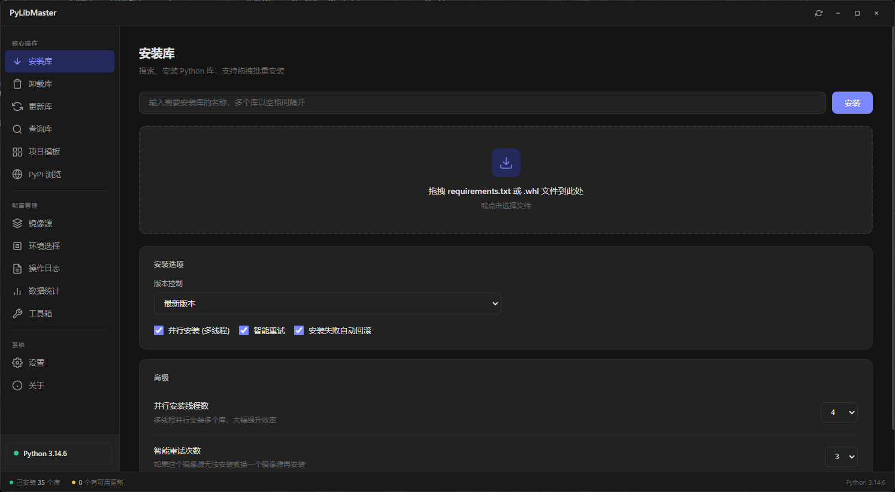
      <br/><sub>安装库 — 搜索安装、拖拽批量安装</sub>
    </td>
    <td align="center" width="50%">
      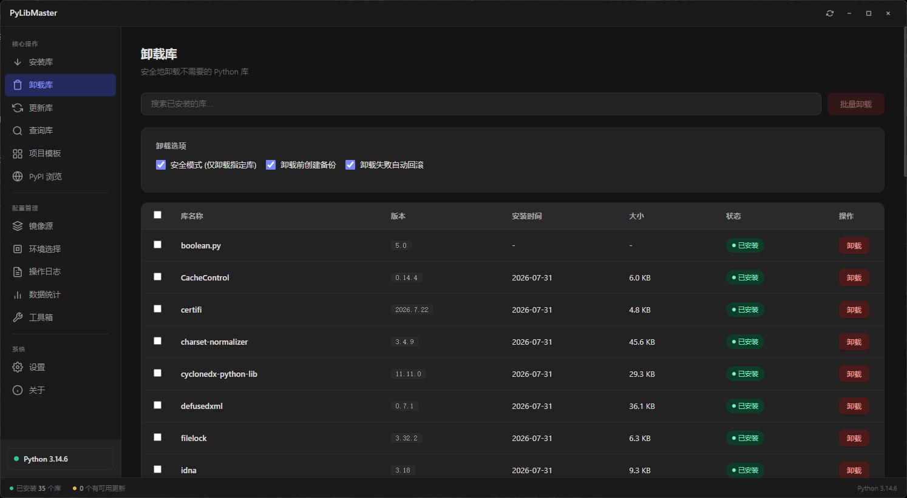
      <br/><sub>卸载库 — 安全模式、备份与回滚</sub>
    </td>
  </tr>
  <tr>
    <td align="center" width="50%">
      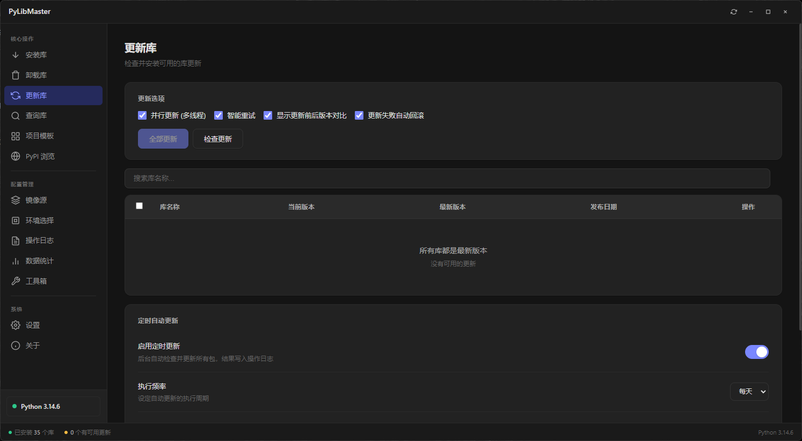
      <br/><sub>更新库 — 检查更新、定时自动更新</sub>
    </td>
    <td align="center" width="50%">
      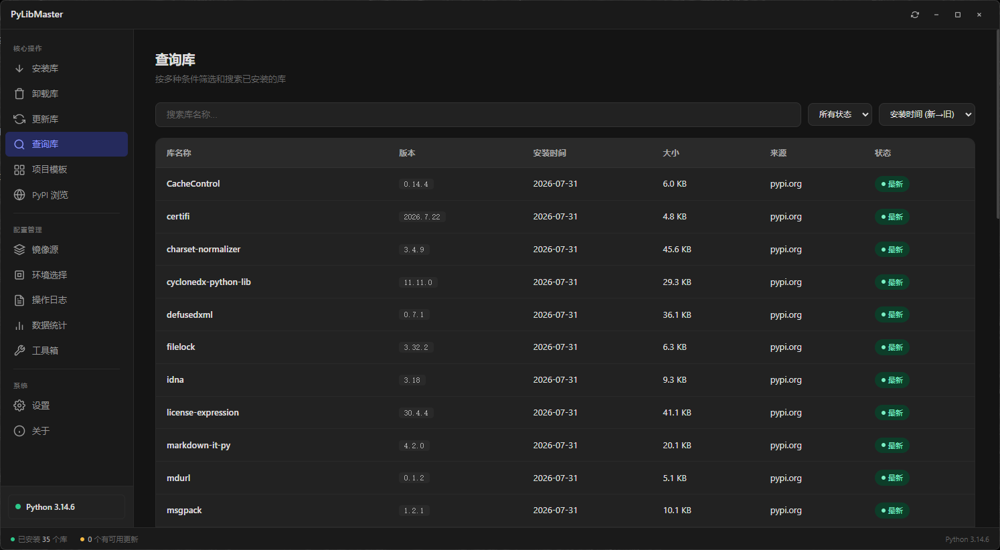
      <br/><sub>查询库 — 多条件筛选与搜索</sub>
    </td>
  </tr>
  <tr>
    <td align="center" width="50%">
      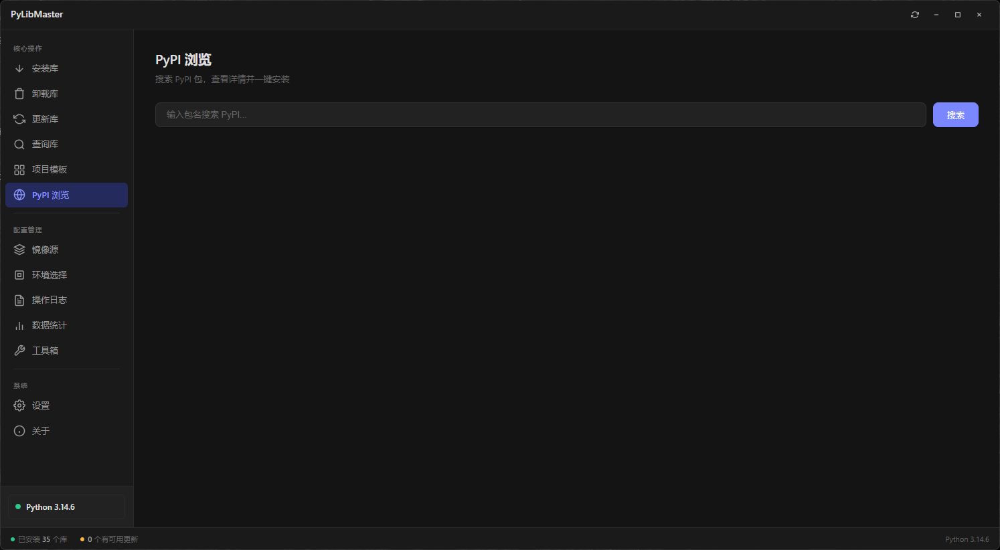
      <br/><sub>PyPI 浏览 — 搜索包并一键安装</sub>
    </td>
    <td align="center" width="50%">
      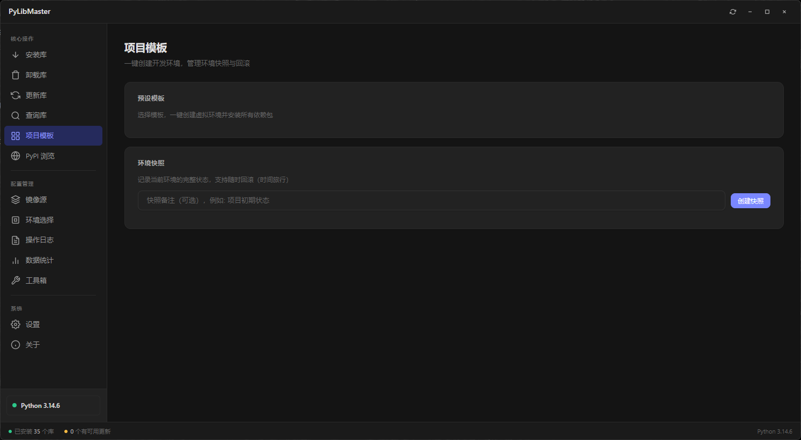
      <br/><sub>项目模板 — 环境快照与回滚</sub>
    </td>
  </tr>
  <tr>
    <td align="center" width="50%">
      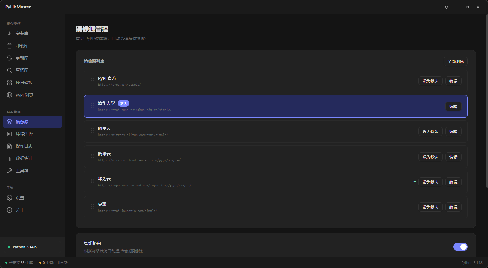
      <br/><sub>镜像源管理 — 内置国内镜像与智能路由</sub>
    </td>
    <td align="center" width="50%">
      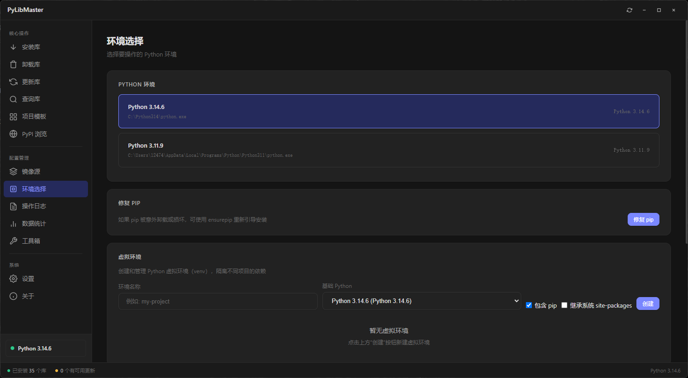
      <br/><sub>环境选择 — 多环境切换与虚拟环境</sub>
    </td>
  </tr>
  <tr>
    <td align="center" width="50%">
      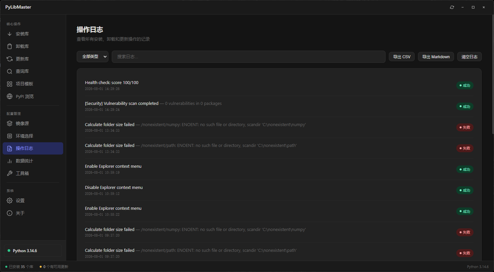
      <br/><sub>操作日志 — 完整记录与导出</sub>
    </td>
    <td align="center" width="50%">
      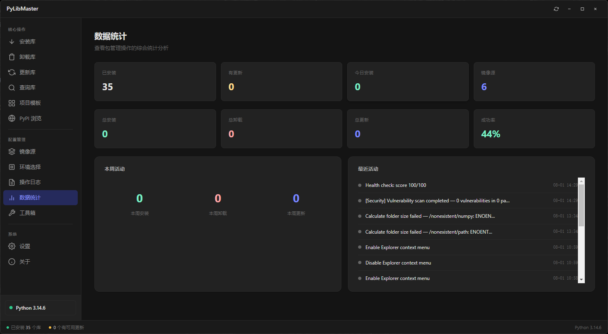
      <br/><sub>数据统计 — 操作综合统计</sub>
    </td>
  </tr>
  <tr>
    <td align="center" width="50%">
      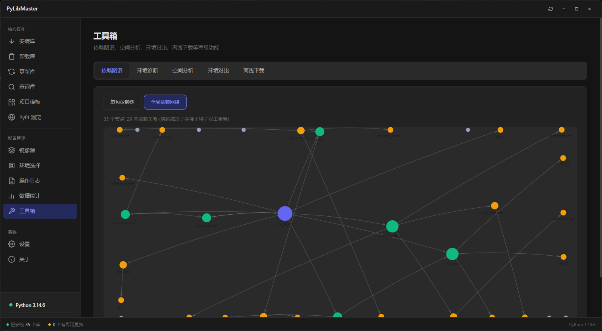
      <br/><sub>工具箱 — 依赖图谱、空间分析、环境对比</sub>
    </td>
    <td align="center" width="50%">
      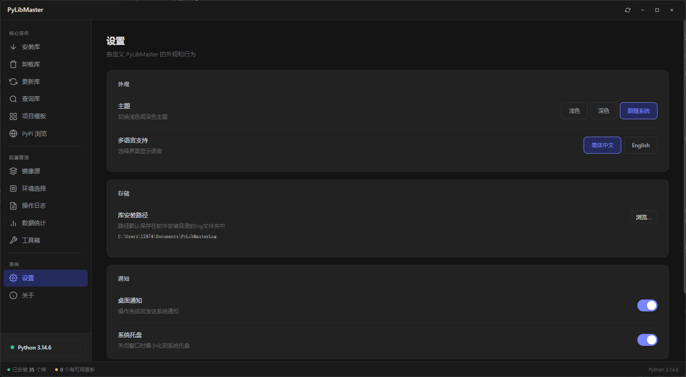
      <br/><sub>设置 — 主题、语言、通知与托盘</sub>
    </td>
  </tr>
</table>

---

## 📂 项目结构

```
PyLibMaster/
├── main.js                    # Electron 主进程入口
├── preload.js                 # 安全桥接层 (contextBridge)
├── package.json               # 项目配置
│
├── core/                      # 核心业务逻辑
│   ├── operations/            #   包管理 / 虚拟环境 / 备份 / 快照 / 撤销 / 审计
│   ├── config/                #   配置 / 镜像源 / 调度器
│   └── system/                #   环境检测 / 日志 / 资源管理器 / 自动更新
│
├── utils/                     # 工具层
│   ├── processRunner.js       #   子进程管理
│   └── security.js            #   路径安全校验
│
├── renderer/                  # 前端界面
│   ├── index.html             #   主页面
│   ├── styles.css             #   主题样式
│   ├── assets/                #   图标与 Logo
│   └── js/                    #   8 个功能模块
│
├── tests/                     # 单元测试与压力测试
├── docs/                      # 中英双语文档
└── .github/workflows/ci.yml   # GitHub Actions CI/CD
```

---

## 📖 文档导航

项目提供完整的 **中英双语** 文档：

| 文档 | 中文 | English |
|:-----|:----:|:-------:|
| 项目概述 | [zh](docs/zh/content/项目概述.md) | [en](docs/en/content/Getting%20Started.md) |
| 快速开始 | [zh](docs/zh/content/快速开始.md) | [en](docs/en/content/Getting%20Started.md) |
| 核心模块 | [zh](docs/zh/content/核心模块/核心模块.md) | [en](docs/en/content/Core%20Features/Core%20Features.md) |
| 架构设计 | [zh](docs/zh/content/架构设计/架构设计.md) | [en](docs/en/content/Core%20Features/Core%20Architecture.md) |
| API 参考 | [zh](docs/zh/content/API%20参考/API%20参考.md) | [en](docs/en/content/API%20Reference/API%20Reference.md) |
| 更新日志 | [CHANGELOG.md](docs/CHANGELOG.md) | [CHANGELOG.md](docs/CHANGELOG.md) |

---

## 🔧 技术栈

| 类别 | 技术 |
|:-----|:-----|
| 桌面框架 | [Electron](https://www.electronjs.org/) v31 |
| 打包构建 | [electron-builder](https://www.electron.build/) v25 |
| 自动更新 | [electron-updater](https://www.electron.build/auto-update) |
| 前端 | 原生 HTML / CSS / JavaScript |
| 测试 | Node.js 内置 test runner |
| CI/CD | GitHub Actions |

---

## 🤝 参与贡献

欢迎提交 [Issue](https://github.com/SoftheartedYYC/PyLibMaster/issues) 和 [Pull Request](https://github.com/SoftheartedYYC/PyLibMaster/pulls)！

---

## 📄 许可证

本项目采用 **非商业免费许可证**：

- ✅ 个人学习、研究等非商业目的：**完全免费**，可自由使用、修改、分发
- ❌ **禁止任何商业用途**（销售、出租、商业运营、集成到商业产品等）

商业使用需获得作者书面授权，请联系：softheartedyyc@gmail.com

详见 [LICENSE](LICENSE)。

---

<div align="center">

**PyLibMaster** — 让 Python 库管理更简单

Made with ❤️ by [SoftheartedYYC](https://github.com/SoftheartedYYC)

</div>
