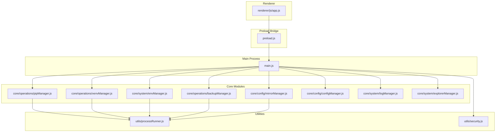
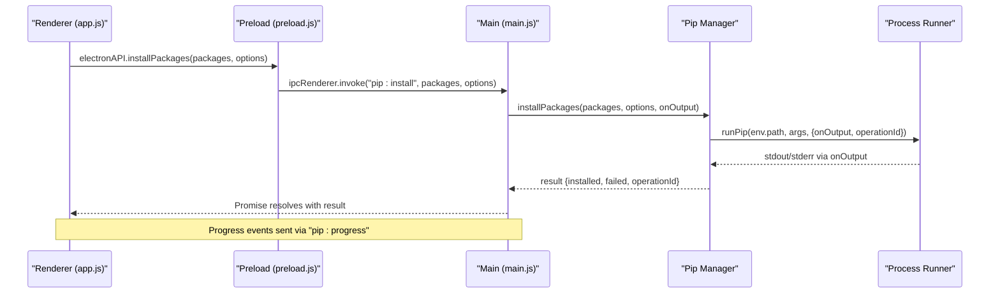
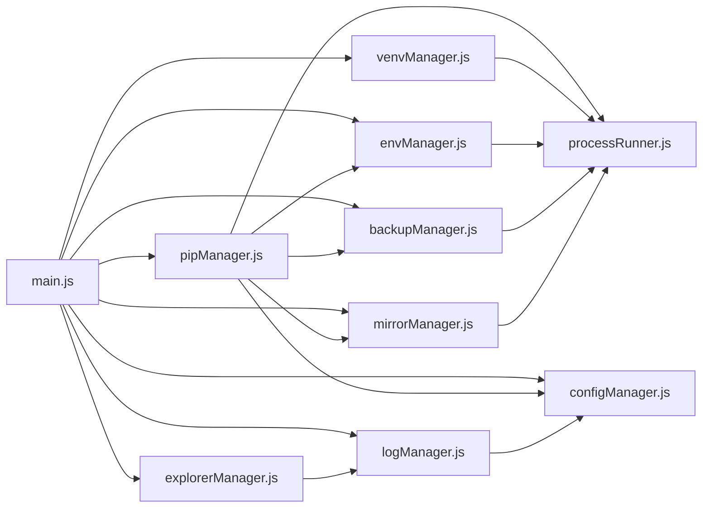

# API Reference

<cite>
**Referenced Files in This Document**
- [main.js](file://main.js)
- [preload.js](file://preload.js)
- [package.json](file://package.json)
- [pipManager.js](file://core/operations/pipManager.js)
- [envManager.js](file://core/system/envManager.js)
- [venvManager.js](file://core/operations/venvManager.js)
- [processRunner.js](file://utils/processRunner.js)
- [security.js](file://utils/security.js)
- [configManager.js](file://core/config/configManager.js)
- [mirrorManager.js](file://core/config/mirrorManager.js)
- [logManager.js](file://core/system/logManager.js)
- [backupManager.js](file://core/operations/backupManager.js)
- [explorerManager.js](file://core/system/explorerManager.js)
- [app.js](file://renderer/js/app.js)
</cite>

## Table of Contents
1. [Introduction](#introduction)
2. [Project Structure](#project-structure)
3. [Core Components](#core-components)
4. [Architecture Overview](#architecture-overview)
5. [Detailed Component Analysis](#detailed-component-analysis)
6. [Dependency Analysis](#dependency-analysis)
7. [Performance Considerations](#performance-considerations)
8. [Troubleshooting Guide](#troubleshooting-guide)
9. [Conclusion](#conclusion)
10. [Appendices](#appendices)

## Introduction
This document provides comprehensive API documentation for PyLibMaster’s IPC interfaces and module APIs. It covers:
- All main-renderer IPC handlers exposed via Electron’s preload bridge
- Request/response schemas, error handling patterns, and authentication methods
- Pip manager API for package operations (install/uninstall/update/search/export/import/compare/diff/releases/graph/download)
- Environment manager API for Python environment detection and switching
- Virtual environment manager API for venv lifecycle management
- Utility functions for process management, configuration, mirrors, logging, backups, and Windows Explorer integration
- Parameter validation, return value specifications, async operation handling, progress events, and cancellation
- Client implementation examples, error handling strategies, performance optimization techniques, security considerations, and input sanitization patterns

## Project Structure
PyLibMaster is an Electron application with a clear separation between the main process, preload bridge, renderer UI, core modules, and utilities. The main process registers all IPC handlers that delegate to core modules. The preload script exposes a safe API surface to the renderer. Core modules encapsulate business logic (pip, env, venv, backup, mirror, config, logs). Utilities provide process execution, security checks, and system integrations.

**Diagram sources**
- [main.js:1-640](file://main.js#L1-L640)
- [preload.js:1-221](file://preload.js#L1-L221)
- [pipManager.js:1-800](file://core/operations/pipManager.js#L1-L800)
- [envManager.js:1-220](file://core/system/envManager.js#L1-L220)
- [venvManager.js:1-278](file://core/operations/venvManager.js#L1-L278)
- [backupManager.js:1-196](file://core/operations/backupManager.js#L1-L196)
- [mirrorManager.js:1-376](file://core/config/mirrorManager.js#L1-L376)
- [configManager.js:1-194](file://core/config/configManager.js#L1-L194)
- [logManager.js:1-173](file://core/system/logManager.js#L1-L173)
- [explorerManager.js:1-120](file://core/system/explorerManager.js#L1-L120)
- [processRunner.js:1-366](file://utils/processRunner.js#L1-L366)
- [security.js:1-43](file://utils/security.js#L1-L43)

**Section sources**
- [main.js:1-640](file://main.js#L1-L640)
- [preload.js:1-221](file://preload.js#L1-L221)
- [package.json:1-79](file://package.json#L1-L79)

## Core Components
- IPC Handlers: Centralized in main.js; each handler maps to a specific domain (window, env, venv, pip, backup, mirror, log, config, updater, system, scheduler, template, snapshot, audit, undo, explorer).
- Preload API: Exposes typed methods on window.electronAPI for the renderer to call safely without direct Node access.
- Pip Manager: Full-featured package operations with parallelism, retries, rollback, caching, dependency analysis, disk usage, releases, graph, download, diff.
- Environment Manager: Detects Python environments, returns versions, switches current environment, persists selection.
- Virtual Environment Manager: Create/list/delete/query venvs with safety checks and output callbacks.
- Utilities: Process runner (spawn, timeout, cancel), security path validation, config persistence, mirror management, logging, backups, Windows Explorer context menu.

**Section sources**
- [main.js:233-640](file://main.js#L233-L640)
- [preload.js:20-221](file://preload.js#L20-L221)
- [pipManager.js:1-800](file://core/operations/pipManager.js#L1-L800)
- [envManager.js:1-220](file://core/system/envManager.js#L1-L220)
- [venvManager.js:1-278](file://core/operations/venvManager.js#L1-L278)
- [processRunner.js:1-366](file://utils/processRunner.js#L1-L366)
- [security.js:1-43](file://utils/security.js#L1-L43)
- [configManager.js:1-194](file://core/config/configManager.js#L1-L194)
- [mirrorManager.js:1-376](file://core/config/mirrorManager.js#L1-L376)
- [logManager.js:1-173](file://core/system/logManager.js#L1-L173)
- [backupManager.js:1-196](file://core/operations/backupManager.js#L1-L196)
- [explorerManager.js:1-120](file://core/system/explorerManager.js#L1-L120)

## Architecture Overview
The IPC architecture follows a secure bridge pattern:
- Renderer calls window.electronAPI.* methods
- Preload forwards via ipcRenderer.invoke to main process handlers
- Main handlers validate inputs, enforce security, and delegate to core modules
- Long-running operations emit progress events back to the renderer via ipcRenderer.send('pip:progress', ...)
- Errors are thrown or returned as structured responses

**Diagram sources**
- [preload.js:59-64](file://preload.js#L59-L64)
- [main.js:311-341](file://main.js#L311-L341)
- [pipManager.js:513-596](file://core/operations/pipManager.js#L513-L596)
- [processRunner.js:340-353](file://utils/processRunner.js#L340-L353)

## Detailed Component Analysis

### IPC Handlers Catalog (Main → Renderer)
All handlers are registered in main.js and exposed through preload.js. Each handler includes parameter validation, error handling, and optional progress callbacks.

- Window Control
  - window:minimize, window:maximize, window:close
  - Returns: void

- Environment Management
  - env:detect → detectEnvironments()
  - env:getCurrent → getCurrent()
  - env:switch(envPath) → switchEnvironment(envPath)
  - Returns: Array of environments, current env object, switched env object

- Virtual Environment Management
  - venv:create(options) → createVenv(options, onOutput)
  - venv:list() → listVenvs()
  - venv:delete(name) → deleteVenv(name, onOutput)
  - venv:info(name) → getVenvInfo(name)
  - Returns: venv info objects, lists, success flags

- Package Query
  - pip:list() → listInstalled()
  - pip:listCached() → listInstalledCached()
  - pip:outdated() → listOutdated()
  - pip:search(keyword) → searchPackage(keyword)
  - pip:showInfo(pkgName) → showPackageInfo(pkgName)
  - pip:depTree(pkgName) → getDependencyTree(pkgName)
  - pip:export(options) → exportRequirements(options)
  - pip:import(filePath, options) → importRequirements(filePath, options, onOutput)
  - pip:compareEnvs(envA, envB) → compareEnvironments(envA, envB)
  - Returns: arrays of packages, search results, dependency trees, requirements content, diffs

- Package Operations
  - pip:install(packages, options) → installPackages(packages, options, onOutput)
  - pip:installFromFile(filePath, options) → installFromFile(filePath, options, onOutput)
  - pip:uninstall(packages, options) → uninstallPackages(packages, options, onOutput)
  - pip:update(packages, options) → updatePackages(packages, options, onOutput)
  - pip:cancel(operationId) → cancelPipOperation(operationId)
  - pip:repair(options) → repairPip(options, onOutput)
  - pip:checkConflicts() → checkConflicts()
  - pip:healthCheck() → healthCheck()
  - Returns: { installed, failed, operationId } | { uninstalled, operationId } | { updated, failed, operationId } | boolean

- Backup & Rollback
  - backup:create() → createBackup(currentEnv)
  - backup:list() → listBackups()
  - backup:restore(backupId) → restoreBackup(backupId, currentEnv, onOutput)
  - backup:delete(backupId) → deleteBackup(backupId)
  - Returns: backup metadata, lists, restore results, deletion status

- Mirror Management
  - mirror:list() → getMirrors()
  - mirror:test(url) → testMirrorSpeed(url)
  - mirror:testAll() → testAllMirrors()
  - mirror:setDefault(url) → setDefaultMirror(url)
  - mirror:addCustom(name, url, remark) → addCustomMirror(name, url, remark)
  - mirror:update(url, updates) → updateMirror(url, updates)
  - mirror:removeCustom(url) → removeCustomMirror(url)
  - mirror:restoreDefaults() → restoreDefaultMirrors()
  - mirror:smartRoute(enabled) → setSmartRoute(enabled)
  - mirror:getSmartRoute() → getSmartRoute()
  - mirror:writePipConfig() → writePipConfig(currentEnv)
  - mirror:reorder(urlOrder) → reorderMirrors(urlOrder)
  - Returns: mirror lists, speed values, booleans, updated lists

- Logging
  - log:get(filter) → getLogs(filter)
  - log:clear() → clearLogs()
  - log:add(entry) → addLog(entry)
  - Returns: log arrays, boolean, created log entry

- Configuration
  - config:get() → getConfig()
  - config:set(key, value) → setConfig(key, value)
  - config:setBulk(updates) → setBulk(updates)
  - Returns: config object, updated config object

- System
  - system:version() → { version, name }
  - system:browseDirectory() → dialog.openDirectory()
  - system:browseFile(filters) → dialog.openFile(filters)
  - system:openPath(filePath) → shell.openPath(filePath) with allowlist
  - Returns: version object, file paths, boolean

- Notifications
  - notify:send(title, body) → Notification.show()
  - Returns: boolean

- Log Export
  - log:export(format) → CSV/Markdown export
  - Returns: saved file path or null

- Theme
  - theme:getSystem() → 'dark' | 'light'
  - Returns: string

- Scheduler
  - scheduler:getStatus() → getStatus()
  - scheduler:save(config) → saveSchedulerConfig(config) + startScheduler(callback)
  - scheduler:runNow() → runAutoUpdate(callback)
  - Returns: scheduler status, updated status

- Templates & Snapshots
  - template:list(), template:add(tpl), template:remove(id)
  - template:create(options) → createFromTemplate(options, onOutput)
  - snapshot:create(envPath, label), snapshot:list(), snapshot:detail(id)
  - snapshot:restore(snapshotId, envPath) → restoreSnapshot(snapshotId, envPath, onOutput)
  - snapshot:delete(id)
  - Returns: template/snapshot lists, creation results, details

- Audit
  - audit:run() → runAudit(onOutput)
  - audit:cached() → getCachedResult()
  - Returns: audit results, cached data

- Disk Usage
  - pip:diskUsage() → getDiskUsage()
  - Returns: size metrics

- Offline Download
  - pip:download(packages, destDir, options) → downloadPackages(packages, destDir, options, onOutput)
  - Returns: download results

- Requirements Diff
  - pip:diffRequirements(sourceA, sourceB) → diffRequirements(sourceA, sourceB)
  - Returns: diff results

- Releases
  - pip:releases(pkgName) → getPackageReleases(pkgName)
  - Returns: release history

- Dependency Graph
  - pip:depGraph() → getFullDependencyGraph()
  - Returns: graph data

- Undo
  - undo:canUndo() → canUndo()
  - undo:perform() → performUndo(onOutput)
  - undo:clear() → clear()
  - Returns: boolean, undo result, void

- Explorer Integration
  - explorer:getStatus() → getStatus()
  - explorer:enable() → enableContextMenu()
  - explorer:disable() → disableContextMenu()
  - Returns: status object, success messages

Progress Events
- Event name: pip:progress
- Payload shape: { operation: 'install'|'uninstall'|'update'|'rollback'|'audit'|'undo'|'download'|'venv', data, type }
- Emitted by core modules during long-running operations

Error Handling Patterns
- Input validation errors throw descriptive Error messages
- Filesystem/network failures propagate as Error objects with code/stdout/stderr where applicable
- Cancellation returns partial results or throws with explicit messages
- Auto-rollback triggers when enabled and operations fail

Authentication Methods
- No user authentication required within the app; security relies on sandboxing, context isolation, and path allowlists

Client Implementation Notes
- Use window.electronAPI.* methods from renderer
- Subscribe to progress events via api.onProgress(callback)
- Handle promises and catch errors appropriately
- For long-running tasks, track operationId for cancellation

**Section sources**
- [main.js:233-640](file://main.js#L233-L640)
- [preload.js:20-221](file://preload.js#L20-L221)
- [pipManager.js:1-800](file://core/operations/pipManager.js#L1-L800)
- [envManager.js:1-220](file://core/system/envManager.js#L1-L220)
- [venvManager.js:1-278](file://core/operations/venvManager.js#L1-L278)
- [backupManager.js:1-196](file://core/operations/backupManager.js#L1-L196)
- [mirrorManager.js:1-376](file://core/config/mirrorManager.js#L1-L376)
- [logManager.js:1-173](file://core/system/logManager.js#L1-L173)
- [configManager.js:1-194](file://core/config/configManager.js#L1-L194)
- [processRunner.js:1-366](file://utils/processRunner.js#L1-L366)
- [security.js:1-43](file://utils/security.js#L1-L43)
- [explorerManager.js:1-120](file://core/system/explorerManager.js#L1-L120)

### Pip Manager API
Responsibilities:
- Query installed packages (real-time and cached)
- Search packages using pip index versions
- Install/uninstall/update with parallelism, retries, auto-rollback
- Import/export requirements, compare environments, diff requirements
- Get dependency tree, full dependency graph, disk usage, releases
- Download packages offline, repair pip, health check, conflict detection

Key behaviors:
- buildPackageSpec validates names, versions, wheel paths, prevents command injection and path traversal
- Environment-level locks prevent concurrent operations per Python environment
- Parallel installation uses configurable thread count
- Multi-mirror retry strategy improves reliability
- Automatic backup and rollback on failure when enabled
- Progress events emitted for each package operation

Return values:
- listInstalled/listInstalledCached: array of package objects with name, version, installed date, size info, source
- listOutdated: array of { name, current, latest, date }
- searchPackage: { keyword, result, error? }
- installPackages/installFromFile: { installed, failed, operationId }
- uninstallPackages: { uninstalled, operationId }
- updatePackages: { updated, failed, operationId }
- exportRequirements: requirements text
- importRequirements: { installed, failed, operationId }
- compareEnvironments: diff structure
- diffRequirements: diff structure
- getDependencyTree/getFullDependencyGraph: dependency structures
- getDiskUsage: size metrics
- getPackageReleases: release history
- downloadPackages: download results

Parameter validation:
- Package names must match strict regex
- Version specs validated against allowed characters and length limits
- Wheel paths validated for absolute paths, no UNC, no sensitive directories, no illegal characters
- File types restricted to .whl and .txt for import

Async handling:
- All operations return Promises
- onOutput callback receives structured progress lines
- operationId enables cancellation via pip:cancel

Security:
- Input sanitization for package names and versions
- Path traversal prevention for wheel files
- Environment isolation via locks

Performance:
- site-packages path cache with TTL
- Installed packages cache with 5-minute TTL
- Parallel threads configurable
- Fast size estimation using directory map and caching

**Section sources**
- [pipManager.js:1-800](file://core/operations/pipManager.js#L1-L800)

### Environment Manager API
Responsibilities:
- Detect available Python environments across common locations and PATH
- Retrieve Python and pip versions
- Switch current environment and persist selection

Methods:
- detectEnvironments(): Promise<Array<{ name, path, version, pipVersion }>>
- getCurrent(): Object|null
- switchEnvironment(envPath): Object
- startDetection(): void (background detection)

Behavior:
- Uses glob patterns and `where python` to discover environments
- Filters out environments without pip
- Restores previously selected environment if still valid
- Auto-selects first environment if none selected

Validation:
- Ensures pip presence before including environment
- Validates existence of target path on switch

**Section sources**
- [envManager.js:1-220](file://core/system/envManager.js#L1-L220)

### Virtual Environment Manager API
Responsibilities:
- Create venvs with options (with pip, inherit system packages)
- List existing venvs with metadata (Python version, pip version, package count)
- Delete venvs safely with path traversal protection
- Get detailed venv info including base Python path

Methods:
- createVenv(options, onOutput): Promise<Object>
- listVenvs(): Promise<Array<Object>>
- deleteVenv(name, onOutput): Promise<Object>
- getVenvInfo(name): Promise<Object>

Validation:
- Venv name regex and length limits
- Base Python path existence check
- Path traversal prevention on delete

Output callbacks:
- onOutput emits progress lines during creation/deletion

**Section sources**
- [venvManager.js:1-278](file://core/operations/venvManager.js#L1-L278)

### Process Runner Utilities
Responsibilities:
- Spawn child processes with UTF-8 encoding, timeouts, and ANSI stripping
- Track active processes and support cancellation by processId or operationId
- Ensure pip availability with automatic installation via ensurepip or get-pip.py
- Provide convenience wrappers for pip and Python commands

Key features:
- runCommand(command, args, options): Promise<{stdout, stderr, code}>
- runPip(pythonPath, args, options): Promise
- runPython(pythonPath, args, options): Promise
- ensurePip(pythonPath, onOutput): Promise<boolean>
- cancelProcess(processId): boolean
- cancelOperation(operationId): number
- cancelAllProcesses(): number

Timeout and cancellation:
- Graceful SIGTERM followed by SIGKILL after delay
- Operation-scoped cancellation supports batch operations

Download resilience:
- Multiple fallback URLs for get-pip.py
- Redirect handling and timeout management

**Section sources**
- [processRunner.js:1-366](file://utils/processRunner.js#L1-L366)

### Security Utilities
Responsibilities:
- Validate target paths against allowlisted directories
- Prevent path traversal attacks

Function:
- isAllowedOpenPath(targetPath, allowedDirs): boolean

Usage:
- Used by system:openPath to restrict file opening to safe directories

**Section sources**
- [security.js:1-43](file://utils/security.js#L1-L43)

### Configuration Manager
Responsibilities:
- Persist application settings to JSON file
- Sanitize numeric values within configured ranges
- Provide deep copies to prevent external mutation

Functions:
- getConfig(): Object
- setConfig(key, value): Object
- setBulk(updates): Object
- getStoragePath(): string

Defaults:
- parallelThreads, retryCount, smartRoute, currentEnv, windowBounds, storagePath

Atomic writes:
- Write to temp file then rename to avoid corruption

**Section sources**
- [configManager.js:1-194](file://core/config/configManager.js#L1-L194)

### Mirror Manager
Responsibilities:
- Manage built-in and custom PyPI mirrors
- Test mirror speeds and select best mirror
- Write effective mirror to pip config
- Reorder mirrors and toggle smart routing

Functions:
- getMirrors(), getDefaultMirror(), setDefaultMirror(url)
- addCustomMirror(name, url, remark), updateMirror(url, updates), removeCustomMirror(url)
- restoreDefaultMirrors()
- testMirrorSpeed(url), testAllMirrors()
- setSmartRoute(enabled), getSmartRoute()
- getEffectiveMirror(): Promise<Object>
- writePipConfig(env): Promise<boolean>
- buildMirrorArgs(env): string[]
- reorderMirrors(urlOrder): Array

Validation:
- URL protocol enforcement (http/https)
- Length limits and uniqueness checks

**Section sources**
- [mirrorManager.js:1-376](file://core/config/mirrorManager.js#L1-L376)

### Log Manager
Responsibilities:
- Record operations with timestamps and truncation
- Debounced saves to reduce I/O
- Query logs with filters and search
- Clear logs and flush on shutdown

Functions:
- addLog(entry): Object
- getLogs(filter): Array
- clearLogs(): boolean
- flushLogs(): void

Limits:
- Max 2000 entries
- Field truncation to 1000 chars
- Search keyword max 200 chars

**Section sources**
- [logManager.js:1-173](file://core/system/logManager.js#L1-L173)

### Backup Manager
Responsibilities:
- Create backups using pip freeze
- List backups sorted by time
- Restore environments from backups with force-reinstall
- Delete backups with ID validation

Functions:
- createBackup(env): Promise<Object>
- listBackups(): Array<Object>
- restoreBackup(backupId, env, onOutput): Promise
- deleteBackup(backupId): boolean

Security:
- Backup ID format validation prevents path traversal
- Strict naming convention enforced

**Section sources**
- [backupManager.js:1-196](file://core/operations/backupManager.js#L1-L196)

### Explorer Manager (Windows)
Responsibilities:
- Enable/disable Windows Explorer context menu entries
- Register registry keys under HKCU (no admin rights needed)

Functions:
- isContextMenuEnabled(): boolean
- enableContextMenu(): Object
- disableContextMenu(): Object
- getStatus(): Object

Behavior:
- Adds “Open with PyLibMaster” and “Create virtual environment here” menu items
- Logs actions and handles errors gracefully

**Section sources**
- [explorerManager.js:1-120](file://core/system/explorerManager.js#L1-L120)

## Dependency Analysis
High-level dependencies:
- main.js depends on all core modules and utilities
- preload.js bridges renderer to main via ipcRenderer.invoke
- pipManager depends on processRunner, mirrorManager, backupManager, configManager, envManager, logManager
- venvManager depends on processRunner, configManager, logManager
- envManager depends on processRunner, configManager
- mirrorManager depends on configManager, processRunner
- backupManager depends on processRunner, configManager, logManager
- logManager depends on configManager
- explorerManager depends on logManager

**Diagram sources**
- [main.js:1-640](file://main.js#L1-L640)
- [pipManager.js:1-800](file://core/operations/pipManager.js#L1-L800)
- [envManager.js:1-220](file://core/system/envManager.js#L1-L220)
- [venvManager.js:1-278](file://core/operations/venvManager.js#L1-L278)
- [backupManager.js:1-196](file://core/operations/backupManager.js#L1-L196)
- [mirrorManager.js:1-376](file://core/config/mirrorManager.js#L1-L376)
- [configManager.js:1-194](file://core/config/configManager.js#L1-L194)
- [logManager.js:1-173](file://core/system/logManager.js#L1-L173)
- [explorerManager.js:1-120](file://core/system/explorerManager.js#L1-L120)
- [processRunner.js:1-366](file://utils/processRunner.js#L1-L366)

**Section sources**
- [main.js:1-640](file://main.js#L1-L640)

## Performance Considerations
- Use cached package lists (listInstalledCached) for fast UI rendering
- Configure parallelThreads based on CPU cores and network bandwidth
- Enable smartRoute for optimal mirror selection
- Leverage debounced logging and atomic config writes to minimize I/O contention
- Avoid redundant scans by relying on site-packages path cache and installed cache TTL
- Cancel long-running operations via operationId when appropriate

[No sources needed since this section provides general guidance]

## Troubleshooting Guide
Common issues and resolutions:
- pip not found: ensurePip attempts ensurepip and get-pip.py; verify network connectivity and Python installation
- Timeout errors: increase timeout for large installations or slow networks
- Permission errors: ensure proper user permissions for writing to storage paths and registry (Windows)
- Path traversal blocked: validate input paths and use allowlist for openPath
- Mirror failures: test mirrors and adjust order; enable smartRoute
- Conflicting packages: run healthCheck and checkConflicts to diagnose
- Undo operations: use undo:perform to revert recent changes

Error propagation:
- Core modules throw descriptive Error objects
- Process runner attaches code, stdout, stderr to errors
- Renderer should catch and display meaningful messages

**Section sources**
- [processRunner.js:136-161](file://utils/processRunner.js#L136-L161)
- [pipManager.js:154-235](file://core/operations/pipManager.js#L154-L235)
- [security.js:28-40](file://utils/security.js#L28-L40)

## Conclusion
PyLibMaster provides a robust, secure, and high-performance IPC interface for managing Python environments and packages. The modular architecture ensures clear separation of concerns, while comprehensive validation and error handling maintain reliability. Clients can implement efficient workflows using async operations, progress events, and cancellation. Security is enforced through input sanitization, path allowlists, and sandboxing.

[No sources needed since this section summarizes without analyzing specific files]

## Appendices

### Client Implementation Example (Conceptual)
- Initialize progress listener: api.onProgress((payload) => { /* update UI */ })
- Install packages: try { const result = await api.installPackages(['numpy', 'pandas'], { parallel: true, retry: true }); } catch (err) { /* handle error */ }
- Cancel operation: api.cancelPipOperation(result.operationId)
- Listen for updates: api.onUpdatesAvailable((count) => { /* notify user */ })

[No sources needed since this section doesn't analyze specific files]

### Security Considerations and Input Sanitization
- Package names and version specs validated via strict regex
- Wheel paths checked for absolute paths, no UNC, no sensitive directories, no illegal characters
- Open path restricted to allowlisted directories
- Backup IDs validated to prevent path traversal
- Context isolation and disabled Node integration in renderer enhance security

**Section sources**
- [pipManager.js:154-235](file://core/operations/pipManager.js#L154-L235)
- [security.js:28-40](file://utils/security.js#L28-L40)
- [backupManager.js:62-78](file://core/operations/backupManager.js#L62-L78)