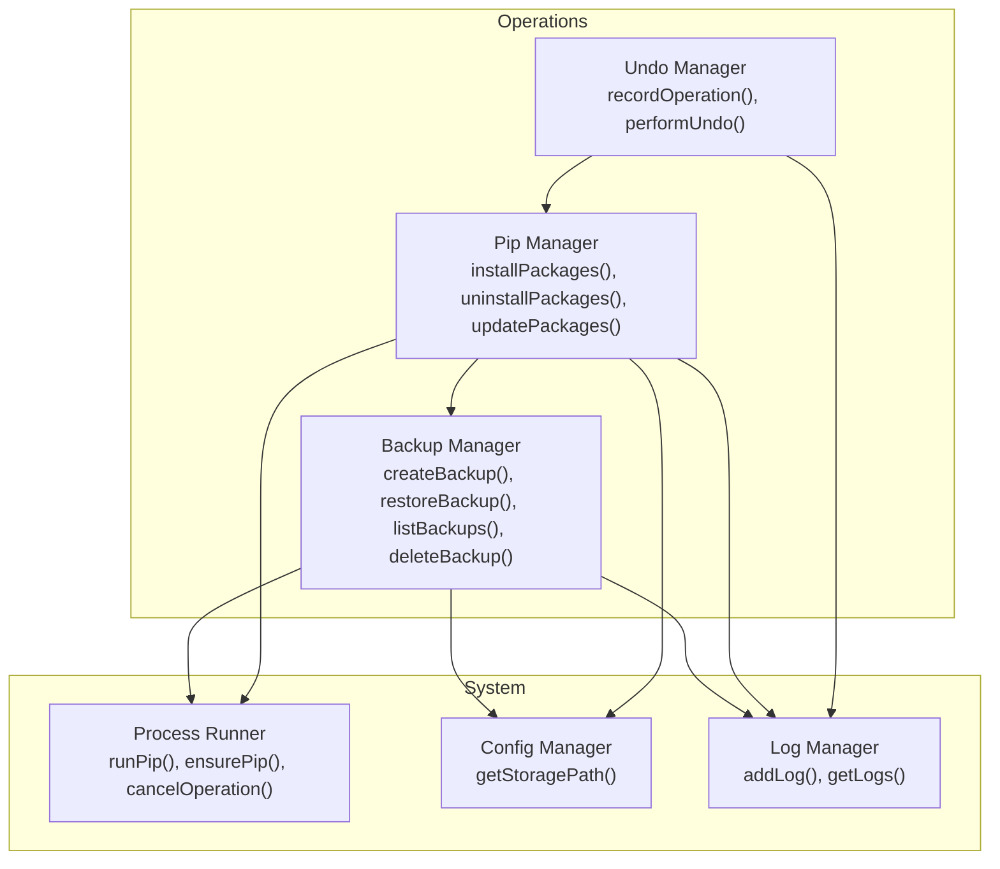
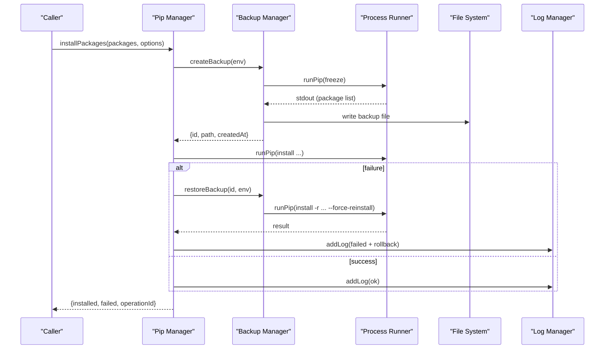
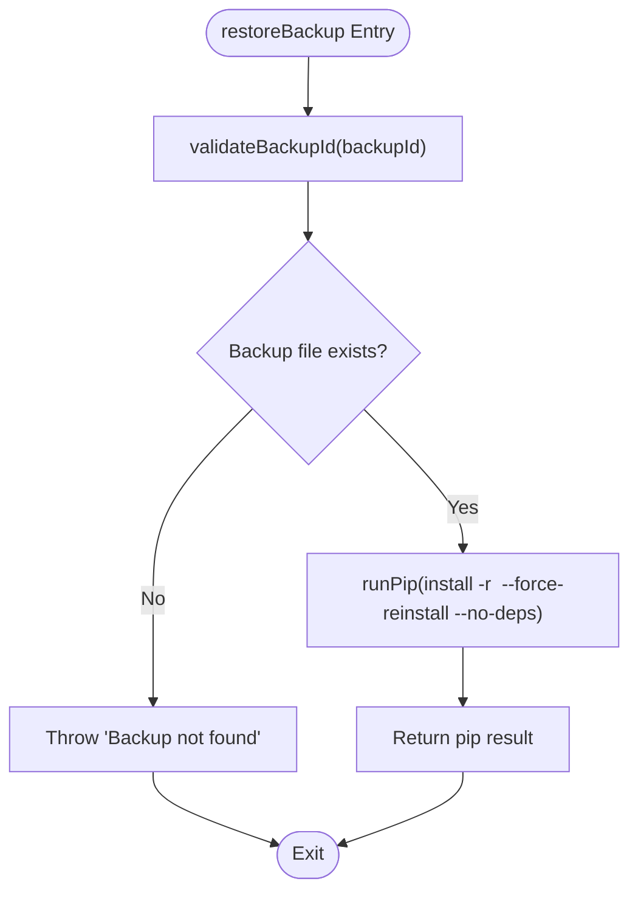
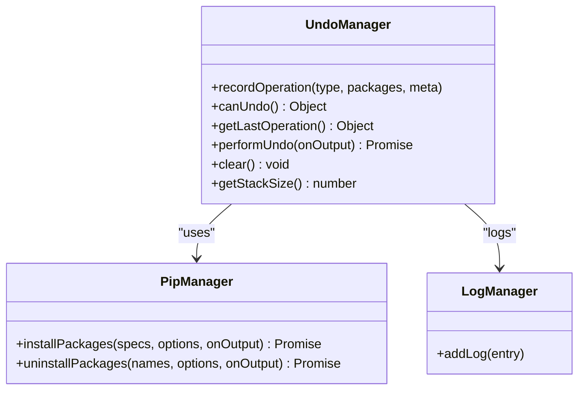
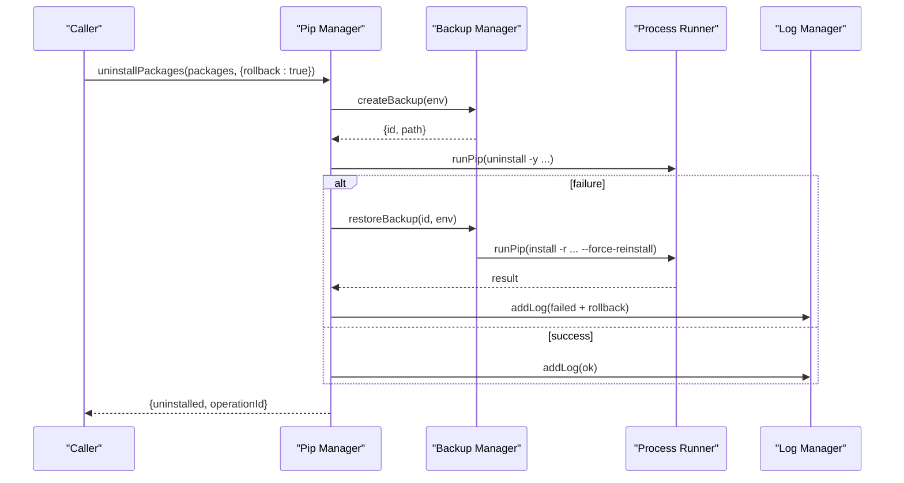
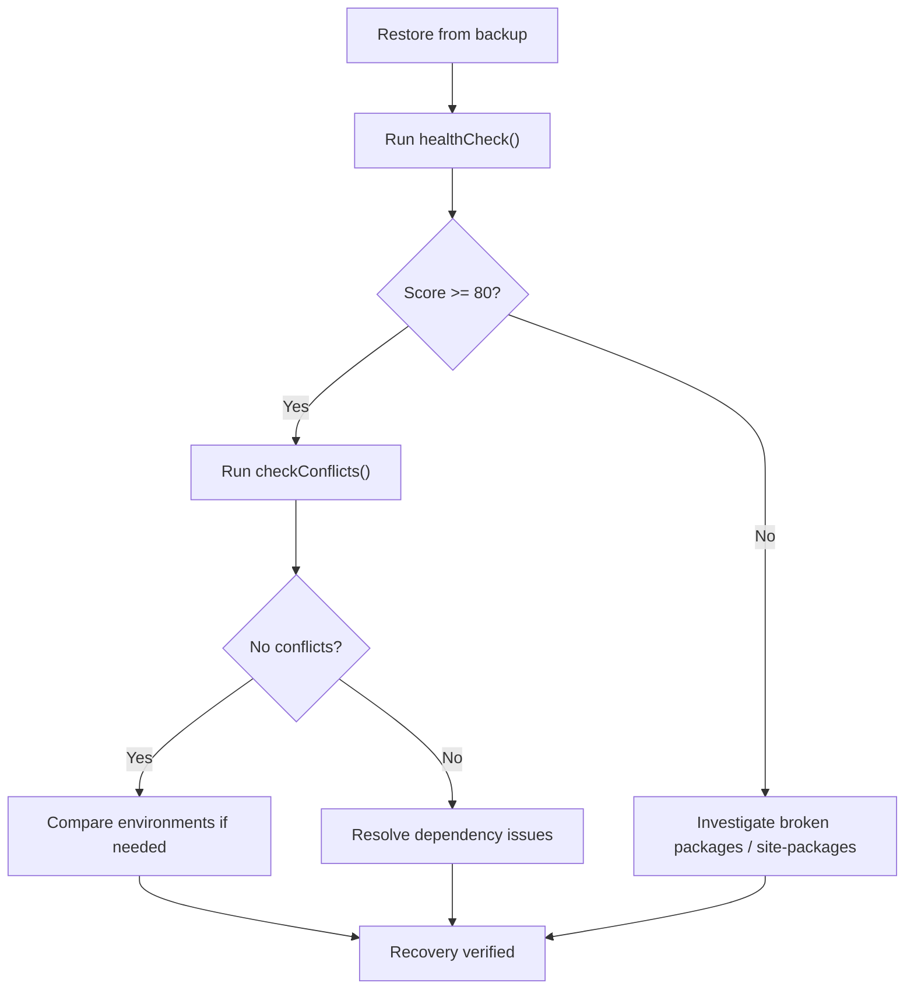
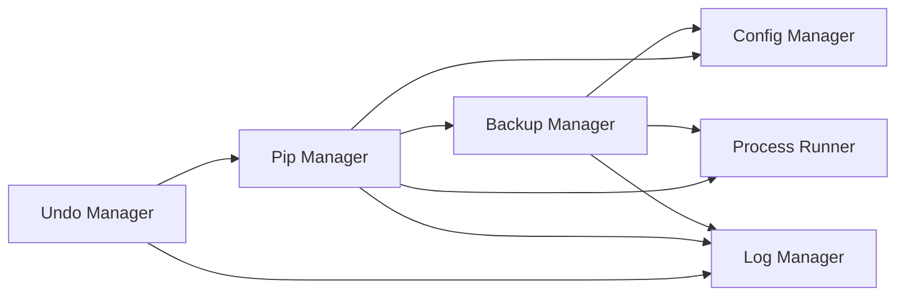

# Backup Manager API

<cite>
**Referenced Files in This Document**
- [backupManager.js](file://core/operations/backupManager.js)
- [undoManager.js](file://core/operations/undoManager.js)
- [pipManager.js](file://core/operations/pipManager.js)
- [processRunner.js](file://utils/processRunner.js)
- [configManager.js](file://core/config/configManager.js)
- [logManager.js](file://core/system/logManager.js)
</cite>

## Table of Contents
1. [Introduction](#introduction)
2. [Project Structure](#project-structure)
3. [Core Components](#core-components)
4. [Architecture Overview](#architecture-overview)
5. [Detailed Component Analysis](#detailed-component-analysis)
6. [Dependency Analysis](#dependency-analysis)
7. [Performance Considerations](#performance-considerations)
8. [Troubleshooting Guide](#troubleshooting-guide)
9. [Conclusion](#conclusion)
10. [Appendices](#appendices)

## Introduction
This document provides comprehensive API documentation for the Backup Manager module and its integrations with package management, undo operations, process execution, configuration, and logging. It covers automated backup creation, restoration, listing, deletion, point-in-time recovery via backups, verification through environment health checks, storage location management, retention considerations, and performance optimization techniques. It also documents the Undo Manager’s transactional capabilities and rollback behavior, along with practical strategies such as incremental-style workflows, cross-platform compatibility notes, and disaster recovery scenarios.

## Project Structure
The Backup Manager is implemented under core/operations/backupManager.js and integrates with:
- pipManager for automatic backup-and-rollback during install/uninstall/update operations
- processRunner for executing pip commands with timeouts, cancellation, and output streaming
- configManager for storage path resolution and defaults
- logManager for audit trails and error tracking
- undoManager for transactional undo stacks around package operations

**Diagram sources**
- [backupManager.js:1-196](file://core/operations/backupManager.js#L1-L196)
- [undoManager.js:1-131](file://core/operations/undoManager.js#L1-L131)
- [pipManager.js:1-1615](file://core/operations/pipManager.js#L1-L1615)
- [processRunner.js:1-366](file://utils/processRunner.js#L1-L366)
- [configManager.js:1-194](file://core/config/configManager.js#L1-L194)
- [logManager.js:1-176](file://core/system/logManager.js#L1-L176)

**Section sources**
- [backupManager.js:1-196](file://core/operations/backupManager.js#L1-L196)
- [pipManager.js:1-1615](file://core/operations/pipManager.js#L1-L1615)
- [processRunner.js:1-366](file://utils/processRunner.js#L1-L366)
- [configManager.js:1-194](file://core/config/configManager.js#L1-L194)
- [logManager.js:1-176](file://core/system/logManager.js#L1-L176)
- [undoManager.js:1-131](file://core/operations/undoManager.js#L1-L131)

## Core Components
- Backup Manager (backupManager.js): Creates text-based snapshots of installed packages using pip freeze; lists, restores from, and deletes backups; validates backup IDs to prevent path traversal.
- Pip Manager (pipManager.js): Orchestrates package operations with optional automatic backup creation and rollback on failure; integrates with mirrors and parallelism.
- Process Runner (processRunner.js): Executes pip/Python commands with timeout, cancellation, ANSI stripping, and progress callbacks.
- Config Manager (configManager.js): Provides storage paths and default settings; ensures directories exist.
- Log Manager (logManager.js): Persists operation logs with filtering and capacity limits.
- Undo Manager (undoManager.js): Maintains a stack of recent operations and performs reverse actions (uninstall/reinstall/rollback).

Key APIs exposed by Backup Manager:
- createBackup(env): Creates a snapshot file named backup_{envName}_{timestamp}.txt in {storagePath}/backups/.
- listBackups(): Returns sorted list of backups with id, path, createdAt, size.
- restoreBackup(backupId, env, onOutput?): Restores environment using pip install -r with force-reinstall and no-deps flags.
- deleteBackup(backupId): Deletes a specific backup after validation.
- validateBackupId(backupId): Validates format and prevents path traversal attacks.

**Section sources**
- [backupManager.js:25-196](file://core/operations/backupManager.js#L25-L196)
- [pipManager.js:513-596](file://core/operations/pipManager.js#L513-L596)
- [processRunner.js:340-342](file://utils/processRunner.js#L340-L342)
- [configManager.js:185-191](file://core/config/configManager.js#L185-L191)
- [logManager.js:115-134](file://core/system/logManager.js#L115-L134)
- [undoManager.js:22-106](file://core/operations/undoManager.js#L22-L106)

## Architecture Overview
Backup Manager integrates into the broader package management workflow:
- Before risky operations (install/uninstall/update), Pip Manager optionally creates a backup via Backup Manager.
- If an operation fails and auto-rollback is enabled, Pip Manager calls Backup Manager to restore the environment from the created backup.
- Undo Manager records operations and can revert them by invoking Pip Manager with inverse actions.
- All operations are logged via Log Manager and executed through Process Runner with robust timeout/cancellation handling.

**Diagram sources**
- [pipManager.js:513-596](file://core/operations/pipManager.js#L513-L596)
- [backupManager.js:89-113](file://core/operations/backupManager.js#L89-L113)
- [processRunner.js:340-342](file://utils/processRunner.js#L340-L342)
- [logManager.js:115-134](file://core/system/logManager.js#L115-L134)

## Detailed Component Analysis

### Backup Manager API
- createBackup(env)
  - Purpose: Snapshot current environment’s installed packages using pip freeze.
  - Storage: Writes to {storagePath}/backups/backup_{envName}_{ISO timestamp}.txt.
  - Output: Returns id, path, createdAt, envName, envPath.
  - Error handling: Logs failures and throws descriptive errors.
- listBackups()
  - Purpose: Enumerate all backups, filter by naming convention, sort newest first.
  - Output: Array of objects with id, path, createdAt, size.
  - Error handling: Logs and returns empty array on failure.
- restoreBackup(backupId, env, onOutput?)
  - Purpose: Restore environment to state captured in backup using pip install -r with force-reinstall and no-deps.
  - Validation: Uses validateBackupId to prevent path traversal and enforce format.
  - Execution: Delegates to processRunner.runPip with extended timeout.
- deleteBackup(backupId)
  - Purpose: Delete a validated backup file.
  - Error handling: Logs and throws on failure.
- validateBackupId(backupId)
  - Purpose: Enforce safe filename format and length; reject path traversal patterns.

**Diagram sources**
- [backupManager.js:156-170](file://core/operations/backupManager.js#L156-L170)
- [backupManager.js:62-78](file://core/operations/backupManager.js#L62-L78)
- [processRunner.js:340-342](file://utils/processRunner.js#L340-L342)

**Section sources**
- [backupManager.js:29-196](file://core/operations/backupManager.js#L29-L196)

### Undo Manager API
- recordOperation(type, packages, meta?)
  - Records install/uninstall/update operations with package details and metadata.
  - Maintains a bounded stack (max 20 entries).
- canUndo()
  - Returns availability and last action summary.
- getLastOperation()
  - Retrieves the most recent recorded operation.
- performUndo(onOutput?)
  - Reverses the last operation:
    - Install → Uninstall those packages
    - Uninstall → Reinstall with versions if available
    - Update → Roll back to old versions stored in meta.oldVersions
  - On failure, re-pushes the operation onto the stack and logs.
- clear(), getStackSize()
  - Utility functions for stack management.

**Diagram sources**
- [undoManager.js:22-106](file://core/operations/undoManager.js#L22-L106)
- [pipManager.js:513-596](file://core/operations/pipManager.js#L513-L596)
- [logManager.js:115-134](file://core/system/logManager.js#L115-L134)

**Section sources**
- [undoManager.js:1-131](file://core/operations/undoManager.js#L1-L131)

### Integration with Pip Manager
- Automatic backup creation before risky operations:
  - installPackages, uninstallPackages, updatePackages may call createBackup when auto-rollback is enabled.
- Automatic rollback on failure:
  - If an operation fails and rollback is enabled, restoreBackup is invoked to revert to the pre-operation state.
- Progress and logging:
  - onOutput callbacks stream progress; addLog records outcomes and rollback events.

**Diagram sources**
- [pipManager.js:745-789](file://core/operations/pipManager.js#L745-L789)
- [backupManager.js:156-170](file://core/operations/backupManager.js#L156-L170)
- [processRunner.js:340-342](file://utils/processRunner.js#L340-L342)
- [logManager.js:115-134](file://core/system/logManager.js#L115-L134)

**Section sources**
- [pipManager.js:513-596](file://core/operations/pipManager.js#L513-L596)
- [pipManager.js:745-789](file://core/operations/pipManager.js#L745-L789)
- [pipManager.js:805-885](file://core/operations/pipManager.js#L805-L885)

### Point-in-Time Recovery and Verification
- Point-in-time recovery:
  - Use restoreBackup with a known backup ID to return the environment to a previous state.
- Verification:
  - Use healthCheck and checkConflicts from Pip Manager to verify environment integrity post-restoration.
  - Compare environments using compareEnvironments to validate parity between restored and target states.

**Diagram sources**
- [pipManager.js:1510-1584](file://core/operations/pipManager.js#L1510-L1584)
- [pipManager.js:1460-1503](file://core/operations/pipManager.js#L1460-L1503)
- [pipManager.js:1161-1200](file://core/operations/pipManager.js#L1161-L1200)

**Section sources**
- [pipManager.js:1510-1584](file://core/operations/pipManager.js#L1510-L1584)
- [pipManager.js:1460-1503](file://core/operations/pipManager.js#L1460-L1503)
- [pipManager.js:1161-1200](file://core/operations/pipManager.js#L1161-L1200)

### Compression Options
- Current implementation stores backups as plain text files generated by pip freeze.
- No built-in compression is provided in Backup Manager or Pip Manager.
- Recommendation:
  - Compress backups externally (e.g., gzip) after creation if storage constraints require it.
  - Ensure decompression and integrity checks are performed prior to restore.

[No sources needed since this section provides general guidance]

### Storage Location Management
- Storage root:
  - Determined by configManager.getStoragePath().
- Backups directory:
  - Created automatically at {storagePath}/backups/ if missing.
- Logs directory:
  - Managed by logManager at {storagePath}/logs/operations.json.

**Section sources**
- [configManager.js:185-191](file://core/config/configManager.js#L185-L191)
- [backupManager.js:29-34](file://core/operations/backupManager.js#L29-L34)
- [logManager.js:41-46](file://core/system/logManager.js#L41-L46)

### Retention Policies and Space Management
- Built-in retention policy:
  - Not implemented in Backup Manager; backups persist until explicitly deleted.
- Space management recommendations:
  - Implement periodic cleanup based on age or count thresholds.
  - Use listBackups() to enumerate and delete older backups via deleteBackup().
  - Monitor disk usage via Pip Manager’s getDiskUsage() to inform retention decisions.

**Section sources**
- [backupManager.js:122-142](file://core/operations/backupManager.js#L122-L142)
- [pipManager.js:1208-1230](file://core/operations/pipManager.js#L1208-L1230)

### Performance Optimization Techniques
- Parallel operations:
  - Pip Manager supports parallel installs/updates with configurable thread counts.
- Retry and mirror fallback:
  - Pip Manager retries across multiple mirrors to improve reliability and speed.
- Caching:
  - Installed packages cache with TTL; site-packages path caching reduces repeated lookups.
- Process runner optimizations:
  - Timeout and SIGTERM/SIGKILL strategy; active process tracking for cancellation.
- Logging efficiency:
  - Debounced writes and field truncation to avoid oversized logs.

**Section sources**
- [pipManager.js:545-558](file://core/operations/pipManager.js#L545-L558)
- [pipManager.js:608-633](file://core/operations/pipManager.js#L608-L633)
- [pipManager.js:89-127](file://core/operations/pipManager.js#L89-L127)
- [processRunner.js:150-160](file://utils/processRunner.js#L150-L160)
- [logManager.js:72-86](file://core/system/logManager.js#L72-L86)

### Cross-Platform Compatibility
- Path handling:
  - Uses Node.js path utilities to normalize and validate paths across platforms.
- Encoding:
  - Forces UTF-8 encoding for Python processes to avoid garbled output.
- Windows-specific:
  - Hides console windows for spawned processes; uses drive-letter absolute paths for wheel files.
- Unix-like systems:
  - Supports standard Unix paths and avoids sensitive system directories.

**Section sources**
- [processRunner.js:85-98](file://utils/processRunner.js#L85-L98)
- [pipManager.js:178-206](file://core/operations/pipManager.js#L178-L206)

### Disaster Recovery Scenarios
- Scenario 1: Corrupted environment after update
  - Use restoreBackup with the latest valid backup ID to revert to a stable state.
  - Verify with healthCheck and checkConflicts.
- Scenario 2: Missing pip
  - Repair pip using repairPip which attempts ensurepip then get-pip.py fallback.
- Scenario 3: Large-scale rollback
  - Use Pip Manager’s rollback integration to automatically restore from backup on failure.

**Section sources**
- [pipManager.js:968-1014](file://core/operations/pipManager.js#L968-L1014)
- [pipManager.js:1510-1584](file://core/operations/pipManager.js#L1510-L1584)
- [backupManager.js:156-170](file://core/operations/backupManager.js#L156-L170)

## Dependency Analysis
Backup Manager depends on:
- configManager for storage path resolution
- processRunner for pip execution
- logManager for audit trails
- pipManager for integrated backup-and-rollback workflows
- undoManager for transactional undo stacks

**Diagram sources**
- [backupManager.js:1-196](file://core/operations/backupManager.js#L1-L196)
- [pipManager.js:1-1615](file://core/operations/pipManager.js#L1-L1615)
- [processRunner.js:1-366](file://utils/processRunner.js#L1-L366)
- [configManager.js:1-194](file://core/config/configManager.js#L1-L194)
- [logManager.js:1-176](file://core/system/logManager.js#L1-L176)
- [undoManager.js:1-131](file://core/operations/undoManager.js#L1-L131)

**Section sources**
- [backupManager.js:1-196](file://core/operations/backupManager.js#L1-L196)
- [pipManager.js:1-1615](file://core/operations/pipManager.js#L1-L1615)
- [processRunner.js:1-366](file://utils/processRunner.js#L1-L366)
- [configManager.js:1-194](file://core/config/configManager.js#L1-L194)
- [logManager.js:1-176](file://core/system/logManager.js#L1-L176)
- [undoManager.js:1-131](file://core/operations/undoManager.js#L1-L131)

## Performance Considerations
- Prefer parallel operations where supported by Pip Manager to reduce total time.
- Use retry and mirror fallback to mitigate network variability.
- Leverage caches for installed packages and site-packages paths to minimize overhead.
- Configure appropriate timeouts in processRunner to balance responsiveness and stability.
- Keep logs concise and truncated to avoid excessive disk I/O.

[No sources needed since this section provides general guidance]

## Troubleshooting Guide
Common issues and resolutions:
- Invalid backup ID:
  - Ensure backupId matches the expected format and does not contain path traversal sequences.
- Backup not found:
  - Confirm the backup file exists in the configured storage path.
- Restore failures:
  - Check pip availability and logs; use healthCheck and checkConflicts to diagnose environment state.
- Pip not available:
  - Use repairPip to reinstall pip via ensurepip or get-pip.py.
- Disk space exhaustion:
  - Review getDiskUsage and implement retention policies to remove old backups.

**Section sources**
- [backupManager.js:62-78](file://core/operations/backupManager.js#L62-L78)
- [backupManager.js:156-170](file://core/operations/backupManager.js#L156-L170)
- [pipManager.js:968-1014](file://core/operations/pipManager.js#L968-L1014)
- [pipManager.js:1510-1584](file://core/operations/pipManager.js#L1510-L1584)
- [pipManager.js:1208-1230](file://core/operations/pipManager.js#L1208-L1230)

## Conclusion
The Backup Manager provides a robust foundation for creating, listing, restoring, and deleting environment snapshots. Integrated tightly with Pip Manager and Undo Manager, it enables automated rollback and transactional operations. While compression and retention policies are not built-in, external tooling and simple scripts can extend functionality. With strong cross-platform support, performance optimizations, and comprehensive logging, the module serves as a reliable component for disaster recovery and environment consistency.

[No sources needed since this section summarizes without analyzing specific files]

## Appendices

### API Reference Summary
- Backup Manager
  - createBackup(env)
  - listBackups()
  - restoreBackup(backupId, env, onOutput?)
  - deleteBackup(backupId)
  - validateBackupId(backupId)
- Undo Manager
  - recordOperation(type, packages, meta?)
  - canUndo()
  - getLastOperation()
  - performUndo(onOutput?)
  - clear()
  - getStackSize()
- Pip Manager Integrations
  - installPackages(packages, options, onOutput?)
  - uninstallPackages(packages, options, onOutput?)
  - updatePackages(packages, options, onOutput?)
  - repairPip(options, onOutput?)
  - healthCheck()
  - checkConflicts()
  - compareEnvironments(envPathA, envPathB)
  - getDiskUsage()

**Section sources**
- [backupManager.js:25-196](file://core/operations/backupManager.js#L25-L196)
- [undoManager.js:22-106](file://core/operations/undoManager.js#L22-L106)
- [pipManager.js:513-596](file://core/operations/pipManager.js#L513-L596)
- [pipManager.js:745-789](file://core/operations/pipManager.js#L745-L789)
- [pipManager.js:805-885](file://core/operations/pipManager.js#L805-L885)
- [pipManager.js:968-1014](file://core/operations/pipManager.js#L968-L1014)
- [pipManager.js:1510-1584](file://core/operations/pipManager.js#L1510-L1584)
- [pipManager.js:1161-1200](file://core/operations/pipManager.js#L1161-L1200)
- [pipManager.js:1208-1230](file://core/operations/pipManager.js#L1208-L1230)