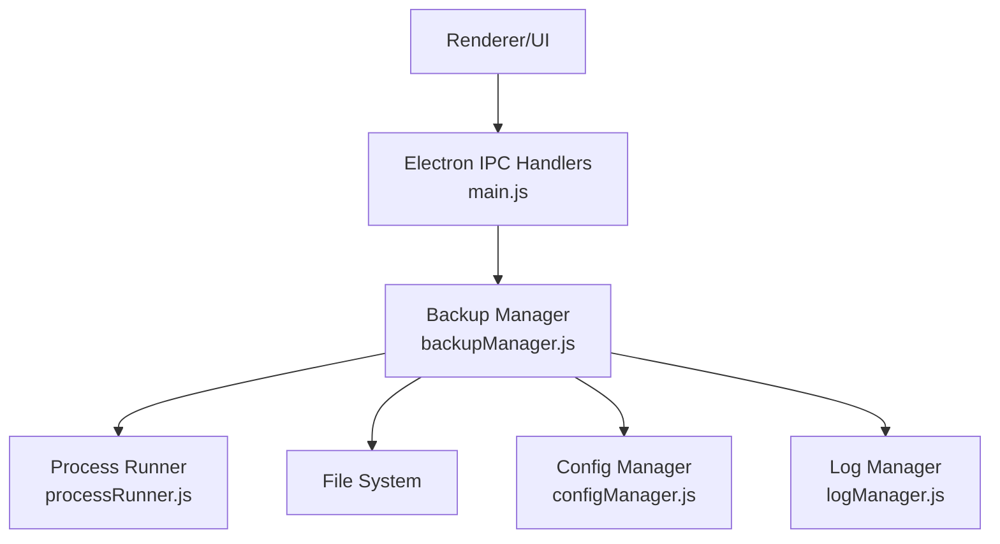
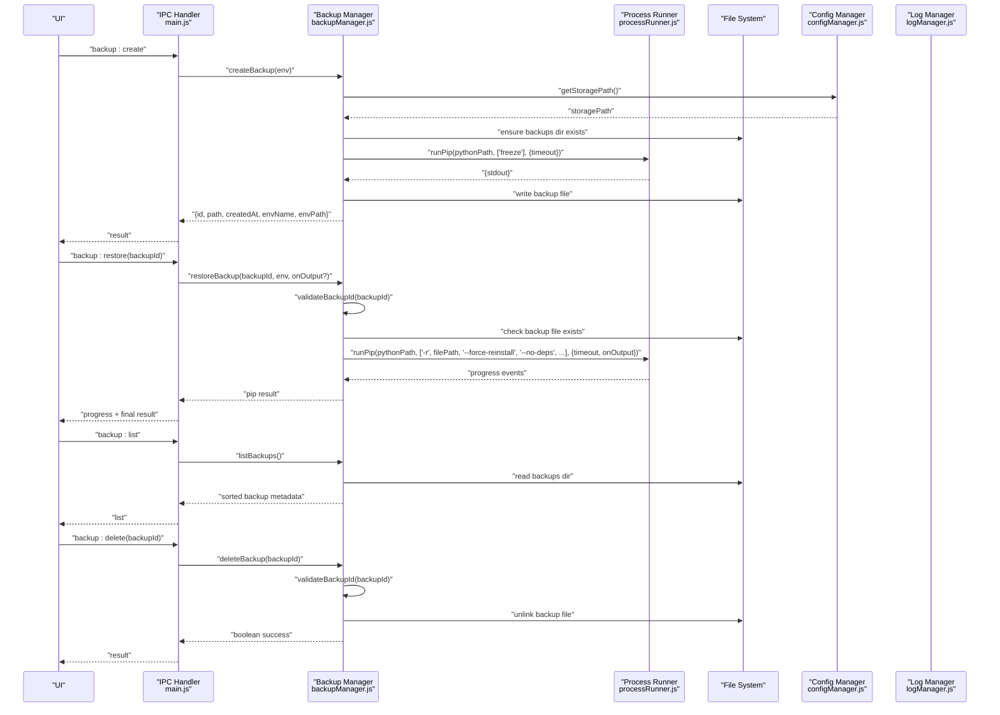
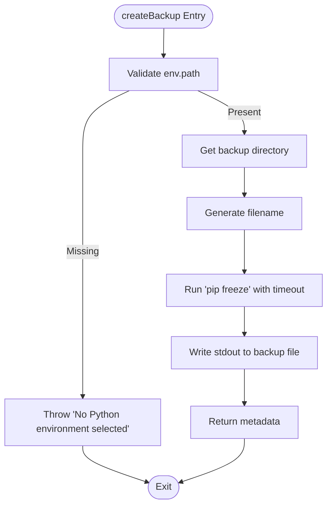
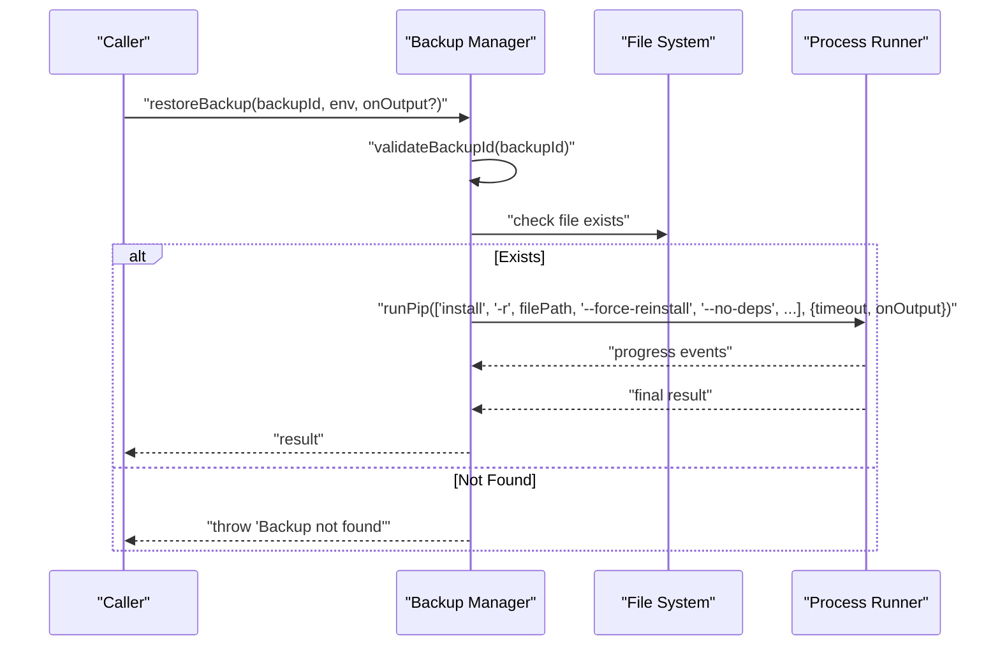
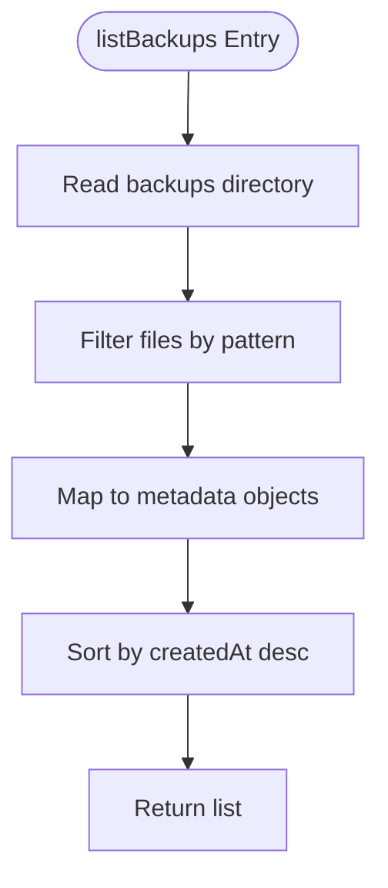
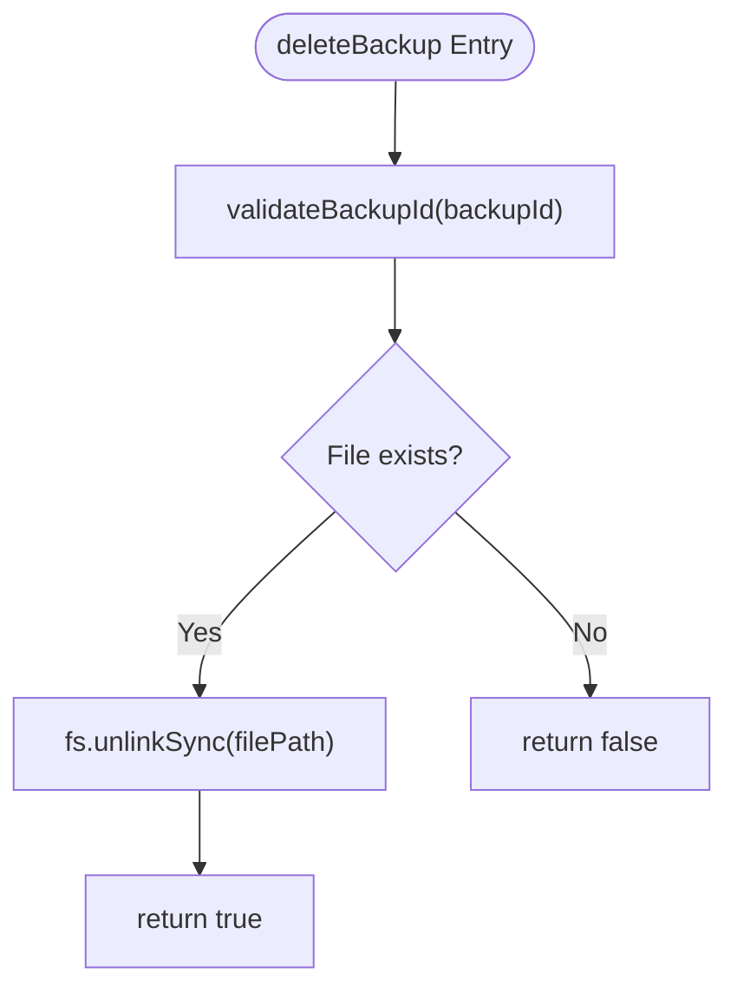
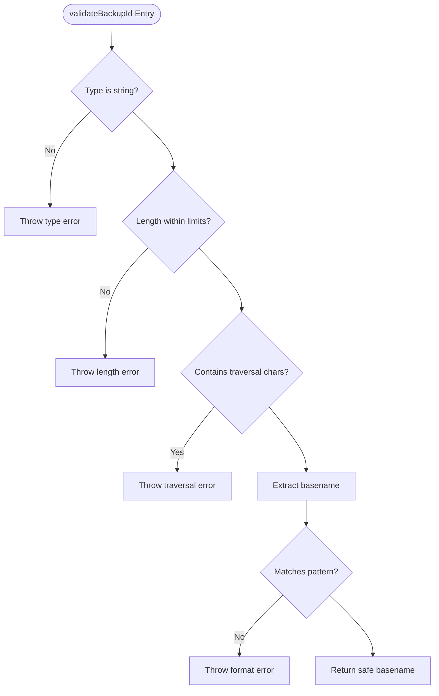
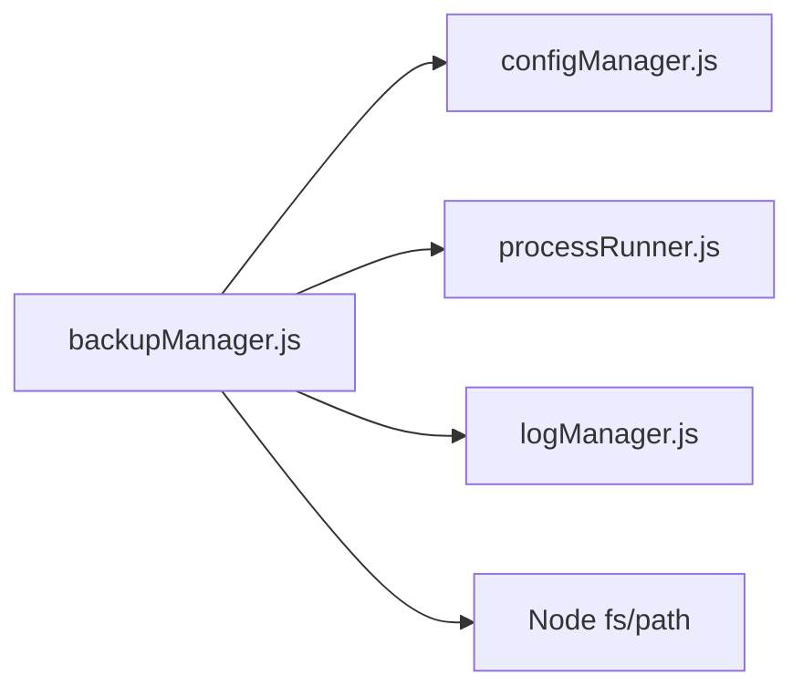

# Backup Operations API

<cite>
**Referenced Files in This Document**
- [backupManager.js](file://core/operations/backupManager.js)
- [processRunner.js](file://utils/processRunner.js)
- [configManager.js](file://core/config/configManager.js)
- [logManager.js](file://core/system/logManager.js)
- [security.js](file://utils/security.js)
- [main.js](file://main.js)
</cite>

## Table of Contents
1. [Introduction](#introduction)
2. [Project Structure](#project-structure)
3. [Core Components](#core-components)
4. [Architecture Overview](#architecture-overview)
5. [Detailed Component Analysis](#detailed-component-analysis)
6. [Dependency Analysis](#dependency-analysis)
7. [Performance Considerations](#performance-considerations)
8. [Troubleshooting Guide](#troubleshooting-guide)
9. [Conclusion](#conclusion)

## Introduction
This document provides detailed API documentation for backup operations in the Backup Manager. It covers:
- Creating environment snapshots using pip freeze
- Restoring environments from backups with force-reinstall capabilities
- Listing backups and retrieving metadata
- Deleting backups
- Security validation via validateBackupId()
- File naming conventions, storage location management, and error handling patterns
- Timeout configurations, cross-platform considerations, verification processes, compression options, and space management techniques

The Backup Manager integrates with a process runner to execute pip commands safely, uses configuration management for storage paths, and logs all operations for auditability.

## Project Structure
The backup functionality is implemented in a dedicated module and integrated into the application’s IPC layer. Key files:
- core/operations/backupManager.js: Core backup logic (create, restore, list, delete, validate)
- utils/processRunner.js: Subprocess execution, timeout handling, and pip command wrapper
- core/config/configManager.js: Storage path resolution and persistence
- core/system/logManager.js: Operation logging and retention policies
- utils/security.js: Path safety utilities (not directly used by backup manager but available for broader security)
- main.js: IPC handlers exposing backup operations to the UI

**Diagram sources**
- [main.js:355-368](file://main.js#L355-L368)
- [backupManager.js:1-196](file://core/operations/backupManager.js#L1-L196)
- [processRunner.js:340-342](file://utils/processRunner.js#L340-L342)
- [configManager.js:185-191](file://core/config/configManager.js#L185-L191)
- [logManager.js:115-134](file://core/system/logManager.js#L115-L134)

**Section sources**
- [main.js:355-368](file://main.js#L355-L368)
- [backupManager.js:1-196](file://core/operations/backupManager.js#L1-L196)

## Core Components
- createBackup(env): Generates an environment snapshot by running pip freeze and writing output to a timestamped file under the configured storage/backups directory. Returns metadata including id, path, createdAt, envName, and envPath.
- restoreBackup(backupId, env, onOutput?): Restores an environment from a backup file using pip install -r with --force-reinstall and --no-deps flags. Supports real-time progress callbacks.
- listBackups(): Lists all backup files in the storage/backups directory, filtering by naming convention and returning metadata such as id, path, createdAt, and size, sorted newest first.
- deleteBackup(backupId): Deletes a specific backup file after validating its ID.
- validateBackupId(backupId): Validates backup IDs against strict format rules and prevents path traversal attacks.

Key behaviors:
- Naming convention: backup_{envName}_{timestamp}.txt
- Storage location: {storagePath}/backups/
- Timeouts: createBackup uses a short timeout; restoreBackup uses a longer timeout due to installation duration
- Logging: failures are logged via logManager
- Cross-platform: Uses Node fs/path and pip subprocesses; Windows console hidden via process settings

**Section sources**
- [backupManager.js:46-51](file://core/operations/backupManager.js#L46-L51)
- [backupManager.js:62-78](file://core/operations/backupManager.js#L62-L78)
- [backupManager.js:89-113](file://core/operations/backupManager.js#L89-L113)
- [backupManager.js:122-142](file://core/operations/backupManager.js#L122-L142)
- [backupManager.js:156-170](file://core/operations/backupManager.js#L156-L170)
- [backupManager.js:179-193](file://core/operations/backupManager.js#L179-L193)
- [processRunner.js:85-161](file://utils/processRunner.js#L85-L161)
- [configManager.js:185-191](file://core/config/configManager.js#L185-L191)
- [logManager.js:115-134](file://core/system/logManager.js#L115-L134)

## Architecture Overview
The backup API flows through Electron IPC to the Backup Manager, which orchestrates filesystem operations and pip subprocesses. Configuration determines storage paths, while logging records outcomes.

**Diagram sources**
- [main.js:355-368](file://main.js#L355-L368)
- [backupManager.js:89-113](file://core/operations/backupManager.js#L89-L113)
- [backupManager.js:156-170](file://core/operations/backupManager.js#L156-L170)
- [backupManager.js:122-142](file://core/operations/backupManager.js#L122-L142)
- [backupManager.js:179-193](file://core/operations/backupManager.js#L179-L193)
- [processRunner.js:340-342](file://utils/processRunner.js#L340-L342)
- [configManager.js:185-191](file://core/config/configManager.js#L185-L191)

## Detailed Component Analysis

### createBackup(env)
- Purpose: Generate a snapshot of installed packages using pip freeze and store it as a .txt file.
- Inputs: env object containing Python environment details (path, name).
- Behavior:
  - Ensures the backups directory exists under the configured storage path.
  - Generates a filename following the naming convention.
  - Executes pip freeze with a defined timeout.
  - Writes stdout to the backup file.
  - Returns metadata including id, path, createdAt, envName, envPath.
- Error Handling: Logs failure and throws a descriptive error if pip fails or environment is missing.
- Timeouts: Uses a moderate timeout suitable for listing packages.

**Diagram sources**
- [backupManager.js:89-113](file://core/operations/backupManager.js#L89-L113)
- [processRunner.js:340-342](file://utils/processRunner.js#L340-L342)

**Section sources**
- [backupManager.js:89-113](file://core/operations/backupManager.js#L89-L113)
- [processRunner.js:85-161](file://utils/processRunner.js#L85-L161)

### restoreBackup(backupId, env, onOutput?)
- Purpose: Restore an environment from a backup file using pip install -r with force-reinstall and no-dependencies flags.
- Inputs:
  - backupId: validated backup filename
  - env: Python environment object
  - onOutput?: optional callback for real-time progress
- Behavior:
  - Validates backupId to prevent path traversal and ensure correct format.
  - Checks that the backup file exists.
  - Executes pip install with specified flags and a long timeout.
  - Streams output via onOutput callback when provided.
- Error Handling: Throws errors for invalid IDs, missing files, or failed pip execution.

**Diagram sources**
- [backupManager.js:156-170](file://core/operations/backupManager.js#L156-L170)
- [processRunner.js:340-342](file://utils/processRunner.js#L340-L342)

**Section sources**
- [backupManager.js:156-170](file://core/operations/backupManager.js#L156-L170)
- [processRunner.js:85-161](file://utils/processRunner.js#L85-L161)

### listBackups()
- Purpose: Retrieve a list of backup files with metadata.
- Behavior:
  - Reads the backups directory.
  - Filters files matching the naming convention.
  - Collects stat information (mtime, size).
  - Sorts results by creation time descending.
- Error Handling: Catches exceptions and returns an empty array; logs failures.

**Diagram sources**
- [backupManager.js:122-142](file://core/operations/backupManager.js#L122-L142)

**Section sources**
- [backupManager.js:122-142](file://core/operations/backupManager.js#L122-L142)

### deleteBackup(backupId)
- Purpose: Delete a specific backup file after validation.
- Behavior:
  - Validates backupId.
  - Attempts to unlink the file if it exists.
  - Returns boolean indicating success.
- Error Handling: Logs and throws descriptive errors on failure.

**Diagram sources**
- [backupManager.js:179-193](file://core/operations/backupManager.js#L179-L193)

**Section sources**
- [backupManager.js:179-193](file://core/operations/backupManager.js#L179-L193)

### validateBackupId(backupId)
- Purpose: Ensure backup IDs are safe and conform to expected format.
- Rules:
  - Must be a string within a maximum length.
  - Disallows path traversal characters and sequences.
  - Enforces naming pattern: backup_<name>.txt
- Output: Returns a sanitized basename if valid; otherwise throws errors.

**Diagram sources**
- [backupManager.js:62-78](file://core/operations/backupManager.js#L62-L78)

**Section sources**
- [backupManager.js:62-78](file://core/operations/backupManager.js#L62-L78)

## Dependency Analysis
Backup operations depend on several modules:
- configManager.getStoragePath(): Determines where backups are stored
- processRunner.runPip(): Executes pip commands with robust subprocess handling
- logManager.addLog(): Records operation outcomes and errors
- fs/path: Standard Node APIs for filesystem and path manipulation

**Diagram sources**
- [backupManager.js:1-24](file://core/operations/backupManager.js#L1-L24)
- [configManager.js:185-191](file://core/config/configManager.js#L185-L191)
- [processRunner.js:340-342](file://utils/processRunner.js#L340-L342)
- [logManager.js:115-134](file://core/system/logManager.js#L115-L134)

**Section sources**
- [backupManager.js:1-24](file://core/operations/backupManager.js#L1-L24)
- [configManager.js:185-191](file://core/config/configManager.js#L185-L191)
- [processRunner.js:340-342](file://utils/processRunner.js#L340-L342)
- [logManager.js:115-134](file://core/system/logManager.js#L115-L134)

## Performance Considerations
- Timeouts:
  - createBackup uses a moderate timeout appropriate for listing packages.
  - restoreBackup uses a significantly longer timeout to accommodate package installations.
- Process Management:
  - Subprocesses are tracked and can be canceled; SIGTERM followed by SIGKILL ensures cleanup.
- I/O Efficiency:
  - Backup listing filters and sorts in-memory; large directories may benefit from pagination strategies.
- Concurrency:
  - No parallelism in backup operations; consider batching restore operations if needed.
- Disk Space:
  - Backups are plain text; consider compression for large environments if storage becomes constrained.

[No sources needed since this section provides general guidance]

## Troubleshooting Guide
Common issues and resolutions:
- No Python environment selected:
  - Ensure env.path is provided to createBackup and restoreBackup.
- Invalid backup ID:
  - Verify the backup filename matches the expected pattern and does not contain traversal sequences.
- Backup not found:
  - Confirm the backup file exists in the configured storage/backups directory.
- Pip execution failures:
  - Check network connectivity, mirror settings, and pip availability; ensure ensurePip has been run if necessary.
- Timeouts:
  - Increase timeouts for slow networks or large environments; monitor progress via onOutput callback during restore.
- Logging:
  - Review operation logs for detailed error messages and timestamps.

**Section sources**
- [backupManager.js:89-113](file://core/operations/backupManager.js#L89-L113)
- [backupManager.js:156-170](file://core/operations/backupManager.js#L156-L170)
- [processRunner.js:85-161](file://utils/processRunner.js#L85-L161)
- [logManager.js:115-134](file://core/system/logManager.js#L115-L134)

## Conclusion
The Backup Manager provides a robust set of operations for creating, restoring, listing, and deleting environment snapshots. It enforces secure backup ID validation, manages storage locations via configuration, and leverages a resilient process runner for pip interactions. With comprehensive logging and configurable timeouts, it supports reliable backup workflows across platforms. For advanced scenarios, consider adding backup verification, compression, and space management features to enhance operational efficiency and data integrity.

[No sources needed since this section summarizes without analyzing specific files]