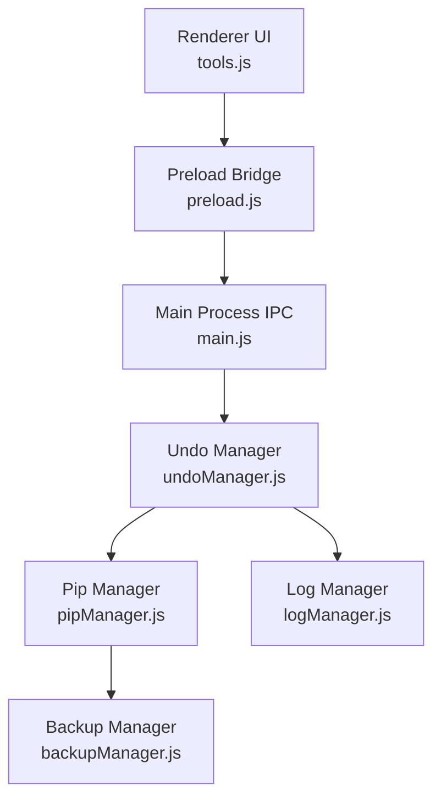
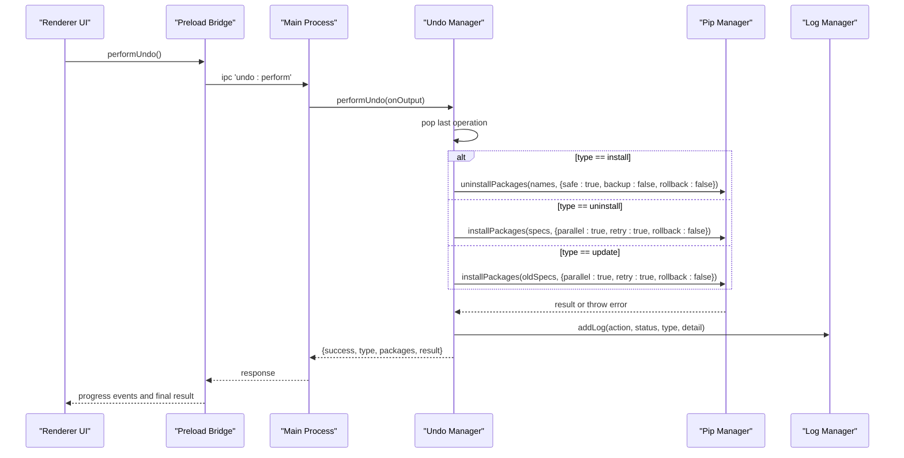
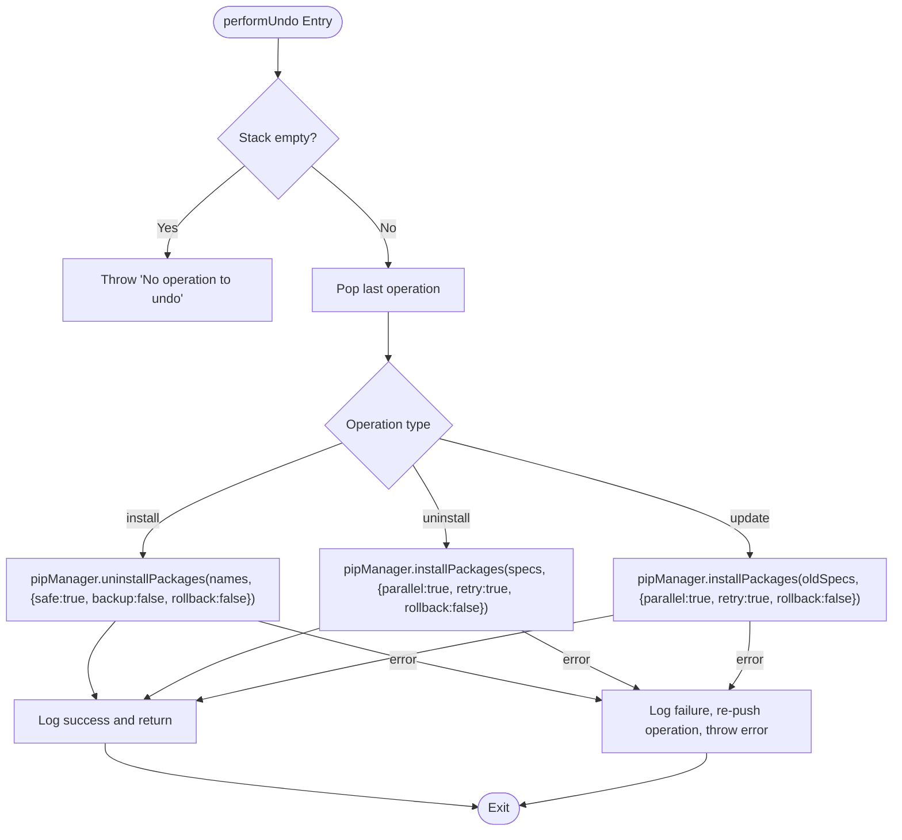
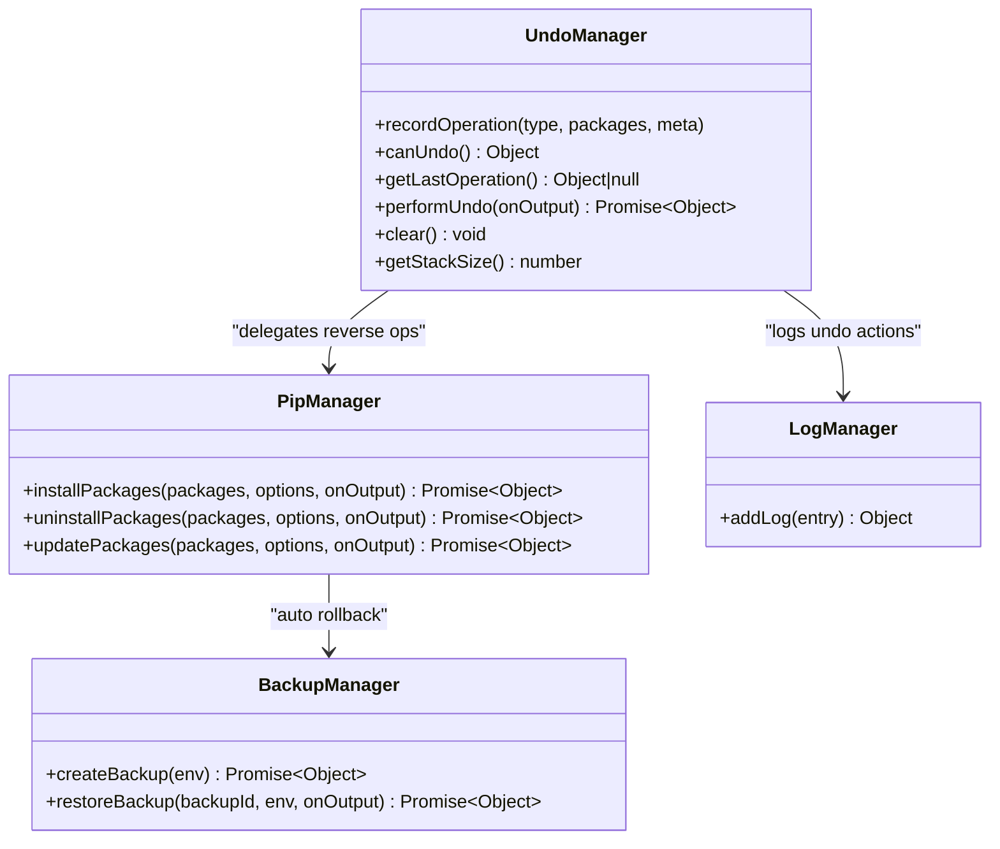
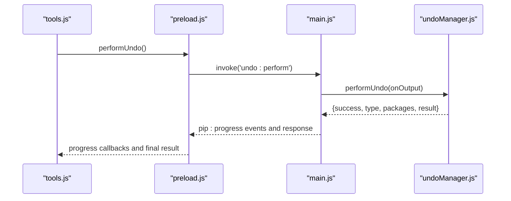
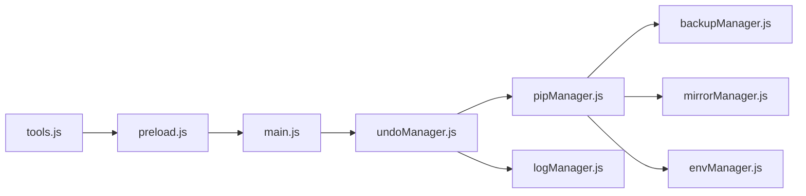

# Undo Manager API

<cite>
**Referenced Files in This Document**
- [undoManager.js](file://core/operations/undoManager.js)
- [pipManager.js](file://core/operations/pipManager.js)
- [backupManager.js](file://core/operations/backupManager.js)
- [logManager.js](file://core/system/logManager.js)
- [main.js](file://main.js)
- [preload.js](file://preload.js)
- [tools.js](file://renderer/js/tools.js)
</cite>

## Update Summary
**Changes Made**
- Updated core functionality to reflect the new undo manager implementation with bounded stack support (MAX_UNDO_STACK = 20)
- Enhanced documentation for operation history management and intelligent reversal logic
- Added detailed coverage of IPC integration and UI workflow
- Updated architecture diagrams to show complete flow from renderer to main process
- Expanded troubleshooting guide with new error scenarios

## Table of Contents
1. [Introduction](#introduction)
2. [Project Structure](#project-structure)
3. [Core Components](#core-components)
4. [Architecture Overview](#architecture-overview)
5. [Detailed Component Analysis](#detailed-component-analysis)
6. [Dependency Analysis](#dependency-analysis)
7. [Performance Considerations](#performance-considerations)
8. [Troubleshooting Guide](#troubleshooting-guide)
9. [Conclusion](#conclusion)
10. [Appendices](#appendices)

## Introduction
This document provides comprehensive API documentation for the Undo Manager module, which implements transactional rollback capabilities for package operations. The system maintains an in-memory operation history stack supporting up to 20 undo operations for install, uninstall, and update actions with intelligent reversal logic. It covers:
- Bounded undo stack management with automatic oldest entry removal
- State preservation mechanisms for package operations
- Automatic rollback triggers on operation failures
- Recording operation states, executing rollbacks, managing undo history
- Integration with the backup system and pip manager
- Error handling strategies, memory management for large operation histories, and performance optimization techniques during long-running operations

The Undo Manager is designed to be lightweight and deterministic, maintaining a bounded in-memory stack of recent operations and delegating actual reversals to the pip manager while leveraging backups for safety-critical scenarios.

## Project Structure
The Undo Manager resides under core/operations and integrates with:
- pipManager: Executes install/uninstall/update operations and supports automatic rollback via backups
- backupManager: Creates and restores environment snapshots using pip freeze
- logManager: Records undo actions and failures
- main.js: Exposes IPC handlers for undo operations
- preload.js: Bridges UI calls to main process IPC
- tools.js: UI integration for triggering undo



**Diagram sources**
- [main.js:619-631](file://main.js#L619-L631)
- [preload.js:167-171](file://preload.js#L167-L171)
- [tools.js:622-636](file://renderer/js/tools.js#L622-L636)
- [undoManager.js:1-131](file://core/operations/undoManager.js#L1-L131)
- [pipManager.js:513-596](file://core/operations/pipManager.js#L513-L596)
- [backupManager.js:89-113](file://core/operations/backupManager.js#L89-L113)
- [logManager.js:115-134](file://core/system/logManager.js#L115-L134)

**Section sources**
- [main.js:619-631](file://main.js#L619-L631)
- [preload.js:167-171](file://preload.js#L167-L171)
- [tools.js:622-636](file://renderer/js/tools.js#L622-L636)
- [undoManager.js:1-131](file://core/operations/undoManager.js#L1-L131)

## Core Components
- **Undo Manager (undoManager.js)**: Maintains an in-memory undo stack with bounded size (MAX_UNDO_STACK = 20), records operations, and executes rollbacks by invoking pipManager with appropriate reverse actions.
- **Pip Manager (pipManager.js)**: Provides install/uninstall/update APIs with optional automatic rollback via backupManager when enabled.
- **Backup Manager (backupManager.js)**: Creates and restores environment snapshots using pip freeze; used by pipManager for automatic rollback and by undoManager indirectly through pipManager.
- **Log Manager (logManager.js)**: Persists structured logs for undo actions and failures.
- **Main Process IPC (main.js)**: Exposes undo endpoints: canUndo, performUndo, clear.
- **Preload Bridge (preload.js)**: Exposes electronAPI methods for undo operations to the renderer.
- **Renderer Tools (tools.js)**: UI handler that invokes undo via electronAPI and updates UI state.

Key responsibilities:
- **recordOperation(type, packages, meta)**: Pushes an operation entry onto the undo stack with bounded size (MAX_UNDO_STACK = 20).
- **canUndo()**: Returns availability and last action description with intelligent action naming.
- **getLastOperation()**: Retrieves the most recent operation without removing it.
- **performUndo(onOutput)**: Pops the last operation and executes the inverse action via pipManager; logs success/failure; re-pushes if rollback fails.
- **clear()**: Empties the undo stack.
- **getStackSize()**: Returns current stack length.

**Section sources**
- [undoManager.js:22-33](file://core/operations/undoManager.js#L22-L33)
- [undoManager.js:39-51](file://core/operations/undoManager.js#L39-L51)
- [undoManager.js:57-59](file://core/operations/undoManager.js#L57-L59)
- [undoManager.js:66-106](file://core/operations/undoManager.js#L66-L106)
- [undoManager.js:111-121](file://core/operations/undoManager.js#L111-L121)

## Architecture Overview
The Undo Manager orchestrates transactional semantics around package operations with bounded memory usage:
- Operations are recorded before execution so they can be reversed deterministically.
- Rollback logic maps each operation type to its inverse with intelligent version handling:
  - install → uninstall
  - uninstall → reinstall with version specifiers
  - update → reinstall old versions from metadata
- Automatic rollback is handled by pipManager using backupManager when enabled; undoManager's performUndo does not create backups but relies on pipManager's own rollback behavior where applicable.
- Memory management ensures only the most recent 20 operations are retained.



**Diagram sources**
- [main.js:624-628](file://main.js#L624-L628)
- [preload.js:169-170](file://preload.js#L169-L170)
- [tools.js:622-636](file://renderer/js/tools.js#L622-L636)
- [undoManager.js:66-106](file://core/operations/undoManager.js#L66-L106)
- [pipManager.js:745-789](file://core/operations/pipManager.js#L745-L789)
- [pipManager.js:513-596](file://core/operations/pipManager.js#L513-L596)
- [logManager.js:115-134](file://core/system/logManager.js#L115-L134)

## Detailed Component Analysis

### Undo Manager API
- **recordOperation(type, packages, meta = {})**
  - Purpose: Record an operation into the undo stack with bounded size (MAX_UNDO_STACK = 20).
  - Input: type (install | uninstall | update), packages array [{name, version}], optional meta (e.g., oldVersions for update).
  - Behavior: Normalizes package entries, timestamps the operation, enforces max stack size by dropping oldest entries automatically.
  - Complexity: O(1) push; O(1) shift when exceeding limit.
- **canUndo()**
  - Purpose: Determine if an undo is available and describe the last action with intelligent naming.
  - Output: {available, lastAction, type, time}.
  - Complexity: O(1).
- **getLastOperation()**
  - Purpose: Retrieve the most recent operation without removing it.
  - Complexity: O(1).
- **performUndo(onOutput)**
  - Purpose: Execute the inverse operation for the last recorded action.
  - Behavior: Pops operation, delegates to pipManager with appropriate options, logs outcome, re-pushes operation on failure to preserve consistency.
  - Complexity: Depends on pipManager; typically O(n) for n packages.
- **clear()**
  - Purpose: Reset the undo stack.
  - Complexity: O(1).
- **getStackSize()**
  - Purpose: Return current number of recorded operations.
  - Complexity: O(1).



**Diagram sources**
- [undoManager.js:66-106](file://core/operations/undoManager.js#L66-L106)

**Section sources**
- [undoManager.js:22-33](file://core/operations/undoManager.js#L22-L33)
- [undoManager.js:39-51](file://core/operations/undoManager.js#L39-L51)
- [undoManager.js:57-59](file://core/operations/undoManager.js#L57-L59)
- [undoManager.js:66-106](file://core/operations/undoManager.js#L66-L106)
- [undoManager.js:111-121](file://core/operations/undoManager.js#L111-L121)

### Pip Manager Integration
- **Automatic rollback in pipManager**:
  - installPackages, uninstallPackages, updatePackages support auto-rollback via backupManager when enabled.
  - On failure, pipManager restores from backup and throws an error indicating rollback occurred.
- **Undo Manager usage**:
  - performUndo explicitly disables rollback and backup in pipManager calls to avoid nested backup creation/restoration during undo execution.
  - For update undo, oldVersions metadata is used to reconstruct version specs.



**Diagram sources**
- [undoManager.js:66-106](file://core/operations/undoManager.js#L66-L106)
- [pipManager.js:513-596](file://core/operations/pipManager.js#L513-L596)
- [pipManager.js:745-789](file://core/operations/pipManager.js#L745-L789)
- [pipManager.js:805-885](file://core/operations/pipManager.js#L805-885)
- [backupManager.js:89-113](file://core/operations/backupManager.js#L89-L113)
- [logManager.js:115-134](file://core/system/logManager.js#L115-L134)

**Section sources**
- [pipManager.js:513-596](file://core/operations/pipManager.js#L513-L596)
- [pipManager.js:745-789](file://core/operations/pipManager.js#L745-L789)
- [pipManager.js:805-885](file://core/operations/pipManager.js#L805-885)
- [backupManager.js:89-113](file://core/operations/backupManager.js#L89-L113)

### Backup Manager Integration
- **Backup creation uses pip freeze** to capture installed packages and versions.
- **Restore uses pip install -r** with force-reinstall and no-deps to revert environment state.
- **Undo Manager does not directly call backupManager**; pipManager handles automatic rollback when configured.

**Section sources**
- [backupManager.js:89-113](file://core/operations/backupManager.js#L89-L113)
- [backupManager.js:156-170](file://core/operations/backupManager.js#L156-L170)

### Logging and Auditing
- All undo actions and failures are logged with structured fields: action, status, type, detail.
- Logs are persisted with debounced writes and truncated fields to prevent oversized files.

**Section sources**
- [logManager.js:115-134](file://core/system/logManager.js#L115-L134)
- [undoManager.js:81-96](file://core/operations/undoManager.js#L81-L96)
- [undoManager.js:101-105](file://core/operations/undoManager.js#L101-L105)

### UI Integration and IPC Flow
- Renderer calls electronAPI.performUndo(), which invokes main process IPC 'undo:perform'.
- Main process calls undoManager.performUndo with a progress callback that emits 'pip:progress' events back to the renderer.
- UI updates button states and shows toast messages based on success/failure.



**Diagram sources**
- [tools.js:622-636](file://renderer/js/tools.js#L622-L636)
- [preload.js:169-170](file://preload.js#L169-170)
- [main.js:624-628](file://main.js#L624-L628)
- [undoManager.js:66-106](file://core/operations/undoManager.js#L66-L106)

**Section sources**
- [tools.js:622-636](file://renderer/js/tools.js#L622-L636)
- [preload.js:169-170](file://preload.js#L169-170)
- [main.js:624-628](file://main.js#L624-L628)

## Dependency Analysis
- **Undo Manager depends on**:
  - pipManager for executing reverse operations
  - logManager for audit trails
- **Pip Manager depends on**:
  - backupManager for automatic rollback
  - mirrorManager for retry across mirrors
  - envManager for current environment context
- **Main Process exposes IPC endpoints** for undo operations.
- **Preload bridges UI to main process IPC**.
- **Renderer tools integrate user interactions and progress updates**.



**Diagram sources**
- [undoManager.js:1-131](file://core/operations/undoManager.js#L1-L131)
- [pipManager.js:1-800](file://core/operations/pipManager.js#L1-L800)
- [backupManager.js:1-196](file://core/operations/backupManager.js#L1-L196)
- [logManager.js:1-176](file://core/system/logManager.js#L1-L176)
- [main.js:619-631](file://main.js#L619-L631)
- [preload.js:167-171](file://preload.js#L167-L171)
- [tools.js:622-636](file://renderer/js/tools.js#L622-L636)

**Section sources**
- [undoManager.js:1-131](file://core/operations/undoManager.js#L1-L131)
- [pipManager.js:1-800](file://core/operations/pipManager.js#L1-L800)
- [backupManager.js:1-196](file://core/operations/backupManager.js#L1-L196)
- [logManager.js:1-176](file://core/system/logManager.js#L1-L176)
- [main.js:619-631](file://main.js#L619-L631)
- [preload.js:167-171](file://preload.js#L167-L171)
- [tools.js:622-636](file://renderer/js/tools.js#L622-L636)

## Performance Considerations
- **Undo Stack Memory Management**:
  - Bounded by MAX_UNDO_STACK (20); oldest entries are dropped automatically to prevent unbounded growth.
  - Each entry stores minimal metadata (type, normalized packages, timestamp, optional meta).
- **Long-Running Operations**:
  - performUndo delegates heavy work to pipManager; ensure parallelism and retries are configured appropriately to reduce total runtime.
  - Avoid creating additional backups during undo to minimize I/O overhead.
- **Caching and Efficiency**:
  - pipManager caches site-packages paths and installed lists; leverage these to reduce repeated filesystem scans.
  - Use getLastOperation and canUndo for UI responsiveness without blocking.
- **Logging Overhead**:
  - logManager uses debounced writes and field truncation to keep disk I/O efficient.
- **Memory Optimization**:
  - Package names are limited to first 3 items in UI descriptions to prevent excessive string construction.
  - Operation metadata is minimized to essential information only.

## Troubleshooting Guide
Common issues and resolutions:
- **No operation to undo**:
  - Cause: Empty undo stack.
  - Resolution: Ensure recordOperation is called before performing package changes; check UI state and stack size.
- **Undo failed and operation re-pushed**:
  - Cause: Reverse operation threw an error; undoManager re-pushes the operation to maintain consistency.
  - Resolution: Inspect logs for detailed error messages; verify pip commands and environment state.
- **Automatic rollback triggered unexpectedly**:
  - Cause: pipManager auto-rollback enabled; backup restore executed on failure.
  - Resolution: Review pipManager options; disable rollback if undesired; inspect backupManager logs.
- **Progress events not received**:
  - Cause: IPC event listener not bound or cleared prematurely.
  - Resolution: Ensure onProgress listener is set before invoking operations; remove listeners only when necessary.
- **Stack overflow protection**:
  - Cause: More than 20 operations recorded; oldest entries automatically removed.
  - Resolution: This is expected behavior; consider clearing stack periodically for long sessions.
- **Version specification errors**:
  - Cause: Invalid version format in undo operations.
  - Resolution: Verify package version formats; ensure proper version metadata is captured during original operations.

**Section sources**
- [undoManager.js:66-106](file://core/operations/undoManager.js#L66-L106)
- [pipManager.js:513-596](file://core/operations/pipManager.js#L513-L596)
- [backupManager.js:89-113](file://core/operations/backupManager.js#L89-L113)
- [logManager.js:115-134](file://core/system/logManager.js#L115-L134)

## Conclusion
The Undo Manager provides a robust, bounded, and deterministic mechanism for reversing package operations. By recording operation metadata and delegating reverse actions to pipManager, it ensures safe rollbacks while integrating seamlessly with the backup system for automatic recovery. The architecture balances simplicity and reliability with memory efficiency, making it suitable for both manual undo workflows and automated transactional guarantees. The bounded stack design prevents memory leaks while maintaining sufficient history for practical undo scenarios.

## Appendices

### Example Workflows

#### Safe Package Installation with Automatic Rollback
- Enable auto-rollback in pipManager.installPackages(options.rollback !== false).
- On failure, pipManager creates a backup and restores it automatically.
- After successful installation, recordOperation can be used to enable manual undo later.

**Section sources**
- [pipManager.js:513-596](file://core/operations/pipManager.js#L513-L596)
- [backupManager.js:89-113](file://core/operations/backupManager.js#L89-L113)

#### Manual Undo Operation
- Call undoManager.recordOperation after successful install/uninstall/update.
- Invoke undoManager.performUndo via IPC to execute the inverse action.
- UI should handle progress events and display success/failure feedback.

**Section sources**
- [undoManager.js:22-33](file://core/operations/undoManager.js#L22-L33)
- [undoManager.js:66-106](file://core/operations/undoManager.js#L66-L106)
- [main.js:624-628](file://main.js#L624-L628)
- [tools.js:622-636](file://renderer/js/tools.js#L622-L636)

#### Integration with Backup System
- Use backupManager.createBackup to snapshot environment state before risky operations.
- Use backupManager.restoreBackup to revert environment to a known good state.
- pipManager leverages backupManager for automatic rollback when configured.

**Section sources**
- [backupManager.js:89-113](file://core/operations/backupManager.js#L89-L113)
- [backupManager.js:156-170](file://core/operations/backupManager.js#L156-L170)
- [pipManager.js:513-596](file://core/operations/pipManager.js#L513-L596)

### API Reference Examples

#### Basic Undo Operations
```javascript
// Record an operation after successful installation
undoManager.recordOperation('install', [
  { name: 'numpy', version: '1.21.0' },
  { name: 'pandas', version: '1.3.0' }
], { timestamp: Date.now() });

// Check if undo is available
const undoInfo = undoManager.canUndo();
if (undoInfo.available) {
  console.log(`Can undo: ${undoInfo.lastAction}`);
}

// Perform undo operation
try {
  const result = await undoManager.performUndo((data, type) => {
    console.log(`Progress: ${data}`);
  });
  console.log('Undo completed:', result);
} catch (error) {
  console.error('Undo failed:', error.message);
}
```

#### Memory Management
```javascript
// Monitor stack size
console.log(`Current stack size: ${undoManager.getStackSize()}`);

// Clear stack when needed
undoManager.clear();
console.log(`Stack cleared: ${undoManager.getStackSize()} operations remaining`);
```