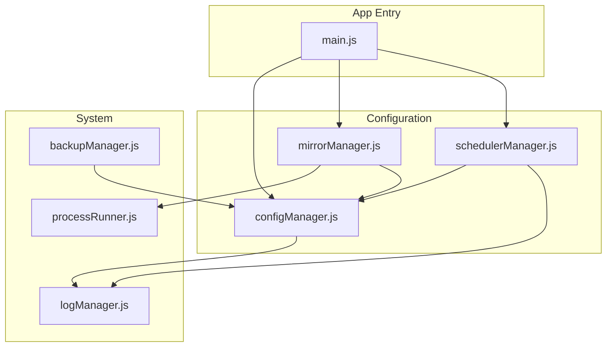
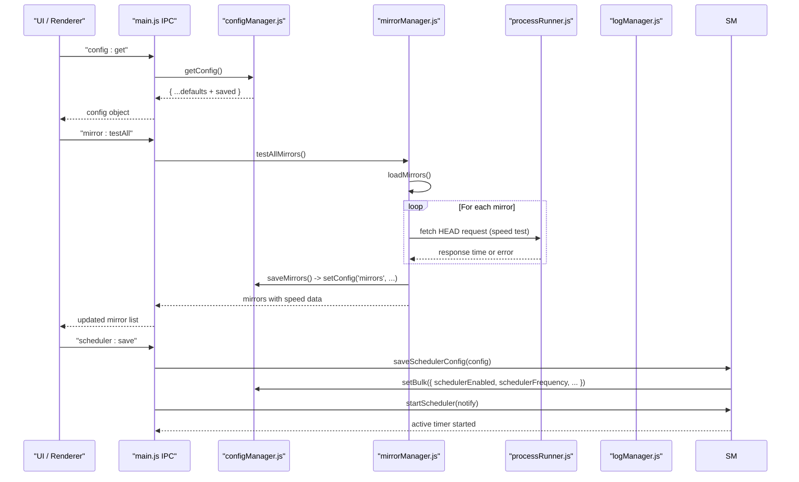
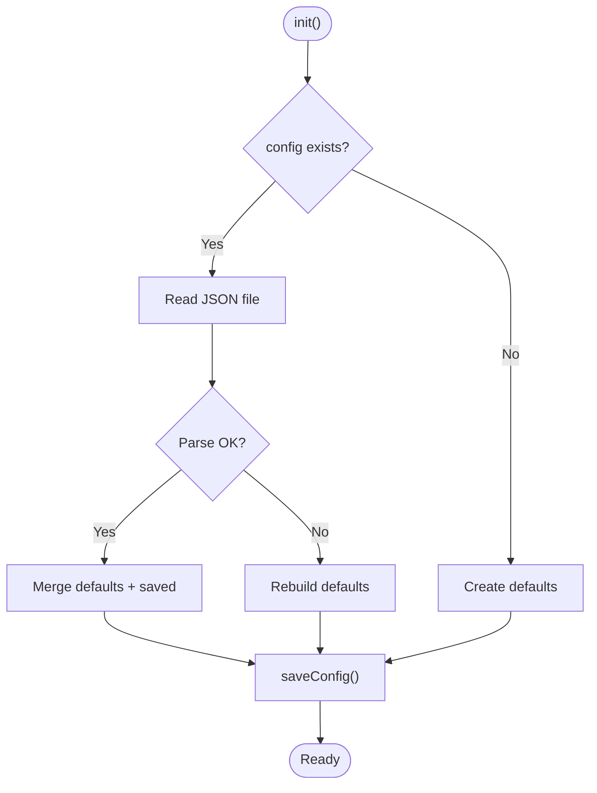
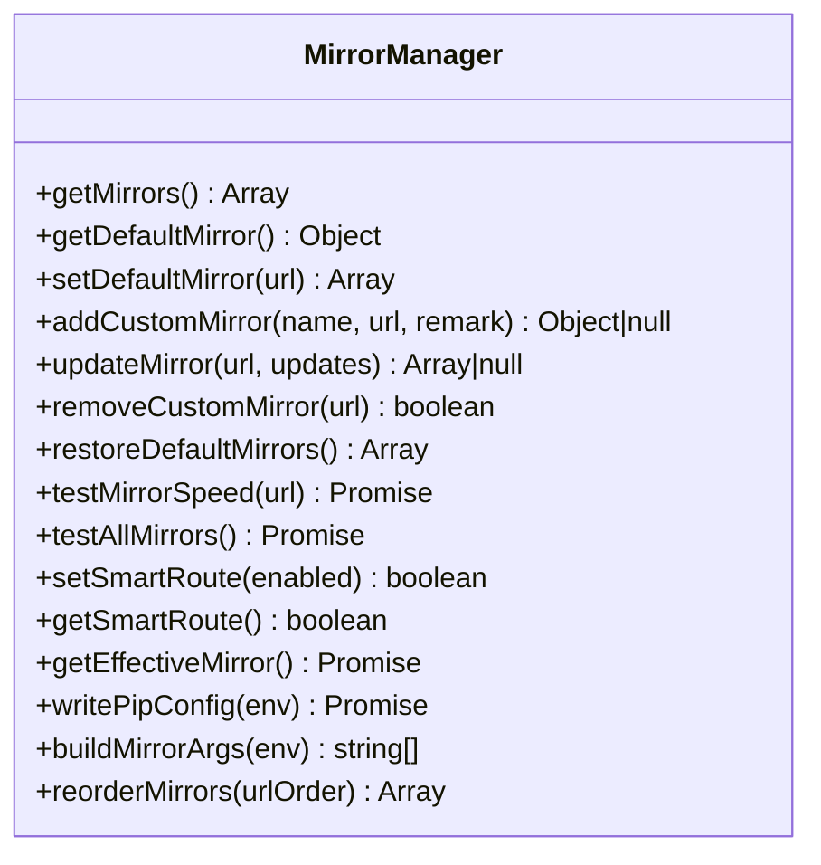
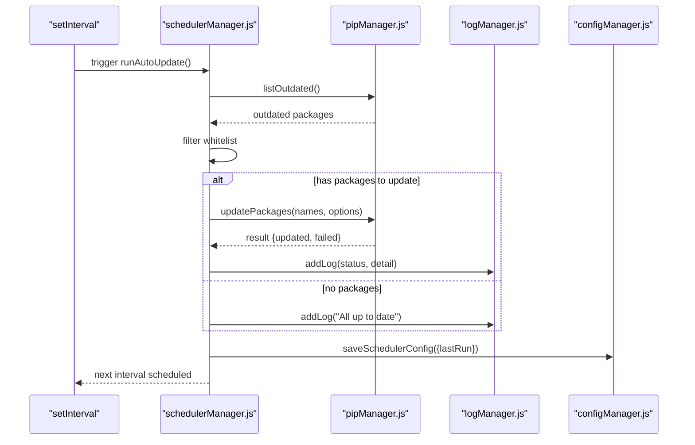
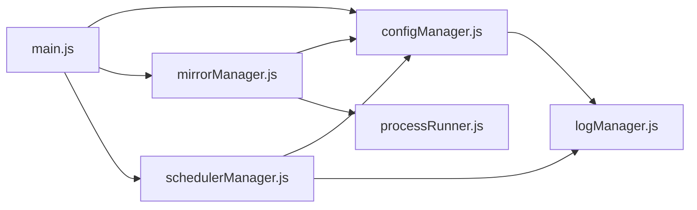

# Configuration Manager API

<cite>
**Referenced Files in This Document**
- [configManager.js](file://core/config/configManager.js)
- [mirrorManager.js](file://core/config/mirrorManager.js)
- [schedulerManager.js](file://core/config/schedulerManager.js)
- [processRunner.js](file://utils/processRunner.js)
- [logManager.js](file://core/system/logManager.js)
- [backupManager.js](file://core/operations/backupManager.js)
- [main.js](file://main.js)
</cite>

## Table of Contents
1. [Introduction](#introduction)
2. [Project Structure](#project-structure)
3. [Core Components](#core-components)
4. [Architecture Overview](#architecture-overview)
5. [Detailed Component Analysis](#detailed-component-analysis)
6. [Dependency Analysis](#dependency-analysis)
7. [Performance Considerations](#performance-considerations)
8. [Troubleshooting Guide](#troubleshooting-guide)
9. [Conclusion](#conclusion)
10. [Appendices](#appendices)

## Introduction
This document provides comprehensive API documentation for the Configuration Manager module and its related subsystems: application settings persistence, validation, mirror source management, and scheduler configuration. It covers:
- Application configuration read/write APIs (getConfig, setConfig, setBulk), value sanitization, and storage path management
- Mirror source management (addMirror, removeMirror, getDefaultMirror, speed testing, smart routing)
- Scheduler configuration for automated tasks (daily/weekly update scheduling, whitelist filtering, status reporting)
- Examples of configuration schema definition, default value handling, validation rules, and migration strategies
- Thread-safety considerations, atomic file writes, and configuration backup mechanisms

The goal is to enable both technical and non-technical users to understand how configuration is persisted, validated, and used across the application.

## Project Structure
The Configuration Manager spans three core modules under core/config:
- configManager.js: Centralized configuration persistence, defaults, validation, and storage path utilities
- mirrorManager.js: PyPI mirror source list management, speed testing, and pip configuration integration
- schedulerManager.js: Automated task scheduling with frequency control, whitelists, and execution logging

These modules integrate with:
- processRunner.js: Subprocess execution utilities used by mirror speed tests and pip operations
- logManager.js: Operation logging for errors and events
- backupManager.js: Backup and restore capabilities for Python environments (used alongside configuration)
- main.js: IPC handlers exposing configuration and mirror APIs to the UI

**Diagram sources**
- [configManager.js:1-194](file://core/config/configManager.js#L1-L194)
- [mirrorManager.js:1-376](file://core/config/mirrorManager.js#L1-L376)
- [schedulerManager.js:1-197](file://core/config/schedulerManager.js#L1-L197)
- [processRunner.js:1-366](file://utils/processRunner.js#L1-L366)
- [logManager.js:1-176](file://core/system/logManager.js#L1-L176)
- [backupManager.js:1-196](file://core/operations/backupManager.js#L1-L196)
- [main.js:1-640](file://main.js#L1-L640)

**Section sources**
- [configManager.js:1-194](file://core/config/configManager.js#L1-L194)
- [mirrorManager.js:1-376](file://core/config/mirrorManager.js#L1-L376)
- [schedulerManager.js:1-197](file://core/config/schedulerManager.js#L1-L197)
- [main.js:406-413](file://main.js#L406-L413)

## Core Components
- Configuration Manager (configManager):
  - Provides getConfig(), setConfig(key, value), setBulk(updates), getStoragePath(), and init()
  - Implements sanitizeValue() for numeric range enforcement and type safety
  - Uses atomic file writes (write to .tmp then rename) to prevent corruption
  - Merges saved configuration with defaults on load; reconstructs defaults if file is corrupted
  - Stores configuration in Electron userData directory or fallback locations

- Mirror Manager (mirrorManager):
  - Manages built-in and custom mirrors, ensures exactly one default mirror
  - Validates mirror URLs (http/https only), supports addCustomMirror(), updateMirror(), removeCustomMirror()
  - Speed testing via HEAD requests to a package page; testMirrorSpeed(url), testAllMirrors()
  - Smart routing: pickBestMirror() and getEffectiveMirror() based on configured preference
  - Writes pip configuration files (pip.ini/pip.conf) and builds CLI arguments

- Scheduler Manager (schedulerManager):
  - Configurable daily/weekly schedules with whitelist filtering
  - runAutoUpdate() orchestrates outdated listing, filtering, and batch updates
  - startScheduler()/stopScheduler() manage timers and immediate execution logic
  - Persists lastRun timestamps and integrates with logging

**Section sources**
- [configManager.js:21-44](file://core/config/configManager.js#L21-L44)
- [configManager.js:80-117](file://core/config/configManager.js#L80-L117)
- [configManager.js:123-138](file://core/config/configManager.js#L123-L138)
- [configManager.js:144-178](file://core/config/configManager.js#L144-L178)
- [mirrorManager.js:21-29](file://core/config/mirrorManager.js#L21-L29)
- [mirrorManager.js:43-51](file://core/config/mirrorManager.js#L43-L51)
- [mirrorManager.js:60-91](file://core/config/mirrorManager.js#L60-L91)
- [mirrorManager.js:139-150](file://core/config/mirrorManager.js#L139-L150)
- [mirrorManager.js:219-247](file://core/config/mirrorManager.js#L219-L247)
- [mirrorManager.js:267-290](file://core/config/mirrorManager.js#L267-L290)
- [mirrorManager.js:299-322](file://core/config/mirrorManager.js#L299-L322)
- [schedulerManager.js:29-37](file://core/config/schedulerManager.js#L29-L37)
- [schedulerManager.js:70-138](file://core/config/schedulerManager.js#L70-L138)
- [schedulerManager.js:145-163](file://core/config/schedulerManager.js#L145-L163)

## Architecture Overview
The Configuration Manager architecture centers around persistent JSON configuration with strict validation and safe write semantics. Mirror management extends this by integrating with system pip configuration and performing network-based speed tests. The scheduler coordinates background tasks using configurable intervals and whitelists.

**Diagram sources**
- [main.js:406-413](file://main.js#L406-L413)
- [main.js:372-395](file://main.js#L372-L395)
- [main.js:526-546](file://main.js#L526-L546)
- [configManager.js:144-178](file://core/config/configManager.js#L144-L178)
- [mirrorManager.js:240-247](file://core/config/mirrorManager.js#L240-L247)
- [mirrorManager.js:97-107](file://core/config/mirrorManager.js#L97-L107)
- [schedulerManager.js:43-50](file://core/config/schedulerManager.js#L43-L50)
- [schedulerManager.js:145-163](file://core/config/schedulerManager.js#L145-L163)

## Detailed Component Analysis

### Configuration Manager (configManager.js)
Responsibilities:
- Initialize configuration from disk or defaults
- Provide getConfig(), setConfig(), setBulk(), getStoragePath()
- Enforce numeric ranges and types via sanitizeValue()
- Atomic file writes to avoid corruption

Key behaviors:
- Default values include theme, language, storagePath, parallelThreads, retryCount, smartRoute, currentEnv, windowBounds
- RANGE_LIMITS define min/max/fallback for numeric fields
- init() merges saved config with defaults; rebuilds defaults on parse errors
- saveConfig() writes to .tmp then renames; logs failures via logManager or stderr

Thread-safety and concurrency:
- In-memory config cache avoids repeated disk reads
- No explicit locks; single-process Node.js runtime ensures sequential writes
- Atomic rename prevents partial writes during crashes

Migration strategy:
- On load, defaults are merged with saved config; unknown keys are preserved
- If file is corrupted, defaults are reconstructed and saved

**Diagram sources**
- [configManager.js:80-117](file://core/config/configManager.js#L80-L117)
- [configManager.js:123-138](file://core/config/configManager.js#L123-L138)

API summary:
- getConfig(): Returns deep copy of configuration
- setConfig(key, value): Sanitizes value, persists immediately, returns updated config
- setBulk(updates): Applies multiple sanitized updates, single disk write
- getStoragePath(): Ensures storage directory exists and returns path
- init(): Initializes config and paths

Validation and defaults:
- sanitizeValue() enforces numeric bounds and types
- Defaults defined at initialization; missing keys filled from defaults

Atomic writes:
- Write to .tmp then rename to final path
- Fallback logging if logManager unavailable

**Section sources**
- [configManager.js:21-44](file://core/config/configManager.js#L21-L44)
- [configManager.js:80-117](file://core/config/configManager.js#L80-L117)
- [configManager.js:123-138](file://core/config/configManager.js#L123-L138)
- [configManager.js:144-178](file://core/config/configManager.js#L144-L178)
- [configManager.js:185-191](file://core/config/configManager.js#L185-L191)

### Mirror Manager (mirrorManager.js)
Responsibilities:
- Manage built-in and custom mirrors
- Validate URLs, ensure exactly one default mirror
- Test mirror speeds and select best mirror
- Write pip configuration files and build CLI args

Key behaviors:
- DEFAULT_MIRRORS defines built-in sources
- loadMirrors() merges saved user settings with built-ins, restores defaults
- addCustomMirror(), updateMirror(), removeCustomMirror() enforce URL validation and uniqueness
- testMirrorSpeed() uses HEAD requests with timeout; testAllMirrors() runs in parallel
- getEffectiveMirror() chooses fastest when smartRoute enabled, else default
- writePipConfig() writes platform-specific pip configuration

**Diagram sources**
- [mirrorManager.js:109-118](file://core/config/mirrorManager.js#L109-L118)
- [mirrorManager.js:125-130](file://core/config/mirrorManager.js#L125-L130)
- [mirrorManager.js:139-150](file://core/config/mirrorManager.js#L139-L150)
- [mirrorManager.js:158-179](file://core/config/mirrorManager.js#L158-L179)
- [mirrorManager.js:187-197](file://core/config/mirrorManager.js#L187-L197)
- [mirrorManager.js:204-210](file://core/config/mirrorManager.js#L204-L210)
- [mirrorManager.js:219-247](file://core/config/mirrorManager.js#L219-L247)
- [mirrorManager.js:250-260](file://core/config/mirrorManager.js#L250-L260)
- [mirrorManager.js:267-290](file://core/config/mirrorManager.js#L267-L290)
- [mirrorManager.js:299-322](file://core/config/mirrorManager.js#L299-L322)
- [mirrorManager.js:329-333](file://core/config/mirrorManager.js#L329-L333)
- [mirrorManager.js:340-357](file://core/config/mirrorManager.js#L340-L357)

API summary:
- getMirrors(): Returns mirror list snapshot
- getDefaultMirror(): Returns currently selected default mirror
- setDefaultMirror(url): Sets default mirror and persists
- addCustomMirror(name, url, remark?): Adds new mirror with validation
- updateMirror(url, updates?): Updates name/url/remark with validation
- removeCustomMirror(url): Removes mirror and adjusts default if needed
- restoreDefaultMirrors(): Resets to built-in defaults
- testMirrorSpeed(url): Measures HEAD response time
- testAllMirrors(): Parallel speed test for all mirrors
- setSmartRoute(enabled)/getSmartRoute(): Toggle automatic selection
- getEffectiveMirror(): Chooses fastest or default based on smartRoute
- writePipConfig(env): Writes global pip configuration
- buildMirrorArgs(env): Builds pip CLI arguments for mirror usage
- reorderMirrors(urlOrder[]): Reorders mirror list and persists

Validation rules:
- URL must be http/https, length <= 2048
- Duplicate URLs prevented
- Exactly one default mirror enforced

Speed testing:
- HEAD request to package index with 5s timeout
- Failed tests return 9999ms marker

**Section sources**
- [mirrorManager.js:21-29](file://core/config/mirrorManager.js#L21-L29)
- [mirrorManager.js:43-51](file://core/config/mirrorManager.js#L43-L51)
- [mirrorManager.js:60-91](file://core/config/mirrorManager.js#L60-L91)
- [mirrorManager.js:97-107](file://core/config/mirrorManager.js#L97-L107)
- [mirrorManager.js:139-150](file://core/config/mirrorManager.js#L139-L150)
- [mirrorManager.js:219-247](file://core/config/mirrorManager.js#L219-L247)
- [mirrorManager.js:267-290](file://core/config/mirrorManager.js#L267-L290)
- [mirrorManager.js:299-322](file://core/config/mirrorManager.js#L299-L322)

### Scheduler Manager (schedulerManager.js)
Responsibilities:
- Configure and run automated package updates on daily/weekly schedules
- Filter packages by whitelist
- Persist schedule state and lastRun timestamp
- Integrate with logging and optional notifications

Key behaviors:
- getSchedulerConfig() returns enabled, frequency, whitelist, lastRun
- saveSchedulerConfig(updates) persists changes via setBulk()
- runAutoUpdate() lists outdated packages, filters whitelist, performs batch updates
- startScheduler()/stopScheduler() manage setInterval timers
- getStatus() returns active, running, lastRun, and configuration

**Diagram sources**
- [schedulerManager.js:70-138](file://core/config/schedulerManager.js#L70-L138)
- [schedulerManager.js:145-163](file://core/config/schedulerManager.js#L145-L163)
- [schedulerManager.js:43-50](file://core/config/schedulerManager.js#L43-L50)

API summary:
- getSchedulerConfig(): Returns schedule configuration
- saveSchedulerConfig(updates): Persists schedule settings
- runAutoUpdate(notify?): Executes scheduled update with optional notification
- startScheduler(notify?): Starts periodic updates based on frequency
- stopScheduler(): Stops any active timer
- getStatus(): Returns current state including active, running, lastRun

Scheduling logic:
- Daily: 24-hour intervals
- Weekly: 7-day intervals
- Immediate execution if overdue since lastRun
- Whitelist filtering excludes specified packages

Error handling:
- Logs failures and success states
- Prevents concurrent executions via isRunning flag

**Section sources**
- [schedulerManager.js:29-37](file://core/config/schedulerManager.js#L29-L37)
- [schedulerManager.js:70-138](file://core/config/schedulerManager.js#L70-L138)
- [schedulerManager.js:145-163](file://core/config/schedulerManager.js#L145-L163)
- [schedulerManager.js:179-187](file://core/config/schedulerManager.js#L179-L187)

## Dependency Analysis
The Configuration Manager components have clear dependency relationships:
- mirrorManager depends on configManager for persistence and processRunner for network operations
- schedulerManager depends on configManager for persistence and logManager for logging
- All components use logManager for error reporting and audit trails
- main.js exposes these APIs through IPC handlers

**Diagram sources**
- [configManager.js:132-136](file://core/config/configManager.js#L132-L136)
- [mirrorManager.js:18-19](file://core/config/mirrorManager.js#L18-L19)
- [schedulerManager.js:18-19](file://core/config/schedulerManager.js#L18-L19)
- [main.js:17-30](file://main.js#L17-L30)

**Section sources**
- [configManager.js:132-136](file://core/config/configManager.js#L132-L136)
- [mirrorManager.js:18-19](file://core/config/mirrorManager.js#L18-L19)
- [schedulerManager.js:18-19](file://core/config/schedulerManager.js#L18-L19)
- [main.js:17-30](file://main.js#L17-L30)

## Performance Considerations
- Configuration reads are cached in memory to avoid repeated disk I/O
- Bulk configuration updates minimize disk writes to a single operation
- Mirror speed tests run in parallel using Promise.all for optimal performance
- Log writing uses debounced saves (300ms) to reduce file system pressure
- Atomic file writes prevent corruption but may slightly increase I/O overhead
- Network timeouts (5s for mirror tests, 60s for pip operations) prevent hanging operations

[No sources needed since this section provides general guidance]

## Troubleshooting Guide
Common issues and resolutions:
- Configuration file corruption: Automatically rebuilt from defaults on load
- Invalid mirror URLs: Validation rejects non-http/https protocols and duplicate entries
- Scheduler not executing: Check enabled flag, frequency setting, and whitelist configuration
- Permission errors: Ensure storage directories exist and are writable
- Network timeouts: Mirror speed tests fail gracefully with 9999ms marker

Debugging steps:
- Use logManager.getLogs() to inspect recent operations
- Verify configuration persistence with getConfig()
- Test mirror connectivity with testMirrorSpeed()
- Check scheduler status with getStatus()

**Section sources**
- [configManager.js:112-116](file://core/config/configManager.js#L112-L116)
- [mirrorManager.js:43-51](file://core/config/mirrorManager.js#L43-L51)
- [schedulerManager.js:179-187](file://core/config/schedulerManager.js#L179-L187)
- [logManager.js:146-162](file://core/system/logManager.js#L146-L162)

## Conclusion
The Configuration Manager provides a robust foundation for application settings persistence, mirror source management, and automated task scheduling. Key strengths include:
- Safe configuration persistence with atomic writes and automatic recovery
- Comprehensive mirror management with validation, speed testing, and smart routing
- Flexible scheduler with configurable frequencies and whitelist filtering
- Integration with logging and backup systems for operational visibility

The modular design enables easy extension and maintenance while ensuring reliability and performance.

[No sources needed since this section summarizes without analyzing specific files]

## Appendices

### Configuration Schema Definition
Default configuration structure includes:
- theme: 'light' | 'dark' | 'system'
- language: 'zh' | 'en'
- storagePath: string (directory path)
- parallelThreads: number (1-16, default 4)
- retryCount: number (0-10, default 3)
- smartRoute: boolean
- currentEnv: string | null
- windowBounds: { width, height, x, y }
- mirrors: array of mirror objects
- schedulerEnabled: boolean
- schedulerFrequency: 'daily' | 'weekly'
- schedulerWhitelist: array of package names
- schedulerLastRun: ISO timestamp

### Default Value Handling
- Numeric values are sanitized to valid ranges with fallback defaults
- Missing configuration keys are filled from defaults on load
- Corrupted configuration files trigger full default reconstruction

### Validation Rules
- Numeric fields: enforced min/max bounds with rounding
- Mirror URLs: http/https protocol required, max 2048 characters
- Mirror uniqueness: duplicate URLs rejected
- Default mirror: exactly one mirror must be marked as default

### Configuration Migration Strategies
- New configuration keys added to defaults will be automatically populated
- Existing configuration preserves unknown keys for forward compatibility
- Mirror configurations merge built-in and user-defined sources seamlessly

### Thread-Safe Operations
- Single-process Node.js runtime ensures sequential execution
- In-memory caching prevents race conditions on reads
- Atomic file writes prevent partial updates during crashes

### Atomic File Writes
- Configuration saved to temporary file first (.tmp)
- Successful write followed by atomic rename to final filename
- Error handling falls back to stderr logging if logManager unavailable

### Configuration Backup Mechanisms
- Storage path management ensures backup directories exist
- Backup manager creates environment snapshots using pip freeze
- Restore functionality reinstalls exact package versions from backups

**Section sources**
- [configManager.js:90-99](file://core/config/configManager.js#L90-L99)
- [configManager.js:26-29](file://core/config/configManager.js#L26-L29)
- [mirrorManager.js:21-29](file://core/config/mirrorManager.js#L21-L29)
- [backupManager.js:89-113](file://core/operations/backupManager.js#L89-L113)
- [backupManager.js:156-170](file://core/operations/backupManager.js#L156-L170)