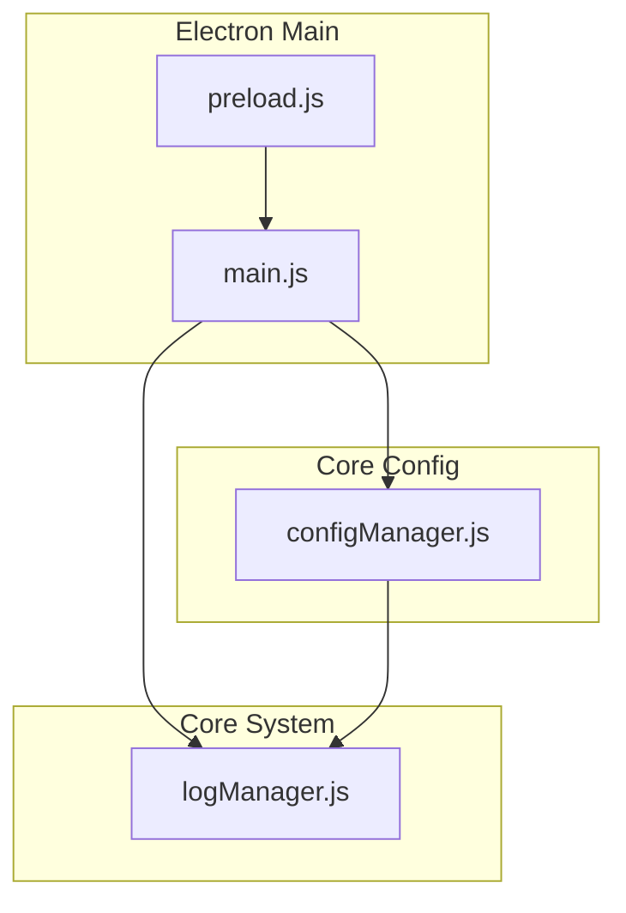
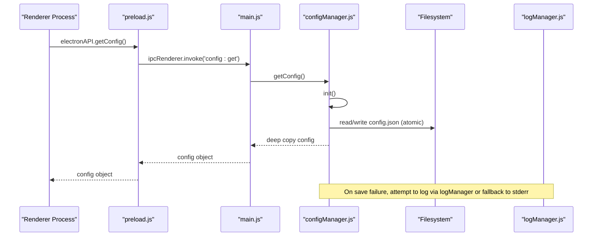
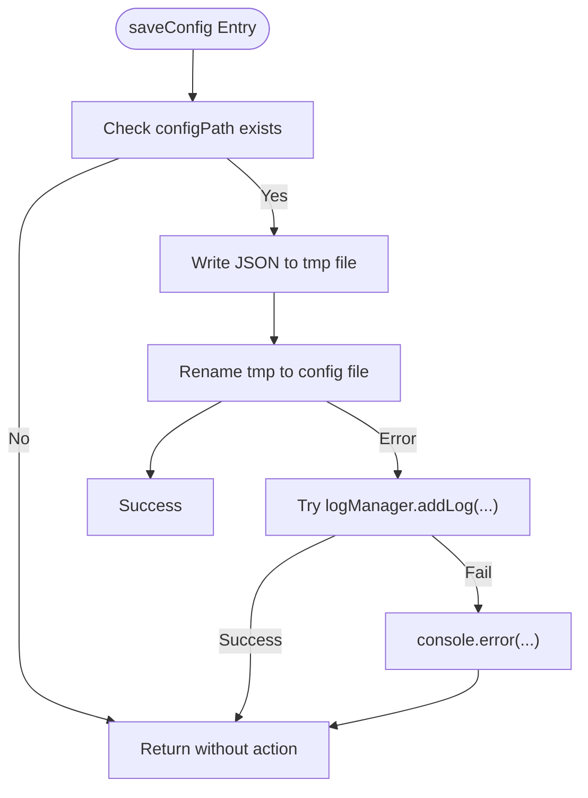
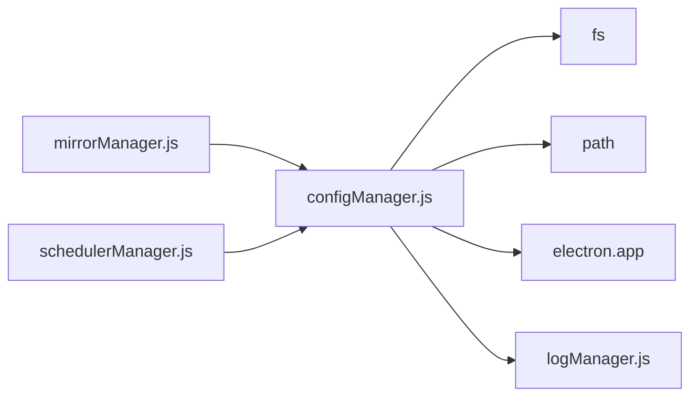

# Core Configuration Manager

<cite>
**Referenced Files in This Document**
- [configManager.js](file://core/config/configManager.js)
- [logManager.js](file://core/system/logManager.js)
- [main.js](file://main.js)
- [preload.js](file://preload.js)
</cite>

## Table of Contents
1. [Introduction](#introduction)
2. [Project Structure](#project-structure)
3. [Core Components](#core-components)
4. [Architecture Overview](#architecture-overview)
5. [Detailed Component Analysis](#detailed-component-analysis)
6. [Dependency Analysis](#dependency-analysis)
7. [Performance Considerations](#performance-considerations)
8. [Troubleshooting Guide](#troubleshooting-guide)
9. [Conclusion](#conclusion)

## Introduction
This document provides detailed API documentation for the core configuration manager module responsible for application configuration persistence, validation, and storage path management. It covers initialization, default value handling, validation rules, atomic file operations, schema definition, numeric range limits, automatic sanitization, thread-safety considerations, deep copying mechanisms, and cross-platform path resolution. It also includes examples of configuration persistence, error handling for corrupted files, and integration points with logging and IPC.

## Project Structure
The configuration manager resides under the core/config directory and is used by other modules such as mirror management and scheduling. The Electron main process exposes configuration APIs via IPC handlers, and a preload script bridges these to the renderer process.

**Diagram sources**
- [configManager.js:1-194](file://core/config/configManager.js#L1-L194)
- [logManager.js:1-176](file://core/system/logManager.js#L1-L176)
- [main.js:406-414](file://main.js#L406-L414)
- [preload.js:94-99](file://preload.js#L94-L99)

**Section sources**
- [configManager.js:1-194](file://core/config/configManager.js#L1-L194)
- [main.js:406-414](file://main.js#L406-L414)
- [preload.js:94-99](file://preload.js#L94-L99)

## Core Components
- Configuration Manager (configManager.js): Provides functions to initialize, read, write, bulk update, and retrieve configuration values; manages storage paths and ensures directories exist; performs atomic writes and handles corrupted config files gracefully.
- Log Manager (logManager.js): Used by the configuration manager to log errors when saving fails during early initialization stages.

Key exported functions from the configuration manager:
- getConfig(): Returns a deep copy of the current configuration object.
- setConfig(key, value): Sets a single configuration key after validation/sanitization and persists immediately.
- setBulk(updates): Applies multiple updates atomically with a single disk write.
- getStoragePath(): Returns the configured storage path and ensures the directory exists.
- init(): Initializes configuration if not already initialized.

**Section sources**
- [configManager.js:140-194](file://core/config/configManager.js#L140-L194)

## Architecture Overview
The configuration manager integrates with Electron’s app lifecycle and IPC layer. Renderer processes call into the main process via preload.js, which forwards requests to IPC handlers that invoke configManager methods. Logging is used for error reporting when necessary.

**Diagram sources**
- [main.js:406-414](file://main.js#L406-L414)
- [preload.js:94-99](file://preload.js#L94-L99)
- [configManager.js:120-138](file://core/config/configManager.js#L120-L138)

## Detailed Component Analysis

### Configuration Schema and Defaults
- Default fields include theme, language, storagePath, parallelThreads, retryCount, smartRoute, currentEnv, windowBounds.
- Numeric ranges are enforced:
  - parallelThreads: min 1, max 16, fallback to DEFAULT_THREADS
  - retryCount: min 0, max 10, fallback to DEFAULT_RETRY
- Non-numeric or non-finite values are replaced with defaults.
- Values are rounded to integers within allowed ranges.

**Section sources**
- [configManager.js:21-44](file://core/config/configManager.js#L21-L44)
- [configManager.js:86-117](file://core/config/configManager.js#L86-L117)

### Initialization and Persistence
- init():
  - Determines config directory using Electron userData when available; otherwise falls back to environment variables or current directory.
  - Ensures config directory exists.
  - Loads existing config JSON or creates defaults and saves immediately.
  - Handles corrupted JSON by resetting to defaults and saving.
- saveConfig():
  - Atomic write strategy: writes to a temporary file then renames to the target path.
  - Error handling attempts to use logManager; if unavailable, logs to stderr.

**Section sources**
- [configManager.js:56-117](file://core/config/configManager.js#L56-L117)
- [configManager.js:120-138](file://core/config/configManager.js#L120-L138)

### API Functions

#### getConfig()
- Behavior:
  - Ensures initialization.
  - Returns a deep copy of the configuration object to prevent external mutation.
- Complexity: O(n) where n is the size of the configuration object due to deep copy.
- Thread-safety:
  - Node.js is single-threaded per event loop; however, concurrent async calls may interleave. Since reads do not mutate state and writes serialize through saveConfig(), this function is safe for concurrent reads.

**Section sources**
- [configManager.js:140-147](file://core/config/configManager.js#L140-L147)

#### setConfig(key, value)
- Behavior:
  - Ensures initialization.
  - Sanitizes the value based on RANGE_LIMITS.
  - Persists immediately via saveConfig().
  - Returns a deep copy of the updated configuration.
- Validation:
  - Enforces numeric type and finite checks; clamps to min/max; rounds to integer.
- Concurrency:
  - Each call serializes writes via saveConfig(); returns a snapshot post-write.

**Section sources**
- [configManager.js:148-162](file://core/config/configManager.js#L148-L162)

#### setBulk(updates)
- Behavior:
  - Ensures initialization.
  - Iterates updates, sanitizing each value.
  - Performs a single saveConfig() call for all changes.
  - Returns a deep copy of the updated configuration.
- Performance:
  - Reduces disk I/O by batching writes.

**Section sources**
- [configManager.js:164-178](file://core/config/configManager.js#L164-L178)

#### getStoragePath()
- Behavior:
  - Ensures initialization.
  - If the configured storage path does not exist, creates it recursively.
  - Returns the storage path string.
- Cross-platform:
  - Uses OS-appropriate paths determined by Electron’s app.getPath('userData') or fallbacks.

**Section sources**
- [configManager.js:180-191](file://core/config/configManager.js#L180-L191)

### Atomic File Operations and Error Handling
- Atomic writes:
  - Writes to a .tmp file then renames to avoid partial writes on crash.
- Corrupted config handling:
  - Catches JSON parse errors and rebuilds defaults.
- Logging fallback:
  - Attempts to use logManager; if unavailable, outputs to stderr.

**Diagram sources**
- [configManager.js:120-138](file://core/config/configManager.js#L120-L138)
- [logManager.js:115-134](file://core/system/logManager.js#L115-L134)

**Section sources**
- [configManager.js:120-138](file://core/config/configManager.js#L120-L138)
- [logManager.js:115-134](file://core/system/logManager.js#L115-L134)

### Cross-Platform Path Resolution
- Config directory:
  - Electron app.getPath('userData') when ready; otherwise uses APPDATA/HOME or __dirname.
- Install directory:
  - Electron app.getPath('exe') when ready; otherwise __dirname.
- Storage path:
  - Derived from install directory default 'log' folder; created automatically if missing.

**Section sources**
- [configManager.js:56-72](file://core/config/configManager.js#L56-L72)
- [configManager.js:86-99](file://core/config/configManager.js#L86-L99)

### Deep Copying Mechanisms
- All public getters return deep copies via JSON.parse(JSON.stringify(...)) to prevent external mutation of internal state.
- This ensures thread-safe reads even under concurrent access patterns.

**Section sources**
- [configManager.js:140-147](file://core/config/configManager.js#L140-L147)

### Integration Points
- IPC exposure:
  - main.js registers handlers for config:get, config:set, config:setBulk.
- Preload bridge:
  - preload.js exposes electronAPI.getConfig, setConfig, setConfigBulk to the renderer.

**Section sources**
- [main.js:406-414](file://main.js#L406-L414)
- [preload.js:94-99](file://preload.js#L94-L99)

## Dependency Analysis
The configuration manager depends on Node.js fs and path modules, Electron app for platform paths, and optionally logManager for error logging. Other modules like mirrorManager and schedulerManager consume configuration via getConfig/setConfig/setBulk.

**Diagram sources**
- [configManager.js:17-19](file://core/config/configManager.js#L17-L19)
- [configManager.js:120-138](file://core/config/configManager.js#L120-L138)
- [mirrorManager.js:18](file://core/config/mirrorManager.js#L18)
- [schedulerManager.js:18](file://core/config/schedulerManager.js#L18)

**Section sources**
- [configManager.js:17-19](file://core/config/configManager.js#L17-L19)
- [mirrorManager.js:18](file://core/config/mirrorManager.js#L18)
- [schedulerManager.js:18](file://core/config/schedulerManager.js#L18)

## Performance Considerations
- Batch updates:
  - Use setBulk() to minimize disk writes when updating multiple keys.
- Deep copy overhead:
  - getConfig() performs a full deep copy; consider caching results in callers if frequently accessed.
- Atomic writes:
  - saveConfig() uses renameSync; ensure filesystem supports atomic rename semantics.
- Logging:
  - Avoid heavy logging during critical paths; logManager is optional and may be unavailable during early init.

[No sources needed since this section provides general guidance]

## Troubleshooting Guide
Common issues and resolutions:
- Corrupted configuration file:
  - The manager detects JSON parse errors and rebuilds defaults; verify the file content and permissions.
- Save failures:
  - Check filesystem permissions and disk space; review stderr output or log entries if available.
- Storage path not found:
  - getStoragePath() creates directories automatically; ensure parent directories are writable.
- IPC misconfiguration:
  - Ensure main.js handlers are registered and preload.js exposes correct methods.

**Section sources**
- [configManager.js:101-117](file://core/config/configManager.js#L101-L117)
- [configManager.js:120-138](file://core/config/configManager.js#L120-L138)
- [main.js:406-414](file://main.js#L406-L414)
- [preload.js:94-99](file://preload.js#L94-L99)

## Conclusion
The core configuration manager provides robust, validated, and persistent configuration management with atomic file operations, cross-platform path resolution, and safe deep-copy semantics. It integrates seamlessly with Electron’s IPC layer and offers reliable error handling for corrupted configurations. For optimal performance, prefer batch updates and cache frequent reads.

[No sources needed since this section summarizes without analyzing specific files]