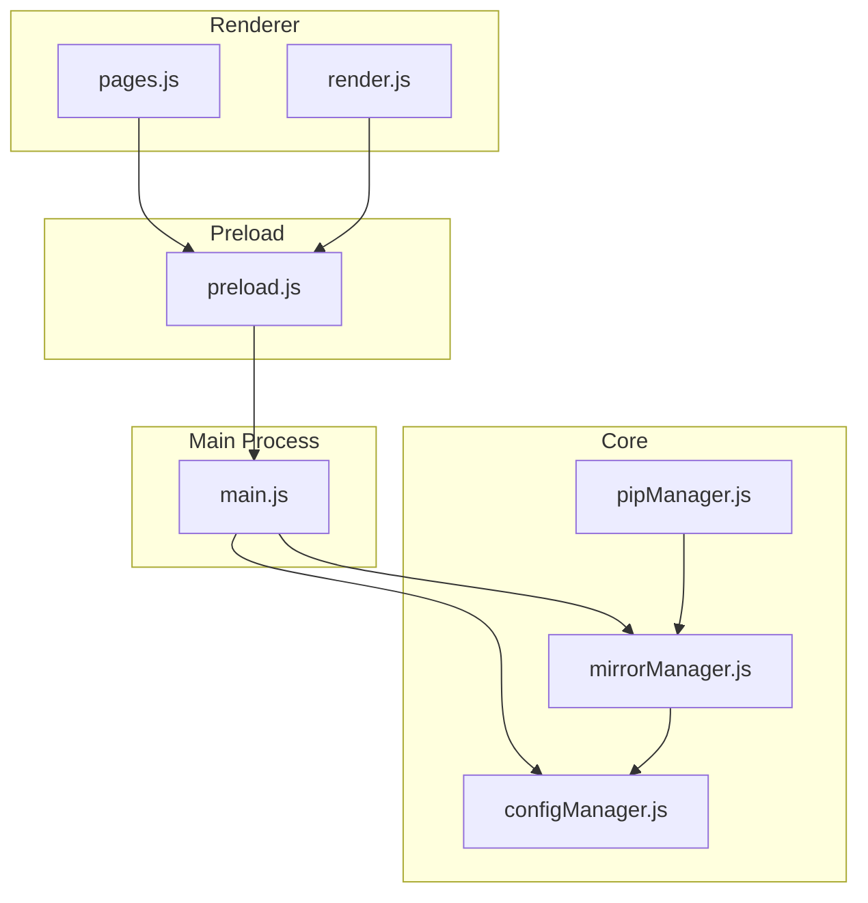
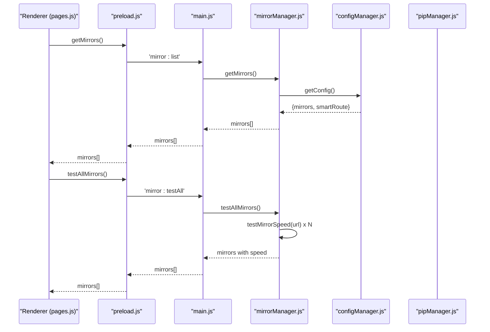
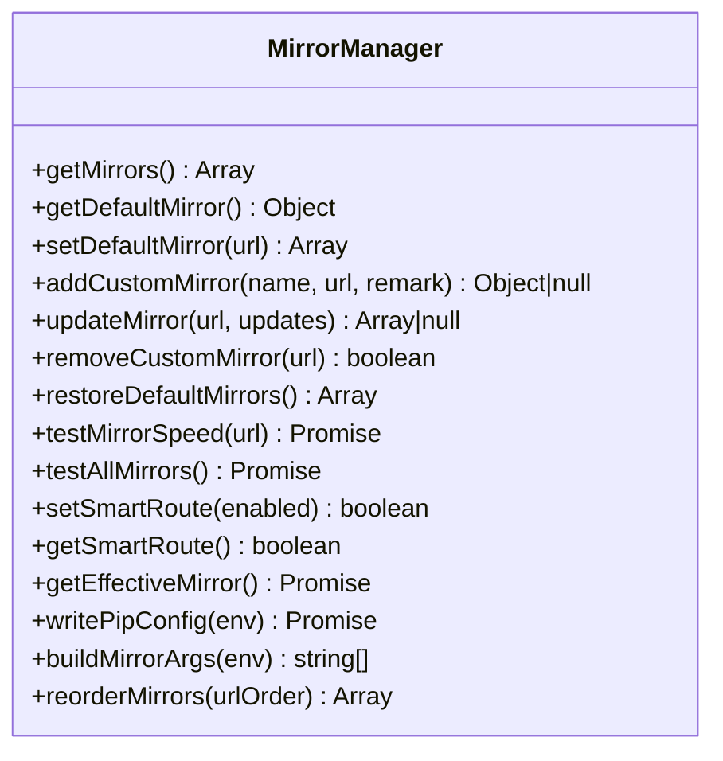
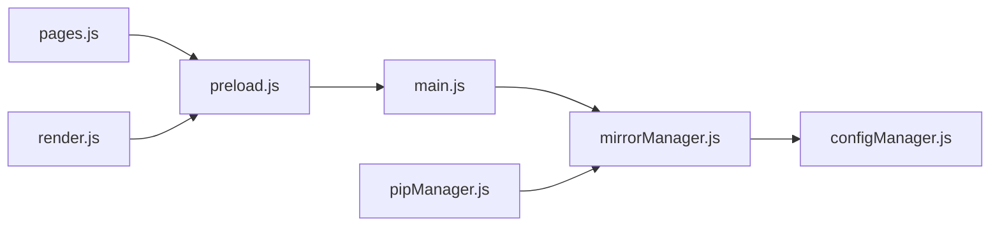

# Mirror Source Management

<cite>
**Referenced Files in This Document**
- [mirrorManager.js](file://core/config/mirrorManager.js)
- [configManager.js](file://core/config/configManager.js)
- [pipManager.js](file://core/operations/pipManager.js)
- [main.js](file://main.js)
- [preload.js](file://preload.js)
- [pages.js](file://renderer/js/pages.js)
- [render.js](file://renderer/js/render.js)
</cite>

## Table of Contents
1. [Introduction](#introduction)
2. [Project Structure](#project-structure)
3. [Core Components](#core-components)
4. [Architecture Overview](#architecture-overview)
5. [Detailed Component Analysis](#detailed-component-analysis)
6. [Dependency Analysis](#dependency-analysis)
7. [Performance Considerations](#performance-considerations)
8. [Troubleshooting Guide](#troubleshooting-guide)
9. [Conclusion](#conclusion)

## Introduction
This document provides comprehensive API documentation for the mirror source management functionality used to manage PyPI mirror sources. It covers adding and removing mirrors, setting defaults, testing mirror speed, built-in mirror configuration, custom mirror setup, selection algorithms, fallback strategies, caching, update mechanisms, and troubleshooting common connection issues. The implementation is part of an Electron-based application that integrates with pip through IPC channels.

## Project Structure
Mirror management spans multiple layers:
- Core logic resides in a dedicated manager module responsible for loading, validating, persisting, and selecting mirrors.
- Configuration persistence is handled by a centralized config manager.
- Package operations integrate mirror selection into pip commands.
- IPC bridges expose mirror APIs to the renderer UI.
- Renderer components provide user interactions for managing mirrors.

**Diagram sources**
- [mirrorManager.js:1-30](file://core/config/mirrorManager.js#L1-L30)
- [configManager.js:1-20](file://core/config/configManager.js#L1-L20)
- [pipManager.js:600-633](file://core/operations/pipManager.js#L600-L633)
- [main.js:370-395](file://main.js#L370-L395)
- [preload.js:70-86](file://preload.js#L70-L86)
- [pages.js:30-160](file://renderer/js/pages.js#L30-L160)
- [render.js:230-318](file://renderer/js/render.js#L230-L318)

**Section sources**
- [mirrorManager.js:1-30](file://core/config/mirrorManager.js#L1-L30)
- [configManager.js:1-20](file://core/config/configManager.js#L1-L20)
- [pipManager.js:600-633](file://core/operations/pipManager.js#L600-L633)
- [main.js:370-395](file://main.js#L370-L395)
- [preload.js:70-86](file://preload.js#L70-L86)
- [pages.js:30-160](file://renderer/js/pages.js#L30-L160)
- [render.js:230-318](file://renderer/js/render.js#L230-L318)

## Core Components
- Mirror Manager: Provides APIs to list mirrors, add/remove/update, set default, test speed, reorder, write pip config, and select effective mirror based on smart routing.
- Config Manager: Persists application settings including mirror lists and smart routing flag.
- Pip Manager: Integrates mirror selection into package installation flows with fallback across mirrors.
- IPC Bridge (Main + Preload): Exposes mirror APIs to the renderer via IPC handlers and wrappers.
- Renderer Pages/Render: User-facing functions to add, edit, remove mirrors, run speed tests, toggle smart routing, and reorder mirrors.

Key responsibilities:
- URL validation and normalization
- Caching of mirror lists and speeds
- Smart routing vs default selection
- Persisting mirror state and pip configuration
- Robust fallback during package operations

**Section sources**
- [mirrorManager.js:1-30](file://core/config/mirrorManager.js#L1-L30)
- [configManager.js:1-20](file://core/config/configManager.js#L1-L20)
- [pipManager.js:600-633](file://core/operations/pipManager.js#L600-L633)
- [main.js:370-395](file://main.js#L370-L395)
- [preload.js:70-86](file://preload.js#L70-L86)
- [pages.js:30-160](file://renderer/js/pages.js#L30-L160)
- [render.js:230-318](file://renderer/js/render.js#L230-L318)

## Architecture Overview
The mirror management architecture follows a layered design:
- Renderer triggers actions via preload IPC wrappers.
- Main process handles IPC calls and delegates to core modules.
- Mirror manager orchestrates mirror data, persistence, and selection.
- Config manager persists settings atomically.
- Pip manager uses mirror selection to construct pip commands and implement fallback.

**Diagram sources**
- [pages.js:88-106](file://renderer/js/pages.js#L88-L106)
- [preload.js:75-86](file://preload.js#L75-L86)
- [main.js:373-377](file://main.js#L373-L377)
- [mirrorManager.js:240-247](file://core/config/mirrorManager.js#L240-L247)
- [configManager.js:144-147](file://core/config/configManager.js#L144-L147)

## Detailed Component Analysis

### Mirror Manager API
The mirror manager exposes a comprehensive API for mirror lifecycle and performance testing.

- Built-in mirrors: A predefined list includes official PyPI and several popular Chinese mirrors.
- Custom mirrors: Users can add, update, and remove custom mirrors.
- Default mirror: Ensures exactly one default mirror; if none or multiple exist, it normalizes to the first.
- Speed testing: HEAD request to a known path with timeout handling; returns milliseconds or a failure marker.
- Smart routing: Optional feature to automatically pick the fastest mirror based on measured speeds.
- Persistence: Mirrors are saved with essential fields; speeds are persisted after tests.
- Pip integration: Writes global pip configuration and builds command-line arguments for non-default mirrors.

Key functions:
- getMirrors(): Returns a copy of the merged mirror list (built-in + custom).
- getDefaultMirror(): Returns the currently marked default mirror.
- setDefaultMirror(url): Sets a specific mirror as default and persists changes.
- addCustomMirror(name, url, remark?): Adds a new custom mirror after validation.
- updateMirror(url, updates?): Updates name, url, remark with validation and conflict checks.
- removeCustomMirror(url): Removes a custom mirror; adjusts default if needed.
- restoreDefaultMirrors(): Clears custom mirrors and restores built-in defaults.
- testMirrorSpeed(url): Measures response time using HEAD request with timeout.
- testAllMirrors(): Parallel speed tests for all mirrors; persists results.
- setSmartRoute(enabled)/getSmartRoute(): Toggle and read smart routing preference.
- getEffectiveMirror(): Returns best mirror if smart routing enabled, else default.
- writePipConfig(env?): Writes index-url and timeout to pip config file.
- buildMirrorArgs(env?): Builds pip args for non-official mirrors.
- reorderMirrors(urlOrder[]): Reorders mirrors according to provided order.

**Diagram sources**
- [mirrorManager.js:109-357](file://core/config/mirrorManager.js#L109-L357)

**Section sources**
- [mirrorManager.js:21-29](file://core/config/mirrorManager.js#L21-L29)
- [mirrorManager.js:43-51](file://core/config/mirrorManager.js#L43-L51)
- [mirrorManager.js:60-91](file://core/config/mirrorManager.js#L60-L91)
- [mirrorManager.js:97-107](file://core/config/mirrorManager.js#L97-L107)
- [mirrorManager.js:115-130](file://core/config/mirrorManager.js#L115-L130)
- [mirrorManager.js:139-150](file://core/config/mirrorManager.js#L139-L150)
- [mirrorManager.js:158-179](file://core/config/mirrorManager.js#L158-L179)
- [mirrorManager.js:187-197](file://core/config/mirrorManager.js#L187-L197)
- [mirrorManager.js:204-210](file://core/config/mirrorManager.js#L204-L210)
- [mirrorManager.js:219-233](file://core/config/mirrorManager.js#L219-L233)
- [mirrorManager.js:240-247](file://core/config/mirrorManager.js#L240-L247)
- [mirrorManager.js:250-260](file://core/config/mirrorManager.js#L250-L260)
- [mirrorManager.js:267-276](file://core/config/mirrorManager.js#L267-L276)
- [mirrorManager.js:284-290](file://core/config/mirrorManager.js#L284-L290)
- [mirrorManager.js:299-322](file://core/config/mirrorManager.js#L299-L322)
- [mirrorManager.js:329-333](file://core/config/mirrorManager.js#L329-L333)
- [mirrorManager.js:340-357](file://core/config/mirrorManager.js#L340-L357)

### Configuration Manager
The config manager centralizes persistent storage for application settings, including mirror lists and smart routing flags. It ensures atomic writes and sanitization of numeric values.

Key behaviors:
- Initializes configuration directory and file paths.
- Loads existing config or creates defaults.
- Sanitizes numeric values within defined ranges.
- Saves configurations atomically using temporary files and rename.

**Section sources**
- [configManager.js:21-29](file://core/config/configManager.js#L21-L29)
- [configManager.js:80-117](file://core/config/configManager.js#L80-L117)
- [configManager.js:123-138](file://core/config/configManager.js#L123-L138)
- [configManager.js:144-147](file://core/config/configManager.js#L144-L147)
- [configManager.js:157-162](file://core/config/configManager.js#L157-L162)
- [configManager.js:171-178](file://core/config/configManager.js#L171-L178)

### Pip Manager Integration
Package installation routines integrate mirror selection and fallback strategies:
- Installs use a default-first order and iterate through mirrors up to a maximum attempt count.
- For requirements.txt installs, retries are controlled by configuration and mirror availability.
- Non-official mirrors are passed via --index-url when constructing pip commands.

Fallback strategy:
- Attempts installation sequentially across mirrors until success or max attempts reached.
- Logs warnings per failed mirror and throws aggregated error upon exhaustion.

**Section sources**
- [pipManager.js:608-633](file://core/operations/pipManager.js#L608-L633)
- [pipManager.js:645-730](file://core/operations/pipManager.js#L645-L730)

### IPC Bridge (Main + Preload)
IPC handlers expose mirror APIs to the renderer:
- List mirrors, test single/all mirrors, set default, add/update/remove custom mirrors, restore defaults, toggle smart routing, write pip config, reorder mirrors.
- Preload wraps these handlers for convenient renderer-side invocation.

**Section sources**
- [main.js:373-395](file://main.js#L373-L395)
- [preload.js:75-86](file://preload.js#L75-L86)

### Renderer UI Interactions
User interactions for mirror management include:
- Adding custom mirrors with validation and auto-name generation from hostname.
- Editing mirrors with URL format checks and duplicate prevention.
- Removing mirrors and updating UI accordingly.
- Running speed tests and displaying fastest mirror info.
- Toggling smart routing and restoring defaults.
- Drag-and-drop reordering with persistence.

**Section sources**
- [pages.js:34-46](file://renderer/js/pages.js#L34-L46)
- [pages.js:61-86](file://renderer/js/pages.js#L61-L86)
- [pages.js:88-106](file://renderer/js/pages.js#L88-L106)
- [pages.js:109-138](file://renderer/js/pages.js#L109-L138)
- [pages.js:141-150](file://renderer/js/pages.js#L141-L150)
- [pages.js:153-161](file://renderer/js/pages.js#L153-L161)
- [render.js:230-318](file://renderer/js/render.js#L230-L318)

## Dependency Analysis
Mirror management depends on:
- Config manager for persistent storage and defaults.
- File system and OS utilities for writing pip configuration.
- Network fetch API for speed testing with AbortController and timeouts.
- IPC layer for cross-process communication between renderer and main.
- Pip manager for integrating mirror selection into package operations.

**Diagram sources**
- [pages.js:30-160](file://renderer/js/pages.js#L30-L160)
- [render.js:230-318](file://renderer/js/render.js#L230-L318)
- [preload.js:75-86](file://preload.js#L75-L86)
- [main.js:373-395](file://main.js#L373-L395)
- [mirrorManager.js:1-30](file://core/config/mirrorManager.js#L1-L30)
- [configManager.js:1-20](file://core/config/configManager.js#L1-L20)
- [pipManager.js:600-633](file://core/operations/pipManager.js#L600-L633)

**Section sources**
- [mirrorManager.js:1-30](file://core/config/mirrorManager.js#L1-L30)
- [configManager.js:1-20](file://core/config/configManager.js#L1-L20)
- [pipManager.js:600-633](file://core/operations/pipManager.js#L600-L633)
- [main.js:373-395](file://main.js#L373-L395)
- [preload.js:75-86](file://preload.js#L75-L86)
- [pages.js:30-160](file://renderer/js/pages.js#L30-L160)
- [render.js:230-318](file://renderer/js/render.js#L230-L318)

## Performance Considerations
- Caching: Mirror list is cached in memory to avoid repeated disk reads; speeds are stored per mirror and reused unless invalidated.
- Parallel speed tests: All mirrors are tested concurrently to minimize latency.
- Smart routing: When enabled, selects the fastest mirror based on measured speeds; otherwise falls back to user-selected default.
- Atomic config writes: Prevents corruption by writing to a temporary file and renaming.
- Timeout handling: Speed tests use a fixed timeout to avoid hanging on unresponsive mirrors.

Optimization opportunities:
- Cache invalidation strategy for speed measurements could be configurable (e.g., TTL-based).
- Batched pip config writes could reduce filesystem I/O when multiple mirrors change rapidly.
- Adaptive retry counts based on historical success rates per mirror.

[No sources needed since this section provides general guidance]

## Troubleshooting Guide
Common issues and resolutions:
- Invalid mirror URL: Ensure URLs start with http:// or https:// and do not exceed length limits. The validator rejects malformed URLs.
- Connection timeouts: Speed tests return a failure marker when requests fail or time out; verify network connectivity and firewall rules.
- Duplicate mirror URLs: Update/add operations check for duplicates; ensure unique URLs before saving.
- Pip config write failures: Check permissions for writing to platform-specific pip config directories; logs capture errors when writing fails.
- Smart routing not selected: Confirm smart routing is enabled; otherwise default mirror is used regardless of speed.

Diagnostic steps:
- Use testMirrorSpeed(url) to validate individual mirrors.
- Run testAllMirrors() to measure all mirrors and identify the fastest.
- Inspect pip configuration written to ensure correct index-url and timeout.
- Review logs for write failures and network errors.

**Section sources**
- [mirrorManager.js:43-51](file://core/config/mirrorManager.js#L43-L51)
- [mirrorManager.js:219-233](file://core/config/mirrorManager.js#L219-L233)
- [mirrorManager.js:299-322](file://core/config/mirrorManager.js#L299-L322)
- [pages.js:61-86](file://renderer/js/pages.js#L61-L86)
- [pages.js:88-106](file://renderer/js/pages.js#L88-L106)

## Conclusion
The mirror source management system provides robust capabilities for managing PyPI mirrors, including validation, persistence, speed testing, smart routing, and pip integration. It balances usability and reliability through careful validation, caching, parallel operations, and fallback strategies. By leveraging IPC and modular design, it offers a clear API surface for both programmatic and user-driven mirror management.

[No sources needed since this section summarizes without analyzing specific files]