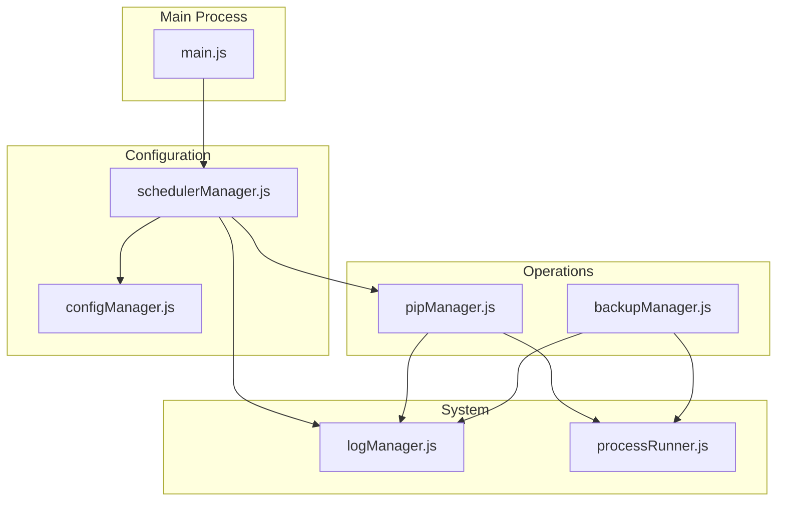
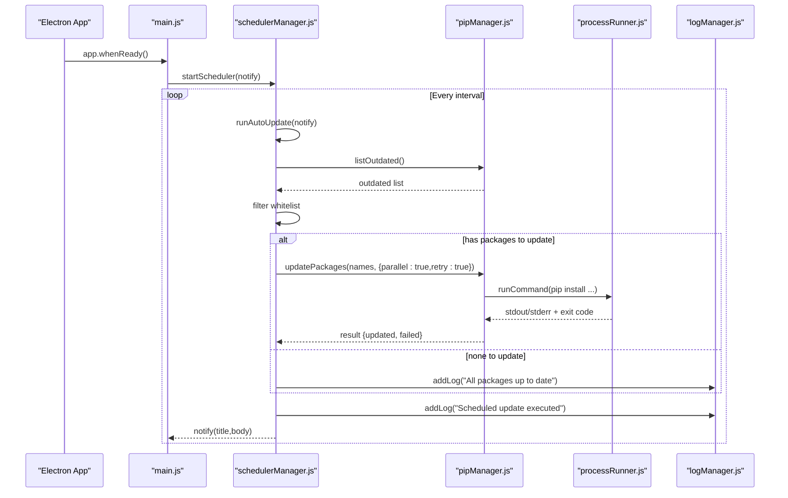
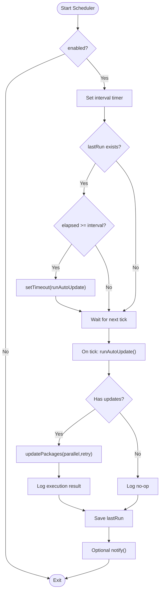
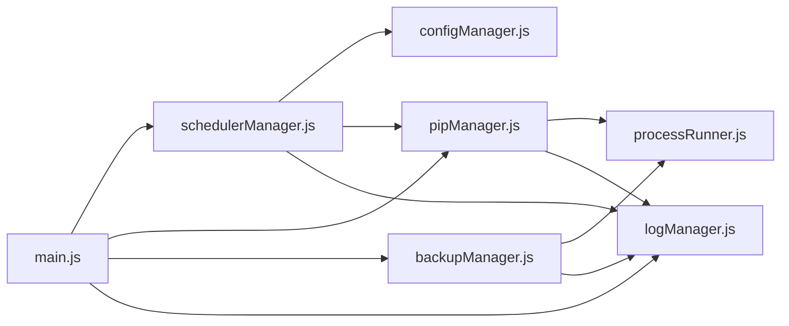

# Scheduler Configuration

<cite>
**Referenced Files in This Document**
- [main.js](file://main.js)
- [schedulerManager.js](file://core/config/schedulerManager.js)
- [configManager.js](file://core/config/configManager.js)
- [pipManager.js](file://core/operations/pipManager.js)
- [backupManager.js](file://core/operations/backupManager.js)
- [logManager.js](file://core/system/logManager.js)
- [processRunner.js](file://utils/processRunner.js)
</cite>

## Table of Contents
1. [Introduction](#introduction)
2. [Project Structure](#project-structure)
3. [Core Components](#core-components)
4. [Architecture Overview](#architecture-overview)
5. [Detailed Component Analysis](#detailed-component-analysis)
6. [Dependency Analysis](#dependency-analysis)
7. [Performance Considerations](#performance-considerations)
8. [Troubleshooting Guide](#troubleshooting-guide)
9. [Conclusion](#conclusion)
10. [Appendices](#appendices)

## Introduction
This document provides detailed API documentation for scheduler configuration and automated task management. It covers scheduling functions for periodic updates, backup operations, and maintenance tasks. The system uses a simple interval-based scheduler (daily or weekly) rather than cron-like expressions. It also explains task lifecycle, error handling, retry mechanisms, monitoring, logging, debugging, resource management, concurrent execution safeguards, and graceful shutdown procedures. Examples are provided for setting up automated backups, package updates, and system maintenance tasks.

## Project Structure
The scheduler and related task management features are implemented across several modules:
- main.js: Application entry point; wires IPC handlers and starts the scheduler on app ready.
- core/config/schedulerManager.js: Interval-based scheduler for automatic updates with whitelist support and persistence.
- core/config/configManager.js: Centralized configuration storage and validation.
- core/operations/pipManager.js: Core pip operations including outdated listing, update execution, conflict detection, and health checks.
- core/operations/backupManager.js: Backup creation, restoration, listing, and deletion with secure ID validation.
- core/system/logManager.js: Persistent operation logs with filtering, truncation, and debounced writes.
- utils/processRunner.js: Subprocess runner with timeout, cancellation, and pip auto-installation.

**Diagram sources**
- [main.js:130-150](file://main.js#L130-L150)
- [schedulerManager.js:145-163](file://core/config/schedulerManager.js#L145-L163)
- [configManager.js:80-117](file://core/config/configManager.js#L80-L117)
- [pipManager.js:1460-1503](file://core/operations/pipManager.js#L1460-L1503)
- [backupManager.js:89-113](file://core/operations/backupManager.js#L89-L113)
- [logManager.js:115-134](file://core/system/logManager.js#L115-L134)
- [processRunner.js:85-161](file://utils/processRunner.js#L85-L161)

**Section sources**
- [main.js:130-150](file://main.js#L130-L150)
- [schedulerManager.js:1-197](file://core/config/schedulerManager.js#L1-L197)
- [configManager.js:1-194](file://core/config/configManager.js#L1-L194)
- [pipManager.js:1-200](file://core/operations/pipManager.js#L1-L200)
- [backupManager.js:1-196](file://core/operations/backupManager.js#L1-L196)
- [logManager.js:1-176](file://core/system/logManager.js#L1-L176)
- [processRunner.js:1-366](file://utils/processRunner.js#L1-L366)

## Core Components
- Scheduler Manager: Provides start/stop/status, configuration retrieval and persistence, and an automatic update routine that lists outdated packages, filters by whitelist, and performs batch updates with logging and notifications.
- Config Manager: Manages application configuration with defaults, sanitization, and atomic file writes.
- Pip Manager: Implements package operations including outdated listing, update execution, dependency conflict detection, health checks, and process cancellation.
- Backup Manager: Creates environment snapshots via pip freeze, restores from backups using force-reinstall, and manages backup files securely.
- Log Manager: Persists structured logs with filtering, truncation, and debounced writes to avoid excessive disk I/O.
- Process Runner: Executes subprocesses with timeouts, ANSI cleanup, real-time output callbacks, and robust cancellation strategies.

**Section sources**
- [schedulerManager.js:29-50](file://core/config/schedulerManager.js#L29-L50)
- [configManager.js:80-117](file://core/config/configManager.js#L80-L117)
- [pipManager.js:1460-1503](file://core/operations/pipManager.js#L1460-L1503)
- [backupManager.js:89-113](file://core/operations/backupManager.js#L89-L113)
- [logManager.js:115-134](file://core/system/logManager.js#L115-L134)
- [processRunner.js:85-161](file://utils/processRunner.js#L85-L161)

## Architecture Overview
The scheduler is started during application initialization. It periodically triggers automatic updates based on configured frequency (daily or weekly). Each scheduled run queries outdated packages, applies whitelist filtering, and executes batch updates through pipManager. Results are logged and optionally notified to the UI.

**Diagram sources**
- [main.js:140-145](file://main.js#L140-L145)
- [schedulerManager.js:70-138](file://core/config/schedulerManager.js#L70-L138)
- [pipManager.js:1460-1503](file://core/operations/pipManager.js#L1460-L1503)
- [processRunner.js:85-161](file://utils/processRunner.js#L85-L161)
- [logManager.js:115-134](file://core/system/logManager.js#L115-L134)

## Detailed Component Analysis

### Scheduler Manager API
- getSchedulerConfig(): Returns enabled flag, frequency ('daily' | 'weekly'), whitelist array, and lastRun timestamp.
- saveSchedulerConfig(updates): Persists changes to config (enabled, frequency, whitelist, lastRun).
- getInterval(frequency): Converts frequency to milliseconds (daily=86400000, weekly=604800000).
- runAutoUpdate(notify?): Performs outdated check, whitelist filtering, batch update, logging, and optional notification.
- startScheduler(notify?): Starts interval timer; if lastRun exceeds interval, schedules immediate execution after delay.
- stopScheduler(): Clears interval timer.
- getStatus(): Returns active state, running flag, and lastRun time.

**Diagram sources**
- [schedulerManager.js:145-163](file://core/config/schedulerManager.js#L145-L163)
- [schedulerManager.js:70-138](file://core/config/schedulerManager.js#L70-L138)

**Section sources**
- [schedulerManager.js:29-50](file://core/config/schedulerManager.js#L29-L50)
- [schedulerManager.js:57-59](file://core/config/schedulerManager.js#L57-L59)
- [schedulerManager.js:70-138](file://core/config/schedulerManager.js#L70-L138)
- [schedulerManager.js:145-163](file://core/config/schedulerManager.js#L145-L163)
- [schedulerManager.js:179-187](file://core/config/schedulerManager.js#L179-L187)

### Pip Manager Task Management
Key APIs relevant to scheduling and maintenance:
- listOutdated(): Lists packages with available updates.
- updatePackages(packages, options, onOutput?): Executes updates with parallelism and retry flags; supports operationId for cancellation.
- checkConflicts(): Runs pip check to detect dependency conflicts and returns structured results.
- healthCheck(): Comprehensive diagnostic report including broken packages, missing metadata, and site-packages accessibility.
- cancelPipOperation(operationId): Cancels all processes associated with an operationId.

Concurrency and safety:
- Environment-level locks ensure serial execution per Python environment to prevent conflicts.
- Package spec validation prevents command injection and path traversal.
- Real-time progress events enable UI updates and monitoring.

**Section sources**
- [pipManager.js:1460-1503](file://core/operations/pipManager.js#L1460-L1503)
- [pipManager.js:1510-1584](file://core/operations/pipManager.js#L1510-L1584)
- [pipManager.js:72-85](file://core/operations/pipManager.js#L72-L85)
- [pipManager.js:154-235](file://core/operations/pipManager.js#L154-L235)

### Backup Manager API
- createBackup(env?): Generates a snapshot using pip freeze and saves it under storage/backups with a secure filename.
- listBackups(): Returns sorted backup entries with id, path, createdAt, size.
- restoreBackup(backupId, env, onOutput?): Restores environment using force-reinstall and no-deps; validates backupId to prevent path traversal.
- deleteBackup(backupId): Deletes a backup file safely.
- validateBackupId(backupId): Enforces format and security constraints.

Security considerations:
- Backup IDs must match a strict pattern and disallow path traversal characters.
- File operations are constrained to the designated backups directory.

**Section sources**
- [backupManager.js:89-113](file://core/operations/backupManager.js#L89-L113)
- [backupManager.js:122-142](file://core/operations/backupManager.js#L122-L142)
- [backupManager.js:156-170](file://core/operations/backupManager.js#L156-L170)
- [backupManager.js:179-193](file://core/operations/backupManager.js#L179-L193)
- [backupManager.js:62-78](file://core/operations/backupManager.js#L62-L78)

### Log Manager API
- addLog(entry): Adds a structured log entry with time, action, status, type, detail; truncates long fields; debounced write.
- getLogs(filter?): Filters by type and search keyword; enforces max search length.
- clearLogs(): Clears all logs and persists.
- flushLogs(): Immediately writes logs to disk without debounce.

Capacity control:
- Maximum 2000 entries; older entries trimmed when exceeded.
- Field truncation prevents oversized logs.

**Section sources**
- [logManager.js:115-134](file://core/system/logManager.js#L115-L134)
- [logManager.js:146-162](file://core/system/logManager.js#L146-L162)
- [logManager.js:168-173](file://core/system/logManager.js#L168-L173)
- [logManager.js:91-99](file://core/system/logManager.js#L91-L99)

### Process Runner API
- runCommand(command, args, options?): Spawns child processes with UTF-8 encoding, ANSI cleanup, real-time output, and timeout handling.
- runPip(pythonPath, args, options?): Wrapper around runCommand for pip commands.
- ensurePip(pythonPath, onOutput?): Ensures pip availability via ensurepip or get-pip.py installation.
- cancelProcess(processId), cancelOperation(operationId), cancelAllProcesses(): Graceful cancellation strategies.

Timeout and termination:
- SIGTERM followed by SIGKILL after delay ensures robust termination.
- Active process tracking enables targeted cancellation.

**Section sources**
- [processRunner.js:85-161](file://utils/processRunner.js#L85-L161)
- [processRunner.js:233-278](file://utils/processRunner.js#L233-L278)
- [processRunner.js:168-206](file://utils/processRunner.js#L168-L206)

### IPC Handlers for Scheduler and Tasks
- scheduler:getStatus: Returns current scheduler status and configuration.
- scheduler:save: Saves scheduler configuration and restarts scheduler with updated settings.
- scheduler:runNow: Triggers an immediate scheduled update execution.
- backup:create, backup:list, backup:restore, backup:delete: Expose backup operations via IPC.
- log:get, log:clear, log:add: Manage logs via IPC.
- pip:update, pip:cancel: Execute updates and cancel ongoing operations.

Notifications:
- On scheduler execution, main.js sends 'scheduler:executed' event to the renderer with body text.

**Section sources**
- [main.js:526-546](file://main.js#L526-L546)
- [main.js:358-368](file://main.js#L358-L368)
- [main.js:399-404](file://main.js#L399-L404)
- [main.js:332-341](file://main.js#L332-L341)
- [main.js:140-145](file://main.js#L140-L145)

## Dependency Analysis
The scheduler depends on configuration, pip operations, logging, and process execution. The following diagram shows key dependencies and interactions:

**Diagram sources**
- [schedulerManager.js:18-20](file://core/config/schedulerManager.js#L18-L20)
- [pipManager.js:22-27](file://core/operations/pipManager.js#L22-L27)
- [backupManager.js:21-23](file://core/operations/backupManager.js#L21-L23)
- [main.js:17-31](file://main.js#L17-L31)

**Section sources**
- [schedulerManager.js:18-20](file://core/config/schedulerManager.js#L18-L20)
- [pipManager.js:22-27](file://core/operations/pipManager.js#L22-L27)
- [backupManager.js:21-23](file://core/operations/backupManager.js#L21-L23)
- [main.js:17-31](file://main.js#L17-L31)

## Performance Considerations
- Debounced log writes reduce disk I/O bursts; use flushLogs() before shutdown to ensure persistence.
- Installed package cache minimizes repeated scans; consider clearing caches after major operations.
- Parallel updates can speed up batch operations but may increase CPU and network load; tune parallelThreads via config.
- Timeout and cancellation prevent hung processes; adjust timeouts based on environment and network conditions.
- Health checks and conflict detection should be run off critical paths to avoid blocking user interactions.

[No sources needed since this section provides general guidance]

## Troubleshooting Guide
Common issues and resolutions:
- Scheduler not running: Ensure scheduler.enabled is true and frequency is set; verify lastRun logic and intervals.
- No updates detected: Confirm pip index access and outdated listing; check whitelist filtering.
- Update failures: Inspect logs for stderr output; verify pip availability and network connectivity; use repairPip if necessary.
- Backup restore errors: Validate backupId format and file existence; ensure correct Python environment selected.
- Logs not persisting: Check storage path permissions; call flushLogs() on shutdown; review debounced write behavior.
- Process hangs: Use cancelOperation(operationId) or cancelAllProcesses(); monitor active processes map.

**Section sources**
- [schedulerManager.js:70-138](file://core/config/schedulerManager.js#L70-L138)
- [logManager.js:115-134](file://core/system/logManager.js#L115-L134)
- [processRunner.js:168-206](file://utils/processRunner.js#L168-L206)
- [pipManager.js:1460-1503](file://core/operations/pipManager.js#L1460-L1503)

## Conclusion
The scheduler provides a reliable interval-based mechanism for automated package updates with configurable frequency and whitelist filtering. Combined with robust pip operations, backup capabilities, structured logging, and process management, it offers a comprehensive solution for maintaining Python environments. While cron-like expressions are not supported, the daily/weekly model covers typical automation needs. For advanced scheduling requirements, consider integrating external schedulers or extending the scheduler manager to parse cron expressions.

[No sources needed since this section summarizes without analyzing specific files]

## Appendices

### Cron-like Expression Support
The current implementation does not support cron-like expressions. Scheduling is limited to fixed intervals derived from 'daily' or 'weekly' frequencies. To implement cron-like scheduling, extend schedulerManager.js to parse cron strings and compute next execution times accordingly.

[No sources needed since this section discusses conceptual extension]

### Task Priority Management
Task priority is not explicitly modeled. Updates execute sequentially within an environment due to environment-level locks. To introduce priorities, modify pipManager.js to queue tasks with priority levels and schedule higher-priority tasks first while preserving concurrency controls.

[No sources needed since this section discusses conceptual extension]

### Conflict Resolution
Conflict resolution is performed via pip check, which identifies version mismatches and missing dependencies. The healthCheck function aggregates issues and computes a score. For automated resolution, integrate dependency reconciliation strategies (e.g., upgrading conflicting packages or rolling back to known-good states).

**Section sources**
- [pipManager.js:1460-1503](file://core/operations/pipManager.js#L1460-L1503)
- [pipManager.js:1510-1584](file://core/operations/pipManager.js#L1510-L1584)

### Scheduled Job Lifecycle
Lifecycle stages:
- Initialization: startScheduler sets interval and checks lastRun for immediate execution.
- Execution: runAutoUpdate lists outdated packages, filters whitelist, performs updates, logs results, and notifies.
- Completion: lastRun is saved; isRunning flag cleared; notifications sent.
- Shutdown: stopScheduler clears timers; main.js cancels active processes and flushes logs.

**Section sources**
- [schedulerManager.js:145-163](file://core/config/schedulerManager.js#L145-L163)
- [schedulerManager.js:70-138](file://core/config/schedulerManager.js#L70-L138)
- [main.js:161-170](file://main.js#L161-L170)

### Error Handling and Retry Mechanisms
- Errors in runAutoUpdate are caught and logged; lastRun is still updated to avoid re-triggering immediately.
- pip operations support retry flags; processRunner handles timeouts and termination signals.
- Backup operations validate inputs and throw descriptive errors; logManager captures failures.

**Section sources**
- [schedulerManager.js:125-138](file://core/config/schedulerManager.js#L125-L138)
- [processRunner.js:85-161](file://utils/processRunner.js#L85-L161)
- [backupManager.js:62-78](file://core/operations/backupManager.js#L62-L78)

### Resource Management and Concurrent Execution
- Environment locks prevent concurrent modifications within the same Python environment.
- ProcessRunner tracks active processes and supports cancellation by operationId.
- LogManager debounces writes to minimize I/O contention.

**Section sources**
- [pipManager.js:72-85](file://core/operations/pipManager.js#L72-L85)
- [processRunner.js:168-206](file://utils/processRunner.js#L168-L206)
- [logManager.js:72-86](file://core/system/logManager.js#L72-L86)

### Graceful Shutdown Procedures
- main.js registers before-quit handler to cancel all active processes and flush logs.
- stopScheduler clears timers to prevent further executions.
- EnsurePip and processRunner handle cleanup of temporary resources and processes.

**Section sources**
- [main.js:161-170](file://main.js#L161-L170)
- [schedulerManager.js:168-173](file://core/config/schedulerManager.js#L168-L173)
- [processRunner.js:197-206](file://utils/processRunner.js#L197-L206)

### Examples

#### Setting Up Automated Backups
- Create a backup snapshot of the current environment using backupManager.createBackup().
- List existing backups via backupManager.listBackups().
- Restore from a backup using backupManager.restoreBackup(backupId, env, onOutput?).
- Delete unwanted backups with backupManager.deleteBackup(backupId).

**Section sources**
- [backupManager.js:89-113](file://core/operations/backupManager.js#L89-L113)
- [backupManager.js:122-142](file://core/operations/backupManager.js#L122-L142)
- [backupManager.js:156-170](file://core/operations/backupManager.js#L156-L170)
- [backupManager.js:179-193](file://core/operations/backupManager.js#L179-L193)

#### Configuring Periodic Package Updates
- Enable scheduler via configManager.setConfig('schedulerEnabled', true).
- Set frequency to 'daily' or 'weekly'.
- Optionally configure whitelist to exclude specific packages.
- Start scheduler with schedulerManager.startScheduler(notify).
- Trigger immediate execution via schedulerManager.runAutoUpdate(notify).

**Section sources**
- [schedulerManager.js:29-50](file://core/config/schedulerManager.js#L29-L50)
- [schedulerManager.js:145-163](file://core/config/schedulerManager.js#L145-L163)
- [schedulerManager.js:70-138](file://core/config/schedulerManager.js#L70-L138)

#### Running System Maintenance Tasks
- Perform dependency conflict checks using pipManager.checkConflicts().
- Run health checks with pipManager.healthCheck() to assess environment integrity.
- Monitor logs via logManager.getLogs({type:'system'}) for maintenance-related entries.

**Section sources**
- [pipManager.js:1460-1503](file://core/operations/pipManager.js#L1460-L1503)
- [pipManager.js:1510-1584](file://core/operations/pipManager.js#L1510-L1584)
- [logManager.js:146-162](file://core/system/logManager.js#L146-L162)