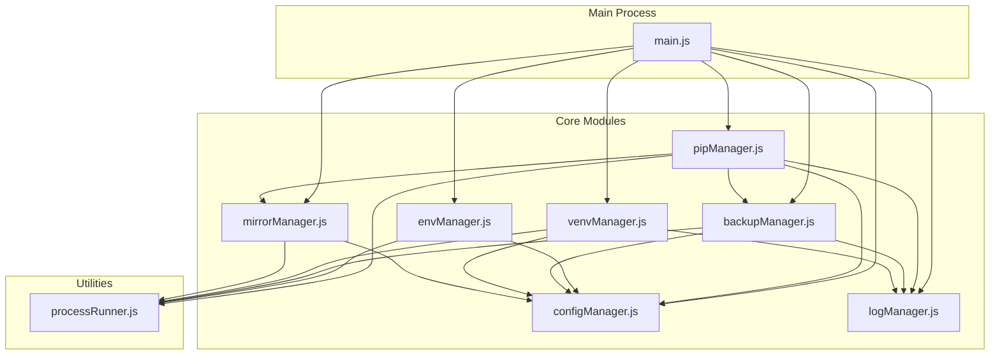
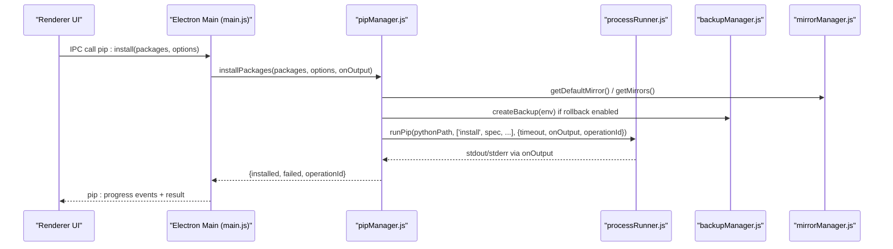
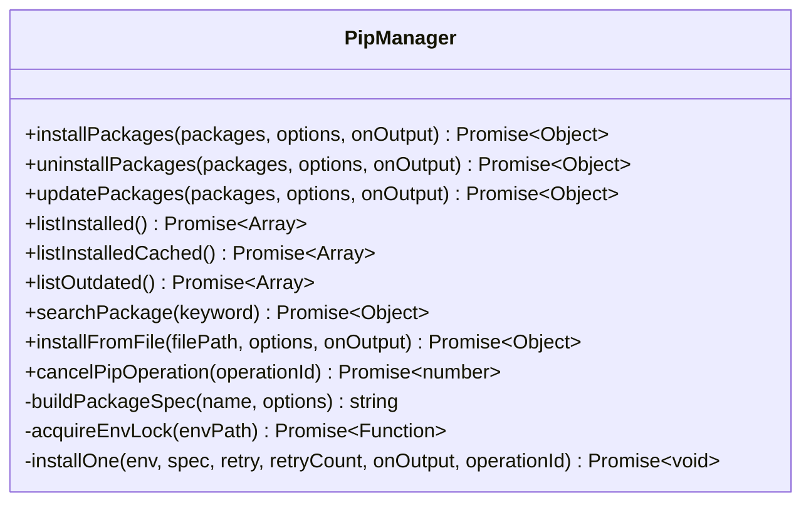
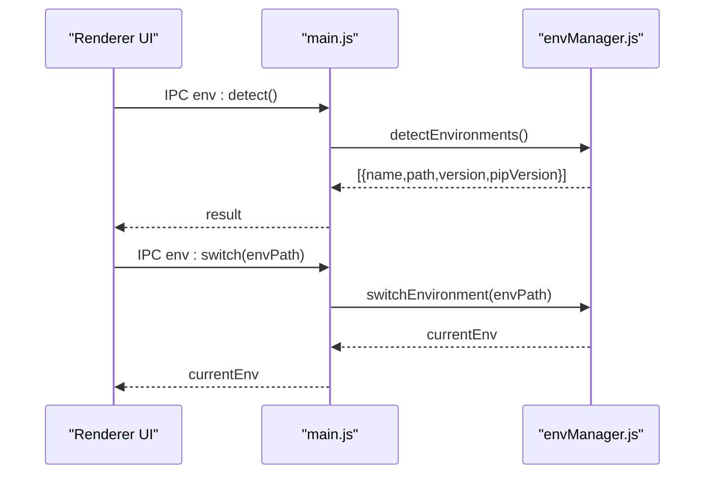
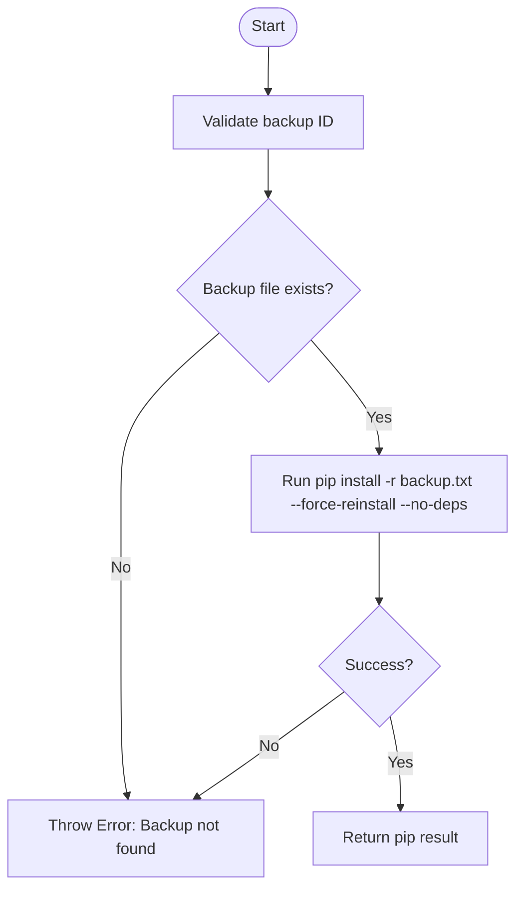
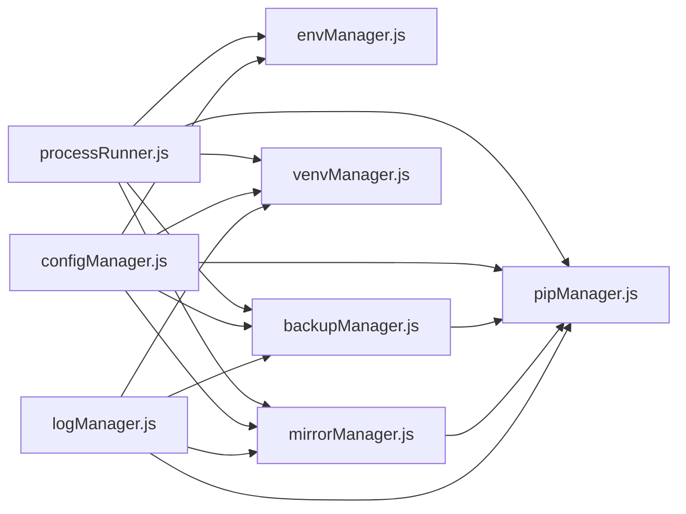

# Core Module APIs

<cite>
**Referenced Files in This Document**
- [pipManager.js](file://core/operations/pipManager.js)
- [envManager.js](file://core/system/envManager.js)
- [configManager.js](file://core/config/configManager.js)
- [backupManager.js](file://core/operations/backupManager.js)
- [venvManager.js](file://core/operations/venvManager.js)
- [mirrorManager.js](file://core/config/mirrorManager.js)
- [processRunner.js](file://utils/processRunner.js)
- [logManager.js](file://core/system/logManager.js)
- [main.js](file://main.js)
</cite>

## Table of Contents
1. [Introduction](#introduction)
2. [Project Structure](#project-structure)
3. [Core Components](#core-components)
4. [Architecture Overview](#architecture-overview)
5. [Detailed Component Analysis](#detailed-component-analysis)
6. [Dependency Analysis](#dependency-analysis)
7. [Performance Considerations](#performance-considerations)
8. [Troubleshooting Guide](#troubleshooting-guide)
9. [Conclusion](#conclusion)
10. [Appendices](#appendices)

## Introduction
This document provides comprehensive API documentation for PyLibMaster’s core modules, focusing on:
- Pip manager API for package installation, uninstallation, updates, and dependency management
- Environment manager API for Python environment detection, switching, and virtual environment creation
- Configuration manager API for application settings persistence and validation
- Backup manager API for automated backup creation, restoration, and cleanup
It also covers parameter specifications, return value schemas, error handling patterns, and async operation handling with practical examples and performance optimization techniques.

## Project Structure
PyLibMaster is an Electron-based desktop application. The main process exposes IPC handlers that delegate to core modules under core/operations, core/system, and core/config. Utilities live under utils/. The key files relevant to this documentation are:
- core/operations/pipManager.js: pip package operations
- core/system/envManager.js: Python environment detection and switching
- core/config/configManager.js: configuration persistence and validation
- core/operations/backupManager.js: backup and restore
- core/operations/venvManager.js: virtual environment management
- core/config/mirrorManager.js: PyPI mirror management
- utils/processRunner.js: subprocess execution, pip auto-install, cancellation
- core/system/logManager.js: logging
- main.js: IPC wiring between renderer and core modules

**Diagram sources**
- [main.js](file://main.js)
- [pipManager.js](file://core/operations/pipManager.js)
- [envManager.js](file://core/system/envManager.js)
- [configManager.js](file://core/config/configManager.js)
- [backupManager.js](file://core/operations/backupManager.js)
- [venvManager.js](file://core/operations/venvManager.js)
- [mirrorManager.js](file://core/config/mirrorManager.js)
- [processRunner.js](file://utils/processRunner.js)
- [logManager.js](file://core/system/logManager.js)

**Section sources**
- [main.js](file://main.js)
- [package.json](file://package.json)

## Core Components
- Pip Manager (pipManager.js): Provides install/uninstall/update/search/list/outdated/export/import/compare/diff/download/releases/depGraph/healthCheck/repair/cancel APIs. Includes parallelism, retry across mirrors, rollback via backups, progress events, and environment locks.
- Environment Manager (envManager.js): Detects Python environments, retrieves versions, switches current environment, and persists selection.
- Configuration Manager (configManager.js): Loads/saves JSON config, sanitizes numeric ranges, returns deep copies, manages storage path.
- Backup Manager (backupManager.js): Creates freeze-based backups, lists/deletes backups, restores environments using force-reinstall.
- Virtual Environment Manager (venvManager.js): Create/list/delete venvs, get detailed info, ensure directories exist, validate names and paths.
- Mirror Manager (mirrorManager.js): Manages built-in/custom mirrors, speed testing, smart routing, writes pip config, builds CLI args.
- Process Runner (processRunner.js): Spawns processes, handles timeouts, ANSI stripping, active process tracking, cancel by operationId, ensures pip availability.
- Log Manager (logManager.js): Buffered log writing, filtering, truncation, flush on shutdown.

**Section sources**
- [pipManager.js](file://core/operations/pipManager.js)
- [envManager.js](file://core/system/envManager.js)
- [configManager.js](file://core/config/configManager.js)
- [backupManager.js](file://core/operations/backupManager.js)
- [venvManager.js](file://core/operations/venvManager.js)
- [mirrorManager.js](file://core/config/mirrorManager.js)
- [processRunner.js](file://utils/processRunner.js)
- [logManager.js](file://core/system/logManager.js)

## Architecture Overview
The main process wires IPC handlers to core module functions. Rendered UI calls IPC methods which invoke the corresponding module functions. Progress events flow back via event channels.

**Diagram sources**
- [main.js](file://main.js)
- [pipManager.js](file://core/operations/pipManager.js)
- [processRunner.js](file://utils/processRunner.js)
- [backupManager.js](file://core/operations/backupManager.js)
- [mirrorManager.js](file://core/config/mirrorManager.js)

## Detailed Component Analysis

### Pip Manager API
Responsibilities:
- Query installed packages, outdated, search, export/import requirements, compare environments, diff requirements, download packages, list releases, dependency graph, health check, repair pip, cancel operations
- Install/uninstall/update with batch, parallel, retry across mirrors, automatic rollback via backups, progress callbacks, environment-level locks

Key parameters and behaviors:
- installPackages(packages, options, onOutput)
  - packages: string[]
  - options: { versionMode?: 'latest'|'specific'|'range'; version?: string; parallel?: boolean; retry?: boolean; rollback?: boolean; operationId?: string }
  - onOutput(text, type): callback for progress and logs
  - Returns: Promise<{ installed: string[], failed: Array<{spec, error}>, operationId: string }>
  - Behavior: Acquires env lock, ensures pip, creates backup if rollback enabled, builds specs, runs installOne with mirror retries, emits progress, logs results

- uninstallPackages(packages, options, onOutput)
  - packages: string[]
  - options: { force?: boolean; backup?: boolean; rollback?: boolean; operationId?: string }
  - Returns: Promise<{ uninstalled: string[], operationId: string }>
  - Behavior: Validates names, optional backup, runs pip uninstall -y, supports rollback

- updatePackages(packages, options, onOutput)
  - Similar to install but uses pip upgrade semantics; supports parallel and retry

- listInstalled(), listInstalledCached(), listOutdated()
  - Returns arrays of package objects with name, version, size, installed date, source

- searchPackage(keyword)
  - Uses pip index versions; returns { keyword, result, error? }

- installFromFile(filePath, options, onOutput)
  - Supports .whl and .txt (requirements); validates wheel path security; supports rollback

- cancelPipOperation(operationId)
  - Cancels all child processes associated with operationId

Return schema highlights:
- Progress events via onOutput include structured messages like "[PROGRESS] { done: 1, pkg, status }"
- Errors thrown include validation errors, environment not selected, file not found, unsupported file types, and pip failures

Error codes and exceptions:
- Validation errors for package names/specs/wheel paths
- "No Python environment selected"
- "File not found"
- "Unsupported file type"
- Network or pip command failures propagated from processRunner

Async operation handling:
- All operations are async and return Promises
- Progress is streamed via onOutput
- Cancellation supported through operationId

Practical usage patterns:
- Batch install with parallel=true and retry=true for resilience
- Use rollback=true to automatically restore from backup on failure
- Provide custom operationId to group related operations and cancel them together

Performance optimizations:
- Parallel installs limited by config.parallelThreads
- Retry across multiple mirrors reduces network failures
- site-packages cache for fast size/install time estimation
- Environment locks prevent concurrent conflicts

**Section sources**
- [pipManager.js](file://core/operations/pipManager.js)
- [processRunner.js](file://utils/processRunner.js)
- [backupManager.js](file://core/operations/backupManager.js)
- [mirrorManager.js](file://core/config/mirrorManager.js)

#### Pip Manager Class Diagram

**Diagram sources**
- [pipManager.js](file://core/operations/pipManager.js)

### Environment Manager API
Responsibilities:
- Detect available Python environments (system, user, conda/miniconda, Windows Store)
- Get Python and pip versions
- Switch current environment and persist selection
- Start background detection

API:
- detectEnvironments(): Promise<Array<{ name, path, version, pipVersion }>>
- getCurrent(): Object|null
- switchEnvironment(envPath): Object
- startDetection(): void

Behavior:
- Scans common paths and PATH via where python
- Filters out environments without pip
- Restores saved currentEnv if still valid
- Auto-selects first environment if none set

Error handling:
- Throws when switching to non-existent path
- Gracefully ignores glob errors and missing pip

Practical usage:
- Call detectEnvironments() at startup
- Use getCurrent() to determine active environment
- switchEnvironment(path) to change and persist

**Section sources**
- [envManager.js](file://core/system/envManager.js)

#### Environment Manager Sequence

**Diagram sources**
- [main.js](file://main.js)
- [envManager.js](file://core/system/envManager.js)

### Configuration Manager API
Responsibilities:
- Load/save JSON config with defaults
- Sanitize numeric values within defined ranges
- Provide deep copy of config
- Manage storage path and ensure directory exists

API:
- getConfig(): Object (deep copy)
- setConfig(key, value): Object
- setBulk(updates): Object
- getStoragePath(): string
- init(): void

Behavior:
- Initializes config directory and default storage path
- Atomic save via tmp file rename
- Sanitizes parallelThreads and retryCount with min/max/fallback

Practical usage:
- Use setBulk for multiple updates to reduce disk writes
- Always read via getConfig() to avoid mutating internal state

**Section sources**
- [configManager.js](file://core/config/configManager.js)

### Backup Manager API
Responsibilities:
- Create backup using pip freeze
- List backups sorted by creation time
- Restore environment using force-reinstall and no-deps
- Delete backups with safe ID validation

API:
- createBackup(env): Promise<Object>
- listBackups(): Array<Object>
- restoreBackup(backupId, env, onOutput?): Promise<Object>
- deleteBackup(backupId): boolean
- validateBackupId(backupId): string

Behavior:
- Backup filename format: backup_{envName}_{timestamp}.txt
- Validates backup IDs to prevent path traversal
- Writes pip config for global mirror settings when needed

Error handling:
- Throws on invalid backup ID or missing backup file
- Logs failures and returns empty lists on errors

Practical usage:
- Create backup before risky operations
- Restore using backup ID returned by createBackup

**Section sources**
- [backupManager.js](file://core/operations/backupManager.js)

#### Backup Manager Flowchart

**Diagram sources**
- [backupManager.js](file://core/operations/backupManager.js)

### Virtual Environment Manager API
Responsibilities:
- Create venv with options (withPip, systemSitePackages)
- List existing venvs with details (Python/pip version, package count)
- Delete venv safely with path validation
- Get venv info including base Python path

API:
- createVenv(options, onOutput?): Promise<Object>
- listVenvs(): Promise<Array<Object>>
- deleteVenv(name, onOutput?): Promise<Object>
- getVenvInfo(name): Promise<Object>
- getVenvsDir(): string
- getVenvPythonPath(venvPath): string

Behavior:
- Ensures venvs directory exists
- Validates venv name and path safety
- Cleans up partial directories on creation failure

Error handling:
- Throws on invalid names, missing base Python, or path traversal attempts

Practical usage:
- Create isolated environments per project
- Use listVenvs() to discover and manage environments

**Section sources**
- [venvManager.js](file://core/operations/venvManager.js)

### Mirror Manager API
Responsibilities:
- Manage built-in and custom mirrors
- Test mirror speeds and pick best mirror
- Write pip config for global mirror settings
- Build CLI arguments for pip commands

API:
- getMirrors(): Array<Object>
- getDefaultMirror(): Object
- setDefaultMirror(url): Array<Object>
- addCustomMirror(name, url, remark?): Object|null
- updateMirror(url, updates): Array<Object>|null
- removeCustomMirror(url): boolean
- restoreDefaultMirrors(): Array<Object>
- testMirrorSpeed(url): Promise<number>
- testAllMirrors(): Promise<Array<Object>>
- setSmartRoute(enabled): boolean
- getSmartRoute(): boolean
- getEffectiveMirror(): Promise<Object>
- writePipConfig(env?): Promise<boolean>
- buildMirrorArgs(env?): string[]
- reorderMirrors(urlOrder): Array<Object>

Behavior:
- Ensures exactly one default mirror
- Validates URLs and prevents duplicates
- Smart route selects fastest mirror based on HEAD requests

Practical usage:
- Enable smartRoute for automatic fastest mirror selection
- Use buildMirrorArgs to pass --index-url when needed

**Section sources**
- [mirrorManager.js](file://core/config/mirrorManager.js)

### Process Runner API
Responsibilities:
- Spawn child processes with timeout, cancellation, and output streaming
- Ensure pip availability via ensurepip or get-pip.py
- Track active processes and support cancellation by operationId

API:
- runCommand(command, args, options?): Promise<{stdout, stderr, code}>
- runPip(pythonPath, args, options?): Promise<{stdout, stderr, code}>
- runPython(pythonPath, args, options?): Promise<{stdout, stderr, code}>
- ensurePip(pythonPath, onOutput?): Promise<boolean>
- checkPipAvailable(pythonPath): Promise<boolean>
- clearPipReadyCache(): void
- cancelProcess(processId): boolean
- cancelOperation(operationId): number
- cancelAllProcesses(): number

Behavior:
- Strips ANSI sequences from output
- UTF-8 encoding enforced
- Graceful SIGTERM then SIGKILL on timeout

Practical usage:
- Pass onOutput to stream progress
- Use operationId to cancel groups of processes

**Section sources**
- [processRunner.js](file://utils/processRunner.js)

### Log Manager API
Responsibilities:
- Append logs with timestamps and truncation
- Filter logs by type and search keywords
- Flush logs on shutdown to prevent data loss

API:
- addLog(entry): Object
- getLogs(filter?): Array<Object>
- clearLogs(): boolean
- flushLogs(): void

Behavior:
- Debounced saves to avoid excessive I/O
- Limits max entries and field lengths

Practical usage:
- Use addLog for audit trails
- Export logs via main.js IPC handlers

**Section sources**
- [logManager.js](file://core/system/logManager.js)

## Dependency Analysis
Core modules depend on utilities and each other as follows:
- pipManager depends on processRunner, backupManager, mirrorManager, configManager, logManager, envManager
- envManager depends on processRunner, configManager
- backupManager depends on processRunner, configManager, logManager
- venvManager depends on processRunner, configManager, logManager
- mirrorManager depends on configManager, processRunner
- processRunner is foundational and used by most modules
- logManager is used by all operational modules for auditing

**Diagram sources**
- [pipManager.js](file://core/operations/pipManager.js)
- [envManager.js](file://core/system/envManager.js)
- [backupManager.js](file://core/operations/backupManager.js)
- [venvManager.js](file://core/operations/venvManager.js)
- [mirrorManager.js](file://core/config/mirrorManager.js)
- [processRunner.js](file://utils/processRunner.js)
- [configManager.js](file://core/config/configManager.js)
- [logManager.js](file://core/system/logManager.js)

**Section sources**
- [main.js](file://main.js)

## Performance Considerations
- Parallelism: Configure parallelThreads to balance throughput and resource usage
- Retry strategy: Enable retry across mirrors to mitigate transient network issues
- Caching: Use cached lists and site-packages cache to reduce I/O
- Backups: Create backups only when necessary to avoid overhead
- Logging: Use debounced logging and limit field sizes to prevent large files
- Process management: Cancel long-running operations promptly using operationId

[No sources needed since this section provides general guidance]

## Troubleshooting Guide
Common issues and resolutions:
- No Python environment selected: Ensure detectEnvironments() has run and a valid environment is chosen
- pip not available: ensurePip will attempt installation; verify network access and permissions
- Invalid package name/spec: Validate against allowed regex patterns
- Wheel path traversal blocked: Use absolute local paths and avoid restricted directories
- Backup not found: Verify backup ID format and existence in backups directory
- Venv creation fails: Check base Python path and permissions; clean up partial directories

Error propagation:
- Exceptions thrown by modules are caught and logged; IPC handlers return appropriate responses
- Progress events provide real-time feedback for debugging

**Section sources**
- [pipManager.js](file://core/operations/pipManager.js)
- [backupManager.js](file://core/operations/backupManager.js)
- [venvManager.js](file://core/operations/venvManager.js)
- [processRunner.js](file://utils/processRunner.js)
- [logManager.js](file://core/system/logManager.js)

## Conclusion
PyLibMaster’s core modules provide robust APIs for managing Python environments, packages, configurations, and backups. The architecture emphasizes safety, performance, and reliability through input validation, concurrency control, retry strategies, and comprehensive logging. Developers can leverage these APIs to build powerful automation workflows while maintaining stability and security.

[No sources needed since this section summarizes without analyzing specific files]

## Appendices

### Practical Code Examples
Note: These are conceptual examples illustrating typical usage patterns. Refer to the module files for exact function signatures and behavior.

- Install packages with parallelism and rollback:
  - Call installPackages(['flask', 'requests'], { parallel: true, retry: true, rollback: true }, onOutput)
  - Monitor progress via onOutput and handle failures gracefully

- Switch environment and list installed packages:
  - Call switchEnvironment('/path/to/python') then listInstalled()

- Create and restore backup:
  - Create backup with createBackup(currentEnv), capture id
  - Restore with restoreBackup(id, currentEnv, onOutput)

- Create virtual environment from template:
  - Use venvManager.createVenv({ name: 'myenv', pythonPath: '/usr/bin/python3', withPip: true })
  - Then install packages via pipManager.installPackages([...])

- Configure mirrors and enable smart routing:
  - setSmartRoute(true) and use getEffectiveMirror() before pip operations

[No sources needed since this section provides general guidance]