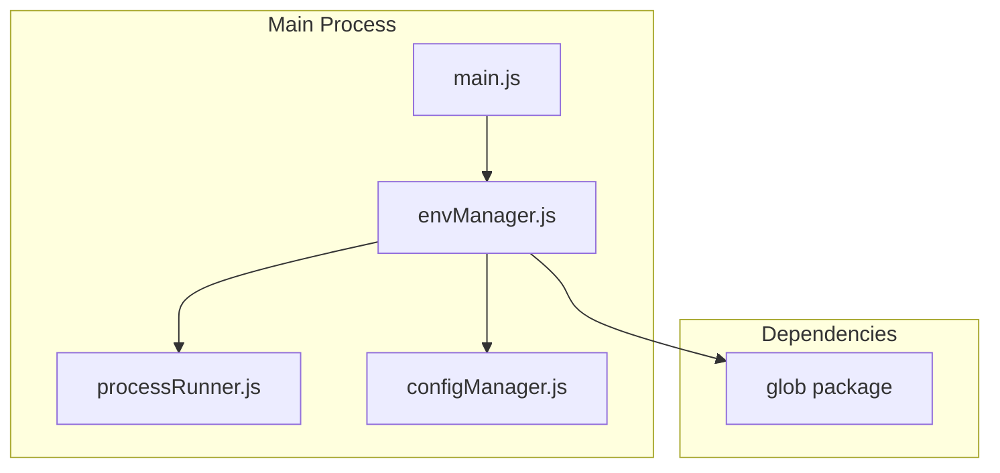
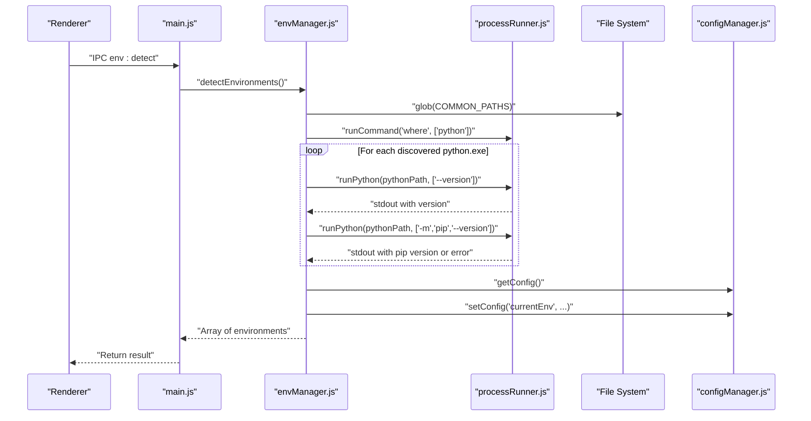
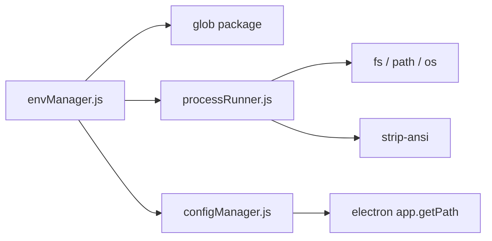

# Environment Detection API

<cite>
**Referenced Files in This Document**
- [envManager.js](file://core/system/envManager.js)
- [processRunner.js](file://utils/processRunner.js)
- [configManager.js](file://core/config/configManager.js)
- [main.js](file://main.js)
- [package.json](file://package.json)
</cite>

## Table of Contents
1. [Introduction](#introduction)
2. [Project Structure](#project-structure)
3. [Core Components](#core-components)
4. [Architecture Overview](#architecture-overview)
5. [Detailed Component Analysis](#detailed-component-analysis)
6. [Dependency Analysis](#dependency-analysis)
7. [Performance Considerations](#performance-considerations)
8. [Troubleshooting Guide](#troubleshooting-guide)
9. [Conclusion](#conclusion)
10. [Appendices](#appendices)

## Introduction
This document provides detailed API documentation for the Python environment detection functionality, centered on the detectEnvironments() function. It explains how the system scans common installation paths, PATH variables, and conda environments; how it uses glob pattern matching; how it performs parallel version detection using Promise.all; and how it filters environments and restores the current environment from configuration. It also covers platform-specific path patterns for Windows (C:/Python*, AppData locations, ProgramData), handling missing pip installations, environment name generation algorithms, error handling for inaccessible paths, and the cachedEnvironments array structure and environment object schema.

## Project Structure
The environment detection feature is implemented primarily in a single module that orchestrates file scanning, process execution, and configuration persistence. The IPC layer exposes the detection capability to the renderer process.

**Diagram sources**
- [main.js:257-261](file://main.js#L257-L261)
- [envManager.js:1-220](file://core/system/envManager.js#L1-L220)
- [processRunner.js:1-366](file://utils/processRunner.js#L1-L366)
- [configManager.js:1-194](file://core/config/configManager.js#L1-L194)

**Section sources**
- [envManager.js:1-220](file://core/system/envManager.js#L1-L220)
- [main.js:257-261](file://main.js#L257-L261)

## Core Components
- detectEnvironments(): Scans common paths via glob, queries PATH with where python, collects Python executables, retrieves versions in parallel, filters out environments without pip, restores previously selected environment if present, caches results, and auto-selects the first environment when none is set.
- getPythonVersion(pythonPath): Executes python --version and extracts the version string.
- getPipVersion(pythonPath): Executes python -m pip --version and extracts the pip version or returns null if unavailable.
- getCurrent(): Returns the currently selected environment from memory or configuration.
- switchEnvironment(envPath): Switches to a specified Python executable path, creating a temporary environment object if needed, and persists the selection.
- startDetection(): Starts background detection without blocking UI initialization.

Key data structures:
- cachedEnvironments: Array of environment objects detected during the last scan.
- Environment object schema: { name, path, version, pipVersion }

Behavior highlights:
- Platform-specific Windows paths are scanned using glob patterns.
- PATH-based discovery uses the where command.
- Parallel version detection uses Promise.all for performance.
- Environments without pip are filtered out.
- Automatic restoration of the current environment from configuration is supported.

**Section sources**
- [envManager.js:85-170](file://core/system/envManager.js#L85-L170)
- [envManager.js:48-71](file://core/system/envManager.js#L48-L71)
- [envManager.js:178-184](file://core/system/envManager.js#L178-L184)
- [envManager.js:196-209](file://core/system/envManager.js#L196-L209)
- [envManager.js:215-217](file://core/system/envManager.js#L215-L217)

## Architecture Overview
The detection flow integrates three layers:
- Discovery layer: Glob-based path scanning and PATH resolution.
- Execution layer: Subprocess execution for version checks and pip availability.
- Configuration layer: Reading/writing the current environment selection.

**Diagram sources**
- [main.js:257-261](file://main.js#L257-L261)
- [envManager.js:85-170](file://core/system/envManager.js#L85-L170)
- [processRunner.js:85-161](file://utils/processRunner.js#L85-L161)
- [configManager.js:144-162](file://core/config/configManager.js#L144-L162)

## Detailed Component Analysis

### detectEnvironments() API
Purpose:
- Discover all usable Python environments on the system.
- Collect version and pip information.
- Filter out unusable environments (missing pip).
- Restore previous current environment if applicable.
- Cache results and auto-select default when none is configured.

Algorithm overview:
1. Initialize a Map to deduplicate by lowercase real path.
2. Scan COMMON_PATHS using glob; resolve real paths and add to Map.
3. Run 'where python' to discover PATH entries; parse output and add unique .exe paths.
4. Use Promise.all to concurrently run python --version and python -m pip --version for each candidate.
5. Build environment objects with name/path/version/pipVersion; filter out those without pip.
6. Check config.currentEnv; if not found in list but exists on disk and has pip, prepend it with fresh version info.
7. Assign cachedEnvironments; if no currentEnv is set and list is non-empty, select the first and persist it.

Error handling:
- Glob errors are caught and ignored.
- where command failures are ignored.
- Version retrieval failures return 'unknown' for Python version and null for pip version.
- Inaccessible paths are skipped due to existence checks and realpath usage.

Multi-environment scenarios:
- Multiple Python installations across user and system directories are aggregated.
- Conda environments under .conda/envs are included.
- Windows Store Python entry is considered.
- Duplicate executables are deduplicated by normalized path.

Name generation algorithm:
- Default name is derived from the directory containing the executable.
- If the parent directory is 'scripts' or 'bin', use the grandparent directory.
- If the directory name starts with 'python' and length <= 10, replace with "Python <version>".

Missing pip handling:
- Environments without pip are excluded from the final list.
- When restoring a previously selected environment, pip availability is rechecked before inclusion.

Automatic current environment restoration:
- If config.currentEnv.path still exists and has pip, it is inserted at the front of the list.
- If no currentEnv is set after detection, the first environment becomes current and is persisted.

Return value:
- Promise resolving to an array of environment objects.

Schema of returned environment objects:
- name: string (friendly display name)
- path: string (absolute path to python executable)
- version: string (Python version or 'unknown')
- pipVersion: string|null (pip version or null if unavailable)

Example scenarios:
- Single Python installation with pip: returns one environment with valid version and pipVersion.
- Multiple installations including conda: returns multiple entries; names may be derived from folder names or versioned labels.
- Installation without pip: excluded from results; detection continues for other candidates.
- Previously selected environment moved or renamed: restored if path exists and has pip; otherwise ignored.

**Section sources**
- [envManager.js:85-170](file://core/system/envManager.js#L85-L170)
- [envManager.js:48-71](file://core/system/envManager.js#L48-L71)
- [envManager.js:151-169](file://core/system/envManager.js#L151-L169)

### getPythonVersion(pythonPath)
Purpose:
- Execute python --version and extract the semantic version.

Behavior:
- Uses runPython to execute the command with timeout.
- Parses stdout to find a version match; returns 'unknown' on failure.

Error handling:
- Exceptions are caught and result in 'unknown'.

**Section sources**
- [envManager.js:48-56](file://core/system/envManager.js#L48-L56)
- [processRunner.js:351-353](file://utils/processRunner.js#L351-L353)

### getPipVersion(pythonPath)
Purpose:
- Execute python -m pip --version and extract pip version.

Behavior:
- Uses runPython to run pip version check with timeout.
- Parses stdout to find pip version; returns null if pip is not available.

Error handling:
- Exceptions are caught and result in null.

**Section sources**
- [envManager.js:63-71](file://core/system/envManager.js#L63-L71)
- [processRunner.js:351-353](file://utils/processRunner.js#L351-L353)

### getCurrent()
Purpose:
- Return the currently selected environment from memory or configuration.

Behavior:
- If in-memory currentEnv is null, load from config.currentEnv.
- Returns the environment object or null.

**Section sources**
- [envManager.js:178-184](file://core/system/envManager.js#L178-L184)
- [configManager.js:144-147](file://core/config/configManager.js#L144-L147)

### switchEnvironment(envPath)
Purpose:
- Switch the active Python environment to the given executable path.

Behavior:
- Searches cachedEnvironments for a matching path; if found, sets currentEnv.
- If not found but path exists, creates a temporary environment object with unknown version and pipVersion.
- Persists the new currentEnv to configuration.
- Throws an error if the path does not exist.

Error handling:
- Throws Error with message indicating environment not found when path is missing.

**Section sources**
- [envManager.js:196-209](file://core/system/envManager.js#L196-L209)
- [configManager.js:157-162](file://core/config/configManager.js#L157-L162)

### startDetection()
Purpose:
- Start background environment detection without blocking UI initialization.

Behavior:
- Invokes detectEnvironments() and ignores errors.

**Section sources**
- [envManager.js:215-217](file://core/system/envManager.js#L215-L217)

### IPC Integration
Purpose:
- Expose environment detection and switching to the renderer process.

Endpoints:
- env:detect -> calls detectEnvironments()
- env:getCurrent -> calls getCurrent()
- env:switch -> calls switchEnvironment(envPath)

**Section sources**
- [main.js:257-261](file://main.js#L257-L261)

## Dependency Analysis
The environment detection module depends on:
- File system operations via Node fs and path modules.
- OS module for temporary directory and environment variables.
- glob package for pattern matching across Windows paths.
- processRunner utilities for subprocess execution, timeouts, and ANSI stripping.
- configManager for reading and writing persistent configuration.

**Diagram sources**
- [envManager.js:18-23](file://core/system/envManager.js#L18-L23)
- [processRunner.js:13-18](file://utils/processRunner.js#L13-L18)
- [configManager.js:17-19](file://core/config/configManager.js#L17-L19)
- [package.json:20-24](file://package.json#L20-L24)

**Section sources**
- [envManager.js:18-23](file://core/system/envManager.js#L18-L23)
- [processRunner.js:13-18](file://utils/processRunner.js#L13-L18)
- [configManager.js:17-19](file://core/config/configManager.js#L17-L19)
- [package.json:20-24](file://package.json#L20-L24)

## Performance Considerations
- Parallel version detection: Promise.all ensures concurrent execution of python --version and pip --version for all candidates, reducing total detection time significantly in multi-environment setups.
- Deduplication: Using a Map keyed by lowercase real path avoids redundant processing and duplicate entries.
- Timeout control: Subprocess commands have timeouts to prevent hanging detections.
- Minimal I/O: Realpath resolution and existence checks reduce unnecessary filesystem operations.
- Background detection: startDetection allows non-blocking startup while detection proceeds asynchronously.

[No sources needed since this section provides general guidance]

## Troubleshooting Guide
Common issues and resolutions:
- Missing pip in an environment:
  - Symptom: Environment excluded from detection results.
  - Resolution: Install pip for the target Python using ensurepip or get-pip.py via processRunner.ensurePip.
- Inaccessible paths:
  - Symptom: Some paths are ignored during scanning.
  - Resolution: Verify permissions and path validity; ensure the executable exists and is reachable.
- where command fails:
  - Symptom: PATH-based discovery yields no results.
  - Resolution: Ensure PATH includes Python directories; verify shell execution context.
- Slow detection:
  - Symptom: Long delays when many Python installations exist.
  - Resolution: Reduce number of candidates by narrowing COMMON_PATHS or ensuring fewer installations.
- Current environment not restored:
  - Symptom: Previous selection not applied after restart.
  - Resolution: Confirm config.currentEnv.path exists and has pip; re-run detection to refresh cache.

**Section sources**
- [envManager.js:85-170](file://core/system/envManager.js#L85-L170)
- [processRunner.js:233-278](file://utils/processRunner.js#L233-L278)

## Conclusion
The detectEnvironments() function provides a robust, cross-platform mechanism for discovering Python environments on Windows systems. It leverages glob-based path scanning, PATH resolution, and parallel subprocess execution to efficiently build a comprehensive list of usable environments. Filtering logic ensures only environments with pip are included, and automatic restoration maintains user preferences across sessions. The design balances performance, reliability, and usability, making it suitable for applications managing multiple Python installations and virtual environments.

[No sources needed since this section summarizes without analyzing specific files]

## Appendices

### Platform-Specific Path Patterns (Windows)
Common paths include:
- C:/Python*/python.exe
- C:/Users/*/AppData/Local/Programs/Python/Python*/python.exe
- C:/Users/*/AppData/Local/Microsoft/WindowsApps/python.exe
- C:/Users/*/.conda/envs/*/python.exe
- C:/ProgramData/Anaconda3/python.exe
- C:/Users/*/Anaconda3/python.exe
- C:/Users/*/miniconda3/python.exe
- C:/Users/*/Miniconda3/python.exe
- C:/ProgramData/miniconda3/python.exe

These patterns cover system-level and user-level installations, Windows Store Python, and conda distributions.

**Section sources**
- [envManager.js:31-41](file://core/system/envManager.js#L31-L41)

### Environment Object Schema
Fields:
- name: string — Friendly display name derived from directory or version.
- path: string — Absolute path to the Python executable.
- version: string — Python version or 'unknown' if parsing failed.
- pipVersion: string|null — Pip version or null if not available.

**Section sources**
- [envManager.js:142-148](file://core/system/envManager.js#L142-L148)

### Multi-Environment Detection Examples
- Scenario 1: Two user-level Pythons plus one conda env → Three entries; names may be "Python x.y.z" or derived from folder names.
- Scenario 2: System-wide Anaconda plus user Miniconda → Multiple entries; duplicates resolved by normalized path.
- Scenario 3: One installation without pip → Excluded; others included.
- Scenario 4: Previously selected environment moved → Restored if path exists and has pip; otherwise ignored.

**Section sources**
- [envManager.js:85-170](file://core/system/envManager.js#L85-L170)

### Error Handling for Inaccessible Paths
- Glob errors are caught and ignored.
- where command failures are ignored.
- Version retrieval exceptions return fallback values ('unknown' or null).
- Existence checks prevent invalid paths from entering the result set.

**Section sources**
- [envManager.js:98-117](file://core/system/envManager.js#L98-L117)
- [envManager.js:48-71](file://core/system/envManager.js#L48-L71)