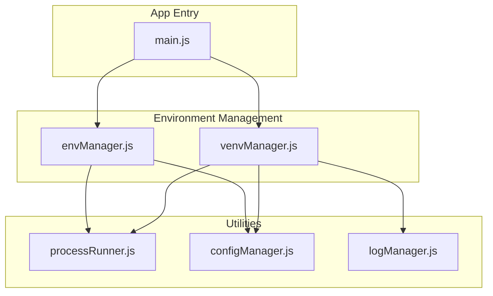
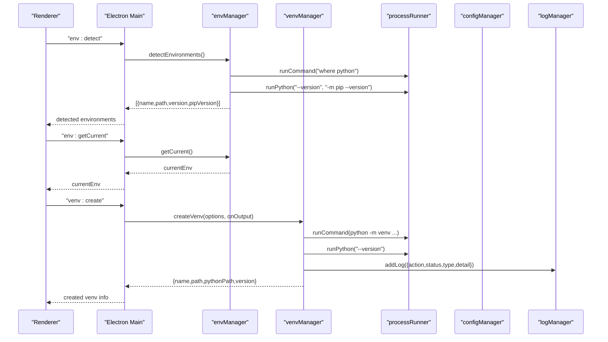
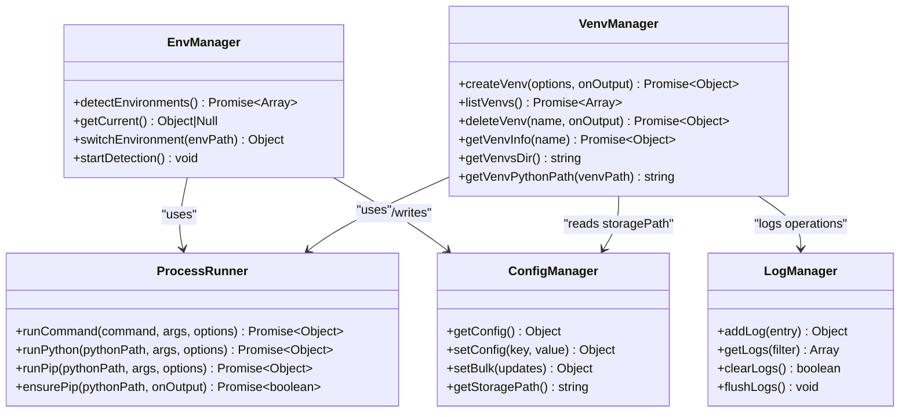

# Environment Manager API

<cite>
**Referenced Files in This Document**
- [envManager.js](file://core/system/envManager.js)
- [venvManager.js](file://core/operations/venvManager.js)
- [processRunner.js](file://utils/processRunner.js)
- [configManager.js](file://core/config/configManager.js)
- [logManager.js](file://core/system/logManager.js)
- [main.js](file://main.js)
</cite>

## Table of Contents
1. [Introduction](#introduction)
2. [Project Structure](#project-structure)
3. [Core Components](#core-components)
4. [Architecture Overview](#architecture-overview)
5. [Detailed Component Analysis](#detailed-component-analysis)
6. [Dependency Analysis](#dependency-analysis)
7. [Performance Considerations](#performance-considerations)
8. [Troubleshooting Guide](#troubleshooting-guide)
9. [Conclusion](#conclusion)
10. [Appendices](#appendices)

## Introduction
This document provides comprehensive API documentation for the Environment Manager module, which handles Python environment detection, switching, and virtual environment management. It covers:
- Detecting available Python environments (system Python, user installs, Windows Store Python, Conda/Anaconda/Miniconda).
- Getting and switching the current environment with persistence.
- Creating, listing, deleting, and inspecting virtual environments.
- Platform-specific considerations (Windows vs Unix paths).
- Integration points via IPC handlers exposed to the renderer process.
- Practical usage patterns including multi-environment setup, conda integration, environment validation, and error handling for missing Python installations.

## Project Structure
The Environment Manager is implemented across a few core modules:
- Environment detection and switching: core/system/envManager.js
- Virtual environment management: core/operations/venvManager.js
- Process execution utilities: utils/processRunner.js
- Configuration persistence: core/config/configManager.js
- Logging: core/system/logManager.js
- IPC exposure: main.js

**Diagram sources**
- [envManager.js:1-220](file://core/system/envManager.js#L1-L220)
- [venvManager.js:1-278](file://core/operations/venvManager.js#L1-L278)
- [processRunner.js:1-366](file://utils/processRunner.js#L1-L366)
- [configManager.js:1-194](file://core/config/configManager.js#L1-L194)
- [logManager.js:1-176](file://core/system/logManager.js#L1-L176)
- [main.js:250-281](file://main.js#L250-L281)

**Section sources**
- [envManager.js:1-220](file://core/system/envManager.js#L1-L220)
- [venvManager.js:1-278](file://core/operations/venvManager.js#L1-L278)
- [processRunner.js:1-366](file://utils/processRunner.js#L1-L366)
- [configManager.js:1-194](file://core/config/configManager.js#L1-L194)
- [logManager.js:1-176](file://core/system/logManager.js#L1-L176)
- [main.js:250-281](file://main.js#L250-L281)

## Core Components
- Environment Manager (envManager):
  - detectEnvironments(): Scans common paths and PATH to find Python interpreters, collects version and pip info, filters invalid entries, restores persisted currentEnv, caches results, and auto-selects first valid environment if none set.
  - getCurrent(): Returns the currently selected environment from memory or configuration.
  - switchEnvironment(envPath): Switches to a specified Python executable path; validates existence; persists selection.
  - startDetection(): Non-blocking background detection on app startup.

- Virtual Environment Manager (venvManager):
  - createVenv(options, onOutput): Creates a venv under the configured storage directory with options for base Python, pip inclusion, and system site-packages inheritance. Validates name and base Python path. Cleans up on failure.
  - listVenvs(): Lists all valid venvs with Python/pip versions and package counts.
  - deleteVenv(name, onOutput): Deletes a venv with path traversal protection and logging.
  - getVenvInfo(name): Returns detailed venv metadata including base Python path from pyvenv.cfg.
  - getVenvsDir(), getVenvPythonPath(venvPath): Utility helpers for locating venv directories and interpreter paths across platforms.

- Process Runner (processRunner):
  - runCommand(command, args, options): Spawns child processes with timeout, cancellation, ANSI stripping, UTF-8 encoding, and real-time output callbacks.
  - runPython(pythonPath, args, options), runPip(pythonPath, args, options): Convenience wrappers around runCommand.
  - ensurePip(pythonPath, onOutput): Auto-installs pip using ensurepip or get-pip.py fallback, with caching and robust error handling.

- Config Manager (configManager):
  - getConfig(), setConfig(key, value), setBulk(updates), getStoragePath(): Persistent JSON config with safe atomic writes and default values. Stores currentEnv and storagePath used by env and venv managers.

- Log Manager (logManager):
  - addLog(entry), getLogs(filter), clearLogs(), flushLogs(): Centralized operation logging with debounced saves and truncation.

**Section sources**
- [envManager.js:85-170](file://core/system/envManager.js#L85-L170)
- [envManager.js:178-209](file://core/system/envManager.js#L178-L209)
- [venvManager.js:73-130](file://core/operations/venvManager.js#L73-L130)
- [venvManager.js:136-186](file://core/operations/venvManager.js#L136-L186)
- [venvManager.js:195-224](file://core/operations/venvManager.js#L195-L224)
- [venvManager.js:231-268](file://core/operations/venvManager.js#L231-L268)
- [processRunner.js:85-161](file://utils/processRunner.js#L85-L161)
- [processRunner.js:233-278](file://utils/processRunner.js#L233-L278)
- [configManager.js:80-117](file://core/config/configManager.js#L80-L117)
- [configManager.js:185-191](file://core/config/configManager.js#L185-L191)
- [logManager.js:115-134](file://core/system/logManager.js#L115-L134)

## Architecture Overview
The Environment Manager integrates with the Electron main process via IPC handlers, exposing environment and venv operations to the renderer. Detection runs asynchronously to avoid blocking UI. Virtual environments are stored under the configured storage path, ensuring isolation and easy cleanup.

**Diagram sources**
- [main.js:257-281](file://main.js#L257-L281)
- [envManager.js:85-170](file://core/system/envManager.js#L85-L170)
- [venvManager.js:73-130](file://core/operations/venvManager.js#L73-L130)
- [processRunner.js:85-161](file://utils/processRunner.js#L85-L161)
- [configManager.js:80-117](file://core/config/configManager.js#L80-L117)
- [logManager.js:115-134](file://core/system/logManager.js#L115-L134)

## Detailed Component Analysis

### Environment Manager API
- detectEnvironments():
  - Behavior: Scans COMMON_PATHS patterns (Windows-centric defaults), executes "where python" to discover PATH entries, resolves real paths, deduplicates, queries Python and pip versions, filters out environments without pip, constructs friendly names, restores persisted currentEnv if still present, caches results, and auto-selects first environment when none is set.
  - Returns: Promise<Array<{name, path, version, pipVersion}>>.
  - Notes: Uses glob for pattern matching; parallel version checks for performance.

- getCurrent():
  - Behavior: Returns currentEnv from memory or loads from config if not cached.
  - Returns: Object|null.

- switchEnvironment(envPath):
  - Behavior: Looks up env in cache; if not found but path exists, creates a minimal env object; throws if path does not exist; persists currentEnv to config.
  - Parameters: envPath (string) — absolute path to Python executable.
  - Returns: Object (currentEnv).
  - Throws: Error if environment not found.

- startDetection():
  - Behavior: Invokes detectEnvironments() asynchronously without blocking.

Platform considerations:
- Path patterns include Windows-specific locations (C:/...); PATH discovery via "where python" is shell-based and platform-aware.
- On non-Windows systems, additional patterns would be needed for typical locations like /usr/bin/python, /opt/python*/bin/python, etc. The current implementation focuses on Windows defaults.

Error handling:
- Invalid or missing Python executables are filtered during detection.
- Missing pip leads to exclusion from detected environments.
- switchEnvironment throws descriptive errors for nonexistent paths.

Usage examples:
- Multi-environment setup: Call detectEnvironments() at startup, then iterate returned list to populate UI. Use switchEnvironment(path) to select an environment; subsequent pip operations will use that interpreter.
- Conda integration: If Conda/Anaconda/Miniconda is installed, its python.exe paths are included in COMMON_PATHS and discovered automatically. Ensure pip is installed within each Conda env for visibility.

**Section sources**
- [envManager.js:31-41](file://core/system/envManager.js#L31-L41)
- [envManager.js:85-170](file://core/system/envManager.js#L85-L170)
- [envManager.js:178-209](file://core/system/envManager.js#L178-L209)
- [envManager.js:215-217](file://core/system/envManager.js#L215-L217)

### Virtual Environment Manager API
- createVenv(options, onOutput):
  - Parameters:
    - options.name (string): Must match regex ^[a-zA-Z0-9][a-zA-Z0-9._-]*$ and length ≤ 64.
    - options.pythonPath (string): Absolute path to base Python executable; must exist.
    - options.withPip (boolean, default true): Controls inclusion of pip (--without-pip is inverse).
    - options.systemSitePackages (boolean, default false): Inherits system site-packages.
    - onOutput(text, type) (function, optional): Real-time progress callback.
  - Behavior: Validates inputs, ensures storage directory, checks for existing venv, builds python -m venv command, executes with timeout, cleans up on failure, captures version, logs success/failure, returns venv info.
  - Returns: Promise<Object {name, path, pythonPath, version}>.
  - Throws: Error for invalid name, missing base Python, or creation failure.

- listVenvs():
  - Behavior: Reads venvs directory, validates each entry by checking python executable and pyvenv.cfg, gathers Python/pip versions and package count via pip list --format=json.
  - Returns: Promise<Array<{name, path, pythonPath, version, pipVersion, packageCount}>>.

- deleteVenv(name, onOutput):
  - Behavior: Validates name, resolves path, enforces path traversal protection, deletes recursively, logs operation, supports progress callback.
  - Returns: Promise<Object {success, name}>.
  - Throws: Error for invalid name, missing venv, or deletion failure.

- getVenvInfo(name):
  - Behavior: Validates name, locates python executable, reads pyvenv.cfg to extract base Python path, queries Python and pip versions.
  - Returns: Promise<Object {name, path, pythonPath, version, pipVersion, basePython}>.
  - Throws: Error for invalid name or missing venv.

- getVenvsDir(), getVenvPythonPath(venvPath):
  - getVenvsDir(): Returns storagePath + '/venvs', creating it if necessary.
  - getVenvPythonPath(venvPath): Returns Scripts/python.exe on Windows or bin/python on Unix; defaults to Windows path if neither exists.

Platform considerations:
- Default venv layout uses Windows-style Scripts/python.exe; Unix-style bin/python is also supported.
- Storage path is derived from configManager.getStoragePath().

Error handling:
- Name validation prevents unsafe characters and overly long names.
- Path traversal protection ensures deletions remain within the venvs directory.
- Creation failures trigger cleanup of partial directories and log entries.

Usage examples:
- Create a venv named "myenv" based on a specific Python installation:
  - options = { name: "myenv", pythonPath: "C:/Python311/python.exe", withPip: true, systemSitePackages: false }
  - createVenv(options, onOutput) returns venv info upon success.
- List all venvs and display their Python/pip versions and installed package counts.
- Delete a venv safely with progress updates.

**Section sources**
- [venvManager.js:30-45](file://core/operations/venvManager.js#L30-L45)
- [venvManager.js:52-59](file://core/operations/venvManager.js#L52-L59)
- [venvManager.js:73-130](file://core/operations/venvManager.js#L73-L130)
- [venvManager.js:136-186](file://core/operations/venvManager.js#L136-L186)
- [venvManager.js:195-224](file://core/operations/venvManager.js#L195-L224)
- [venvManager.js:231-268](file://core/operations/venvManager.js#L231-L268)

### Process Runner Utilities
- runCommand(command, args, options):
  - Features: Timeout with SIGTERM/SIGKILL, real-time stdout/stderr callbacks, ANSI stripping, UTF-8 environment variables, active process tracking, cancellation support.
  - Options: timeout, onOutput, shell, ignoreExitCode, operationId, processId, cwd, env.
  - Returns: Promise<{stdout, stderr, code}>.

- runPython(pythonPath, args, options), runPip(pythonPath, args, options):
  - Convenience wrappers invoking runCommand with appropriate arguments.

- ensurePip(pythonPath, onOutput):
  - Strategy: Check cache → direct detection → ensurepip upgrade → download get-pip.py fallback → retry check.
  - Returns: Promise<boolean>.
  - Throws: Error if pip cannot be installed.

- cancelProcess(processId), cancelOperation(operationId), cancelAllProcesses():
  - Graceful termination of running commands.

Usage examples:
- Execute Python scripts with timeouts and progress callbacks.
- Install pip automatically when missing, with user-visible progress messages.

**Section sources**
- [processRunner.js:85-161](file://utils/processRunner.js#L85-L161)
- [processRunner.js:233-278](file://utils/processRunner.js#L233-L278)
- [processRunner.js:340-353](file://utils/processRunner.js#L340-L353)

### Configuration and Logging
- configManager:
  - Persists currentEnv and storagePath; atomic writes prevent corruption; provides defaults and sanitization.
- logManager:
  - Records environment operations with timestamps, status, and truncated details; debounced saves; query and clear capabilities.

Integration points:
- envManager uses configManager to persist currentEnv and read storagePath indirectly through venvManager.
- venvManager uses logManager to record creation/deletion outcomes.

**Section sources**
- [configManager.js:80-117](file://core/config/configManager.js#L80-L117)
- [configManager.js:185-191](file://core/config/configManager.js#L185-L191)
- [logManager.js:115-134](file://core/system/logManager.js#L115-L134)

### IPC Exposure
- main.js exposes handlers:
  - env:detect → envManager.detectEnvironments()
  - env:getCurrent → envManager.getCurrent()
  - env:switch → envManager.switchEnvironment(envPath)
  - venv:create → venvManager.createVenv(options, onOutput)
  - venv:list → venvManager.listVenvs()
  - venv:delete → venvManager.deleteVenv(name, onOutput)
  - venv:info → venvManager.getVenvInfo(name)

These handlers enable the renderer to interact with environment and venv functionality securely.

**Section sources**
- [main.js:257-281](file://main.js#L257-L281)

## Dependency Analysis

**Diagram sources**
- [envManager.js:1-220](file://core/system/envManager.js#L1-L220)
- [venvManager.js:1-278](file://core/operations/venvManager.js#L1-L278)
- [processRunner.js:1-366](file://utils/processRunner.js#L1-L366)
- [configManager.js:1-194](file://core/config/configManager.js#L1-L194)
- [logManager.js:1-176](file://core/system/logManager.js#L1-L176)

**Section sources**
- [envManager.js:1-220](file://core/system/envManager.js#L1-L220)
- [venvManager.js:1-278](file://core/operations/venvManager.js#L1-L278)
- [processRunner.js:1-366](file://utils/processRunner.js#L1-L366)
- [configManager.js:1-194](file://core/config/configManager.js#L1-L194)
- [logManager.js:1-176](file://core/system/logManager.js#L1-L176)

## Performance Considerations
- Parallel version detection: detectEnvironments() uses Promise.all to fetch Python and pip versions concurrently, reducing total detection time.
- Pip readiness caching: ensurePip caches pip availability per Python path for 5 minutes to avoid repeated checks.
- Debounced logging: logManager batches writes to minimize disk I/O.
- Atomic config writes: configManager writes to a temporary file then renames to prevent corruption.
- Timeouts and graceful cancellation: processRunner enforces timeouts and supports cancellation to keep UI responsive.

[No sources needed since this section provides general guidance]

## Troubleshooting Guide
Common issues and resolutions:
- No Python environments detected:
  - Ensure at least one Python installation includes pip. Environments without pip are filtered out.
  - Verify PATH contains a valid Python executable; "where python" must return .exe files on Windows.
  - Add custom detection patterns if using non-standard install locations.

- Cannot switch environment:
  - switchEnvironment throws when the provided path does not exist. Confirm the absolute path to the Python executable.

- Virtual environment creation fails:
  - Validate name format and length constraints.
  - Ensure base Python path exists and is executable.
  - Check for sufficient permissions to write to the storage directory.
  - Review logs for detailed error messages; partial directories are cleaned up automatically.

- Pip not available:
  - ensurePip attempts ensurepip and get-pip.py fallbacks. If both fail, install pip manually or adjust network/firewall settings.

- Conda environments not visible:
  - Conda/Anaconda/Miniconda paths are included in COMMON_PATHS. Ensure pip is installed inside each Conda environment for detection.

- Cross-platform differences:
  - Current path patterns target Windows. For Unix-like systems, extend detection patterns to include /usr/bin/python, /opt/python*/bin/python, and similar locations.

Operational tips:
- Use onOutput callbacks to monitor progress and diagnose issues during venv creation or pip operations.
- Inspect logs via logManager.getLogs() to trace failed operations and error details.

**Section sources**
- [envManager.js:85-170](file://core/system/envManager.js#L85-L170)
- [envManager.js:196-209](file://core/system/envManager.js#L196-L209)
- [venvManager.js:73-130](file://core/operations/venvManager.js#L73-L130)
- [venvManager.js:195-224](file://core/operations/venvManager.js#L195-L224)
- [processRunner.js:233-278](file://utils/processRunner.js#L233-L278)
- [logManager.js:115-134](file://core/system/logManager.js#L115-L134)

## Conclusion
The Environment Manager provides robust, cross-process APIs for discovering Python environments, switching between them, and managing isolated virtual environments. It integrates seamlessly with configuration and logging subsystems, offers strong error handling, and exposes secure IPC endpoints for the renderer. With built-in support for Conda/Anaconda/Miniconda paths and pip auto-installation, it simplifies multi-environment workflows while maintaining reliability and performance.

[No sources needed since this section summarizes without analyzing specific files]

## Appendices

### API Reference Summary
- envManager:
  - detectEnvironments(): Promise<Array<{name, path, version, pipVersion}>>
  - getCurrent(): Object|null
  - switchEnvironment(envPath): Object
  - startDetection(): void

- venvManager:
  - createVenv(options, onOutput): Promise<Object {name, path, pythonPath, version}>
  - listVenvs(): Promise<Array<{name, path, pythonPath, version, pipVersion, packageCount}>>
  - deleteVenv(name, onOutput): Promise<Object {success, name}>
  - getVenvInfo(name): Promise<Object {name, path, pythonPath, version, pipVersion, basePython}>
  - getVenvsDir(): string
  - getVenvPythonPath(venvPath): string

- processRunner:
  - runCommand(command, args, options): Promise<{stdout, stderr, code}>
  - runPython(pythonPath, args, options): Promise<{stdout, stderr, code}>
  - runPip(pythonPath, args, options): Promise<{stdout, stderr, code}>
  - ensurePip(pythonPath, onOutput): Promise<boolean>

- IPC handlers (renderer → main):
  - env:detect, env:getCurrent, env:switch
  - venv:create, venv:list, venv:delete, venv:info

**Section sources**
- [envManager.js:85-217](file://core/system/envManager.js#L85-L217)
- [venvManager.js:73-268](file://core/operations/venvManager.js#L73-L268)
- [processRunner.js:85-353](file://utils/processRunner.js#L85-L353)
- [main.js:257-281](file://main.js#L257-L281)