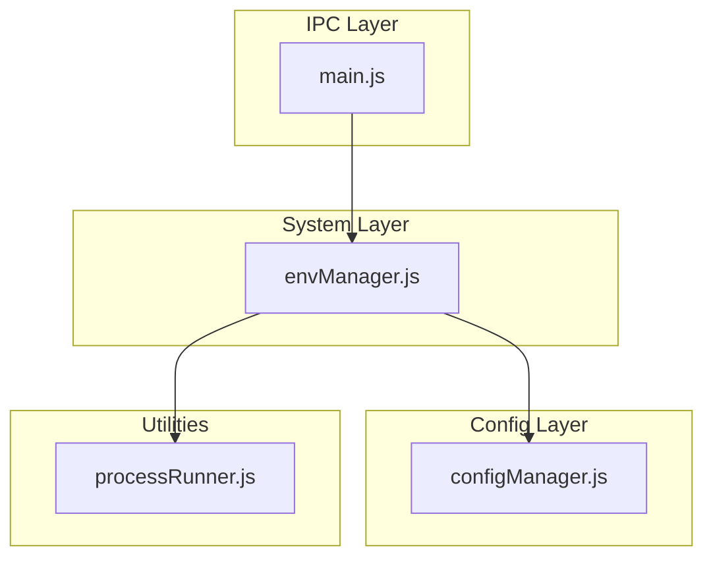
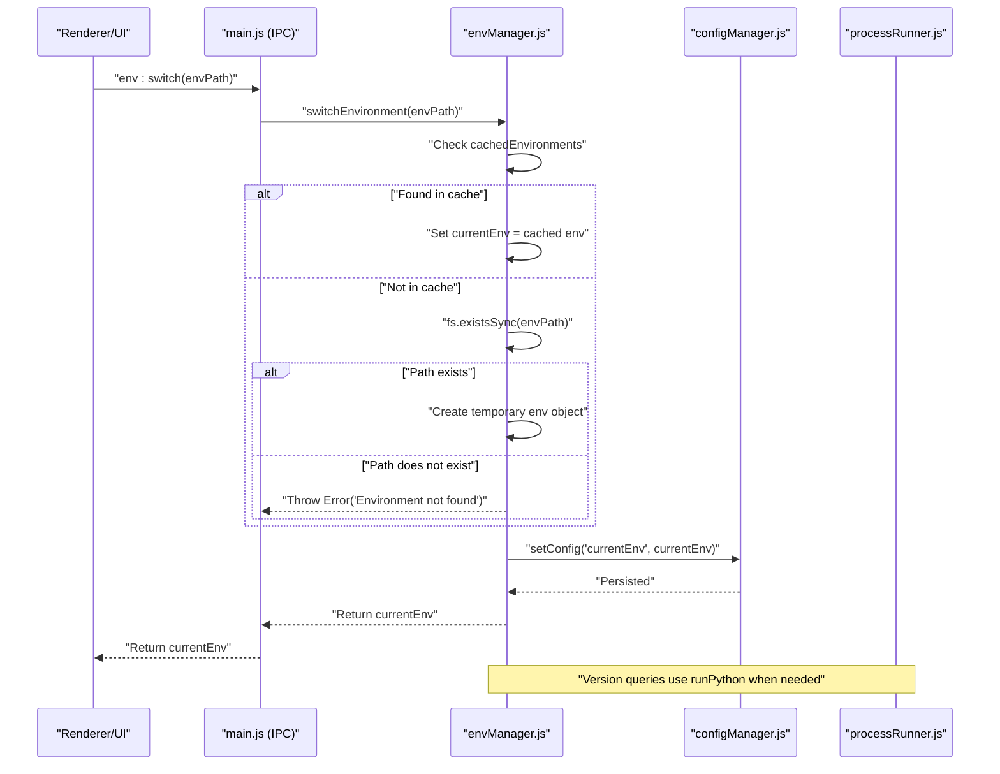
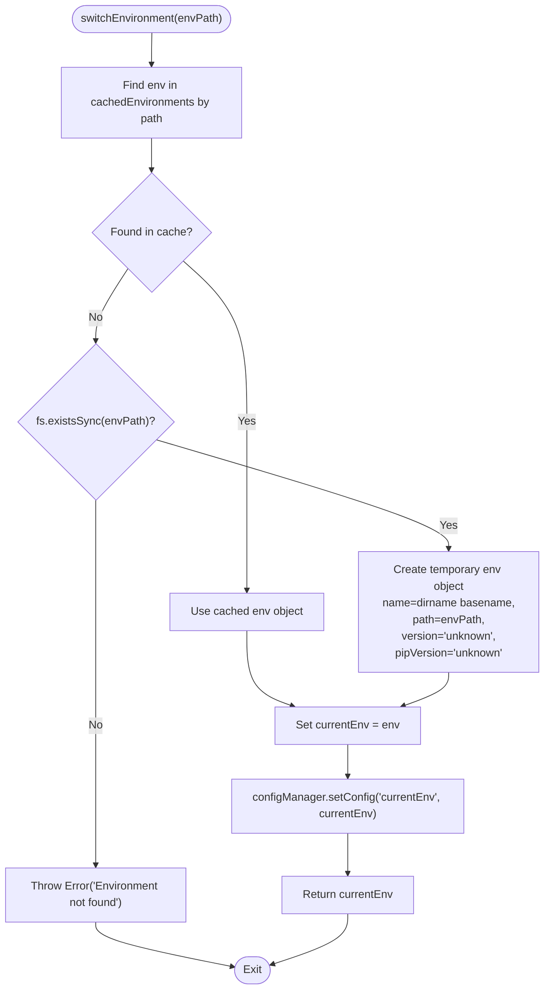
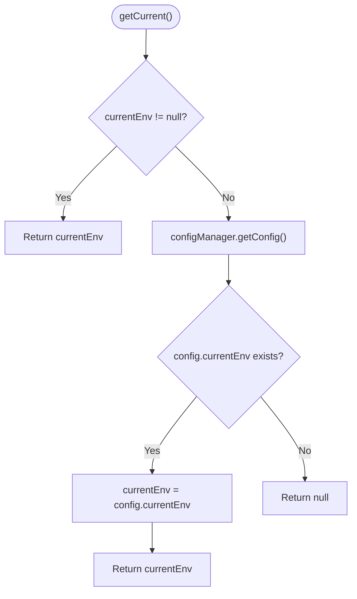
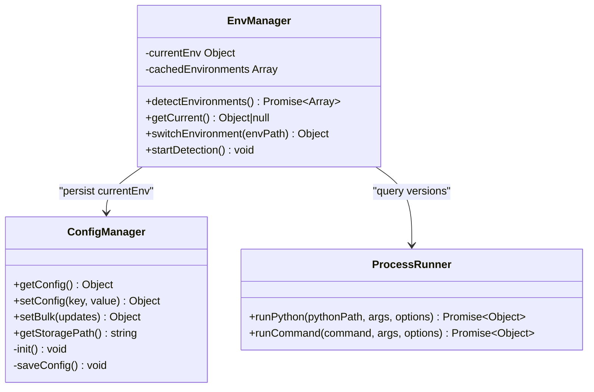

# Environment Switching API

<cite>
**Referenced Files in This Document**
- [envManager.js](file://core/system/envManager.js)
- [configManager.js](file://core/config/configManager.js)
- [processRunner.js](file://utils/processRunner.js)
- [main.js](file://main.js)
</cite>

## Table of Contents
1. [Introduction](#introduction)
2. [Project Structure](#project-structure)
3. [Core Components](#core-components)
4. [Architecture Overview](#architecture-overview)
5. [Detailed Component Analysis](#detailed-component-analysis)
6. [Dependency Analysis](#dependency-analysis)
7. [Performance Considerations](#performance-considerations)
8. [Troubleshooting Guide](#troubleshooting-guide)
9. [Conclusion](#conclusion)

## Introduction
This document provides detailed API documentation for Python environment switching functionality. It focuses on:
- switchEnvironment(envPath): validates paths, handles cached vs non-cached environments, creates temporary environment objects for existing paths, and persists changes to configuration.
- getCurrent(): retrieves the current environment from memory cache or falls back to configuration.
- Parameter validation, error handling for non-existent environments, environment object structure, and integration with configManager for persistence.
- Examples of programmatic usage, error handling patterns, and best practices for environment management in application workflows.

## Project Structure
The environment switching feature is implemented primarily in the system layer and integrates with configuration and process utilities:
- core/system/envManager.js: Core environment detection, caching, switching, and retrieval logic.
- core/config/configManager.js: Persistent configuration storage and helpers.
- utils/processRunner.js: Utilities for running Python commands and detecting versions.
- main.js: IPC handlers exposing environment operations to the renderer process.

**Diagram sources**
- [envManager.js:1-220](file://core/system/envManager.js#L1-L220)
- [configManager.js:1-194](file://core/config/configManager.js#L1-L194)
- [processRunner.js:1-366](file://utils/processRunner.js#L1-L366)
- [main.js:250-270](file://main.js#L250-L270)

**Section sources**
- [envManager.js:1-220](file://core/system/envManager.js#L1-L220)
- [configManager.js:1-194](file://core/config/configManager.js#L1-L194)
- [processRunner.js:1-366](file://utils/processRunner.js#L1-L366)
- [main.js:250-270](file://main.js#L250-L270)

## Core Components
- envManager.js
  - Exposes detectEnvironments(), getCurrent(), switchEnvironment(), startDetection().
  - Maintains an in-memory cache of detected environments and a currentEnv reference.
  - Integrates with configManager to persist currentEnv.
- configManager.js
  - Provides getConfig() and setConfig(key, value) for reading and writing persistent settings.
  - Ensures atomic writes and safe defaults.
- processRunner.js
  - Provides runPython() used by envManager to query Python and pip versions.
- main.js
  - Exposes IPC handlers for environment operations: env:detect, env:getCurrent, env:switch.

Key responsibilities:
- switchEnvironment(envPath): Validate path, resolve from cache or create temporary object if exists, persist to config, return updated currentEnv.
- getCurrent(): Return currentEnv from memory; fallback to config.currentEnv if not present.

**Section sources**
- [envManager.js:178-209](file://core/system/envManager.js#L178-L209)
- [configManager.js:144-162](file://core/config/configManager.js#L144-L162)
- [processRunner.js:351-353](file://utils/processRunner.js#L351-L353)
- [main.js:259-261](file://main.js#L259-L261)

## Architecture Overview
The environment switching flow involves:
- Renderer calls IPC handler env:switch with envPath.
- main.js forwards to envManager.switchEnvironment(envPath).
- envManager resolves or constructs environment object, persists via configManager.setConfig('currentEnv', ...), and returns the new currentEnv.
- getCurrent() reads from memory first, then falls back to config.

**Diagram sources**
- [main.js:259-261](file://main.js#L259-L261)
- [envManager.js:196-209](file://core/system/envManager.js#L196-L209)
- [configManager.js:157-162](file://core/config/configManager.js#L157-L162)
- [processRunner.js:351-353](file://utils/processRunner.js#L351-L353)

## Detailed Component Analysis

### switchEnvironment(envPath)
Purpose:
- Validates the provided Python executable path.
- Resolves from cached environments if available.
- If not cached but path exists, creates a temporary environment object with minimal metadata.
- Persists the selected environment to configuration.
- Returns the new current environment object.

Parameter validation:
- Input: envPath (string). No explicit type coercion; existence check performed.
- Behavior on invalid path: throws Error with message indicating environment not found.

Processing logic:
- Check cachedEnvironments for exact path match.
- If not found, verify fs.existsSync(envPath).
- If exists, construct temporary environment object with name derived from directory, path, and placeholder version/pipVersion.
- Update in-memory currentEnv and persist via configManager.setConfig('currentEnv', currentEnv).
- Return currentEnv.

Error handling:
- Throws Error when envPath does not exist and is not in cache.
- Errors are propagated through IPC to the caller.

Complexity:
- O(1) lookup in cachedEnvironments array.
- O(1) filesystem existence check.
- O(1) config write.

**Diagram sources**
- [envManager.js:196-209](file://core/system/envManager.js#L196-L209)
- [configManager.js:157-162](file://core/config/configManager.js#L157-L162)

**Section sources**
- [envManager.js:196-209](file://core/system/envManager.js#L196-L209)

### getCurrent()
Purpose:
- Retrieves the currently selected Python environment.
- Prioritizes in-memory currentEnv.
- Falls back to config.currentEnv if in-memory is null.

Behavior:
- If currentEnv is null, read config via configManager.getConfig() and assign config.currentEnv to currentEnv if present.
- Returns currentEnv (may be null if no environment has been set).

Complexity:
- O(1) memory access.
- O(1) config read (returns deep copy).

**Diagram sources**
- [envManager.js:178-184](file://core/system/envManager.js#L178-L184)
- [configManager.js:144-147](file://core/config/configManager.js#L144-L147)

**Section sources**
- [envManager.js:178-184](file://core/system/envManager.js#L178-L184)

### Environment Object Structure
Structure returned by getCurrent() and switchEnvironment():
- name: string — Friendly name derived from directory or version.
- path: string — Absolute path to Python executable.
- version: string — Python version (e.g., "3.x.y") or "unknown".
- pipVersion: string — pip version or "unknown"/null depending on context.

Notes:
- Temporary environment objects created by switchEnvironment() have version and pipVersion set to "unknown".
- Detected environments include accurate version and pipVersion populated via processRunner.runPython().

**Section sources**
- [envManager.js:142-148](file://core/system/envManager.js#L142-L148)
- [envManager.js:199-201](file://core/system/envManager.js#L199-L201)

### Integration with configManager
Persistence:
- switchEnvironment() calls configManager.setConfig('currentEnv', currentEnv) to persist selection.
- getCurrent() uses configManager.getConfig() to load persisted currentEnv when memory cache is empty.

Atomicity and safety:
- configManager.saveConfig() writes atomically using a temporary file and rename.
- Sanitization applies to numeric configuration keys; currentEnv is stored as-is.

**Section sources**
- [envManager.js:207-208](file://core/system/envManager.js#L207-L208)
- [configManager.js:157-162](file://core/config/configManager.js#L157-L162)
- [configManager.js:123-138](file://core/config/configManager.js#L123-L138)

### IPC Exposure
Renderer-side usage:
- env:detect: Detects all available Python environments asynchronously.
- env:getCurrent: Returns current environment.
- env:switch: Switches to specified environment path.

These handlers forward directly to envManager functions.

**Section sources**
- [main.js:257-261](file://main.js#L257-L261)

## Dependency Analysis
Component relationships:
- envManager depends on:
  - configManager for persistence.
  - processRunner for executing Python commands to retrieve versions.
  - Node.js fs/path/os/glob for filesystem and pattern matching.
- main.js exposes IPC handlers that delegate to envManager.

Potential coupling:
- envManager holds global state (currentEnv, cachedEnvironments). Ensure initialization order and background detection do not conflict with immediate switches.
- configManager init ensures default values and file presence; envManager relies on it being initialized before setConfig calls.

External dependencies:
- glob for path scanning.
- Electron app.getPath for config directory resolution.

**Diagram sources**
- [envManager.js:1-220](file://core/system/envManager.js#L1-L220)
- [configManager.js:1-194](file://core/config/configManager.js#L1-L194)
- [processRunner.js:1-366](file://utils/processRunner.js#L1-L366)

**Section sources**
- [envManager.js:1-220](file://core/system/envManager.js#L1-L220)
- [configManager.js:1-194](file://core/config/configManager.js#L1-L194)
- [processRunner.js:1-366](file://utils/processRunner.js#L1-L366)

## Performance Considerations
- Caching:
  - cachedEnvironments avoids repeated filesystem scans after initial detection.
  - getCurrent() uses in-memory currentEnv to avoid config reads unless necessary.
- Version queries:
  - Parallelized version checks during detectEnvironments() improve performance when many environments exist.
- Persistence:
  - Atomic writes minimize risk of corruption; frequent small writes are acceptable due to lightweight JSON updates.

Recommendations:
- Prefer calling detectEnvironments() once at startup and rely on cachedEnvironments for subsequent switches.
- Avoid excessive switchEnvironment() calls without user intent; batch UI actions where possible.

[No sources needed since this section provides general guidance]

## Troubleshooting Guide
Common issues and resolutions:
- Non-existent environment path:
  - switchEnvironment() throws Error("Environment not found: <path>").
  - Ensure envPath points to a valid Python executable.
- Missing pip:
  - detectEnvironments() filters out environments without pip.
  - Use ensurePip() via processRunner to install pip if needed.
- Configuration errors:
  - configManager handles corrupted configs by rebuilding defaults and saving.
  - Verify config file location and permissions.

Debugging steps:
- Call env:detect to refresh cached environments.
- Call env:getCurrent to inspect currentEnv.
- Inspect logs via logManager if available.

**Section sources**
- [envManager.js:196-209](file://core/system/envManager.js#L196-L209)
- [processRunner.js:233-278](file://utils/processRunner.js#L233-L278)
- [configManager.js:101-117](file://core/config/configManager.js#L101-L117)

## Conclusion
The environment switching API provides robust mechanisms to validate paths, manage cached and temporary environments, and persist selections reliably. By leveraging in-memory caching and atomic configuration writes, it balances performance and durability. Proper error handling ensures clear feedback when invalid paths are provided, while IPC exposure enables seamless integration with the UI layer. Following the recommended patterns and best practices will help maintain consistent environment management across application workflows.

[No sources needed since this section summarizes without analyzing specific files]