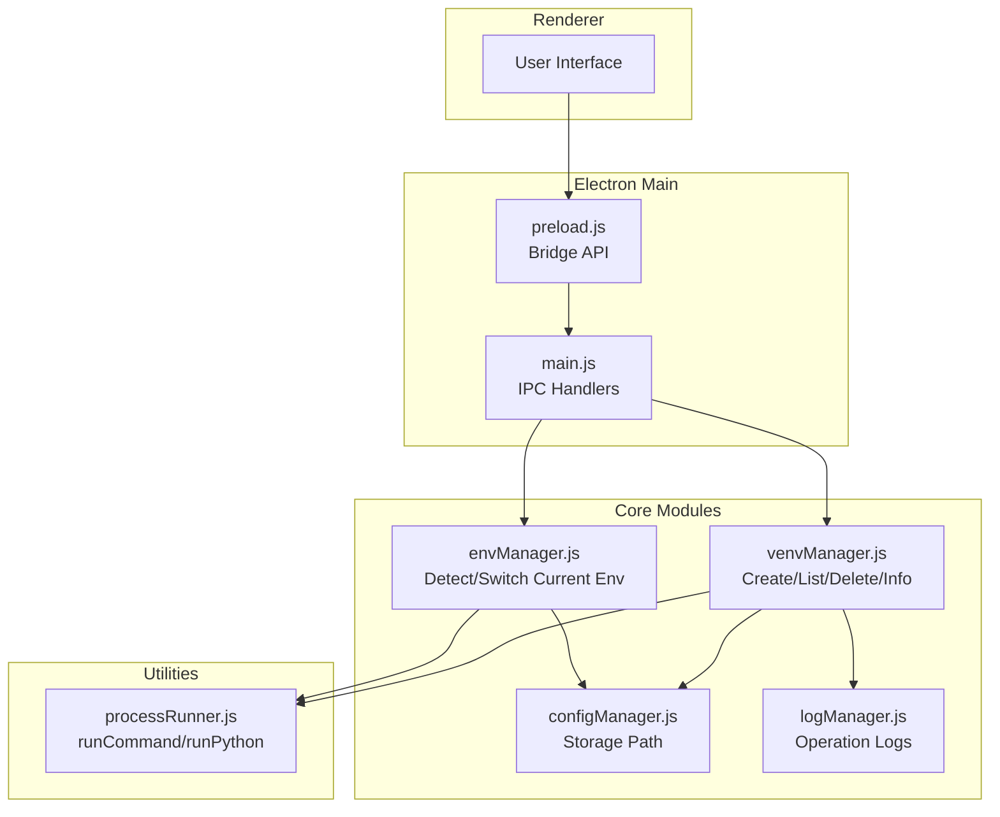
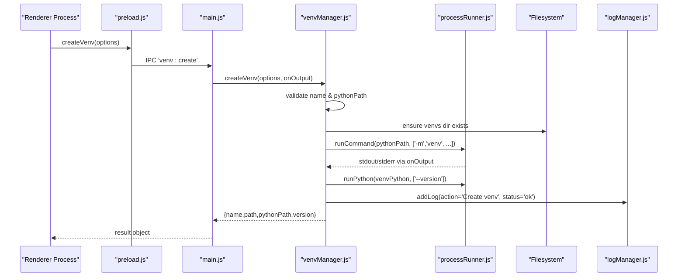
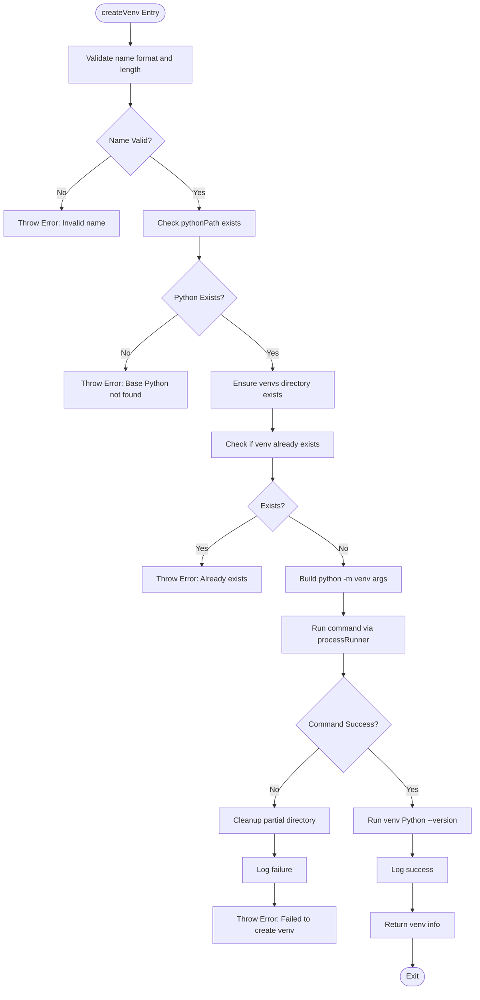
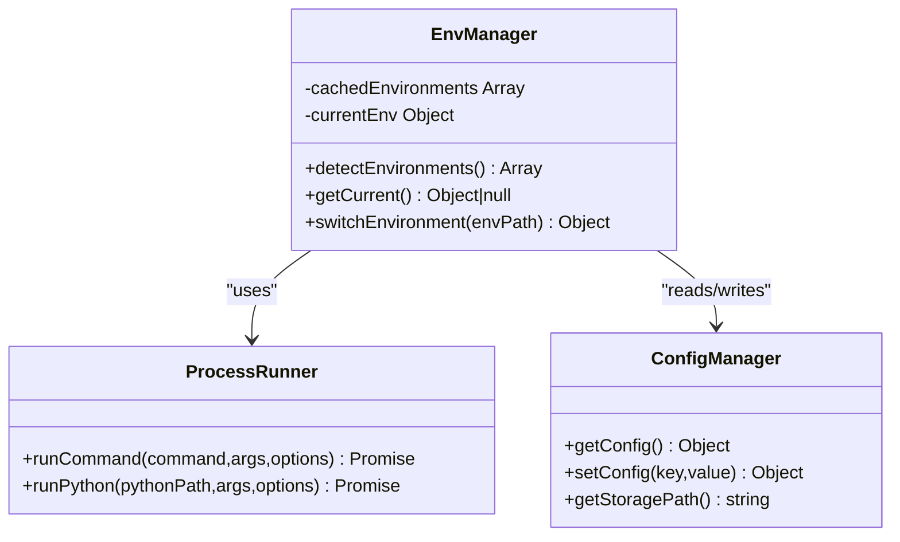
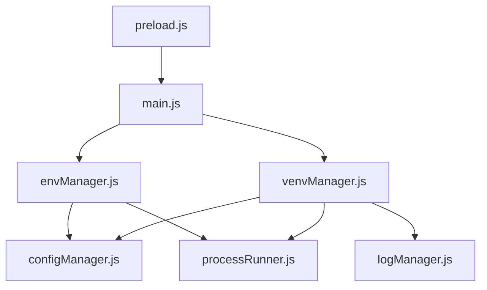

# Virtual Environment Management API

<cite>
**Referenced Files in This Document**
- [venvManager.js](file://core/operations/venvManager.js)
- [envManager.js](file://core/system/envManager.js)
- [processRunner.js](file://utils/processRunner.js)
- [configManager.js](file://core/config/configManager.js)
- [logManager.js](file://core/system/logManager.js)
- [main.js](file://main.js)
- [preload.js](file://preload.js)
</cite>

## Table of Contents
1. [Introduction](#introduction)
2. [Project Structure](#project-structure)
3. [Core Components](#core-components)
4. [Architecture Overview](#architecture-overview)
5. [Detailed Component Analysis](#detailed-component-analysis)
6. [Dependency Analysis](#dependency-analysis)
7. [Performance Considerations](#performance-considerations)
8. [Troubleshooting Guide](#troubleshooting-guide)
9. [Conclusion](#conclusion)
10. [Appendices](#appendices)

## Introduction
This document provides detailed API documentation for virtual environment creation and management within the application. It covers venv creation parameters (Python interpreter selection, environment path specification, configuration options), environment validation, existence checking, cleanup operations, and integration with the main environment manager. It also explains cross-platform compatibility considerations, error handling patterns, and practical examples for creating isolated development environments and managing multiple project environments.

## Project Structure
The virtual environment management functionality is implemented primarily in the core modules:
- venvManager.js: Virtual environment lifecycle (create, list, delete, info).
- envManager.js: System Python environment detection and current environment switching.
- processRunner.js: Subprocess execution utilities used by both managers to run Python commands safely.
- configManager.js: Storage path resolution and configuration persistence.
- logManager.js: Operation logging for auditability.
- main.js: IPC handlers that expose venv operations to the renderer.
- preload.js: Secure bridge exposing venv APIs to the renderer process.

**Diagram sources**
- [main.js:266-281](file://main.js#L266-L281)
- [preload.js:33-38](file://preload.js#L33-L38)
- [venvManager.js:1-278](file://core/operations/venvManager.js#L1-L278)
- [envManager.js:1-220](file://core/system/envManager.js#L1-L220)
- [processRunner.js:1-366](file://utils/processRunner.js#L1-L366)
- [configManager.js:1-194](file://core/config/configManager.js#L1-L194)
- [logManager.js:1-176](file://core/system/logManager.js#L1-L176)

**Section sources**
- [main.js:266-281](file://main.js#L266-L281)
- [preload.js:33-38](file://preload.js#L33-L38)
- [venvManager.js:1-278](file://core/operations/venvManager.js#L1-L278)
- [envManager.js:1-220](file://core/system/envManager.js#L1-L220)
- [processRunner.js:1-366](file://utils/processRunner.js#L1-L366)
- [configManager.js:1-194](file://core/config/configManager.js#L1-L194)
- [logManager.js:1-176](file://core/system/logManager.js#L1-L176)

## Core Components
- venvManager.js
  - createVenv(options, onOutput): Creates a new virtual environment with specified name, base Python interpreter, pip inclusion flag, and system site-packages inheritance. Validates inputs, ensures target directory exists, constructs python -m venv arguments, executes via processRunner, and returns metadata including resolved Python path and version.
  - listVenvs(): Scans configured storage root for valid venv directories, validates presence of executable and pyvenv.cfg, and collects version/pip/package counts.
  - deleteVenv(name, onOutput): Removes an existing venv after validating name and ensuring path safety against traversal attacks.
  - getVenvInfo(name): Returns detailed information about a specific venv, including Python version, pip version, and base Python path from pyvenv.cfg.
  - getVenvsDir(), getVenvPythonPath(venvPath): Utility functions for locating the venvs storage directory and resolving platform-specific Python executables.

- envManager.js
  - detectEnvironments(): Scans common installation paths and PATH entries to discover available Python interpreters, filters those without pip, and persists the current environment if needed.
  - getCurrent(): Returns the currently selected Python environment from memory or configuration.
  - switchEnvironment(envPath): Switches the active Python environment and persists it to configuration.

- processRunner.js
  - runCommand(command, args, options): Spawns child processes with UTF-8 encoding, real-time output callbacks, ANSI stripping, timeout handling, and cancellation support.
  - runPython(pythonPath, args, options): Convenience wrapper around runCommand for executing Python scripts or flags.
  - ensurePip(pythonPath, onOutput): Ensures pip availability using ensurepip or downloading get-pip.py as fallback.

- configManager.js
  - getStoragePath(): Resolves application storage directory where venvs are stored under a venvs subdirectory.

- logManager.js
  - addLog(entry): Records operation logs with action, status, type, and detail fields; truncates long fields and enforces maximum log count.

**Section sources**
- [venvManager.js:73-130](file://core/operations/venvManager.js#L73-L130)
- [venvManager.js:136-186](file://core/operations/venvManager.js#L136-L186)
- [venvManager.js:195-224](file://core/operations/venvManager.js#L195-L224)
- [venvManager.js:231-268](file://core/operations/venvManager.js#L231-L268)
- [venvManager.js:30-59](file://core/operations/venvManager.js#L30-L59)
- [envManager.js:85-170](file://core/system/envManager.js#L85-L170)
- [envManager.js:178-209](file://core/system/envManager.js#L178-L209)
- [processRunner.js:85-161](file://utils/processRunner.js#L85-L161)
- [processRunner.js:351-353](file://utils/processRunner.js#L351-L353)
- [processRunner.js:233-278](file://utils/processRunner.js#L233-L278)
- [configManager.js:185-191](file://core/config/configManager.js#L185-L191)
- [logManager.js:115-134](file://core/system/logManager.js#L115-L134)

## Architecture Overview
The virtual environment management API is exposed through Electron’s IPC mechanism. The renderer calls window.electronAPI.createVenv/listVenvs/deleteVenv/getVenvInfo, which are bridged by preload.js to main.js IPC handlers. These handlers invoke venvManager methods, which use processRunner to execute Python commands and interact with the filesystem. Configuration and logging are handled by configManager and logManager respectively.

**Diagram sources**
- [preload.js:35-38](file://preload.js#L35-L38)
- [main.js:266-270](file://main.js#L266-L270)
- [venvManager.js:73-130](file://core/operations/venvManager.js#L73-L130)
- [processRunner.js:85-161](file://utils/processRunner.js#L85-L161)
- [logManager.js:115-134](file://core/system/logManager.js#L115-L134)

## Detailed Component Analysis

### venvManager.js API
- createVenv(options, onOutput)
  - Parameters:
    - name: string — venv name validated against allowed characters and length.
    - pythonPath: string — absolute path to base Python interpreter; must exist.
    - withPip: boolean — include pip in venv (default true).
    - systemSitePackages: boolean — inherit system site-packages (default false).
    - onOutput: function(text, type) — optional callback for progress/output streaming.
  - Behavior:
    - Validates name and pythonPath.
    - Ensures venvs directory exists under configured storage path.
    - Checks for existing venv at target path.
    - Builds python -m venv command with flags based on options.
    - Executes via processRunner.runCommand with timeout and output streaming.
    - On failure, cleans up partially created directory and logs failure.
    - Retrieves Python version from venv’s executable and logs success.
  - Returns: Promise<Object> with name, path, pythonPath, version.
  - Throws: Error on invalid name, missing pythonPath, or creation failure.

- listVenvs()
  - Behavior:
    - Reads venvs directory entries.
    - Filters directories that contain a valid Python executable and pyvenv.cfg.
    - For each venv, runs --version and pip --version to collect metadata.
    - Counts installed packages via pip list JSON output.
  - Returns: Promise<Array> of venv objects with name, path, pythonPath, version, pipVersion, packageCount.

- deleteVenv(name, onOutput)
  - Behavior:
    - Validates name format.
    - Resolves path and checks existence.
    - Performs path traversal protection by ensuring resolved path is within venvs root.
    - Deletes directory recursively and logs operation.
  - Returns: Promise<Object> { success: true, name }.
  - Throws: Error on invalid name, not found, or deletion failure.

- getVenvInfo(name)
  - Behavior:
    - Validates name.
    - Locates venv path and resolves Python executable.
    - Runs --version and pip --version to gather metadata.
    - Reads pyvenv.cfg to extract base Python home path.
  - Returns: Promise<Object> with name, path, pythonPath, version, pipVersion, basePython.
  - Throws: Error on invalid name or not found.

- getVenvsDir(), getVenvPythonPath(venvPath)
  - Utilities for storage path resolution and cross-platform executable detection.

**Diagram sources**
- [venvManager.js:73-130](file://core/operations/venvManager.js#L73-L130)
- [processRunner.js:85-161](file://utils/processRunner.js#L85-L161)
- [logManager.js:115-134](file://core/system/logManager.js#L115-L134)

**Section sources**
- [venvManager.js:73-130](file://core/operations/venvManager.js#L73-L130)
- [venvManager.js:136-186](file://core/operations/venvManager.js#L136-L186)
- [venvManager.js:195-224](file://core/operations/venvManager.js#L195-L224)
- [venvManager.js:231-268](file://core/operations/venvManager.js#L231-L268)
- [venvManager.js:30-59](file://core/operations/venvManager.js#L30-L59)

### envManager.js Integration
- detectEnvironments(): Discovers all Python installations by scanning common paths and PATH entries, filters out environments without pip, and restores persisted current environment if present.
- getCurrent(): Returns the active environment from memory or configuration.
- switchEnvironment(envPath): Updates the active environment and persists it.

**Diagram sources**
- [envManager.js:85-170](file://core/system/envManager.js#L85-L170)
- [envManager.js:178-209](file://core/system/envManager.js#L178-L209)
- [processRunner.js:85-161](file://utils/processRunner.js#L85-L161)
- [configManager.js:144-162](file://core/config/configManager.js#L144-L162)

**Section sources**
- [envManager.js:85-170](file://core/system/envManager.js#L85-L170)
- [envManager.js:178-209](file://core/system/envManager.js#L178-L209)

### processRunner.js Utilities
- runCommand(command, args, options):
  - Sets UTF-8 environment variables for consistent output.
  - Spawns child process with hidden console on Windows.
  - Streams stdout/stderr with ANSI stripping and optional onOutput callback.
  - Tracks active processes for cancellation and supports timeouts with SIGTERM then SIGKILL.
  - Rejects with structured error containing stdout/stderr when exit code is non-zero.
- runPython(pythonPath, args, options):
  - Convenience wrapper to execute Python commands.
- ensurePip(pythonPath, onOutput):
  - Checks pip availability, attempts ensurepip upgrade, falls back to downloading get-pip.py, caches readiness for performance.

**Section sources**
- [processRunner.js:85-161](file://utils/processRunner.js#L85-L161)
- [processRunner.js:351-353](file://utils/processRunner.js#L351-L353)
- [processRunner.js:233-278](file://utils/processRunner.js#L233-L278)

### IPC Exposure and Renderer Integration
- main.js registers IPC handlers for venv operations:
  - venv:create: invokes venvManager.createVenv with progress callback.
  - venv:list: invokes venvManager.listVenvs.
  - venv:delete: invokes venvManager.deleteVenv with progress callback.
  - venv:info: invokes venvManager.getVenvInfo.
- preload.js exposes these methods via window.electronAPI for safe renderer access.

**Section sources**
- [main.js:266-281](file://main.js#L266-L281)
- [preload.js:33-38](file://preload.js#L33-L38)

## Dependency Analysis
- venvManager depends on:
  - configManager for storage path resolution.
  - processRunner for subprocess execution.
  - logManager for operation logging.
- envManager depends on:
  - processRunner for running Python commands.
  - configManager for reading/writing current environment.
- main.js orchestrates IPC handlers and integrates venvManager and envManager into the application lifecycle.
- preload.js bridges renderer to main process securely.

**Diagram sources**
- [venvManager.js:18-20](file://core/operations/venvManager.js#L18-L20)
- [envManager.js:21-23](file://core/system/envManager.js#L21-L23)
- [main.js:17-30](file://main.js#L17-L30)
- [preload.js:20-38](file://preload.js#L20-L38)

**Section sources**
- [venvManager.js:18-20](file://core/operations/venvManager.js#L18-L20)
- [envManager.js:21-23](file://core/system/envManager.js#L21-L23)
- [main.js:17-30](file://main.js#L17-L30)
- [preload.js:20-38](file://preload.js#L20-L38)

## Performance Considerations
- Parallel environment detection: envManager uses Promise.all to fetch versions concurrently, improving startup time.
- Pip readiness caching: processRunner caches pip availability per Python path to avoid repeated checks.
- Output streaming: Real-time onOutput callbacks prevent blocking and enable responsive UI updates.
- Timeout handling: Long-running operations are safeguarded with configurable timeouts and graceful termination.

[No sources needed since this section provides general guidance]

## Troubleshooting Guide
Common issues and resolutions:
- Permission issues during venv creation/deletion:
  - Ensure the user has write permissions to the configured storage path.
  - Verify antivirus or security software is not blocking file operations.
- Disk space constraints:
  - Confirm sufficient free disk space before creating venvs or installing packages.
  - Use listVenvs to inspect package counts and sizes indirectly.
- Python interpreter availability:
  - Validate pythonPath points to an existing executable.
  - Use envManager.detectEnvironments to discover valid interpreters with pip.
- Path traversal protection:
  - deleteVenv enforces path containment within venvs root; errors indicate invalid input.
- Logging and diagnostics:
  - Review operation logs via logManager to trace failures and successes.
  - Use healthCheck and checkConflicts endpoints for broader environment diagnostics.

**Section sources**
- [venvManager.js:195-224](file://core/operations/venvManager.js#L195-L224)
- [envManager.js:85-170](file://core/system/envManager.js#L85-L170)
- [logManager.js:115-134](file://core/system/logManager.js#L115-L134)

## Conclusion
The virtual environment management API provides a robust, cross-platform solution for creating, listing, deleting, and inspecting Python virtual environments. It integrates seamlessly with the main environment manager for Python interpreter discovery and switching, leverages secure subprocess execution, and maintains comprehensive logs for auditing. With clear parameter validation, error handling, and performance optimizations, it supports scalable multi-project workflows and reliable isolation of dependencies.

[No sources needed since this section summarizes without analyzing specific files]

## Appendices

### API Reference Summary
- createVenv(options, onOutput)
  - Options: name, pythonPath, withPip, systemSitePackages.
  - Returns: { name, path, pythonPath, version }.
- listVenvs()
  - Returns: Array of { name, path, pythonPath, version, pipVersion, packageCount }.
- deleteVenv(name, onOutput)
  - Returns: { success: true, name }.
- getVenvInfo(name)
  - Returns: { name, path, pythonPath, version, pipVersion, basePython }.

**Section sources**
- [venvManager.js:73-130](file://core/operations/venvManager.js#L73-L130)
- [venvManager.js:136-186](file://core/operations/venvManager.js#L136-L186)
- [venvManager.js:195-224](file://core/operations/venvManager.js#L195-L224)
- [venvManager.js:231-268](file://core/operations/venvManager.js#L231-L268)

### Cross-Platform Compatibility Notes
- Executable resolution:
  - Windows: Scripts/python.exe
  - Unix-like: bin/python
- Storage path:
  - Determined by configManager.getStoragePath; venvs stored under <storage>/venvs.
- Process execution:
  - UTF-8 encoding enforced; ANSI sequences stripped; shell mode supported.

**Section sources**
- [venvManager.js:52-59](file://core/operations/venvManager.js#L52-L59)
- [configManager.js:185-191](file://core/config/configManager.js#L185-L191)
- [processRunner.js:85-161](file://utils/processRunner.js#L85-L161)

### Examples of Usage Patterns
- Creating an isolated development environment:
  - Call createVenv with a unique name, specify a known pythonPath, keep withPip true, and set systemSitePackages false.
- Managing multiple project environments:
  - Use listVenvs to enumerate existing environments; switch between them via envManager.switchEnvironment when needed.
- Integrating with the main environment manager:
  - Detect available interpreters with envManager.detectEnvironments; persist currentEnv via configManager; use venvManager for isolated project setups.

[No sources needed since this section provides general guidance]