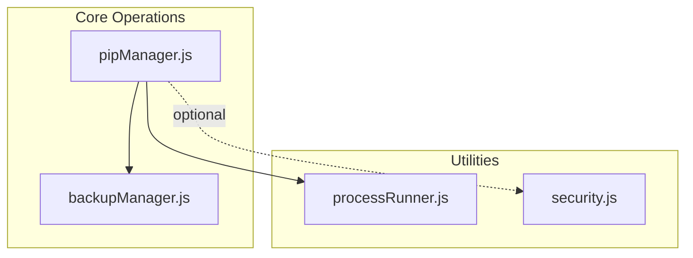
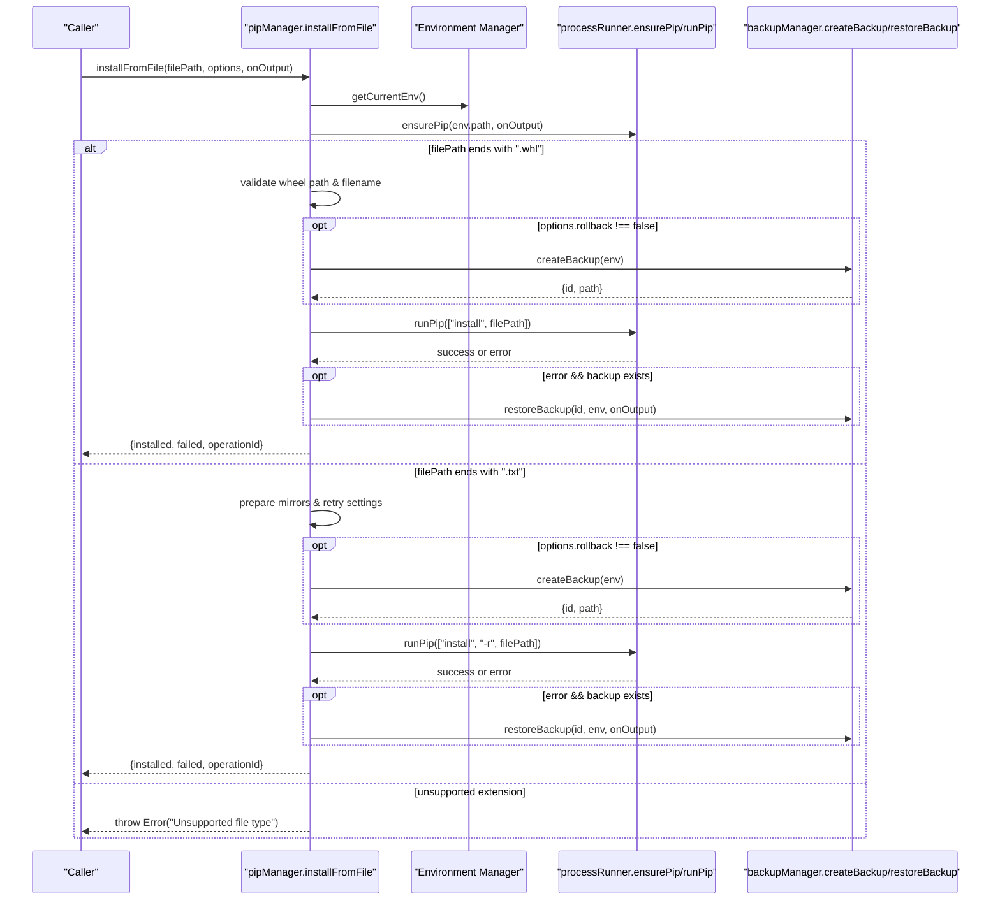
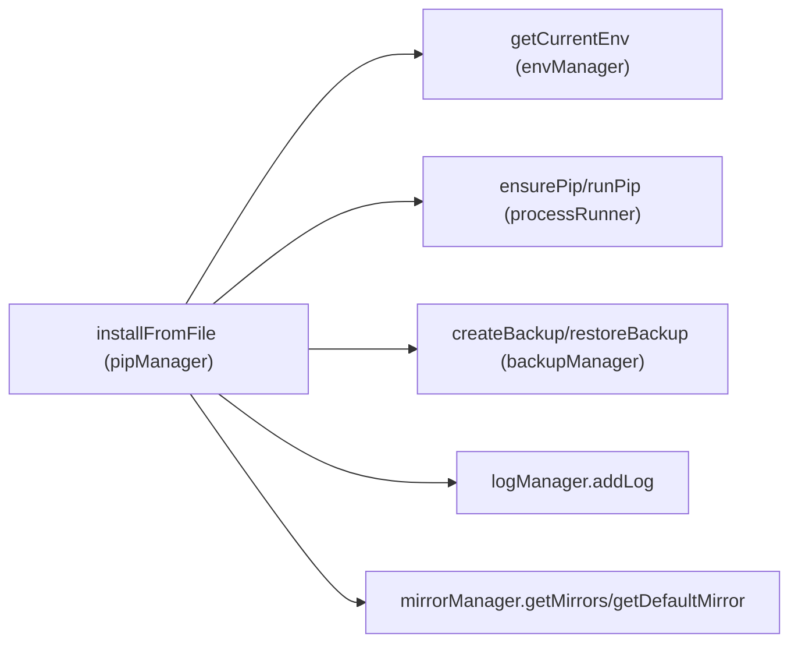

# File-Based Installation API

<cite>
**Referenced Files in This Document**
- [pipManager.js](file://core/operations/pipManager.js)
- [backupManager.js](file://core/operations/backupManager.js)
- [processRunner.js](file://utils/processRunner.js)
- [security.js](file://utils/security.js)
</cite>

## Table of Contents
1. [Introduction](#introduction)
2. [Project Structure](#project-structure)
3. [Core Components](#core-components)
4. [Architecture Overview](#architecture-overview)
5. [Detailed Component Analysis](#detailed-component-analysis)
6. [Dependency Analysis](#dependency-analysis)
7. [Performance Considerations](#performance-considerations)
8. [Troubleshooting Guide](#troubleshooting-guide)
9. [Conclusion](#conclusion)
10. [Appendices](#appendices)

## Introduction
This document provides detailed API documentation for file-based package installation functionality, centered on the installFromFile() function. It explains how to install Python packages from local files, including .whl wheel files and .txt requirements.txt files. The documentation covers parameter specifications (filePath, options object with rollback, retry, operationId), onOutput callback usage, file path validation, security checks against path traversal attacks, file type detection, backup and rollback mechanisms, progress reporting, and error handling for corrupted or invalid files. Practical examples are included to demonstrate wheel installation, requirements processing, batch dependency installation, and error recovery scenarios.

## Project Structure
The file-based installation feature is implemented primarily within the pip manager module, which orchestrates pip commands, environment locking, backup creation/restoration, and progress reporting. Supporting modules provide process execution, backup management, and security utilities.

**Diagram sources**
- [pipManager.js:1-120](file://core/operations/pipManager.js#L1-L120)
- [backupManager.js:1-60](file://core/operations/backupManager.js#L1-L60)
- [processRunner.js:1-120](file://utils/processRunner.js#L1-L120)
- [security.js:1-43](file://utils/security.js#L1-L43)

**Section sources**
- [pipManager.js:1-120](file://core/operations/pipManager.js#L1-L120)
- [backupManager.js:1-60](file://core/operations/backupManager.js#L1-L60)
- [processRunner.js:1-120](file://utils/processRunner.js#L1-L120)
- [security.js:1-43](file://utils/security.js#L1-L43)

## Core Components
- installFromFile(filePath, options, onOutput): Entry point for installing packages from a local file. Supports .whl and .txt formats with distinct processing logic.
- Backup and Rollback: Automatic backup creation before installation; automatic restoration on failure when rollback is enabled.
- Progress Reporting: Structured progress events via onOutput callback for UI updates.
- Security Validation: Path traversal protection, filename validation, and safe path normalization for wheel files.
- Process Execution: Reliable pip command execution with timeout, cancellation, and output streaming.

Key responsibilities and behaviors are implemented across:
- pipManager.js: orchestration, validation, backup integration, pip invocation, progress emission
- backupManager.js: backup creation, restore, ID validation
- processRunner.js: subprocess execution, timeouts, cancellation, ensurePip
- security.js: path allowance utility (optional use)

**Section sources**
- [pipManager.js:645-730](file://core/operations/pipManager.js#L645-L730)
- [backupManager.js:89-113](file://core/operations/backupManager.js#L89-L113)
- [processRunner.js:233-278](file://utils/processRunner.js#L233-L278)
- [security.js:28-40](file://utils/security.js#L28-L40)

## Architecture Overview
The installFromFile() workflow integrates environment selection, pip readiness, file type detection, security validation, backup creation, pip execution, progress emission, and rollback on failure.

**Diagram sources**
- [pipManager.js:645-730](file://core/operations/pipManager.js#L645-L730)
- [backupManager.js:89-113](file://core/operations/backupManager.js#L89-L113)
- [processRunner.js:233-278](file://utils/processRunner.js#L233-L278)

## Detailed Component Analysis

### installFromFile(filePath, options, onOutput)
Purpose: Install packages from a local file. Supports two formats:
- .whl: Direct wheel file installation
- .txt: Requirements file installation using pip -r

Parameters:
- filePath: string
  - Must be an absolute path for .whl files; relative paths are rejected for wheels
  - For .txt, any readable file path is accepted
  - File existence is validated before proceeding
- options: object (optional)
  - rollback: boolean (default true unless explicitly set to false)
    - When true, creates a backup before installation and restores it on failure
  - retry: boolean (default false)
    - For .txt, enables multi-mirror retry attempts based on configured mirror list
    - For .whl, retry is not applied at this layer
  - operationId: string (optional)
    - Unique identifier used to track and cancel operations
- onOutput: function(text, type) (optional)
  - Receives structured progress messages and pip stdout/stderr
  - Progress events include [PROGRESS] JSON payloads with done, pkg, status fields

Return value:
- Promise resolving to an object:
  - installed: array of successfully installed package names (for .whl returns basename; for .txt returns empty array)
  - failed: array of failures with spec and error message (empty for .whl/.txt single-file installs)
  - operationId: string identifying the operation

Behavior highlights:
- Environment lock acquisition ensures serial execution per Python environment
- Pip readiness ensured automatically
- Wheel path validation includes:
  - No ".." components
  - Absolute path requirement
  - UNC path rejection
  - Sensitive directory checks
  - Blocked characters check
  - Filename regex validation
- Backup creation and rollback integrated with error handling
- Progress emission via emitProgress helper

Security considerations:
- Strict validation prevents path traversal and injection
- Only allowed characters and patterns accepted for wheel filenames
- Absolute path enforcement avoids unintended directory access

Error handling:
- Throws descriptive errors for invalid inputs, unsupported types, and pip failures
- On failure with rollback enabled, restores environment state from backup
- Logs actions and outcomes through logManager

**Section sources**
- [pipManager.js:645-730](file://core/operations/pipManager.js#L645-L730)
- [pipManager.js:154-235](file://core/operations/pipManager.js#L154-L235)
- [pipManager.js:61-63](file://core/operations/pipManager.js#L61-L63)

### File Type Detection and Processing Logic
- .whl:
  - Validates path and filename
  - Executes pip install with the wheel file path
  - Emits progress event with the wheel basename
  - Returns installed list containing the wheel basename
- .txt:
  - Prepares mirror order and retry settings
  - Executes pip install -r with the requirements file
  - Supports multi-mirror retries if enabled
  - Emits progress event with the filename
  - Returns empty installed list (pip handles parsing)

File path validation specifics:
- For .whl:
  - Rejects relative paths
  - Normalizes path and rejects UNC paths
  - Blocks sensitive directories (/windows/, /dev/, /proc/, /sys/)
  - Checks blocked characters like ;, &, |, `, $, <, >, ", ', newline, null
  - Validates filename pattern ending with .whl and alphanumeric/dot/hyphen/underscore rules

For .txt:
- Basic file existence check
- Passed directly to pip install -r; pip validates format

**Section sources**
- [pipManager.js:645-730](file://core/operations/pipManager.js#L645-L730)
- [pipManager.js:178-206](file://core/operations/pipManager.js#L178-L206)

### Backup and Rollback Mechanisms
- Before installation (when rollback is enabled), a backup is created using pip freeze output saved to a timestamped file under the storage backups directory
- Backup ID is validated to prevent path traversal and ensure correct naming convention
- On failure, restoreBackup executes pip install -r with --force-reinstall and --no-deps to revert to the pre-installation state
- Backup metadata includes id, path, createdAt, envName, envPath

Backup lifecycle:
- Create backup prior to risky operations
- Restore on error if backup exists
- Delete backups as needed via deleteBackup

**Section sources**
- [backupManager.js:89-113](file://core/operations/backupManager.js#L89-L113)
- [backupManager.js:156-170](file://core/operations/backupManager.js#L156-L170)
- [backupManager.js:62-78](file://core/operations/backupManager.js#L62-L78)

### Progress Reporting and onOutput Callback
- onOutput receives text and type ('stdout' or 'stderr')
- Progress events are emitted as [PROGRESS] lines containing JSON with done, pkg, status fields
- Useful for updating UI counters and logs
- Real-time pip output is forwarded through onOutput

Usage:
- Provide onOutput to receive live feedback during installation
- Parse [PROGRESS] lines to update completion counts

**Section sources**
- [pipManager.js:61-63](file://core/operations/pipManager.js#L61-L63)
- [processRunner.js:116-127](file://utils/processRunner.js#L116-L127)

### Error Handling for Corrupted or Invalid Files
- If filePath does not exist, throws an error immediately
- Unsupported file extensions result in an explicit error
- Wheel path validation errors include details about traversal, UNC, absolute path, sensitive directories, blocked characters, and filename mismatch
- Pip failures propagate with stderr/stdout captured in error objects
- Rollback restores environment state when enabled

Common error scenarios:
- Missing file
- Relative wheel path
- Path traversal attempt
- Corrupted wheel file
- Invalid requirements.txt syntax

**Section sources**
- [pipManager.js:645-730](file://core/operations/pipManager.js#L645-L730)
- [processRunner.js:136-148](file://utils/processRunner.js#L136-L148)

### Practical Code Examples
Note: These examples illustrate usage patterns without embedding code content. Refer to the source sections for implementation details.

- Wheel file installation:
  - Call installFromFile with an absolute .whl path
  - Enable rollback to ensure safety
  - Provide onOutput to monitor progress
  - Handle returned {installed, failed, operationId}

- Requirements.txt processing:
  - Call installFromFile with a .txt path
  - Optionally enable retry for multi-mirror attempts
  - Monitor progress and handle errors

- Batch dependency installation:
  - Use a single requirements.txt listing multiple dependencies
  - pip -r processes all entries sequentially
  - Rollback restores environment on first failure

- Error recovery scenarios:
  - Catch thrown errors and inspect details
  - If rollback was enabled, environment should be restored
  - Log and report failures to users

[No sources needed since this section provides conceptual usage patterns]

## Dependency Analysis
The installFromFile() function depends on several internal modules:

**Diagram sources**
- [pipManager.js:645-730](file://core/operations/pipManager.js#L645-L730)
- [processRunner.js:233-278](file://utils/processRunner.js#L233-L278)
- [backupManager.js:89-113](file://core/operations/backupManager.js#L89-L113)

Coupling and cohesion:
- High cohesion within pipManager for installation workflows
- Clear separation of concerns: process execution, backup management, logging
- Minimal external dependencies beyond Node.js standard library and internal modules

Potential circular dependencies:
- None detected; imports are one-directional from core operations to utilities

External integration points:
- pip executable via processRunner
- File system for backups and input files
- Mirror configuration for network fallbacks

**Section sources**
- [pipManager.js:645-730](file://core/operations/pipManager.js#L645-L730)
- [processRunner.js:233-278](file://utils/processRunner.js#L233-L278)
- [backupManager.js:89-113](file://core/operations/backupManager.js#L89-L113)

## Performance Considerations
- Environment locking ensures serial execution per Python environment, preventing concurrent conflicts
- Pip readiness caching reduces repeated detection overhead
- Backup creation uses pip freeze, which is fast but may scale with installed package count
- Multi-mirror retry for .txt increases robustness but adds latency; configure retryCount appropriately
- Progress emission is lightweight and non-blocking

Optimization opportunities:
- Cache site-packages paths and package metadata where applicable
- Limit retry attempts based on network reliability
- Use parallel installation for multiple independent specs when appropriate

[No sources needed since this section provides general guidance]

## Troubleshooting Guide
Common issues and resolutions:
- File not found: Ensure filePath exists and is accessible
- Unsupported file type: Use .whl or .txt only
- Relative wheel path: Convert to absolute path before calling installFromFile
- Path traversal detected: Avoid ".." components; use safe absolute paths
- Corrupted wheel file: Verify integrity and re-download if necessary
- Invalid requirements.txt: Validate syntax and remove malformed lines
- Network failures: Enable retry and configure mirrors appropriately
- Rollback not triggered: Confirm rollback option is enabled and backup creation succeeded

Diagnostic steps:
- Inspect onOutput logs for pip stdout/stderr
- Check backup files in storage/backups directory
- Review logManager entries for action details and error messages

**Section sources**
- [pipManager.js:645-730](file://core/operations/pipManager.js#L645-L730)
- [backupManager.js:156-170](file://core/operations/backupManager.js#L156-L170)
- [processRunner.js:136-148](file://utils/processRunner.js#L136-L148)

## Conclusion
The installFromFile() function provides a secure, robust, and user-friendly interface for installing Python packages from local files. It supports both wheel and requirements.txt formats with comprehensive validation, backup/rollback capabilities, progress reporting, and error handling. By leveraging environment locking, pip readiness checks, and multi-mirror retries, it ensures reliable installations even in challenging environments. Proper usage of filePath, options, and onOutput enables effective integration into applications requiring programmatic package management.

[No sources needed since this section summarizes without analyzing specific files]

## Appendices

### Parameter Reference
- filePath: string
  - Required; must exist; absolute for .whl
- options: object
  - rollback: boolean (default true)
  - retry: boolean (default false)
  - operationId: string (optional)
- onOutput: function(text, type)
  - Optional; receives real-time output and progress events

Return Object:
- installed: array of strings
- failed: array of objects with spec and error
- operationId: string

**Section sources**
- [pipManager.js:645-730](file://core/operations/pipManager.js#L645-L730)

### Security Checklist
- Validate filePath is absolute for .whl
- Ensure no ".." components in wheel paths
- Confirm filename matches expected pattern
- Avoid sensitive directories
- Use rollback for safety-critical operations

**Section sources**
- [pipManager.js:178-206](file://core/operations/pipManager.js#L178-L206)
- [security.js:28-40](file://utils/security.js#L28-L40)