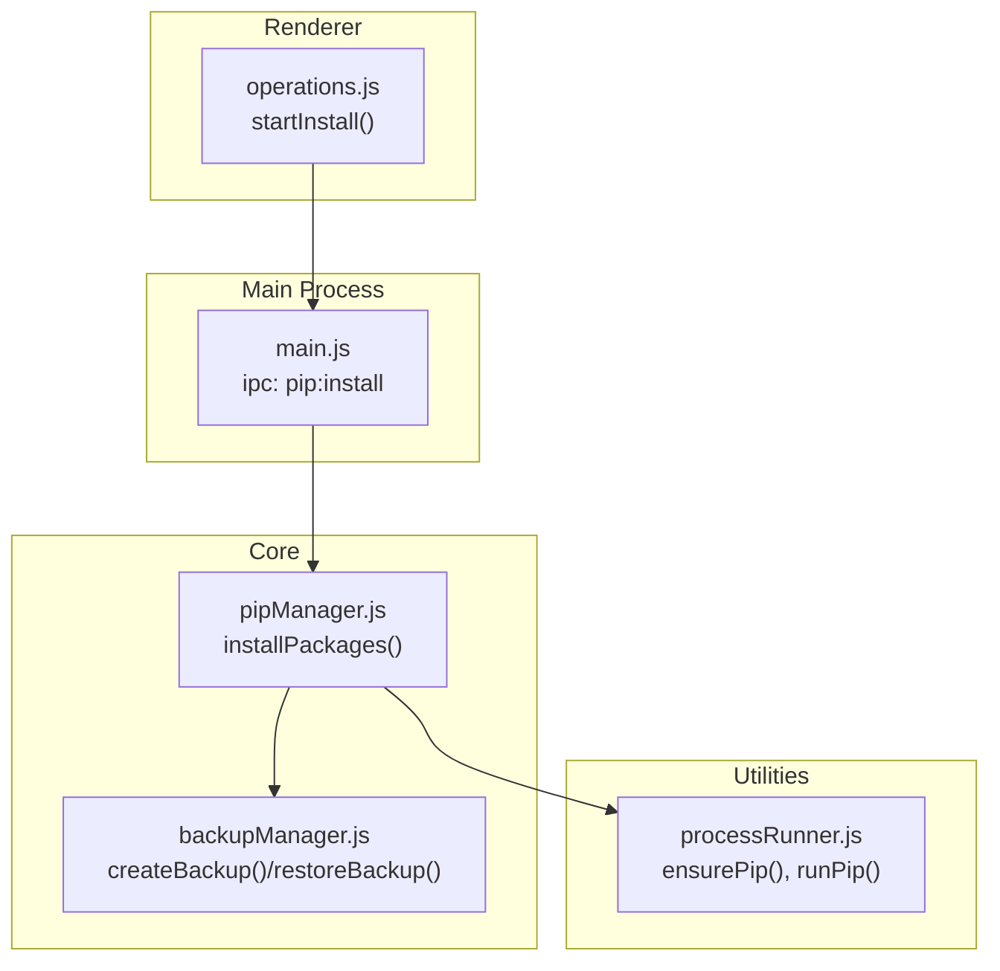
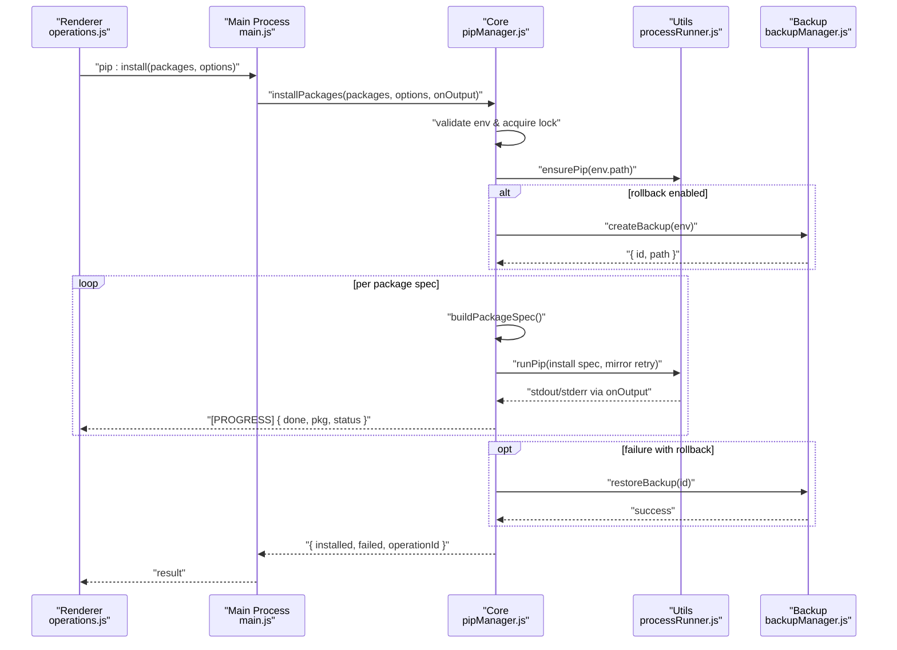
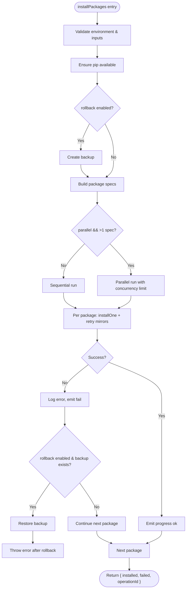
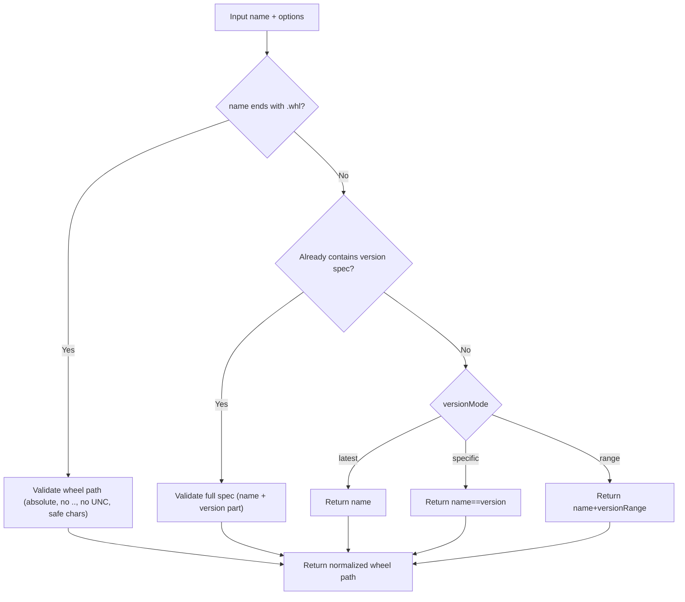
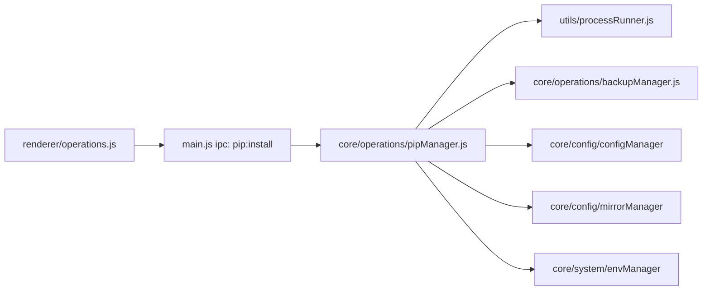

# Basic Package Installation

<cite>
**Referenced Files in This Document**
- [pipManager.js](file://core/operations/pipManager.js)
- [processRunner.js](file://utils/processRunner.js)
- [backupManager.js](file://core/operations/backupManager.js)
- [main.js](file://main.js)
- [operations.js](file://renderer/js/operations.js)
</cite>

## Table of Contents
1. [Introduction](#introduction)
2. [Project Structure](#project-structure)
3. [Core Components](#core-components)
4. [Architecture Overview](#architecture-overview)
5. [Detailed Component Analysis](#detailed-component-analysis)
6. [Dependency Analysis](#dependency-analysis)
7. [Performance Considerations](#performance-considerations)
8. [Troubleshooting Guide](#troubleshooting-guide)
9. [Conclusion](#conclusion)

## Introduction
This document explains the basic package installation functionality, focusing on the installPackages() function. It covers:
- Core parameters: packages array, options object (versionMode, parallel, retry, rollback), and onOutput callback
- Version specification modes: latest, specific, range with concrete examples
- Operation lifecycle: environment validation, pip initialization, backup creation, progress tracking, retries, and rollback
- Practical usage patterns for single and batch installations, and error handling
- Return value structure: installed, failed arrays and operationId for tracking

## Project Structure
The installation feature spans multiple layers:
- Renderer UI triggers installation via API calls
- Main process exposes IPC handlers that call core modules
- Core module orchestrates pip operations, backups, and progress reporting
- Utilities handle subprocess execution and pip availability

**Diagram sources**
- [operations.js:301-370](file://renderer/js/operations.js#L301-L370)
- [main.js:311-315](file://main.js#L311-L315)
- [pipManager.js:513-596](file://core/operations/pipManager.js#L513-L596)
- [backupManager.js:89-113](file://core/operations/backupManager.js#L89-L113)
- [processRunner.js:233-278](file://utils/processRunner.js#L233-L278)

**Section sources**
- [operations.js:301-370](file://renderer/js/operations.js#L301-L370)
- [main.js:311-315](file://main.js#L311-L315)
- [pipManager.js:513-596](file://core/operations/pipManager.js#L513-L596)
- [processRunner.js:233-278](file://utils/processRunner.js#L233-L278)
- [backupManager.js:89-113](file://core/operations/backupManager.js#L89-L113)

## Core Components
- installPackages(packages, options, onOutput): Orchestrates environment checks, pip initialization, optional backup, spec building, parallel or sequential installs, retries across mirrors, progress emission, logging, and rollback on failure.
- buildPackageSpec(name, options): Validates and builds pip-compatible spec strings for latest/specific/range modes and wheel files.
- ensurePip(): Ensures pip is available by auto-installing if missing.
- runPip(): Executes pip commands with timeout, cancellation, and output streaming.
- backupManager.createBackup()/restoreBackup(): Creates and restores environment snapshots to support rollback.

Key responsibilities:
- Environment validation and locking
- Pip readiness and initialization
- Spec construction and security validation
- Parallel vs sequential execution
- Mirror-based retries
- Progress events and structured logs
- Rollback on failure when enabled

**Section sources**
- [pipManager.js:513-596](file://core/operations/pipManager.js#L513-L596)
- [pipManager.js:154-235](file://core/operations/pipManager.js#L154-L235)
- [processRunner.js:233-278](file://utils/processRunner.js#L233-L278)
- [processRunner.js:340-342](file://utils/processRunner.js#L340-L342)
- [backupManager.js:89-113](file://core/operations/backupManager.js#L89-L113)
- [backupManager.js:156-170](file://core/operations/backupManager.js#L156-L170)

## Architecture Overview
The installation flow connects UI, IPC, core logic, and utilities.

**Diagram sources**
- [operations.js:301-370](file://renderer/js/operations.js#L301-L370)
- [main.js:311-315](file://main.js#L311-L315)
- [pipManager.js:513-596](file://core/operations/pipManager.js#L513-L596)
- [processRunner.js:233-278](file://utils/processRunner.js#L233-L278)
- [backupManager.js:89-113](file://core/operations/backupManager.js#L89-L113)

## Detailed Component Analysis

### installPackages() Function
Purpose:
- Validate environment and inputs
- Ensure pip is available
- Optionally create a backup for rollback
- Build pip specs from input packages and version mode
- Execute installs sequentially or in parallel
- Retry across configured mirrors
- Emit structured progress events
- Log outcomes and return results

Parameters:
- packages: string[] — list of package names or specs
- options: object
  - versionMode: 'latest' | 'specific' | 'range'
  - parallel: boolean — enable parallel installs
  - retry: boolean — enable multi-mirror retry
  - rollback: boolean — enable automatic rollback on failure
  - operationId: string — optional tracking ID
- onOutput: function(text, type) — stream stdout/stderr and progress

Return value:
- { installed: string[], failed: { spec, error }[], operationId: string }

Lifecycle highlights:
- Environment validation and lock acquisition
- ensurePip() initialization
- Optional backup creation
- Spec building with strict validation
- Parallel or sequential execution
- Multi-mirror retry per package
- Progress emission per package
- Logging and rollback on failure
- Lock release in finally block

**Diagram sources**
- [pipManager.js:513-596](file://core/operations/pipManager.js#L513-L596)
- [pipManager.js:608-633](file://core/operations/pipManager.js#L608-L633)
- [backupManager.js:89-113](file://core/operations/backupManager.js#L89-L113)
- [backupManager.js:156-170](file://core/operations/backupManager.js#L156-L170)

**Section sources**
- [pipManager.js:513-596](file://core/operations/pipManager.js#L513-L596)
- [pipManager.js:608-633](file://core/operations/pipManager.js#L608-L633)

### Version Specification Modes
buildPackageSpec supports three modes:
- latest: returns plain package name
- specific: returns package==version
- range: returns package>=min,<max style constraints

Examples:
- latest: "requests"
- specific: "flask==2.3.2"
- range: "numpy>=1.21,<2.0"

Security:
- Strict regex validation for package names and version specifiers
- Wheel file path validation prevents traversal and disallowed characters

**Diagram sources**
- [pipManager.js:154-235](file://core/operations/pipManager.js#L154-L235)

**Section sources**
- [pipManager.js:154-235](file://core/operations/pipManager.js#L154-L235)

### Progress Tracking and Callbacks
- onOutput receives stdout/stderr streams and structured progress events
- Progress event format: "[PROGRESS] { done: 1, pkg, status }" where status is 'ok' or 'fail'
- Renderer listens to these events to update UI counters and progress bars

Usage:
- Pass onOutput to installPackages; it forwards to runPip and emits per-package progress

**Section sources**
- [pipManager.js:513-596](file://core/operations/pipManager.js#L513-L596)
- [pipManager.js:60-63](file://core/operations/pipManager.js#L60-L63)
- [operations.js:301-370](file://renderer/js/operations.js#L301-L370)

### Error Handling Patterns
- Input validation errors thrown early (invalid package names, versions, paths)
- Network or pip failures captured per package; added to failed array
- If rollback is enabled and a failure occurs, restore backup and throw an error
- Errors include context (spec, mirror name, error message)

Practical tips:
- Always check result.failed to identify problematic packages
- Use operationId to correlate logs and cancel ongoing operations

**Section sources**
- [pipManager.js:513-596](file://core/operations/pipManager.js#L513-L596)
- [pipManager.js:608-633](file://core/operations/pipManager.js#L608-L633)

### Practical Code Examples

Single package installation:
- Call installPackages with a single-element array
- Set versionMode='specific', version='1.2.3' to pin a version
- Enable rollback=true to automatically revert on failure

Batch operations:
- Provide multiple package names or specs
- Enable parallel=true to speed up installs
- Use retry=true to try alternative mirrors on failure

Error handling pattern:
- Inspect result.installed and result.failed
- For each failed item, log spec and error.message
- Optionally trigger rollback manually if needed

Note: The above are usage patterns derived from the implementation and renderer integration.

**Section sources**
- [operations.js:301-370](file://renderer/js/operations.js#L301-L370)
- [pipManager.js:513-596](file://core/operations/pipManager.js#L513-L596)

## Dependency Analysis
Key dependencies and relationships:
- main.js IPC handler delegates to pipManager.installPackages
- pipManager depends on:
  - processRunner.ensurePip and runPip for subprocess management
  - backupManager for snapshot creation and restoration
  - configManager and mirrorManager for configuration and mirror selection
  - envManager for current environment detection
- Renderer operations.js constructs options and handles UI state

**Diagram sources**
- [operations.js:301-370](file://renderer/js/operations.js#L301-L370)
- [main.js:311-315](file://main.js#L311-L315)
- [pipManager.js:513-596](file://core/operations/pipManager.js#L513-L596)

**Section sources**
- [main.js:311-315](file://main.js#L311-L315)
- [pipManager.js:513-596](file://core/operations/pipManager.js#L513-L596)

## Performance Considerations
- Parallel installs: Controlled by config.parallelThreads; limits concurrent workers to avoid resource contention
- Mirror retries: Multiple mirrors per package improve success rate under network issues
- Pip readiness cache: Avoids repeated ensurePip checks within TTL
- Site-packages caching: Reduces overhead for size/time estimation
- Locking: Environment-level locks prevent concurrent conflicting operations

Recommendations:
- Use parallel=true for large batches when system resources allow
- Enable retry=true for unstable networks
- Keep rollback=false only when you can tolerate partial failures without automatic recovery

[No sources needed since this section provides general guidance]

## Troubleshooting Guide
Common issues and resolutions:
- No Python environment selected: Ensure a valid environment is active before calling installPackages
- pip not available: ensurePip will attempt auto-installation; if it fails, install pip manually
- Invalid package name or version specifier: Verify naming rules and version syntax
- Wheel path errors: Ensure absolute path, no traversal sequences, and allowed characters
- Network timeouts or mirror failures: Retry with different mirrors; verify connectivity
- Rollback triggered: Check logs for the failing spec and restore reason

Debugging steps:
- Inspect onOutput messages for detailed stderr and progress events
- Review operationId in logs to correlate events
- Use cancelPipOperation(operationId) to stop long-running installs

**Section sources**
- [pipManager.js:513-596](file://core/operations/pipManager.js#L513-L596)
- [processRunner.js:233-278](file://utils/processRunner.js#L233-L278)
- [backupManager.js:89-113](file://core/operations/backupManager.js#L89-L113)

## Conclusion
The installPackages() function provides a robust, secure, and user-friendly mechanism for installing Python packages. It supports flexible version specifications, resilient installation through mirror retries, and safety via backups and rollback. With structured progress callbacks and clear return values, it integrates seamlessly into both CLI-like workflows and GUI-driven applications.

[No sources needed since this section summarizes without analyzing specific files]