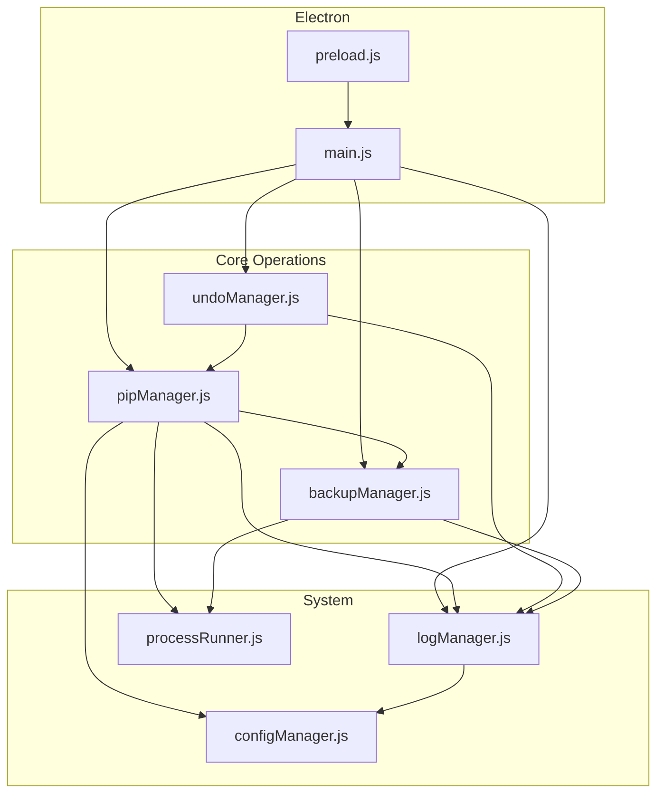
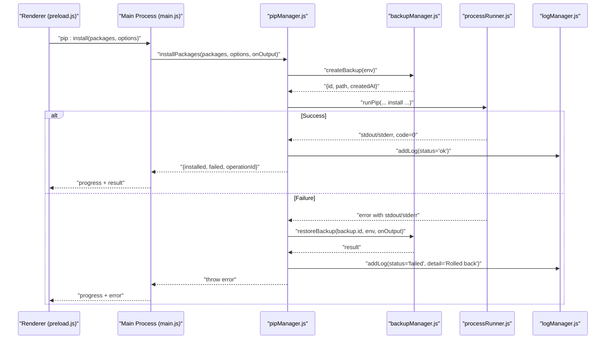
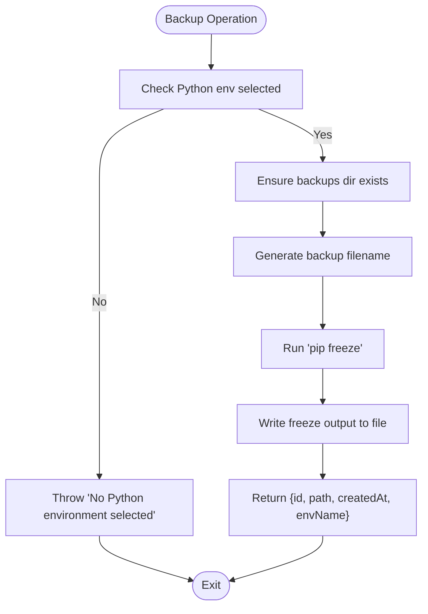
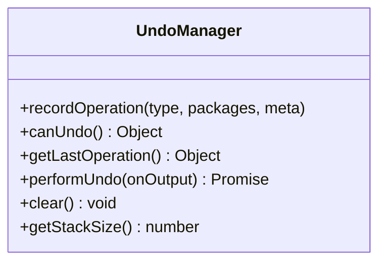
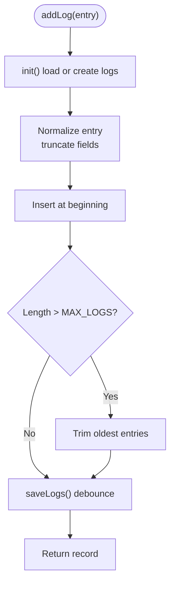
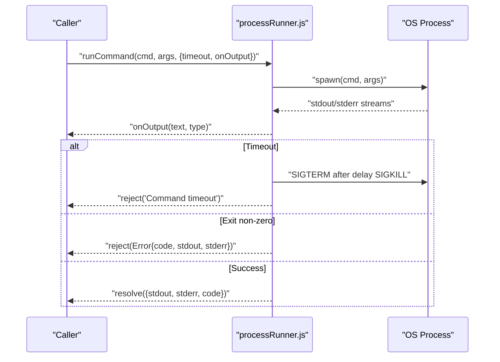
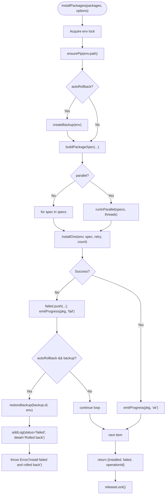
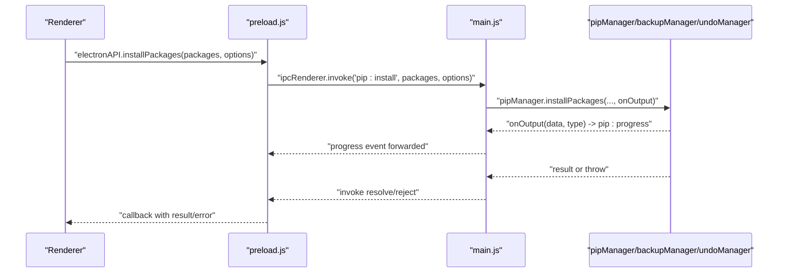
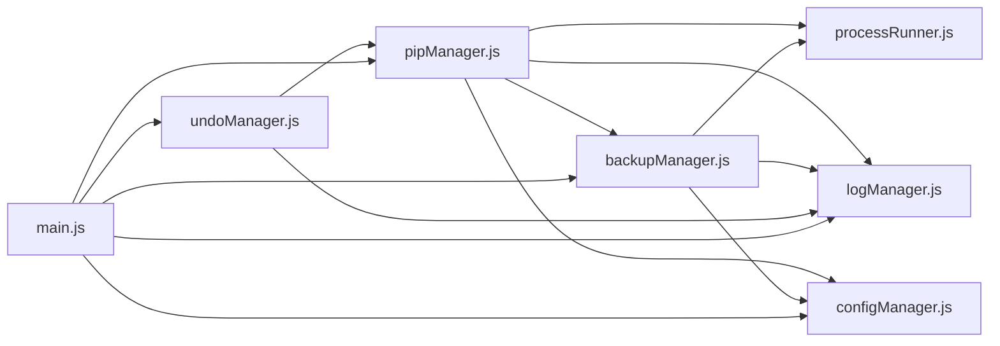

# Error Handling and Rollback

<cite>
**Referenced Files in This Document**
- [main.js](file://main.js)
- [preload.js](file://preload.js)
- [core/operations/pipManager.js](file://core/operations/pipManager.js)
- [core/operations/backupManager.js](file://core/operations/backupManager.js)
- [core/operations/undoManager.js](file://core/operations/undoManager.js)
- [core/system/logManager.js](file://core/system/logManager.js)
- [utils/processRunner.js](file://utils/processRunner.js)
- [core/config/configManager.js](file://core/config/configManager.js)
</cite>

## Table of Contents
1. Introduction
2. Project Structure
3. Core Components
4. Architecture Overview
5. Detailed Component Analysis
6. Dependency Analysis
7. Performance Considerations
8. Troubleshooting Guide
9. Conclusion

## Introduction
This document explains the error handling and automatic rollback mechanisms implemented across the application. It focuses on how backups are created before operations, how restoration is performed on failure, and how cleanup is handled. It also covers error categorization, exception handling patterns, logging, and the interaction between installation failures and backup restoration, including partial failure scenarios and manual intervention requirements. Finally, it provides guidance for implementing custom error handlers, monitoring rollback operations, and debugging installation failures with detailed messages and stack traces.

## Project Structure
The error handling and rollback system spans several modules:
- pipManager orchestrates package operations and triggers backup/rollback flows
- backupManager creates and restores environment snapshots using pip freeze and reinstall
- undoManager records operation history and supports user-triggered reversals
- logManager persists structured logs with capacity control and search
- processRunner manages subprocess execution, timeouts, cancellation, and pip bootstrapping
- main.js wires IPC handlers that expose these capabilities to the UI
- preload.js exposes safe APIs to the renderer process
- configManager centralizes configuration used by all components (e.g., parallel threads, retry counts)

**Diagram sources**
- [main.js](file://main.js)
- [preload.js](file://preload.js)
- [core/operations/pipManager.js](file://core/operations/pipManager.js)
- [core/operations/backupManager.js](file://core/operations/backupManager.js)
- [core/operations/undoManager.js](file://core/operations/undoManager.js)
- [core/system/logManager.js](file://core/system/logManager.js)
- [utils/processRunner.js](file://utils/processRunner.js)
- [core/config/configManager.js](file://core/config/configManager.js)

**Section sources**
- [main.js](file://main.js)
- [preload.js](file://preload.js)
- [core/operations/pipManager.js](file://core/operations/pipManager.js)
- [core/operations/backupManager.js](file://core/operations/backupManager.js)
- [core/operations/undoManager.js](file://core/operations/undoManager.js)
- [core/system/logManager.js](file://core/system/logManager.js)
- [utils/processRunner.js](file://utils/processRunner.js)
- [core/config/configManager.js](file://core/config/configManager.js)

## Core Components
- pipManager: Central orchestrator for install/uninstall/update operations; implements automatic rollback via backupManager when enabled; tracks progress and errors; enforces environment locks and input validation.
- backupManager: Creates backups using pip freeze; restores environments using pip install -r with force-reinstall; validates backup IDs to prevent path traversal; lists and deletes backups.
- undoManager: Maintains an in-memory stack of recent operations; supports reversing installs, uninstalls, and updates; integrates with pipManager to perform inverse actions.
- logManager: Structured JSON logging with field truncation, debounced persistence, and query filters; flushed on shutdown to avoid data loss.
- processRunner: Subprocess runner with timeout, ANSI stripping, UTF-8 encoding, active process tracking, and pip auto-installation strategies.
- main.js: IPC handlers exposing all operations to the UI; forwards progress events; coordinates lifecycle and cleanup.
- preload.js: Secure bridge exposing only necessary APIs to the renderer process.
- configManager: Centralized configuration with sanitization and atomic writes; provides storage paths used by backup and log managers.

**Section sources**
- [core/operations/pipManager.js](file://core/operations/pipManager.js)
- [core/operations/backupManager.js](file://core/operations/backupManager.js)
- [core/operations/undoManager.js](file://core/operations/undoManager.js)
- [core/system/logManager.js](file://core/system/logManager.js)
- [utils/processRunner.js](file://utils/processRunner.js)
- [main.js](file://main.js)
- [preload.js](file://preload.js)
- [core/config/configManager.js](file://core/config/configManager.js)

## Architecture Overview
The rollback architecture follows a consistent pattern:
- Before risky operations (install, uninstall, update), create a backup snapshot of the current environment state.
- Execute the operation with robust error handling, retries, and cancellations.
- On failure, restore from the backup automatically if rollback is enabled.
- Persist structured logs for every action and outcome.
- Provide user-triggered undo for recent operations.

**Diagram sources**
- [main.js](file://main.js)
- [core/operations/pipManager.js](file://core/operations/pipManager.js)
- [core/operations/backupManager.js](file://core/operations/backupManager.js)
- [utils/processRunner.js](file://utils/processRunner.js)
- [core/system/logManager.js](file://core/system/logManager.js)

## Detailed Component Analysis

### Backup Manager
Responsibilities:
- Create a snapshot of installed packages using pip freeze into a timestamped file under a secure backups directory.
- Restore environment by reinstalling exact versions using pip install -r with force-reinstall and no-deps.
- Validate backup IDs to prevent path traversal attacks.
- List and delete backups safely.

Key behaviors:
- getBackupDir ensures the backups directory exists under the configured storage path.
- getBackupFileName generates deterministic filenames based on environment name and ISO timestamp.
- validateBackupId enforces format and length constraints and rejects path traversal attempts.
- createBackup executes pip freeze and writes output to a .txt file; logs failures and throws descriptive errors.
- restoreBackup reads the backup file and runs pip install -r with appropriate flags; supports progress callbacks.
- listBackups returns metadata sorted by creation time; handles missing directories gracefully.
- deleteBackup removes a validated backup file; logs and throws on failure.

**Diagram sources**
- [core/operations/backupManager.js](file://core/operations/backupManager.js)

**Section sources**
- [core/operations/backupManager.js](file://core/operations/backupManager.js)

### Undo Manager
Responsibilities:
- Record recent operations (install, uninstall, update) with package details and metadata.
- Provide canUndo status and last action preview.
- Perform inverse operations by invoking pipManager with appropriate flags.
- Maintain a bounded stack (max 20 entries).

Key behaviors:
- recordOperation pushes a new entry and trims older entries beyond MAX_UNDO_STACK.
- canUndo returns availability and a human-readable description of the last action.
- performUndo pops the last operation and executes the inverse action:
  - Install → Uninstall those packages
  - Uninstall → Reinstall with original versions
  - Update → Reinstall old versions from meta.oldVersions
- Logs undo outcomes and re-pushes the operation onto the stack if undo itself fails.

**Diagram sources**
- [core/operations/undoManager.js](file://core/operations/undoManager.js)

**Section sources**
- [core/operations/undoManager.js](file://core/operations/undoManager.js)

### Log Manager
Responsibilities:
- Persist structured logs to a JSON file with capacity limits and field truncation.
- Debounce writes to reduce I/O overhead; flush on shutdown to ensure durability.
- Support filtering by type and keyword search across action/detail fields.

Key behaviors:
- addLog normalizes inputs, truncates long fields, inserts newest first, and saves asynchronously.
- saveLogs uses a timer to batch writes; flushLogs forces immediate write on exit.
- getLogs applies filters and searches safely within bounds.
- clearLogs resets in-memory logs and persists empty state.

**Diagram sources**
- [core/system/logManager.js](file://core/system/logManager.js)

**Section sources**
- [core/system/logManager.js](file://core/system/logManager.js)

### Process Runner
Responsibilities:
- Execute commands with UTF-8 encoding, ANSI stripping, timeouts, and cancellation support.
- Track active processes and cancel by operationId.
- Ensure pip availability via ensurepip or downloading get-pip.py.

Key behaviors:
- runCommand spawns child processes, captures stdout/stderr, and resolves/rejects with structured errors.
- cancelProcess and cancelOperation terminate running processes; cancelAllProcesses cleans up on shutdown.
- ensurePip checks cache, verifies availability, tries ensurepip, then downloads get-pip.py; caches readiness.
- runPip and runPython provide convenience wrappers.

**Diagram sources**
- [utils/processRunner.js](file://utils/processRunner.js)

**Section sources**
- [utils/processRunner.js](file://utils/processRunner.js)

### Pip Manager
Responsibilities:
- Orchestrate install/uninstall/update operations with safety checks, retries, and automatic rollback.
- Enforce environment-level locks to avoid concurrent conflicts.
- Emit structured progress events and persist logs.

Key behaviors:
- installPackages:
  - Acquires environment lock.
  - Optionally creates backup if rollback is enabled.
  - Builds specs with version modes and validates inputs.
  - Executes installOne with mirror retries; emits per-package progress.
  - On failure, restores backup and logs rollback; throws descriptive error.
- installFromFile:
  - Supports .whl and .txt files; creates backup when rollback enabled; restores on failure.
- uninstallPackages:
  - Validates package names; creates backup when requested or rollback enabled; restores on failure.
- updatePackages:
  - Similar flow to install; detects “Requirement already satisfied” to avoid false positives; restores on failure.
- repairPip:
  - Attempts ensurepip first, then falls back to get-pip.py; logs method and version.
- Utilities:
  - buildPackageSpec validates names and versions; supports wheel paths with strict security checks.
  - runInParallel controls concurrency for bulk operations.
  - checkConflicts and healthCheck diagnose environment issues.

**Diagram sources**
- [core/operations/pipManager.js](file://core/operations/pipManager.js)
- [core/operations/backupManager.js](file://core/operations/backupManager.js)
- [utils/processRunner.js](file://utils/processRunner.js)

**Section sources**
- [core/operations/pipManager.js](file://core/operations/pipManager.js)

### IPC and Renderer Integration
Responsibilities:
- Expose safe APIs to the renderer via preload.js contextBridge.
- Wire IPC handlers in main.js to call core modules and forward progress events.

Key behaviors:
- preload.js exposes methods like installPackages, uninstallPackages, updatePackages, createBackup, restoreBackup, and undo operations.
- main.js registers ipcMain.handle for each operation, forwarding onOutput callbacks to send pip:progress events to the renderer.
- Lifecycle hooks cancel active processes on shutdown and flush logs to disk.

**Diagram sources**
- [preload.js](file://preload.js)
- [main.js](file://main.js)
- [core/operations/pipManager.js](file://core/operations/pipManager.js)

**Section sources**
- [preload.js](file://preload.js)
- [main.js](file://main.js)

## Dependency Analysis
- pipManager depends on backupManager for snapshots, processRunner for command execution, logManager for persistence, and configManager for settings.
- backupManager depends on configManager for storage paths, logManager for logging, and processRunner for pip freeze/install.
- undoManager depends on pipManager to execute inverse operations and logManager for audit trails.
- main.js depends on all core modules to expose functionality via IPC.
- processRunner is foundational and used by pipManager and backupManager.

**Diagram sources**
- [core/operations/pipManager.js](file://core/operations/pipManager.js)
- [core/operations/backupManager.js](file://core/operations/backupManager.js)
- [core/operations/undoManager.js](file://core/operations/undoManager.js)
- [core/system/logManager.js](file://core/system/logManager.js)
- [utils/processRunner.js](file://utils/processRunner.js)
- [core/config/configManager.js](file://core/config/configManager.js)
- [main.js](file://main.js)

**Section sources**
- [core/operations/pipManager.js](file://core/operations/pipManager.js)
- [core/operations/backupManager.js](file://core/operations/backupManager.js)
- [core/operations/undoManager.js](file://core/operations/undoManager.js)
- [core/system/logManager.js](file://core/system/logManager.js)
- [utils/processRunner.js](file://utils/processRunner.js)
- [core/config/configManager.js](file://core/config/configManager.js)
- [main.js](file://main.js)

## Performance Considerations
- Environment locks prevent concurrent operations on the same Python environment, avoiding race conditions and corruption.
- Debounced log writes reduce frequent disk I/O; flushLogs ensures data integrity on shutdown.
- Parallel execution is configurable via parallelThreads; balance throughput with resource constraints.
- Retry logic and multi-mirror fallback improve resilience against transient network issues.
- Cache TTLs for site-packages paths and pip readiness minimize repeated detection overhead.

[No sources needed since this section provides general guidance]

## Troubleshooting Guide
Common issues and resolutions:
- No Python environment selected: Ensure a valid environment is set before operations.
- Backup not found: Verify backup ID format and existence; use listBackups to inspect available snapshots.
- Path traversal detected: Input validation prevents unsafe backup IDs; sanitize user inputs.
- Command timeout: Increase timeout or investigate slow mirrors; use cancelOperation to stop hanging processes.
- pip not available: rely on ensurePip to auto-install; if failing, manually install pip or check network access.
- Partial failures during parallel installs: Review failed list and rerun problematic packages; rollback restores environment if enabled.
- Undo failed: The operation is re-pushed onto the stack; retry undo or manually restore from backup.

Debugging tips:
- Use logManager.getLogs with filters to find failed operations and their details.
- Monitor pip:progress events in the renderer to track real-time status and errors.
- Inspect stdout/stderr captured by processRunner for detailed error messages.
- Use healthCheck and checkConflicts to diagnose environment issues.

Manual intervention scenarios:
- If rollback fails due to corrupted backup, recreate a fresh backup and retry.
- For persistent network issues, configure mirrors or download packages offline using downloadPackages.
- When pip is broken, use repairPip to restore functionality.

**Section sources**
- [core/operations/backupManager.js](file://core/operations/backupManager.js)
- [core/operations/pipManager.js](file://core/operations/pipManager.js)
- [core/system/logManager.js](file://core/system/logManager.js)
- [utils/processRunner.js](file://utils/processRunner.js)

## Conclusion
The application implements a robust error handling and rollback system centered around pip operations. Backups are created prior to changes, and automatic restoration occurs on failure, ensuring environment stability. Comprehensive logging, input validation, and process management contribute to reliability and observability. Users can leverage undo functionality for recent actions and monitor progress through structured events. With careful configuration and troubleshooting, the system provides a resilient workflow for managing Python environments.

[No sources needed since this section summarizes without analyzing specific files]