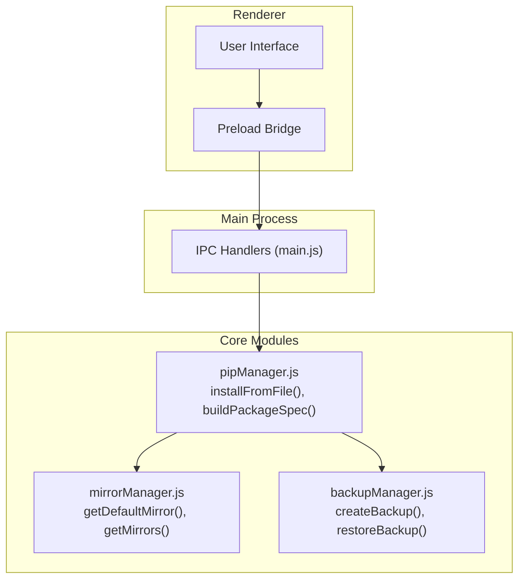
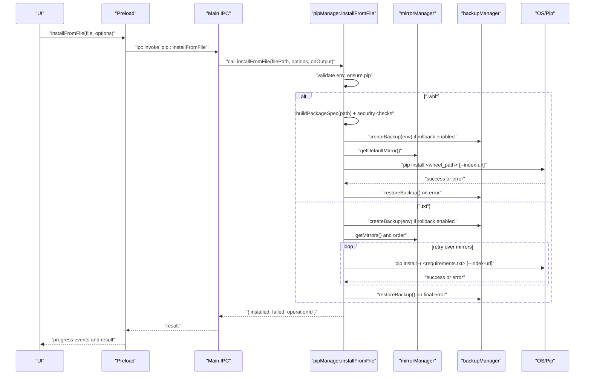
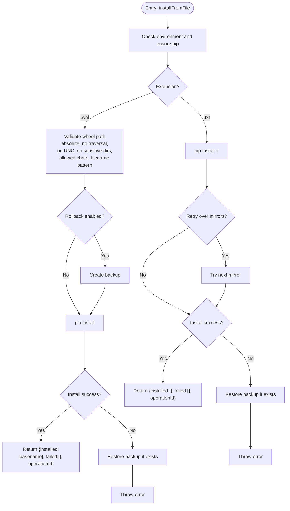
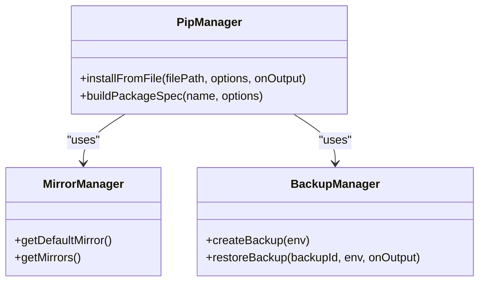
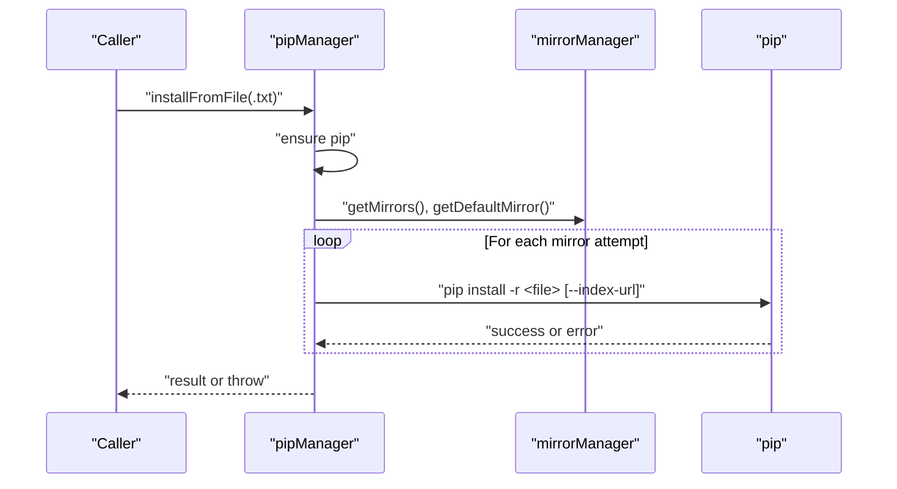
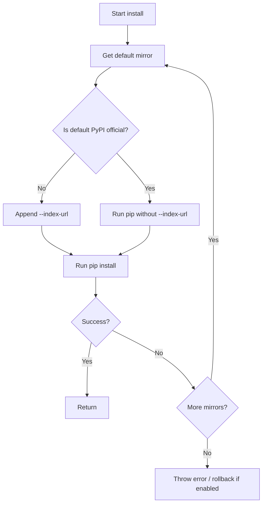
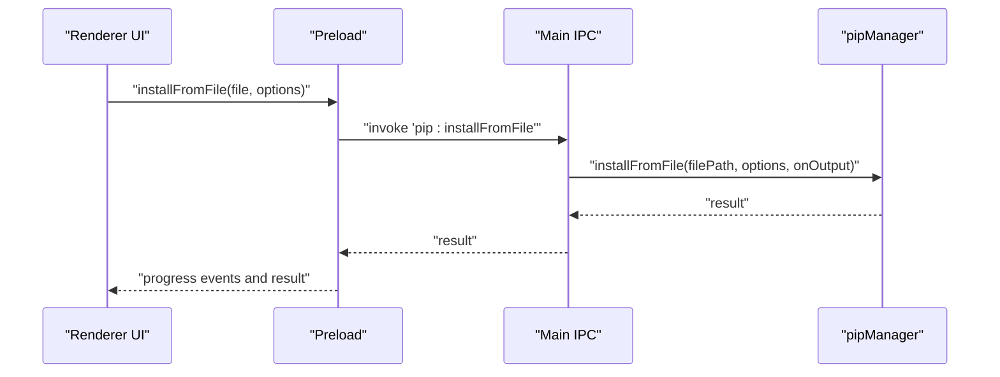
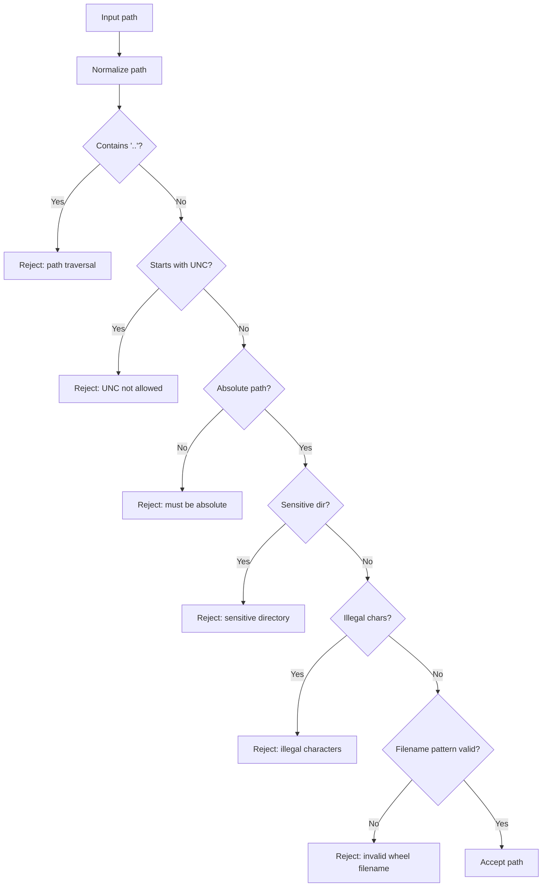
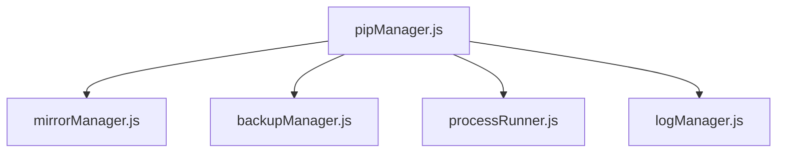

# File-Based Package Installation

<cite>
**Referenced Files in This Document**
- [pipManager.js](file://core/operations/pipManager.js)
- [mirrorManager.js](file://core/config/mirrorManager.js)
- [backupManager.js](file://core/operations/backupManager.js)
- [security.js](file://utils/security.js)
- [main.js](file://main.js)
- [preload.js](file://preload.js)
</cite>

## Table of Contents
1. [Introduction](#introduction)
2. [Project Structure](#project-structure)
3. [Core Components](#core-components)
4. [Architecture Overview](#architecture-overview)
5. [Detailed Component Analysis](#detailed-component-analysis)
6. [Dependency Analysis](#dependency-analysis)
7. [Performance Considerations](#performance-considerations)
8. [Troubleshooting Guide](#troubleshooting-guide)
9. [Conclusion](#conclusion)

## Introduction
This document explains the file-based package installation functionality, focusing on the installFromFile() function that supports:
- Installing .whl wheel files directly
- Installing packages from requirements.txt files

It covers path validation and security checks for wheel files, direct pip installation flows, requirements.txt processing via pip, mirror source integration, error handling, rollback behavior, and best practices.

## Project Structure
The file-based installation feature is implemented primarily in the pip manager module, with support from mirror management, backup/rollback utilities, and IPC wiring to the renderer process.

**Diagram sources**
- [main.js:317-322](file://main.js#L317-L322)
- [pipManager.js:645-730](file://pipManager.js#L645-L730)
- [mirrorManager.js:114-118](file://mirrorManager.js#L114-L118)
- [backupManager.js:89-113](file://backupManager.js#L89-L113)

**Section sources**
- [main.js:317-322](file://main.js#L317-L322)
- [pipManager.js:645-730](file://pipManager.js#L645-L730)
- [mirrorManager.js:114-118](file://mirrorManager.js#L114-L118)
- [backupManager.js:89-113](file://backupManager.js#L89-L113)

## Core Components
- installFromFile(filePath, options, onOutput): Entry point for installing from a .whl or .txt file. It validates the environment, ensures pip availability, branches by extension, performs security checks for wheel paths, optionally creates backups, runs pip install, and handles rollback on failure.
- buildPackageSpec(name, options): Validates and builds pip spec strings; includes strict security checks for wheel paths (absolute, no traversal, no UNC, no sensitive directories, allowed characters, filename pattern).
- Mirror integration: Uses default and configured mirrors to retry installations when needed.
- Backup and rollback: Creates a snapshot before risky operations and restores it on failure.

Key responsibilities and behaviors are implemented in pipManager.js, with supporting logic in mirrorManager.js and backupManager.js.

**Section sources**
- [pipManager.js:154-235](file://pipManager.js#L154-L235)
- [pipManager.js:645-730](file://pipManager.js#L645-L730)
- [mirrorManager.js:114-118](file://mirrorManager.js#L114-L118)
- [backupManager.js:89-113](file://backupManager.js#L89-L113)

## Architecture Overview
The flow for file-based installation integrates IPC, pip execution, mirror selection, and backup/rollback.

**Diagram sources**
- [main.js:317-322](file://main.js#L317-L322)
- [pipManager.js:645-730](file://pipManager.js#L645-L730)
- [mirrorManager.js:114-118](file://mirrorManager.js#L114-L118)
- [backupManager.js:89-113](file://backupManager.js#L89-L113)

## Detailed Component Analysis

### installFromFile() Workflow
- Environment and pip readiness: Ensures a Python environment is selected and pip is available.
- Extension branching:
  - .whl: Direct wheel installation with strict path validation and optional backup/rollback.
  - .txt: Batch installation using pip -r with mirror retries and optional backup/rollback.
- Progress and logging: Emits structured progress events and logs actions.
- Error handling: On failure, attempts rollback if enabled; otherwise throws an error.

**Diagram sources**
- [pipManager.js:645-730](file://pipManager.js#L645-L730)

**Section sources**
- [pipManager.js:645-730](file://pipManager.js#L645-L730)

### Wheel File Installation and Security Checks
- Path validation rules enforced by buildPackageSpec():
  - Rejects relative components like ".."
  - Requires absolute paths
  - Disallows UNC paths
  - Blocks sensitive directories
  - Blocks illegal characters
  - Validates filename pattern for .whl
- Direct pip invocation:
  - Uses pip install with the validated absolute wheel path
  - Applies index-url only when non-default mirror is configured
- Optional backup and rollback:
  - Creates a snapshot before installation
  - Restores on failure

**Diagram sources**
- [pipManager.js:154-235](file://pipManager.js#L154-L235)
- [pipManager.js:645-730](file://pipManager.js#L645-L730)
- [mirrorManager.js:114-118](file://mirrorManager.js#L114-L118)
- [backupManager.js:89-113](file://backupManager.js#L89-L113)

**Section sources**
- [pipManager.js:154-235](file://pipManager.js#L154-L235)
- [pipManager.js:645-730](file://pipManager.js#L645-L730)

### Requirements.txt Processing
- Handled via pip install -r with the provided file path.
- Supports standard version specifiers recognized by pip (e.g., ==, >=, <=, ~=, !=, etc.).
- Batch installation capability: pip processes all entries in the file.
- Mirror retry strategy:
  - Attempts installation across multiple mirrors based on configuration.
  - Logs warnings per mirror failure and continues until success or exhaustion.
- Optional backup and rollback:
  - Snapshot created before installation; restored on final failure.

**Diagram sources**
- [pipManager.js:645-730](file://pipManager.js#L645-L730)
- [mirrorManager.js:114-118](file://mirrorManager.js#L114-L118)

**Section sources**
- [pipManager.js:645-730](file://pipManager.js#L645-L730)

### Integration with Mirror Sources
- Default mirror selection:
  - If the default mirror is not PyPI official, --index-url is appended to pip commands.
- Retry over mirrors:
  - For .txt installs, iterates through ordered mirrors (default first, then others).
- Configuration persistence:
  - Mirror settings can be written to pip config files for global effect.

**Diagram sources**
- [pipManager.js:645-730](file://pipManager.js#L645-L730)
- [mirrorManager.js:114-118](file://mirrorManager.js#L114-L118)

**Section sources**
- [pipManager.js:645-730](file://pipManager.js#L645-L730)
- [mirrorManager.js:114-118](file://mirrorManager.js#L114-L118)

### IPC Wiring and Usage
- Renderer calls preload bridge which invokes main process IPC handler.
- Main process delegates to pipManager.installFromFile with progress callback.

**Diagram sources**
- [main.js:317-322](file://main.js#L317-L322)
- [preload.js:60](file://preload.js#L60)
- [pipManager.js:645-730](file://pipManager.js#L645-L730)

**Section sources**
- [main.js:317-322](file://main.js#L317-L322)
- [preload.js:60](file://preload.js#L60)

### Security Validations
- Wheel path security:
  - Absolute path required
  - No ".." components
  - No UNC paths
  - Sensitive directory blocking
  - Illegal character filtering
  - Filename pattern enforcement
- General path safety utility:
  - isAllowedOpenPath enforces allowlist directories for opening files externally.

**Diagram sources**
- [pipManager.js:154-235](file://pipManager.js#L154-L235)
- [security.js:28-40](file://security.js#L28-L40)

**Section sources**
- [pipManager.js:154-235](file://pipManager.js#L154-L235)
- [security.js:28-40](file://security.js#L28-L40)

### Examples and Use Cases
- Installing a wheel file:
  - Provide an absolute path to a .whl file.
  - Ensure the path passes validation checks.
  - The function will create a backup if rollback is enabled, run pip install, and return results.
- Installing from requirements.txt:
  - Provide a path to a .txt file containing package specifications.
  - pip processes the file with -r; version specifiers supported by pip are accepted.
  - The function may retry across mirrors and perform rollback on failure.
- Unsupported file types:
  - Passing a file with an unsupported extension results in an error indicating only .txt or .whl are supported.

Note: These examples describe behavior and outcomes rather than code content. Refer to the section sources for implementation details.

**Section sources**
- [pipManager.js:645-730](file://pipManager.js#L645-L730)

## Dependency Analysis
- pipManager depends on:
  - mirrorManager for mirror selection and ordering
  - backupManager for creating/restoring snapshots
  - processRunner for executing pip commands
  - logManager for audit trails
- mirrorManager provides:
  - Default mirror retrieval
  - Mirror list and ordering
  - Writing pip config
- backupManager provides:
  - Snapshot creation via pip freeze
  - Restore via pip install -r with force-reinstall and no-deps

**Diagram sources**
- [pipManager.js:645-730](file://pipManager.js#L645-L730)
- [mirrorManager.js:114-118](file://mirrorManager.js#L114-L118)
- [backupManager.js:89-113](file://backupManager.js#L89-L113)

**Section sources**
- [pipManager.js:645-730](file://pipManager.js#L645-L730)
- [mirrorManager.js:114-118](file://mirrorManager.js#L114-L118)
- [backupManager.js:89-113](file://backupManager.js#L89-L113)

## Performance Considerations
- Parallelism:
  - Not used in installFromFile; single-file operations are sequential.
- Caching:
  - site-packages path caching reduces repeated discovery overhead.
- Retry strategy:
  - Limited number of mirror attempts avoids excessive network calls.
- Backup/rollback:
  - Snapshot creation adds overhead but ensures recoverability.

[No sources needed since this section provides general guidance]

## Troubleshooting Guide
Common issues and resolutions:
- Unsupported file type:
  - Only .whl and .txt are supported; verify the file extension.
- Invalid wheel path:
  - Ensure the path is absolute, does not contain "..", is not UNC, avoids sensitive directories, contains allowed characters, and matches the wheel filename pattern.
- Mirror failures:
  - Check mirror configuration and connectivity; the system retries across configured mirrors.
- Rollback triggered:
  - Indicates installation failed; inspect logs and errors, then retry after fixing the underlying issue.

**Section sources**
- [pipManager.js:645-730](file://pipManager.js#L645-L730)
- [pipManager.js:154-235](file://pipManager.js#L154-L235)

## Conclusion
The installFromFile() function provides a secure and robust mechanism for installing Python packages from local wheel files and requirements.txt files. It enforces strict path validation, leverages mirror sources for reliability, and offers backup/rollback to protect environments. By integrating with IPC and progress callbacks, it delivers a seamless user experience while maintaining strong security and operational safeguards.