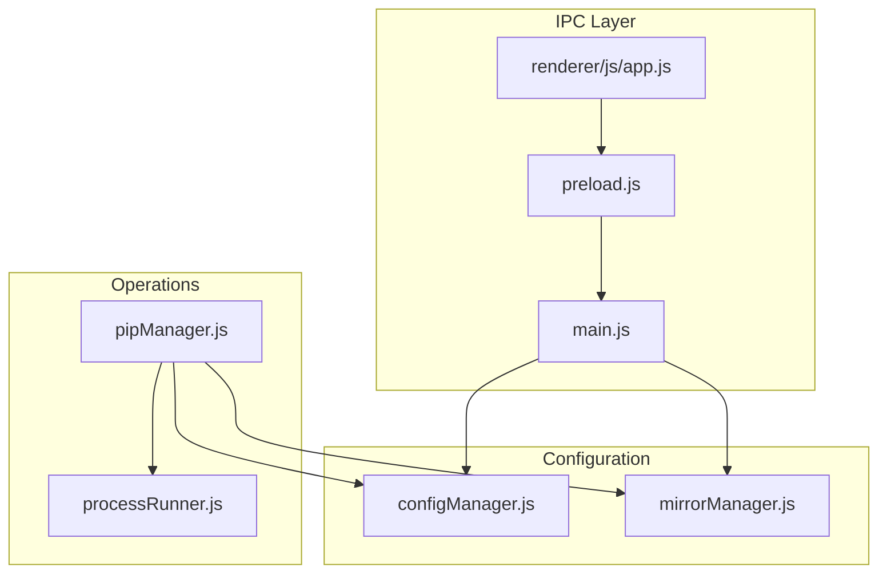
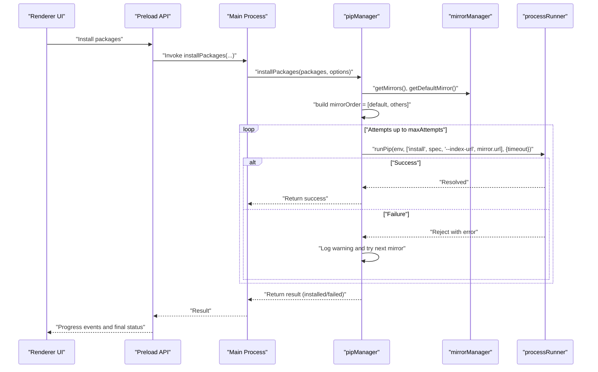
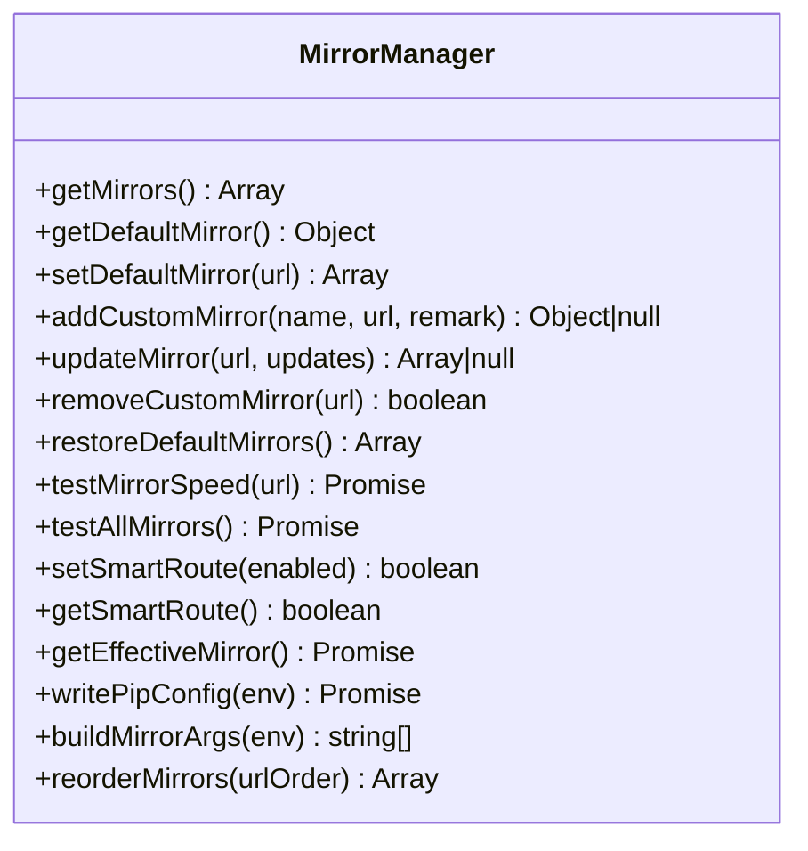
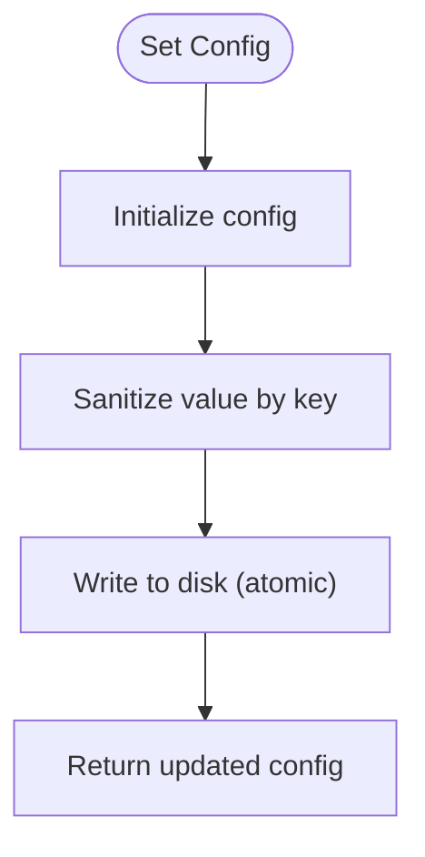
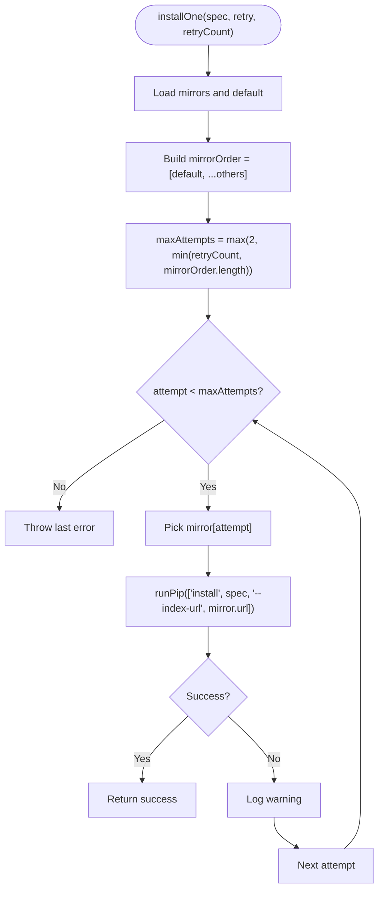
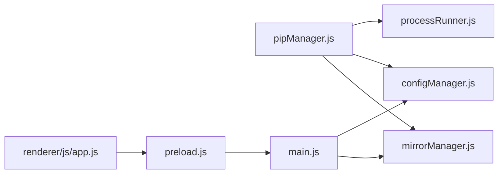

# Mirror Source Configuration

<cite>
**Referenced Files in This Document**
- [mirrorManager.js](file://core/config/mirrorManager.js)
- [configManager.js](file://core/config/configManager.js)
- [pipManager.js](file://core/operations/pipManager.js)
- [processRunner.js](file://utils/processRunner.js)
- [main.js](file://main.js)
- [preload.js](file://preload.js)
- [app.js](file://renderer/js/app.js)
</cite>

## Table of Contents
1. [Introduction](#introduction)
2. [Project Structure](#project-structure)
3. [Core Components](#core-components)
4. [Architecture Overview](#architecture-overview)
5. [Detailed Component Analysis](#detailed-component-analysis)
6. [Dependency Analysis](#dependency-analysis)
7. [Performance Considerations](#performance-considerations)
8. [Troubleshooting Guide](#troubleshooting-guide)
9. [Conclusion](#conclusion)

## Introduction
This document explains how the system configures and manages PyPI mirror sources, and how it automatically rotates through multiple mirrors when installations fail. It covers:
- Default PyPI mirror and built-in/custom mirror management
- Intelligent retry with configurable retryCount
- Smart route selection (fastest mirror)
- Integration with pip configuration and command-line arguments
- Speed testing for mirrors
- Practical examples for configuring multiple mirrors, handling network failures, optimizing download speeds, and troubleshooting connectivity issues

## Project Structure
The mirror functionality spans several modules:
- Mirror source definitions and management live in a dedicated manager
- Application configuration is centralized and persisted
- Package operations integrate mirror rotation and retries
- Process runner handles subprocess execution and timeouts
- IPC bridges connect renderer UI to main process handlers

**Diagram sources**
- [mirrorManager.js:1-376](file://core/config/mirrorManager.js#L1-L376)
- [configManager.js:1-194](file://core/config/configManager.js#L1-L194)
- [pipManager.js:1-800](file://core/operations/pipManager.js#L1-L800)
- [processRunner.js:1-366](file://utils/processRunner.js#L1-L366)
- [main.js:380-396](file://main.js#L380-L396)
- [preload.js:75-86](file://preload.js#L75-L86)
- [app.js:70-80](file://renderer/js/app.js#L70-L80)

**Section sources**
- [mirrorManager.js:1-376](file://core/config/mirrorManager.js#L1-L376)
- [configManager.js:1-194](file://core/config/configManager.js#L1-L194)
- [pipManager.js:1-800](file://core/operations/pipManager.js#L1-L800)
- [processRunner.js:1-366](file://utils/processRunner.js#L1-L366)
- [main.js:380-396](file://main.js#L380-L396)
- [preload.js:75-86](file://preload.js#L75-L86)
- [app.js:70-80](file://renderer/js/app.js#L70-L80)

## Core Components
- Mirror Manager: Maintains built-in and custom mirrors, validates URLs, persists settings, measures speed, selects effective mirror (default or fastest), writes pip config, and builds CLI args.
- Config Manager: Persists application settings including parallelThreads and retryCount; sanitizes values within defined ranges.
- Pip Manager: Orchestrates package install/update/uninstall with mirror rotation and intelligent retries based on configured retryCount.
- Process Runner: Executes pip commands with timeouts, cancellation, and output streaming.
- IPC Bridge: Exposes mirror operations to the renderer via Electron IPC.

Key responsibilities:
- Built-in mirrors include official PyPI and several popular Chinese mirrors.
- Custom mirrors can be added, updated, reordered, and removed.
- Smart route toggles automatic selection of the fastest mirror.
- Install/update flows rotate through mirrors and retry up to configured attempts.

**Section sources**
- [mirrorManager.js:21-30](file://core/config/mirrorManager.js#L21-L30)
- [mirrorManager.js:43-51](file://core/config/mirrorManager.js#L43-L51)
- [mirrorManager.js:60-91](file://core/config/mirrorManager.js#L60-L91)
- [mirrorManager.js:219-247](file://core/config/mirrorManager.js#L219-L247)
- [mirrorManager.js:267-290](file://core/config/mirrorManager.js#L267-L290)
- [mirrorManager.js:299-333](file://core/config/mirrorManager.js#L299-L333)
- [configManager.js:22-29](file://core/config/configManager.js#L22-L29)
- [configManager.js:90-99](file://core/config/configManager.js#L90-L99)
- [pipManager.js:513-596](file://core/operations/pipManager.js#L513-L596)
- [pipManager.js:608-633](file://core/operations/pipManager.js#L608-L633)
- [processRunner.js:85-161](file://utils/processRunner.js#L85-L161)

## Architecture Overview
The mirror system integrates across configuration, operations, and IPC layers. The flow below shows how an installation request triggers mirror rotation and retries.

**Diagram sources**
- [pipManager.js:513-596](file://core/operations/pipManager.js#L513-L596)
- [pipManager.js:608-633](file://core/operations/pipManager.js#L608-L633)
- [processRunner.js:340-342](file://utils/processRunner.js#L340-L342)
- [mirrorManager.js:110-118](file://core/config/mirrorManager.js#L110-L118)
- [mirrorManager.js:284-290](file://core/config/mirrorManager.js#L284-L290)

## Detailed Component Analysis

### Mirror Manager
Responsibilities:
- Define default mirrors and merge saved user preferences
- Validate mirror URLs (http/https only)
- Persist mirror list and smartRoute setting
- Measure mirror speed using HEAD requests
- Select effective mirror (default vs fastest)
- Write global pip configuration file
- Build pip CLI arguments for index-url

Key behaviors:
- loadMirrors merges built-in defaults with saved user mirrors and ensures exactly one default
- addCustomMirror validates URL format and prevents duplicates
- testAllMirrors performs parallel speed tests and saves results
- getEffectiveMirror returns fastest mirror if smartRoute is enabled, otherwise default
- writePipConfig writes platform-specific pip config files with timeout and index-url
- buildMirrorArgs returns --index-url unless using official PyPI

**Diagram sources**
- [mirrorManager.js:110-118](file://core/config/mirrorManager.js#L110-L118)
- [mirrorManager.js:139-150](file://core/config/mirrorManager.js#L139-L150)
- [mirrorManager.js:219-247](file://core/config/mirrorManager.js#L219-L247)
- [mirrorManager.js:267-290](file://core/config/mirrorManager.js#L267-L290)
- [mirrorManager.js:299-333](file://core/config/mirrorManager.js#L299-L333)
- [mirrorManager.js:340-357](file://core/config/mirrorManager.js#L340-L357)

**Section sources**
- [mirrorManager.js:21-30](file://core/config/mirrorManager.js#L21-L30)
- [mirrorManager.js:43-51](file://core/config/mirrorManager.js#L43-L51)
- [mirrorManager.js:60-91](file://core/config/mirrorManager.js#L60-L91)
- [mirrorManager.js:219-247](file://core/config/mirrorManager.js#L219-L247)
- [mirrorManager.js:267-290](file://core/config/mirrorManager.js#L267-L290)
- [mirrorManager.js:299-333](file://core/config/mirrorManager.js#L299-L333)
- [mirrorManager.js:340-357](file://core/config/mirrorManager.js#L340-L357)

### Config Manager
Responsibilities:
- Persist application settings to JSON
- Provide safe value sanitization for numeric fields like retryCount and parallelThreads
- Initialize default configuration and handle corrupted files gracefully

Key behaviors:
- sanitizeValue enforces min/max bounds and fallback defaults
- setConfig/setBulk update and persist atomically
- Defaults include retryCount and smartRoute

**Diagram sources**
- [configManager.js:39-44](file://core/config/configManager.js#L39-L44)
- [configManager.js:123-138](file://core/config/configManager.js#L123-L138)
- [configManager.js:90-99](file://core/config/configManager.js#L90-L99)

**Section sources**
- [configManager.js:22-29](file://core/config/configManager.js#L22-L29)
- [configManager.js:90-99](file://core/config/configManager.js#L90-L99)
- [configManager.js:123-138](file://core/config/configManager.js#L123-L138)

### Pip Manager (Installation and Retry Logic)
Responsibilities:
- Build package specs safely
- Execute installs with mirror rotation and retries
- Support parallel installs and rollback on failure
- Integrate with backup manager for safety

Retry algorithm:
- Always attempt at least two mirrors (or fewer if not enough mirrors exist)
- Respect configured retryCount; cap attempts by number of available mirrors
- Order mirrors: default first, then others
- On each failure, log warning and proceed to next mirror
- If all attempts fail, throw last error

**Diagram sources**
- [pipManager.js:608-633](file://core/operations/pipManager.js#L608-L633)

**Section sources**
- [pipManager.js:513-596](file://core/operations/pipManager.js#L513-L596)
- [pipManager.js:608-633](file://core/operations/pipManager.js#L608-L633)

### Process Runner
Responsibilities:
- Execute pip commands with timeouts and cancellation
- Stream stdout/stderr and strip ANSI codes
- Ensure pip availability with fallback installation strategies

Key behaviors:
- runCommand supports timeout, shell mode, operationId tracking
- ensurePip tries cached check, direct detection, ensurepip, and get-pip.py
- cancelOperation cancels all processes associated with an operationId

**Section sources**
- [processRunner.js:85-161](file://utils/processRunner.js#L85-L161)
- [processRunner.js:233-278](file://utils/processRunner.js#L233-L278)
- [processRunner.js:340-342](file://utils/processRunner.js#L340-L342)

### IPC Integration
Responsibilities:
- Expose mirror operations to renderer via Electron IPC
- Map UI actions to main process handlers

Key mappings:
- mirror:list, mirror:test, mirror:testAll, mirror:setDefault, mirror:addCustom, mirror:update, mirror:removeCustom, mirror:restoreDefaults, mirror:smartRoute, mirror:getSmartRoute, mirror:writePipConfig, mirror:reorder

**Section sources**
- [main.js:380-396](file://main.js#L380-L396)
- [preload.js:75-86](file://preload.js#L75-L86)

## Dependency Analysis
- pipManager depends on mirrorManager for mirror lists and selection, configManager for retryCount and other settings, and processRunner for executing pip commands.
- mirrorManager depends on configManager for persistence and OS paths for writing pip config.
- main.js exposes IPC handlers that delegate to mirrorManager and configManager.
- preload.js provides a thin API layer for renderer to call IPC methods.
- app.js binds UI controls to config changes (e.g., retryCount).

**Diagram sources**
- [pipManager.js:1-800](file://core/operations/pipManager.js#L1-L800)
- [mirrorManager.js:1-376](file://core/config/mirrorManager.js#L1-L376)
- [configManager.js:1-194](file://core/config/configManager.js#L1-L194)
- [processRunner.js:1-366](file://utils/processRunner.js#L1-L366)
- [main.js:380-396](file://main.js#L380-L396)
- [preload.js:75-86](file://preload.js#L75-L86)
- [app.js:70-80](file://renderer/js/app.js#L70-L80)

**Section sources**
- [pipManager.js:1-800](file://core/operations/pipManager.js#L1-L800)
- [mirrorManager.js:1-376](file://core/config/mirrorManager.js#L1-L376)
- [configManager.js:1-194](file://core/config/configManager.js#L1-L194)
- [processRunner.js:1-366](file://utils/processRunner.js#L1-L366)
- [main.js:380-396](file://main.js#L380-L396)
- [preload.js:75-86](file://preload.js#L75-L86)
- [app.js:70-80](file://renderer/js/app.js#L70-L80)

## Performance Considerations
- Parallel speed tests: testAllMirrors uses Promise.all to measure all mirrors concurrently, reducing total measurement time.
- Cached pip readiness: processRunner caches pip availability checks to avoid repeated detection.
- Atomic config writes: configManager writes to a temporary file and renames to prevent corruption.
- Timeout handling: processRunner enforces timeouts and graceful termination to avoid hanging operations.
- Efficient mirror ordering: default mirror first reduces latency when the default is reliable.

Recommendations:
- Enable smartRoute when network conditions vary significantly between mirrors.
- Keep retryCount moderate (e.g., 2–4) to balance resilience and performance.
- Use testAllMirrors periodically to refresh speed metrics.

[No sources needed since this section provides general guidance]

## Troubleshooting Guide
Common issues and resolutions:
- Invalid mirror URL: Ensure URLs use http/https and end with /simple/. The manager validates and rejects invalid formats.
- Network failures during install: The system rotates through mirrors and retries up to configured attempts; review logs for warnings per mirror.
- Slow downloads: Run testAllMirrors to identify fastest mirrors; enable smartRoute to auto-select best mirror.
- pip not found: processRunner attempts ensurepip and get-pip.py; if both fail, install pip manually.
- Permission errors writing pip config: Check platform-specific directories (%APPDATA%/pip on Windows, ~/.config/pip on macOS/Linux) and permissions.

Operational tips:
- Use restoreDefaultMirrors to reset to built-in mirrors if custom configurations cause issues.
- Reorder mirrors to prioritize preferred sources while keeping fallbacks.
- Monitor progress events and logs to diagnose failures and understand which mirror was used.

**Section sources**
- [mirrorManager.js:43-51](file://core/config/mirrorManager.js#L43-L51)
- [mirrorManager.js:219-247](file://core/config/mirrorManager.js#L219-L247)
- [mirrorManager.js:299-333](file://core/config/mirrorManager.js#L299-L333)
- [processRunner.js:233-278](file://utils/processRunner.js#L233-L278)
- [pipManager.js:608-633](file://core/operations/pipManager.js#L608-L633)

## Conclusion
The mirror source configuration system provides robust, user-friendly control over PyPI mirrors with intelligent retry and speed-based selection. By combining built-in mirrors, customizable sources, and automated rotation, it ensures resilient package management even under network instability. Users can optimize performance through speed testing and smart routing, while maintaining safety via backups and rollback capabilities.

[No sources needed since this section summarizes without analyzing specific files]