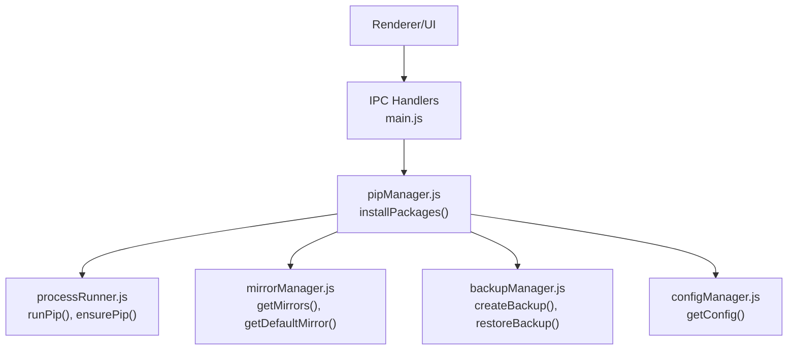
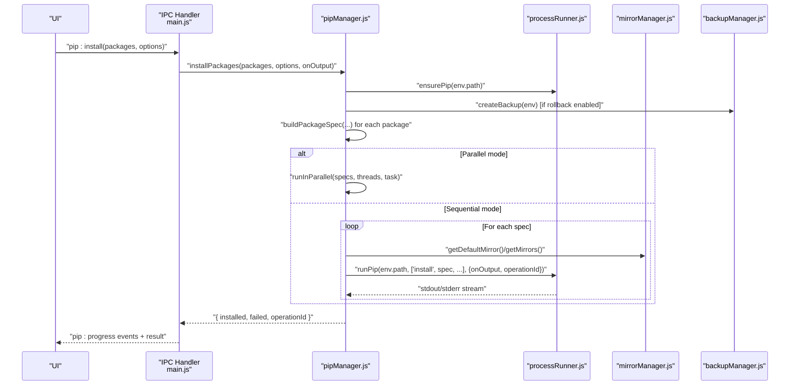
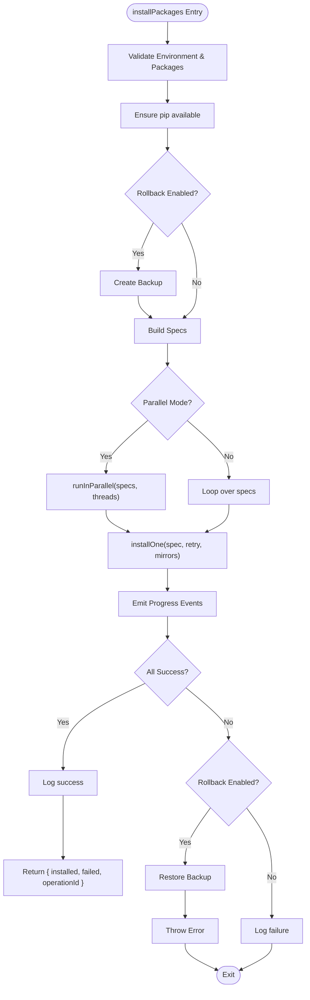
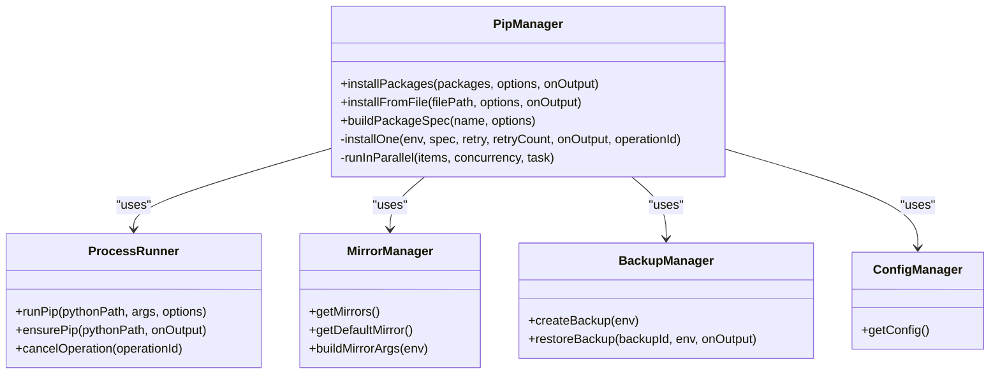

# Package Installation API

<cite>
**Referenced Files in This Document**
- [pipManager.js](file://core/operations/pipManager.js)
- [mirrorManager.js](file://core/config/mirrorManager.js)
- [backupManager.js](file://core/operations/backupManager.js)
- [processRunner.js](file://utils/processRunner.js)
- [configManager.js](file://core/config/configManager.js)
- [main.js](file://main.js)
</cite>

## Table of Contents
1. [Introduction](#introduction)
2. [Project Structure](#project-structure)
3. [Core Components](#core-components)
4. [Architecture Overview](#architecture-overview)
5. [Detailed Component Analysis](#detailed-component-analysis)
6. [Dependency Analysis](#dependency-analysis)
7. [Performance Considerations](#performance-considerations)
8. [Troubleshooting Guide](#troubleshooting-guide)
9. [Conclusion](#conclusion)
10. [Appendices](#appendices)

## Introduction
This document provides detailed API documentation for the package installation functionality, focusing on the installPackages() function and its ecosystem. It explains parameter specifications (packages array, options object with versionMode, parallel, retry, rollback), progress callback behavior, operation ID tracking, mirror source rotation, automatic backup creation, and rollback mechanisms. It also includes practical usage examples for single package installation, batch operations, requirements.txt processing, wheel file installation, and custom mirror configuration.

## Project Structure
The package installation feature is implemented across several modules:
- Core installation logic and orchestration: pipManager.js
- Mirror source management and selection: mirrorManager.js
- Backup and restore for rollback: backupManager.js
- Process execution, timeouts, cancellation, and pip auto-installation: processRunner.js
- Application configuration (parallel threads, retry count): configManager.js
- IPC bridge exposing installPackages to the UI: main.js

**Diagram sources**
- [main.js:311-315](file://main.js#L311-L315)
- [pipManager.js:513-596](file://pipManager.js#L513-L596)
- [processRunner.js:340-342](file://processRunner.js#L340-L342)
- [mirrorManager.js:110-118](file://mirrorManager.js#L110-L118)
- [backupManager.js:89-113](file://backupManager.js#L89-L113)
- [configManager.js:144-147](file://configManager.js#L144-L147)

**Section sources**
- [main.js:311-315](file://main.js#L311-L315)
- [pipManager.js:513-596](file://pipManager.js#L513-L596)

## Core Components
- installPackages(packages, options, onOutput): Orchestrates installation with optional parallelism, retries, backups, and rollbacks. Returns { installed, failed, operationId }.
- buildPackageSpec(name, options): Builds pip spec strings supporting latest/specific/range modes and wheel paths with security checks.
- runInParallel(items, concurrency, task): Worker pool implementation for concurrent installs.
- installOne(env, spec, retry, retryCount, onOutput, operationId): Single-package installer with mirror rotation and retry.
- installFromFile(filePath, options, onOutput): Supports .whl and .txt files.
- Mirror manager: Provides default and custom mirrors, speed testing, smart routing, and pip config writing.
- Backup manager: Creates freeze-based backups and restores via force-reinstall.
- Process runner: Executes pip commands with timeout, cancellation, and output streaming.

**Section sources**
- [pipManager.js:513-596](file://pipManager.js#L513-L596)
- [pipManager.js:154-235](file://pipManager.js#L154-L235)
- [pipManager.js:930-942](file://pipManager.js#L930-L942)
- [pipManager.js:608-633](file://pipManager.js#L608-L633)
- [pipManager.js:645-730](file://pipManager.js#L645-L730)
- [mirrorManager.js:110-118](file://mirrorManager.js#L110-L118)
- [backupManager.js:89-113](file://backupManager.js#L89-L113)
- [processRunner.js:340-342](file://processRunner.js#L340-L342)

## Architecture Overview
The installPackages() flow integrates multiple subsystems:
- Validates environment and inputs
- Ensures pip availability
- Optionally creates a backup
- Builds specs from packages and options
- Executes installations sequentially or in parallel
- Rotates through mirror sources and retries as configured
- Emits structured progress events
- Logs results and returns operationId

**Diagram sources**
- [main.js:311-315](file://main.js#L311-L315)
- [pipManager.js:513-596](file://pipManager.js#L513-L596)
- [pipManager.js:608-633](file://pipManager.js#L608-L633)
- [processRunner.js:340-342](file://processRunner.js#L340-L342)
- [mirrorManager.js:110-118](file://mirrorManager.js#L110-L118)
- [backupManager.js:89-113](file://backupManager.js#L89-L113)

## Detailed Component Analysis

### installPackages() API
- Purpose: Install one or more Python packages with advanced features.
- Parameters:
  - packages: Array of package names or specs (e.g., "numpy", "flask==2.3.1", "requests>=2.28,<3.0").
  - options: Object with keys:
    - versionMode: "latest" | "specific" | "range". Controls how versions are applied when building specs.
    - version: Version string used with specific or range modes.
    - parallel: Boolean to enable concurrent installation using worker threads.
    - retry: Boolean to enable intelligent multi-mirror retry per package.
    - rollback: Boolean (default true) to create a backup and restore on failure.
    - operationId: Optional unique ID for canceling all related processes.
  - onOutput: Callback(data, type) invoked with real-time stdout/stderr and structured progress messages.
- Behavior:
  - Acquires an environment lock to prevent concurrent operations on the same Python environment.
  - Ensures pip is available; auto-installs if missing.
  - Optionally creates a backup before starting.
  - Builds pip specs via buildPackageSpec().
  - Runs installations sequentially or in parallel based on options.parallel and config.parallelThreads.
  - For each package, rotates through mirror sources and retries up to configured attempts.
  - Emits structured progress events like "[PROGRESS] { done: 1, pkg, status }".
  - On failure with rollback enabled, restores the environment from the backup and throws an error.
  - Logs outcomes and returns { installed, failed, operationId }.

**Diagram sources**
- [pipManager.js:513-596](file://pipManager.js#L513-L596)
- [pipManager.js:608-633](file://pipManager.js#L608-L633)
- [backupManager.js:89-113](file://backupManager.js#L89-L113)

**Section sources**
- [pipManager.js:513-596](file://pipManager.js#L513-L596)

### buildPackageSpec() and Version Modes
- Supported modes:
  - latest: Use package name only (e.g., "numpy").
  - specific: Append ==version (e.g., "flask==2.3.1").
  - range: Append version constraints (e.g., "requests>=2.28,<3.0").
- Wheel support: Accepts absolute .whl paths with strict security validation (no path traversal, no UNC, no sensitive directories).
- Validation: Enforces package name regex, length limits, and version specifier patterns.

Examples:
- "package" -> latest
- "package==1.2.3" -> specific
- "package>=1.0,<2.0" -> range
- "/absolute/path/to/package.whl" -> wheel file

**Section sources**
- [pipManager.js:154-235](file://pipManager.js#L154-L235)

### Parallel Installation and Thread Management
- runInParallel(items, concurrency, task) implements a simple worker pool:
  - Maintains a queue and spawns concurrency workers.
  - Each worker pulls tasks until the queue is empty.
  - Uses Promise.all to wait for completion.
- Thread count is capped by config.parallelThreads and the number of items.

**Section sources**
- [pipManager.js:930-942](file://pipManager.js#L930-L942)
- [configManager.js:22-29](file://configManager.js#L22-L29)

### Mirror Source Rotation and Automatic Retry
- installOne() constructs mirror order starting with the default mirror followed by others.
- Attempts installation against multiple mirrors even without explicit retry flag.
- Max attempts are bounded by retryCount and mirror list length.
- Outputs informative logs for each attempt and mirror.

**Section sources**
- [pipManager.js:608-633](file://pipManager.js#L608-L633)
- [mirrorManager.js:110-118](file://mirrorManager.js#L110-L118)

### Automatic Backup Creation and Rollback Mechanisms
- Before installation, backupManager.createBackup(env) captures pip freeze output into a timestamped file under storagePath/backups/.
- If any package fails and rollback is enabled, backupManager.restoreBackup(backupId, env, onOutput) reinstalls exact versions using --force-reinstall --no-deps.
- Backup IDs are validated to prevent path traversal attacks.

**Section sources**
- [backupManager.js:89-113](file://backupManager.js#L89-L113)
- [backupManager.js:156-170](file://backupManager.js#L156-L170)
- [backupManager.js:62-78](file://backupManager.js#L62-L78)

### Progress Callback Implementation
- onOutput receives real-time stdout/stderr streams from processRunner.
- Structured progress events are emitted as "[PROGRESS] { done: 1, pkg, status }" where status is "ok" or "fail".
- The UI can parse these events to update counters and highlight failures.

**Section sources**
- [pipManager.js:513-596](file://pipManager.js#L513-L596)
- [processRunner.js:116-127](file://processRunner.js#L116-L127)

### Operation ID Tracking and Cancellation
- generateOperationId() produces a unique ID per operation.
- processRunner tracks active processes by operationId and supports cancelOperation(operationId) to terminate all associated subprocesses.
- installPackages accepts options.operationId to propagate cancellation across all spawned pip processes.

**Section sources**
- [pipManager.js:50-52](file://pipManager.js#L50-L52)
- [processRunner.js:181-191](file://processRunner.js#L181-L191)

### File-Based Installation (.whl and requirements.txt)
- installFromFile(filePath, options, onOutput):
  - .whl: Installs the wheel directly with mirror args and optional rollback.
  - .txt: Installs via pip install -r with mirror rotation and retry support.
- Both modes emit progress events and log outcomes.

**Section sources**
- [pipManager.js:645-730](file://pipManager.js#L645-L730)

### Custom Mirror Configuration
- mirrorManager manages built-in and custom mirrors, sets defaults, and writes pip config files.
- Users can add/update/remove mirrors and enable smart routing to pick the fastest mirror.
- buildMirrorArgs() generates CLI flags for non-default mirrors.

**Section sources**
- [mirrorManager.js:139-150](file://mirrorManager.js#L139-L150)
- [mirrorManager.js:299-322](file://mirrorManager.js#L299-L322)
- [mirrorManager.js:329-333](file://mirrorManager.js#L329-L333)

## Dependency Analysis
Key dependencies and relationships:
- pipManager depends on:
  - processRunner for command execution and pip lifecycle
  - mirrorManager for mirror selection and arguments
  - backupManager for snapshotting and restoring environments
  - configManager for parallelThreads and retryCount
  - envManager for current environment context
- main.js exposes installPackages via IPC handlers to the UI layer.

**Diagram sources**
- [pipManager.js:513-596](file://pipManager.js#L513-L596)
- [processRunner.js:340-342](file://processRunner.js#L340-L342)
- [mirrorManager.js:110-118](file://mirrorManager.js#L110-L118)
- [backupManager.js:89-113](file://backupManager.js#L89-L113)
- [configManager.js:144-147](file://configManager.js#L144-L147)

**Section sources**
- [pipManager.js:513-596](file://pipManager.js#L513-L596)
- [main.js:311-315](file://main.js#L311-L315)

## Performance Considerations
- Parallel installation reduces total time but increases CPU and I/O contention; tune config.parallelThreads based on system capacity.
- Mirror rotation adds network overhead; prefer reliable mirrors and consider enabling smartRoute for optimal selection.
- Backup creation uses pip freeze which is fast; restoration uses force-reinstall and may be slower than fresh install.
- ProcessRunner enforces timeouts to avoid hanging operations; adjust timeouts for large packages or slow networks.

[No sources needed since this section provides general guidance]

## Troubleshooting Guide
Common issues and resolutions:
- No Python environment selected: Ensure a valid environment is set via envManager.
- Invalid package name or version specifier: Verify format and allowed characters; use buildPackageSpec rules.
- Wheel path errors: Ensure absolute paths, no traversal sequences, and valid filenames.
- Mirror failures: Check network connectivity and mirror URLs; test speeds via mirrorManager.testAllMirrors().
- Timeout errors: Increase timeout values or reduce parallelism; verify pip availability.
- Rollback not triggered: Confirm rollback option is enabled; check backup existence and permissions.

**Section sources**
- [pipManager.js:154-235](file://pipManager.js#L154-L235)
- [mirrorManager.js:219-247](file://mirrorManager.js#L219-L247)
- [processRunner.js:151-159](file://processRunner.js#L151-L159)
- [backupManager.js:62-78](file://backupManager.js#L62-L78)

## Conclusion
The installPackages() API offers robust package installation capabilities with advanced features such as parallel execution, mirror rotation, automatic backups, and rollback. It integrates seamlessly with the application’s IPC layer and provides comprehensive progress feedback and operation tracking. By leveraging the underlying modules—processRunner, mirrorManager, backupManager, and configManager—it ensures reliability, performance, and safety across diverse environments.

[No sources needed since this section summarizes without analyzing specific files]

## Appendices

### Practical Usage Examples

- Single package installation:
  - Call installPackages(["numpy"], { versionMode: "latest" }, onOutput)
  - Monitor onOutput for "[INFO]", "[WARN]", "[ERR]", and "[PROGRESS]" events.

- Batch operations:
  - installPackages(["flask", "requests", "numpy"], { parallel: true, retry: true }, onOutput)
  - Adjust config.parallelThreads to control concurrency.

- Requirements.txt processing:
  - installFromFile("requirements.txt", { retry: true }, onOutput)
  - Supports mirror rotation and rollback.

- Wheel file installation:
  - installFromFile("/absolute/path/to/package.whl", { rollback: true }, onOutput)
  - Validates path security and emits progress events.

- Custom mirror configuration:
  - Add a mirror via mirrorManager.addCustomMirror("My Mirror", "https://custom.pypi/simple/", "Internal mirror")
  - Set default mirror with mirrorManager.setDefaultMirror("https://custom.pypi/simple/")
  - Enable smart routing with mirrorManager.setSmartRoute(true)

**Section sources**
- [pipManager.js:513-596](file://pipManager.js#L513-L596)
- [pipManager.js:645-730](file://pipManager.js#L645-L730)
- [mirrorManager.js:139-150](file://mirrorManager.js#L139-L150)
- [mirrorManager.js:250-260](file://mirrorManager.js#L250-L260)