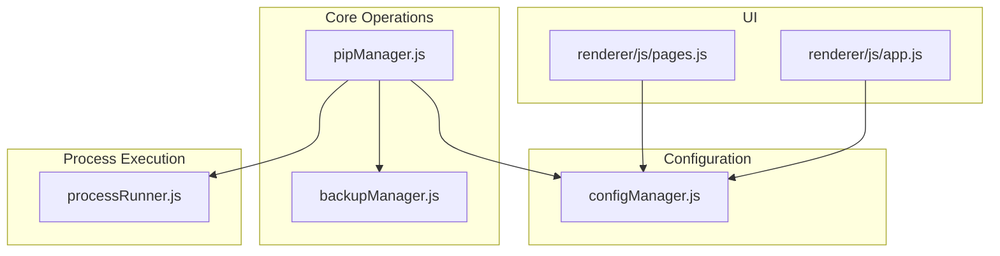
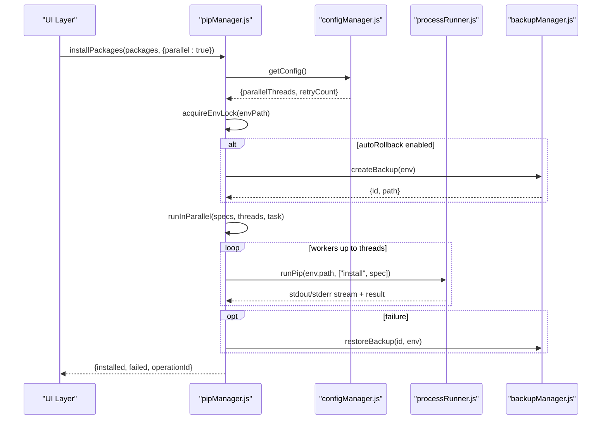
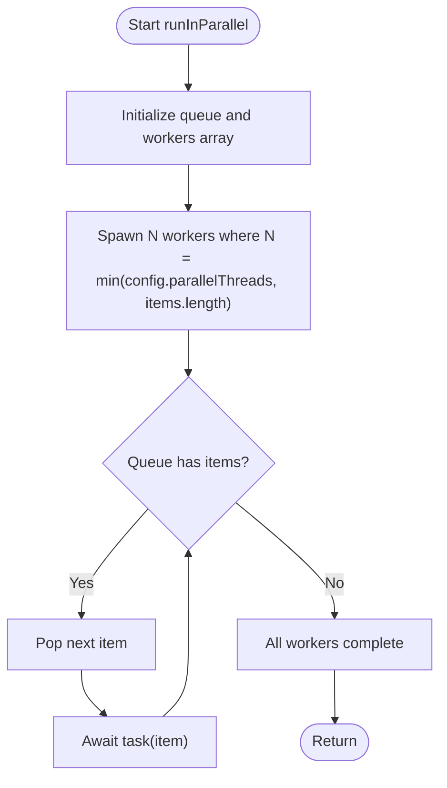
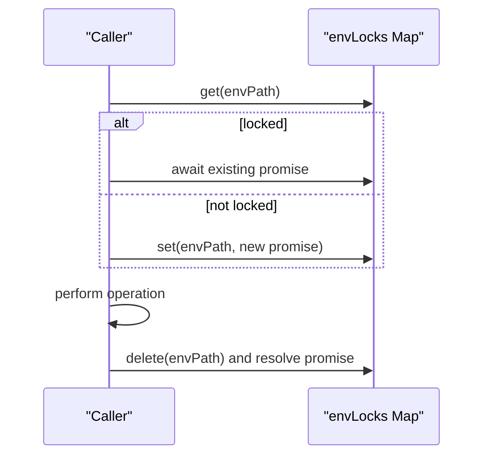
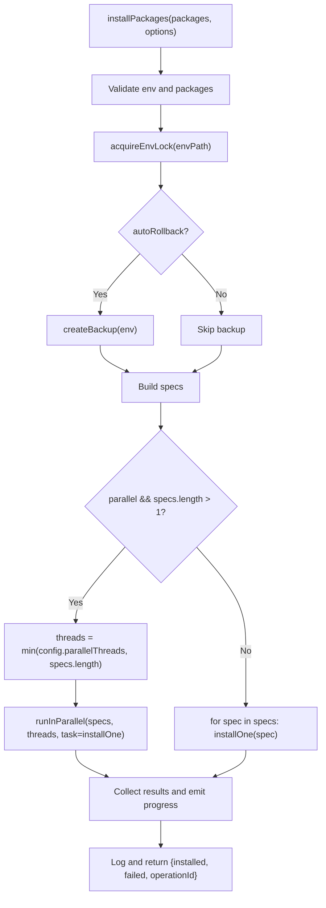
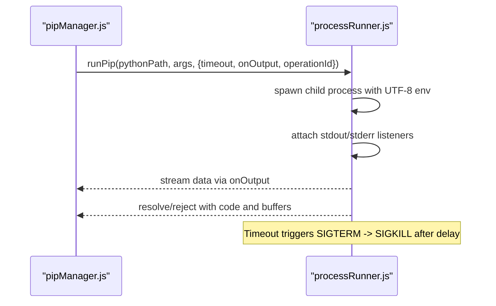
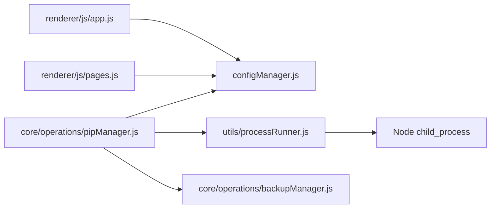

# Parallel Package Installation

<cite>
**Referenced Files in This Document**
- [pipManager.js](file://core/operations/pipManager.js)
- [configManager.js](file://core/config/configManager.js)
- [processRunner.js](file://utils/processRunner.js)
- [backupManager.js](file://core/operations/backupManager.js)
- [app.js](file://renderer/js/app.js)
- [pages.js](file://renderer/js/pages.js)
</cite>

## Table of Contents
1. [Introduction](#introduction)
2. [Project Structure](#project-structure)
3. [Core Components](#core-components)
4. [Architecture Overview](#architecture-overview)
5. [Detailed Component Analysis](#detailed-component-analysis)
6. [Dependency Analysis](#dependency-analysis)
7. [Performance Considerations](#performance-considerations)
8. [Troubleshooting Guide](#troubleshooting-guide)
9. [Conclusion](#conclusion)

## Introduction
This document explains the parallel package installation capabilities implemented in the project. It focuses on how multiple pip install/update operations are executed concurrently, how thread limits are derived from configuration, and how environment conflicts are prevented through locking. It also covers performance considerations, memory usage patterns, best practices for optimal parallel installation, and practical examples for configuring threads, monitoring concurrent operations, and handling resource contention.

## Project Structure
The parallel installation logic spans several modules:
- Core operation orchestration and concurrency control live in the pip manager.
- Configuration values (including parallelThreads) are managed centrally.
- Process execution, timeouts, cancellation, and pip availability are handled by a process runner.
- Backup and rollback support is provided by a backup manager.
- UI wiring updates the parallelThreads setting and displays current values.

**Diagram sources**
- [pipManager.js](file://core/operations/pipManager.js)
- [configManager.js](file://core/config/configManager.js)
- [processRunner.js](file://utils/processRunner.js)
- [backupManager.js](file://core/operations/backupManager.js)
- [app.js](file://renderer/js/app.js)
- [pages.js](file://renderer/js/pages.js)

**Section sources**
- [pipManager.js](file://core/operations/pipManager.js)
- [configManager.js](file://core/config/configManager.js)
- [processRunner.js](file://utils/processRunner.js)
- [backupManager.js](file://core/operations/backupManager.js)
- [app.js](file://renderer/js/app.js)
- [pages.js](file://renderer/js/pages.js)

## Core Components
- Parallel executor: runInParallel controls concurrency by maintaining a fixed number of worker tasks that pull items from a shared queue.
- Environment lock: acquireEnvLock ensures only one operation per Python environment runs at a time to avoid filesystem and pip state conflicts.
- Config-driven concurrency: config.parallelThreads defines the maximum number of concurrent install/update tasks; it is clamped to the number of items being processed.
- Process runner: runPip executes pip commands with timeout, cancellation, and output streaming; ensurePip guarantees pip availability.
- Backup and rollback: backupManager creates and restores backups around risky operations to maintain environment consistency.

Key responsibilities:
- pipManager.js: orchestrates install/update flows, concurrency, retries, progress emission, and locking.
- configManager.js: stores and validates parallelThreads and retryCount.
- processRunner.js: manages child processes, timeouts, cancellation, and pip readiness.
- backupManager.js: snapshot and restore environments via pip freeze and reinstall.
- app.js/pages.js: bind UI controls to update parallelThreads and display current settings.

**Section sources**
- [pipManager.js](file://core/operations/pipManager.js)
- [configManager.js](file://core/config/configManager.js)
- [processRunner.js](file://utils/processRunner.js)
- [backupManager.js](file://core/operations/backupManager.js)
- [app.js](file://renderer/js/app.js)
- [pages.js](file://renderer/js/pages.js)

## Architecture Overview
At a high level, the system coordinates multiple pip subprocesses under controlled concurrency while protecting each Python environment from concurrent writes.

**Diagram sources**
- [pipManager.js](file://core/operations/pipManager.js)
- [configManager.js](file://core/config/configManager.js)
- [processRunner.js](file://utils/processRunner.js)
- [backupManager.js](file://core/operations/backupManager.js)

## Detailed Component Analysis

### Parallel Executor: runInParallel
- Purpose: Execute an asynchronous task over a list of items with a bounded number of concurrent workers.
- Mechanism:
  - A shared queue holds all items.
  - A fixed pool of worker promises repeatedly pulls the next item and awaits its task completion.
  - Promise.all waits for all workers to finish.
- Concurrency limit: Derived from config.parallelThreads and capped by the number of items.
- Thread synchronization: No explicit locks inside the executor; safe because each task is independent and pip operations are serialized per environment by acquireEnvLock.

**Diagram sources**
- [pipManager.js](file://core/operations/pipManager.js)

**Section sources**
- [pipManager.js](file://core/operations/pipManager.js)

### Environment Locking: acquireEnvLock
- Purpose: Prevent concurrent modifications to the same Python environment.
- Mechanism:
  - A global Map tracks pending locks keyed by environment path.
  - If a lock exists, the caller awaits the existing promise before creating a new one.
  - The returned release function clears the entry and resolves the waiting promise.
- Usage: All write operations (install, uninstall, update, import requirements, file-based installs) acquire the lock before proceeding and release it in a finally block.

**Diagram sources**
- [pipManager.js](file://core/operations/pipManager.js)

**Section sources**
- [pipManager.js](file://core/operations/pipManager.js)

### Install Flow: installPackages
- Validates inputs and selects the current environment.
- Acquires the environment lock.
- Optionally creates a backup if rollback is enabled.
- Builds package specs and decides between parallel or sequential execution based on options and count.
- For parallel mode:
  - Computes threads = min(config.parallelThreads, specs.length).
  - Calls runInParallel to execute installOne per spec.
- For sequential mode: iterates and installs one by one.
- Emits structured progress events after each success/failure.
- Logs results and returns aggregated outcomes.

**Diagram sources**
- [pipManager.js](file://core/operations/pipManager.js)

**Section sources**
- [pipManager.js](file://core/operations/pipManager.js)

### Update Flow: updatePackages
- Similar structure to installPackages but invokes updateOne which performs pip install --upgrade with mirror fallback and checks for actual upgrades.
- Also supports parallel execution using the same concurrency model.

**Section sources**
- [pipManager.js](file://core/operations/pipManager.js)

### Process Runner: runPip and ensurePip
- runPip wraps python -m pip with robust process management:
  - UTF-8 encoding enforced.
  - Real-time stdout/stderr streaming with ANSI stripping.
  - Timeout with SIGTERM followed by SIGKILL after a delay.
  - Active process tracking for cancellation by operationId.
- ensurePip ensures pip is available:
  - Checks cache, then direct detection.
  - Attempts ensurepip upgrade, then falls back to downloading and running get-pip.py.
  - Caches readiness for a period to reduce repeated checks.

**Diagram sources**
- [processRunner.js](file://utils/processRunner.js)
- [pipManager.js](file://core/operations/pipManager.js)

**Section sources**
- [processRunner.js](file://utils/processRunner.js)
- [pipManager.js](file://core/operations/pipManager.js)

### Backup and Rollback: backupManager
- createBackup captures pip freeze output into a versioned .txt file under a storage directory.
- restoreBackup reinstalls packages from the backup using force-reinstall and no-deps to preserve dependency resolution.
- Used by install/update flows when rollback is enabled to revert environment state upon failure.

**Section sources**
- [backupManager.js](file://core/operations/backupManager.js)
- [pipManager.js](file://core/operations/pipManager.js)

### Configuration: parallelThreads and retryCount
- Defaults:
  - parallelThreads: 4
  - retryCount: 3
- Validation:
  - Values are sanitized to numeric ranges (parallelThreads 1–16, retryCount 0–10).
- UI binding:
  - Changing the threads input saves parallelThreads immediately.
  - On settings load, the UI reflects the current parallelThreads value.

**Section sources**
- [configManager.js](file://core/config/configManager.js)
- [app.js](file://renderer/js/app.js)
- [pages.js](file://renderer/js/pages.js)

## Dependency Analysis
The following diagram shows key dependencies among modules involved in parallel installation:

**Diagram sources**
- [pipManager.js](file://core/operations/pipManager.js)
- [configManager.js](file://core/config/configManager.js)
- [processRunner.js](file://utils/processRunner.js)
- [backupManager.js](file://core/operations/backupManager.js)
- [app.js](file://renderer/js/app.js)
- [pages.js](file://renderer/js/pages.js)

**Section sources**
- [pipManager.js](file://core/operations/pipManager.js)
- [configManager.js](file://core/config/configManager.js)
- [processRunner.js](file://utils/processRunner.js)
- [backupManager.js](file://core/operations/backupManager.js)
- [app.js](file://renderer/js/app.js)
- [pages.js](file://renderer/js/pages.js)

## Performance Considerations
- Concurrency tuning:
  - Set parallelThreads according to CPU cores and I/O capacity. Typical starting point is 4; increase cautiously for fast SSDs and network bandwidth.
  - Ensure the number of threads does not exceed the number of packages being installed to avoid idle workers.
- Timeouts and retries:
  - Each pip command uses a generous timeout to accommodate large downloads and slow networks.
  - RetryCount governs mirror fallback attempts per operation; higher values improve resilience but increase total runtime.
- Memory usage:
  - Streaming stdout/stderr avoids buffering entire outputs in memory.
  - Caches (site-packages path, pip readiness) reduce repeated expensive calls.
  - Directory size estimation caches folder sizes to prevent redundant scans.
- Disk I/O:
  - Backups are written once per risky operation; consider periodic cleanup of old backups.
  - site-packages scanning is cached for short TTL to balance freshness and performance.
- Network:
  - Mirror fallback improves throughput and reliability; prefer local mirrors for enterprise environments.
- Best practices:
  - Prefer batching related packages to amortize overhead.
  - Use rollback for critical environments to minimize downtime on failures.
  - Monitor logs and progress events to detect bottlenecks and adjust parallelThreads accordingly.

[No sources needed since this section provides general guidance]

## Troubleshooting Guide
Common issues and resolutions:
- Pip not found:
  - ensurePip will attempt ensurepip upgrade and fall back to get-pip.py download. Verify network access and Python integrity.
- Operation hangs or stalls:
  - Check processRunner timeouts and cancellation. Use cancelOperation(operationId) to terminate all processes associated with an operation.
- Concurrent environment conflicts:
  - acquireEnvLock serializes operations per environment. If you see delays, another operation may be holding the lock.
- Excessive memory usage:
  - Reduce parallelThreads. Inspect large log outputs and disable verbose logging if unnecessary.
- Slow disk operations:
  - Ensure storagePath points to a fast volume. Avoid network drives for backups and logs.
- Failed rollback:
  - Validate backup files exist and are readable. RestoreBackup requires valid backup IDs and accessible storagePath.

**Section sources**
- [processRunner.js](file://utils/processRunner.js)
- [pipManager.js](file://core/operations/pipManager.js)
- [backupManager.js](file://core/operations/backupManager.js)

## Conclusion
The parallel package installation system balances speed and safety:
- Concurrency is controlled by config.parallelThreads and enforced by a simple yet effective worker pool.
- Environment isolation is guaranteed by per-environment locks, preventing race conditions during pip operations.
- Robust process management ensures reliable execution with timeouts, cancellation, and streaming output.
- Backup and rollback mechanisms protect environment integrity during risky changes.
By tuning parallelThreads, leveraging mirror fallbacks, and monitoring progress, users can achieve optimal performance while maintaining stability.

[No sources needed since this section summarizes without analyzing specific files]