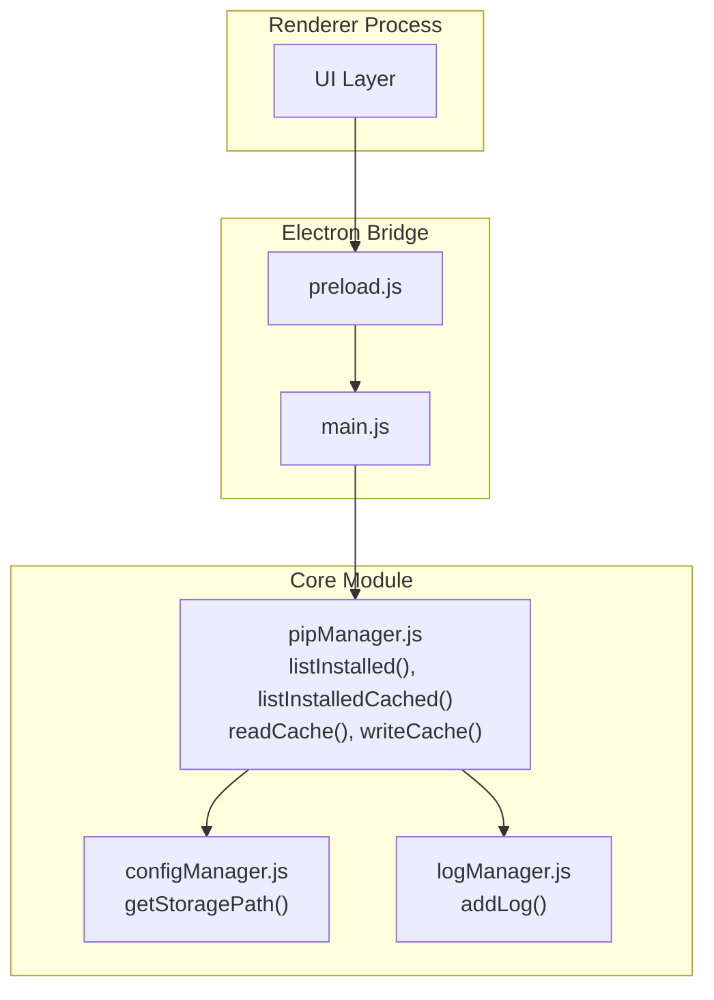
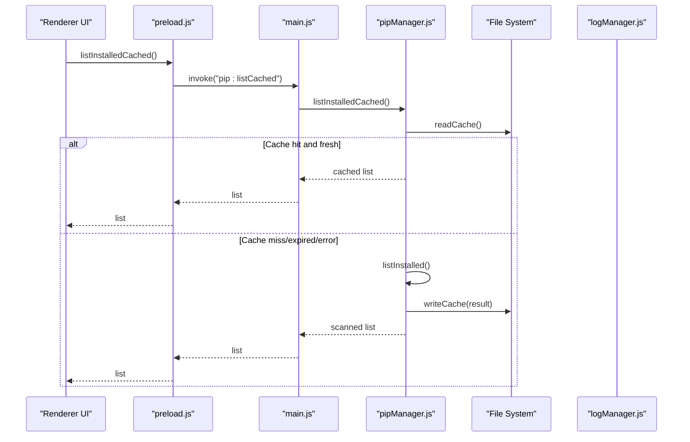
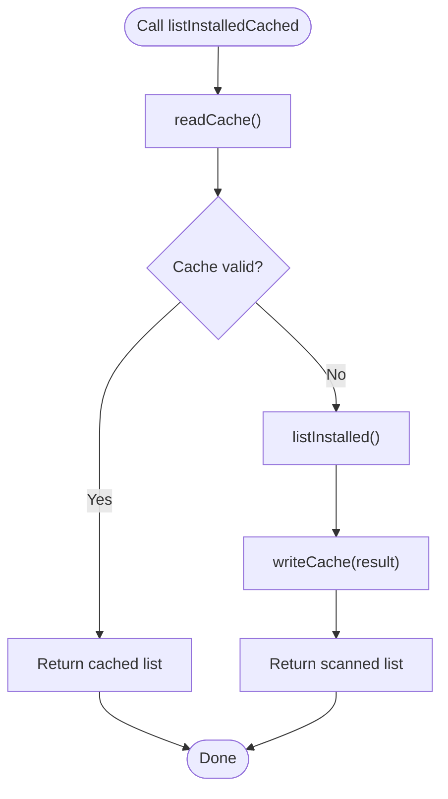
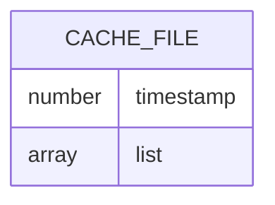
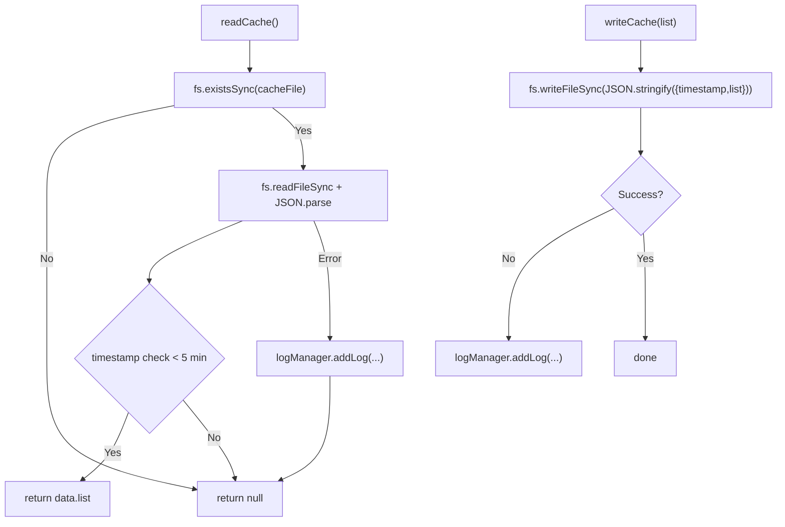
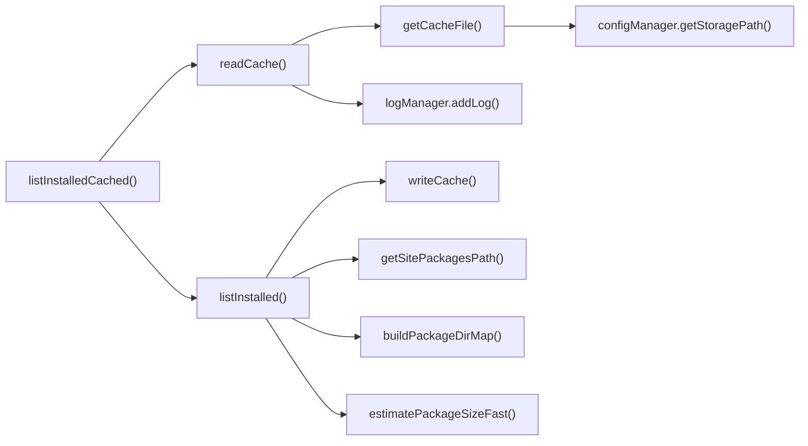

# List Cached Packages API

<cite>
**Referenced Files in This Document**
- [pipManager.js](file://core/operations/pipManager.js)
- [configManager.js](file://core/config/configManager.js)
- [logManager.js](file://core/system/logManager.js)
- [main.js](file://main.js)
- [preload.js](file://preload.js)
</cite>

## Table of Contents
1. [Introduction](#introduction)
2. [Project Structure](#project-structure)
3. [Core Components](#core-components)
4. [Architecture Overview](#architecture-overview)
5. [Detailed Component Analysis](#detailed-component-analysis)
6. [Dependency Analysis](#dependency-analysis)
7. [Performance Considerations](#performance-considerations)
8. [Troubleshooting Guide](#troubleshooting-guide)
9. [Conclusion](#conclusion)
10. [Appendices](#appendices)

## Introduction
This document provides comprehensive API documentation for the listInstalledCached() function, which returns a cached list of installed Python packages with an automatic fallback to real-time scanning when the cache is unavailable or expired. It explains the caching strategy, file location, JSON structure, expiration policy, error handling, and performance benefits compared to direct real-time queries.

## Project Structure
The listInstalledCached() functionality resides within the pip manager module and integrates with configuration and logging subsystems. The Electron IPC layer exposes this capability to the renderer process.

**Diagram sources**
- [pipManager.js:89-127](file://core/operations/pipManager.js#L89-L127)
- [pipManager.js:400-439](file://core/operations/pipManager.js#L400-L439)
- [configManager.js:185-191](file://core/config/configManager.js#L185-L191)
- [logManager.js:115-134](file://core/system/logManager.js#L115-L134)
- [main.js:285-287](file://main.js#L285-L287)
- [preload.js:42-44](file://preload.js#L42-L44)

**Section sources**
- [pipManager.js:89-127](file://core/operations/pipManager.js#L89-L127)
- [pipManager.js:400-439](file://core/operations/pipManager.js#L400-L439)
- [configManager.js:185-191](file://core/config/configManager.js#L185-L191)
- [logManager.js:115-134](file://core/system/logManager.js#L115-L134)
- [main.js:285-287](file://main.js#L285-L287)
- [preload.js:42-44](file://preload.js#L42-L44)

## Core Components
- listInstalledCached(): Returns cached package list if valid; otherwise performs real-time scan via listInstalled().
- readCache(): Reads and validates the cache file with a 5-minute TTL; returns null on miss/expiry/error.
- writeCache(): Persists the package list along with a timestamp to the storage directory.
- getCacheFile(): Derives the cache file path from the configured storage directory.
- listInstalled(): Performs a full pip list scan, computes size/install metadata, and writes the result to cache.

Key behaviors:
- Cache priority: If cache exists and is fresh (within 5 minutes), return immediately without I/O beyond reading the cache file.
- Fallback: On cache miss/expiry/corruption, call listInstalled() to perform a real-time scan and update the cache.
- Error handling: Read/write errors are logged and do not break the flow; fallback ensures data availability.

**Section sources**
- [pipManager.js:89-127](file://core/operations/pipManager.js#L89-L127)
- [pipManager.js:400-439](file://core/operations/pipManager.js#L400-L439)

## Architecture Overview
The API spans multiple layers:
- Renderer calls window.electronAPI.listInstalledCached()
- preload.js forwards via ipcRenderer.invoke('pip:listCached')
- main.js handles 'pip:listCached' by calling pipManager.listInstalledCached()
- pipManager reads cache first; if invalid, falls back to listInstalled() and updates cache

**Diagram sources**
- [preload.js:42-44](file://preload.js#L42-L44)
- [main.js:285-287](file://main.js#L285-L287)
- [pipManager.js:435-439](file://core/operations/pipManager.js#L435-L439)
- [pipManager.js:99-127](file://core/operations/pipManager.js#L99-L127)
- [pipManager.js:400-427](file://core/operations/pipManager.js#L400-L427)

## Detailed Component Analysis

### listInstalledCached()
- Purpose: Provide fast access to installed packages using cache-first strategy.
- Parameters: None.
- Return value: Promise resolving to an array identical in schema to listInstalled().
- Behavior:
  - Attempt to read cache via readCache().
  - If non-null, return immediately.
  - Otherwise, call listInstalled() to perform real-time scan and cache update, then return the result.

**Diagram sources**
- [pipManager.js:435-439](file://core/operations/pipManager.js#L435-L439)
- [pipManager.js:99-127](file://core/operations/pipManager.js#L99-L127)
- [pipManager.js:400-427](file://core/operations/pipManager.js#L400-L427)

**Section sources**
- [pipManager.js:435-439](file://core/operations/pipManager.js#L435-L439)

### Cache File Location and JSON Structure
- Location: Derived from configManager.getStoragePath() joined with 'installed-cache.json'.
- JSON structure:
  - timestamp: number (milliseconds since epoch) indicating when the cache was created.
  - list: array of package objects identical to listInstalled() output.

**Diagram sources**
- [pipManager.js:89-93](file://core/operations/pipManager.js#L89-L93)
- [pipManager.js:120-127](file://core/operations/pipManager.js#L120-L127)
- [configManager.js:185-191](file://core/config/configManager.js#L185-L191)

**Section sources**
- [pipManager.js:89-93](file://core/operations/pipManager.js#L89-L93)
- [pipManager.js:120-127](file://core/operations/pipManager.js#L120-L127)
- [configManager.js:185-191](file://core/config/configManager.js#L185-L191)

### Expiration Policy
- TTL: 5 minutes (300,000 ms).
- Validation: readCache() compares current time with stored timestamp; returns null if older than TTL.
- Implication: Frequent UI refreshes within 5 minutes will be served from cache without invoking pip.

**Section sources**
- [pipManager.js:99-114](file://core/operations/pipManager.js#L99-L114)

### Fallback Mechanism
- Trigger conditions:
  - Cache file missing.
  - Cache file unreadable or malformed JSON.
  - Cache expired (older than 5 minutes).
- Action: Call listInstalled() to perform a full scan, compute metadata, and persist new cache.

**Section sources**
- [pipManager.js:435-439](file://core/operations/pipManager.js#L435-L439)
- [pipManager.js:99-114](file://core/operations/pipManager.js#L99-L114)

### Cache Read/Write Operations and Error Handling
- readCache():
  - Attempts to read and parse the cache file.
  - Validates TTL.
  - Logs any errors via logManager.addLog() and returns null on failure.
- writeCache():
  - Writes JSON with timestamp and list fields.
  - Catches and logs any write errors.

**Diagram sources**
- [pipManager.js:99-127](file://core/operations/pipManager.js#L99-L127)
- [logManager.js:115-134](file://core/system/logManager.js#L115-L134)

**Section sources**
- [pipManager.js:99-127](file://core/operations/pipManager.js#L99-L127)
- [logManager.js:115-134](file://core/system/logManager.js#L115-L134)

### Parameter Specifications
- Input parameters: None.
- Output schema: Array of package objects identical to listInstalled(). Each object includes name, version, installed date, size info, and source.

**Section sources**
- [pipManager.js:400-427](file://core/operations/pipManager.js#L400-L427)
- [pipManager.js:435-439](file://core/operations/pipManager.js#L435-L439)

### Performance Benefits
- Cached query:
  - Single synchronous file read and JSON parse.
  - No external process invocation.
  - Typical latency: sub-millisecond to few milliseconds depending on disk speed.
- Real-time query:
  - Invokes pip subprocess, parses JSON, scans site-packages for size/time metadata.
  - Higher latency due to I/O and process overhead.
- Recommendation: Use listInstalledCached() for frequent UI updates; use listInstalled() only when forcing a refresh is necessary.

[No sources needed since this section provides general guidance]

## Dependency Analysis
The following diagram shows how listInstalledCached() depends on other modules and functions.

**Diagram sources**
- [pipManager.js:89-127](file://core/operations/pipManager.js#L89-L127)
- [pipManager.js:400-439](file://core/operations/pipManager.js#L400-L439)
- [configManager.js:185-191](file://core/config/configManager.js#L185-L191)
- [logManager.js:115-134](file://core/system/logManager.js#L115-L134)

**Section sources**
- [pipManager.js:89-127](file://core/operations/pipManager.js#L89-L127)
- [pipManager.js:400-439](file://core/operations/pipManager.js#L400-L439)
- [configManager.js:185-191](file://core/config/configManager.js#L185-L191)
- [logManager.js:115-134](file://core/system/logManager.js#L115-L134)

## Performance Considerations
- Prefer listInstalledCached() for responsive UI interactions.
- Avoid repeated forced refreshes; rely on 5-minute TTL unless environment changes are expected.
- Disk I/O characteristics: SSD vs HDD can affect cache read/write times; still significantly faster than pip subprocess calls.
- Memory footprint: Cache array size scales with installed packages; ensure adequate memory for large environments.

[No sources needed since this section provides general guidance]

## Troubleshooting Guide
Common issues and resolutions:
- Cache file missing:
  - Expected behavior: Falls back to real-time scan and recreates cache.
- Cache file corrupted or invalid JSON:
  - readCache() logs error and returns null; fallback triggers real-time scan.
- Cache always expired:
  - Verify system clock accuracy; ensure application runs continuously within 5-minute windows.
- Write failures:
  - Check storage directory permissions and disk space; writeCache() logs errors but does not block execution.
- Manual cache invalidation:
  - Delete installed-cache.json to force next call to refresh via listInstalled().
- Forcing real-time update:
  - Call listInstalled() directly instead of listInstalledCached().

**Section sources**
- [pipManager.js:99-127](file://core/operations/pipManager.js#L99-L127)
- [pipManager.js:400-427](file://core/operations/pipManager.js#L400-L427)
- [logManager.js:115-134](file://core/system/logManager.js#L115-L134)

## Conclusion
listInstalledCached() offers a robust, high-performance mechanism to retrieve installed package lists by prioritizing cached data with a 5-minute TTL and automatically falling back to real-time scanning when needed. Its integration with configuration and logging ensures reliability and observability. Use it for typical UI operations and reserve real-time scans for scenarios requiring immediate freshness.

[No sources needed since this section summarizes without analyzing specific files]

## Appendices

### API Usage Examples
- Basic usage pattern:
  - Call listInstalledCached() to fetch the latest available cached list.
  - Display results in the UI without additional processing.
- Understanding cache freshness:
  - Within 5 minutes of last successful scan, responses come from cache.
  - After 5 minutes, the next call triggers a real-time scan and updates cache.
- When to force real-time updates:
  - After installing/uninstalling packages, call listInstalled() to refresh state before subsequent cached reads.

[No sources needed since this section provides general guidance]

### IPC Exposure
- Renderer-side exposure:
  - window.electronAPI.listInstalledCached() invokes 'pip:listCached'.
- Main-process handler:
  - 'pip:listCached' maps to pipManager.listInstalledCached().

**Section sources**
- [preload.js:42-44](file://preload.js#L42-L44)
- [main.js:285-287](file://main.js#L285-L287)