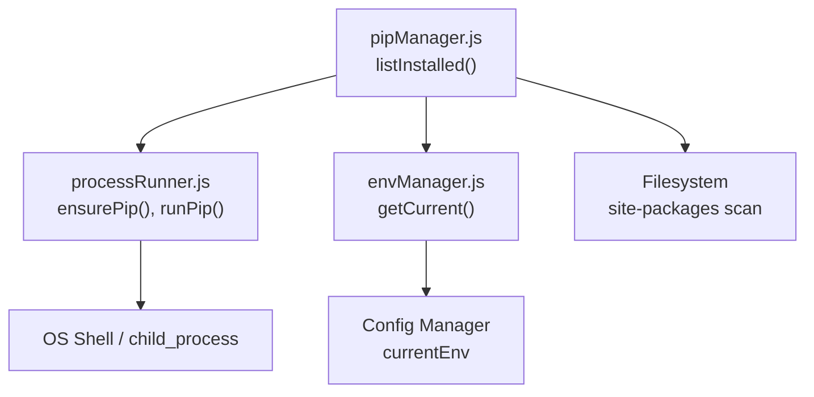
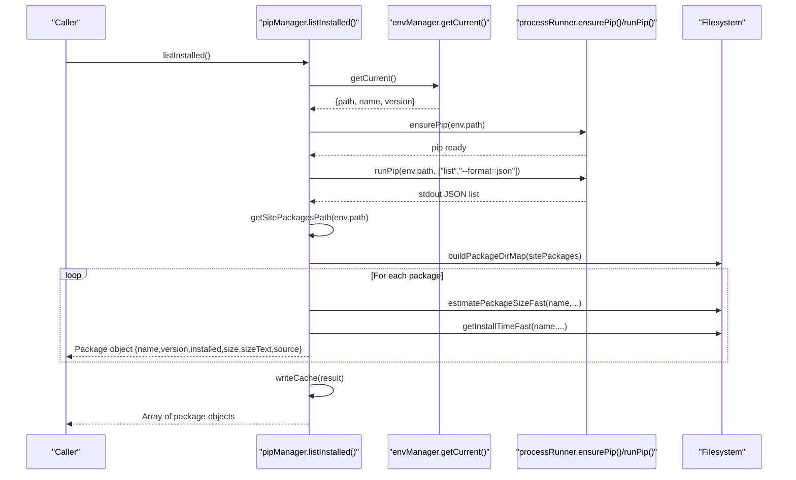
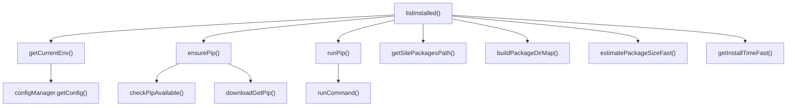

# List Installed Packages API

<cite>
**Referenced Files in This Document**
- [pipManager.js](file://core/operations/pipManager.js)
- [processRunner.js](file://utils/processRunner.js)
- [envManager.js](file://core/system/envManager.js)
</cite>

## Table of Contents
1. [Introduction](#introduction)
2. [Project Structure](#project-structure)
3. [Core Components](#core-components)
4. [Architecture Overview](#architecture-overview)
5. [Detailed Component Analysis](#detailed-component-analysis)
6. [Dependency Analysis](#dependency-analysis)
7. [Performance Considerations](#performance-considerations)
8. [Troubleshooting Guide](#troubleshooting-guide)
9. [Conclusion](#conclusion)

## Introduction
This document provides detailed API documentation for the listInstalled() function, which performs real-time scanning of installed Python packages using pip list --format=json. It covers environment validation, pip installation verification, site-packages path resolution, package metadata enrichment (size and installation time), caching behavior with a 5-minute TTL, parameter specifications, return value schema, practical usage examples, and error handling scenarios.

## Project Structure
The listInstalled() functionality is implemented within the operations layer that orchestrates Python environment interactions and filesystem scans:
- Core logic resides in the pip manager module.
- Process execution and pip availability are handled by the process runner utility.
- Python environment discovery and selection are managed by the environment manager.

**Diagram sources**
- [pipManager.js:400-427](file://core/operations/pipManager.js#L400-L427)
- [processRunner.js:233-278](file://utils/processRunner.js#L233-L278)
- [envManager.js:178-184](file://core/system/envManager.js#L178-L184)

**Section sources**
- [pipManager.js:1-120](file://core/operations/pipManager.js#L1-L120)
- [processRunner.js:1-120](file://utils/processRunner.js#L1-L120)
- [envManager.js:1-120](file://core/system/envManager.js#L1-L120)

## Core Components
- listInstalled(): Executes pip list --format=json, enriches each package with size and installation time via filesystem scanning, caches results with a 5-minute TTL, and returns an array of package objects.
- ensurePip(): Ensures pip is available in the selected Python environment; installs it if missing using built-in ensurepip or get-pip.py fallbacks.
- runPip(): Wraps python -m pip command execution with timeout, cancellation support, and output streaming.
- getCurrentEnv(): Retrieves the currently selected Python environment from memory or configuration.
- getSitePackagesPath(): Resolves the site-packages directory for the active Python interpreter using pip show pip Location.
- buildPackageDirMap(): Builds a mapping of package directories and .dist-info entries to accelerate size and timestamp lookups.
- estimatePackageSizeFast(): Computes total size across relevant package directories and .dist-info, returning both numeric bytes and human-readable text.
- getInstallTimeFast(): Derives installation date from filesystem modification times of package directories or .dist-info metadata.

Key responsibilities:
- Environment validation and pip readiness checks.
- Real-time package enumeration via pip JSON output.
- Filesystem-based enrichment for size and install time.
- In-memory and file-based caching with TTL enforcement.

**Section sources**
- [pipManager.js:400-427](file://core/operations/pipManager.js#L400-L427)
- [pipManager.js:244-261](file://core/operations/pipManager.js#L244-L261)
- [pipManager.js:278-300](file://core/operations/pipManager.js#L278-L300)
- [pipManager.js:369-389](file://core/operations/pipManager.js#L369-L389)
- [pipManager.js:341-358](file://core/operations/pipManager.js#L341-L358)
- [processRunner.js:233-278](file://utils/processRunner.js#L233-L278)
- [processRunner.js:340-342](file://utils/processRunner.js#L340-L342)
- [envManager.js:178-184](file://core/system/envManager.js#L178-L184)

## Architecture Overview
The listInstalled() workflow integrates environment management, pip execution, and filesystem scanning to produce enriched package metadata.

**Diagram sources**
- [pipManager.js:400-427](file://core/operations/pipManager.js#L400-L427)
- [pipManager.js:244-261](file://core/operations/pipManager.js#L244-L261)
- [pipManager.js:278-300](file://core/operations/pipManager.js#L278-L300)
- [pipManager.js:369-389](file://core/operations/pipManager.js#L369-L389)
- [pipManager.js:341-358](file://core/operations/pipManager.js#L341-L358)
- [processRunner.js:233-278](file://utils/processRunner.js#L233-L278)
- [processRunner.js:340-342](file://utils/processRunner.js#L340-L342)
- [envManager.js:178-184](file://core/system/envManager.js#L178-L184)

## Detailed Component Analysis

### Function: listInstalled()
- Purpose: Return a real-time list of installed packages with enriched metadata including size and installation time.
- Parameters: None required.
- Behavior:
  - Validates current Python environment.
  - Ensures pip is available (installs automatically if needed).
  - Executes pip list --format=json to enumerate packages.
  - Resolves site-packages path for the active environment.
  - Builds a package directory map once to avoid repeated filesystem scans.
  - For each package, estimates size and installation time via filesystem inspection.
  - Writes result to cache with a 5-minute TTL.
  - Returns an array of package objects.

Return Value Schema:
- Type: Array of package objects.
- Each object contains:
  - name: string — Package name.
  - version: string — Installed version.
  - installed: string — Installation date in ISO format (YYYY-MM-DD) derived from filesystem timestamps; empty string if unavailable.
  - size: number — Size in bytes (rounded to one decimal MB when converted).
  - sizeText: string — Human-readable size (e.g., "1.2 MB", "345.6 KB", "-" if not found).
  - source: string — Always "pypi.org".

Caching Mechanism:
- Cache file: installed-cache.json stored under application storage path.
- TTL: 5 minutes. If cache exists and is fresh, readCache() returns it; otherwise, listInstalled() writes new data.
- Note: listInstalled() always performs a live scan and updates the cache; use listInstalledCached() to prefer cached data.

Error Handling:
- Throws Error if no Python environment is selected.
- Throws Error if pip cannot be ensured (after ensurepip and get-pip.py attempts).
- Throws Error on subprocess failures during pip list execution (timeout, non-zero exit code).
- Logs filesystem access errors without failing the entire operation; size/time may be empty or zero.

Practical Examples:
- Basic call:
  - const packages = await listInstalled();
  - Iterate over packages to display name, version, size, and installed date.
- Interpreting size and installation time:
  - size: Use for programmatic comparisons or sorting.
  - sizeText: Display directly to users (MB/KB).
  - installed: Show as YYYY-MM-DD; treat empty string as unknown.
- Handling errors:
  - Wrap calls in try/catch to handle missing environments or pip issues.
  - Log and present user-friendly messages.

**Section sources**
- [pipManager.js:400-427](file://core/operations/pipManager.js#L400-L427)
- [pipManager.js:99-127](file://core/operations/pipManager.js#L99-L127)
- [pipManager.js:244-261](file://core/operations/pipManager.js#L244-L261)
- [pipManager.js:278-300](file://core/operations/pipManager.js#L278-L300)
- [pipManager.js:369-389](file://core/operations/pipManager.js#L369-L389)
- [pipManager.js:341-358](file://core/operations/pipManager.js#L341-L358)
- [processRunner.js:233-278](file://utils/processRunner.js#L233-L278)
- [processRunner.js:340-342](file://utils/processRunner.js#L340-L342)
- [envManager.js:178-184](file://core/system/envManager.js#L178-L184)

### Pip Installation Verification: ensurePip()
- Purpose: Ensure pip is available in the target Python environment.
- Strategy:
  - Check in-memory cache for pip readiness.
  - Directly test pip availability via python -m pip --version.
  - Attempt built-in ensurepip upgrade.
  - Download and execute get-pip.py from multiple sources if necessary.
- Caching: Uses a 5-minute TTL for pip readiness state.
- Errors: Throws descriptive error if all installation methods fail.

**Section sources**
- [processRunner.js:233-278](file://utils/processRunner.js#L233-L278)
- [processRunner.js:41-63](file://utils/processRunner.js#L41-L63)

### Site-packages Path Resolution: getSitePackagesPath()
- Purpose: Determine the site-packages directory for the active Python interpreter.
- Method: Executes pip show pip and parses the Location field.
- Caching: 30-second TTL per Python path to reduce repeated lookups.
- Errors: Logs failure and returns empty string; downstream functions handle missing paths gracefully.

**Section sources**
- [pipManager.js:244-261](file://core/operations/pipManager.js#L244-L261)

### Package Metadata Enrichment: Size and Installation Time
- Directory Map Construction:
  - Scans site-packages for .dist-info and package directories.
  - Normalizes names (underscore/hyphen conversion) for consistent lookup.
- Size Estimation:
  - Recursively sums file sizes across candidate directories (.dist-info and package dir).
  - Skips symbolic links to prevent infinite loops.
  - Caches computed sizes per directory to avoid redundant scans.
- Installation Time Estimation:
  - Uses filesystem modification time of the resolved package directory or .dist-info entry.
  - Returns ISO-formatted date string truncated to day precision.

**Section sources**
- [pipManager.js:278-300](file://core/operations/pipManager.js#L278-L300)
- [pipManager.js:314-332](file://core/operations/pipManager.js#L314-L332)
- [pipManager.js:369-389](file://core/operations/pipManager.js#L369-L389)
- [pipManager.js:341-358](file://core/operations/pipManager.js#L341-L358)

### Caching Mechanism: 5-Minute TTL
- Cache File: installed-cache.json located under application storage path.
- Read Logic:
  - Parses JSON and validates timestamp against 5-minute threshold.
  - Returns cached list if valid; otherwise null.
- Write Logic:
  - Serializes result with timestamp and writes atomically.
  - Logs write failures without halting execution.

**Section sources**
- [pipManager.js:99-127](file://core/operations/pipManager.js#L99-L127)

## Dependency Analysis
The listInstalled() function depends on several modules and utilities:

**Diagram sources**
- [pipManager.js:400-427](file://core/operations/pipManager.js#L400-L427)
- [processRunner.js:233-278](file://utils/processRunner.js#L233-L278)
- [processRunner.js:340-342](file://utils/processRunner.js#L340-L342)
- [envManager.js:178-184](file://core/system/envManager.js#L178-L184)

**Section sources**
- [pipManager.js:400-427](file://core/operations/pipManager.js#L400-L427)
- [processRunner.js:233-278](file://utils/processRunner.js#L233-L278)
- [envManager.js:178-184](file://core/system/envManager.js#L178-L184)

## Performance Considerations
- Single-pass directory map construction reduces repeated filesystem scans.
- Recursive size calculation uses caching to avoid recomputation across packages.
- Symbolic link skipping prevents performance degradation and deadlocks.
- Pip readiness and site-packages path caching minimize external calls.
- Timeout protection ensures long-running commands do not block indefinitely.

[No sources needed since this section provides general guidance]

## Troubleshooting Guide
Common issues and resolutions:
- Missing Python environment:
  - Symptom: Error indicating no Python environment selected.
  - Action: Select or configure a valid Python executable path.
- Pip installation failures:
  - Symptom: Error stating pip could not be auto-installed.
  - Action: Manually install pip using ensurepip or get-pip.py; verify network access and permissions.
- File system access issues:
  - Symptom: Size or installation time fields are empty or zero.
  - Action: Ensure site-packages directory is readable; check permissions and disk availability.
- Timeout errors:
  - Symptom: Command timeout exceptions during pip list execution.
  - Action: Increase timeout settings; investigate slow network or large environments.

**Section sources**
- [pipManager.js:400-427](file://core/operations/pipManager.js#L400-L427)
- [processRunner.js:233-278](file://utils/processRunner.js#L233-L278)
- [pipManager.js:244-261](file://core/operations/pipManager.js#L244-L261)

## Conclusion
The listInstalled() function provides a robust, real-time view of installed Python packages with enriched metadata. It combines environment validation, pip execution, and filesystem scanning to deliver accurate size and installation time information. With caching and error handling, it balances performance and reliability for typical development workflows.

[No sources needed since this section summarizes without analyzing specific files]