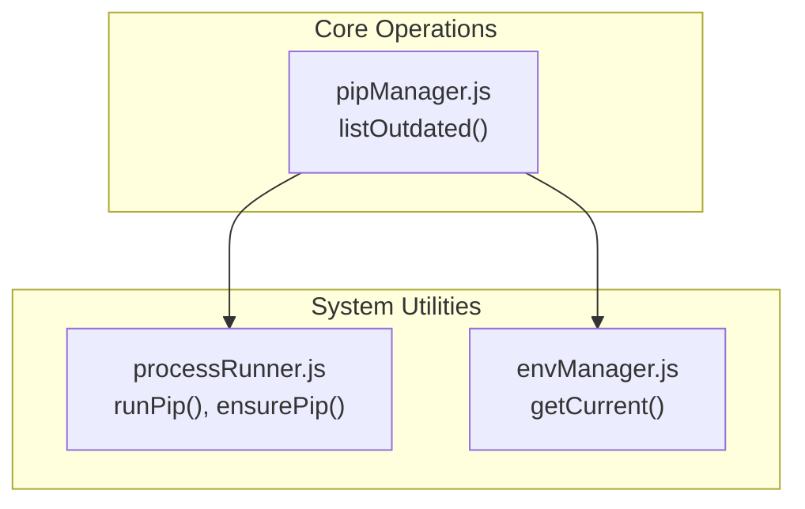
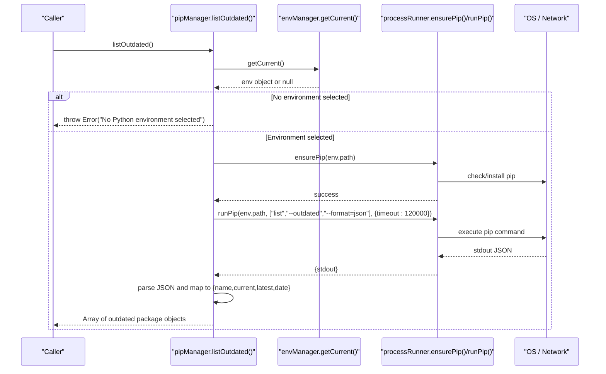
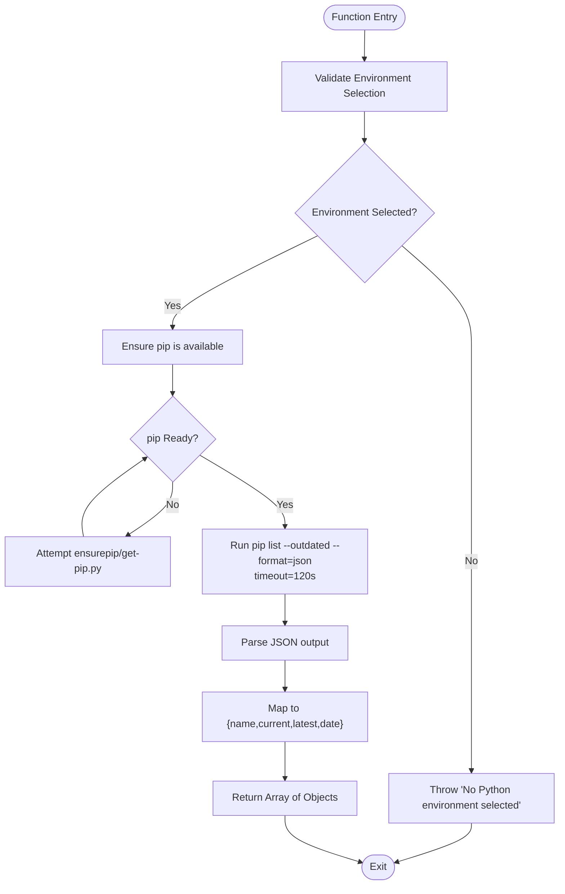
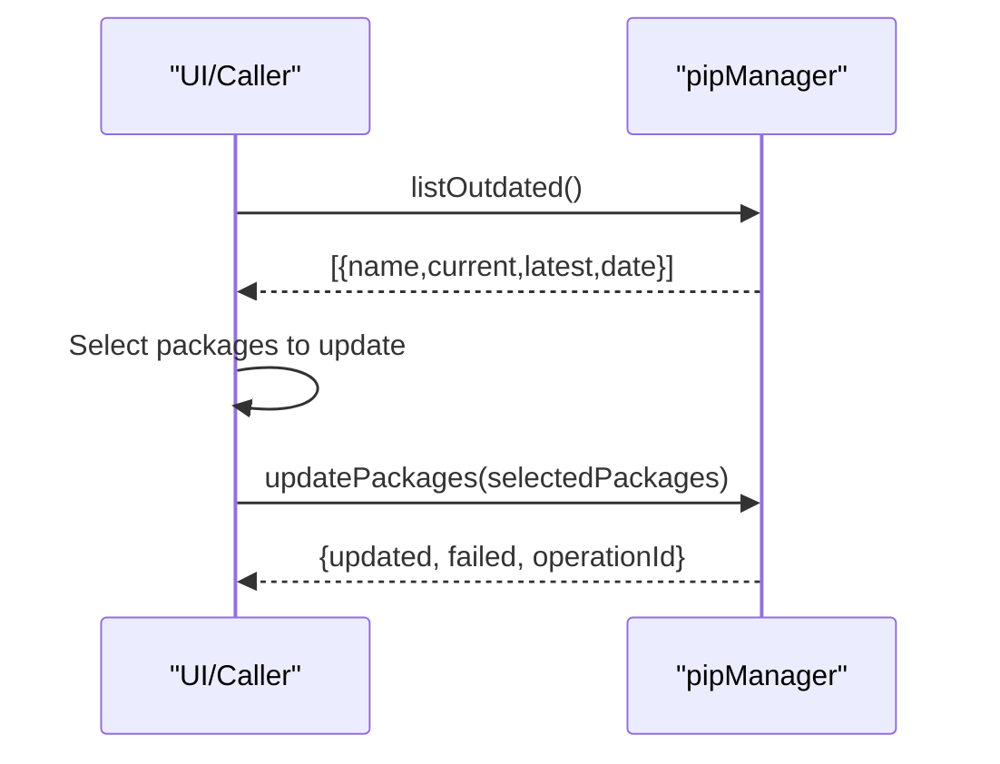
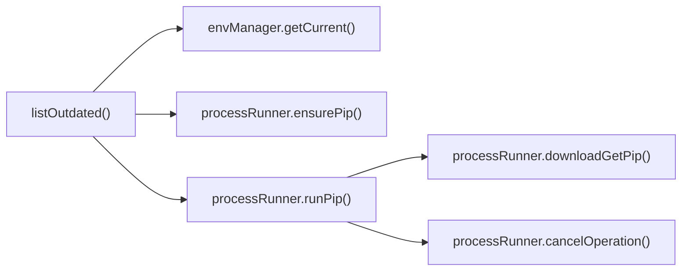

# List Outdated Packages API

<cite>
**Referenced Files in This Document**
- [pipManager.js](file://core/operations/pipManager.js)
- [processRunner.js](file://utils/processRunner.js)
- [envManager.js](file://core/system/envManager.js)
</cite>

## Table of Contents
1. [Introduction](#introduction)
2. [Project Structure](#project-structure)
3. [Core Components](#core-components)
4. [Architecture Overview](#architecture-overview)
5. [Detailed Component Analysis](#detailed-component-analysis)
6. [Dependency Analysis](#dependency-analysis)
7. [Performance Considerations](#performance-considerations)
8. [Troubleshooting Guide](#troubleshooting-guide)
9. [Conclusion](#conclusion)
10. [Appendices](#appendices)

## Introduction
This document provides detailed API documentation for the listOutdated() function, which identifies Python packages with available updates by invoking pip list --outdated --format=json. It explains environment validation, pip installation checks, timeout handling (120 seconds), outdated package detection logic, and result transformation into a structured format containing name, current version, latest version, and date fields. It also covers error handling for network failures and pip command execution issues, practical usage examples, and the relationship between listOutdated() and updatePackages().

## Project Structure
The listOutdated() function is implemented within the pip manager module and relies on shared utilities for process execution and environment management:
- Core implementation: core/operations/pipManager.js
- Process runner and pip tooling: utils/processRunner.js
- Environment management: core/system/envManager.js

**Diagram sources**
- [pipManager.js:446-459](file://core/operations/pipManager.js#L446-L459)
- [processRunner.js:340-342](file://utils/processRunner.js#L340-L342)
- [envManager.js:178-184](file://core/system/envManager.js#L178-L184)

**Section sources**
- [pipManager.js:446-459](file://core/operations/pipManager.js#L446-L459)
- [processRunner.js:340-342](file://utils/processRunner.js#L340-L342)
- [envManager.js:178-184](file://core/system/envManager.js#L178-L184)

## Core Components
- listOutdated(): Retrieves outdated packages from the selected Python environment using pip list --outdated --format=json, validates the environment, ensures pip availability, applies a 120-second timeout, parses JSON output, and transforms it into a standardized array of objects.
- runPip(): Executes python -m pip with provided arguments via a robust process runner that supports timeouts, cancellation, and ANSI cleanup.
- ensurePip(): Ensures pip is installed or repairable in the target environment using ensurepip or get-pip.py fallbacks.
- getCurrentEnv(): Returns the currently selected Python environment; used to validate environment selection before running pip commands.

Key behaviors:
- Environment validation: Throws an error if no Python environment is selected.
- Pip readiness: Automatically installs or repairs pip if missing.
- Timeout: 120 seconds for potentially slow network operations when querying PyPI.
- Output parsing: Parses JSON output from pip and maps fields to a consistent schema.

**Section sources**
- [pipManager.js:446-459](file://core/operations/pipManager.js#L446-L459)
- [processRunner.js:340-342](file://utils/processRunner.js#L340-L342)
- [processRunner.js:233-278](file://utils/processRunner.js#L233-L278)
- [envManager.js:178-184](file://core/system/envManager.js#L178-L184)

## Architecture Overview
The listOutdated() workflow integrates environment selection, pip readiness, subprocess execution, and data transformation:

**Diagram sources**
- [pipManager.js:446-459](file://core/operations/pipManager.js#L446-L459)
- [processRunner.js:340-342](file://utils/processRunner.js#L340-L342)
- [processRunner.js:233-278](file://utils/processRunner.js#L233-L278)
- [envManager.js:178-184](file://core/system/envManager.js#L178-L184)

## Detailed Component Analysis

### listOutdated() Function
- Purpose: Identify packages with available updates in the selected Python environment.
- Parameters: None required.
- Return value: Promise resolving to an array of outdated package objects with fields:
  - name: string — Package name
  - current: string — Currently installed version
  - latest: string — Latest available version
  - date: string — Date field (reserved for future use; currently empty)
- Behavior:
  - Validates the selected Python environment; throws an error if none is selected.
  - Ensures pip is available; attempts automatic installation or repair if needed.
  - Executes pip list --outdated --format=json with a 120-second timeout.
  - Parses JSON output and transforms each entry into the standardized schema.
- Error handling:
  - Throws errors for missing environment, failed pip installation/repair, network timeouts, and invalid JSON responses.

**Diagram sources**
- [pipManager.js:446-459](file://core/operations/pipManager.js#L446-L459)
- [processRunner.js:233-278](file://utils/processRunner.js#L233-L278)

**Section sources**
- [pipManager.js:446-459](file://core/operations/pipManager.js#L446-L459)

### Relationship to updatePackages()
- updatePackages() performs actual upgrades of specified packages using pip install --upgrade with multi-mirror retry and rollback support.
- Typical workflow:
  - Use listOutdated() to discover outdated packages.
  - Filter or select specific packages to upgrade.
  - Call updatePackages() with the chosen package names to perform upgrades.
- Both functions rely on ensurePip() and runPip(), but serve different purposes: discovery vs. action.

**Diagram sources**
- [pipManager.js:446-459](file://core/operations/pipManager.js#L446-L459)
- [pipManager.js:805-885](file://core/operations/pipManager.js#L805-L885)

**Section sources**
- [pipManager.js:446-459](file://core/operations/pipManager.js#L446-L459)
- [pipManager.js:805-885](file://core/operations/pipManager.js#L805-L885)

## Dependency Analysis
- Direct dependencies:
  - envManager.getCurrent(): Provides the active Python environment path.
  - processRunner.ensurePip(): Ensures pip is installed or repairable.
  - processRunner.runPip(): Executes pip commands with timeout and process lifecycle management.
- Indirect dependencies:
  - processRunner.downloadGetPip(): Downloads get-pip.py if ensurepip fails.
  - processRunner.cancelOperation(): Supports cancellation of long-running operations.

**Diagram sources**
- [pipManager.js:446-459](file://core/operations/pipManager.js#L446-L459)
- [processRunner.js:233-278](file://utils/processRunner.js#L233-L278)
- [processRunner.js:340-342](file://utils/processRunner.js#L340-L342)

**Section sources**
- [pipManager.js:446-459](file://core/operations/pipManager.js#L446-L459)
- [processRunner.js:233-278](file://utils/processRunner.js#L233-L278)
- [processRunner.js:340-342](file://utils/processRunner.js#L340-L342)

## Performance Considerations
- Timeout: 120 seconds prevents indefinite hangs during network operations.
- JSON parsing overhead: Minimal; depends on number of outdated packages.
- Network latency: Dependent on PyPI response time and mirror configuration.
- Concurrency: Not applicable for listOutdated(); however, updatePackages() supports parallelism for upgrades.

[No sources needed since this section provides general guidance]

## Troubleshooting Guide
Common issues and resolutions:
- No Python environment selected:
  - Cause: Missing or invalid environment selection.
  - Resolution: Ensure a valid Python environment is set via envManager.switchEnvironment() or detectEnvironments().
- pip not available:
  - Cause: pip missing or corrupted.
  - Resolution: ensurePip() attempts ensurepip and get-pip.py fallbacks; verify network access and permissions.
- Network timeout:
  - Cause: Slow or blocked network connection to PyPI.
  - Resolution: Check firewall/proxy settings; consider configuring mirrors; retry after network restoration.
- Invalid JSON response:
  - Cause: Unexpected pip output or malformed response.
  - Resolution: Verify pip version compatibility; inspect raw stdout for debugging.

Practical examples:
- Check for updates:
  - Call listOutdated() and handle the returned array to display available updates.
- Display update availability:
  - Iterate over results and show name, current vs. latest versions.
- Integrate with update workflows:
  - After listing outdated packages, prompt user to select packages and call updatePackages() to perform upgrades.

**Section sources**
- [pipManager.js:446-459](file://core/operations/pipManager.js#L446-L459)
- [processRunner.js:233-278](file://utils/processRunner.js#L233-L278)
- [envManager.js:178-184](file://core/system/envManager.js#L178-L184)

## Conclusion
The listOutdated() function provides a reliable mechanism to identify outdated Python packages by leveraging pip’s JSON output. It enforces environment validation, ensures pip availability, handles timeouts, and transforms results into a consistent schema. When combined with updatePackages(), it enables complete workflows for discovering and upgrading packages safely and efficiently.

[No sources needed since this section summarizes without analyzing specific files]

## Appendices

### API Specification Summary
- Function: listOutdated()
- Parameters: None
- Returns: Promise<Array<{name:string, current:string, latest:string, date:string}>>
- Errors:
  - Throws if no Python environment is selected
  - Throws if pip cannot be installed or repaired
  - Throws on network timeout or invalid JSON response

**Section sources**
- [pipManager.js:446-459](file://core/operations/pipManager.js#L446-L459)