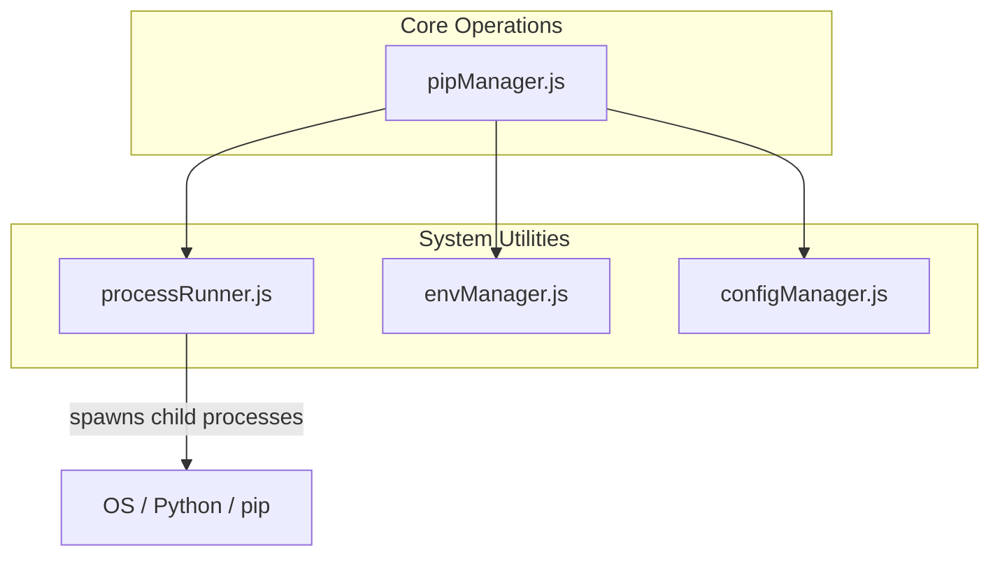
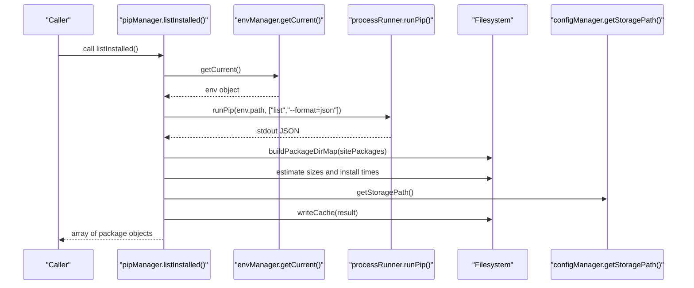
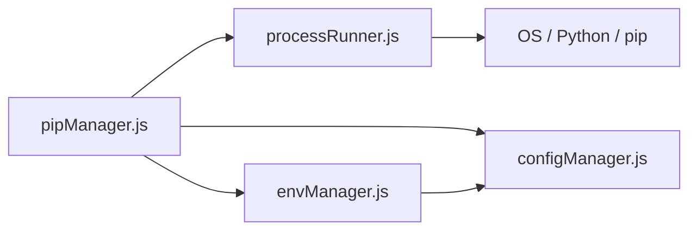
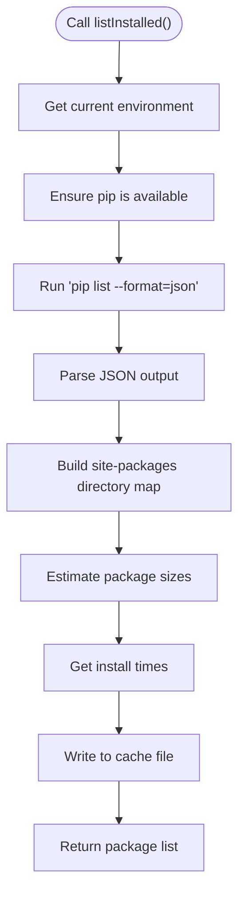
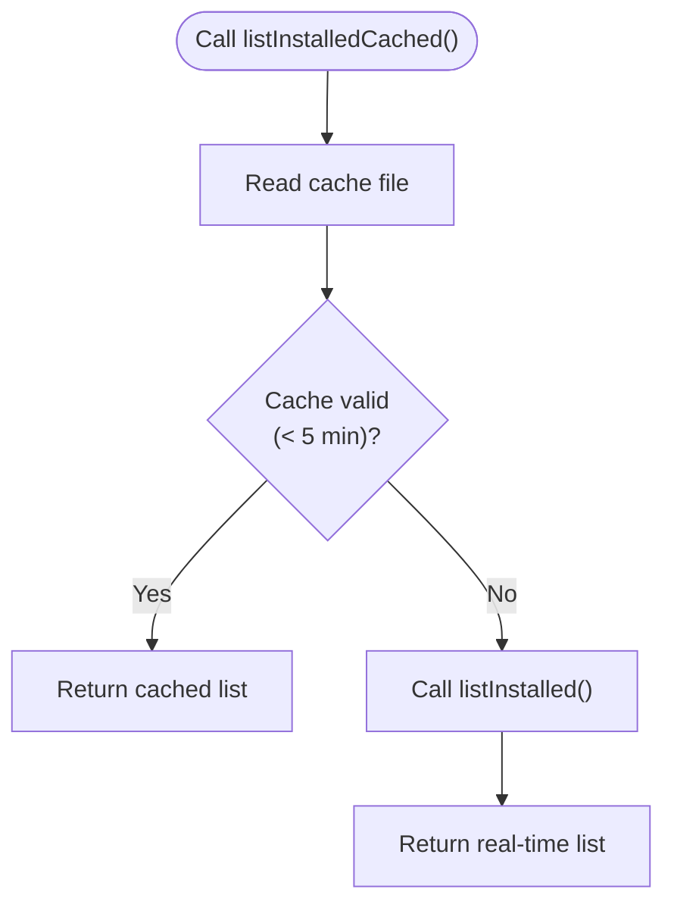

# Package Query API

<cite>
**Referenced Files in This Document**
- [pipManager.js](file://core/operations/pipManager.js)
- [processRunner.js](file://utils/processRunner.js)
- [envManager.js](file://core/system/envManager.js)
- [configManager.js](file://core/config/configManager.js)
</cite>

## Table of Contents
1. [Introduction](#introduction)
2. [Project Structure](#project-structure)
3. [Core Components](#core-components)
4. [Architecture Overview](#architecture-overview)
5. [Detailed Component Analysis](#detailed-component-analysis)
6. [Dependency Analysis](#dependency-analysis)
7. [Performance Considerations](#performance-considerations)
8. [Troubleshooting Guide](#troubleshooting-guide)
9. [Conclusion](#conclusion)
10. [Appendices](#appendices)

## Introduction
This document provides comprehensive API documentation for the package query and search functionality exposed by the pip manager module. It focuses on:
- listInstalled(): real-time scanning of installed packages with size and installation time metadata
- listInstalledCached(): cached retrieval with a 5-minute TTL, falling back to real-time when needed
- listOutdated(): detection of outdated packages via pip’s outdated listing
- searchPackage(): PyPI integration using pip index versions (since pip search is disabled)

It also explains caching mechanisms, performance optimizations, error handling strategies, and provides practical usage examples through code snippet paths.

## Project Structure
The package query and search features are implemented primarily in the pip manager module, which orchestrates environment selection, pip execution, and local filesystem operations. Supporting modules provide process execution, environment discovery, and configuration management.

**Diagram sources**
- [pipManager.js:1-120](file://core/operations/pipManager.js#L1-L120)
- [processRunner.js:1-120](file://utils/processRunner.js#L1-L120)
- [envManager.js:1-60](file://core/system/envManager.js#L1-L60)
- [configManager.js:1-60](file://core/config/configManager.js#L1-L60)

**Section sources**
- [pipManager.js:1-120](file://core/operations/pipManager.js#L1-L120)
- [processRunner.js:1-120](file://utils/processRunner.js#L1-L120)
- [envManager.js:1-60](file://core/system/envManager.js#L1-L60)
- [configManager.js:1-60](file://core/config/configManager.js#L1-L60)

## Core Components
- pipManager.js: Implements listInstalled(), listInstalledCached(), listOutdated(), searchPackage(), and supporting utilities for size/time estimation, caching, and directory mapping.
- processRunner.js: Provides runPip(), ensurePip(), and robust subprocess execution with timeouts, cancellation, and output streaming.
- envManager.js: Discovers and manages current Python environments; used to select target environment for pip commands.
- configManager.js: Manages storage path and application settings; used to locate cache files.

Key responsibilities:
- Real-time vs cached data retrieval
- Size and install time estimation from site-packages
- Outdated package detection via pip
- PyPI search via pip index versions
- Error handling for invalid inputs, network failures, and environment issues

**Section sources**
- [pipManager.js:392-490](file://core/operations/pipManager.js#L392-L490)
- [processRunner.js:340-342](file://utils/processRunner.js#L340-L342)
- [envManager.js:178-184](file://core/system/envManager.js#L178-L184)
- [configManager.js:185-191](file://core/config/configManager.js#L185-L191)

## Architecture Overview
The query/search APIs follow a layered architecture:
- API layer: pipManager functions expose high-level interfaces
- Environment layer: envManager selects the active Python environment
- Execution layer: processRunner executes pip commands safely with timeouts and cancellation
- Storage layer: configManager resolves storage paths for cache files; local filesystem caches results

**Diagram sources**
- [pipManager.js:400-427](file://core/operations/pipManager.js#L400-L427)
- [envManager.js:178-184](file://core/system/envManager.js#L178-L184)
- [processRunner.js:340-342](file://utils/processRunner.js#L340-L342)
- [configManager.js:185-191](file://core/config/configManager.js#L185-L191)

## Detailed Component Analysis

### listInstalled()
Purpose:
- Performs a real-time scan of installed packages using pip list --format=json
- Estimates each package’s disk size and approximate installation date from site-packages
- Writes results to a persistent cache file for future use

Parameters:
- None

Return value schema:
- Array of objects with fields:
  - name: string (package name)
  - version: string (installed version)
  - installed: string (YYYY-MM-DD installation date or empty)
  - size: number (size in MB, rounded to one decimal)
  - sizeText: string (human-readable size like “12.3 MB” or “123.4 KB”)
  - source: string (always “pypi.org” for locally installed packages)

Behavior details:
- Validates current environment; throws if none selected
- Ensures pip availability via ensurePip
- Builds a site-packages directory map once to avoid repeated scans
- Uses a size cache to prevent redundant folder size calculations
- Persists result to cache file under storage path

Error handling:
- Throws if no Python environment selected
- Logs errors during directory mapping and size calculation but continues processing
- Catches and logs cache read/write failures

Performance considerations:
- O(N) over installed packages for list parsing
- Directory map built once per call
- Folder size computation uses recursion with depth limit and symlink skipping
- Cache avoids repeated I/O on subsequent calls

Code snippet paths:
- [listInstalled implementation:400-427](file://core/operations/pipManager.js#L400-L427)
- [site-packages path resolution:244-261](file://core/operations/pipManager.js#L244-L261)
- [directory map builder:278-300](file://core/operations/pipManager.js#L278-L300)
- [folder size calculator:314-332](file://core/operations/pipManager.js#L314-L332)
- [install time estimator:341-358](file://core/operations/pipManager.js#L341-L358)
- [size estimator:369-389](file://core/operations/pipManager.js#L369-L389)
- [cache write:120-127](file://core/operations/pipManager.js#L120-L127)

**Section sources**
- [pipManager.js:400-427](file://core/operations/pipManager.js#L400-L427)
- [pipManager.js:244-389](file://core/operations/pipManager.js#L244-L389)
- [pipManager.js:120-127](file://core/operations/pipManager.js#L120-L127)

### listInstalledCached()
Purpose:
- Returns cached installed package list if available and not expired (TTL 5 minutes)
- Falls back to listInstalled() when cache is missing or expired

Parameters:
- None

Return value schema:
- Same as listInstalled()

Behavior details:
- Reads cache file from storage path
- Checks timestamp against 5-minute TTL
- If valid, returns cached list immediately
- Otherwise, invokes listInstalled() and writes new cache

Error handling:
- Gracefully handles corrupted or unreadable cache files
- Logs errors without failing the operation

Performance considerations:
- Near-instant response when cache is fresh
- Avoids expensive filesystem scans and pip calls

Code snippet paths:
- [listInstalledCached implementation:435-439](file://core/operations/pipManager.js#L435-L439)
- [readCache with TTL:99-114](file://core/operations/pipManager.js#L99-L114)
- [getCacheFile path:90-93](file://core/operations/pipManager.js#L90-L93)

**Section sources**
- [pipManager.js:435-439](file://core/operations/pipManager.js#L435-L439)
- [pipManager.js:99-114](file://core/operations/pipManager.js#L99-L114)
- [pipManager.js:90-93](file://core/operations/pipManager.js#L90-L93)

### listOutdated()
Purpose:
- Retrieves a list of packages with newer versions available via pip list --outdated --format=json

Parameters:
- None

Return value schema:
- Array of objects with fields:
  - name: string (package name)
  - current: string (currently installed version)
  - latest: string (latest available version)
  - date: string (empty placeholder; could be extended later)

Behavior details:
- Validates current environment; throws if none selected
- Ensures pip availability
- Parses JSON output and maps fields accordingly

Error handling:
- Throws if no Python environment selected
- Network or pip command failures propagate as exceptions

Performance considerations:
- Single pip call; minimal transformation overhead

Code snippet paths:
- [listOutdated implementation:446-459](file://core/operations/pipManager.js#L446-L459)

**Section sources**
- [pipManager.js:446-459](file://core/operations/pipManager.js#L446-L459)

### searchPackage()
Purpose:
- Searches PyPI for packages using pip index versions (since pip search is disabled)
- Returns raw text output or error information

Parameters:
- keyword: string (non-empty, max 200 characters, must match package name pattern)

Return value schema:
- Object with fields:
  - keyword: string (the searched keyword)
  - result: string (raw pip index versions output or empty string)
  - error?: string (present only if an error occurred)

Behavior details:
- Validates input length and format
- Ensures current environment and pip availability
- Executes pip index versions with timeout and ignoreExitCode flag
- Catches errors and returns structured result with error message

Error handling:
- Throws for invalid keywords or missing environment
- Network failures return structured error in result object

Performance considerations:
- Short timeout (30 seconds)
- No heavy transformations; returns raw output for caller interpretation

Code snippet paths:
- [searchPackage implementation:468-490](file://core/operations/pipManager.js#L468-L490)

**Section sources**
- [pipManager.js:468-490](file://core/operations/pipManager.js#L468-L490)

## Dependency Analysis
The query/search APIs depend on several internal modules:

- pipManager.js depends on:
  - processRunner.js for pip execution and subprocess management
  - envManager.js for environment selection
  - configManager.js for storage path resolution
- processRunner.js interacts directly with the OS to spawn Python/pip processes
- envManager.js may reference configManager.js for persisted environment selection

Potential circular dependencies:
- None detected; dependencies are unidirectional

External dependencies:
- Node.js fs, path, os, https, http modules
- strip-ansi for terminal output cleaning
- glob for environment discovery

**Diagram sources**
- [pipManager.js:1-120](file://core/operations/pipManager.js#L1-L120)
- [processRunner.js:1-120](file://utils/processRunner.js#L1-L120)
- [envManager.js:1-60](file://core/system/envManager.js#L1-L60)
- [configManager.js:1-60](file://core/config/configManager.js#L1-L60)

**Section sources**
- [pipManager.js:1-120](file://core/operations/pipManager.js#L1-L120)
- [processRunner.js:1-120](file://utils/processRunner.js#L1-L120)
- [envManager.js:1-60](file://core/system/envManager.js#L1-L60)
- [configManager.js:1-60](file://core/config/configManager.js#L1-L60)

## Performance Considerations
- Caching strategy:
  - Installed package list cached with 5-minute TTL to reduce frequent scans
  - site-packages path cached with 30-second TTL to avoid repeated pip show calls
  - Folder size computation cached per directory to prevent redundant traversal
- Parallelism:
  - Not used in query functions; parallelism is reserved for install/update operations
- Timeouts:
  - pip commands have appropriate timeouts (e.g., 60s for list, 120s for outdated, 30s for search)
- Memory usage:
  - Directory map and size cache stored in memory during a single operation lifecycle
- I/O optimization:
  - Single pass over site-packages to build directory map
  - Symbolic links skipped to avoid infinite loops
- Recommendations:
  - Use listInstalledCached() for UI refreshes to minimize latency
  - Batch operations where possible (e.g., multiple package queries)
  - Clear caches selectively if environment changes frequently

[No sources needed since this section provides general guidance]

## Troubleshooting Guide
Common issues and resolutions:
- No Python environment selected:
  - Ensure an environment is set via envManager.switchEnvironment()
  - Verify environment exists and has pip installed
- pip not available:
  - ensurePip will attempt automatic installation via ensurepip or get-pip.py
  - Manual installation may be required if automatic methods fail
- Network failures during search or outdated checks:
  - searchPackage() returns structured error in result object
  - listOutdated() throws exception; handle and retry with backoff
- Invalid inputs:
  - searchPackage() validates keyword format and length; adjust input accordingly
  - Package names must match allowed patterns
- Corrupted cache:
  - readCache() logs errors and returns null; fallback to real-time scan
- Disk space analysis inaccuracies:
  - Large directories or permission issues may cause incomplete size estimates
  - Check logs for specific directory errors

Code snippet paths:
- [error handling in readCache/writeCache:99-127](file://core/operations/pipManager.js#L99-L127)
- [ensurePip logic:233-278](file://utils/processRunner.js#L233-L278)
- [searchPackage validation and error capture:468-490](file://core/operations/pipManager.js#L468-L490)
- [listOutdated error propagation:446-459](file://core/operations/pipManager.js#L446-L459)

**Section sources**
- [pipManager.js:99-127](file://core/operations/pipManager.js#L99-L127)
- [processRunner.js:233-278](file://utils/processRunner.js#L233-L278)
- [pipManager.js:468-490](file://core/operations/pipManager.js#L468-L490)
- [pipManager.js:446-459](file://core/operations/pipManager.js#L446-L459)

## Conclusion
The package query and search APIs provide robust, efficient, and user-friendly interfaces for managing Python packages. They combine real-time scanning with intelligent caching, offer detailed metadata including size and installation time, and integrate with PyPI for package discovery. Comprehensive error handling ensures resilience against network and environment issues, while performance optimizations keep responses fast and resource usage low.

[No sources needed since this section summarizes without analyzing specific files]

## Appendices

### Practical Usage Examples (Code Snippet Paths)
- List installed packages with size and time info:
  - [listInstalled usage:400-427](file://core/operations/pipManager.js#L400-L427)
- Cached vs real-time queries:
  - [listInstalledCached flow:435-439](file://core/operations/pipManager.js#L435-L439)
  - [readCache TTL logic:99-114](file://core/operations/pipManager.js#L99-L114)
- Outdated package detection:
  - [listOutdated implementation:446-459](file://core/operations/pipManager.js#L446-L459)
- PyPI package search:
  - [searchPackage implementation:468-490](file://core/operations/pipManager.js#L468-L490)

### Data Flow Diagrams

#### Installed Package Listing Flow

**Diagram sources**
- [pipManager.js:400-427](file://core/operations/pipManager.js#L400-L427)
- [pipManager.js:278-300](file://core/operations/pipManager.js#L278-L300)
- [pipManager.js:314-332](file://core/operations/pipManager.js#L314-L332)
- [pipManager.js:341-358](file://core/operations/pipManager.js#L341-L358)
- [pipManager.js:120-127](file://core/operations/pipManager.js#L120-L127)

#### Cached Retrieval Flow

**Diagram sources**
- [pipManager.js:435-439](file://core/operations/pipManager.js#L435-L439)
- [pipManager.js:99-114](file://core/operations/pipManager.js#L99-L114)

[No sources needed since these diagrams show conceptual workflows based on actual code structure]