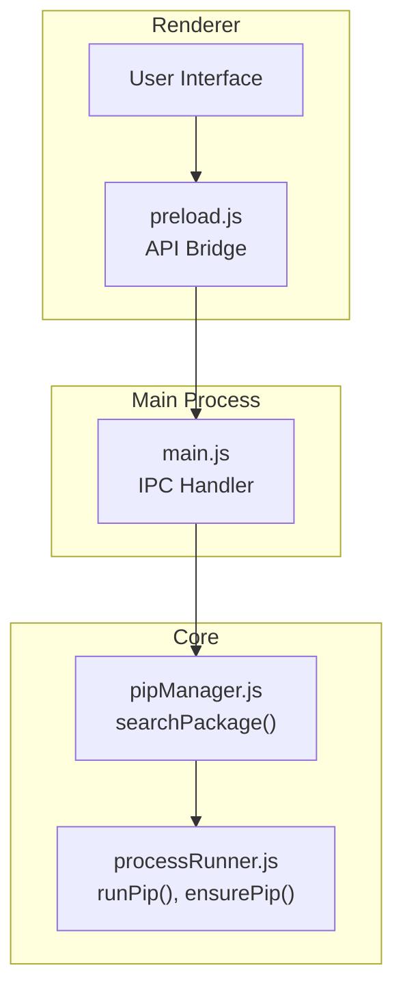
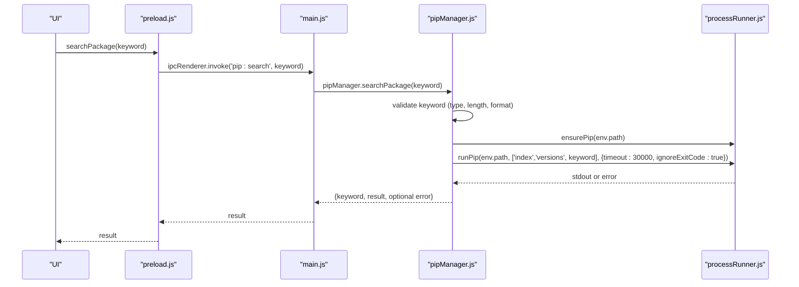
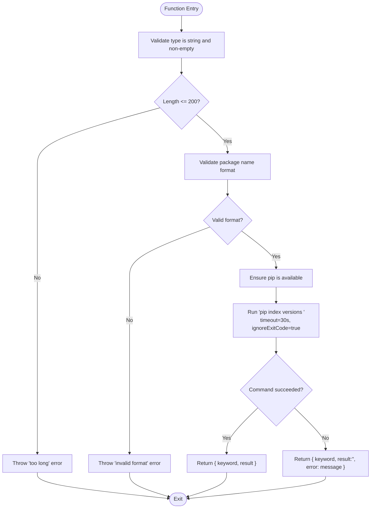
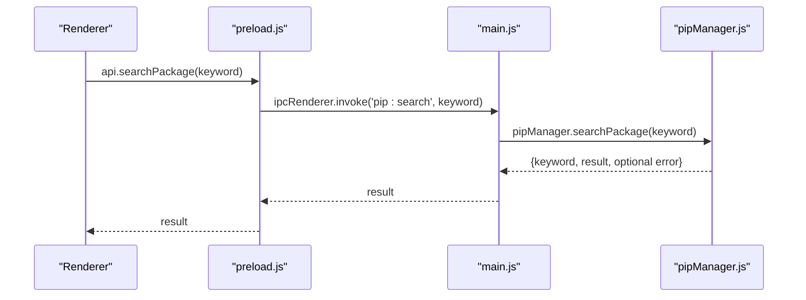
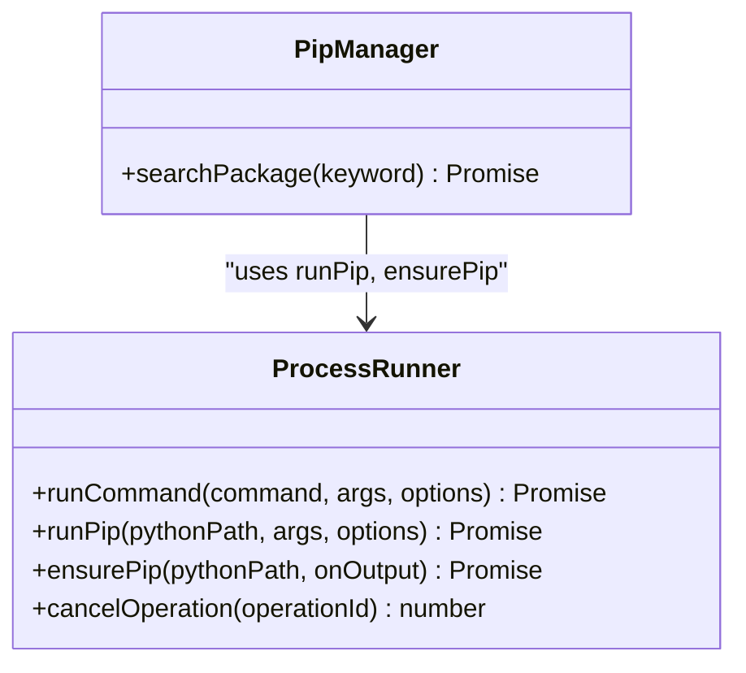

# Search Package API

<cite>
**Referenced Files in This Document**
- [pipManager.js](file://core/operations/pipManager.js)
- [processRunner.js](file://utils/processRunner.js)
- [main.js](file://main.js)
- [preload.js](file://preload.js)
</cite>

## Table of Contents
1. [Introduction](#introduction)
2. [Project Structure](#project-structure)
3. [Core Components](#core-components)
4. [Architecture Overview](#architecture-overview)
5. [Detailed Component Analysis](#detailed-component-analysis)
6. [Dependency Analysis](#dependency-analysis)
7. [Performance Considerations](#performance-considerations)
8. [Troubleshooting Guide](#troubleshooting-guide)
9. [Conclusion](#conclusion)
10. [Appendices](#appendices)

## Introduction
This document provides comprehensive API documentation for the searchPackage() function, which searches PyPI packages using pip index versions as a replacement for the deprecated pip search command. It covers input validation rules (keyword length and format), return value schema, timeout handling, network error management, fallback behavior when pip index versions is unavailable, and practical usage examples for integration with package discovery interfaces.

## Project Structure
The search functionality spans multiple layers:
- Renderer process exposes an API bridge to call searchPackage via Electron IPC.
- Main process handles the IPC channel and delegates to the core module.
- Core module implements searchPackage and executes pip commands through a robust process runner.

**Diagram sources**
- [preload.js:40-56](file://preload.js#L40-L56)
- [main.js:285-295](file://main.js#L285-L295)
- [pipManager.js:461-490](file://pipManager.js#L461-L490)
- [processRunner.js:340-342](file://processRunner.js#L340-L342)

**Section sources**
- [preload.js:40-56](file://preload.js#L40-L56)
- [main.js:285-295](file://main.js#L285-L295)
- [pipManager.js:461-490](file://pipManager.js#L461-L490)
- [processRunner.js:340-342](file://processRunner.js#L340-L342)

## Core Components
- searchPackage(keyword): Validates input, ensures pip availability, runs pip index versions, and returns a structured result object.
- runPip(pythonPath, args, options): Executes pip commands with timeout, ANSI stripping, and error propagation.
- ensurePip(pythonPath, onOutput): Ensures pip is available; attempts auto-install if missing.

Key responsibilities:
- Input validation enforces type, length, and format constraints.
- Network operations are wrapped with timeouts and error handling.
- Fallback behavior returns empty results with an error message when pip index versions is unsupported or fails.

**Section sources**
- [pipManager.js:461-490](file://pipManager.js#L461-L490)
- [processRunner.js:340-342](file://processRunner.js#L340-L342)
- [processRunner.js:233-278](file://processRunner.js#L233-L278)

## Architecture Overview
The search flow uses Electron IPC to bridge renderer calls to the main process, which invokes the core search implementation that executes pip index versions.

**Diagram sources**
- [preload.js:45](file://preload.js#L45)
- [main.js:291](file://main.js#L291)
- [pipManager.js:468-490](file://pipManager.js#L468-L490)
- [processRunner.js:340-342](file://processRunner.js#L340-L342)

## Detailed Component Analysis

### searchPackage(keyword)
Purpose:
- Validate the search keyword.
- Ensure pip is available in the selected Python environment.
- Execute pip index versions to retrieve package version information from PyPI.
- Return a structured result including the original keyword, raw result text, and optional error field.

Input validation:
- Type check: must be a non-empty string.
- Length limit: maximum 200 characters.
- Format validation: must match the allowed package name pattern (letters, digits, dots, hyphens, underscores).

Return value schema:
- keyword: string (the validated input)
- result: string (raw output from pip index versions)
- error?: string (present only when an error occurs during execution)

Timeout and error handling:
- Timeout: 30 seconds for the pip index versions command.
- On success: returns { keyword, result }.
- On failure: returns { keyword, result: '', error: err.message }.

Fallback mechanism:
- If pip index versions is unavailable or fails, the function does not throw; it returns an empty result with an error message.

Practical usage examples:
- Constructing a search query: pass a valid package name string within 200 characters.
- Parsing results: treat result as raw text; parse according to pip’s output format.
- Error handling: check for the presence of the error field to handle unsupported pip versions or network issues.
- Integration: use the returned object to update UI elements or log diagnostics.

Limitations and alternatives:
- The search relies on pip index versions, which may not provide full-text search capabilities like the deprecated pip search.
- For comprehensive searching, consider alternative approaches such as querying PyPI JSON API directly or using third-party tools.

**Diagram sources**
- [pipManager.js:468-490](file://pipManager.js#L468-L490)

**Section sources**
- [pipManager.js:461-490](file://pipManager.js#L461-L490)

### IPC Bridge and Handler
- preload.js exposes searchPackage to the renderer by invoking the 'pip:search' channel.
- main.js registers the handler that forwards the request to pipManager.searchPackage.

**Diagram sources**
- [preload.js:45](file://preload.js#L45)
- [main.js:291](file://main.js#L291)
- [pipManager.js:468-490](file://pipManager.js#L468-L490)

**Section sources**
- [preload.js:40-56](file://preload.js#L40-L56)
- [main.js:285-295](file://main.js#L285-L295)

### Process Runner Integration
- runPip wraps python -m pip with robust process management, including timeout, ANSI stripping, and error propagation.
- ensurePip guarantees pip availability, attempting installation if necessary.

**Diagram sources**
- [processRunner.js:340-342](file://processRunner.js#L340-L342)
- [processRunner.js:233-278](file://processRunner.js#L233-L278)
- [pipManager.js:468-490](file://pipManager.js#L468-L490)

**Section sources**
- [processRunner.js:85-161](file://processRunner.js#L85-L161)
- [processRunner.js:233-278](file://processRunner.js#L233-L278)
- [processRunner.js:340-342](file://processRunner.js#L340-L342)

## Dependency Analysis
- searchPackage depends on:
  - Environment selection to determine the active Python path.
  - ensurePip to guarantee pip availability.
  - runPip to execute pip index versions with a 30-second timeout.
- The IPC layer connects renderer to main and then to the core module.

**Diagram sources**
- [pipManager.js:468-490](file://pipManager.js#L468-L490)
- [processRunner.js:340-342](file://processRunner.js#L340-L342)

**Section sources**
- [pipManager.js:468-490](file://pipManager.js#L468-L490)
- [processRunner.js:340-342](file://processRunner.js#L340-L342)

## Performance Considerations
- Timeouts: The search command has a 30-second timeout to prevent hanging operations.
- Output processing: ANSI sequences are stripped to keep outputs clean.
- Pip readiness caching: ensurePip caches pip availability to reduce repeated checks.
- Minimal overhead: searchPackage performs lightweight validation and direct pip invocation without heavy parsing.

[No sources needed since this section provides general guidance]

## Troubleshooting Guide
Common issues and resolutions:
- Invalid keyword type or empty string: Ensure the input is a non-empty string.
- Keyword too long: Limit input to 200 characters.
- Invalid package name format: Use only allowed characters (letters, digits, dots, hyphens, underscores).
- No Python environment selected: Configure and select a valid Python environment before searching.
- pip not available: allow ensurePip to attempt installation; otherwise install pip manually.
- Unsupported pip version or disabled feature: Expect an error field in the result; consider upgrading pip or using alternative search methods.
- Network errors: Check connectivity and mirror settings; the function returns an error message in the result.

**Section sources**
- [pipManager.js:468-490](file://pipManager.js#L468-L490)
- [processRunner.js:233-278](file://processRunner.js#L233-L278)

## Conclusion
The searchPackage() function provides a reliable way to search PyPI packages using pip index versions, replacing the deprecated pip search. It enforces strict input validation, manages timeouts and errors gracefully, and returns a consistent result schema suitable for integration into package discovery interfaces. When pip index versions is unavailable, it falls back to returning empty results with an error message, enabling callers to handle unsupported environments gracefully.

[No sources needed since this section summarizes without analyzing specific files]

## Appendices

### Parameter Specifications
- keyword: string
  - Must be non-empty.
  - Maximum length: 200 characters.
  - Must match the allowed package name pattern.

### Return Value Schema
- keyword: string
- result: string (raw output from pip index versions)
- error?: string (optional; present when an error occurs)

### Practical Examples
- Search query construction: Pass a valid package name string within the length and format limits.
- Result parsing: Treat result as raw text; parse based on pip’s output format.
- Error handling: Inspect the error field to detect unsupported pip versions or network failures.
- Integration: Update UI components with the returned object; display messages based on the presence of error.

[No sources needed since this section provides general guidance]