# Package Uninstallation API

<cite>
**Referenced Files in This Document**
- [pipManager.js](file://core/operations/pipManager.js)
- [backupManager.js](file://core/operations/backupManager.js)
- [undoManager.js](file://core/operations/undoManager.js)
- [processRunner.js](file://utils/processRunner.js)
- [envManager.js](file://core/system/envManager.js)
- [security.js](file://utils/security.js)
- [operations.js](file://renderer/js/operations.js)
</cite>

## Table of Contents
1. [Introduction](#introduction)
2. [Project Structure](#project-structure)
3. [Core Components](#core-components)
4. [Architecture Overview](#architecture-overview)
5. [Detailed Component Analysis](#detailed-component-analysis)
6. [Dependency Analysis](#dependency-analysis)
7. [Performance Considerations](#performance-considerations)
8. [Troubleshooting Guide](#troubleshooting-guide)
9. [Conclusion](#conclusion)
10. [Appendices](#appendices)

## Introduction
This document provides comprehensive API documentation for the package uninstallation functionality, focusing on the uninstallPackages() function. It explains parameters (packages array, options object with force, backup, rollback), safe mode behavior, dependency conflict handling, automatic backup and rollback mechanisms, input validation, security against command injection, environment locking to prevent concurrent operations, error handling patterns, progress reporting, and operation tracking. Practical usage examples are included for single package removal, batch uninstallation, force uninstallation, and recovery scenarios.

## Project Structure
The uninstallation feature is implemented across several modules:
- Core uninstall logic and orchestration: pipManager.js
- Backup creation and restoration: backupManager.js
- Undo stack integration for reversibility: undoManager.js
- Process execution, timeouts, cancellation, and pip availability: processRunner.js
- Python environment selection and management: envManager.js
- Security utilities for path safety: security.js
- Frontend operations that call the uninstall API: operations.js

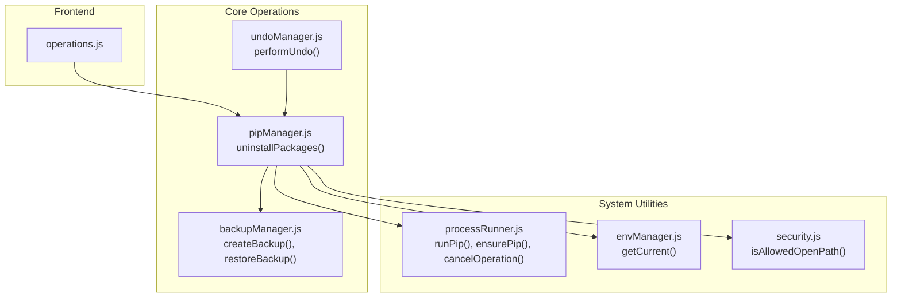

**Diagram sources**
- [pipManager.js:745-789](file://core/operations/pipManager.js#L745-L789)
- [backupManager.js:89-113](file://core/operations/backupManager.js#L89-L113)
- [backupManager.js:156-170](file://core/operations/backupManager.js#L156-L170)
- [processRunner.js:340-342](file://utils/processRunner.js#L340-L342)
- [processRunner.js:233-278](file://utils/processRunner.js#L233-L278)
- [envManager.js:178-184](file://core/system/envManager.js#L178-L184)
- [security.js:28-40](file://utils/security.js#L28-L40)
- [operations.js:80-113](file://renderer/js/operations.js#L80-L113)

**Section sources**
- [pipManager.js:745-789](file://core/operations/pipManager.js#L745-L789)
- [backupManager.js:89-113](file://core/operations/backupManager.js#L89-L113)
- [processRunner.js:340-342](file://utils/processRunner.js#L340-L342)
- [envManager.js:178-184](file://core/system/envManager.js#L178-L184)
- [operations.js:80-113](file://renderer/js/operations.js#L80-L113)

## Core Components
- uninstallPackages(packages, options = {}, onOutput): Orchestrates safe uninstallation with optional backup and rollback, validates inputs, locks the environment, executes pip uninstall, logs outcomes, and returns results.
- backupManager.createBackup(env): Creates a snapshot of the current environment using pip freeze.
- backupManager.restoreBackup(backupId, env, onOutput): Restores the environment from a backup file using pip install -r with force-reinstall and no-deps.
- processRunner.runPip(pythonPath, args, options): Executes pip commands with timeout, cancellation, and output streaming.
- processRunner.ensurePip(pythonPath, onOutput): Ensures pip is available by auto-installing if missing.
- envManager.getCurrent(): Returns the selected Python environment used for operations.
- undoManager.performUndo(onOutput): Reverses previous operations; for uninstall it reinstalls packages with their recorded versions.

Key behaviors:
- Input validation: Enforces valid package names via regex; rejects invalid or empty inputs.
- Environment locking: Prevents concurrent operations on the same Python environment.
- Automatic backup: Optional backup creation before uninstall when options.backup or options.rollback is enabled.
- Automatic rollback: On failure, restores the environment from the created backup when autoRollback is true.
- Progress reporting: Uses onOutput callback to emit structured progress events and status messages.
- Operation tracking: Generates unique operation IDs and logs actions for auditability.

**Section sources**
- [pipManager.js:745-789](file://core/operations/pipManager.js#L745-L789)
- [backupManager.js:89-113](file://core/operations/backupManager.js#L89-L113)
- [backupManager.js:156-170](file://core/operations/backupManager.js#L156-L170)
- [processRunner.js:340-342](file://utils/processRunner.js#L340-L342)
- [processRunner.js:233-278](file://utils/processRunner.js#L233-L278)
- [envManager.js:178-184](file://core/system/envManager.js#L178-L184)
- [undoManager.js:66-106](file://core/operations/undoManager.js#L66-L106)

## Architecture Overview
The uninstall flow integrates multiple components to ensure safety, reliability, and observability.

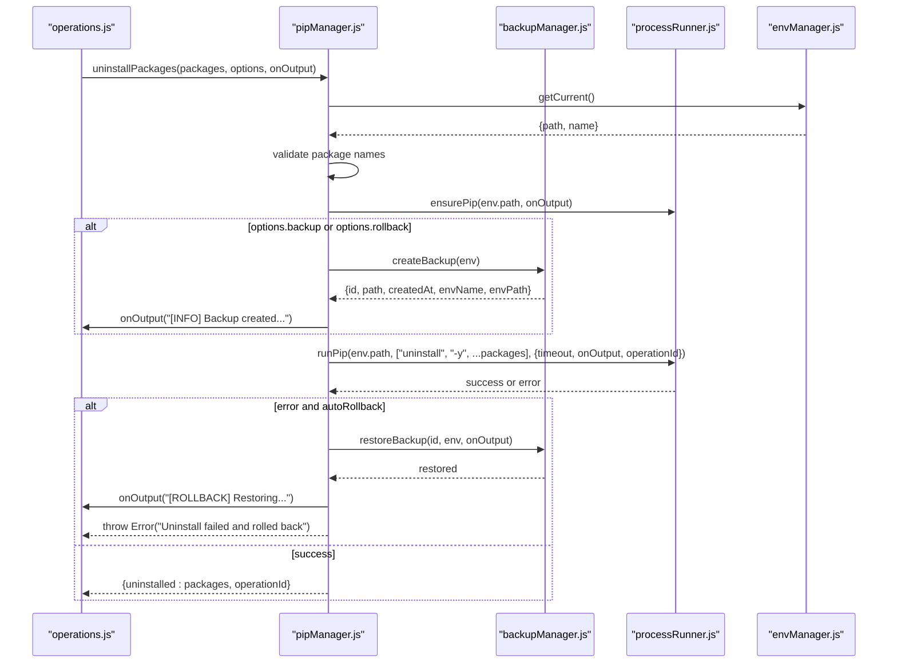

**Diagram sources**
- [pipManager.js:745-789](file://core/operations/pipManager.js#L745-L789)
- [backupManager.js:89-113](file://core/operations/backupManager.js#L89-L113)
- [backupManager.js:156-170](file://core/operations/backupManager.js#L156-L170)
- [processRunner.js:340-342](file://utils/processRunner.js#L340-L342)
- [processRunner.js:233-278](file://utils/processRunner.js#L233-L278)
- [envManager.js:178-184](file://core/system/envManager.js#L178-L184)
- [operations.js:80-113](file://renderer/js/operations.js#L80-L113)

## Detailed Component Analysis

### uninstallPackages() API
- Purpose: Safely uninstall one or more packages from the selected Python environment.
- Parameters:
  - packages: Array of strings representing package names to uninstall. Each must match the allowed pattern (alphanumeric, dots, hyphens, underscores).
  - options: Object with the following keys:
    - force: Boolean. When true, adds additional flags to suppress warnings during uninstall.
    - backup: Boolean. When true, creates a backup before uninstalling.
    - rollback: Boolean. Defaults to true unless explicitly set to false. If true and uninstall fails, automatically restores from the created backup.
    - operationId: String. Unique identifier for tracking and cancellation.
  - onOutput: Function(text, type). Callback invoked for progress and status updates. Type can be 'stdout', 'stderr', or 'progress'.
- Behavior:
  - Validates environment selection and package names.
  - Acquires an environment lock to prevent concurrent operations.
  - Ensures pip is available.
  - Optionally creates a backup using pip freeze.
  - Executes pip uninstall with appropriate arguments.
  - Logs success/failure and returns result.
  - On failure with autoRollback enabled, restores the environment from the backup and throws an error indicating rollback occurred.
- Return value: Promise resolving to { uninstalled: string[], operationId }.
- Errors: Throws errors for invalid inputs, missing environment, pip unavailability, or uninstall failures (with rollback details when applicable).

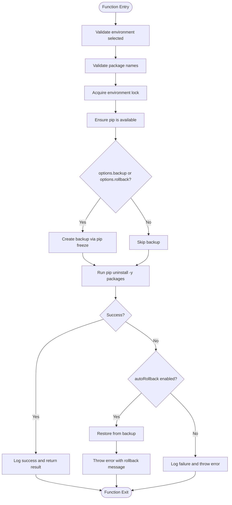

**Diagram sources**
- [pipManager.js:745-789](file://core/operations/pipManager.js#L745-L789)
- [backupManager.js:89-113](file://core/operations/backupManager.js#L89-L113)
- [backupManager.js:156-170](file://core/operations/backupManager.js#L156-L170)
- [processRunner.js:340-342](file://utils/processRunner.js#L340-L342)

**Section sources**
- [pipManager.js:745-789](file://core/operations/pipManager.js#L745-L789)

### Safe Mode Uninstallation
- Safe mode ensures only specified packages are targeted for uninstallation without affecting unrelated dependencies. The implementation validates package names strictly and constructs pip uninstall arguments directly from the provided list.
- Dependency conflicts are not automatically resolved by uninstallPackages(); users should use checkConflicts() to detect issues prior to uninstallation.

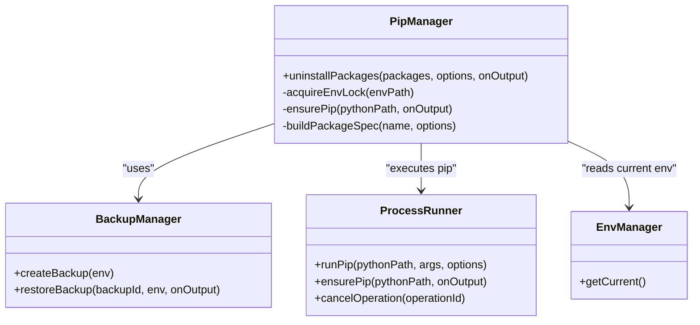

**Diagram sources**
- [pipManager.js:745-789](file://core/operations/pipManager.js#L745-L789)
- [backupManager.js:89-113](file://core/operations/backupManager.js#L89-L113)
- [processRunner.js:340-342](file://utils/processRunner.js#L340-L342)
- [envManager.js:178-184](file://core/system/envManager.js#L178-L184)

**Section sources**
- [pipManager.js:745-789](file://core/operations/pipManager.js#L745-L789)

### Dependency Conflict Handling
- Use checkConflicts() to analyze the current environment for broken requirements or version mismatches before uninstalling packages.
- The function runs pip check and parses its output to identify conflicts, returning a structured report.

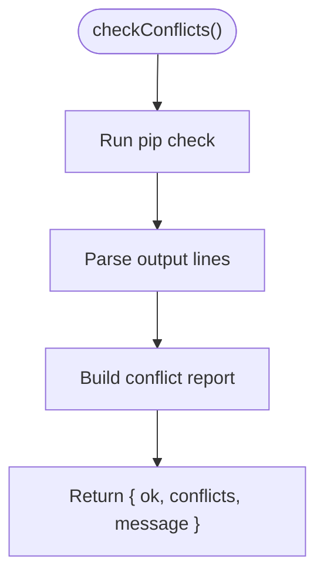

**Diagram sources**
- [pipManager.js:1460-1503](file://core/operations/pipManager.js#L1460-L1503)

**Section sources**
- [pipManager.js:1460-1503](file://core/operations/pipManager.js#L1460-L1503)

### Automatic Backup/Rollback Mechanisms
- Backup creation uses pip freeze to capture installed packages and versions into a timestamped file under the storage backups directory.
- Restoration uses pip install -r with --force-reinstall and --no-deps to reinstall exact versions without reinstalling dependencies.
- Rollback is triggered automatically when uninstall fails and autoRollback is enabled.

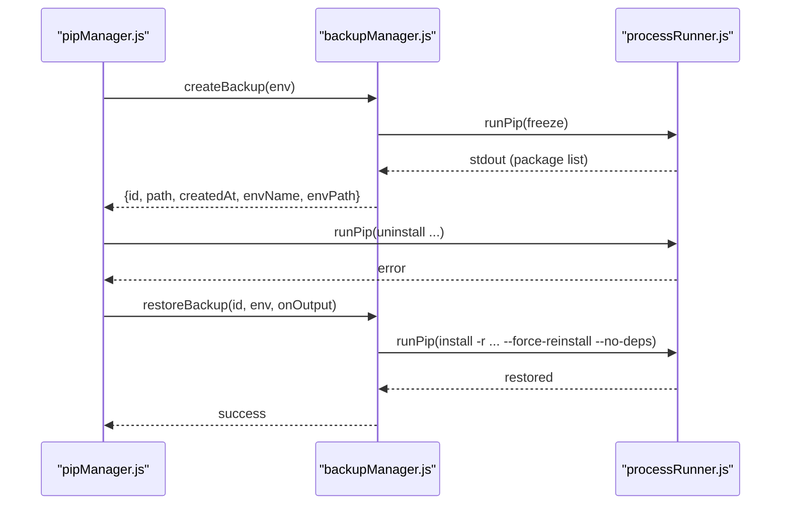

**Diagram sources**
- [backupManager.js:89-113](file://core/operations/backupManager.js#L89-L113)
- [backupManager.js:156-170](file://core/operations/backupManager.js#L156-L170)
- [pipManager.js:745-789](file://core/operations/pipManager.js#L745-L789)

**Section sources**
- [backupManager.js:89-113](file://core/operations/backupManager.js#L89-L113)
- [backupManager.js:156-170](file://core/operations/backupManager.js#L156-L170)
- [pipManager.js:745-789](file://core/operations/pipManager.js#L745-L789)

### Input Validation and Security Against Command Injection
- Package names are validated against a strict regex allowing only alphanumeric characters, dots, hyphens, and underscores. Invalid names cause immediate rejection.
- Wheel file paths (when used elsewhere in the module) undergo rigorous checks to prevent path traversal and UNC path access, ensuring absolute paths and disallowing sensitive directories.
- While uninstallPackages() primarily handles package names, the broader module enforces security through buildPackageSpec() and wheel path validation.

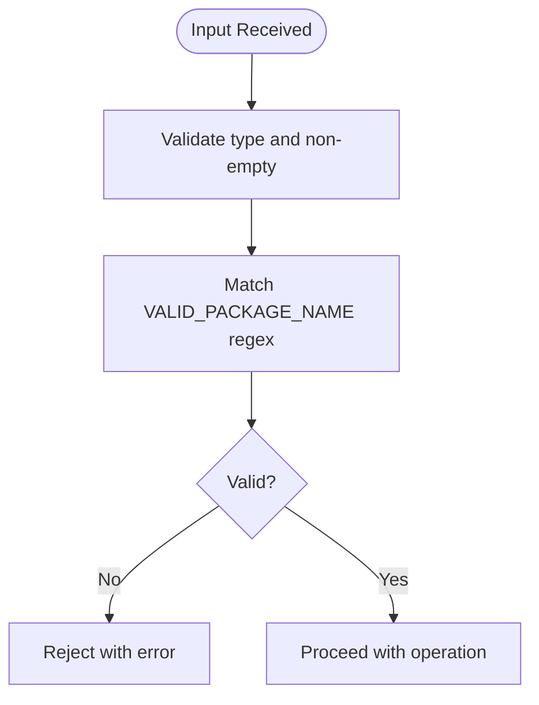

**Diagram sources**
- [pipManager.js:745-789](file://core/operations/pipManager.js#L745-L789)
- [pipManager.js:154-235](file://core/operations/pipManager.js#L154-L235)

**Section sources**
- [pipManager.js:745-789](file://core/operations/pipManager.js#L745-L789)
- [pipManager.js:154-235](file://core/operations/pipManager.js#L154-L235)

### Environment Locking to Prevent Concurrent Operations
- An environment-level mutex prevents simultaneous operations on the same Python environment. acquireEnvLock() waits for existing operations to complete before proceeding and releases the lock upon completion.
- This ensures data consistency and avoids race conditions during uninstallation.

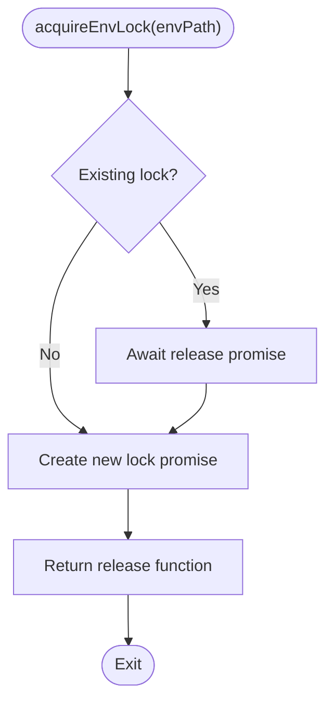

**Diagram sources**
- [pipManager.js:72-85](file://core/operations/pipManager.js#L72-L85)

**Section sources**
- [pipManager.js:72-85](file://core/operations/pipManager.js#L72-L85)

### Error Handling Patterns
- Errors thrown include validation failures, environment selection issues, pip unavailability, and uninstall failures.
- When autoRollback is enabled and uninstall fails, the system restores from backup and throws an error indicating rollback occurred.
- Logging captures action, status, type, and detail for audit trails.

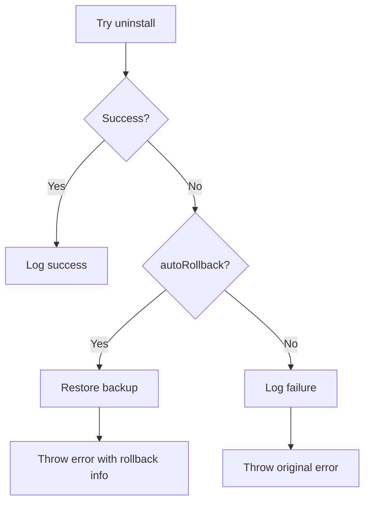

**Diagram sources**
- [pipManager.js:745-789](file://core/operations/pipManager.js#L745-L789)

**Section sources**
- [pipManager.js:745-789](file://core/operations/pipManager.js#L745-L789)

### Progress Reporting and Operation Tracking
- onOutput callback receives structured messages including progress events with done counts and statuses.
- Operation IDs are generated and passed to processRunner for cancellation support.
- Frontend operations.js manages progress state and displays notifications.

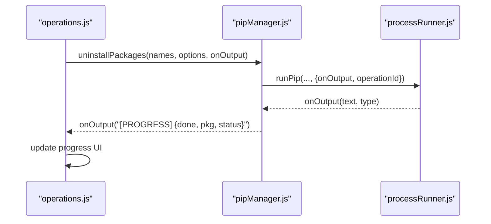

**Diagram sources**
- [pipManager.js:61-63](file://core/operations/pipManager.js#L61-L63)
- [operations.js:80-113](file://renderer/js/operations.js#L80-L113)
- [processRunner.js:340-342](file://utils/processRunner.js#L340-L342)

**Section sources**
- [pipManager.js:61-63](file://core/operations/pipManager.js#L61-L63)
- [operations.js:80-113](file://renderer/js/operations.js#L80-L113)

### Practical Code Examples
Note: These examples describe how to call the API based on the documented parameters and behavior. They do not include actual code content.

- Single package removal:
  - Call uninstallPackages with a single-element array containing the package name.
  - Options: { backup: true, rollback: true, operationId: generateOperationId() }.
  - Provide onOutput to receive progress and status messages.

- Batch uninstallation:
  - Pass an array of package names to uninstallPackages.
  - Options: { backup: true, rollback: true, operationId: generateOperationId() }.
  - Monitor onOutput for per-package progress events.

- Force uninstallation:
  - Set options.force to true to add flags suppressing warnings during uninstall.
  - Combine with backup and rollback for safety.

- Recovery scenario:
  - After a failed uninstall with rollback enabled, the environment is restored automatically.
  - Inspect logs for rollback details and reattempt uninstall after addressing underlying issues.

**Section sources**
- [operations.js:80-113](file://renderer/js/operations.js#L80-L113)
- [pipManager.js:745-789](file://core/operations/pipManager.js#L745-L789)

## Dependency Analysis
The uninstallation workflow depends on several modules with clear responsibilities:
- pipManager orchestrates the process and coordinates other modules.
- backupManager provides snapshot and restore capabilities.
- processRunner executes pip commands safely with timeouts and cancellation.
- envManager supplies the active Python environment context.
- security utilities enforce path safety where applicable.

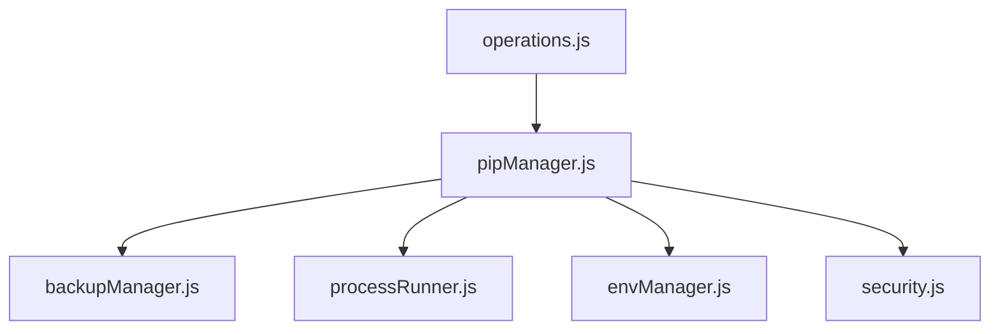

**Diagram sources**
- [pipManager.js:745-789](file://core/operations/pipManager.js#L745-L789)
- [backupManager.js:89-113](file://core/operations/backupManager.js#L89-L113)
- [processRunner.js:340-342](file://utils/processRunner.js#L340-L342)
- [envManager.js:178-184](file://core/system/envManager.js#L178-L184)
- [security.js:28-40](file://utils/security.js#L28-L40)
- [operations.js:80-113](file://renderer/js/operations.js#L80-L113)

**Section sources**
- [pipManager.js:745-789](file://core/operations/pipManager.js#L745-L789)
- [backupManager.js:89-113](file://core/operations/backupManager.js#L89-L113)
- [processRunner.js:340-342](file://utils/processRunner.js#L340-L342)
- [envManager.js:178-184](file://core/system/envManager.js#L178-L184)
- [security.js:28-40](file://utils/security.js#L28-L40)
- [operations.js:80-113](file://renderer/js/operations.js#L80-L113)

## Performance Considerations
- Environment locking serializes operations per environment to avoid concurrency issues.
- Backup creation uses pip freeze, which is efficient but may take time for large environments.
- Uninstall operations execute a single pip command; performance depends on the number of packages and system resources.
- Cancellation support allows interrupting long-running operations via operationId.

[No sources needed since this section provides general guidance]

## Troubleshooting Guide
Common issues and resolutions:
- No Python environment selected: Ensure a valid environment is chosen via envManager.getCurrent().
- Invalid package name: Verify package names match the allowed pattern; remove special characters.
- pip not available: ensurePip will attempt installation; if it fails, install pip manually.
- Uninstall failure with rollback: Check logs for detailed error messages; verify backup integrity and network connectivity for restoration.
- Concurrent operation conflicts: Wait for existing operations to complete; the environment lock ensures serialization.

**Section sources**
- [pipManager.js:745-789](file://core/operations/pipManager.js#L745-L789)
- [processRunner.js:233-278](file://utils/processRunner.js#L233-L278)
- [envManager.js:178-184](file://core/system/envManager.js#L178-L184)

## Conclusion
The uninstallPackages() API provides a robust, secure, and user-friendly mechanism for removing Python packages. It incorporates input validation, environment locking, automatic backup and rollback, progress reporting, and comprehensive logging. By leveraging supporting modules for backup management, process execution, and environment control, it ensures reliable uninstallation even in complex scenarios. Users can confidently perform single or batch uninstalls with safety features and recover from failures seamlessly.

[No sources needed since this section summarizes without analyzing specific files]

## Appendices
- Additional utilities:
  - checkConflicts(): Analyze dependency conflicts before uninstallation.
  - healthCheck(): Comprehensive environment diagnostics.
  - repairPip(): Repair pip if corrupted or missing.

[No sources needed since this section lists utilities without analyzing specific files]