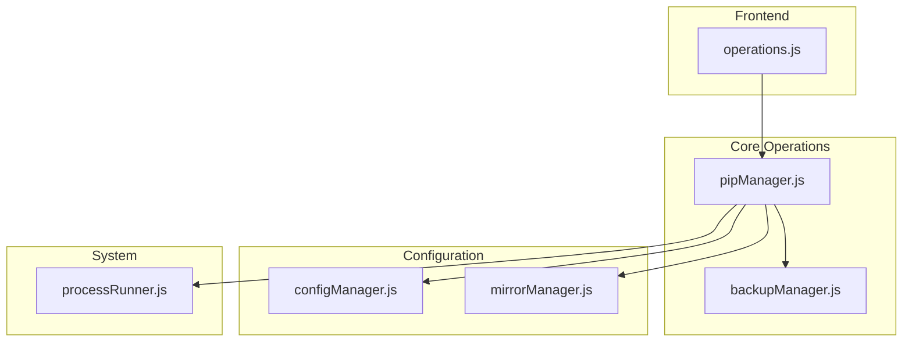
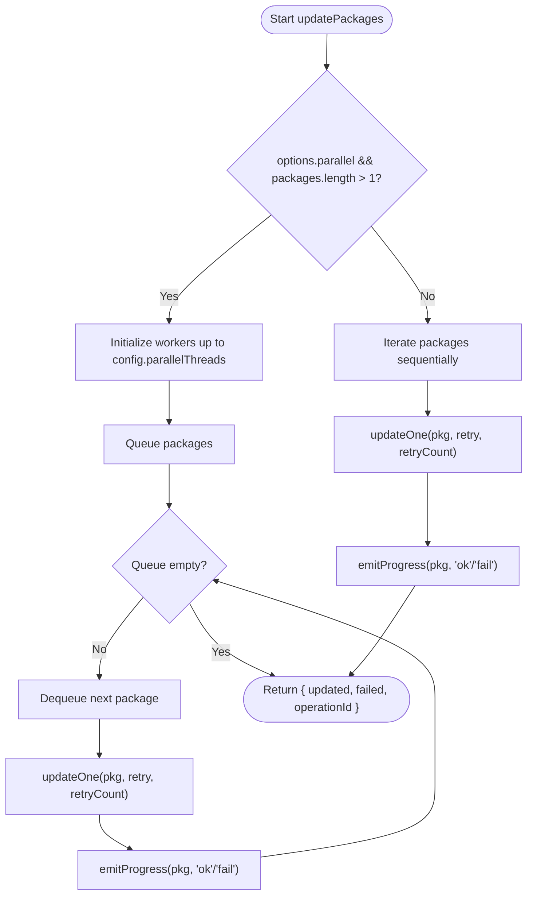
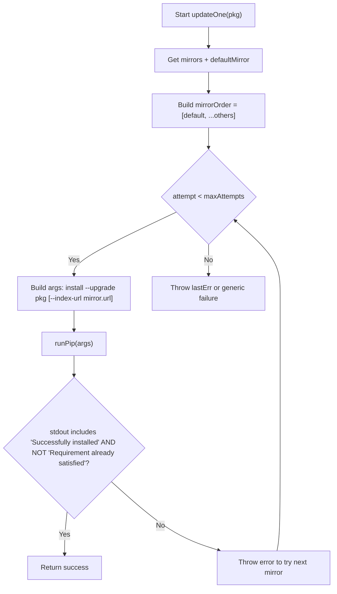
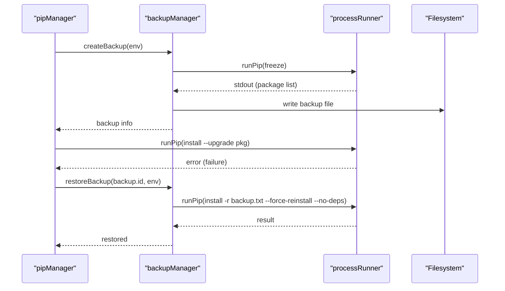
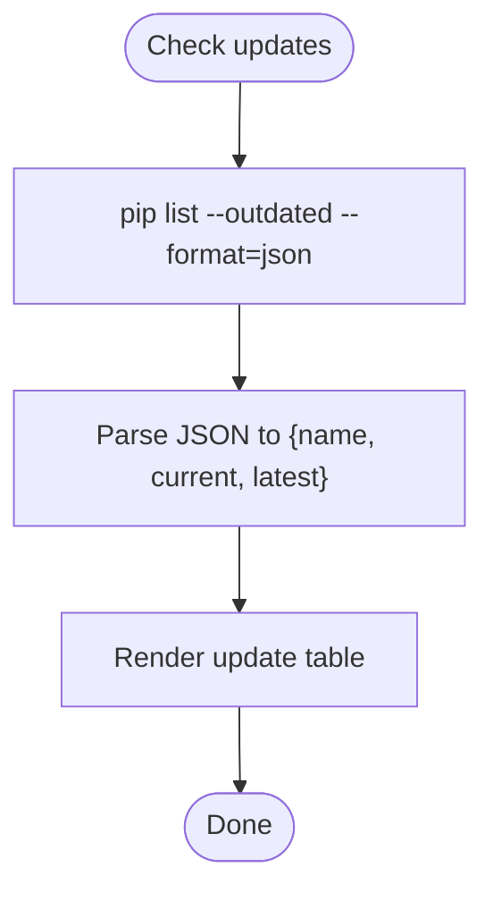
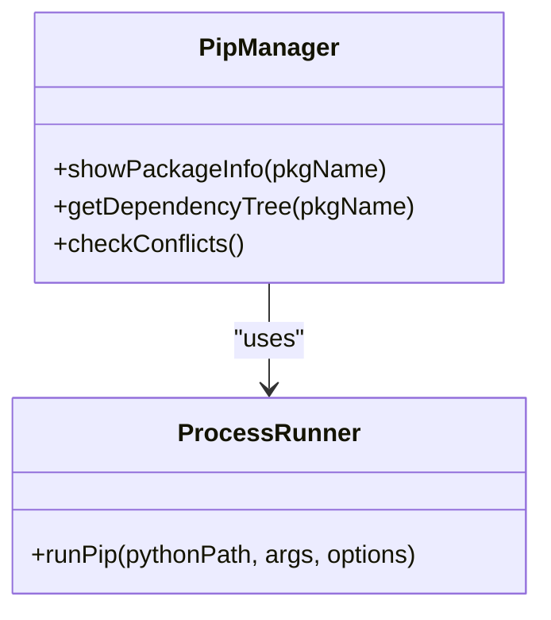
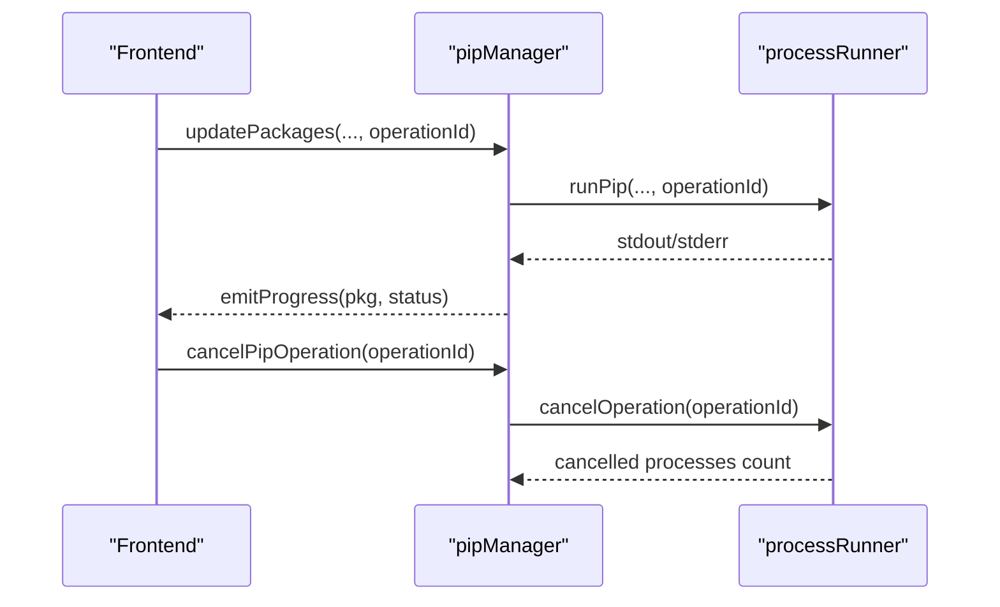
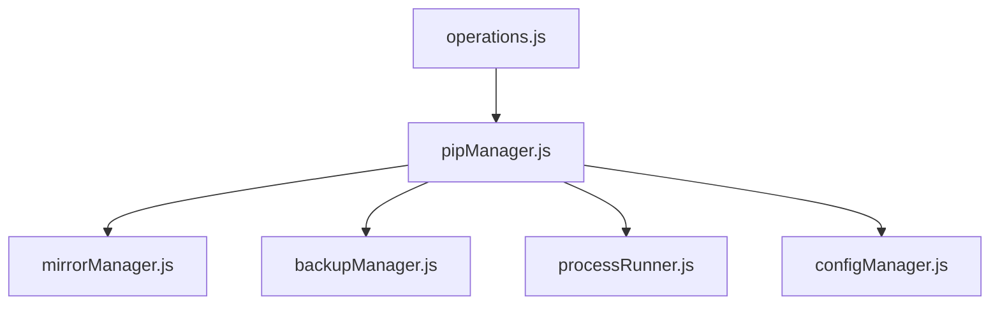

# Package Update API

<cite>
**Referenced Files in This Document**
- [pipManager.js](file://core/operations/pipManager.js)
- [mirrorManager.js](file://core/config/mirrorManager.js)
- [processRunner.js](file://utils/processRunner.js)
- [backupManager.js](file://core/operations/backupManager.js)
- [configManager.js](file://core/config/configManager.js)
- [operations.js](file://renderer/js/operations.js)
</cite>

## Table of Contents
1. [Introduction](#introduction)
2. [Project Structure](#project-structure)
3. [Core Components](#core-components)
4. [Architecture Overview](#architecture-overview)
5. [Detailed Component Analysis](#detailed-component-analysis)
6. [Dependency Analysis](#dependency-analysis)
7. [Performance Considerations](#performance-considerations)
8. [Troubleshooting Guide](#troubleshooting-guide)
9. [Conclusion](#conclusion)
10. [Appendices](#appendices)

## Introduction
This document provides comprehensive API documentation for the package update functionality, focusing on the updatePackages() function and its ecosystem. It explains batch updates, parallel processing, mirror source rotation, automatic rollback mechanisms, availability checking, version comparison logic, dependency resolution during updates, progress tracking, error handling patterns, and operation cancellation support. Practical usage examples are included to demonstrate individual updates, bulk updates, selective updates, and verification procedures.

## Project Structure
The update functionality is implemented across several modules:
- Core update orchestration and execution: pipManager.js
- Mirror management and selection: mirrorManager.js
- Process execution, timeouts, and cancellation: processRunner.js
- Backup creation and restoration for rollback: backupManager.js
- Configuration (parallel threads, retry count): configManager.js
- Frontend operations and UI integration: operations.js



**Diagram sources**
- [pipManager.js:805-885](file://core/operations/pipManager.js#L805-L885)
- [mirrorManager.js:109-130](file://core/config/mirrorManager.js#L109-L130)
- [processRunner.js:340-342](file://utils/processRunner.js#L340-L342)
- [backupManager.js:89-113](file://core/operations/backupManager.js#L89-L113)
- [configManager.js:90-99](file://core/config/configManager.js#L90-L99)
- [operations.js:134-163](file://renderer/js/operations.js#L134-L163)

**Section sources**
- [pipManager.js:805-885](file://core/operations/pipManager.js#L805-L885)
- [mirrorManager.js:109-130](file://core/config/mirrorManager.js#L109-L130)
- [processRunner.js:340-342](file://utils/processRunner.js#L340-L342)
- [backupManager.js:89-113](file://core/operations/backupManager.js#L89-L113)
- [configManager.js:90-99](file://core/config/configManager.js#L90-L99)
- [operations.js:134-163](file://renderer/js/operations.js#L134-L163)

## Core Components
- updatePackages(packages, options = {}, onOutput)
  - Purpose: Batch update specified packages with optional parallelism, retry, and rollback.
  - Parameters:
    - packages: Array<string> — list of package names to update.
    - options: Object — configuration flags:
      - parallel: boolean — enable parallel updates when multiple packages are provided.
      - retry: boolean — enable intelligent multi-mirror retries per package.
      - rollback: boolean — enable automatic rollback on failure (default true).
      - operationId: string — unique ID for tracking and cancellation.
    - onOutput: Function(text, type) — callback for real-time output events.
  - Returns: Promise<Object> — { updated: string[], failed: { pkg, error }[], operationId: string }.
  - Behavior:
    - Validates environment and package names.
    - Ensures pip availability.
    - Optionally creates a backup before updates.
    - Executes updates sequentially or in parallel based on options.
    - Emits progress events via onOutput.
    - Logs results and supports rollback on failure.

- updateOne(env, pkg, retry, retryCount, onOutput, operationId)
  - Purpose: Internal function to update a single package with mirror rotation and success validation.
  - Key logic:
    - Iterates through mirrors starting from default, then others.
    - Runs pip install --upgrade with index-url if not official.
    - Treats “Requirement already satisfied” without “Successfully installed” as no-op and continues to next mirror.
    - Throws error after exhausting attempts.

- runInParallel(items, concurrency, task)
  - Purpose: Limits concurrent tasks to configured thread count.
  - Uses worker queue pattern to process items concurrently.

- cancelPipOperation(operationId)
  - Purpose: Cancels all processes associated with an operation ID.

- Progress and Output
  - emitProgress(onOutput, pkg, status) emits structured progress events for done counts.

**Section sources**
- [pipManager.js:805-885](file://core/operations/pipManager.js#L805-L885)
- [pipManager.js:892-922](file://core/operations/pipManager.js#L892-L922)
- [pipManager.js:930-942](file://core/operations/pipManager.js#L930-L942)
- [pipManager.js:949-951](file://core/operations/pipManager.js#L949-L951)
- [pipManager.js:61-63](file://core/operations/pipManager.js#L61-L63)

## Architecture Overview
The update flow integrates frontend triggers, core orchestration, mirror selection, process execution, and rollback capabilities.

```mermaid
sequenceDiagram
participant UI as "Frontend (operations.js)"
participant PM as "pipManager.updatePackages"
participant BM as "backupManager.createBackup"
participant MM as "mirrorManager"
participant PR as "processRunner.runPip"
participant OS as "pip (Python)"
UI->>PM : updatePackages(packages, options, onOutput)
PM->>PM : validate env & packages
PM->>PR : ensurePip(env.path)
alt autoRollback enabled
PM->>BM : createBackup(env)
BM-->>PM : backup info
end
opt parallel mode
PM->>PM : runInParallel(packages, threads)
loop per package
PM->>MM : getMirrors(), getDefaultMirror()
PM->>PR : runPip(["install", "--upgrade", pkg, ...])
PR-->>PM : stdout/stderr
alt no newer version detected
PM->>MM : try next mirror
else successfully upgraded
PM-->>UI : emitProgress(pkg, "ok")
end
end
else sequential mode
loop per package
PM->>MM : getMirrors(), getDefaultMirror()
PM->>PR : runPip(["install", "--upgrade", pkg, ...])
PR-->>PM : stdout/stderr
alt no newer version detected
PM->>MM : try next mirror
else successfully upgraded
PM-->>UI : emitProgress(pkg, "ok")
end
end
end
PM-->>UI : return { updated, failed, operationId }
note over PM,BM : On failure with rollback enabled, restore backup
```

**Diagram sources**
- [pipManager.js:805-885](file://core/operations/pipManager.js#L805-L885)
- [pipManager.js:892-922](file://core/operations/pipManager.js#L892-L922)
- [pipManager.js:930-942](file://core/operations/pipManager.js#L930-L942)
- [mirrorManager.js:109-130](file://core/config/mirrorManager.js#L109-L130)
- [processRunner.js:340-342](file://utils/processRunner.js#L340-L342)
- [backupManager.js:89-113](file://core/operations/backupManager.js#L89-L113)

## Detailed Component Analysis

### updatePackages() API Specification
- Signature: async function updatePackages(packages, options = {}, onOutput)
- Parameters:
  - packages: Array<string> — required; non-empty; validated against package name regex.
  - options: Object — optional; fields:
    - parallel: boolean — enables parallel execution when packages.length > 1.
    - retry: boolean — enables multi-mirror retry per package.
    - rollback: boolean — defaults to true; enables automatic rollback on failure.
    - operationId: string — optional; used for tracking and cancellation.
  - onOutput: Function(text, type) — optional; receives structured logs and progress events.
- Return value: Promise<Object>
  - updated: Array<string> — successfully updated packages.
  - failed: Array<{ pkg: string, error: string }> — failures with messages.
  - operationId: string — operation identifier.
- Error handling:
  - Throws errors for invalid inputs, missing environment, or unrecoverable failures.
  - If rollback is enabled and any package fails, restores backup and throws descriptive error.
- Progress tracking:
  - Emits structured progress events via onOutput for each package status ("ok"/"fail").
- Cancellation:
  - Supports cancellation via operationId; cancels all child processes tied to it.

**Section sources**
- [pipManager.js:805-885](file://core/operations/pipManager.js#L805-L885)
- [pipManager.js:949-951](file://core/operations/pipManager.js#L949-L951)
- [pipManager.js:61-63](file://core/operations/pipManager.js#L61-L63)

### Parallel Processing Capabilities
- Concurrency control:
  - runInParallel limits workers to config.parallelThreads (default 4) or number of packages.
- Worker queue:
  - Items are dequeued and processed by available workers until completion.
- Performance implications:
  - Parallel updates reduce total time but increase I/O contention; tune threads based on system resources.



**Diagram sources**
- [pipManager.js:836-872](file://core/operations/pipManager.js#L836-L872)
- [pipManager.js:930-942](file://core/operations/pipManager.js#L930-L942)

**Section sources**
- [pipManager.js:836-872](file://core/operations/pipManager.js#L836-L872)
- [pipManager.js:930-942](file://core/operations/pipManager.js#L930-L942)

### Mirror Source Rotation
- Mirror order:
  - Default mirror first, followed by other configured mirrors.
- Selection strategy:
  - For each attempt, uses the next mirror if previous fails or indicates no newer version.
- Smart routing:
  - Optional feature to pick fastest mirror based on speed tests; can be toggled via configuration.



**Diagram sources**
- [pipManager.js:892-922](file://core/operations/pipManager.js#L892-L922)
- [mirrorManager.js:109-130](file://core/config/mirrorManager.js#L109-L130)

**Section sources**
- [pipManager.js:892-922](file://core/operations/pipManager.js#L892-L922)
- [mirrorManager.js:109-130](file://core/config/mirrorManager.js#L109-L130)

### Automatic Rollback Mechanisms
- Backup creation:
  - Before updates, creates a snapshot using pip freeze into a timestamped file.
- Restore process:
  - On failure, restores environment by reinstalling exact versions from backup with force-reinstall and no-deps.
- Safety:
  - Backup IDs are validated to prevent path traversal attacks.



**Diagram sources**
- [backupManager.js:89-113](file://core/operations/backupManager.js#L89-L113)
- [backupManager.js:156-170](file://core/operations/backupManager.js#L156-L170)
- [pipManager.js:828-831](file://core/operations/pipManager.js#L828-L831)
- [pipManager.js:859-868](file://core/operations/pipManager.js#L859-L868)

**Section sources**
- [backupManager.js:89-113](file://core/operations/backupManager.js#L89-L113)
- [backupManager.js:156-170](file://core/operations/backupManager.js#L156-L170)
- [pipManager.js:828-831](file://core/operations/pipManager.js#L828-L831)
- [pipManager.js:859-868](file://core/operations/pipManager.js#L859-L868)

### Update Availability Checking and Version Comparison Logic
- Availability check:
  - Performed via pip list --outdated to identify packages with newer versions.
- Version comparison:
  - During updateOne, checks stdout for “Successfully installed” and absence of “Requirement already satisfied”.
  - If only “Requirement already satisfied” appears, treats as no upgrade and tries next mirror.



**Diagram sources**
- [pipManager.js:446-459](file://core/operations/pipManager.js#L446-L459)
- [pipManager.js:892-922](file://core/operations/pipManager.js#L892-L922)

**Section sources**
- [pipManager.js:446-459](file://core/operations/pipManager.js#L446-L459)
- [pipManager.js:892-922](file://core/operations/pipManager.js#L892-L922)

### Dependency Resolution During Updates
- Dependency inspection:
  - showPackageInfo retrieves Requires and Required-by fields.
  - getDependencyTree builds a limited-depth dependency tree.
  - checkConflicts runs pip check to detect broken requirements.
- Implications for updates:
  - Conflicts may cause update failures; use healthCheck to diagnose issues.



**Diagram sources**
- [pipManager.js:1024-1056](file://core/operations/pipManager.js#L1024-L1056)
- [pipManager.js:1063-1095](file://core/operations/pipManager.js#L1063-L1095)
- [pipManager.js:1460-1503](file://core/operations/pipManager.js#L1460-L1503)
- [processRunner.js:340-342](file://utils/processRunner.js#L340-L342)

**Section sources**
- [pipManager.js:1024-1056](file://core/operations/pipManager.js#L1024-L1056)
- [pipManager.js:1063-1095](file://core/operations/pipManager.js#L1063-L1095)
- [pipManager.js:1460-1503](file://core/operations/pipManager.js#L1460-L1503)
- [processRunner.js:340-342](file://utils/processRunner.js#L340-L342)

### Progress Tracking, Error Handling, and Cancellation
- Progress tracking:
  - emitProgress sends structured events for each package status.
  - Frontend aggregates done/total counts and displays progress.
- Error handling:
  - Errors include stdout/stderr context; logged via logManager.
  - Rollback triggered automatically when enabled.
- Cancellation:
  - cancelPipOperation terminates all child processes linked to operationId.



**Diagram sources**
- [pipManager.js:61-63](file://core/operations/pipManager.js#L61-L63)
- [pipManager.js:949-951](file://core/operations/pipManager.js#L949-L951)
- [processRunner.js:181-191](file://utils/processRunner.js#L181-L191)

**Section sources**
- [pipManager.js:61-63](file://core/operations/pipManager.js#L61-L63)
- [pipManager.js:949-951](file://core/operations/pipManager.js#L949-L951)
- [processRunner.js:181-191](file://utils/processRunner.js#L181-L191)

## Dependency Analysis
- Module coupling:
  - pipManager depends on mirrorManager for mirror selection, backupManager for rollback, processRunner for execution, and configManager for settings.
- External dependencies:
  - pip commands executed via Python subprocesses; network access to PyPI mirrors.
- Potential circular dependencies:
  - None observed; clear separation between operations, configuration, and system utilities.



**Diagram sources**
- [pipManager.js:805-885](file://core/operations/pipManager.js#L805-L885)
- [mirrorManager.js:109-130](file://core/config/mirrorManager.js#L109-L130)
- [backupManager.js:89-113](file://core/operations/backupManager.js#L89-L113)
- [processRunner.js:340-342](file://utils/processRunner.js#L340-L342)
- [configManager.js:90-99](file://core/config/configManager.js#L90-L99)
- [operations.js:134-163](file://renderer/js/operations.js#L134-L163)

**Section sources**
- [pipManager.js:805-885](file://core/operations/pipManager.js#L805-L885)
- [mirrorManager.js:109-130](file://core/config/mirrorManager.js#L109-L130)
- [backupManager.js:89-113](file://core/operations/backupManager.js#L89-L113)
- [processRunner.js:340-342](file://utils/processRunner.js#L340-L342)
- [configManager.js:90-99](file://core/config/configManager.js#L90-L99)
- [operations.js:134-163](file://renderer/js/operations.js#L134-L163)

## Performance Considerations
- Parallel updates:
  - Tune config.parallelThreads to balance throughput and resource usage.
- Retry and mirrors:
  - Multi-mirror retries improve reliability but add latency; consider enabling smartRoute for optimal mirror selection.
- Caching:
  - pip readiness cached to avoid repeated checks; site-packages path cached to speed size/time estimation.
- I/O contention:
  - High concurrency may cause disk I/O bottlenecks; monitor system load.

[No sources needed since this section provides general guidance]

## Troubleshooting Guide
- Common errors:
  - Invalid package name: Ensure names match allowed characters and length constraints.
  - No Python environment selected: Verify current environment is set.
  - pip not available: Auto-install via ensurepip or get-pip.py; otherwise install manually.
  - Requirement already satisfied: Indicates no newer version; try different mirror or verify availability.
- Diagnostics:
  - Use healthCheck to assess environment integrity and conflicts.
  - Review logs via logManager for detailed error messages.
- Recovery:
  - Enable rollback to automatically restore environment on failure.
  - Use repairPip to fix corrupted pip installations.

**Section sources**
- [pipManager.js:805-885](file://core/operations/pipManager.js#L805-L885)
- [pipManager.js:968-1014](file://core/operations/pipManager.js#L968-L1014)
- [pipManager.js:1510-1584](file://core/operations/pipManager.js#L1510-L1584)
- [processRunner.js:233-278](file://utils/processRunner.js#L233-L278)

## Conclusion
The updatePackages() API provides robust, configurable, and safe package update capabilities with parallel processing, mirror rotation, automatic rollback, and comprehensive progress tracking. By leveraging mirrorManager, backupManager, processRunner, and configManager, it ensures reliable updates even under adverse conditions. Users can tailor behavior via options and monitor progress through callbacks, while cancellation and diagnostics support operational flexibility and troubleshooting.

[No sources needed since this section summarizes without analyzing specific files]

## Appendices

### Practical Code Examples
- Individual package update:
  - Call updatePackages([pkg], { parallel: false, retry: true, rollback: true }, onOutput).
- Bulk updates:
  - Call updatePackages([pkg1, pkg2, ...], { parallel: true, retry: true, rollback: true }, onOutput).
- Selective updates:
  - Filter packages from listOutdated() and pass selected subset to updatePackages().
- Update verification:
  - After updates, call listOutdated() again to confirm no remaining updates.

[No sources needed since this section provides general guidance]