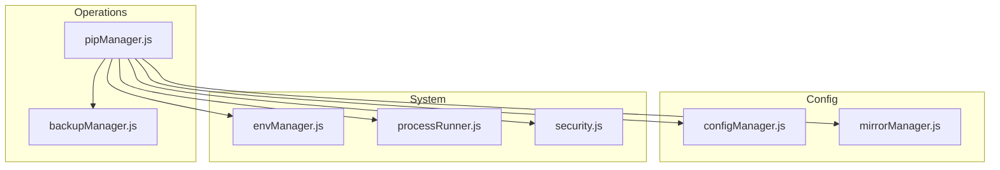
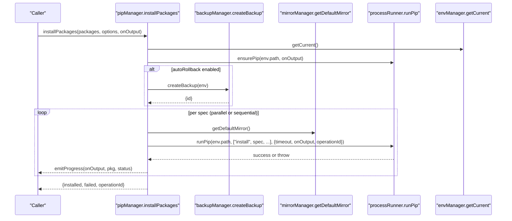
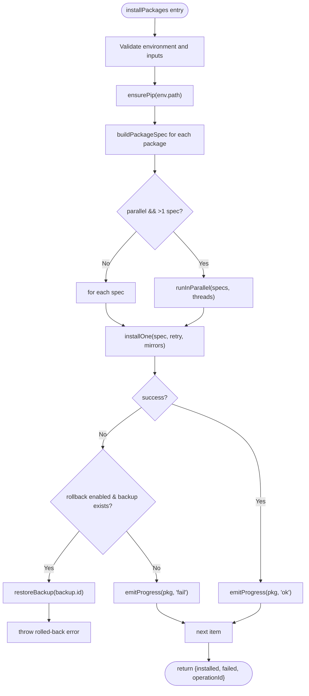
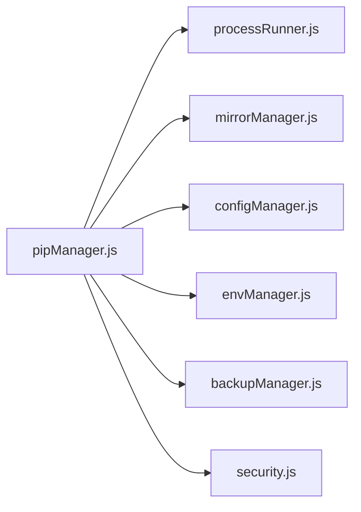

# Pip Manager API

<cite>
**Referenced Files in This Document**
- [pipManager.js](file://core/operations/pipManager.js)
- [processRunner.js](file://utils/processRunner.js)
- [mirrorManager.js](file://core/config/mirrorManager.js)
- [configManager.js](file://core/config/configManager.js)
- [envManager.js](file://core/system/envManager.js)
- [backupManager.js](file://core/operations/backupManager.js)
- [security.js](file://utils/security.js)
</cite>

## Table of Contents
1. [Introduction](#introduction)
2. [Project Structure](#project-structure)
3. [Core Components](#core-components)
4. [Architecture Overview](#architecture-overview)
5. [Detailed Component Analysis](#detailed-component-analysis)
6. [Dependency Analysis](#dependency-analysis)
7. [Performance Considerations](#performance-considerations)
8. [Troubleshooting Guide](#troubleshooting-guide)
9. [Conclusion](#conclusion)
10. [Appendices](#appendices)

## Introduction
This document provides comprehensive API documentation for the Pip Manager module, focusing on package management operations: installPackages(), uninstallPackages(), updatePackages(), listInstalled(), searchPackage(), and installFromFile(). It details parameter specifications, return value schemas, error handling patterns, async operation support, batch operations, parallel installation, version specification modes (latest/specific/range), mirror source configuration, automatic rollback mechanisms, progress callbacks, and security features such as input validation, path traversal prevention, and command injection protection. Practical usage examples are included to demonstrate common scenarios like single package installation, requirements.txt processing, wheel file installation, and error recovery.

## Project Structure
The Pip Manager is implemented primarily in core/operations/pipManager.js and integrates with several supporting modules:
- processRunner.js: subprocess execution, pip availability checks, timeout/cancellation, and output streaming
- mirrorManager.js: PyPI mirror configuration, speed testing, and effective mirror selection
- configManager.js: application configuration including parallel threads and retry counts
- envManager.js: Python environment detection and current environment management
- backupManager.js: backup creation and restore for automatic rollback
- security.js: path safety utilities

**Diagram sources**
- [pipManager.js:1-40](file://core/operations/pipManager.js#L1-L40)
- [processRunner.js:1-30](file://utils/processRunner.js#L1-L30)
- [mirrorManager.js:1-30](file://core/config/mirrorManager.js#L1-L30)
- [configManager.js:1-30](file://core/config/configManager.js#L1-L30)
- [envManager.js:1-30](file://core/system/envManager.js#L1-L30)
- [backupManager.js:1-30](file://core/operations/backupManager.js#L1-L30)
- [security.js:1-20](file://utils/security.js#L1-L20)

**Section sources**
- [pipManager.js:1-40](file://core/operations/pipManager.js#L1-L40)
- [processRunner.js:1-30](file://utils/processRunner.js#L1-L30)
- [mirrorManager.js:1-30](file://core/config/mirrorManager.js#L1-L30)
- [configManager.js:1-30](file://core/config/configManager.js#L1-L30)
- [envManager.js:1-30](file://core/system/envManager.js#L1-L30)
- [backupManager.js:1-30](file://core/operations/backupManager.js#L1-L30)
- [security.js:1-20](file://utils/security.js#L1-L20)

## Core Components
- pipManager.js: Exposes high-level APIs for listing, searching, installing, uninstalling, updating packages, importing/exporting requirements, dependency analysis, disk usage, offline downloads, conflict checking, and health checks.
- processRunner.js: Provides runCommand/runPip/runPython, ensurePip, cancellation by operationId, and robust process lifecycle management.
- mirrorManager.js: Manages built-in and custom mirrors, default selection, smart routing, speed tests, and pip config writing.
- configManager.js: Centralized configuration with sanitization and persistence.
- envManager.js: Detects and manages Python environments, returns current environment.
- backupManager.js: Creates and restores backups using pip freeze; validates backup IDs safely.
- security.js: Path safety utility for allowed directories.

Key responsibilities and interactions:
- All pip operations go through processRunner.runPip, ensuring consistent timeouts, output streaming, and cancellation.
- MirrorManager supplies index-url arguments or writes global pip config.
- BackupManager supports automatic rollback on failures for install/update/uninstall.
- ConfigManager controls concurrency (parallelThreads) and retryCount used by pipManager.
- EnvManager ensures a valid current environment before any operation.

**Section sources**
- [pipManager.js:492-596](file://core/operations/pipManager.js#L492-L596)
- [processRunner.js:85-161](file://utils/processRunner.js#L85-L161)
- [mirrorManager.js:299-333](file://core/config/mirrorManager.js#L299-L333)
- [configManager.js:22-29](file://core/config/configManager.js#L22-L29)
- [envManager.js:178-184](file://core/system/envManager.js#L178-L184)
- [backupManager.js:89-113](file://core/operations/backupManager.js#L89-L113)

## Architecture Overview
The Pip Manager orchestrates package operations via a layered architecture:
- API layer (pipManager.js) exposes user-facing functions
- Execution layer (processRunner.js) handles subprocess lifecycle, timeouts, cancellation, and output streaming
- Configuration layer (configManager.js, mirrorManager.js) provides settings and mirror selection
- Environment layer (envManager.js) ensures correct Python environment context
- Safety layer (backupManager.js, security.js) enables rollback and input/path validation

**Diagram sources**
- [pipManager.js:513-596](file://core/operations/pipManager.js#L513-L596)
- [processRunner.js:233-278](file://utils/processRunner.js#L233-L278)
- [mirrorManager.js:114-118](file://core/config/mirrorManager.js#L114-L118)
- [envManager.js:178-184](file://core/system/envManager.js#L178-L184)
- [backupManager.js:89-113](file://core/operations/backupManager.js#L89-L113)

## Detailed Component Analysis

### installPackages(packages, options, onOutput)
- Purpose: Install one or more packages with optional parallelism, retries, and automatic rollback.
- Parameters:
  - packages: string[] — package names or specs (e.g., "numpy", "flask==2.0.1", "requests>=2.28,<3")
  - options: object — optional flags:
    - versionMode: "latest" | "specific" | "range"
    - version: string — version or range when versionMode is specific/range
    - parallel: boolean — enable parallel installation
    - retry: boolean — enable multi-mirror retry
    - rollback: boolean — enable automatic rollback on failure (default true)
    - operationId: string — unique ID for cancellation tracking
  - onOutput: function(text, type) — callback for stdout/stderr and progress events
- Return value: Promise<object>
  - installed: string[] — successfully installed package names
  - failed: array<{spec, error}> — failed specs with error messages
  - operationId: string — operation identifier
- Behavior highlights:
  - Validates environment and inputs
  - Ensures pip availability
  - Builds package specs via buildPackageSpec
  - Supports parallel execution with configurable thread count from config.parallelThreads
  - Multi-mirror retry per spec
  - Automatic rollback via backupManager if enabled
  - Emits structured progress events via onOutput
- Error handling:
  - Throws errors for invalid inputs, missing environment, or persistent failures
  - Logs actions and failures via logManager
  - Cancels ongoing processes if operationId provided and cancel requested

**Diagram sources**
- [pipManager.js:513-596](file://core/operations/pipManager.js#L513-L596)
- [pipManager.js:608-633](file://core/operations/pipManager.js#L608-L633)
- [pipManager.js:930-942](file://core/operations/pipManager.js#L930-L942)

**Section sources**
- [pipManager.js:513-596](file://core/operations/pipManager.js#L513-L596)
- [pipManager.js:608-633](file://core/operations/pipManager.js#L608-L633)
- [pipManager.js:930-942](file://core/operations/pipManager.js#L930-L942)

### uninstallPackages(packages, options, onOutput)
- Purpose: Uninstall one or more packages with optional backup and rollback.
- Parameters:
  - packages: string[] — package names to uninstall
  - options: object — optional flags:
    - rollback: boolean — enable automatic rollback on failure (default true)
    - backup: boolean — explicitly create backup before uninstall
    - force: boolean — pass additional flags to pip
    - operationId: string — unique ID for cancellation tracking
  - onOutput: function(text, type) — callback for stdout/stderr
- Return value: Promise<object>
  - uninstalled: string[] — successfully uninstalled package names
  - operationId: string — operation identifier
- Behavior highlights:
  - Validates package names against regex
  - Acquires environment lock to prevent concurrent operations
  - Creates backup if rollback or explicit backup enabled
  - Executes pip uninstall -y with optional flags
  - Rolls back on failure if enabled
- Error handling:
  - Throws errors for invalid inputs or persistent failures
  - Logs actions and failures

**Section sources**
- [pipManager.js:745-789](file://core/operations/pipManager.js#L745-L789)

### updatePackages(packages, options, onOutput)
- Purpose: Update one or more packages with optional parallelism, retries, and rollback.
- Parameters:
  - packages: string[] — package names to update
  - options: object — optional flags:
    - parallel: boolean — enable parallel updates
    - retry: boolean — enable multi-mirror retry
    - rollback: boolean — enable automatic rollback on failure (default true)
    - operationId: string — unique ID for cancellation tracking
  - onOutput: function(text, type) — callback for stdout/stderr
- Return value: Promise<object>
  - updated: string[] — successfully updated package names
  - failed: array<{pkg, error}> — failed packages with error messages
  - operationId: string — operation identifier
- Behavior highlights:
  - Validates package names
  - Ensures pip availability
  - Uses pip install --upgrade with multi-mirror retry
  - Detects “Requirement already satisfied” to avoid false positives
  - Supports rollback via backupManager
- Error handling:
  - Throws errors for invalid inputs or persistent failures
  - Logs actions and failures

**Section sources**
- [pipManager.js:805-885](file://core/operations/pipManager.js#L805-L885)
- [pipManager.js:892-922](file://core/operations/pipManager.js#L892-L922)

### listInstalled(options)
- Purpose: Retrieve the list of installed packages with size and install time estimates.
- Parameters:
  - options: object — currently unused but reserved for future options
- Return value: Promise<Array<object>>
  - Each object includes: name, version, installed (date), size (number), sizeText (string), source (string)
- Behavior highlights:
  - Executes pip list --format=json
  - Estimates sizes and install times via site-packages scanning
  - Caches results for 5 minutes

**Section sources**
- [pipManager.js:400-427](file://core/operations/pipManager.js#L400-L427)
- [pipManager.js:435-439](file://core/operations/pipManager.js#L435-L439)

### searchPackage(keyword)
- Purpose: Search available versions for a package using pip index versions (since pip search is disabled).
- Parameters:
  - keyword: string — package name or partial match
- Return value: Promise<object>
  - keyword: string
  - result: string — raw output from pip index versions
  - error?: string — present if an error occurred
- Behavior highlights:
  - Validates keyword format and length
  - Uses pip index versions with ignoreExitCode to handle unsupported cases gracefully

**Section sources**
- [pipManager.js:468-490](file://core/operations/pipManager.js#L468-L490)

### installFromFile(filePath, options, onOutput)
- Purpose: Install from a .whl file or a requirements.txt file.
- Parameters:
  - filePath: string — absolute path to .whl or .txt file
  - options: object — optional flags:
    - rollback: boolean — enable automatic rollback on failure (default true)
    - retry: boolean — enable multi-mirror retry for .txt imports
    - operationId: string — unique ID for cancellation tracking
  - onOutput: function(text, type) — callback for stdout/stderr
- Return value: Promise<object>
  - For .whl: { installed: string[], failed: string[], operationId }
  - For .txt: { installed: string[], failed: string[], operationId }
- Behavior highlights:
  - Validates file existence and extension
  - For .whl: installs directly with mirror args and rollback support
  - For .txt: runs pip install -r with multi-mirror retry and rollback
  - Emits progress events

**Section sources**
- [pipManager.js:645-730](file://core/operations/pipManager.js#L645-L730)

### Additional Utilities and Operations
- buildPackageSpec(name, options): Constructs pip-compatible spec strings with validation for latest/specific/range modes and wheel paths.
- exportRequirements(options): Export current environment to requirements.txt content or file.
- importRequirements(filePath, options, onOutput): Import packages from a requirements.txt file.
- compareEnvironments(envPathA, envPathB): Compare two environments’ packages.
- getDiskUsage(): Analyze disk usage per package in current environment.
- downloadPackages(packages, destDir, options, onOutput): Download packages (wheel/sdist) for offline use.
- diffRequirements(sourceA, sourceB): Compare two requirement sources (env or file).
- getPackageReleases(pkgName): Fetch release history from PyPI JSON API.
- getFullDependencyGraph(): Build dependency graph nodes and edges for current environment.
- checkConflicts(): Detect dependency conflicts via pip check.
- healthCheck(): Comprehensive environment health report.

**Section sources**
- [pipManager.js:154-235](file://core/operations/pipManager.js#L154-L235)
- [pipManager.js:1104-1118](file://core/operations/pipManager.js#L1104-L1118)
- [pipManager.js:1127-1153](file://core/operations/pipManager.js#L1127-L1153)
- [pipManager.js:1161-1200](file://core/operations/pipManager.js#L1161-L1200)
- [pipManager.js:1208-1230](file://core/operations/pipManager.js#L1208-L1230)
- [pipManager.js:1242-1281](file://core/operations/pipManager.js#L1242-L1281)
- [pipManager.js:1291-1338](file://core/operations/pipManager.js#L1291-L1338)
- [pipManager.js:1347-1396](file://core/operations/pipManager.js#L1347-L1396)
- [pipManager.js:1409-1453](file://core/operations/pipManager.js#L1409-L1453)
- [pipManager.js:1460-1503](file://core/operations/pipManager.js#L1460-L1503)
- [pipManager.js:1510-1584](file://core/operations/pipManager.js#L1510-L1584)

## Dependency Analysis
The Pip Manager depends on several subsystems:
- processRunner: Subprocess execution, timeouts, cancellation, pip availability
- mirrorManager: Mirror configuration and selection
- configManager: Application configuration values
- envManager: Current Python environment
- backupManager: Backup and restore for rollback
- security: Path safety utilities

**Diagram sources**
- [pipManager.js:1-40](file://core/operations/pipManager.js#L1-L40)
- [processRunner.js:1-30](file://utils/processRunner.js#L1-L30)
- [mirrorManager.js:1-30](file://core/config/mirrorManager.js#L1-L30)
- [configManager.js:1-30](file://core/config/configManager.js#L1-L30)
- [envManager.js:1-30](file://core/system/envManager.js#L1-L30)
- [backupManager.js:1-30](file://core/operations/backupManager.js#L1-L30)
- [security.js:1-20](file://utils/security.js#L1-L20)

**Section sources**
- [pipManager.js:1-40](file://core/operations/pipManager.js#L1-L40)

## Performance Considerations
- Parallel installation: Controlled by config.parallelThreads; limits concurrency to balance performance and stability.
- Retry strategy: Multi-mirror retry reduces network failures; retryCount controlled by config.retryCount.
- Caching: Installed package cache with 5-minute TTL; site-packages path cache with 30-second TTL; pip readiness cache with 5-minute TTL.
- Disk scanning: Efficient directory mapping and size estimation with caching to avoid repeated scans.
- Process lifecycle: Robust timeout handling with SIGTERM followed by SIGKILL after delay; active process tracking for cancellation.

[No sources needed since this section provides general guidance]

## Troubleshooting Guide
Common issues and resolutions:
- No Python environment selected: Ensure a valid environment is set via envManager.switchEnvironment or detectEnvironments.
- pip not available: ensurePip attempts ensurepip then get-pip.py; verify network access and permissions.
- Installation fails due to network errors: Enable retry and configure mirrors; test mirror speeds via mirrorManager.testAllMirrors.
- Permission errors: Run with appropriate privileges or adjust storage path permissions.
- Conflicting dependencies: Use checkConflicts to identify issues; resolve by aligning versions or removing conflicting packages.
- Corrupted metadata: HealthCheck identifies broken packages; consider reinstalling affected packages.

**Section sources**
- [processRunner.js:233-278](file://utils/processRunner.js#L233-L278)
- [mirrorManager.js:219-247](file://core/config/mirrorManager.js#L219-L247)
- [pipManager.js:1460-1503](file://core/operations/pipManager.js#L1460-L1503)
- [pipManager.js:1510-1584](file://core/operations/pipManager.js#L1510-L1584)

## Conclusion
The Pip Manager provides a robust, secure, and flexible API for Python package management. It supports batch and parallel operations, intelligent retries across multiple mirrors, automatic rollback via backups, and comprehensive diagnostics. With strong input validation and path safety measures, it mitigates risks of command injection and path traversal. The modular architecture ensures maintainability and extensibility for future enhancements.

[No sources needed since this section summarizes without analyzing specific files]

## Appendices

### API Reference Summary

- installPackages(packages, options, onOutput)
  - Parameters: packages (string[]), options (object), onOutput (function)
  - Returns: Promise<{installed: string[], failed: Array<{spec,error}>, operationId: string}>
  - Notes: Supports versionMode latest/specific/range; parallel execution; multi-mirror retry; automatic rollback

- uninstallPackages(packages, options, onOutput)
  - Parameters: packages (string[]), options (object), onOutput (function)
  - Returns: Promise<{uninstalled: string[], operationId: string}>
  - Notes: Validates package names; supports backup and rollback

- updatePackages(packages, options, onOutput)
  - Parameters: packages (string[]), options (object), onOutput (function)
  - Returns: Promise<{updated: string[], failed: Array<{pkg,error}>, operationId: string}>
  - Notes: Uses pip install --upgrade; detects no-op updates; supports rollback

- listInstalled(options)
  - Parameters: options (object)
  - Returns: Promise<Array<{name, version, installed, size, sizeText, source}>>
  - Notes: Includes size and install time estimates; cached for 5 minutes

- searchPackage(keyword)
  - Parameters: keyword (string)
  - Returns: Promise<{keyword: string, result: string, error?: string}>
  - Notes: Uses pip index versions; validates keyword

- installFromFile(filePath, options, onOutput)
  - Parameters: filePath (string), options (object), onOutput (function)
  - Returns: Promise<{installed: string[], failed: string[], operationId: string}>
  - Notes: Supports .whl and .txt; validates paths; supports rollback

### Security Features
- Input validation: Package names and specs validated via regex; length limits enforced
- Path traversal prevention: Wheel paths checked for .., UNC paths, sensitive directories; absolute path required
- Command injection protection: Blocked characters in wheel paths; strict spec parsing
- Backup ID validation: Prevents path traversal and enforces naming conventions

**Section sources**
- [pipManager.js:154-235](file://core/operations/pipManager.js#L154-L235)
- [backupManager.js:62-78](file://core/operations/backupManager.js#L62-L78)
- [security.js:28-40](file://utils/security.js#L28-L40)

### Practical Examples

- Single package installation:
  - Call installPackages(["requests"], {versionMode: "latest"}, onOutput)
  - Monitor onOutput for progress and logs

- Requirements.txt processing:
  - Call installFromFile("requirements.txt", {retry: true, rollback: true}, onOutput)
  - Handles multi-mirror retry and rollback on failure

- Wheel file installation:
  - Call installFromFile("/absolute/path/to/package.whl", {rollback: true}, onOutput)
  - Validates path and installs with mirror configuration

- Error recovery scenario:
  - Use rollback: true to automatically restore from backup on failure
  - Inspect failed array for detailed error messages
  - Re-run operations with adjusted options (e.g., different mirror or version)

[No sources needed since this section provides general guidance]