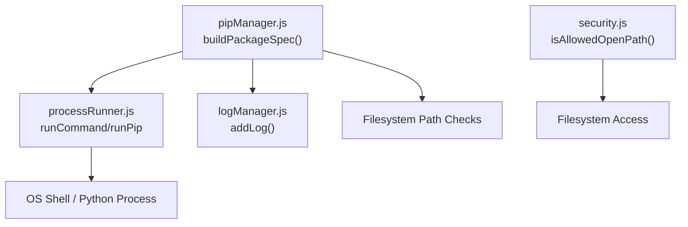
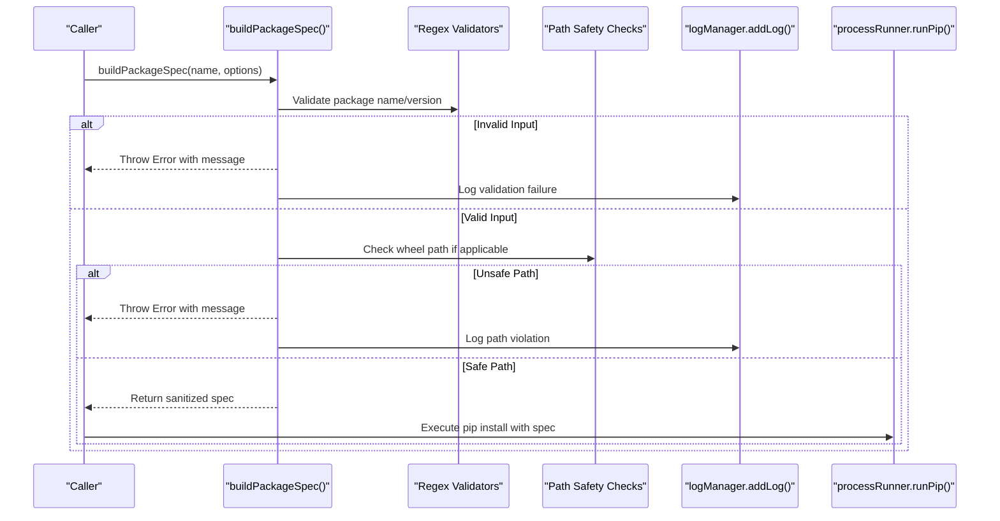
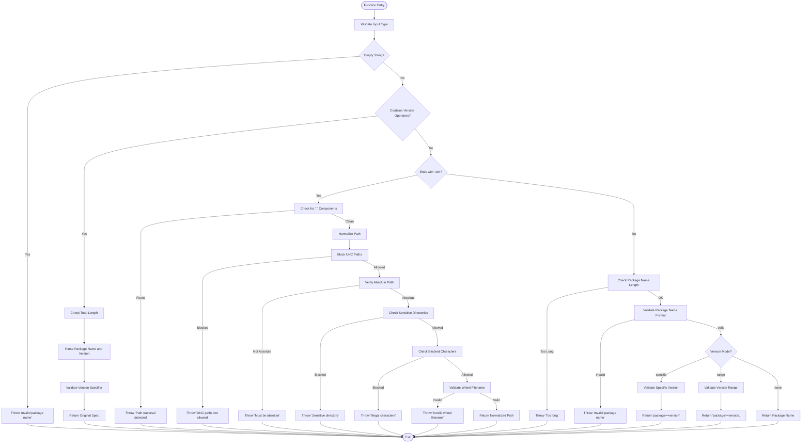
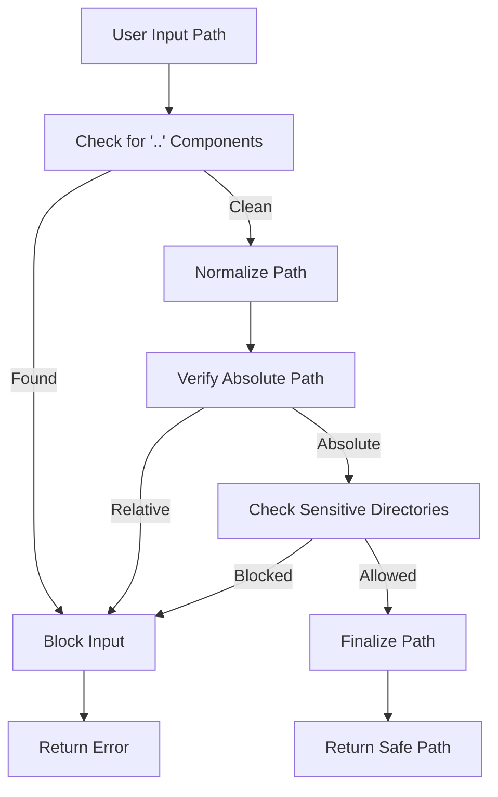
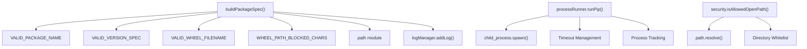

# Security & Validation API

<cite>
**Referenced Files in This Document**
- [pipManager.js](file://core/operations/pipManager.js)
- [security.js](file://utils/security.js)
- [processRunner.js](file://utils/processRunner.js)
- [logManager.js](file://core/system/logManager.js)
</cite>

## Table of Contents
1. [Introduction](#introduction)
2. [Project Structure](#project-structure)
3. [Core Components](#core-components)
4. [Architecture Overview](#architecture-overview)
5. [Detailed Component Analysis](#detailed-component-analysis)
6. [Dependency Analysis](#dependency-analysis)
7. [Performance Considerations](#performance-considerations)
8. [Troubleshooting Guide](#troubleshooting-guide)
9. [Conclusion](#conclusion)
10. [Appendices](#appendices)

## Introduction
This document provides comprehensive API documentation for security validation and input sanitization functionality, focusing on the buildPackageSpec() function used to construct pip package specifications safely. It explains parameter specifications, regex-based validation patterns, length restrictions, character filtering, path traversal prevention, command injection protection, UNC path blocking, sensitive directory access prevention, malformed input rejection, error messages, security logging, and bypass prevention mechanisms. Practical examples are included to demonstrate valid and invalid inputs, custom package specifications, wheel file validation, and best practices for constructing package names securely.

## Project Structure
The security-related logic is primarily implemented in:
- core/operations/pipManager.js: Contains buildPackageSpec(), validation constants, and usage across pip operations.
- utils/security.js: Provides path safety utilities (e.g., allowed open path checks).
- utils/processRunner.js: Executes system commands with safe defaults (no shell by default), timeouts, and cancellation.
- core/system/logManager.js: Records structured logs for operations and errors.



**Diagram sources**
- [pipManager.js:130-235](file://core/operations/pipManager.js#L130-L235)
- [processRunner.js:85-161](file://utils/processRunner.js#L85-L161)
- [security.js:28-40](file://utils/security.js#L28-L40)
- [logManager.js:115-134](file://core/system/logManager.js#L115-L134)

**Section sources**
- [pipManager.js:130-235](file://core/operations/pipManager.js#L130-L235)
- [security.js:28-40](file://utils/security.js#L28-L40)
- [processRunner.js:85-161](file://utils/processRunner.js#L85-L161)
- [logManager.js:115-134](file://core/system/logManager.js#L115-L134)

## Core Components
- buildPackageSpec(name, options): Validates and constructs a pip install specification string from a package name or wheel file path. Supports latest, specific version, range versions, and direct wheel paths with strict security checks.
- Regex-based validators:
  - VALID_PACKAGE_NAME: Ensures package names contain only allowed characters and start with an alphanumeric character.
  - VALID_VERSION_SPEC: Ensures version specifiers use only allowed characters and operators.
  - VALID_WHEEL_FILENAME: Ensures wheel filenames follow naming conventions.
  - WHEEL_PATH_BLOCKED_CHARS: Blocks dangerous characters that could lead to command injection.
- Path safety utilities:
  - isAllowedOpenPath(targetPath, allowedDirs): Prevents path traversal attacks by ensuring target paths are within allowed directories.

Key constants:
- MAX_PACKAGE_NAME_LENGTH: Maximum allowed length for package names.
- MAX_VERSION_LENGTH: Maximum allowed length for version specifiers.

Security features:
- Command injection protection via strict character filtering and no-shell execution.
- UNC path blocking to prevent remote resource access.
- Sensitive directory access prevention for system-critical paths.
- Malformed input rejection with precise error messages.

**Section sources**
- [pipManager.js:130-235](file://core/operations/pipManager.js#L130-L235)
- [security.js:28-40](file://utils/security.js#L28-L40)

## Architecture Overview
The buildPackageSpec() function serves as the central validation and sanitization entry point for package specifications. It enforces multiple layers of security before returning a safe string for pip installation. The processRunner module executes pip commands without using a shell, preventing command injection through argument parsing. Logging is integrated to record validation failures and operational events.



**Diagram sources**
- [pipManager.js:154-235](file://core/operations/pipManager.js#L154-L235)
- [logManager.js:115-134](file://core/system/logManager.js#L115-L134)
- [processRunner.js:340-342](file://utils/processRunner.js#L340-L342)

## Detailed Component Analysis

### buildPackageSpec Function
The buildPackageSpec() function validates and constructs pip package specifications with comprehensive security checks.

#### Parameters
- name (string): Package name or .whl file path
- options (object, optional): Configuration options
  - versionMode (string): Version specification mode ('latest', 'specific', 'range')
  - version (string): Version number or range specifier

#### Validation Rules
1. **Input Type Validation**: Rejects non-string or empty inputs
2. **Pre-built Spec Handling**: Validates existing specs like "package==1.2.3"
3. **Wheel File Path Security**: 
   - Path traversal prevention (blocks ".." components)
   - UNC path blocking (prevents \\server\share paths)
   - Absolute path requirement
   - Sensitive directory access prevention (/windows/, /dev/, /proc/, /sys/)
   - Character filtering (blocks command injection characters)
   - Wheel filename validation
4. **Package Name Validation**: Length limits and character restrictions
5. **Version Specifier Validation**: Format and length constraints

#### Security Features
- **Command Injection Protection**: Strict character filtering prevents shell metacharacters
- **Path Traversal Prevention**: Multiple layers of path validation
- **UNC Path Blocking**: Prevents network path exploitation
- **Sensitive Directory Protection**: Blocks access to critical system directories
- **Malformed Input Rejection**: Comprehensive validation with descriptive error messages

#### Error Messages
- "Invalid package name: must be a non-empty string"
- "Invalid package spec: too long"
- "Invalid package spec: [input]"
- "Invalid version specifier: [version]"
- "Invalid wheel path (path traversal detected): [path]"
- "Invalid wheel path (UNC paths not allowed): [path]"
- "Invalid wheel path (must be absolute): [path]"
- "Invalid wheel path (sensitive directory): [path]"
- "Invalid wheel path (illegal characters): [path]"
- "Invalid wheel filename: [filename]"
- "Invalid package name: too long (max [length] characters)"
- "Invalid package name: [name]"
- "Invalid version range: [version]"



**Diagram sources**
- [pipManager.js:154-235](file://core/operations/pipManager.js#L154-L235)

**Section sources**
- [pipManager.js:154-235](file://core/operations/pipManager.js#L154-L235)

### Regex-Based Validation Patterns
The system uses several regular expressions to enforce strict input validation:

#### VALID_PACKAGE_NAME
- Pattern: `/^[a-zA-Z0-9][a-zA-Z0-9._-]*$/`
- Purpose: Ensures package names start with alphanumeric characters and contain only letters, numbers, dots, hyphens, and underscores
- Complexity: O(n) where n is the length of the package name

#### VALID_VERSION_SPEC
- Pattern: `/^[a-zA-Z0-9._*!=<>,~+-]+$/`
- Purpose: Validates version specifiers allowing standard pip version operators and characters
- Complexity: O(n) where n is the length of the version specifier

#### VALID_WHEEL_FILENAME
- Pattern: `/^[a-zA-Z0-9][a-zA-Z0-9._-]*\.whl$/i`
- Purpose: Ensures wheel filenames follow proper naming conventions with .whl extension
- Complexity: O(n) where n is the length of the filename

#### WHEEL_PATH_BLOCKED_CHARS
- Pattern: `/[;&|`$<>"'\r\n\0]/`
- Purpose: Blocks characters that could enable command injection or path manipulation
- Complexity: O(n) where n is the length of the path

**Section sources**
- [pipManager.js:131-136](file://core/operations/pipManager.js#L131-L136)

### Path Traversal Prevention
The system implements multiple layers of path traversal protection:

1. **Direct Component Detection**: Checks for ".." components in the original input
2. **Path Normalization**: Uses path.normalize() to resolve relative paths
3. **Absolute Path Requirement**: Ensures all wheel paths are absolute
4. **Directory Whitelisting**: Can restrict access to specific directories using isAllowedOpenPath()



**Diagram sources**
- [pipManager.js:179-206](file://core/operations/pipManager.js#L179-L206)
- [security.js:28-40](file://utils/security.js#L28-L40)

**Section sources**
- [pipManager.js:179-206](file://core/operations/pipManager.js#L179-L206)
- [security.js:28-40](file://utils/security.js#L28-L40)

### Command Injection Protection
The system prevents command injection through multiple mechanisms:

1. **Character Filtering**: Blocks shell metacharacters like `;`, `&`, `|`, backticks, `$`, `<`, `>`, quotes, newlines, and null bytes
2. **No Shell Execution**: Uses child_process.spawn() without shell option
3. **Strict Parameter Parsing**: Passes arguments as arrays rather than concatenated strings
4. **Input Sanitization**: All user inputs are validated before being used in commands

**Section sources**
- [pipManager.js:131-132](file://core/operations/pipManager.js#L131-L132)
- [processRunner.js:93-98](file://utils/processRunner.js#L93-L98)

### Security Logging
Validation failures and security events are logged using the logManager:

- Action descriptions include the type of validation failure
- Status indicates success or failure
- Type categorizes the log entry (install, uninstall, update, system)
- Detail field contains additional context about the failure

**Section sources**
- [logManager.js:115-134](file://core/system/logManager.js#L115-L134)

## Dependency Analysis
The buildPackageSpec() function has minimal external dependencies but integrates with several core modules:



**Diagram sources**
- [pipManager.js:131-136](file://core/operations/pipManager.js#L131-L136)
- [processRunner.js:85-161](file://utils/processRunner.js#L85-L161)
- [security.js:28-40](file://utils/security.js#L28-L40)

**Section sources**
- [pipManager.js:131-136](file://core/operations/pipManager.js#L131-L136)
- [processRunner.js:85-161](file://utils/processRunner.js#L85-L161)
- [security.js:28-40](file://utils/security.js#L28-L40)

## Performance Considerations
- **Regex Validation**: O(n) complexity for each validation check
- **Path Operations**: Path normalization and resolution are efficient operations
- **Memory Usage**: Minimal memory footprint due to simple string operations
- **Caching**: No caching in validation functions to ensure fresh validation
- **Early Exit**: Functions return immediately upon detecting invalid input

## Troubleshooting Guide
Common validation errors and their solutions:

### Package Name Errors
- **Error**: "Invalid package name: must be a non-empty string"
  - **Cause**: Empty or non-string input
  - **Solution**: Ensure package name is a non-empty string
  
- **Error**: "Invalid package name: too long (max 214 characters)"
  - **Cause**: Package name exceeds maximum length
  - **Solution**: Use shorter package names or split into multiple packages

- **Error**: "Invalid package name: [name]"
  - **Cause**: Package name contains invalid characters
  - **Solution**: Remove special characters and ensure proper formatting

### Version Specifier Errors
- **Error**: "Invalid version specifier: [version]"
  - **Cause**: Invalid version format or characters
  - **Solution**: Use standard pip version syntax (e.g., "==1.2.3", ">=1.0,<2.0")

### Wheel Path Errors
- **Error**: "Invalid wheel path (path traversal detected)"
  - **Cause**: Path contains ".." components
  - **Solution**: Use absolute paths without relative components

- **Error**: "Invalid wheel path (UNC paths not allowed)"
  - **Cause**: Network path detected
  - **Solution**: Download wheel files locally first

- **Error**: "Invalid wheel path (must be absolute)"
  - **Cause**: Relative path provided
  - **Solution**: Convert to absolute path using path.resolve()

- **Error**: "Invalid wheel path (sensitive directory)"
  - **Cause**: Path accesses system directories
  - **Solution**: Store wheel files in application directories

- **Error**: "Invalid wheel path (illegal characters)"
  - **Cause**: Dangerous characters in path
  - **Solution**: Remove shell metacharacters and control characters

**Section sources**
- [pipManager.js:156-235](file://core/operations/pipManager.js#L156-L235)

## Conclusion
The buildPackageSpec() function provides comprehensive security validation and input sanitization for package specifications. It implements multiple layers of protection against common attack vectors including command injection, path traversal, and malicious file paths. The function maintains high performance while ensuring robust security through strict validation rules and character filtering. Integration with logging systems enables monitoring and debugging of security events.

## Appendices

### Practical Examples

#### Valid Package Specifications
```javascript
// Latest version
buildPackageSpec("numpy")

// Specific version
buildPackageSpec("flask", { versionMode: "specific", version: "2.0.1" })

// Version range
buildPackageSpec("requests", { versionMode: "range", version: ">=2.25.0,<3.0.0" })

// Pre-built specification
buildPackageSpec("django==3.2.0")
```

#### Valid Wheel File Paths
```javascript
// Local wheel file
buildPackageSpec("/home/user/packages/mypackage-1.0.0-py3-none-any.whl")

// Windows path
buildPackageSpec("C:\\Users\\user\\packages\\mypackage-1.0.0.whl")
```

#### Invalid Inputs That Will Be Rejected
```javascript
// Path traversal attempt
buildPackageSpec("../../etc/passwd")

// UNC path
buildPackageSpec("\\\\server\\share\\malicious.whl")

// Command injection attempt
buildPackageSpec("package; rm -rf /")

// Sensitive directory access
buildPackageSpec("/windows/system32/malicious.whl")
```

### Security Best Practices
1. **Always validate user input**: Never trust external data
2. **Use allowlists**: Only permit known-good values
3. **Implement defense in depth**: Multiple layers of validation
4. **Log security events**: Monitor for potential attacks
5. **Use least privilege**: Run with minimal required permissions
6. **Keep dependencies updated**: Regular security updates
7. **Test edge cases**: Comprehensive test coverage for validation logic

**Section sources**
- [pipManager.js:154-235](file://core/operations/pipManager.js#L154-L235)