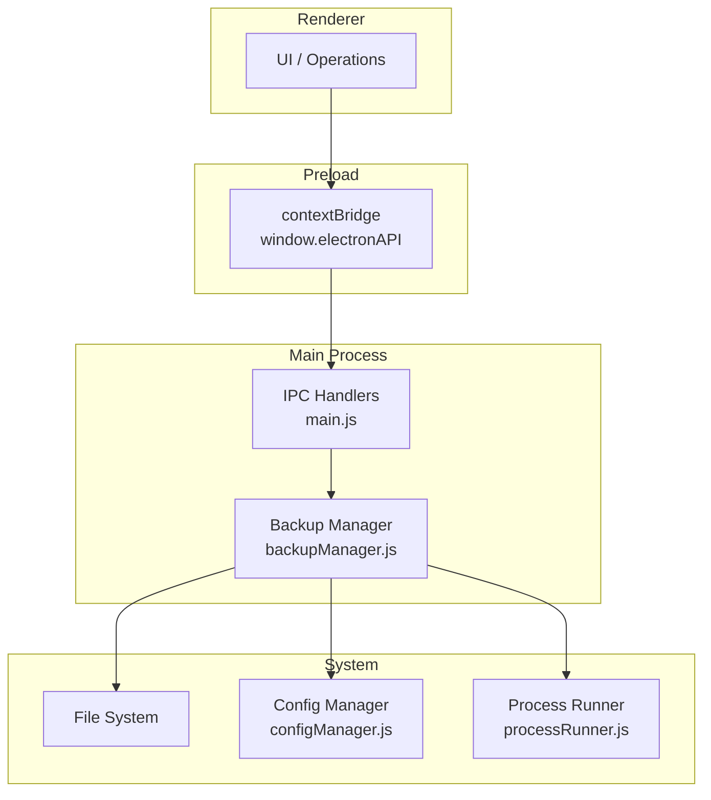
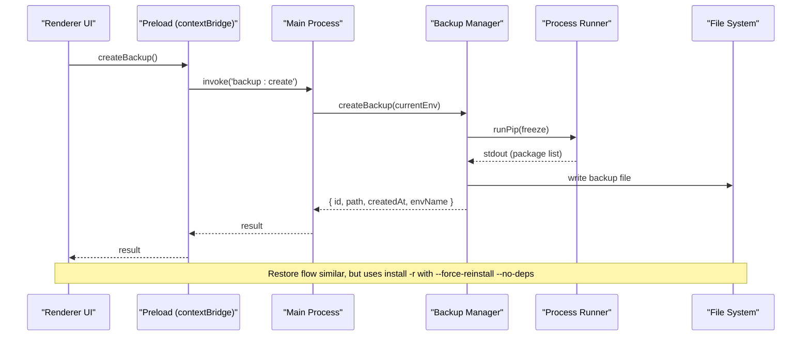
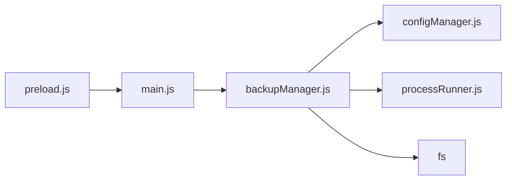

# Backup and Recovery API

<cite>
**Referenced Files in This Document**
- [main.js](file://main.js)
- [preload.js](file://preload.js)
- [backupManager.js](file://core/operations/backupManager.js)
- [processRunner.js](file://utils/processRunner.js)
- [configManager.js](file://core/config/configManager.js)
</cite>

## Table of Contents
1. [Introduction](#introduction)
2. [Project Structure](#project-structure)
3. [Core Components](#core-components)
4. [Architecture Overview](#architecture-overview)
5. [Detailed Component Analysis](#detailed-component-analysis)
6. [Dependency Analysis](#dependency-analysis)
7. [Performance Considerations](#performance-considerations)
8. [Troubleshooting Guide](#troubleshooting-guide)
9. [Conclusion](#conclusion)
10. [Appendices](#appendices)

## Introduction
This document describes the Backup and Recovery IPC API exposed by the application. It covers the four core methods: createBackup, listBackups, restoreBackup, and deleteBackup. It explains backup format, storage locations, how backups are created and restored, and provides guidance for automation, verification, cleanup, and concurrent operations.

## Project Structure
The backup feature is implemented as an IPC bridge from the renderer to the main process, which delegates to a dedicated manager module. The key files involved are:
- Renderer exposes safe APIs via preload.js
- Main process registers IPC handlers in main.js
- Core logic resides in core/operations/backupManager.js
- Subprocess execution and pip integration use utils/processRunner.js
- Storage path resolution uses core/config/configManager.js

**Diagram sources**
- [preload.js:66-72](file://preload.js#L66-L72)
- [main.js:355-368](file://main.js#L355-L368)
- [backupManager.js:1-196](file://core/operations/backupManager.js#L1-L196)
- [processRunner.js:340-342](file://utils/processRunner.js#L340-L342)
- [configManager.js:185-191](file://core/config/configManager.js#L185-L191)

**Section sources**
- [preload.js:66-72](file://preload.js#L66-L72)
- [main.js:355-368](file://main.js#L355-L368)
- [backupManager.js:1-196](file://core/operations/backupManager.js#L1-L196)
- [processRunner.js:340-342](file://utils/processRunner.js#L340-L342)
- [configManager.js:185-191](file://core/config/configManager.js#L185-L191)

## Core Components
- IPC layer (preload.js): Exposes createBackup, listBackups, restoreBackup, deleteBackup on window.electronAPI.
- IPC handlers (main.js): Map IPC channels to backupManager functions.
- Backup manager (backupManager.js): Implements backup creation, listing, restoration, deletion, and ID validation.
- Process runner (processRunner.js): Executes pip commands with timeouts, cancellation, and output streaming.
- Config manager (configManager.js): Provides storagePath used for backup directory location.

Key responsibilities:
- createBackup(env): Captures current environment’s package list using pip freeze and writes a .txt file.
- listBackups(): Lists all backup files with metadata sorted by newest first.
- restoreBackup(backupId, env, onOutput): Restores packages from a backup file using pip install -r with force-reinstall and no-deps flags.
- deleteBackup(backupId): Deletes a backup file after validating its ID.

**Section sources**
- [preload.js:66-72](file://preload.js#L66-L72)
- [main.js:355-368](file://main.js#L355-L368)
- [backupManager.js:89-113](file://core/operations/backupManager.js#L89-L113)
- [backupManager.js:122-142](file://core/operations/backupManager.js#L122-L142)
- [backupManager.js:156-170](file://core/operations/backupManager.js#L156-L170)
- [backupManager.js:179-193](file://core/operations/backupManager.js#L179-L193)
- [processRunner.js:340-342](file://utils/processRunner.js#L340-L342)
- [configManager.js:185-191](file://core/config/configManager.js#L185-L191)

## Architecture Overview
The backup API follows a clear IPC pattern:
- Renderer calls window.electronAPI.backup.* methods.
- Preload forwards these calls via ipcRenderer.invoke to main process channels.
- Main process handlers call backupManager functions.
- backupManager interacts with configManager for storage paths, processRunner for pip commands, and filesystem for reading/writing/deleting backup files.

**Diagram sources**
- [preload.js:66-72](file://preload.js#L66-L72)
- [main.js:355-368](file://main.js#L355-L368)
- [backupManager.js:89-113](file://core/operations/backupManager.js#L89-L113)
- [processRunner.js:340-342](file://utils/processRunner.js#L340-L342)

## Detailed Component Analysis

### IPC Exposure (preload.js)
- Exposes four backup methods:
  - createBackup(): No arguments; returns backup metadata.
  - listBackups(): Returns array of backup entries.
  - restoreBackup(backupId): Streams progress via pip:progress events.
  - deleteBackup(backupId): Boolean success indicator.

These methods map directly to IPC channels 'backup:create', 'backup:list', 'backup:restore', 'backup:delete'.

**Section sources**
- [preload.js:66-72](file://preload.js#L66-L72)

### IPC Handlers (main.js)
- Registers handlers that forward calls to backupManager:
  - 'backup:create' -> backupManager.createBackup(envManager.getCurrent())
  - 'backup:list' -> backupManager.listBackups()
  - 'backup:restore' -> backupManager.restoreBackup(backupId, envManager.getCurrent(), onOutput)
  - 'backup:delete' -> backupManager.deleteBackup(backupId)

Progress during restore is streamed back to the renderer via 'pip:progress' events.

**Section sources**
- [main.js:355-368](file://main.js#L355-L368)

### Backup Manager (backupManager.js)
- Storage location:
  - Determined by configManager.getStoragePath() joined with 'backups'.
  - Directory is created if it does not exist.
- Backup filename format:
  - backup_{envName}_{timestamp}.txt
  - Timestamp derived from ISO time normalized to avoid colons/dots.
- createBackup(env):
  - Validates Python environment path.
  - Executes pip freeze to capture installed packages and versions.
  - Writes output to backup file.
  - Returns id, path, createdAt, envName, envPath.
- listBackups():
  - Reads backup directory, filters backup_*.txt files.
  - Collects stat info (mtime, size).
  - Sorts by creation time descending.
- restoreBackup(backupId, env, onOutput):
  - Validates backupId against strict regex and length constraints.
  - Ensures file exists.
  - Runs pip install -r <backup.txt> with --force-reinstall --no-deps --no-warn-script-location.
  - Streams output via onOutput callback.
- deleteBackup(backupId):
  - Validates backupId.
  - Deletes file if present; returns boolean.

Security:
- validateBackupId enforces allowed characters, prevents path traversal, and ensures backup_*.txt naming.

Error handling:
- Errors are logged via logManager and rethrown with descriptive messages.

**Section sources**
- [backupManager.js:29-34](file://core/operations/backupManager.js#L29-L34)
- [backupManager.js:46-51](file://core/operations/backupManager.js#L46-L51)
- [backupManager.js:62-78](file://core/operations/backupManager.js#L62-L78)
- [backupManager.js:89-113](file://core/operations/backupManager.js#L89-L113)
- [backupManager.js:122-142](file://core/operations/backupManager.js#L122-L142)
- [backupManager.js:156-170](file://core/operations/backupManager.js#L156-L170)
- [backupManager.js:179-193](file://core/operations/backupManager.js#L179-L193)

### Process Runner (processRunner.js)
- runPip(pythonPath, args, options):
  - Executes python -m pip with provided args.
  - Supports timeout, onOutput callbacks, and operationId-based cancellation.
  - Cleans ANSI sequences from output.
  - Tracks active processes for cancellation.

Relevance to backup:
- createBackup uses runPip(['freeze']) to generate requirements snapshot.
- restoreBackup uses runPip(['install', '-r', filePath, '--force-reinstall', '--no-deps', '--no-warn-script-location']).

**Section sources**
- [processRunner.js:340-342](file://utils/processRunner.js#L340-L342)

### Config Manager (configManager.js)
- getStoragePath():
  - Returns configured storage directory, creating it if missing.
  - Used by backupManager to locate backups folder.

Default storage path is set at configuration initialization and can be customized.

**Section sources**
- [configManager.js:185-191](file://core/config/configManager.js#L185-L191)

## Dependency Analysis
The backup API depends on:
- IPC bridging (preload.js)
- IPC handlers (main.js)
- Backup manager (backupManager.js)
- Process runner (processRunner.js)
- Config manager (configManager.js)
- File system (Node fs)

**Diagram sources**
- [preload.js:66-72](file://preload.js#L66-L72)
- [main.js:355-368](file://main.js#L355-L368)
- [backupManager.js:1-196](file://core/operations/backupManager.js#L1-L196)
- [processRunner.js:340-342](file://utils/processRunner.js#L340-L342)
- [configManager.js:185-191](file://core/config/configManager.js#L185-L191)

**Section sources**
- [preload.js:66-72](file://preload.js#L66-L72)
- [main.js:355-368](file://main.js#L355-L368)
- [backupManager.js:1-196](file://core/operations/backupManager.js#L1-L196)
- [processRunner.js:340-342](file://utils/processRunner.js#L340-L342)
- [configManager.js:185-191](file://core/config/configManager.js#L185-L191)

## Performance Considerations
- Timeouts:
  - createBackup uses a 60-second timeout for pip freeze.
  - restoreBackup uses a 600-second timeout for pip install -r.
- Cancellation:
  - Active subprocesses are tracked; they can be cancelled via operationId or globally on app quit.
- I/O:
  - Backup listing reads directory synchronously; consider large directories for performance.
- Output streaming:
  - restoreBackup streams pip output via onOutput; ensure UI handles frequent updates efficiently.

[No sources needed since this section provides general guidance]

## Troubleshooting Guide
Common issues and resolutions:
- No Python environment selected:
  - Ensure a valid Python environment is set before calling createBackup or restoreBackup.
- Invalid backup ID:
  - Must match backup_*.txt, no path traversal, within max length. Use listBackups to obtain valid IDs.
- Backup not found:
  - Verify the backup file exists in the storage/backups directory.
- pip not available:
  - The process runner attempts to ensure pip availability; check logs and network access.
- Permission errors:
  - Ensure write permissions to the configured storagePath/backups directory.

Operational tips:
- Always list backups before restoring to confirm existence and timestamps.
- Monitor pip:progress events during restore to track installation status.
- Review logs for detailed error messages when operations fail.

**Section sources**
- [backupManager.js:62-78](file://core/operations/backupManager.js#L62-L78)
- [backupManager.js:89-113](file://core/operations/backupManager.js#L89-L113)
- [backupManager.js:156-170](file://core/operations/backupManager.js#L156-L170)
- [processRunner.js:213-278](file://utils/processRunner.js#L213-L278)

## Conclusion
The Backup and Recovery API provides a secure and robust mechanism to snapshot and restore Python environments using pip freeze and pip install -r. It integrates seamlessly with Electron’s IPC model, supports progress streaming, and enforces strict input validation. For production usage, implement automated scheduling, integrity checks, and cleanup strategies as outlined in the appendices.

[No sources needed since this section summarizes without analyzing specific files]

## Appendices

### Backup Format and Storage
- Format:
  - Plain text file containing pip freeze output (package==version per line).
- Filename:
  - backup_{envName}_{timestamp}.txt
- Storage:
  - {storagePath}/backups/
  - storagePath comes from configManager.getStoragePath().

**Section sources**
- [backupManager.js:29-34](file://core/operations/backupManager.js#L29-L34)
- [backupManager.js:46-51](file://core/operations/backupManager.js#L46-L51)
- [configManager.js:185-191](file://core/config/configManager.js#L185-L191)

### Incremental vs Full Backups
- Current implementation creates full snapshots based on pip freeze.
- There is no built-in incremental backup mechanism.
- To approximate incremental behavior:
  - Compare two backup files to detect changes.
  - Create new backups only when significant changes are detected.

[No sources needed since this section provides general guidance]

### Recovery Procedures
- Manual recovery:
  - Call restoreBackup with a valid backupId.
  - Stream progress via pip:progress events.
- Automated recovery:
  - Integrate with scheduler to trigger restore after failures or maintenance windows.

**Section sources**
- [main.js:362-366](file://main.js#L362-L366)
- [backupManager.js:156-170](file://core/operations/backupManager.js#L156-L170)

### Automated Backup Scheduling
- The application includes a scheduler for automatic package updates; you can extend it to schedule backups:
  - On daily/weekly intervals, call createBackup for the current environment.
  - Store lastRun timestamp and handle conflicts gracefully.

[No sources needed since this section provides general guidance]

### Manual Backup Management
- Typical workflow:
  - listBackups to view existing snapshots.
  - createBackup to take a new snapshot before risky operations.
  - restoreBackup to revert to a known good state.
  - deleteBackup to remove outdated snapshots.

**Section sources**
- [preload.js:66-72](file://preload.js#L66-L72)
- [main.js:355-368](file://main.js#L355-L368)

### Disaster Recovery Workflows
- Pre-migration:
  - Create a backup before major changes.
- Post-failure:
  - List backups to identify the most recent stable snapshot.
  - Restore the chosen backup and verify functionality.
- Rollback:
  - If rollback is enabled elsewhere in the system, combine with backup restore for safety.

[No sources needed since this section provides general guidance]

### Backup Verification and Integrity Checking
- Built-in verification:
  - None beyond filename validation and existence checks.
- Recommended practices:
  - After restore, run pip check or healthCheck to validate environment consistency.
  - Optionally compute checksums of backup files and store them alongside backups.

**Section sources**
- [backupManager.js:62-78](file://core/operations/backupManager.js#L62-L78)
- [backupManager.js:156-170](file://core/operations/backupManager.js#L156-L170)

### Cleanup Strategies
- Retention policy:
  - Keep N most recent backups per environment.
  - Delete older backups automatically.
- Space management:
  - Periodically scan backups directory and remove files exceeding age thresholds.

[No sources needed since this section provides general guidance]

### Concurrent Backup Operations and Conflict Resolution
- Concurrency:
  - Multiple createBackup calls may run concurrently; each generates a unique filename based on timestamp and environment name.
- Conflict resolution:
  - Avoid race conditions by ensuring unique filenames; current approach uses ISO timestamp normalization.
  - For critical scenarios, add locking around backup creation to prevent overlapping operations.

**Section sources**
- [backupManager.js:46-51](file://core/operations/backupManager.js#L46-L51)

### API Reference Summary
- createBackup():
  - Input: none (uses current environment)
  - Output: { id, path, createdAt, envName, envPath }
- listBackups():
  - Input: none
  - Output: Array of { id, path, createdAt, size }
- restoreBackup(backupId):
  - Input: backupId string
  - Output: pip install result; progress streamed via pip:progress
- deleteBackup(backupId):
  - Input: backupId string
  - Output: boolean

**Section sources**
- [preload.js:66-72](file://preload.js#L66-L72)
- [main.js:355-368](file://main.js#L355-L368)
- [backupManager.js:89-113](file://core/operations/backupManager.js#L89-L113)
- [backupManager.js:122-142](file://core/operations/backupManager.js#L122-L142)
- [backupManager.js:156-170](file://core/operations/backupManager.js#L156-L170)
- [backupManager.js:179-193](file://core/operations/backupManager.js#L179-L193)