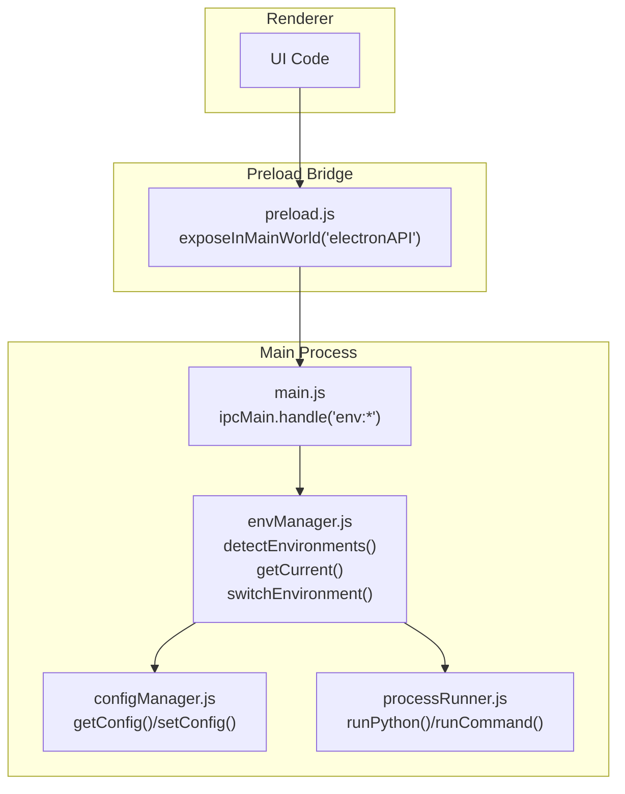
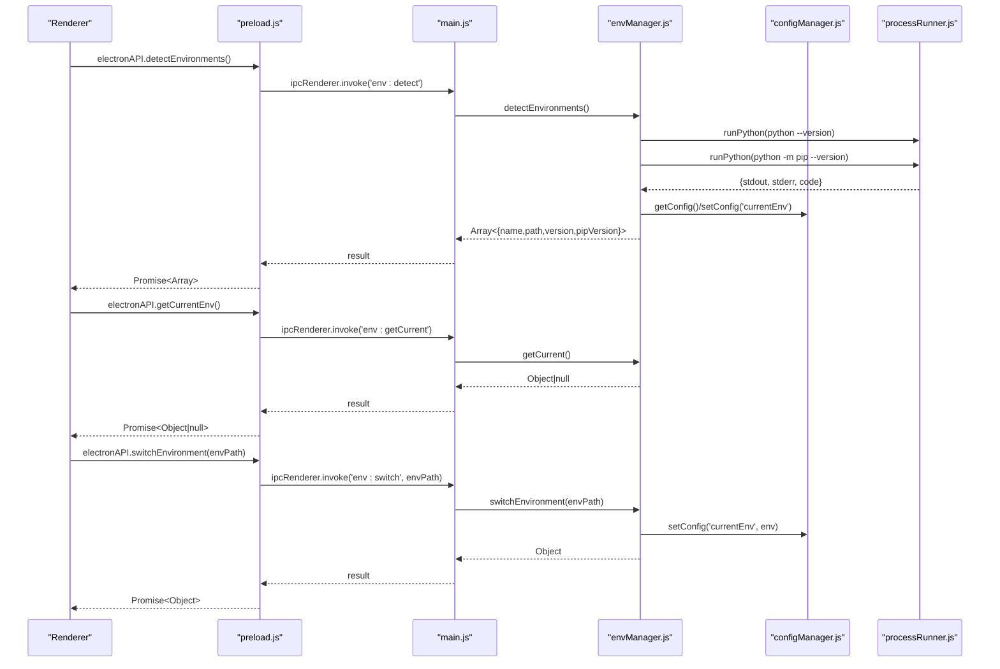
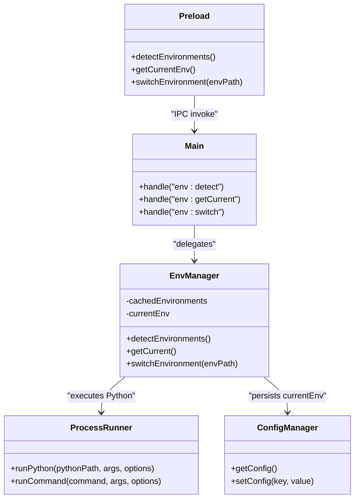

# Environment Management API

<cite>
**Referenced Files in This Document**
- [envManager.js](file://core/system/envManager.js)
- [main.js](file://main.js)
- [preload.js](file://preload.js)
- [processRunner.js](file://utils/processRunner.js)
- [configManager.js](file://core/config/configManager.js)
</cite>

## Table of Contents
1. [Introduction](#introduction)
2. [Project Structure](#project-structure)
3. [Core Components](#core-components)
4. [Architecture Overview](#architecture-overview)
5. [Detailed Component Analysis](#detailed-component-analysis)
6. [Dependency Analysis](#dependency-analysis)
7. [Performance Considerations](#performance-considerations)
8. [Troubleshooting Guide](#troubleshooting-guide)
9. [Conclusion](#conclusion)
10. [Appendices](#appendices)

## Introduction
This document describes the Python environment management IPC API exposed by the application. It focuses on three core methods:
- detectEnvironments
- getCurrentEnv
- switchEnvironment

It explains how environments are detected (system Python, Conda, virtualenv), how switching works, parameter validation, return value structures, error handling patterns, and the underlying IPC channels and data formats used for communication between the renderer and main processes.

## Project Structure
The environment management feature spans several modules:
- Renderer exposes safe APIs via preload.js
- Main process registers IPC handlers in main.js
- Core logic resides in envManager.js
- Subprocess execution is handled by processRunner.js
- Configuration persistence is managed by configManager.js

**Diagram sources**
- [preload.js:20-31](file://preload.js#L20-L31)
- [main.js:254-261](file://main.js#L254-L261)
- [envManager.js:85-219](file://core/system/envManager.js#L85-L219)
- [processRunner.js:340-353](file://utils/processRunner.js#L340-L353)
- [configManager.js:144-178](file://core/config/configManager.js#L144-L178)

**Section sources**
- [preload.js:20-31](file://preload.js#L20-L31)
- [main.js:254-261](file://main.js#L254-L261)
- [envManager.js:85-219](file://core/system/envManager.js#L85-L219)
- [processRunner.js:340-353](file://utils/processRunner.js#L340-L353)
- [configManager.js:144-178](file://core/config/configManager.js#L144-L178)

## Core Components
- detectEnvironments(): Scans common paths and PATH to discover Python installations, validates pip availability, builds a normalized list with name/path/version/pipVersion, persists currentEnv if needed, and caches results.
- getCurrentEnv(): Returns the currently selected environment from memory or configuration.
- switchEnvironment(envPath): Validates path existence, selects an environment from cache or creates a minimal object, persists it, and returns the new current environment.

Key behaviors:
- Supports system Python, Windows Store Python, user-level installs, Anaconda/Miniconda, and Conda environments.
- Uses glob patterns and where python to find executables.
- Filters out environments without pip.
- Auto-selects the first valid environment when none is set.
- Persists currentEnv to configuration file.

**Section sources**
- [envManager.js:31-41](file://core/system/envManager.js#L31-L41)
- [envManager.js:85-170](file://core/system/envManager.js#L85-L170)
- [envManager.js:178-184](file://core/system/envManager.js#L178-L184)
- [envManager.js:196-209](file://core/system/envManager.js#L196-L209)

## Architecture Overview
The IPC flow for environment operations:

**Diagram sources**
- [preload.js:29-31](file://preload.js#L29-L31)
- [main.js:257-261](file://main.js#L257-L261)
- [envManager.js:85-209](file://core/system/envManager.js#L85-L209)
- [processRunner.js:340-353](file://utils/processRunner.js#L340-L353)
- [configManager.js:157-178](file://core/config/configManager.js#L157-L178)

## Detailed Component Analysis

### detectEnvironments
Purpose:
- Discover all usable Python environments on the system.
- Validate each candidate by checking Python and pip versions.
- Normalize names and build a consistent structure.
- Restore previously selected environment if still valid.
- Cache results and auto-select first environment if none is set.

Detection logic:
- Scans predefined glob patterns for common installation locations including system Python, user-level installs, Windows Store Python, and Conda/Miniconda paths.
- Executes where python to include PATH-resolved interpreters.
- For each candidate, runs version checks using runPython with timeouts.
- Filters out environments lacking pip.
- Generates friendly names based on directory structure and Python version.

Return value:
- Promise resolving to an array of environment objects:
  - name: string (friendly display name)
  - path: string (absolute path to python.exe)
  - version: string (Python version)
  - pipVersion: string (pip version or null if missing; filtered out before return)

Error handling:
- Glob errors are ignored.
- where command failures are ignored.
- Version detection failures yield 'unknown' or null values; environments without pip are excluded.

Concurrency:
- Parallel version queries for speed.

Persistence:
- If no currentEnv is set and environments exist, auto-selects the first and persists it.

**Section sources**
- [envManager.js:85-170](file://core/system/envManager.js#L85-L170)
- [envManager.js:48-71](file://core/system/envManager.js#L48-L71)
- [processRunner.js:340-353](file://utils/processRunner.js#L340-L353)

### getCurrentEnv
Purpose:
- Return the currently selected Python environment.

Behavior:
- Returns cached currentEnv if present.
- Otherwise loads from configuration.
- Returns null if no environment is configured.

Return value:
- Promise resolving to an environment object or null.

Validation:
- No input parameters; relies on internal state and configuration.

**Section sources**
- [envManager.js:178-184](file://core/system/envManager.js#L178-L184)
- [configManager.js:144-147](file://core/config/configManager.js#L144-L147)

### switchEnvironment
Purpose:
- Switch the active Python environment to the specified executable path.

Parameters:
- envPath: string (required). Must be an absolute path to a Python executable.

Behavior:
- Looks up the environment in the cached list.
- If not found but the path exists, constructs a minimal environment object.
- Throws an error if the path does not exist.
- Persists the new currentEnv immediately.

Return value:
- Promise resolving to the updated environment object.

Error handling:
- Throws Error with message indicating environment not found when path does not exist.

**Section sources**
- [envManager.js:196-209](file://core/system/envManager.js#L196-L209)
- [configManager.js:157-178](file://core/config/configManager.js#L157-L178)

### IPC Channels and Data Formats
Channels:
- env:detect → returns Array<Environment>
- env:getCurrent → returns Environment | null
- env:switch → accepts string envPath, returns Environment

Data format:
- Environment object:
  - name: string
  - path: string
  - version: string
  - pipVersion: string

Channel mapping:
- Renderer calls electronAPI.detectEnvironments(), electronAPI.getCurrentEnv(), electronAPI.switchEnvironment(envPath).
- Preload forwards these to main via ipcRenderer.invoke with channel names.
- Main handles them via ipcMain.handle and delegates to envManager functions.

**Section sources**
- [preload.js:29-31](file://preload.js#L29-L31)
- [main.js:257-261](file://main.js#L257-L261)

### Supported Python Installations
Detected categories:
- System Python (common install paths)
- User-level Python installs under AppData/Local/Programs/Python
- Windows Store Python
- Conda environments under .conda/envs
- Anaconda/Miniconda installations (user and system-wide)

Detection mechanisms:
- Glob patterns for known directories
- PATH resolution via where python
- Validation through Python and pip version commands

**Section sources**
- [envManager.js:31-41](file://core/system/envManager.js#L31-L41)
- [envManager.js:103-117](file://core/system/envManager.js#L103-L117)
- [envManager.js:48-71](file://core/system/envManager.js#L48-L71)

### Practical Workflows

#### Discovery Workflow
Steps:
1. Call detectEnvironments().
2. Iterate returned array to display available environments.
3. Optionally persist selection or use auto-selected default.

Notes:
- Environments without pip are excluded.
- Names are human-friendly and may reflect Python version.

#### Switching Workflow
Steps:
1. Choose an environment path from the discovered list.
2. Call switchEnvironment(envPath).
3. Handle success or error (path not found).
4. Use getCurrentEnv() to verify the new current environment.

Notes:
- Immediate persistence ensures subsequent operations use the correct interpreter.

**Section sources**
- [envManager.js:85-170](file://core/system/envManager.js#L85-L170)
- [envManager.js:196-209](file://core/system/envManager.js#L196-L209)

## Dependency Analysis
Relationships among components:
- preload.js exposes electronAPI methods that invoke IPC channels.
- main.js registers handlers for env:* channels and delegates to envManager.
- envManager depends on processRunner for subprocess execution and configManager for persistence.
- processRunner provides runPython/runCommand utilities with timeout, cancellation, and output streaming.

**Diagram sources**
- [preload.js:29-31](file://preload.js#L29-L31)
- [main.js:257-261](file://main.js#L257-L261)
- [envManager.js:85-219](file://core/system/envManager.js#L85-L219)
- [processRunner.js:340-353](file://utils/processRunner.js#L340-L353)
- [configManager.js:144-178](file://core/config/configManager.js#L144-L178)

**Section sources**
- [preload.js:29-31](file://preload.js#L29-L31)
- [main.js:257-261](file://main.js#L257-L261)
- [envManager.js:85-219](file://core/system/envManager.js#L85-L219)
- [processRunner.js:340-353](file://utils/processRunner.js#L340-L353)
- [configManager.js:144-178](file://core/config/configManager.js#L144-L178)

## Performance Considerations
- Parallel version queries reduce detection time when many environments are present.
- Timeout limits prevent hanging on unresponsive interpreters.
- Caching of currentEnv avoids repeated config reads.
- Filtering out environments without pip reduces unnecessary processing.

Recommendations:
- Prefer using detectEnvironments once at startup and reuse the cached list.
- Avoid frequent switchEnvironment calls; batch changes if possible.
- Ensure PATH includes desired interpreters to minimize manual path specification.

[No sources needed since this section provides general guidance]

## Troubleshooting Guide
Common issues and resolutions:
- Environment not found during switch:
  - Cause: Invalid or non-existent path passed to switchEnvironment.
  - Resolution: Verify path exists and points to a Python executable.
- Missing pip:
  - Cause: Candidate Python lacks pip; such environments are filtered out.
  - Resolution: Install pip for the target interpreter or choose another environment.
- Slow detection:
  - Cause: Many candidates or slow disk I/O.
  - Resolution: Ensure only necessary interpreters are installed; rely on caching.
- Incorrect currentEnv after restart:
  - Cause: Config file corruption or missing entry.
  - Resolution: Re-run detectEnvironments and switchEnvironment to re-establish currentEnv.

Error patterns:
- switchEnvironment throws Error when path does not exist.
- Version detection returns 'unknown' or null when commands fail; environments without pip are excluded.

**Section sources**
- [envManager.js:196-209](file://core/system/envManager.js#L196-L209)
- [envManager.js:48-71](file://core/system/envManager.js#L48-L71)

## Conclusion
The environment management API provides robust discovery and switching capabilities across multiple Python installation types. It leverages IPC for secure communication, uses subprocess execution for accurate detection, and persists selections reliably. By following the documented workflows and error handling patterns, users can confidently manage Python environments within the application.

[No sources needed since this section summarizes without analyzing specific files]

## Appendices

### API Reference Summary
- detectEnvironments(): Promise<Array<Environment>>
- getCurrentEnv(): Promise<Environment | null>
- switchEnvironment(envPath): Promise<Environment>

Environment object fields:
- name: string
- path: string
- version: string
- pipVersion: string

IPC channels:
- env:detect
- env:getCurrent
- env:switch

**Section sources**
- [preload.js:29-31](file://preload.js#L29-L31)
- [main.js:257-261](file://main.js#L257-L261)
- [envManager.js:85-209](file://core/system/envManager.js#L85-L209)