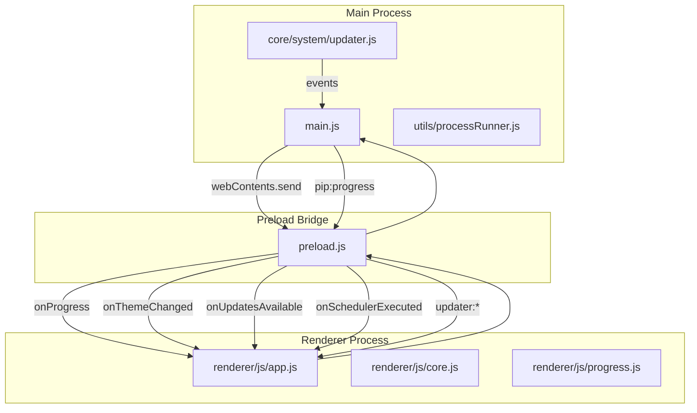
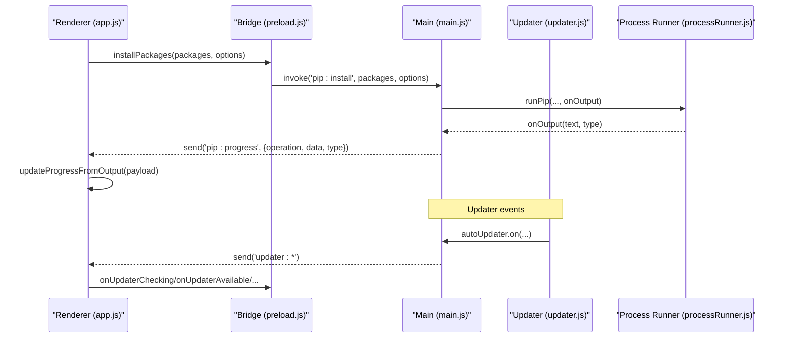
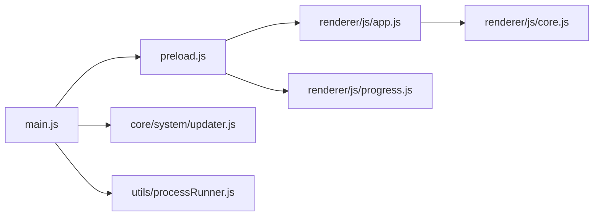

# Event Listeners API

<cite>
**Referenced Files in This Document**
- [main.js](file://main.js)
- [preload.js](file://preload.js)
- [renderer/js/app.js](file://renderer/js/app.js)
- [renderer/js/core.js](file://renderer/js/core.js)
- [renderer/js/progress.js](file://renderer/js/progress.js)
- [core/system/updater.js](file://core/system/updater.js)
- [utils/processRunner.js](file://utils/processRunner.js)
</cite>

## Table of Contents
1. [Introduction](#introduction)
2. [Project Structure](#project-structure)
3. [Core Components](#core-components)
4. [Architecture Overview](#architecture-overview)
5. [Detailed Component Analysis](#detailed-component-analysis)
6. [Dependency Analysis](#dependency-analysis)
7. [Performance Considerations](#performance-considerations)
8. [Troubleshooting Guide](#troubleshooting-guide)
9. [Conclusion](#conclusion)
10. [Appendices](#appendices)

## Introduction
This document explains the event-driven IPC communication patterns used by PyLibMaster to connect the Electron main process with the renderer process. It covers all available event listeners and their payloads, subscription patterns, callback registration, memory management, and lifecycle considerations. You will learn how to implement real-time progress tracking, theme synchronization, update notifications, and background task monitoring safely and efficiently.

## Project Structure
The IPC and event system spans three layers:
- Main process (Node.js): Registers IPC handlers and pushes events to the renderer via webContents.send.
- Preload bridge: Exposes safe APIs to the renderer and subscribes to IPC channels.
- Renderer process: Subscribes to events and updates UI state accordingly.

**Diagram sources**
- [main.js:136-144](file://main.js#L136-L144)
- [main.js:201-208](file://main.js#L201-L208)
- [main.js:266-347](file://main.js#L266-L347)
- [main.js:528-546](file://main.js#L528-L546)
- [core/system/updater.js:38-76](file://core/system/updater.js#L38-L76)
- [preload.js:115-131](file://preload.js#L115-L131)
- [preload.js:179-184](file://preload.js#L179-L184)
- [preload.js:188-219](file://preload.js#L188-L219)
- [renderer/js/app.js:82-102](file://renderer/js/app.js#L82-L102)
- [renderer/js/progress.js:101-141](file://renderer/js/progress.js#L101-L141)

**Section sources**
- [main.js:133-150](file://main.js#L133-L150)
- [preload.js:14-221](file://preload.js#L14-L221)
- [renderer/js/app.js:1-210](file://renderer/js/app.js#L1-L210)

## Core Components
- Main process IPC handlers: Define request/response handlers and push progress/event messages to the renderer using event.sender.send or mainWindow.webContents.send.
- Preload bridge: Exposes methods like onProgress, onThemeChanged, onUpdatesAvailable, onSchedulerExecuted, and updater event listeners; ensures only one listener per channel is active at a time.
- Renderer modules: Subscribe to events and update UI state; manage timers for progress visibility and avoid memory leaks by removing old listeners before adding new ones.

Key responsibilities:
- Progress events: pip operations emit structured progress messages that the renderer parses to update counts and percentages.
- Theme sync: System theme changes are forwarded to the renderer when configured to follow the system.
- Update notifications: The updater module emits check/download/completion/error events.
- Scheduler events: Background tasks notify the renderer upon execution completion.

**Section sources**
- [main.js:266-347](file://main.js#L266-L347)
- [main.js:201-208](file://main.js#L201-L208)
- [main.js:528-546](file://main.js#L528-L546)
- [core/system/updater.js:38-76](file://core/system/updater.js#L38-L76)
- [preload.js:115-131](file://preload.js#L115-L131)
- [preload.js:179-184](file://preload.js#L179-L184)
- [preload.js:188-219](file://preload.js#L188-L219)
- [renderer/js/progress.js:101-141](file://renderer/js/progress.js#L101-L141)

## Architecture Overview
The application uses a unidirectional event flow from main to renderer for asynchronous updates, while synchronous requests use ipcRenderer.invoke paired with ipcMain.handle.

**Diagram sources**
- [main.js:311-336](file://main.js#L311-L336)
- [utils/processRunner.js:340-353](file://utils/processRunner.js#L340-L353)
- [core/system/updater.js:38-76](file://core/system/updater.js#L38-L76)
- [preload.js:179-184](file://preload.js#L179-L184)
- [preload.js:188-219](file://preload.js#L188-L219)
- [renderer/js/app.js:82-84](file://renderer/js/app.js#L82-L84)

## Detailed Component Analysis

### Event Subscription Patterns
- One listener per channel: Each onXxx method removes existing listeners before registering a new one to prevent duplicates and memory leaks.
- Callback-first design: All event subscriptions accept a callback function that receives the payload.
- Safe exposure: Only explicitly exposed methods are available in the renderer via window.electronAPI.

Common patterns:
- Remove old listeners: ipcRenderer.removeAllListeners('channel') before ipcRenderer.on('channel', handler).
- Use removeListener for fine-grained cleanup when needed.
- Centralize subscriptions in app initialization to ensure consistent lifecycle.

**Section sources**
- [preload.js:115-131](file://preload.js#L115-L131)
- [preload.js:179-184](file://preload.js#L179-L184)
- [preload.js:188-219](file://preload.js#L188-L219)
- [renderer/js/app.js:82-102](file://renderer/js/app.js#L82-L102)

### onProgress Event
Purpose:
- Provides real-time progress for pip operations (install/uninstall/update/repair/rollback/audit/download/undo).

Payload structure:
- operation: string indicating the operation type.
- data: string containing either structured progress JSON prefixed with a marker or raw pip output.
- type: stream type ('stdout' or 'stderr').

Renderer handling:
- Parses structured progress markers to increment done counters and compute percentages.
- Extracts package names from typical pip output lines to update current package labels.
- Resets and finalizes progress UI based on operation start/end signals.

Implementation highlights:
- Main process forwards onOutput callbacks from processRunner to the renderer via pip:progress.
- Renderer decodes structured progress and falls back to text parsing for operations without structured markers.

**Section sources**
- [main.js:266-347](file://main.js#L266-L347)
- [main.js:558-584](file://main.js#L558-L584)
- [main.js:596-600](file://main.js#L596-L600)
- [main.js:624-628](file://main.js#L624-L628)
- [utils/processRunner.js:116-127](file://utils/processRunner.js#L116-L127)
- [renderer/js/progress.js:101-141](file://renderer/js/progress.js#L101-L141)

### onThemeChanged Event
Purpose:
- Synchronizes UI theme with system theme when configured to follow the system.

Flow:
- Main process listens to nativeTheme.updated and sends theme:changed to the renderer with 'dark' or 'light'.
- Renderer toggles body class to apply dark/light styles.

Subscription:
- onThemeChanged(callback) registers a single listener and removes previous ones to avoid duplication.

**Section sources**
- [main.js:201-208](file://main.js#L201-L208)
- [preload.js:115-118](file://preload.js#L115-L118)
- [renderer/js/app.js:87-89](file://renderer/js/app.js#L87-L89)

### onUpdatesAvailable Event
Purpose:
- Notifies the renderer about the number of outdated packages detected at startup.

Flow:
- On app ready, an async check runs after a delay and sends updates:available with the count if any outdated packages exist.

Subscription:
- onUpdatesAvailable(callback) registers a single listener and removes previous ones.

**Section sources**
- [main.js:217-231](file://main.js#L217-L231)
- [preload.js:119-122](file://preload.js#L119-L122)
- [renderer/js/app.js:92-96](file://renderer/js/app.js#L92-L96)

### onSchedulerExecuted Event
Purpose:
- Informs the renderer when a scheduled background task completes.

Flow:
- Scheduler manager invokes a callback which main forwards to the renderer via scheduler:executed.

Subscription:
- onSchedulerExecuted(callback) registers a single listener and removes previous ones.

**Section sources**
- [main.js:140-144](file://main.js#L140-L144)
- [main.js:528-546](file://main.js#L528-L546)
- [preload.js:128-131](file://preload.js#L128-L131)
- [renderer/js/app.js:99-102](file://renderer/js/app.js#L99-L102)

### Updater Events
Purpose:
- Provide real-time feedback during automatic update checks and downloads.

Channels:
- updater:checking
- updater:available
- updater:not-available
- updater:progress
- updater:downloaded
- updater:error

Flow:
- Updater module binds autoUpdater events and forwards them to the renderer through main’s send helper.
- Renderer exposes onUpdaterChecking, onUpdaterAvailable, onUpdaterNotAvailable, onUpdaterProgress, onUpdaterDownloaded, onUpdaterError.

Best practices:
- Ensure only one listener per channel is active at a time.
- Handle errors gracefully and log them for diagnostics.

**Section sources**
- [core/system/updater.js:38-76](file://core/system/updater.js#L38-L76)
- [preload.js:188-219](file://preload.js#L188-L219)

### Memory Management and Lifecycle
- Listener deduplication: Each onXxx method calls removeAllListeners before adding a new listener to prevent accumulation.
- Cleanup on navigation or component teardown: If your renderer logic reinitializes frequently, call removeProgressListener or re-subscribe carefully to avoid orphaned callbacks.
- Timer hygiene: Progress cards use timers to hide after completion; ensure timers are cleared when starting a new operation to avoid accidental hiding.

Recommendations:
- Centralize event subscriptions at app initialization.
- Avoid creating multiple instances of the same listener.
- Clear timers and references when components unmount or when operations restart.

**Section sources**
- [preload.js:115-131](file://preload.js#L115-L131)
- [preload.js:179-184](file://preload.js#L179-L184)
- [renderer/js/progress.js:20-35](file://renderer/js/progress.js#L20-L35)

## Dependency Analysis
The event system depends on these core relationships:
- main.js orchestrates IPC handlers and event forwarding.
- preload.js bridges renderer calls and subscribes to IPC channels.
- updater.js emits update-related events.
- processRunner.js streams output that becomes pip:progress events.
- renderer modules consume events and update UI.

**Diagram sources**
- [main.js:136-144](file://main.js#L136-L144)
- [main.js:266-347](file://main.js#L266-L347)
- [core/system/updater.js:38-76](file://core/system/updater.js#L38-L76)
- [utils/processRunner.js:116-127](file://utils/processRunner.js#L116-L127)
- [preload.js:115-131](file://preload.js#L115-L131)
- [renderer/js/app.js:82-102](file://renderer/js/app.js#L82-L102)

**Section sources**
- [main.js:133-150](file://main.js#L133-L150)
- [preload.js:14-221](file://preload.js#L14-L221)
- [core/system/updater.js:1-104](file://core/system/updater.js#L1-L104)
- [utils/processRunner.js:1-366](file://utils/processRunner.js#L1-L366)
- [renderer/js/app.js:1-210](file://renderer/js/app.js#L1-L210)

## Performance Considerations
- Batch UI updates: Group frequent progress updates to minimize DOM churn.
- Debounce heavy operations: For example, saving window bounds uses a debounce pattern to reduce disk writes.
- Cache results: Installed package lists can be cached to speed up initial rendering.
- Avoid redundant listeners: Always remove previous listeners before subscribing again.
- Stream processing: Use streaming output from child processes to keep UI responsive.

[No sources needed since this section provides general guidance]

## Troubleshooting Guide
Common issues and resolutions:
- Duplicate listeners causing multiple callbacks: Ensure removeAllListeners is called before onXxx registration.
- Progress not updating: Verify pip:progress events are being sent and parsed correctly; check structured markers and fallback parsing.
- Theme not syncing: Confirm theme configuration is set to follow the system and that nativeTheme updates are received.
- Update events not firing: Check network connectivity and updater configuration; handle error events to diagnose failures.
- Memory leaks: Inspect lingering timers and event listeners; clear them on component teardown.

**Section sources**
- [preload.js:115-131](file://preload.js#L115-L131)
- [renderer/js/progress.js:101-141](file://renderer/js/progress.js#L101-L141)
- [core/system/updater.js:71-76](file://core/system/updater.js#L71-L76)

## Conclusion
PyLibMaster’s event-driven IPC architecture enables robust, real-time communication between the main and renderer processes. By following the documented subscription patterns, payload structures, and lifecycle best practices, you can implement reliable progress tracking, theme synchronization, update notifications, and background task monitoring while avoiding memory leaks and performance pitfalls.

[No sources needed since this section summarizes without analyzing specific files]

## Appendices

### Event Payload Reference
- pip:progress
  - operation: string (install/uninstall/update/repair/rollback/audit/download/undo/venv)
  - data: string (structured progress marker or raw pip output)
  - type: string (stdout/stderr)
- theme:changed
  - theme: string ('dark' | 'light')
- updates:available
  - count: number (outdated packages)
- scheduler:executed
  - message: string (execution result or status)
- updater:*
  - updater:checking: no payload
  - updater:available: info object (version details)
  - updater:not-available: info object
  - updater:progress: progress object (percentage, speed, etc.)
  - updater:downloaded: info object
  - updater:error: error object (message)

**Section sources**
- [main.js:266-347](file://main.js#L266-L347)
- [main.js:201-208](file://main.js#L201-L208)
- [main.js:217-231](file://main.js#L217-L231)
- [main.js:528-546](file://main.js#L528-L546)
- [core/system/updater.js:38-76](file://core/system/updater.js#L38-L76)
- [preload.js:115-131](file://preload.js#L115-L131)
- [preload.js:179-184](file://preload.js#L179-L184)
- [preload.js:188-219](file://preload.js#L188-L219)
- [renderer/js/progress.js:101-141](file://renderer/js/progress.js#L101-L141)