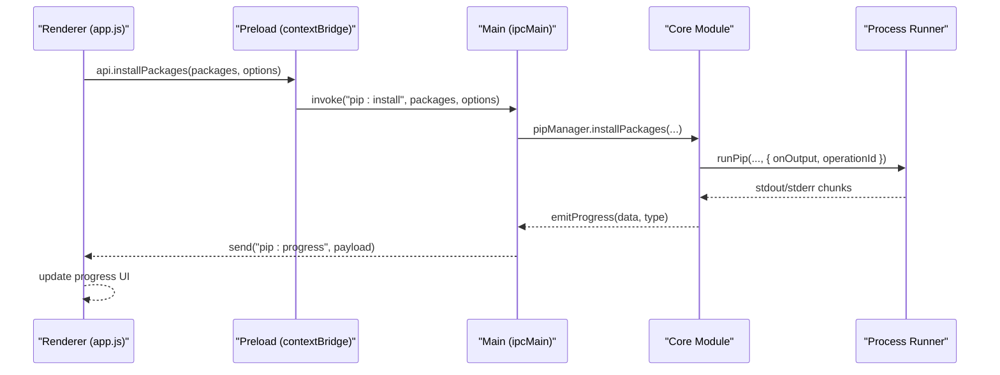
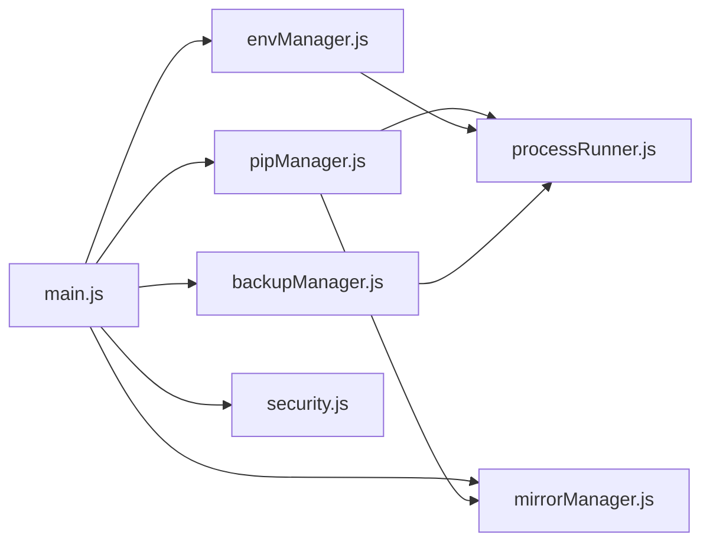

# IPC Communication

<cite>
**Referenced Files in This Document**
- [main.js](file://main.js)
- [preload.js](file://preload.js)
- [package.json](file://package.json)
- [core/operations/pipManager.js](file://core/operations/pipManager.js)
- [core/system/envManager.js](file://core/system/envManager.js)
- [core/config/mirrorManager.js](file://core/config/mirrorManager.js)
- [core/operations/backupManager.js](file://core/operations/backupManager.js)
- [utils/processRunner.js](file://utils/processRunner.js)
- [utils/security.js](file://utils/security.js)
- [renderer/js/app.js](file://renderer/js/app.js)
- [renderer/js/core.js](file://renderer/js/core.js)
</cite>

## Table of Contents
1. [Introduction](#introduction)
2. [Project Structure](#project-structure)
3. [Core Components](#core-components)
4. [Architecture Overview](#architecture-overview)
5. [Detailed Component Analysis](#detailed-component-analysis)
6. [Dependency Analysis](#dependency-analysis)
7. [Performance Considerations](#performance-considerations)
8. [Troubleshooting Guide](#troubleshooting-guide)
9. [Conclusion](#conclusion)
10. [Appendices](#appendices)

## Introduction
This document provides comprehensive IPC communication documentation for PyLibMaster’s Electron-based architecture. It covers all available IPC handlers exposed by the main process, including window control, environment management, package operations, backup management, mirror configuration, and system integration. It explains request/response patterns, parameter validation, error handling strategies, and event-driven communication. It also includes guidance for client-side implementation using contextBridge, proper error handling with try-catch blocks, async operation patterns, security considerations (input sanitization, path validation, command injection prevention), and troubleshooting techniques.

## Project Structure
PyLibMaster follows a standard Electron architecture:
- Main process (Node.js): Registers IPC handlers and orchestrates core modules.
- Preload script: Exposes a safe API surface to the renderer via contextBridge.
- Renderer process: Uses the exposed API to call IPC handlers and listen for events.
- Core modules: Implement business logic for pip operations, environment detection, mirrors, backups, etc.
- Utilities: Provide process execution, security helpers, and shared utilities.

```mermaid
graph TB
subgraph "Renderer"
RApp["renderer/js/app.js"]
RCore["renderer/js/core.js"]
end
subgraph "Preload"
Preload["preload.js"]
end
subgraph "Main"
Main["main.js"]
end
subgraph "Core Modules"
PipMgr["core/operations/pipManager.js"]
EnvMgr["core/system/envManager.js"]
MirrorMgr["core/config/mirrorManager.js"]
BackupMgr["core/operations/backupManager.js"]
end
subgraph "Utilities"
ProcRun["utils/processRunner.js"]
Sec["utils/security.js"]
end
RApp --> RCore
RCore --> Preload
Preload --> Main
Main --> PipMgr
Main --> EnvMgr
Main --> MirrorMgr
Main --> BackupMgr
PipMgr --> ProcRun
Main --> ProcRun
Main --> Sec
```

**Diagram sources**
- [main.js:1-120](file://main.js#L1-L120)
- [preload.js:1-221](file://preload.js#L1-L221)
- [core/operations/pipManager.js:1-120](file://core/operations/pipManager.js#L1-L120)
- [core/system/envManager.js:1-60](file://core/system/envManager.js#L1-L60)
- [core/config/mirrorManager.js:1-60](file://core/config/mirrorManager.js#L1-L60)
- [core/operations/backupManager.js:1-60](file://core/operations/backupManager.js#L1-L60)
- [utils/processRunner.js:1-80](file://utils/processRunner.js#L1-L80)
- [utils/security.js:1-43](file://utils/security.js#L1-L43)

**Section sources**
- [main.js:1-120](file://main.js#L1-L120)
- [preload.js:1-221](file://preload.js#L1-L221)
- [package.json:1-79](file://package.json#L1-L79)

## Core Components
- Window Control: Minimize, maximize/toggle, close.
- Environment Management: Detect environments, get current, switch environment.
- Virtual Environment Management: Create, list, delete, info.
- Package Operations: List installed/cached/outdated, search, show info, dependency tree, export/import requirements, compare environments, install/uninstall/update, cancel, repair, check conflicts, health check, disk usage, download packages, diff requirements, releases, dependency graph.
- Backup Management: Create, list, restore, delete.
- Mirror Configuration: List, test speed, set default, add/update/remove custom, restore defaults, smart route, write pip config, reorder.
- System Integration: Version, browse directory/file, open path, notifications, theme sync, scheduler status/save/run now, templates/snapshots, audit scan, undo operations, Windows Explorer menu enable/disable.

All handlers are registered in the main process and exposed through preload.js to the renderer.

**Section sources**
- [main.js:233-640](file://main.js#L233-L640)
- [preload.js:20-221](file://preload.js#L20-L221)

## Architecture Overview
The IPC flow is strictly controlled:
- Renderer calls methods on window.electronAPI (exposed by preload).
- Preload uses ipcRenderer.invoke to send requests to main.
- Main handles requests via ipcMain.handle and delegates to core modules.
- Long-running or streaming operations push progress updates via ipcRenderer.send('pip:progress') and other events.



**Diagram sources**
- [preload.js:59-64](file://preload.js#L59-L64)
- [main.js:311-336](file://main.js#L311-L336)
- [core/operations/pipManager.js:513-596](file://core/operations/pipManager.js#L513-L596)
- [utils/processRunner.js:85-161](file://utils/processRunner.js#L85-L161)

## Detailed Component Analysis

### Window Control Handlers
- window:minimize: Minimizes the main window if it exists.
- window:maximize: Toggles between maximized and normal state.
- window:close: Closes the main window.

These handlers ensure safe window manipulation without exposing Node APIs to the renderer.

**Section sources**
- [main.js:237-252](file://main.js#L237-L252)
- [preload.js:23-25](file://preload.js#L23-L25)

### Environment Management Handlers
- env:detect: Scans common Python installations, PATH entries, and returns versions.
- env:getCurrent: Returns the currently selected environment.
- env:switch: Switches to a specified Python executable path and persists selection.

Validation and safety:
- Path existence checks and fallbacks.
- Environment object creation when not cached but path exists.

**Section sources**
- [main.js:257-261](file://main.js#L257-L261)
- [core/system/envManager.js:85-170](file://core/system/envManager.js#L85-L170)
- [core/system/envManager.js:196-209](file://core/system/envManager.js#L196-L209)
- [preload.js:29-31](file://preload.js#L29-L31)

### Virtual Environment Management Handlers
- venv:create: Creates a virtual environment with progress callbacks.
- venv:list: Lists all virtual environments.
- venv:delete: Deletes a virtual environment with progress callbacks.
- venv:info: Retrieves detailed information about a specific virtual environment.

Progress events are emitted via 'pip:progress' for real-time UI updates.

**Section sources**
- [main.js:266-281](file://main.js#L266-L281)
- [preload.js:35-38](file://preload.js#L35-L38)

### Package Query Handlers
- pip:list: Real-time scan of site-packages with size/install time estimation.
- pip:listCached: Cached list with TTL.
- pip:outdated: Lists outdated packages.
- pip:search: Searches PyPI using pip index versions.
- pip:showInfo: Shows package details.
- pip:depTree: Dependency tree.
- pip:export: Export requirements.txt.
- pip:import: Import from requirements.txt with progress.
- pip:compareEnvs: Compare two environments.

Security:
- Package name/version spec validation prevents command injection.
- Wheel file path validation prevents traversal and UNC paths.

**Section sources**
- [main.js:285-305](file://main.js#L285-L305)
- [core/operations/pipManager.js:400-490](file://core/operations/pipManager.js#L400-L490)
- [core/operations/pipManager.js:154-235](file://core/operations/pipManager.js#L154-L235)
- [preload.js:42-55](file://preload.js#L42-L55)

### Package Operation Handlers
- pip:install: Batch install with parallelism, retries, auto rollback, progress.
- pip:installFromFile: Install from .whl or requirements.txt.
- pip:uninstall: Batch uninstall with safety modes and rollback.
- pip:update: Batch update with retries and rollback.
- pip:cancel: Cancel ongoing operations by operationId.
- pip:repair: Repair pip installation.
- pip:checkConflicts: Dependency conflict detection.
- pip:healthCheck: Environment health diagnostics.
- pip:diskUsage: Disk usage analysis.
- pip:download: Download packages offline.
- pip:diffRequirements: Compare requirements sources.
- pip:releases: Get release history.
- pip:depGraph: Full dependency graph.

Error handling:
- Environment locks prevent concurrent operations per environment.
- Backups created before risky operations; automatic rollback on failure.
- Progress events provide granular feedback.

**Section sources**
- [main.js:311-353](file://main.js#L311-L353)
- [core/operations/pipManager.js:513-596](file://core/operations/pipManager.js#L513-L596)
- [core/operations/pipManager.js:645-730](file://core/operations/pipManager.js#L645-L730)
- [core/operations/pipManager.js:745-789](file://core/operations/pipManager.js#L745-L789)
- [utils/processRunner.js:168-206](file://utils/processRunner.js#L168-L206)
- [preload.js:59-64](file://preload.js#L59-L64)

### Backup Management Handlers
- backup:create: Freezes current environment into a backup file.
- backup:list: Lists backups sorted by creation time.
- backup:restore: Restores environment from backup with force reinstall.
- backup:delete: Deletes a backup file safely.

Security:
- Backup ID validation prevents path traversal and enforces naming conventions.

**Section sources**
- [main.js:358-368](file://main.js#L358-L368)
- [core/operations/backupManager.js:89-113](file://core/operations/backupManager.js#L89-L113)
- [core/operations/backupManager.js:156-170](file://core/operations/backupManager.js#L156-L170)
- [core/operations/backupManager.js:62-78](file://core/operations/backupManager.js#L62-L78)
- [preload.js:68-71](file://preload.js#L68-L71)

### Mirror Configuration Handlers
- mirror:list: Returns built-in and custom mirrors.
- mirror:test: Tests single mirror speed.
- mirror:testAll: Parallel speed tests for all mirrors.
- mirror:setDefault: Sets default mirror.
- mirror:addCustom: Adds custom mirror with URL validation.
- mirror:update: Updates mirror metadata and URL safely.
- mirror:removeCustom: Removes custom mirror and adjusts defaults.
- mirror:restoreDefaults: Resets to built-in mirrors.
- mirror:smartRoute: Enables/disables intelligent routing.
- mirror:getSmartRoute: Gets smart route status.
- mirror:writePipConfig: Writes effective mirror to pip config file.
- mirror:reorder: Reorders mirror priority.

Security:
- URL validation ensures http/https only and length limits.
- Duplicate URL checks and default mirror constraints.

**Section sources**
- [main.js:373-395](file://main.js#L373-L395)
- [core/config/mirrorManager.js:110-130](file://core/config/mirrorManager.js#L110-L130)
- [core/config/mirrorManager.js:139-150](file://core/config/mirrorManager.js#L139-L150)
- [core/config/mirrorManager.js:158-179](file://core/config/mirrorManager.js#L158-L179)
- [core/config/mirrorManager.js:219-247](file://core/config/mirrorManager.js#L219-L247)
- [core/config/mirrorManager.js:299-322](file://core/config/mirrorManager.js#L299-L322)
- [preload.js:75-86](file://preload.js#L75-L86)

### System Integration Handlers
- system:version: Returns app version and name.
- system:browseDirectory: Opens directory picker dialog.
- system:browseFile: Opens file picker dialog with filters.
- system:openPath: Opens a path with whitelist validation to prevent traversal.
- notify:send: Sends desktop notifications.
- theme:getSystem: Returns current system theme.
- scheduler:getStatus/save/runNow: Manages scheduled updates.
- template/list/add/remove/create: Template management.
- snapshot/create/list/detail/restore/delete: Snapshot lifecycle.
- audit:run/cached: Security vulnerability scanning.
- undo:canUndo/perform/clear: Undo operations.
- explorer:getStatus/enable/disable: Windows Explorer context menu integration.

Security:
- Path whitelisting for openPath using utility function.

**Section sources**
- [main.js:425-466](file://main.js#L425-L466)
- [main.js:471-480](file://main.js#L471-L480)
- [main.js:519-521](file://main.js#L519-L521)
- [main.js:526-546](file://main.js#L526-L546)
- [main.js:551-575](file://main.js#L551-L575)
- [main.js:580-586](file://main.js#L580-L586)
- [main.js:591-607](file://main.js#L591-L607)
- [main.js:622-630](file://main.js#L622-L630)
- [main.js:635-639](file://main.js#L635-L639)
- [utils/security.js:28-40](file://utils/security.js#L28-L40)
- [preload.js:102-114](file://preload.js#L102-L114)

### Event-Driven Communication
- pip:progress: Emitted during long-running pip operations with structured payloads for UI updates.
- theme:changed: Emitted when system theme changes.
- updates:available: Emitted when updates are detected at startup.
- scheduler:executed: Emitted when scheduled tasks complete.
- Updater events: checking, available, not-available, progress, downloaded, error.

Client-side listeners are provided via preload.js functions like onProgress, onThemeChanged, onUpdatesAvailable, onSchedulerExecuted, and updater event listeners.

**Section sources**
- [main.js:140-144](file://main.js#L140-L144)
- [main.js:224-229](file://main.js#L224-L229)
- [main.js:202-208](file://main.js#L202-L208)
- [preload.js:179-184](file://preload.js#L179-L184)
- [preload.js:115-122](file://preload.js#L115-L122)
- [preload.js:125-131](file://preload.js#L125-L131)
- [preload.js:188-219](file://preload.js#L188-L219)

## Dependency Analysis
IPC handlers depend on core modules and utilities:
- main.js registers handlers and delegates to core modules.
- pipManager depends on processRunner for subprocess execution and mirrorManager for mirror selection.
- envManager relies on processRunner for Python commands and configManager for persistence.
- backupManager uses processRunner and configManager for storage paths.
- mirrorManager writes pip configuration files and performs HTTP requests for speed tests.



**Diagram sources**
- [main.js:17-31](file://main.js#L17-L31)
- [core/operations/pipManager.js:20-28](file://core/operations/pipManager.js#L20-L28)
- [core/system/envManager.js:18-24](file://core/system/envManager.js#L18-L24)
- [core/operations/backupManager.js:19-24](file://core/operations/backupManager.js#L19-L24)
- [core/config/mirrorManager.js:15-20](file://core/config/mirrorManager.js#L15-L20)
- [utils/security.js:1-12](file://utils/security.js#L1-L12)

**Section sources**
- [main.js:17-31](file://main.js#L17-L31)
- [core/operations/pipManager.js:20-28](file://core/operations/pipManager.js#L20-L28)
- [core/system/envManager.js:18-24](file://core/system/envManager.js#L18-L24)
- [core/operations/backupManager.js:19-24](file://core/operations/backupManager.js#L19-L24)
- [core/config/mirrorManager.js:15-20](file://core/config/mirrorManager.js#L15-L20)
- [utils/security.js:1-12](file://utils/security.js#L1-L12)

## Performance Considerations
- Caching: Installed package lists use a 5-minute cache; site-packages path lookup has a 30-second TTL.
- Concurrency: Parallel installation/update with configurable thread count; environment-level locks prevent conflicts.
- I/O Optimization: Directory mapping built once per scan; folder size calculation uses caching and depth limits.
- Network: Mirror speed tests run in parallel; HTTP requests have timeouts and abort controllers.
- Process Management: Subprocesses tracked with cancellation support; graceful SIGTERM followed by SIGKILL after delay.

[No sources needed since this section provides general guidance]

## Troubleshooting Guide
Common IPC issues and debugging techniques:
- No response from handler: Ensure preload exposes the method and main registers the corresponding handler. Check console logs in both renderer and main.
- Progress not updating: Verify that onOutput callback is passed to processRunner and that 'pip:progress' events are being sent and listened to in the renderer.
- Permission errors: For system:openPath, confirm the target path is within allowed directories. Use isAllowedOpenPath to validate.
- Timeout errors: Increase timeout values for long-running operations; check network connectivity for mirror tests.
- Environment not found: Re-run env:detect to refresh cached environments; verify Python executable paths exist.
- Backup restore failures: Validate backup ID format and ensure the file exists; check pip logs for detailed errors.

**Section sources**
- [main.js:449-466](file://main.js#L449-L466)
- [utils/security.js:28-40](file://utils/security.js#L28-L40)
- [core/operations/backupManager.js:62-78](file://core/operations/backupManager.js#L62-L78)
- [utils/processRunner.js:150-161](file://utils/processRunner.js#L150-L161)
- [core/system/envManager.js:85-170](file://core/system/envManager.js#L85-L170)

## Conclusion
PyLibMaster’s IPC layer provides a secure, efficient, and feature-rich interface between the renderer and main processes. The design emphasizes input validation, path safety, and robust error handling while supporting real-time progress updates and asynchronous operations. By following the documented patterns and security practices, developers can extend functionality safely and maintain high performance.

[No sources needed since this section summarizes without analyzing specific files]

## Appendices

### Client-Side Implementation Examples
- Using contextBridge: Access window.electronAPI methods directly in the renderer.
- Async operations: Wrap calls in try-catch blocks to handle errors gracefully.
- Event listeners: Register listeners for progress and other events using provided helper functions.

Example patterns:
- Call an IPC handler: await api.installPackages(packages, options);
- Handle progress: api.onProgress((payload) => { /* update UI */ });
- Error handling: try { await api.switchEnvironment(path); } catch (err) { showToast(err.message); }

**Section sources**
- [renderer/js/core.js:12-13](file://renderer/js/core.js#L12-L13)
- [renderer/js/app.js:82-84](file://renderer/js/app.js#L82-L84)
- [preload.js:179-184](file://preload.js#L179-L184)