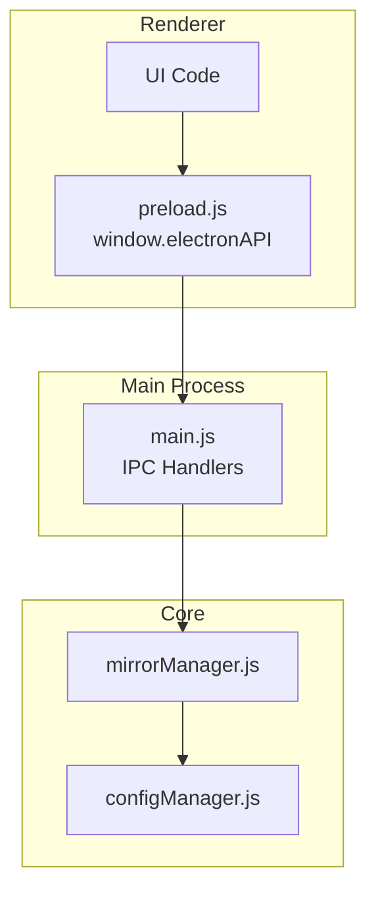
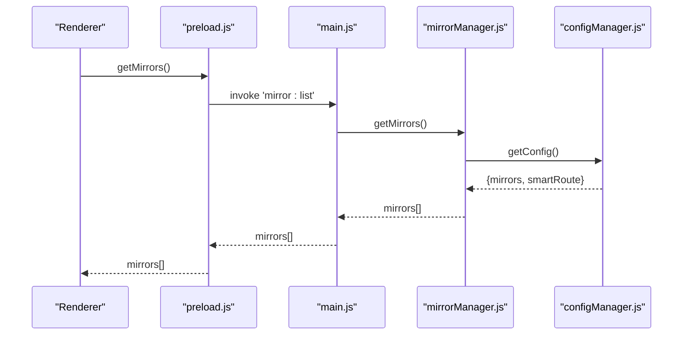
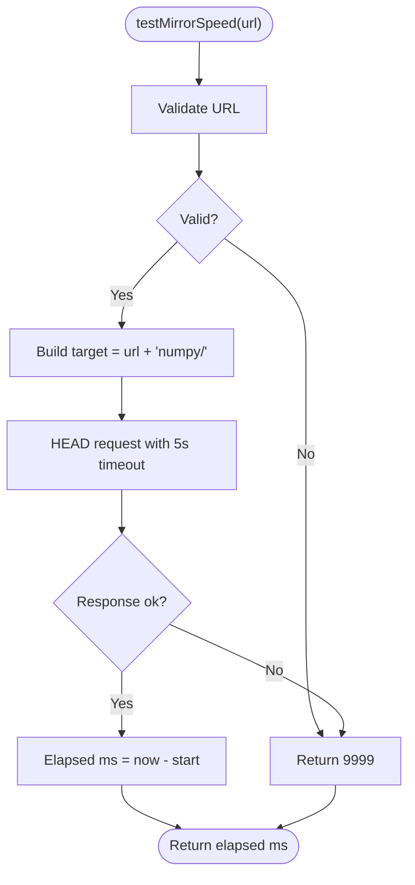
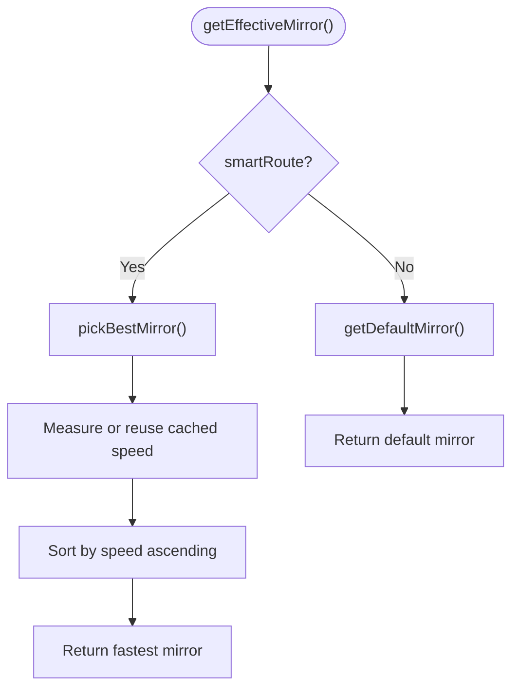
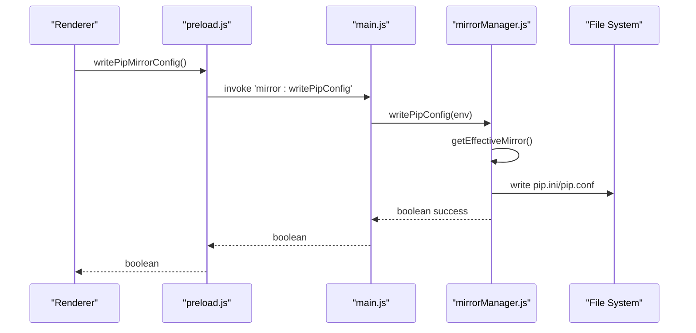
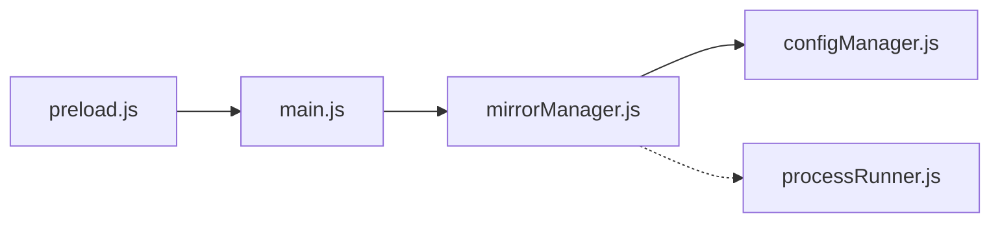

# Mirror Management API

<cite>
**Referenced Files in This Document**
- [mirrorManager.js](file://core/config/mirrorManager.js)
- [configManager.js](file://core/config/configManager.js)
- [main.js](file://main.js)
- [preload.js](file://preload.js)
- [processRunner.js](file://utils/processRunner.js)
</cite>

## Table of Contents
1. Introduction
2. Project Structure
3. Core Components
4. Architecture Overview
5. Detailed Component Analysis
6. Dependency Analysis
7. Performance Considerations
8. Troubleshooting Guide
9. Conclusion

## Introduction
This document explains the mirror source management IPC API used to manage PyPI mirrors, including listing mirrors, testing speeds, setting defaults, adding/updating/removing custom mirrors, and smart routing for automatic failover. It also covers configuration formats, speed testing algorithms, priority ordering, health monitoring, fallback strategies, and performance optimization techniques.

## Project Structure
The mirror management feature spans three layers:
- Renderer process exposes a safe API surface via preload.js
- Main process registers IPC handlers that delegate to core modules
- Core module mirrorManager.js implements mirror logic, persistence, and pip integration

**Diagram sources**
- [preload.js:73-86](file://preload.js#L73-L86)
- [main.js:370-395](file://main.js#L370-L395)
- [mirrorManager.js:1-30](file://core/config/mirrorManager.js#L1-L30)
- [configManager.js:1-30](file://core/config/configManager.js#L1-L30)

**Section sources**
- [preload.js:73-86](file://preload.js#L73-L86)
- [main.js:370-395](file://main.js#L370-L395)
- [mirrorManager.js:1-30](file://core/config/mirrorManager.js#L1-L30)
- [configManager.js:1-30](file://core/config/configManager.js#L1-L30)

## Core Components
- IPC layer (preload.js): Exposes mirror methods to the renderer via window.electronAPI
- IPC handlers (main.js): Map IPC channels to mirrorManager functions
- Mirror manager (mirrorManager.js): Implements CRUD, speed tests, smart routing, pip config writing, and reordering
- Config manager (configManager.js): Persists application settings including mirror list and smartRoute flag

Key responsibilities:
- getMirrors: return merged built-in + custom mirrors
- testMirrorSpeed / testAllMirrors: measure latency using HEAD requests
- setDefaultMirror / addCustomMirror / updateMirror / removeCustomMirror: maintain mirror list
- setSmartRoute / getSmartRoute / getEffectiveMirror / pickBestMirror: enable auto-selection
- writePipConfig / buildMirrorArgs / reorderMirrors: integrate with pip and user ordering

**Section sources**
- [preload.js:73-86](file://preload.js#L73-L86)
- [main.js:370-395](file://main.js#L370-L395)
- [mirrorManager.js:109-210](file://core/config/mirrorManager.js#L109-L210)
- [mirrorManager.js:219-290](file://core/config/mirrorManager.js#L219-L290)
- [mirrorManager.js:299-357](file://core/config/mirrorManager.js#L299-L357)
- [configManager.js:80-117](file://core/config/configManager.js#L80-L117)

## Architecture Overview
End-to-end flow for mirror operations:
- Renderer calls window.electronAPI.mirror.*
- preload.js forwards via ipcRenderer.invoke to main.js IPC handlers
- main.js delegates to mirrorManager.js
- mirrorManager.js reads/writes persistent config and writes pip configuration when needed

**Diagram sources**
- [preload.js:75](file://preload.js#L75)
- [main.js:373](file://main.js#L373)
- [mirrorManager.js:109-112](file://core/config/mirrorManager.js#L109-L112)
- [configManager.js:144-147](file://core/config/configManager.js#L144-L147)

## Detailed Component Analysis

### IPC Surface (Renderer to Main)
- Channels exposed:
  - mirror:list → getMirrors
  - mirror:test → testMirrorSpeed(url)
  - mirror:testAll → testAllMirrors()
  - mirror:setDefault → setDefaultMirror(url)
  - mirror:addCustom → addCustomMirror(name, url, remark)
  - mirror:update → updateMirror(url, updates)
  - mirror:removeCustom → removeCustomMirror(url)
  - mirror:restoreDefaults → restoreDefaultMirrors()
  - mirror:smartRoute → setSmartRoute(enabled)
  - mirror:getSmartRoute → getSmartRoute()
  - mirror:writePipConfig → writePipConfig(env)
  - mirror:reorder → reorderMirrors(urlOrder)

These are bound in main.js and exposed through preload.js.

**Section sources**
- [main.js:370-395](file://main.js#L370-L395)
- [preload.js:73-86](file://preload.js#L73-L86)

### Mirror Data Model and Configuration Format
- Mirror object fields:
  - name: string (display name)
  - url: string (must end with /; http/https only)
  - remark: string (optional note)
  - isDefault: boolean (exactly one default)
  - builtin: boolean (true for built-in mirrors)
  - speed: number|null (ms or null if untested)
- Persistence:
  - Stored under config key mirrors
  - Smart route toggle stored under smartRoute
- Validation:
  - URL must be http/https and ≤ 2048 chars
  - Duplicate URLs prevented on add/update
  - Default enforced to exactly one entry

**Section sources**
- [mirrorManager.js:21-29](file://core/config/mirrorManager.js#L21-L29)
- [mirrorManager.js:43-51](file://core/config/mirrorManager.js#L43-L51)
- [mirrorManager.js:60-91](file://core/config/mirrorManager.js#L60-L91)
- [mirrorManager.js:97-107](file://core/config/mirrorManager.js#L97-L107)
- [mirrorManager.js:139-150](file://core/config/mirrorManager.js#L139-L150)
- [mirrorManager.js:158-179](file://core/config/mirrorManager.js#L158-L179)
- [mirrorManager.js:187-197](file://core/config/mirrorManager.js#L187-L197)
- [configManager.js:80-117](file://core/config/configManager.js#L80-L117)

### Speed Testing Algorithms
- Single mirror speed:
  - Uses fetch with method HEAD against <url>numpy/
  - Timeout 5 seconds; returns milliseconds or 9999 on failure
- All mirrors speed:
  - Parallel measurement across all mirrors
  - Updates each mirror’s speed field and persists

**Diagram sources**
- [mirrorManager.js:219-233](file://core/config/mirrorManager.js#L219-L233)

**Section sources**
- [mirrorManager.js:219-247](file://core/config/mirrorManager.js#L219-L247)

### Smart Routing and Automatic Failover
- Smart routing toggle:
  - Enabled/disabled via setSmartRoute/getSmartRoute
  - Persisted in config
- Effective mirror selection:
  - If smartRoute enabled: pickBestMirror selects fastest by measured speed
  - Else: getDefaultMirror returns configured default
- Fallback behavior:
  - Unavailable mirrors receive high latency (9999), so they are deprioritized
  - Reordering allows manual priority override

**Diagram sources**
- [mirrorManager.js:284-290](file://core/config/mirrorManager.js#L284-L290)
- [mirrorManager.js:267-276](file://core/config/mirrorManager.js#L267-L276)
- [mirrorManager.js:115-118](file://core/config/mirrorManager.js#L115-L118)

**Section sources**
- [mirrorManager.js:249-290](file://core/config/mirrorManager.js#L249-L290)

### Pip Integration and Priority Ordering
- writePipConfig:
  - Writes global index-url into pip.ini (Windows) or pip.conf (macOS/Linux)
  - Uses effective mirror (respects smartRoute)
- buildMirrorArgs:
  - Returns --index-url argument unless official PyPI is used
- reorderMirrors:
  - Allows explicit ordering; order influences display and potential future selection logic

**Diagram sources**
- [mirrorManager.js:299-322](file://core/config/mirrorManager.js#L299-L322)
- [mirrorManager.js:329-333](file://core/config/mirrorManager.js#L329-L333)
- [mirrorManager.js:340-357](file://core/config/mirrorManager.js#L340-L357)
- [main.js:393](file://main.js#L393)
- [preload.js:85](file://preload.js#L85)

**Section sources**
- [mirrorManager.js:299-357](file://core/config/mirrorManager.js#L299-L357)

### Health Monitoring and Fallback Strategies
- Health signals:
  - speed field indicates responsiveness; 9999 marks failure/unreachable
- Fallback strategies:
  - Smart routing automatically avoids slow/unhealthy mirrors
  - Manual reordering can enforce preferred fallbacks
  - Exactly-one default ensures stable baseline when smartRoute is off

**Section sources**
- [mirrorManager.js:219-247](file://core/config/mirrorManager.js#L219-L247)
- [mirrorManager.js:267-290](file://core/config/mirrorManager.js#L267-L290)
- [mirrorManager.js:340-357](file://core/config/mirrorManager.js#L340-L357)

## Dependency Analysis
Mirror management depends on:
- configManager.js for persistent storage and defaults
- processRunner.js indirectly via pip-related flows (though mirrorManager uses fetch for speed tests)
- Electron IPC bridge for cross-process communication

**Diagram sources**
- [preload.js:73-86](file://preload.js#L73-L86)
- [main.js:370-395](file://main.js#L370-L395)
- [mirrorManager.js:15-19](file://core/config/mirrorManager.js#L15-L19)
- [configManager.js:1-20](file://core/config/configManager.js#L1-L20)

**Section sources**
- [mirrorManager.js:15-19](file://core/config/mirrorManager.js#L15-L19)
- [configManager.js:1-20](file://core/config/configManager.js#L1-L20)

## Performance Considerations
- Parallel speed testing:
  - testAllMirrors uses Promise.all to minimize total latency
- Caching:
  - In-memory mirrors cache avoids repeated merges
  - Speed values persist to disk to avoid frequent network probes
- Timeouts:
  - 5-second HEAD timeout prevents long stalls
- Disk I/O:
  - Atomic config writes reduce corruption risk
- Recommendations:
  - Run speed tests during idle periods
  - Cache results and refresh periodically
  - Limit concurrent tests if network is constrained

[No sources needed since this section provides general guidance]

## Troubleshooting Guide
Common issues and resolutions:
- Invalid mirror URL:
  - Ensure http/https and trailing slash; length ≤ 2048
- Duplicate URL on add/update:
  - Remove duplicate or change URL before saving
- No default mirror:
  - System enforces exactly one default; restoring defaults resets to built-ins
- pip config write fails:
  - Check permissions to %APPDATA%/pip or ~/.config/pip; ensure directories exist
- Slow or failing speed tests:
  - Network connectivity or firewall may block HEAD requests; verify reachability

Operational tips:
- Use mirror:testAll to benchmark all mirrors
- Enable smartRoute for automatic best-mirror selection
- Use mirror:reorder to prioritize preferred mirrors

**Section sources**
- [mirrorManager.js:43-51](file://core/config/mirrorManager.js#L43-L51)
- [mirrorManager.js:139-179](file://core/config/mirrorManager.js#L139-L179)
- [mirrorManager.js:204-210](file://core/config/mirrorManager.js#L204-L210)
- [mirrorManager.js:299-322](file://core/config/mirrorManager.js#L299-L322)
- [mirrorManager.js:219-247](file://core/config/mirrorManager.js#L219-L247)

## Conclusion
The mirror management API provides a robust, configurable system for managing PyPI mirrors with support for speed testing, smart routing, and pip integration. By combining parallel measurements, persistent caching, and flexible ordering, it delivers reliable performance and resilience. Users can configure custom mirrors, validate connectivity, and optimize download speeds through automated or manual strategies.