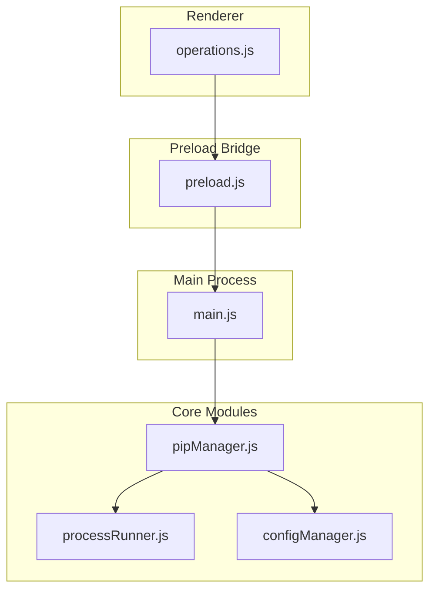
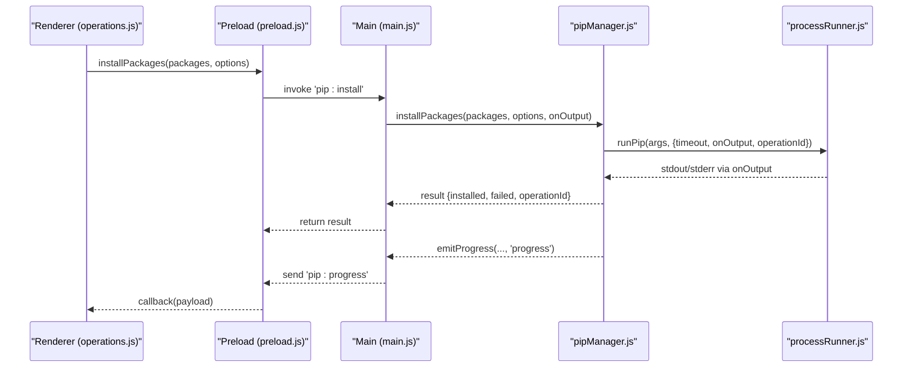
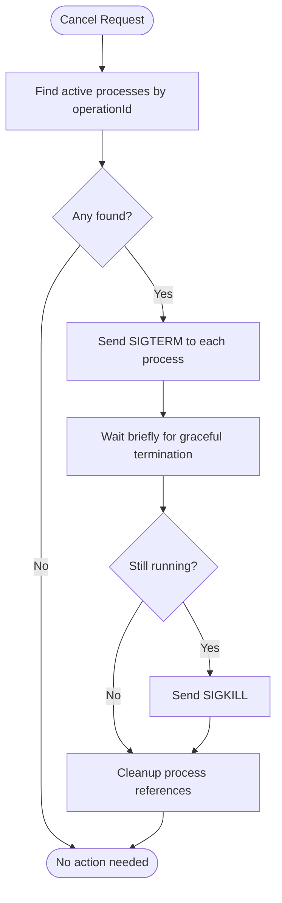
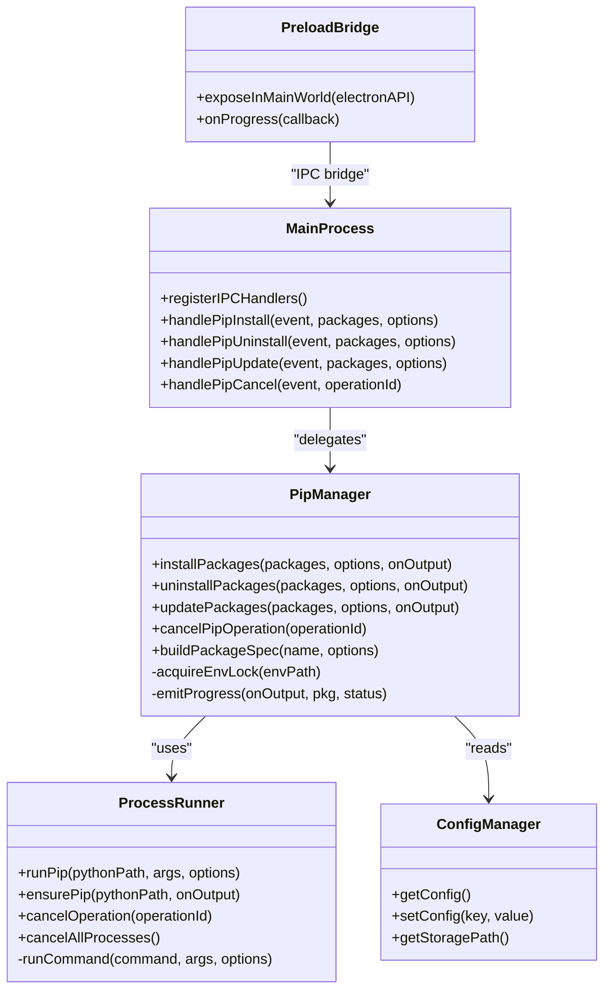

# Package Operations API

<cite>
**Referenced Files in This Document**
- [main.js](file://main.js)
- [preload.js](file://preload.js)
- [pipManager.js](file://core/operations/pipManager.js)
- [processRunner.js](file://utils/processRunner.js)
- [configManager.js](file://core/config/configManager.js)
- [operations.js](file://renderer/js/operations.js)
</cite>

## Table of Contents
1. [Introduction](#introduction)
2. [Project Structure](#project-structure)
3. [Core Components](#core-components)
4. [Architecture Overview](#architecture-overview)
5. [Detailed Component Analysis](#detailed-component-analysis)
6. [Dependency Analysis](#dependency-analysis)
7. [Performance Considerations](#performance-considerations)
8. [Troubleshooting Guide](#troubleshooting-guide)
9. [Conclusion](#conclusion)
10. [Appendices](#appendices)

## Introduction
This document provides comprehensive documentation for the package operation IPC API that exposes installPackages, uninstallPackages, updatePackages, and cancelPipOperation methods. It explains package specification formats, version constraints, parallel installation support, progress tracking mechanisms, cancellation patterns, timeout handling, retry logic, batch operations, dependency resolution, error recovery strategies, and the underlying pip command execution and output parsing.

The API is implemented as an Electron application with a clear separation between the renderer process (UI), preload bridge (secure IPC exposure), main process (IPC handlers), and core modules (pip management utilities).

## Project Structure
The relevant parts of the project structure for this API are:
- Main process entrypoint registers IPC handlers for all package operations.
- Preload script securely exposes these handlers to the renderer via contextBridge.
- Core module pipManager implements the business logic for installing, uninstalling, updating packages, and cancelling operations.
- Process runner utility executes pip commands with robust timeout, cancellation, and output streaming.
- Renderer operations module orchestrates UI flows and progress updates.

**Diagram sources**
- [main.js](file://main.js)
- [preload.js](file://preload.js)
- [pipManager.js](file://core/operations/pipManager.js)
- [processRunner.js](file://utils/processRunner.js)
- [configManager.js](file://core/config/configManager.js)
- [operations.js](file://renderer/js/operations.js)

**Section sources**
- [main.js](file://main.js)
- [preload.js](file://preload.js)
- [pipManager.js](file://core/operations/pipManager.js)
- [processRunner.js](file://utils/processRunner.js)
- [configManager.js](file://core/config/configManager.js)
- [operations.js](file://renderer/js/operations.js)

## Core Components
- Install Packages: Batch install with optional parallelism, version control, mirror retries, auto rollback, and progress events.
- Uninstall Packages: Batch uninstall with safety checks, backup/rollback, and progress events.
- Update Packages: Batch update with parallelism, mirror retries, rollback, and progress events.
- Cancel Operation: Cancel running pip processes by operationId.

Key capabilities:
- Package spec building supports latest, specific versions, ranges, and wheel files with strict validation.
- Environment-level locks prevent concurrent operations on the same Python environment.
- Progress events are emitted via a structured format for reliable UI updates.
- Robust error handling includes automatic backups and rollbacks when enabled.

**Section sources**
- [pipManager.js](file://core/operations/pipManager.js)
- [processRunner.js](file://utils/processRunner.js)
- [configManager.js](file://core/config/configManager.js)

## Architecture Overview
The IPC flow for package operations follows a consistent pattern:
- Renderer calls window.electronAPI methods exposed by preload.
- Preload forwards requests via ipcRenderer.invoke to main process handlers.
- Main process delegates to pipManager functions.
- pipManager executes pip commands through processRunner with timeouts, progress callbacks, and operationId tracking.
- Progress events are sent back to the renderer via ipcMain.send('pip:progress').

**Diagram sources**
- [operations.js](file://renderer/js/operations.js)
- [preload.js](file://preload.js)
- [main.js](file://main.js)
- [pipManager.js](file://core/operations/pipManager.js)
- [processRunner.js](file://utils/processRunner.js)

## Detailed Component Analysis

### IPC Handlers and Exposure
- Preload exposes:
  - installPackages, uninstallPackages, updatePackages, cancelPipOperation
  - Progress listener onProgress for real-time updates
- Main registers IPC handlers:
  - pip:install -> pipManager.installPackages
  - pip:uninstall -> pipManager.uninstallPackages
  - pip:update -> pipManager.updatePackages
  - pip:cancel -> pipManager.cancelPipOperation

These handlers pass through progress callbacks to push 'pip:progress' events to the renderer.

**Section sources**
- [preload.js](file://preload.js)
- [main.js](file://main.js)

### Package Specification Formats and Version Constraints
Supported package specifications:
- Latest: package name only
- Specific version: package==version
- Range constraints: package>=1.0,<2.0
- Wheel file path: absolute .whl path with strict security checks

Validation rules:
- Package names must match allowed characters and length limits
- Version specifiers validated against a strict regex
- Wheel paths disallow traversal, UNC paths, sensitive directories, and illegal characters

Build function constructs pip-compatible specs safely.

**Section sources**
- [pipManager.js](file://core/operations/pipManager.js)

### Parallel Installation Support
- Parallel mode uses a worker pool limited by config.parallelThreads
- Each worker processes one package spec concurrently
- Progress events are emitted per package success/failure
- Environment lock ensures serial access to the same Python environment across operations

**Section sources**
- [pipManager.js](file://core/operations/pipManager.js)
- [configManager.js](file://core/config/configManager.js)

### Progress Tracking Mechanisms
- Structured progress payload: { done: 1, pkg, status }
- Emitted via onOutput callback chain to renderer
- Renderer listens via onProgress and updates UI counters reliably

**Section sources**
- [pipManager.js](file://core/operations/pipManager.js)
- [preload.js](file://preload.js)
- [operations.js](file://renderer/js/operations.js)

### Cancellation Patterns and Timeout Handling
- Each operation generates a unique operationId
- processRunner tracks active processes with operationId association
- cancelPipOperation sends SIGTERM to all processes associated with the operationId
- Timeouts use SIGTERM followed by SIGKILL after a delay
- Application shutdown cancels all active processes

**Diagram sources**
- [processRunner.js](file://utils/processRunner.js)
- [pipManager.js](file://core/operations/pipManager.js)

**Section sources**
- [processRunner.js](file://utils/processRunner.js)
- [pipManager.js](file://core/operations/pipManager.js)

### Retry Logic and Mirror Strategy
- Multi-mirror retry strategy tries default mirror first, then additional mirrors
- For install/update, attempts multiple mirrors even without explicit retry flag
- Update operation detects "Requirement already satisfied" to avoid false positives
- Configurable retryCount controls maximum attempts

**Section sources**
- [pipManager.js](file://core/operations/pipManager.js)

### Error Recovery Strategies
- Automatic backup creation before risky operations (install/uninstall/update)
- On failure, automatic rollback restores environment to pre-operation state
- Logging captures detailed error information for troubleshooting
- Safe mode validates inputs to prevent command injection and path traversal

**Section sources**
- [pipManager.js](file://core/operations/pipManager.js)

### Underlying pip Command Execution and Output Parsing
- All pip commands executed via python -m pip with UTF-8 encoding
- Output streams cleaned of ANSI color codes for consistent processing
- JSON outputs parsed for package lists and metadata
- Error responses include stdout/stderr content for debugging

**Section sources**
- [processRunner.js](file://utils/processRunner.js)
- [pipManager.js](file://core/operations/pipManager.js)

## Dependency Analysis

**Diagram sources**
- [pipManager.js](file://core/operations/pipManager.js)
- [processRunner.js](file://utils/processRunner.js)
- [configManager.js](file://core/config/configManager.js)
- [main.js](file://main.js)
- [preload.js](file://preload.js)

**Section sources**
- [pipManager.js](file://core/operations/pipManager.js)
- [processRunner.js](file://utils/processRunner.js)
- [configManager.js](file://core/config/configManager.js)
- [main.js](file://main.js)
- [preload.js](file://preload.js)

## Performance Considerations
- Parallel installation reduces total time but increases resource usage
- Environment locks prevent race conditions at the cost of serialization
- Caching mechanisms reduce repeated filesystem scans
- Timeout values balance responsiveness with reliability
- Mirror selection optimizes download speeds based on availability

[No sources needed since this section provides general guidance]

## Troubleshooting Guide
Common issues and solutions:
- pip not available: ensurePip automatically installs via ensurepip or get-pip.py
- Network failures: multi-mirror retry handles connectivity issues
- Permission errors: verify Python environment permissions
- Path validation failures: check package names and wheel file paths
- Operation hangs: use cancelPipOperation to terminate stuck processes

**Section sources**
- [processRunner.js](file://utils/processRunner.js)
- [pipManager.js](file://core/operations/pipManager.js)

## Conclusion
The Package Operations API provides a robust, secure, and user-friendly interface for managing Python packages. It combines advanced features like parallel installation, intelligent retry logic, automatic rollback, and comprehensive progress tracking with strong security measures and reliable error handling. The architecture ensures clean separation of concerns while maintaining high performance and usability.

[No sources needed since this section summarizes without analyzing specific files]

## Appendices

### API Method Reference

#### installPackages
- Purpose: Install one or more packages with optional parallelism and version control
- Parameters:
  - packages: string[] - Package names or specs
  - options: object - { versionMode, version, parallel, retry, rollback, operationId }
  - onOutput: function - Progress callback
- Returns: Promise<{ installed: string[], failed: Array, operationId: string }>

#### uninstallPackages
- Purpose: Uninstall one or more packages with safety checks
- Parameters:
  - packages: string[] - Package names to uninstall
  - options: object - { backup, rollback, force, operationId }
  - onOutput: function - Progress callback
- Returns: Promise<{ uninstalled: string[], operationId: string }>

#### updatePackages
- Purpose: Update one or more packages with parallel support
- Parameters:
  - packages: string[] - Package names to update
  - options: object - { parallel, retry, rollback, operationId }
  - onOutput: function - Progress callback
- Returns: Promise<{ updated: string[], failed: Array, operationId: string }>

#### cancelPipOperation
- Purpose: Cancel running pip operations by operationId
- Parameters:
  - operationId: string - Unique operation identifier
- Returns: number - Count of cancelled processes

### Progress Event Format
- Type: 'pip:progress'
- Payload: { operation: 'install'|'uninstall'|'update', data: { done: number, pkg: string, status: 'ok'|'fail' }, type: 'stdout'|'stderr' }

### Configuration Options
- parallelThreads: number (1-16) - Maximum concurrent installation threads
- retryCount: number (0-10) - Number of retry attempts for network operations
- storagePath: string - Directory for logs and backups

**Section sources**
- [pipManager.js](file://core/operations/pipManager.js)
- [configManager.js](file://core/config/configManager.js)
- [operations.js](file://renderer/js/operations.js)