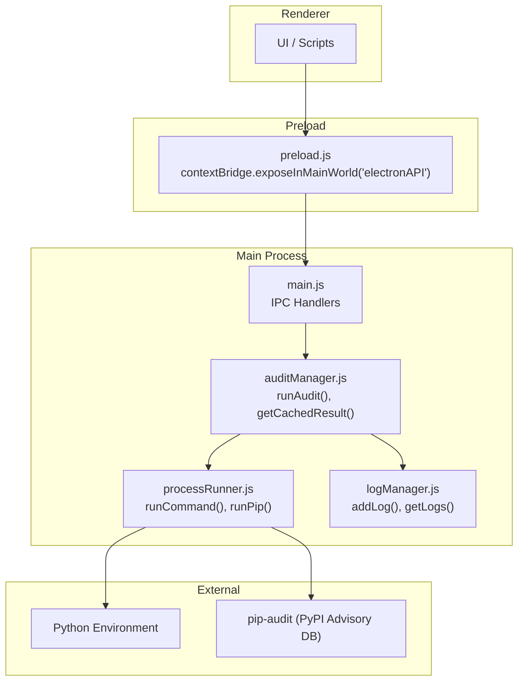
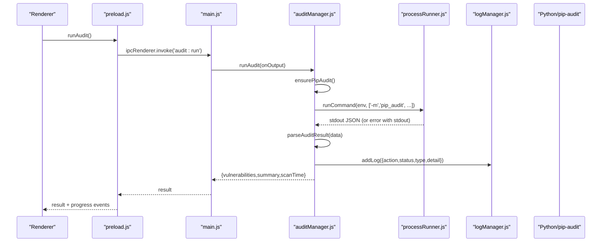
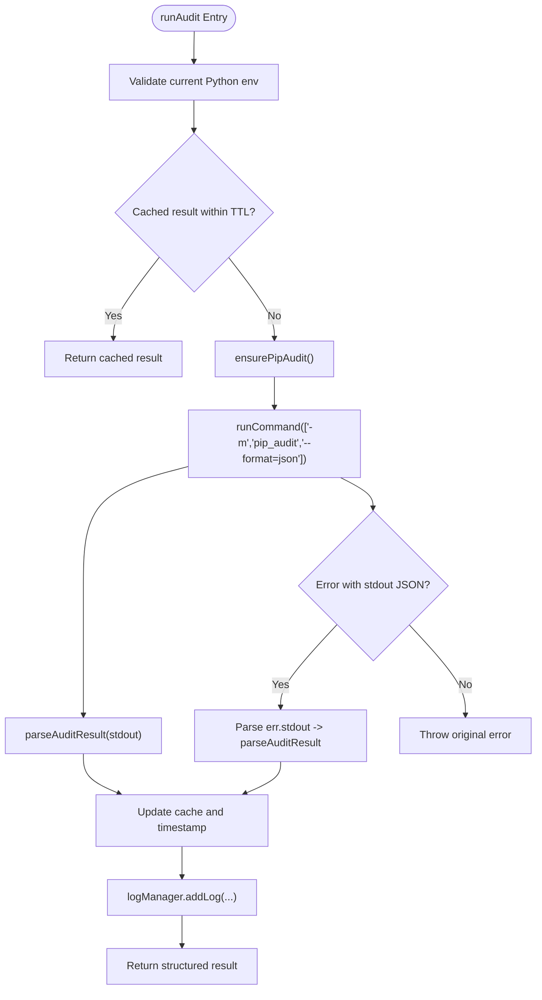
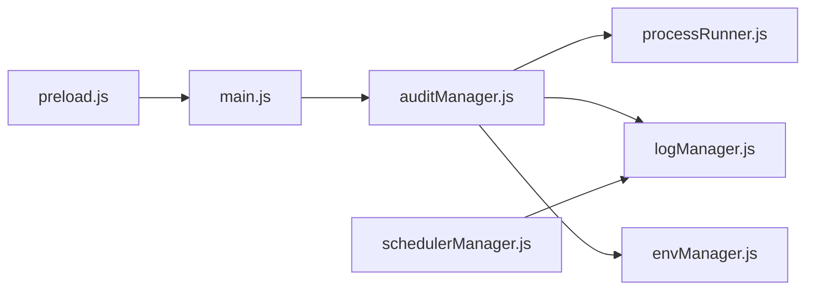

# Security Audit API

<cite>
**Referenced Files in This Document**
- [auditManager.js](file://core/operations/auditManager.js)
- [main.js](file://main.js)
- [preload.js](file://preload.js)
- [processRunner.js](file://utils/processRunner.js)
- [logManager.js](file://core/system/logManager.js)
- [schedulerManager.js](file://core/config/schedulerManager.js)
- [ci.yml](file://.github/workflows/ci.yml)
- [package.json](file://package.json)
</cite>

## Table of Contents
1. [Introduction](#introduction)
2. [Project Structure](#project-structure)
3. [Core Components](#core-components)
4. [Architecture Overview](#architecture-overview)
5. [Detailed Component Analysis](#detailed-component-analysis)
6. [Dependency Analysis](#dependency-analysis)
7. [Performance Considerations](#performance-considerations)
8. [Troubleshooting Guide](#troubleshooting-guide)
9. [Conclusion](#conclusion)
10. [Appendices](#appendices)

## Introduction
This document explains the security auditing IPC API for vulnerability scanning, focusing on the runAudit and getCachedAudit methods. It covers how audits are executed via pip-audit, how results are parsed and cached, severity classification, remediation guidance, scheduled audits, result filtering, CI/CD integration, cache management, audit frequency optimization, and compliance reporting features.

## Project Structure
The security audit feature is implemented as an Electron IPC bridge:
- The renderer calls window.electronAPI.runAudit() or window.electronAPI.getCachedAudit().
- preload.js forwards these calls to main.js IPC handlers.
- main.js delegates to core/operations/auditManager.js.
- auditManager orchestrates pip-audit execution via utils/processRunner.js and logs results using core/system/logManager.js.

**Diagram sources**
- [preload.js:144-146](file://preload.js#L144-L146)
- [main.js:577-586](file://main.js#L577-L586)
- [auditManager.js:54-119](file://core/operations/auditManager.js#L54-L119)
- [processRunner.js:85-161](file://utils/processRunner.js#L85-L161)
- [logManager.js:115-134](file://core/system/logManager.js#L115-L134)

**Section sources**
- [preload.js:144-146](file://preload.js#L144-L146)
- [main.js:577-586](file://main.js#L577-L586)
- [auditManager.js:1-230](file://core/operations/auditManager.js#L1-L230)
- [processRunner.js:85-161](file://utils/processRunner.js#L85-L161)
- [logManager.js:115-134](file://core/system/logManager.js#L115-L134)

## Core Components
- auditManager.js
  - runAudit(onOutput): Executes a vulnerability scan against the current Python environment using pip-audit. Supports caching and structured output parsing.
  - getCachedResult(): Returns the last scan result if within TTL.
  - ensurePipAudit(pythonPath, onOutput): Ensures pip-audit is installed; installs automatically if missing.
  - parseAuditResult(data): Normalizes pip-audit JSON into a consistent structure with summary and sorted vulnerabilities.
  - guessSeverity(vuln): Infers severity when not provided by upstream data.
- main.js
  - Exposes IPC handlers 'audit:run' and 'audit:cached' that forward to auditManager functions and stream progress events.
- preload.js
  - Exposes electronAPI.runAudit() and electronAPI.getCachedAudit() to the renderer.
- processRunner.js
  - Provides runCommand and runPip utilities used to execute pip-audit with timeouts, cancellation, and real-time output streaming.
- logManager.js
  - Records audit outcomes and details for compliance and troubleshooting.

**Section sources**
- [auditManager.js:54-119](file://core/operations/auditManager.js#L54-L119)
- [auditManager.js:126-187](file://core/operations/auditManager.js#L126-L187)
- [auditManager.js:194-203](file://core/operations/auditManager.js#L194-L203)
- [auditManager.js:209-222](file://core/operations/auditManager.js#L209-L222)
- [main.js:577-586](file://main.js#L577-L586)
- [preload.js:144-146](file://preload.js#L144-L146)
- [processRunner.js:85-161](file://utils/processRunner.js#L85-L161)
- [logManager.js:115-134](file://core/system/logManager.js#L115-L134)

## Architecture Overview
The audit flow uses a layered architecture:
- Renderer invokes electronAPI.runAudit() or electronAPI.getCachedAudit().
- Preload bridges to main.js IPC handlers.
- Main handler calls auditManager.runAudit() or auditManager.getCachedResult().
- auditManager ensures pip-audit availability, executes it, parses JSON, caches results, and logs outcomes.
- processRunner handles subprocess lifecycle, timeouts, and output streaming.
- logManager persists audit actions and statuses.

**Diagram sources**
- [preload.js:144-146](file://preload.js#L144-L146)
- [main.js:577-586](file://main.js#L577-L586)
- [auditManager.js:54-119](file://core/operations/auditManager.js#L54-L119)
- [processRunner.js:85-161](file://utils/processRunner.js#L85-L161)
- [logManager.js:115-134](file://core/system/logManager.js#L115-L134)

## Detailed Component Analysis

### runAudit Method
- Purpose: Perform a vulnerability scan of the active Python environment using pip-audit.
- Behavior:
  - Validates current environment selection.
  - Checks in-memory cache; returns cached result if within TTL.
  - Ensures pip-audit is installed; attempts automatic installation if missing.
  - Executes pip-audit with JSON output format.
  - Parses both new and legacy JSON formats.
  - Sorts vulnerabilities by severity and computes summary statistics.
  - Caches result and writes audit log entry.
  - Handles non-zero exit codes where JSON may still be present.
- Output:
  - vulnerabilities: array of normalized entries with id, package, version, severity, summary, fixVersion, url, aliases.
  - summary: totalVulns, affectedPackages, counts by severity, fixable count.
  - scanTime: ISO timestamp.

**Diagram sources**
- [auditManager.js:54-119](file://core/operations/auditManager.js#L54-L119)
- [auditManager.js:126-187](file://core/operations/auditManager.js#L126-L187)
- [processRunner.js:85-161](file://utils/processRunner.js#L85-L161)

**Section sources**
- [auditManager.js:54-119](file://core/operations/auditManager.js#L54-L119)
- [auditManager.js:126-187](file://core/operations/auditManager.js#L126-L187)
- [processRunner.js:85-161](file://utils/processRunner.js#L85-L161)

### getCachedAudit Method
- Purpose: Retrieve the most recent audit result without re-scanning.
- Behavior:
  - Returns cached result if available and within TTL.
  - Otherwise returns null.
- Use cases:
  - Fast UI refresh after a previous scan.
  - Reducing redundant scans during frequent checks.

**Section sources**
- [auditManager.js:209-222](file://core/operations/auditManager.js#L209-L222)
- [main.js:586](file://main.js#L586)
- [preload.js:146](file://preload.js#L146)

### Audit Report Format
- vulnerabilities: Array of objects with fields:
  - id: CVE or alias identifier
  - package: Package name
  - version: Installed version
  - severity: critical/high/medium/low/unknown
  - summary: Description or fallback to id
  - fixVersion: Recommended fixed version (latest available)
  - url: Link to NVD detail or alias source
  - aliases: Alternative identifiers
- summary: Aggregated counts:
  - totalVulns: Total number of vulnerabilities
  - affectedPackages: Number of unique affected packages
  - critical/high/medium/low: Counts per severity
  - fixable: Count with a recommended fix version
- scanTime: ISO timestamp of scan completion

Parsing supports both modern and legacy pip-audit JSON structures and normalizes fields consistently.

**Section sources**
- [auditManager.js:126-187](file://core/operations/auditManager.js#L126-L187)

### CVE Database Integration
- Data source: pip-audit consumes the PyPI Advisory Database to identify known vulnerabilities.
- URL generation: When available, links point to NVD details based on CVE IDs.
- Aliases: Additional identifiers are preserved for cross-referencing.

**Section sources**
- [auditManager.js:126-187](file://core/operations/auditManager.js#L126-L187)

### Severity Classification
- Primary: Uses explicit severity from upstream data when present.
- Fallback inference:
  - Critical: Remote code execution, RCE, critical keywords
  - High: SQL injection, arbitrary code execution, high keywords
  - Medium: XSS, denial of service, DOS
  - Low: Information disclosure, low keywords
  - Unknown: Default when no indicators found
- Sorting: Results are ordered by severity precedence (critical > high > medium > low > unknown).

**Section sources**
- [auditManager.js:194-203](file://core/operations/auditManager.js#L194-L203)
- [auditManager.js:170-173](file://core/operations/auditManager.js#L170-L173)

### Remediation Recommendations
- fixVersion field provides the latest recommended fixed version when available.
- Summary includes fixable count to quickly assess remediation scope.
- URLs link to authoritative sources for detailed remediation steps.

**Section sources**
- [auditManager.js:150-167](file://core/operations/auditManager.js#L150-L167)
- [auditManager.js:174-186](file://core/operations/auditManager.js#L174-L186)

### Scheduled Audits
- Scheduler manager supports periodic tasks (daily/weekly) for automated operations.
- While designed for auto-updates, the same scheduling mechanism can be adapted to trigger audits at intervals.
- Configuration includes enabled flag, frequency, whitelist, and lastRun timestamp.
- Execution logs status and details for compliance tracking.

Adapting scheduler for audits:
- Add a scheduled task that invokes auditManager.runAudit() periodically.
- Store audit results and timestamps alongside update logs.
- Use whitelist to exclude specific packages from scheduled scans if needed.

**Section sources**
- [schedulerManager.js:29-37](file://core/config/schedulerManager.js#L29-L37)
- [schedulerManager.js:70-138](file://core/config/schedulerManager.js#L70-L138)
- [schedulerManager.js:145-163](file://core/config/schedulerManager.js#L145-L163)

### Result Filtering
- Vulnerability list can be filtered by:
  - Severity (critical/high/medium/low/unknown)
  - Package name (case-insensitive)
  - Presence of fixVersion (fixable only)
- Summary fields enable quick aggregation for dashboards and reports.

Filtering examples:
- Show only critical issues: filter by severity === 'critical'
- Show fixable issues: filter by fixVersion !== ''
- Show affected packages: use summary.affectedPackages and iterate vulnerabilities

**Section sources**
- [auditManager.js:174-186](file://core/operations/auditManager.js#L174-L186)

### CI/CD Pipeline Integration
- CI workflow runs tests and builds installer artifacts on push/PR.
- To integrate security audits:
  - Add a job that sets up Node and Python environments.
  - Install dependencies and run npm test.
  - Execute audit via the IPC API wrapper or directly invoke pip-audit in CI.
  - Upload audit results as artifacts for review.
  - Fail the pipeline if critical/high vulnerabilities exceed thresholds.

Example integration points:
- Use npm scripts to orchestrate audit steps.
- Leverage GitHub Actions to capture logs and outputs.
- Publish audit reports to artifact storage for traceability.

**Section sources**
- [ci.yml:1-51](file://.github/workflows/ci.yml#L1-L51)
- [package.json:9-15](file://package.json#L9-L15)

### Cache Management and Frequency Optimization
- In-memory cache stores lastScanResult and lastScanTime.
- TTL is set to 10 minutes to avoid frequent scans while keeping results reasonably fresh.
- getCachedResult() enforces TTL before returning data.
- clearCache() resets state for forced re-scan scenarios.

Optimization strategies:
- Use getCachedAudit() in UI to reduce redundant scans.
- Trigger full scans on environment changes or manual user action.
- Adjust SCAN_CACHE_TTL based on project requirements and performance needs.

**Section sources**
- [auditManager.js:20-23](file://core/operations/auditManager.js#L20-L23)
- [auditManager.js:58-61](file://core/operations/auditManager.js#L58-L61)
- [auditManager.js:209-222](file://core/operations/auditManager.js#L209-L222)

### Compliance Reporting Features
- Audit outcomes are logged with action, status, type, and detail fields.
- Logs support filtering by type and keyword search.
- Export functionality allows saving logs as CSV or Markdown for compliance documentation.
- Timestamps and structured summaries facilitate audit trails and reporting.

Compliance usage:
- Generate periodic reports from logs for stakeholders.
- Track trends over time using exported datasets.
- Maintain evidence of remediation efforts and scan cadence.

**Section sources**
- [logManager.js:115-134](file://core/system/logManager.js#L115-L134)
- [logManager.js:146-162](file://core/system/logManager.js#L146-L162)
- [main.js:485-514](file://main.js#L485-L514)

## Dependency Analysis
The security audit module depends on several components:
- auditManager.js depends on:
  - processRunner.js for command execution
  - logManager.js for logging
  - envManager for environment detection
- main.js wires IPC handlers to auditManager functions
- preload.js exposes APIs to the renderer
- schedulerManager.js provides scheduling capabilities adaptable for audits

**Diagram sources**
- [auditManager.js:16-18](file://core/operations/auditManager.js#L16-L18)
- [main.js:28](file://main.js#L28)
- [preload.js:144-146](file://preload.js#L144-L146)
- [schedulerManager.js:18-19](file://core/config/schedulerManager.js#L18-L19)

**Section sources**
- [auditManager.js:16-18](file://core/operations/auditManager.js#L16-L18)
- [main.js:28](file://main.js#L28)
- [preload.js:144-146](file://preload.js#L144-L146)
- [schedulerManager.js:18-19](file://core/config/schedulerManager.js#L18-L19)

## Performance Considerations
- Caching reduces repeated scans and improves responsiveness.
- Timeout handling prevents long-running processes from blocking UI.
- Real-time output streaming keeps users informed without blocking.
- ANSI stripping ensures clean logs and outputs.
- Process cancellation supports graceful termination of long operations.

Recommendations:
- Use getCachedAudit() for frequent UI updates.
- Adjust timeout values based on environment size and network conditions.
- Monitor log volume and consider rotating logs for large projects.

[No sources needed since this section provides general guidance]

## Troubleshooting Guide
Common issues and resolutions:
- pip-audit not installed:
  - Ensure automatic installation succeeds; otherwise install manually.
  - Verify Python path and permissions.
- Scan fails with non-zero exit code:
  - Check stderr for errors; JSON may still be present in stdout.
  - Review parsed results for partial success.
- No vulnerabilities found unexpectedly:
  - Confirm pip-audit database connectivity and updates.
  - Validate environment selection and package installation.
- Cache not updating:
  - Clear cache explicitly to force re-scan.
  - Verify TTL settings and timing.

Logging and export:
- Use logManager.getLogs() to inspect audit actions and statuses.
- Export logs for offline analysis and compliance reviews.

**Section sources**
- [auditManager.js:31-47](file://core/operations/auditManager.js#L31-L47)
- [auditManager.js:94-118](file://core/operations/auditManager.js#L94-L118)
- [logManager.js:146-162](file://core/system/logManager.js#L146-L162)
- [main.js:485-514](file://main.js#L485-L514)

## Conclusion
The security audit API provides robust vulnerability scanning through pip-audit integration, structured result parsing, severity classification, and remediation guidance. With caching, logging, and scheduling capabilities, it supports efficient audits, compliance reporting, and CI/CD integration. Proper configuration and monitoring ensure reliable security assessments across development and production environments.

[No sources needed since this section summarizes without analyzing specific files]

## Appendices

### API Reference Summary
- electronAPI.runAudit(): Triggers vulnerability scan with progress events.
- electronAPI.getCachedAudit(): Retrieves cached audit result if available.
- Progress events: pip:progress with operation 'audit' for real-time updates.

**Section sources**
- [preload.js:144-146](file://preload.js#L144-L146)
- [main.js:577-586](file://main.js#L577-L586)

### Example Usage Patterns
- Manual audit: Call runAudit() on user action.
- Cached retrieval: Use getCachedAudit() for immediate results.
- Scheduled audits: Adapt schedulerManager to trigger audits periodically.
- CI integration: Add audit steps in GitHub Actions workflow.

**Section sources**
- [schedulerManager.js:70-138](file://core/config/schedulerManager.js#L70-L138)
- [ci.yml:1-51](file://.github/workflows/ci.yml#L1-L51)