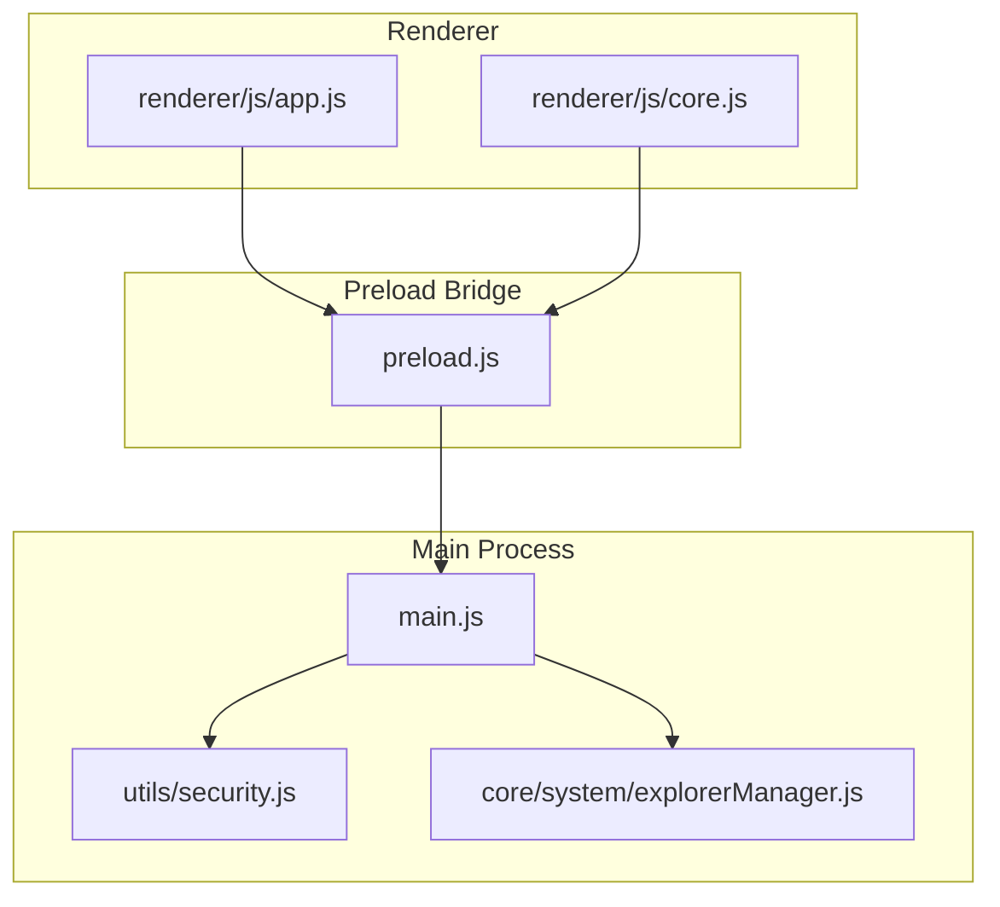
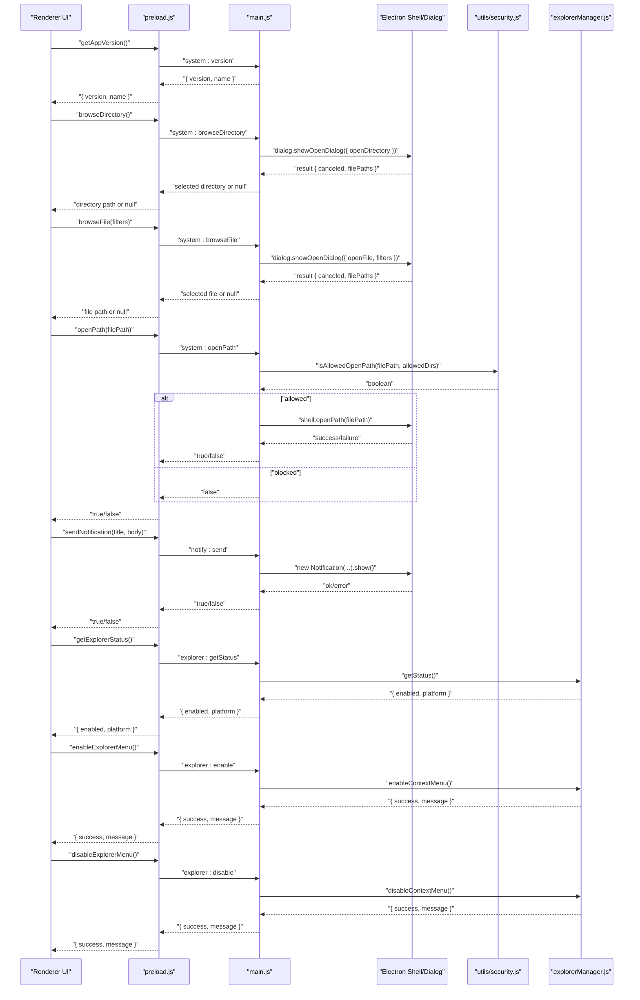
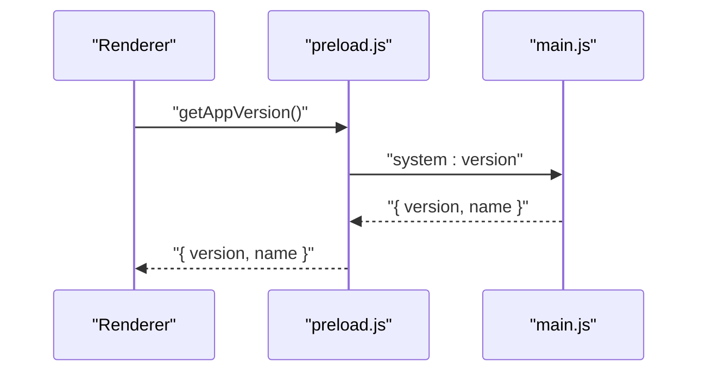
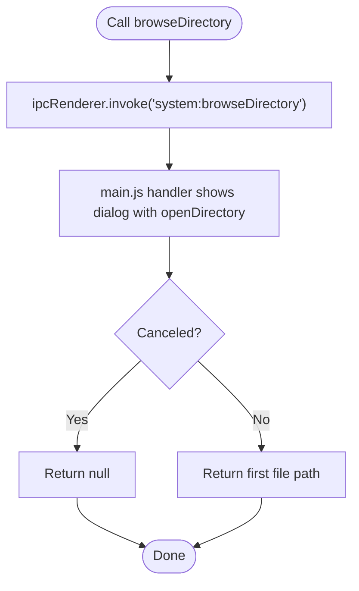
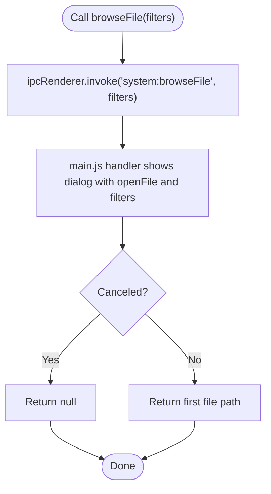
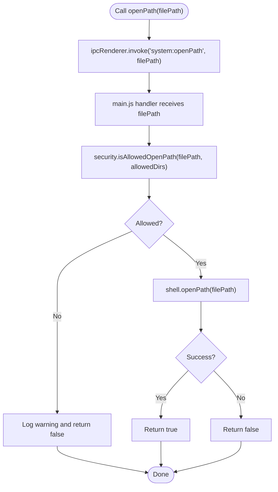
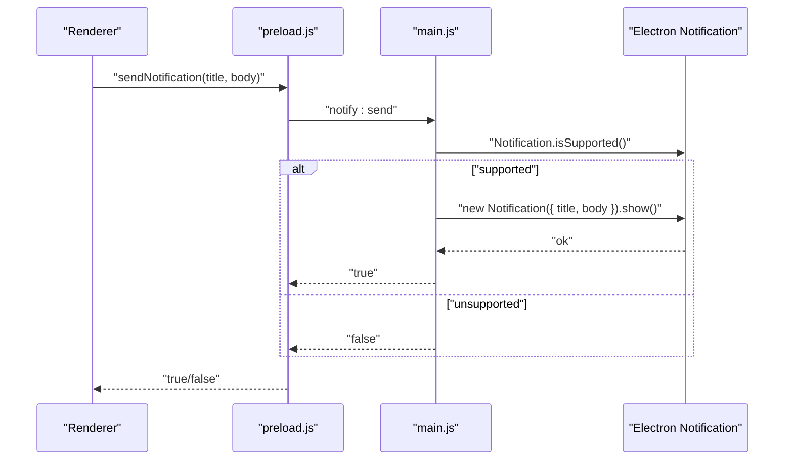
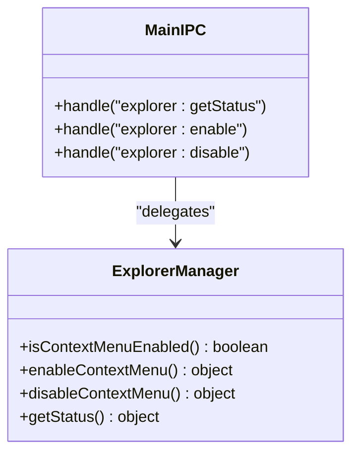
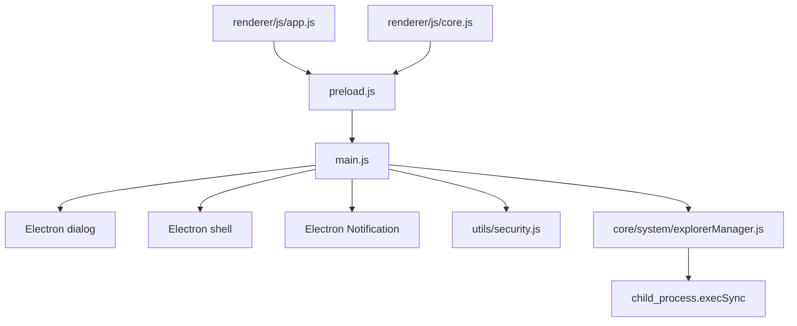

# System Integration API

<cite>
**Referenced Files in This Document**
- [main.js](file://main.js)
- [preload.js](file://preload.js)
- [core/system/explorerManager.js](file://core/system/explorerManager.js)
- [utils/security.js](file://utils/security.js)
- [renderer/js/app.js](file://renderer/js/app.js)
- [renderer/js/core.js](file://renderer/js/core.js)
</cite>

## Table of Contents
1. [Introduction](#introduction)
2. [Project Structure](#project-structure)
3. [Core Components](#core-components)
4. [Architecture Overview](#architecture-overview)
5. [Detailed Component Analysis](#detailed-component-analysis)
6. [Dependency Analysis](#dependency-analysis)
7. [Performance Considerations](#performance-considerations)
8. [Troubleshooting Guide](#troubleshooting-guide)
9. [Conclusion](#conclusion)
10. [Appendices](#appendices)

## Introduction
This document provides comprehensive documentation for the system integration IPC API exposed by the application. It focuses on:
- File dialog interactions: getAppVersion, browseDirectory, browseFile, openPath
- System notifications: sendNotification
- Windows Explorer integration: explorer management methods
- Cross-platform considerations and security restrictions
- Examples of file selection workflows, notification handling, and shell integration patterns

The API is implemented using Electron’s IPC mechanism with a secure bridge via preload script to expose only necessary functions to the renderer process.

## Project Structure
Key files involved in system integration:
- main.js: Registers all IPC handlers for system features (version, dialogs, notifications, explorer).
- preload.js: Exposes safe window.electronAPI methods to the renderer.
- core/system/explorerManager.js: Manages Windows Explorer context menu registration.
- utils/security.js: Provides path validation to prevent traversal attacks when opening paths.
- renderer/js/app.js and renderer/js/core.js: Use the exposed API from the renderer side.

**Diagram sources**
- [main.js:425-480](file://main.js#L425-L480)
- [preload.js:100-176](file://preload.js#L100-L176)
- [core/system/explorerManager.js:1-120](file://core/system/explorerManager.js#L1-L120)
- [utils/security.js:1-43](file://utils/security.js#L1-L43)
- [renderer/js/app.js:190-210](file://renderer/js/app.js#L190-L210)
- [renderer/js/core.js:1-20](file://renderer/js/core.js#L1-L20)

**Section sources**
- [main.js:425-480](file://main.js#L425-L480)
- [preload.js:100-176](file://preload.js#L100-L176)
- [core/system/explorerManager.js:1-120](file://core/system/explorerManager.js#L1-L120)
- [utils/security.js:1-43](file://utils/security.js#L1-L43)
- [renderer/js/app.js:190-210](file://renderer/js/app.js#L190-L210)
- [renderer/js/core.js:1-20](file://renderer/js/core.js#L1-L20)

## Core Components
System integration IPC endpoints are registered in the main process and exposed through the preload bridge:

- Version retrieval: getAppVersion
- Directory browsing: browseDirectory
- File browsing: browseFile
- Path opening: openPath
- Notifications: sendNotification
- Explorer management: getExplorerStatus, enableExplorerMenu, disableExplorerMenu

These endpoints provide secure, controlled access to OS-level features while maintaining cross-platform compatibility where applicable.

**Section sources**
- [main.js:425-480](file://main.js#L425-L480)
- [preload.js:100-176](file://preload.js#L100-L176)

## Architecture Overview
The architecture follows a secure IPC pattern:
- Renderer calls window.electronAPI.* methods.
- Preload forwards requests via ipcRenderer.invoke to main process handlers.
- Main process executes privileged operations and returns results or errors.

**Diagram sources**
- [main.js:425-480](file://main.js#L425-L480)
- [main.js:635-640](file://main.js#L635-L640)
- [preload.js:100-176](file://preload.js#L100-L176)
- [utils/security.js:1-43](file://utils/security.js#L1-L43)
- [core/system/explorerManager.js:1-120](file://core/system/explorerManager.js#L1-L120)

## Detailed Component Analysis

### getAppVersion
- Purpose: Retrieve application version and name.
- Flow: Renderer calls getAppVersion -> preload invokes system:version -> main returns app.getVersion() and app.getName().
- Usage example: Displaying version in the About section.

**Diagram sources**
- [main.js:425-425](file://main.js#L425-L425)
- [preload.js:102-102](file://preload.js#L102-L102)

**Section sources**
- [main.js:425-425](file://main.js#L425-L425)
- [preload.js:102-102](file://preload.js#L102-L102)
- [renderer/js/app.js:195-199](file://renderer/js/app.js#L195-L199)

### browseDirectory
- Purpose: Open a native directory picker dialog.
- Behavior: Returns selected directory path or null if canceled.
- Cross-platform: Uses Electron dialog; works across platforms.

**Diagram sources**
- [main.js:428-433](file://main.js#L428-L433)
- [preload.js:103-103](file://preload.js#L103-L103)

**Section sources**
- [main.js:428-433](file://main.js#L428-L433)
- [preload.js:103-103](file://preload.js#L103-L103)

### browseFile
- Purpose: Open a native file picker dialog with optional filters.
- Behavior: Returns selected file path or null if canceled.
- Filters: Accepts an array of filter objects; defaults to “All Files” if none provided.

**Diagram sources**
- [main.js:436-442](file://main.js#L436-L442)
- [preload.js:104-104](file://preload.js#L104-L104)

**Section sources**
- [main.js:436-442](file://main.js#L436-L442)
- [preload.js:104-104](file://preload.js#L104-L104)

### openPath
- Purpose: Open a file or folder using the system default application.
- Security: Validates that the target path resides within allowed directories (Documents, Downloads, UserData).
- Behavior: Returns true on success, false on failure or blocked attempts.

**Diagram sources**
- [main.js:449-466](file://main.js#L449-L466)
- [utils/security.js:28-40](file://utils/security.js#L28-L40)
- [preload.js:105-105](file://preload.js#L105-L105)

**Section sources**
- [main.js:449-466](file://main.js#L449-L466)
- [utils/security.js:28-40](file://utils/security.js#L28-L40)
- [preload.js:105-105](file://preload.js#L105-L105)

### sendNotification
- Purpose: Send a native desktop notification.
- Behavior: Checks Notification.isSupported(), creates and shows a Notification, returns true on success, false otherwise.
- Cross-platform: Works on platforms supporting native notifications; silently fails if unsupported.

**Diagram sources**
- [main.js:471-480](file://main.js#L471-L480)
- [preload.js:108-108](file://preload.js#L108-L108)

**Section sources**
- [main.js:471-480](file://main.js#L471-L480)
- [preload.js:108-108](file://preload.js#L108-L108)

### Explorer Management Methods
- Purpose: Manage Windows Explorer context menu entries for PyLibMaster.
- Methods:
  - getExplorerStatus: Returns whether the context menu is enabled and current platform.
  - enableExplorerMenu: Adds registry entries under HKCU for background context menu.
  - disableExplorerMenu: Removes registry entries.
- Platform: Only supported on Windows; non-Windows returns failure messages.

**Diagram sources**
- [core/system/explorerManager.js:1-120](file://core/system/explorerManager.js#L1-L120)
- [main.js:635-640](file://main.js#L635-L640)

**Section sources**
- [core/system/explorerManager.js:1-120](file://core/system/explorerManager.js#L1-L120)
- [main.js:635-640](file://main.js#L635-L640)

## Dependency Analysis
- Renderer depends on preload.js for safe API exposure.
- Preload depends on ipcRenderer to invoke main handlers.
- Main depends on Electron APIs (dialog, shell, Notification), security utilities, and explorer manager.
- Explorer manager uses child_process to interact with Windows registry.

**Diagram sources**
- [main.js:425-480](file://main.js#L425-L480)
- [main.js:635-640](file://main.js#L635-L640)
- [core/system/explorerManager.js:1-120](file://core/system/explorerManager.js#L1-L120)
- [utils/security.js:1-43](file://utils/security.js#L1-L43)
- [preload.js:100-176](file://preload.js#L100-L176)

**Section sources**
- [main.js:425-480](file://main.js#L425-L480)
- [main.js:635-640](file://main.js#L635-L640)
- [core/system/explorerManager.js:1-120](file://core/system/explorerManager.js#L1-L120)
- [utils/security.js:1-43](file://utils/security.js#L1-L43)
- [preload.js:100-176](file://preload.js#L100-L176)

## Performance Considerations
- File dialogs are synchronous at the OS level; avoid frequent calls in tight loops.
- openPath validation is lightweight but should be used judiciously for user-triggered actions.
- Notifications are asynchronous and non-blocking; ensure they are not spamming users.
- Explorer registry operations involve child_process calls; cache status where possible to reduce repeated checks.

[No sources needed since this section provides general guidance]

## Troubleshooting Guide
Common issues and resolutions:
- openPath returns false:
  - Ensure the path is within allowed directories (Documents, Downloads, UserData).
  - Check console warnings for blocked attempts.
- sendNotification returns false:
  - Verify platform supports native notifications.
  - Inspect error handling in the notify handler.
- Explorer methods fail on non-Windows:
  - These methods are Windows-only; handle failures gracefully in the renderer.

**Section sources**
- [main.js:449-480](file://main.js#L449-L480)
- [core/system/explorerManager.js:54-101](file://core/system/explorerManager.js#L54-L101)

## Conclusion
The system integration API provides secure, controlled access to essential OS features such as file dialogs, notifications, and Windows Explorer integration. The design emphasizes safety through path validation and minimal privilege exposure via the preload bridge. Cross-platform compatibility is maintained where possible, with platform-specific behaviors clearly handled.

[No sources needed since this section summarizes without analyzing specific files]

## Appendices

### Permission Requirements and Security Restrictions
- openPath enforces strict path whitelisting to prevent traversal attacks.
- Explorer registry modifications use HKCU (user-level) to avoid requiring administrator privileges on Windows.
- Notifications require platform support; fallback behavior is silent failure.

**Section sources**
- [utils/security.js:28-40](file://utils/security.js#L28-L40)
- [core/system/explorerManager.js:15-20](file://core/system/explorerManager.js#L15-L20)
- [main.js:471-480](file://main.js#L471-L480)

### Example Workflows

#### File Selection Workflow
- User clicks “Select Folder” -> browseDirectory invoked -> dialog opens -> selected path returned.
- User clicks “Select File” -> browseFile invoked with filters -> dialog opens -> selected file returned.

**Section sources**
- [main.js:428-442](file://main.js#L428-L442)
- [preload.js:103-104](file://preload.js#L103-L104)

#### Notification Handling Workflow
- Trigger event -> sendNotification called -> native notification shown -> result returned to renderer.

**Section sources**
- [main.js:471-480](file://main.js#L471-L480)
- [preload.js:108-108](file://preload.js#L108-L108)

#### Shell Integration Patterns
- Explorer context menu enables quick access to PyLibMaster from Windows Explorer.
- Registry entries created under HKCU for user-level customization.

**Section sources**
- [core/system/explorerManager.js:54-79](file://core/system/explorerManager.js#L54-L79)
- [main.js:635-640](file://main.js#L635-L640)