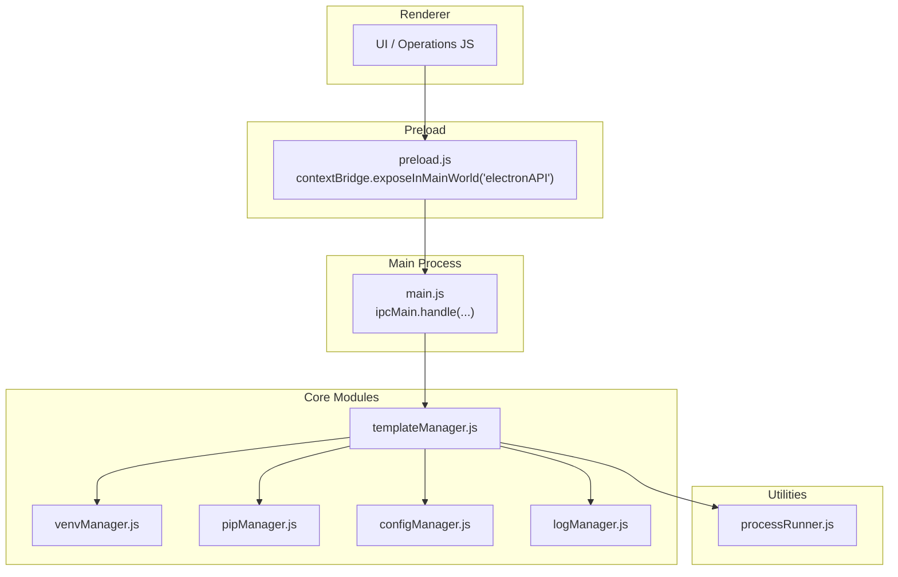
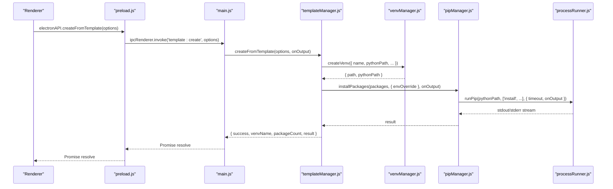
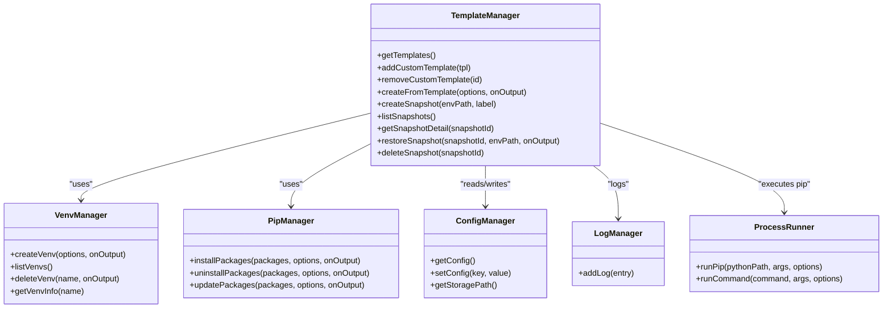

# Template and Snapshot API

<cite>
**Referenced Files in This Document**
- [main.js](file://main.js)
- [preload.js](file://preload.js)
- [templateManager.js](file://core/operations/templateManager.js)
- [venvManager.js](file://core/operations/venvManager.js)
- [pipManager.js](file://core/operations/pipManager.js)
- [configManager.js](file://core/config/configManager.js)
- [logManager.js](file://core/system/logManager.js)
- [processRunner.js](file://utils/processRunner.js)
</cite>

## Table of Contents
1. [Introduction](#introduction)
2. [Project Structure](#project-structure)
3. [Core Components](#core-components)
4. [Architecture Overview](#architecture-overview)
5. [Detailed Component Analysis](#detailed-component-analysis)
6. [Dependency Analysis](#dependency-analysis)
7. [Performance Considerations](#performance-considerations)
8. [Troubleshooting Guide](#troubleshooting-guide)
9. [Conclusion](#conclusion)
10. [Appendices](#appendices)

## Introduction
This document describes the Template and Environment Snapshot IPC API exposed by the application. It covers:
- Template management: getTemplates, addCustomTemplate, removeCustomTemplate, createFromTemplate
- Snapshot lifecycle: createSnapshot, listSnapshots, restoreSnapshot, deleteSnapshot
- Template structure, snapshot format, automation workflows, validation, compression considerations, and version management strategies

The API is implemented as an Electron IPC bridge between the renderer process and the main process, which delegates to core modules for template and snapshot operations.

## Project Structure
The relevant parts of the codebase are organized into:
- Main process IPC handlers that expose methods via ipcMain.handle
- Preload script exposing a safe window.electronAPI surface to the renderer
- Core operation modules implementing business logic (templates, snapshots, venvs, pip, config, logs)
- Utilities for running subprocesses safely with timeouts and cancellation

**Diagram sources**
- [main.js:548-575](file://main.js#L548-L575)
- [preload.js:133-142](file://preload.js#L133-L142)
- [templateManager.js:1-320](file://core/operations/templateManager.js#L1-L320)
- [venvManager.js:1-278](file://core/operations/venvManager.js#L1-L278)
- [pipManager.js:1-200](file://core/operations/pipManager.js#L1-L200)
- [configManager.js:1-194](file://core/config/configManager.js#L1-L194)
- [logManager.js:1-176](file://core/system/logManager.js#L1-L176)
- [processRunner.js:1-366](file://utils/processRunner.js#L1-L366)

**Section sources**
- [main.js:548-575](file://main.js#L548-L575)
- [preload.js:133-142](file://preload.js#L133-L142)

## Core Components
- Template Manager: manages built-in and custom templates, creates environments from templates, and provides snapshot utilities.
- Virtual Environment Manager: creates, lists, deletes, and inspects Python virtual environments.
- Pip Manager: handles package installation, uninstallation, updates, and related operations with safety checks and progress events.
- Config Manager: persists configuration including storage paths and user settings.
- Log Manager: records operations with truncation, filtering, and debounced persistence.
- Process Runner: executes system commands with timeouts, cancellation, and output streaming.

Key responsibilities for this API:
- Template CRUD and creation flows
- Snapshot capture, listing, restoration, and deletion
- Integration with venv and pip managers for environment setup and package management

**Section sources**
- [templateManager.js:1-320](file://core/operations/templateManager.js#L1-L320)
- [venvManager.js:1-278](file://core/operations/venvManager.js#L1-L278)
- [pipManager.js:1-200](file://core/operations/pipManager.js#L1-L200)
- [configManager.js:1-194](file://core/config/configManager.js#L1-L194)
- [logManager.js:1-176](file://core/system/logManager.js#L1-L176)
- [processRunner.js:1-366](file://utils/processRunner.js#L1-L366)

## Architecture Overview
The Template and Snapshot API follows a layered IPC architecture:
- Renderer calls window.electronAPI.* methods
- Preload forwards to ipcRenderer.invoke with channel names
- Main process handles channels and delegates to templateManager
- templateManager orchestrates venv and pip operations, writes logs, and uses processRunner for pip commands

**Diagram sources**
- [preload.js:133-142](file://preload.js#L133-L142)
- [main.js:548-575](file://main.js#L548-L575)
- [templateManager.js:118-154](file://core/operations/templateManager.js#L118-L154)
- [venvManager.js:73-130](file://core/operations/venvManager.js#L73-L130)
- [pipManager.js:1-200](file://core/operations/pipManager.js#L1-L200)
- [processRunner.js:340-342](file://utils/processRunner.js#L340-L342)

## Detailed Component Analysis

### Template Management API

#### getTemplates
- Purpose: Returns all templates (built-in + custom).
- Behavior: Reads custom templates from config and merges with built-in set.
- Output: Array of template objects with id, name, icon, description, packages, and isCustom flag for custom entries.

Usage example (conceptual):
- Call window.electronAPI.getTemplates() to populate a template selector in the UI.

**Section sources**
- [templateManager.js:72-76](file://core/operations/templateManager.js#L72-L76)
- [main.js:551](file://main.js#L551)
- [preload.js:134](file://preload.js#L134)

#### addCustomTemplate
- Purpose: Adds a new custom template to the configuration.
- Validation: Requires name (string) and packages (array); sets defaults for icon/description; generates unique id.
- Persistence: Updates config.customTemplates and saves immediately.

Usage example (conceptual):
- Create a reusable template for your team’s standard stack and persist it for future use.

**Section sources**
- [templateManager.js:83-98](file://core/operations/templateManager.js#L83-L98)
- [main.js:553](file://main.js#L553)
- [preload.js:135](file://preload.js#L135)

#### removeCustomTemplate
- Purpose: Removes a custom template by id.
- Behavior: Filters out the template with matching id and persists updated list.

Usage example (conceptual):
- Remove outdated or unused custom templates.

**Section sources**
- [templateManager.js:105-110](file://core/operations/templateManager.js#L105-L110)
- [main.js:555](file://main.js#L555)
- [preload.js:136](file://preload.js#L136)

#### createFromTemplate
- Purpose: Creates a new virtual environment and installs all packages defined by the selected template.
- Flow:
  - Resolve template by id
  - Create venv using venvManager
  - Locate venv Python executable
  - Install packages using pipManager with parallelism and retry enabled
  - Log operation and return summary

Progress feedback:
- The method accepts an onOutput callback; main.js wires it to emit 'pip:progress' events to the renderer.

Usage example (conceptual):
- Select a template, provide a venv name and base Python path, then create a ready-to-use environment.

**Section sources**
- [templateManager.js:118-154](file://core/operations/templateManager.js#L118-L154)
- [main.js:557-561](file://main.js#L557-L561)
- [preload.js:137](file://preload.js#L137)

### Snapshot Management API

#### createSnapshot
- Purpose: Captures the current state of a Python environment by recording installed packages.
- Mechanism: Runs pip freeze under the target environment, parses output, and writes a JSON snapshot file.
- Storage: Saves to {storagePath}/snapshots/<id>.json.
- Output: Snapshot metadata (id, fileName, envName, label, time, packageCount).

Notes:
- Snapshot content includes full package list; no compression is applied at write time.

Usage example (conceptal):
- Capture a known-good environment before making risky changes.

**Section sources**
- [templateManager.js:175-209](file://core/operations/templateManager.js#L175-L209)
- [main.js:563](file://main.js#L563)
- [preload.js:138](file://preload.js#L138)

#### listSnapshots
- Purpose: Lists all snapshots without loading full package details.
- Behavior: Scans snapshot directory, reads each JSON file, filters corrupted entries, returns minimal metadata sorted by time descending.

Usage example (conceptual):
- Display a timeline of available snapshots for selection.

**Section sources**
- [templateManager.js:215-236](file://core/operations/templateManager.js#L215-L236)
- [main.js:565](file://main.js#L565)
- [preload.js:139](file://preload.js#L139)

#### restoreSnapshot
- Purpose: Restores a previously captured environment state to a target Python environment.
- Mechanism:
  - Loads snapshot detail
  - Writes temporary requirements file
  - Installs packages via pip install -r
  - Cleans up temp file
  - Logs success/failure

Progress feedback:
- Uses onOutput callback wired to 'pip:progress' events.

Usage example (conceptual):
- Roll back to a stable environment state after troubleshooting.

**Section sources**
- [templateManager.js:257-292](file://core/operations/templateManager.js#L257-L292)
- [main.js:569-573](file://main.js#L569-L573)
- [preload.js:141](file://preload.js#L141)

#### deleteSnapshot
- Purpose: Deletes a snapshot file by id.
- Behavior: Sanitizes id to filename and removes file if present.

Usage example (conceptual):
- Clean up old snapshots to free disk space.

**Section sources**
- [templateManager.js:299-307](file://core/operations/templateManager.js#L299-L307)
- [main.js:575](file://main.js#L575)
- [preload.js:142](file://preload.js#L142)

### Template Structure
A template object contains:
- id: Unique identifier (built-in ids are predefined; custom templates receive auto-generated ids)
- name: Human-readable title
- icon: Emoji or icon string
- description: Short description
- packages: Array of package specifications (e.g., "flask", "requests>=2.28")
- isCustom: Boolean flag indicating whether the template was added by the user

Built-in templates include common stacks such as Web development (Flask/Django), Data analysis, Machine learning, Crawling, and Automation.

Validation rules:
- Custom templates must have a non-empty string name and an array of packages.
- Package specs are validated downstream by pipManager when installing.

**Section sources**
- [templateManager.js:23-66](file://core/operations/templateManager.js#L23-L66)
- [templateManager.js:83-98](file://core/operations/templateManager.js#L83-L98)
- [pipManager.js:154-200](file://core/operations/pipManager.js#L154-L200)

### Snapshot Format
Each snapshot is stored as a JSON file with fields:
- id: Unique snapshot identifier (includes environment name and timestamp)
- fileName: Filename used for storage
- envName: Derived from the environment path
- envPath: Original Python environment path
- label: Optional user-provided note
- time: ISO timestamp of creation
- packageCount: Number of recorded packages
- packages: Full list of package lines from pip freeze

Notes:
- Snapshots are plain JSON files; no compression is applied during creation.
- Listing snapshots returns a lightweight view without the packages array.

**Section sources**
- [templateManager.js:175-209](file://core/operations/templateManager.js#L175-L209)
- [templateManager.js:215-236](file://core/operations/templateManager.js#L215-L236)

### Automation Workflows
Common workflows:
- Reusable project templates:
  - Define a template with required packages
  - Use createFromTemplate to provision a fresh venv and install dependencies
- Environment snapshots:
  - Capture a working environment with createSnapshot
  - Share snapshots across machines by copying snapshot JSON files
  - Restore to any compatible environment with restoreSnapshot
- CI/CD integration:
  - Use createFromTemplate to bootstrap environments deterministically
  - Use createSnapshot to pin dependency states for reproducibility

Progress and logging:
- Long-running operations emit 'pip:progress' events for real-time UI updates
- All actions are logged via logManager for auditability

**Section sources**
- [templateManager.js:118-154](file://core/operations/templateManager.js#L118-L154)
- [templateManager.js:175-209](file://core/operations/templateManager.js#L175-L209)
- [templateManager.js:257-292](file://core/operations/templateManager.js#L257-L292)
- [main.js:557-573](file://main.js#L557-L573)
- [logManager.js:115-134](file://core/system/logManager.js#L115-L134)

### Template Validation
- Name validation: Custom template names must be non-empty strings.
- Packages validation: pipManager enforces package spec syntax and length limits; wheel paths undergo strict security checks.
- Path safety: venv names are validated against a strict regex; venv paths are checked to prevent traversal.

Best practices:
- Keep package specs pinned where possible (e.g., "package==x.y.z") for deterministic builds.
- Avoid special characters in venv names and template names.

**Section sources**
- [templateManager.js:83-98](file://core/operations/templateManager.js#L83-L98)
- [pipManager.js:154-200](file://core/operations/pipManager.js#L154-L200)
- [venvManager.js:73-95](file://core/operations/venvManager.js#L73-L95)

### Snapshot Compression
- Current implementation does not compress snapshot files; they are written as plain JSON.
- For large environments, consider external compression tools or storing only deltas in custom workflows.

Recommendations:
- If storage is constrained, implement a post-processing step to gzip snapshot files and update listSnapshots accordingly.

**Section sources**
- [templateManager.js:175-209](file://core/operations/templateManager.js#L175-L209)

### Version Management Strategies
- Pin versions in templates and snapshots to ensure reproducibility.
- Use createSnapshot after upgrades to maintain rollback points.
- Combine with backupManager for broader environment backups beyond package lists.

Operational tips:
- Label snapshots meaningfully to track purpose and date.
- Periodically review and prune obsolete snapshots.

**Section sources**
- [templateManager.js:175-209](file://core/operations/templateManager.js#L175-L209)
- [templateManager.js:215-236](file://core/operations/templateManager.js#L215-L236)

## Dependency Analysis
The Template and Snapshot API depends on several core modules:

**Diagram sources**
- [templateManager.js:1-320](file://core/operations/templateManager.js#L1-L320)
- [venvManager.js:1-278](file://core/operations/venvManager.js#L1-L278)
- [pipManager.js:1-200](file://core/operations/pipManager.js#L1-L200)
- [configManager.js:1-194](file://core/config/configManager.js#L1-L194)
- [logManager.js:1-176](file://core/system/logManager.js#L1-L176)
- [processRunner.js:1-366](file://utils/processRunner.js#L1-L366)

**Section sources**
- [templateManager.js:1-320](file://core/operations/templateManager.js#L1-L320)

## Performance Considerations
- Parallel installation: createFromTemplate enables parallel package installation to speed up provisioning.
- Caching: pipManager caches installed package lists for quick responses; processRunner caches pip readiness per Python path.
- Debounced logging: logManager batches writes to reduce disk I/O.
- Timeouts: processRunner applies timeouts to avoid hanging operations.

Optimization recommendations:
- Use pinned versions to minimize resolution time.
- Prefer creating snapshots once and restoring them rather than repeated installations.
- Monitor storage usage for snapshots and clean up as needed.

[No sources needed since this section provides general guidance]

## Troubleshooting Guide
Common issues and resolutions:
- Template not found: Ensure template id exists; check custom templates list.
- Venv creation fails: Validate venv name and base Python path; ensure permissions and sufficient disk space.
- Package installation errors: Check network connectivity, mirror configuration, and package availability; inspect 'pip:progress' events and logs.
- Snapshot restore failures: Verify target environment compatibility (Python version) and network access; review logs for detailed error messages.

Diagnostic steps:
- Use listSnapshots to verify snapshot existence and timestamps.
- Inspect logs via log:get to trace failed operations.
- Confirm pip availability and mirrors via mirror:testAll.

**Section sources**
- [templateManager.js:118-154](file://core/operations/templateManager.js#L118-L154)
- [templateManager.js:257-292](file://core/operations/templateManager.js#L257-L292)
- [logManager.js:115-134](file://core/system/logManager.js#L115-L134)

## Conclusion
The Template and Snapshot API provides a robust foundation for automating Python environment setup and state management. Templates enable reproducible project scaffolding, while snapshots offer reliable rollbacks and sharing of environment states. With strong validation, logging, and progress reporting, the API supports both interactive workflows and automated pipelines.

[No sources needed since this section summarizes without analyzing specific files]

## Appendices

### IPC Channel Reference
- template:list → getTemplates
- template:add → addCustomTemplate
- template:remove → removeCustomTemplate
- template:create → createFromTemplate
- snapshot:create → createSnapshot
- snapshot:list → listSnapshots
- snapshot:detail → getSnapshotDetail
- snapshot:restore → restoreSnapshot
- snapshot:delete → deleteSnapshot

**Section sources**
- [main.js:548-575](file://main.js#L548-L575)
- [preload.js:133-142](file://preload.js#L133-L142)

### Example Workflows

#### Creating a Reusable Project Template
- Define a template with name, icon, description, and packages.
- Persist via addCustomTemplate.
- Use createFromTemplate to provision environments consistently.

**Section sources**
- [templateManager.js:83-98](file://core/operations/templateManager.js#L83-L98)
- [templateManager.js:118-154](file://core/operations/templateManager.js#L118-L154)

#### Capturing Environment States
- Run createSnapshot with the target environment path and optional label.
- Store and share the resulting snapshot JSON.

**Section sources**
- [templateManager.js:175-209](file://core/operations/templateManager.js#L175-L209)

#### Restoring Development Environments
- Choose a snapshot id from listSnapshots.
- Execute restoreSnapshot with the target environment path.
- Monitor progress via 'pip:progress' events.

**Section sources**
- [templateManager.js:215-236](file://core/operations/templateManager.js#L215-L236)
- [templateManager.js:257-292](file://core/operations/templateManager.js#L257-L292)