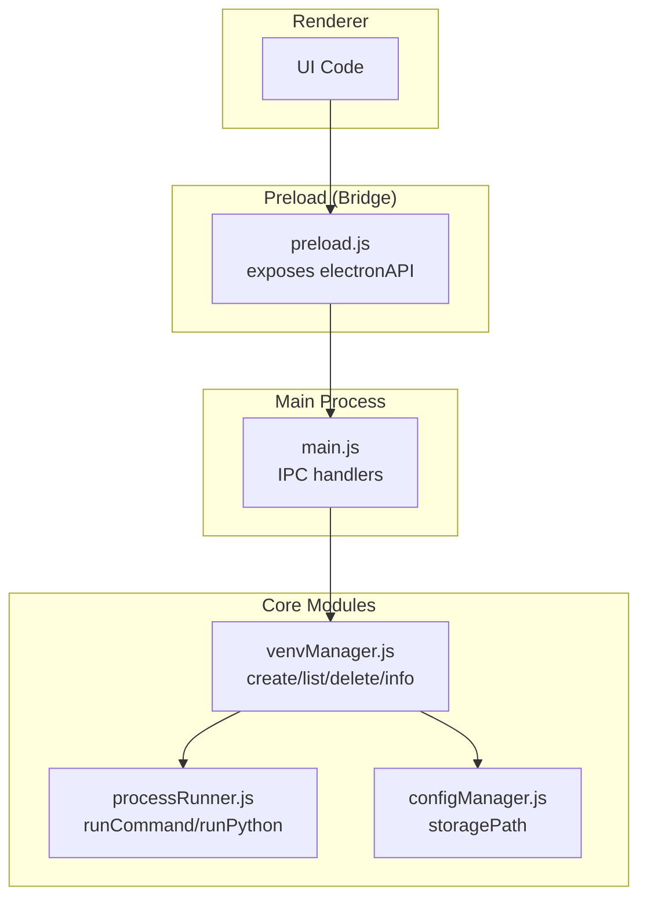
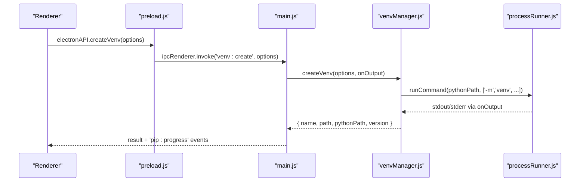
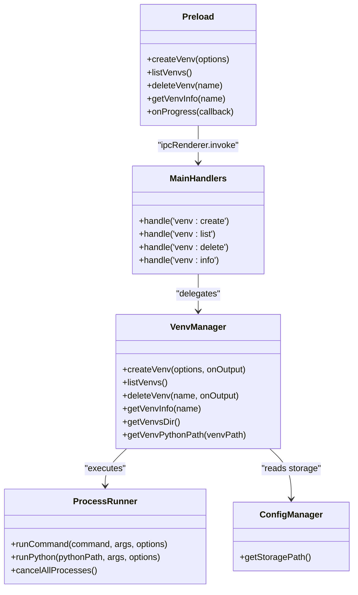
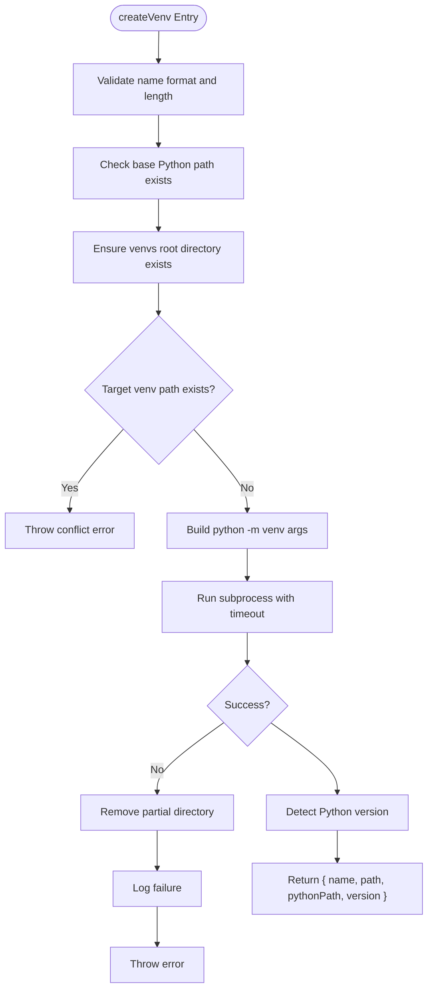
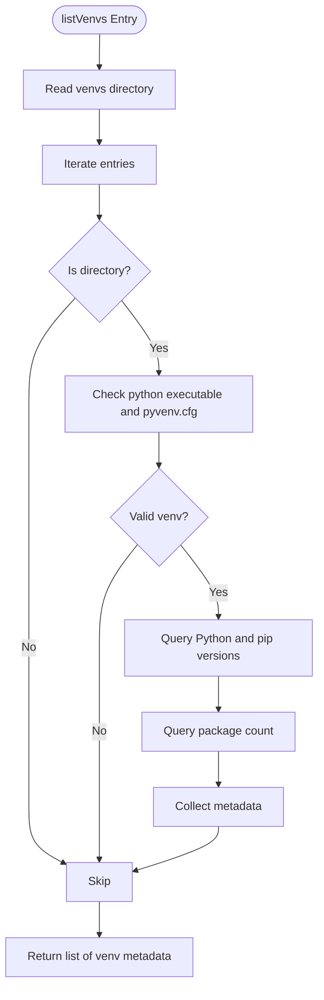
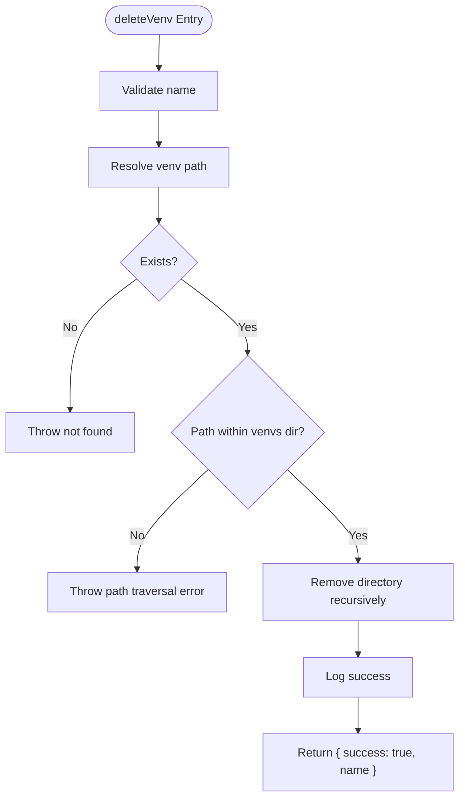
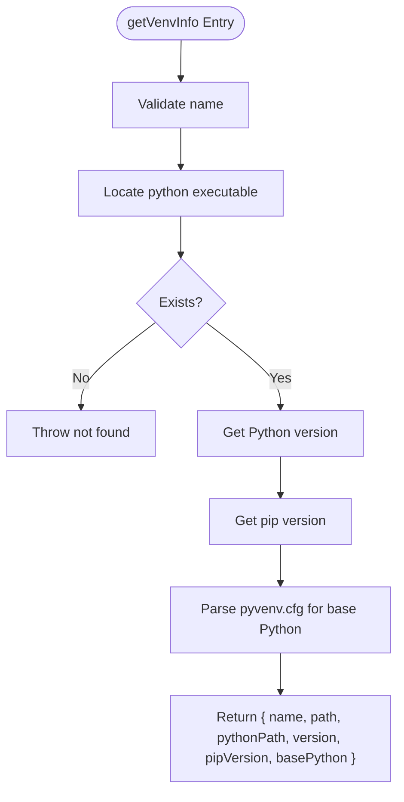
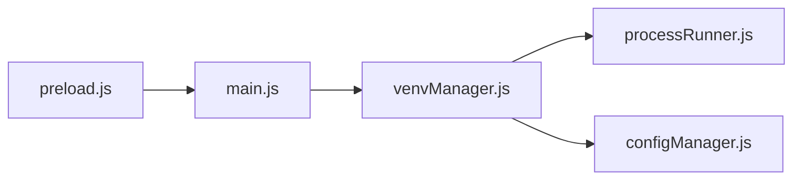

# Virtual Environment API

<cite>
**Referenced Files in This Document**
- [main.js](file://main.js)
- [preload.js](file://preload.js)
- [venvManager.js](file://core/operations/venvManager.js)
- [processRunner.js](file://utils/processRunner.js)
- [configManager.js](file://core/config/configManager.js)
</cite>

## Table of Contents
1. [Introduction](#introduction)
2. [Project Structure](#project-structure)
3. [Core Components](#core-components)
4. [Architecture Overview](#architecture-overview)
5. [Detailed Component Analysis](#detailed-component-analysis)
6. [Dependency Analysis](#dependency-analysis)
7. [Performance Considerations](#performance-considerations)
8. [Troubleshooting Guide](#troubleshooting-guide)
9. [Conclusion](#conclusion)

## Introduction
This document describes the virtual environment management IPC API exposed by the application. It covers:
- Methods: createVenv, listVenvs, deleteVenv, getVenvInfo
- Creation options and supported Python versions
- Directory structure and lifecycle management
- Examples for creating environments with custom configurations, managing multiple environments, and retrieving metadata
- Error handling for permission issues, path conflicts, and Python version compatibility problems

The API is implemented as an Electron IPC bridge between the renderer process and the main process, which delegates to a core venv manager module.

## Project Structure
The virtual environment feature spans three layers:
- Renderer-to-main IPC exposure via preload script
- Main process IPC handlers delegating to core modules
- Core venv manager implementing creation, listing, deletion, and inspection

**Diagram sources**
- [preload.js:20-38](file://preload.js#L20-L38)
- [main.js:266-280](file://main.js#L266-L280)
- [venvManager.js:1-278](file://core/operations/venvManager.js#L1-L278)
- [processRunner.js:85-161](file://utils/processRunner.js#L85-L161)
- [configManager.js:185-191](file://core/config/configManager.js#L185-L191)

**Section sources**
- [preload.js:20-38](file://preload.js#L20-L38)
- [main.js:266-280](file://main.js#L266-L280)
- [venvManager.js:1-278](file://core/operations/venvManager.js#L1-L278)
- [processRunner.js:85-161](file://utils/processRunner.js#L85-L161)
- [configManager.js:185-191](file://core/config/configManager.js#L185-L191)

## Core Components
- Preload exposes four methods on window.electronAPI for virtual environments:
  - createVenv(options)
  - listVenvs()
  - deleteVenv(name)
  - getVenvInfo(name)
- Main process registers IPC handlers that forward calls to venvManager functions and stream progress events back to the renderer.
- venvManager implements validation, filesystem operations, and Python subprocess execution.
- processRunner provides robust subprocess execution with timeouts, cancellation, and output streaming.
- configManager supplies the storage path where all venvs are created under a dedicated directory.

Key responsibilities:
- Input validation and security checks (name format, path traversal prevention)
- Cross-platform Python executable detection
- Subprocess orchestration for Python’s venv creation and pip queries
- Progress reporting via IPC events
- Logging of actions and errors

**Section sources**
- [preload.js:33-38](file://preload.js#L33-L38)
- [main.js:266-280](file://main.js#L266-L280)
- [venvManager.js:22-278](file://core/operations/venvManager.js#L22-L278)
- [processRunner.js:85-161](file://utils/processRunner.js#L85-L161)
- [configManager.js:185-191](file://core/config/configManager.js#L185-L191)

## Architecture Overview
The IPC flow for virtual environment operations follows a consistent pattern:
- Renderer invokes electronAPI methods
- Preload forwards via ipcRenderer.invoke to main handlers
- Main handler calls venvManager function
- venvManager performs validation and uses processRunner to execute Python commands
- Progress events are streamed back through ipcMain.handle callbacks

**Diagram sources**
- [preload.js:35](file://preload.js#L35)
- [main.js:266-270](file://main.js#L266-L270)
- [venvManager.js:73-130](file://core/operations/venvManager.js#L73-L130)
- [processRunner.js:85-161](file://utils/processRunner.js#L85-L161)

## Detailed Component Analysis

### IPC Exposure (preload.js)
- Exposes createVenv, listVenvs, deleteVenv, getVenvInfo on window.electronAPI
- Uses ipcRenderer.invoke to call corresponding main handlers
- Provides event listeners for progress updates (e.g., pip:progress)

Usage examples (conceptual):
- Create a venv with default pip and no system packages:
  - electronAPI.createVenv({ name: "myenv", pythonPath: "/path/to/python", withPip: true, systemSitePackages: false })
- List all venvs:
  - electronAPI.listVenvs()
- Delete a venv:
  - electronAPI.deleteVenv("myenv")
- Get venv info:
  - electronAPI.getVenvInfo("myenv")

Progress events:
- The main process emits 'pip:progress' with operation type 'venv' during creation/deletion.

**Section sources**
- [preload.js:33-38](file://preload.js#L33-L38)
- [preload.js:179-184](file://preload.js#L179-L184)

### Main Process Handlers (main.js)
- Registers IPC handlers for 'venv:create', 'venv:list', 'venv:delete', 'venv:info'
- Delegates to venvManager functions
- Streams progress via event.sender.send('pip:progress', ...)

Behavior highlights:
- createVenv passes an onOutput callback to emit progress events
- deleteVenv similarly streams progress
- listVenvs and getVenvInfo return data directly without progress events

**Section sources**
- [main.js:266-280](file://main.js#L266-L280)

### venvManager Implementation (venvManager.js)
Responsibilities:
- Name validation using a strict regex and length limit
- Base Python executable verification
- Safe directory resolution and existence checks
- Cross-platform Python executable path detection
- Subprocess execution for venv creation and pip queries
- Robust error handling and cleanup on failure
- Logging of actions and outcomes

Key methods:
- createVenv(options, onOutput)
  - Validates name and base Python path
  - Ensures target directory does not exist
  - Builds python -m venv arguments based on options
  - Executes command with timeout and streaming output
  - On failure, cleans up partial directories
  - Detects Python version from the new venv
  - Returns { name, path, pythonPath, version }
- listVenvs()
  - Scans venvs directory
  - Validates each entry as a real venv (python executable and pyvenv.cfg)
  - Retrieves version, pip version, and package count
  - Returns array of venv metadata objects
- deleteVenv(name, onOutput)
  - Validates name and existence
  - Prevents path traversal attacks
  - Removes directory recursively
  - Logs success or failure
- getVenvInfo(name)
  - Validates name and existence
  - Reads Python and pip versions
  - Parses pyvenv.cfg to extract base Python path
  - Returns detailed metadata object

Supported creation options:
- name: string (validated)
- pythonPath: string (must exist)
- withPip: boolean (default true; when false, creates without pip)
- systemSitePackages: boolean (default false; when true, inherits system site-packages)

Directory structure:
- All venvs are stored under a single root directory derived from configuration storage path
- Each venv is a folder containing platform-specific Python executables and metadata
- Valid venvs include a python executable and a pyvenv.cfg file

Lifecycle management:
- Creation ensures idempotency by checking for existing names
- Failure paths perform cleanup to avoid orphaned directories
- Deletion enforces safe path resolution to prevent traversal
- Listing and info methods validate venv integrity before returning data

Error handling patterns:
- Invalid name or missing base Python throws descriptive errors
- Path traversal attempts throw explicit errors
- Subprocess failures propagate underlying messages
- Permission-related failures surface as thrown errors with details

**Section sources**
- [venvManager.js:22-278](file://core/operations/venvManager.js#L22-L278)

### Subprocess Execution (processRunner.js)
- runCommand executes external processes with UTF-8 encoding, timeouts, and output streaming
- Supports SIGTERM followed by SIGKILL after a delay for graceful termination
- Tracks active processes for cancellation by processId or operationId
- Provides runPython and runPip helpers used by venvManager

Relevance to venv API:
- venv creation uses runCommand with a long timeout to allow Python venv initialization
- Version and pip queries use runPython with shorter timeouts
- Output is cleaned of ANSI codes and forwarded to onOutput callbacks

**Section sources**
- [processRunner.js:85-161](file://utils/processRunner.js#L85-L161)
- [processRunner.js:351-353](file://utils/processRunner.js#L351-L353)

### Configuration Storage (configManager.js)
- Provides getStoragePath which returns the configured storage directory
- venvManager uses this path to locate the venvs root directory
- Default storage path is set during configuration initialization

**Section sources**
- [configManager.js:185-191](file://core/config/configManager.js#L185-L191)
- [venvManager.js:30-33](file://core/operations/venvManager.js#L30-L33)

## Architecture Overview
High-level component interactions:

**Diagram sources**
- [preload.js:33-38](file://preload.js#L33-L38)
- [main.js:266-280](file://main.js#L266-L280)
- [venvManager.js:270-277](file://core/operations/venvManager.js#L270-L277)
- [processRunner.js:355-365](file://utils/processRunner.js#L355-L365)
- [configManager.js:185-191](file://core/config/configManager.js#L185-L191)

## Detailed Component Analysis

### createVenv Flow

**Diagram sources**
- [venvManager.js:73-130](file://core/operations/venvManager.js#L73-L130)
- [processRunner.js:85-161](file://utils/processRunner.js#L85-L161)

### listVenvs Flow

**Diagram sources**
- [venvManager.js:136-186](file://core/operations/venvManager.js#L136-L186)

### deleteVenv Flow

**Diagram sources**
- [venvManager.js:195-224](file://core/operations/venvManager.js#L195-L224)

### getVenvInfo Flow

**Diagram sources**
- [venvManager.js:231-268](file://core/operations/venvManager.js#L231-L268)

## Dependency Analysis
Component relationships:
- preload.js depends on ipcRenderer to invoke main handlers
- main.js depends on venvManager for business logic
- venvManager depends on processRunner for subprocess execution and configManager for storage path
- processRunner depends on Node child_process and fs modules

Potential coupling points:
- Changes to IPC channel names require updates across preload and main
- Modifications to venv naming rules affect validation and user input handling
- Subprocess behavior changes impact error propagation and timeouts

External dependencies:
- Python interpreter must be available at the specified path
- pip availability is optional but affects package count retrieval
- Filesystem permissions determine successful creation/deletion

**Diagram sources**
- [preload.js:33-38](file://preload.js#L33-L38)
- [main.js:266-280](file://main.js#L266-L280)
- [venvManager.js:16-21](file://core/operations/venvManager.js#L16-L21)

**Section sources**
- [venvManager.js:16-21](file://core/operations/venvManager.js#L16-L21)
- [processRunner.js:13-18](file://utils/processRunner.js#L13-L18)
- [configManager.js:17-19](file://core/config/configManager.js#L17-L19)

## Performance Considerations
- Subprocess timeouts:
  - venv creation uses a longer timeout to accommodate environment setup
  - Version and pip queries use shorter timeouts to avoid blocking
- Output streaming:
  - Real-time output reduces memory usage and improves UX
- Directory scanning:
  - listVenvs validates each candidate venv, which may incur I/O overhead
- Caching:
  - processRunner caches pip readiness per Python path to reduce repeated checks

Optimization opportunities:
- Batch operations could reduce repeated filesystem reads
- Parallelizing independent venv inspections might improve listing performance
- Introducing a cache for venv metadata could speed up repeated queries

[No sources needed since this section provides general guidance]

## Troubleshooting Guide
Common errors and resolutions:
- Invalid venv name:
  - Cause: Name contains disallowed characters or exceeds maximum length
  - Resolution: Use alphanumeric characters, hyphens, underscores, and dots; ensure first character is alphanumeric
- Base Python not found:
  - Cause: Specified pythonPath does not exist or is inaccessible
  - Resolution: Verify the path and ensure the Python executable is present
- Virtual environment already exists:
  - Cause: Attempting to create a venv with a duplicate name
  - Resolution: Choose a unique name or delete the existing venv first
- Path traversal detected:
  - Cause: Malformed or malicious name attempting to escape the venvs directory
  - Resolution: Use valid names only; the system rejects unsafe paths
- Permission denied:
  - Cause: Insufficient OS permissions to create or delete directories
  - Resolution: Run the application with appropriate privileges or adjust directory permissions
- Python version compatibility:
  - Cause: Target Python interpreter lacks required features or pip is missing
  - Resolution: Ensure a compatible Python installation; pip can be auto-installed if missing

Diagnostic steps:
- Use getVenvInfo to verify Python and pip versions within a venv
- Review logs via log:get to identify failed operations and error messages
- Test subprocess execution manually to confirm Python path validity

**Section sources**
- [venvManager.js:73-130](file://core/operations/venvManager.js#L73-L130)
- [venvManager.js:195-224](file://core/operations/venvManager.js#L195-L224)
- [venvManager.js:231-268](file://core/operations/venvManager.js#L231-L268)

## Conclusion
The virtual environment management API provides a secure, robust interface for creating, listing, deleting, and inspecting Python virtual environments. It integrates seamlessly with Electron’s IPC model, leverages reliable subprocess execution, and enforces strong validation and safety checks. Users can manage multiple environments with customizable options, retrieve detailed metadata, and handle errors gracefully. For best results, ensure valid Python installations, adhere to naming conventions, and operate within appropriate filesystem permissions.