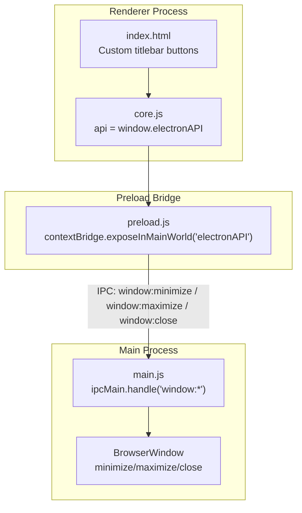
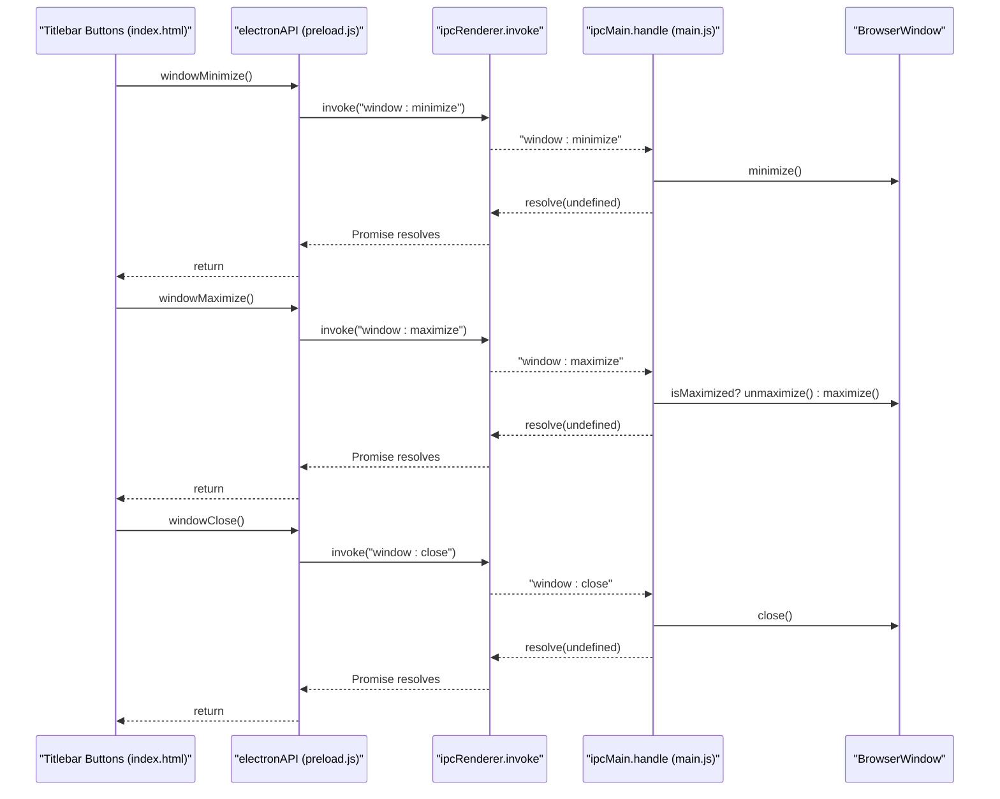

# Window Control API

<cite>
**Referenced Files in This Document**
- [preload.js](file://preload.js)
- [main.js](file://main.js)
- [index.html](file://renderer/index.html)
</cite>

## Table of Contents
1. [Introduction](#introduction)
2. [Project Structure](#project-structure)
3. [Core Components](#core-components)
4. [Architecture Overview](#architecture-overview)
5. [Detailed Component Analysis](#detailed-component-analysis)
6. [Dependency Analysis](#dependency-analysis)
7. [Performance Considerations](#performance-considerations)
8. [Troubleshooting Guide](#troubleshooting-guide)
9. [Conclusion](#conclusion)

## Introduction
This document explains PyLibMaster’s window control IPC API exposed via Electron’s contextBridge. It covers the three methods windowMinimize, windowMaximize, and windowClose, how they are wired from the renderer process to the main process, and how they interact with Electron’s BrowserWindow across operating systems. It also provides usage examples using async/await patterns, error handling strategies, and integration guidance for UI components such as the custom title bar buttons.

## Project Structure
The window control functionality spans three key files:
- preload.js: Exposes a safe API surface to the renderer through contextBridge.
- main.js: Registers IPC handlers that perform actual window operations on the main process.
- index.html: Contains the custom title bar buttons that invoke the exposed API.



**Diagram sources**
- [index.html:34-55](file://renderer/index.html#L34-L55)
- [preload.js:20-26](file://preload.js#L20-L26)
- [main.js:233-252](file://main.js#L233-L252)

**Section sources**
- [preload.js:1-221](file://preload.js#L1-L221)
- [main.js:1-640](file://main.js#L1-L640)
- [index.html:1-800](file://renderer/index.html#L1-L800)

## Core Components
- Renderer-side API exposure:
  - windowMinimize: Invokes IPC channel 'window:minimize'
  - windowMaximize: Invokes IPC channel 'window:maximize'
  - windowClose: Invokes IPC channel 'window:close'
- Main-process IPC handlers:
  - 'window:minimize': Calls mainWindow.minimize()
  - 'window:maximize': Toggles maximize/unmaximize on mainWindow
  - 'window:close': Calls mainWindow.close()

These methods are synchronous wrappers around ipcRenderer.invoke, which returns a Promise resolved when the main handler completes.

**Section sources**
- [preload.js:20-26](file://preload.js#L20-L26)
- [main.js:233-252](file://main.js#L233-L252)

## Architecture Overview
The flow is straightforward:
- The renderer calls window.electronAPI.windowMinimize/Maximize/Close.
- These functions use ipcRenderer.invoke to send an IPC message to the main process.
- The main process handles the message and performs the corresponding BrowserWindow operation.



**Diagram sources**
- [index.html:45-53](file://renderer/index.html#L45-L53)
- [preload.js:23-25](file://preload.js#L23-L25)
- [main.js:237-252](file://main.js#L237-L252)

## Detailed Component Analysis

### Preload Bridge: electronAPI.window* Methods
- Purpose: Safely expose window control methods to the renderer without granting direct Node/Electron access.
- Implementation pattern: Each method wraps ipcRenderer.invoke with the corresponding channel name.
- Return type: Promise<void>, resolved when the main handler finishes.

Key points:
- No parameters are passed; these are simple commands.
- Errors thrown by the main handler will cause the returned Promise to reject.

**Section sources**
- [preload.js:20-26](file://preload.js#L20-L26)

### Main Process IPC Handlers
- 'window:minimize':
  - Behavior: Minimizes the main window if it exists.
  - Cross-platform: Works consistently on Windows, macOS, and Linux.
- 'window:maximize':
  - Behavior: Toggles between maximized and restored states.
  - Cross-platform: Standard behavior across platforms; respects OS window management.
- 'window:close':
  - Behavior: Closes the main window.
  - Cross-platform: On macOS, app may remain running depending on configuration; on Windows/Linux, closing the last window typically quits the app unless prevented.

Note: The main process checks for mainWindow existence before calling any method to avoid runtime errors.

**Section sources**
- [main.js:237-252](file://main.js#L237-L252)

### UI Integration: Custom Title Bar Buttons
- The custom title bar contains three buttons bound directly to window.electronAPI.windowMinimize, windowMaximize, and windowClose.
- These buttons are styled and positioned within a draggable title bar region.

Usage example references:
- Minimize button inline onclick invokes window.electronAPI.windowMinimize().
- Maximize button inline onclick invokes window.electronAPI.windowMaximize().
- Close button inline onclick invokes window.electronAPI.windowClose().

**Section sources**
- [index.html:45-53](file://renderer/index.html#L45-L53)

### Usage Examples and Patterns

#### Basic Async/Await Pattern
- Call the API and await the result to ensure completion before proceeding.
- Example pattern:
  - const ok = await api.windowClose();
  - Use try/catch to handle potential errors.

#### Error Handling
- Wrap calls in try/catch to capture IPC failures or unexpected states.
- Provide user feedback (e.g., toast messages) when operations fail.

#### Integration with UI Components
- For title bar buttons, you can keep inline onclick handlers for simplicity.
- For more complex flows (e.g., confirm before close), call the API from event handlers and update UI state accordingly.

[No code content included; see Section sources for exact locations]

## Dependency Analysis
- Renderer depends on preload-exposed API:
  - core.js sets api = window.electronAPI.
- Preload depends on ipcRenderer to communicate with main.
- Main depends on ipcMain to receive IPC and BrowserWindow to perform actions.

```mermaid
classDiagram
class Renderer {
+calls window.electronAPI.windowMinimize()
+calls window.electronAPI.windowMaximize()
+calls window.electronAPI.windowClose()
}
class Preload {
+exposeInMainWorld("electronAPI", {...})
+windowMinimize()
+windowMaximize()
+windowClose()
}
class Main {
+handle("window : minimize")
+handle("window : maximize")
+handle("window : close")
}
class BrowserWindow {
+minimize()
+maximize()
+unmaximize()
+close()
}
Renderer --> Preload : "uses"
Preload --> Main : "IPC channels"
Main --> BrowserWindow : "controls"
```

**Diagram sources**
- [preload.js:20-26](file://preload.js#L20-L26)
- [main.js:237-252](file://main.js#L237-L252)

**Section sources**
- [preload.js:20-26](file://preload.js#L20-L26)
- [main.js:237-252](file://main.js#L237-L252)

## Performance Considerations
- IPC overhead is minimal for these lightweight commands.
- Avoid frequent repeated calls in tight loops; batch UI updates where possible.
- Ensure mainWindow exists before invoking handlers to prevent unnecessary IPC attempts.

[No sources needed since this section provides general guidance]

## Troubleshooting Guide
Common issues and resolutions:
- Method does nothing:
  - Verify mainWindow exists in main process.
  - Check that preload script is loaded and contextBridge exposes the API.
- Promise rejects:
  - Inspect console logs in both renderer and main processes.
  - Ensure no exceptions occur in the main handler path.
- Unexpected close behavior on macOS:
  - macOS may keep the app alive even after closing windows; verify app lifecycle settings if needed.

**Section sources**
- [preload.js:20-26](file://preload.js#L20-L26)
- [main.js:237-252](file://main.js#L237-L252)

## Conclusion
PyLibMaster’s window control API provides a clean, secure interface for renderer-side window management via Electron’s IPC. The three methods—windowMinimize, windowMaximize, and windowClose—are implemented with clear channel names and straightforward main-process handlers. By following async/await patterns and robust error handling, developers can integrate these controls seamlessly into UI components like the custom title bar.

[No sources needed since this section summarizes without analyzing specific files]