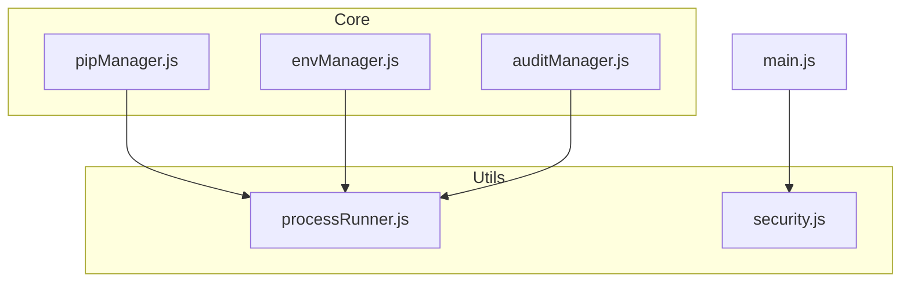
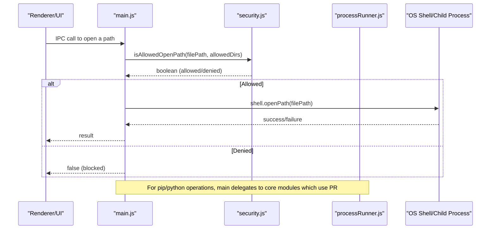
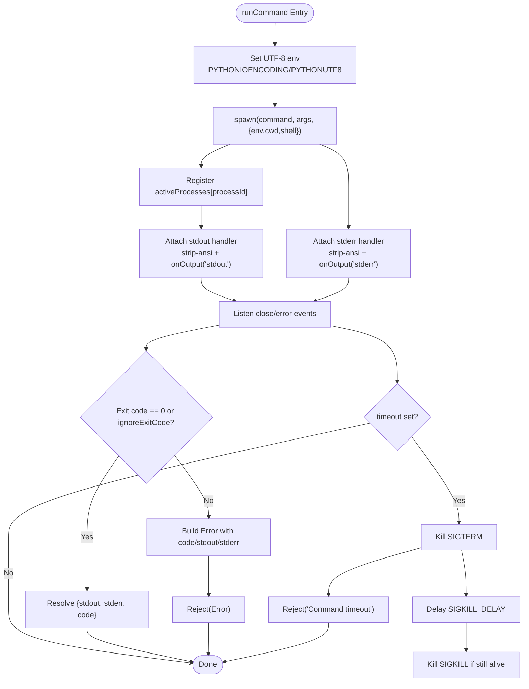
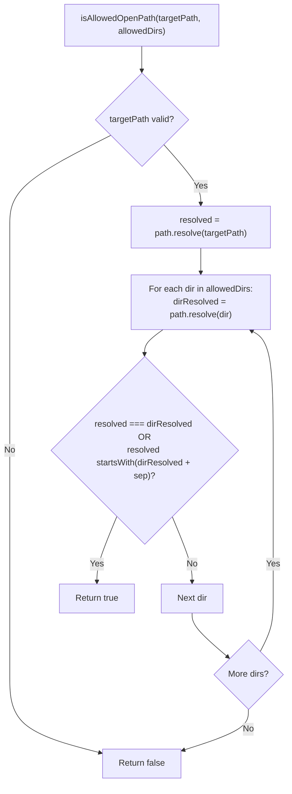
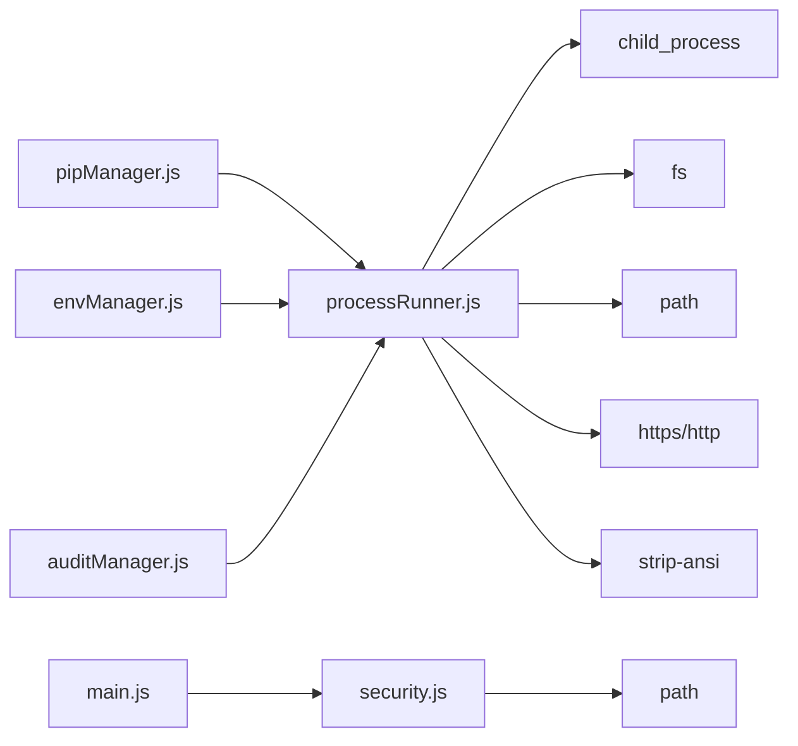

# Utility Functions

<cite>
**Referenced Files in This Document**
- [processRunner.js](file://utils/processRunner.js)
- [security.js](file://utils/security.js)
- [main.js](file://main.js)
- [pipManager.js](file://core/operations/pipManager.js)
- [envManager.js](file://core/system/envManager.js)
- [auditManager.js](file://core/operations/auditManager.js)
- [package.json](file://package.json)
</cite>

## Table of Contents
1. [Introduction](#introduction)
2. [Project Structure](#project-structure)
3. [Core Components](#core-components)
4. [Architecture Overview](#architecture-overview)
5. [Detailed Component Analysis](#detailed-component-analysis)
6. [Dependency Analysis](#dependency-analysis)
7. [Performance Considerations](#performance-considerations)
8. [Troubleshooting Guide](#troubleshooting-guide)
9. [Conclusion](#conclusion)

## Introduction
This document provides comprehensive utility function documentation for PyLibMaster’s shared utilities, focusing on:
- Process runner API for executing external commands with timeout handling, cancellation support, and output streaming
- Security utilities for input validation, path traversal prevention, command injection protection, and file system access controls
It includes parameter specifications, return value formats, error handling patterns, security best practices, code examples via references, and performance considerations.

## Project Structure
The utilities are implemented under the utils directory and consumed by core modules and the main process:
- utils/processRunner.js: Process execution, pip auto-installation, and lifecycle management
- utils/security.js: Path safety validation to prevent traversal and unauthorized access
- core modules (pipManager, envManager, auditManager): Consume processRunner for command execution
- main.js: Integrates security checks for opening paths and orchestrates application lifecycle

**Diagram sources**
- [processRunner.js](file://utils/processRunner.js)
- [security.js](file://utils/security.js)
- [pipManager.js](file://core/operations/pipManager.js)
- [envManager.js](file://core/system/envManager.js)
- [auditManager.js](file://core/operations/auditManager.js)
- [main.js](file://main.js)

**Section sources**
- [processRunner.js](file://utils/processRunner.js)
- [security.js](file://utils/security.js)
- [main.js](file://main.js)

## Core Components
- Process Runner API
  - runCommand(command, args, options): Executes external commands with UTF-8 encoding, ANSI cleanup, real-time output streaming, timeout, and cancellation tracking
  - runPip(pythonPath, args, options): Wrapper around runCommand for python -m pip
  - runPython(pythonPath, args, options): Wrapper around runCommand for direct Python execution
  - ensurePip(pythonPath, onOutput): Ensures pip availability with caching, ensurepip fallback, and get-pip.py download
  - checkPipAvailable(pythonPath): Checks pip presence without side effects
  - cancelProcess(processId), cancelOperation(operationId), cancelAllProcesses(): Lifecycle control for active processes
- Security Utilities
  - isAllowedOpenPath(targetPath, allowedDirs): Validates that a target path resides within an allowlist of directories, preventing path traversal

Key behaviors:
- Output streaming via onOutput callback with type 'stdout' or 'stderr'
- Timeout enforcement using SIGTERM followed by SIGKILL after a delay
- Active process tracking by processId and operationId for targeted cancellation
- Automatic pip installation with multiple strategies and caching
- Strict path validation against traversal and sensitive directories

**Section sources**
- [processRunner.js](file://utils/processRunner.js)
- [security.js](file://utils/security.js)

## Architecture Overview
The process runner is the central execution engine used across core modules. Security utilities gate file operations at the main process boundary.

**Diagram sources**
- [main.js](file://main.js)
- [security.js](file://utils/security.js)
- [processRunner.js](file://utils/processRunner.js)

## Detailed Component Analysis

### Process Runner API
Responsibilities:
- Spawn child processes with controlled environment variables (UTF-8)
- Stream stdout/stderr through strip-ansi cleaned text
- Track active processes and support cancellation by processId or operationId
- Enforce timeouts with graceful termination (SIGTERM then SIGKILL)
- Provide pip-specific helpers and automatic pip installation

API details:
- runCommand(command, args, options)
  - Parameters:
    - command: string (executable name/path)
    - args: string[] (arguments)
    - options: object
      - timeout?: number (milliseconds)
      - onOutput?: function(text, type) where type is 'stdout' or 'stderr'
      - shell?: boolean (use shell execution)
      - ignoreExitCode?: boolean (treat non-zero exit as success)
      - cwd?: string (working directory)
      - env?: object (additional environment variables)
      - processId?: string (custom ID for tracking)
      - operationId?: string (grouping for batch cancellation)
  - Returns: Promise<{ stdout: string, stderr: string, code: number }>
  - Errors: Rejects with Error including code, stdout, stderr when non-zero exit and not ignored; also rejects on timeout
- runPip(pythonPath, args, options)
  - Parameters: pythonPath (string), args (string[]), options (object)
  - Returns: Promise<{ stdout, stderr, code }>
- runPython(pythonPath, args, options)
  - Parameters: pythonPath (string), args (string[]), options (object)
  - Returns: Promise<{ stdout, stderr, code }>
- ensurePip(pythonPath, onOutput?)
  - Behavior:
    - Check cache → detect pip → try ensurepip → download get-pip.py → install
    - Caches readiness per pythonPath with TTL
  - Returns: Promise<boolean>
  - Throws: Error if all installation methods fail
- checkPipAvailable(pythonPath)
  - Returns: Promise<boolean>
- cancelProcess(processId)
  - Returns: boolean (signal sent)
- cancelOperation(operationId)
  - Returns: number (count of processes cancelled)
- cancelAllProcesses()
  - Returns: number (count of processes cancelled)

Error handling patterns:
- Non-zero exit codes produce errors with attached stdout/stderr for diagnostics
- Timeouts trigger SIGTERM then SIGKILL after a fixed delay and reject with a timeout message
- Network failures during get-pip.py download attempt alternate sources with timeouts

Security considerations:
- Avoid shell:true unless necessary; prefer passing arguments directly
- Validate inputs upstream (e.g., package names, wheel paths) before invoking runCommand/runPip
- Use operationId to scope cancellations safely

Performance characteristics:
- Real-time streaming avoids large memory buffers
- pip readiness cached to reduce repeated detection overhead
- Parallel usage supported by caller modules; processRunner tracks each process independently

**Diagram sources**
- [processRunner.js](file://utils/processRunner.js)

**Section sources**
- [processRunner.js](file://utils/processRunner.js)

### Security Utilities
Responsibilities:
- Prevent path traversal attacks by validating absolute resolved paths against an allowlist
- Ensure only permitted directories can be accessed for opening files

API details:
- isAllowedOpenPath(targetPath, allowedDirs)
  - Parameters:
    - targetPath: string (absolute or relative path)
    - allowedDirs: string[] (allowlist of base directories)
  - Returns: boolean (true if safe)
  - Validation:
    - Resolves both target and allowed dirs to absolute paths
    - Allows exact match or strict prefix match using path separator to avoid partial matches
  - Edge cases:
    - Rejects empty or invalid inputs
    - Blocks traversal attempts like ".." by resolving first

Usage example reference:
- Opening paths via main process uses this validator to restrict user-selected paths to documents/downloads/userData

Best practices:
- Always resolve paths before comparison
- Maintain a minimal allowlist
- Combine with other validations (e.g., file existence, permissions) at higher layers

**Diagram sources**
- [security.js](file://utils/security.js)

**Section sources**
- [security.js](file://utils/security.js)
- [main.js](file://main.js)

### Integration Examples

#### Safe Process Execution
- pip operations:
  - pipManager calls ensurePip and runPip with timeouts and progress callbacks
  - Example references:
    - [pipManager.js](file://core/operations/pipManager.js)
- Python version detection:
  - envManager uses runPython and runCommand with timeouts
  - Example references:
    - [envManager.js](file://core/system/envManager.js)
- Vulnerability scanning:
  - auditManager ensures pip-audit and runs it via runCommand with JSON parsing
  - Example references:
    - [auditManager.js](file://core/operations/auditManager.js)

#### Secure File Operations
- Opening paths:
  - main.js validates selected paths with isAllowedOpenPath before shell.openPath
  - Example references:
    - [main.js](file://main.js)
    - [security.js](file://utils/security.js)

#### Input Sanitization
- Package spec building and wheel path validation:
  - pipManager enforces strict regexes and path checks to prevent command injection and traversal
  - Example references:
    - [pipManager.js](file://core/operations/pipManager.js)

**Section sources**
- [pipManager.js](file://core/operations/pipManager.js)
- [envManager.js](file://core/system/envManager.js)
- [auditManager.js](file://core/operations/auditManager.js)
- [main.js](file://main.js)
- [security.js](file://utils/security.js)

## Dependency Analysis
- processRunner.js depends on Node built-ins (child_process, fs, path, https, http) and strip-ansi
- security.js depends on Node path module
- Core modules import processRunner functions for execution and rely on envManager for environment context
- main.js imports security utility for path validation and integrates processRunner for lifecycle cleanup

**Diagram sources**
- [processRunner.js](file://utils/processRunner.js)
- [security.js](file://utils/security.js)
- [pipManager.js](file://core/operations/pipManager.js)
- [envManager.js](file://core/system/envManager.js)
- [auditManager.js](file://core/operations/auditManager.js)
- [main.js](file://main.js)
- [package.json](file://package.json)

**Section sources**
- [package.json](file://package.json)

## Performance Considerations
- Memory management:
  - Streaming stdout/stderr prevents buffering entire outputs in memory
  - strip-ansi applied per chunk to minimize overhead
- Caching:
  - pip readiness cached per pythonPath with TTL to avoid repeated checks
  - Site-packages and installed packages caches used by core modules (outside this doc)
- Concurrency:
  - Caller modules manage parallelism; processRunner tracks each process independently
- Timeouts:
  - Default timeouts should be set for long-running operations (pip installs, downloads)
  - Graceful termination reduces resource leaks
- Network:
  - get-pip.py download retries alternate sources with timeouts to improve reliability

[No sources needed since this section provides general guidance]

## Troubleshooting Guide
Common issues and resolutions:
- Command timeout:
  - Increase timeout option for slow operations
  - Verify network connectivity for get-pip.py downloads
- Non-zero exit codes:
  - Inspect err.stdout and err.stderr attached to the thrown Error
  - Use ignoreExitCode only when appropriate
- Cancellation not working:
  - Ensure processId or operationId is correctly passed and tracked
  - Confirm process is still alive before sending signals
- Path access blocked:
  - Verify targetPath resolves within allowedDirs
  - Check for ".." components or UNC paths in upstream validation

**Section sources**
- [processRunner.js](file://utils/processRunner.js)
- [security.js](file://utils/security.js)

## Conclusion
PyLibMaster’s utilities provide robust process execution and secure file access primitives:
- The process runner offers reliable command execution with streaming, timeouts, and cancellation
- Security utilities enforce strict path validation to prevent traversal and unauthorized access
Adhering to the documented APIs and best practices ensures safe, performant, and maintainable operations across the application.

[No sources needed since this section summarizes without analyzing specific files]