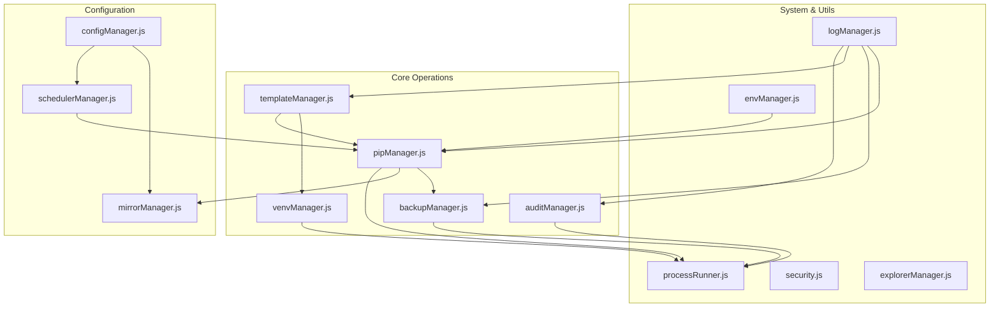
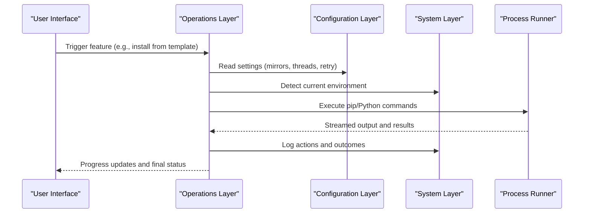
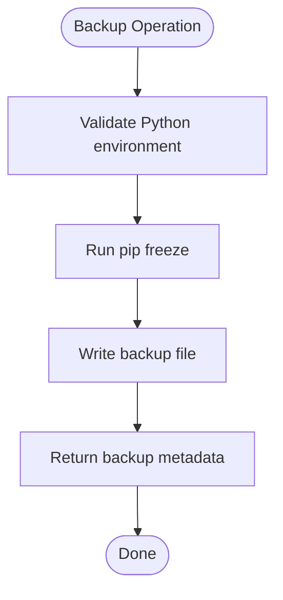
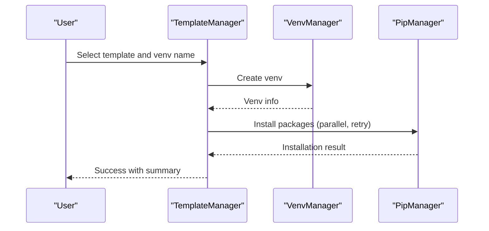
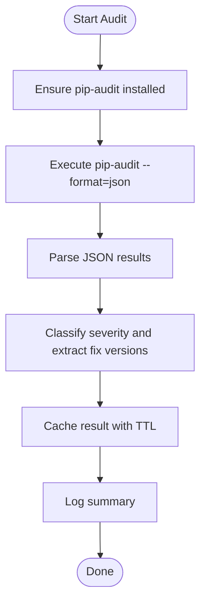
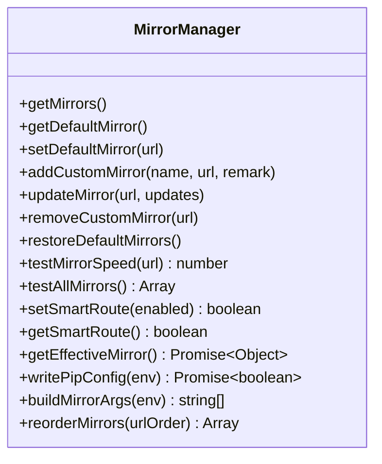
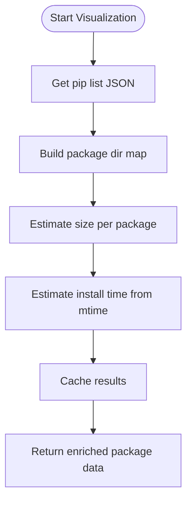
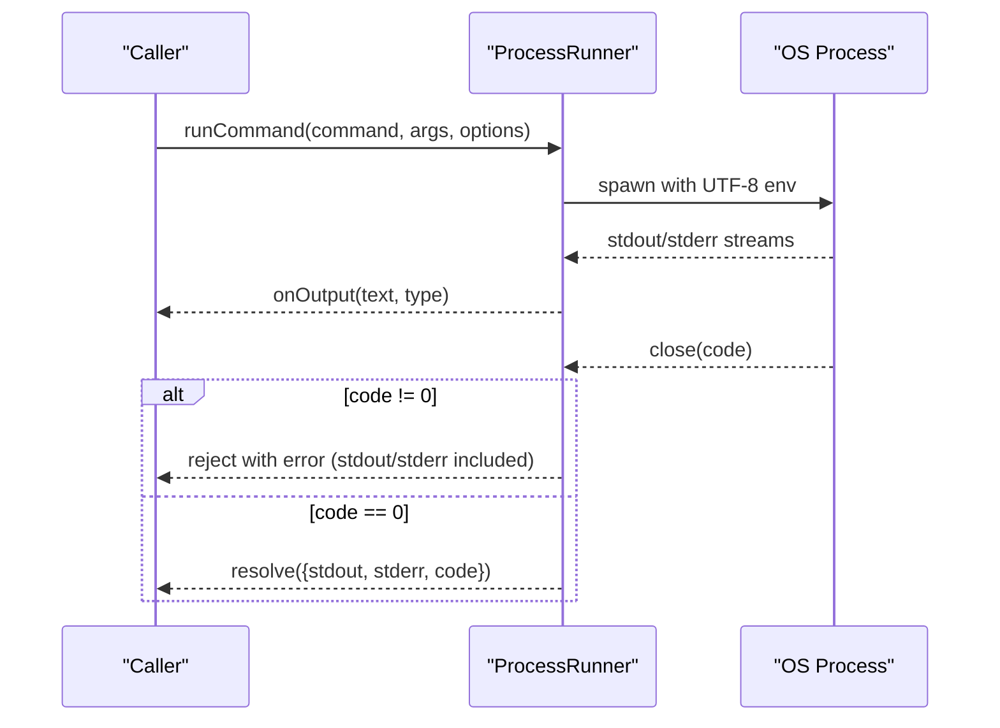
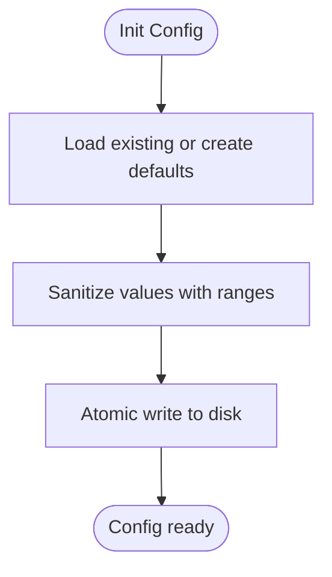
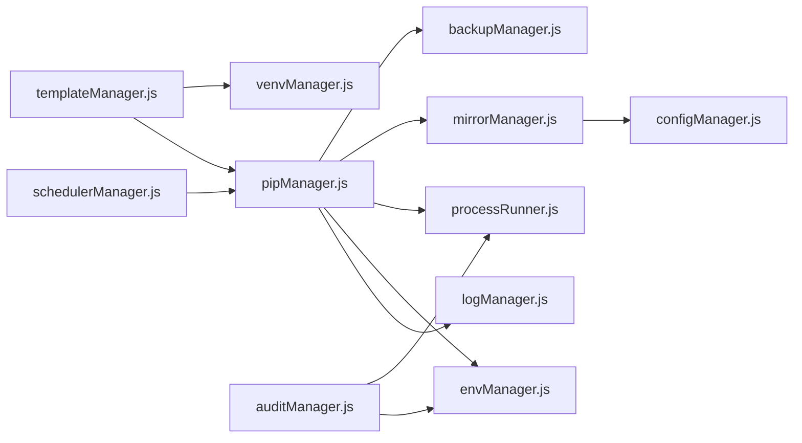

# Advanced Features

<cite>
**Referenced Files in This Document**
- [backupManager.js](file://core/operations/backupManager.js)
- [templateManager.js](file://core/operations/templateManager.js)
- [auditManager.js](file://core/operations/auditManager.js)
- [mirrorManager.js](file://core/config/mirrorManager.js)
- [pipManager.js](file://core/operations/pipManager.js)
- [envManager.js](file://core/system/envManager.js)
- [logManager.js](file://core/system/logManager.js)
- [processRunner.js](file://utils/processRunner.js)
- [security.js](file://utils/security.js)
- [configManager.js](file://core/config/configManager.js)
- [venvManager.js](file://core/operations/venvManager.js)
- [explorerManager.js](file://core/system/explorerManager.js)
- [schedulerManager.js](file://core/config/schedulerManager.js)
- [package.json](file://package.json)
</cite>

## Table of Contents
1. Introduction
2. Project Structure
3. Core Components
4. Architecture Overview
5. Detailed Component Analysis
6. Dependency Analysis
7. Performance Considerations
8. Troubleshooting Guide
9. Conclusion
10. Appendices

## Introduction
This document explains PyLibMaster’s advanced features that significantly improve productivity and maintainability for Python environments: automated backup and recovery, template-based project setup, security auditing and vulnerability scanning, mirror source optimization, and dependency visualization. It also covers configuration options, customization possibilities, integration with external systems, real-world use cases, performance considerations, enterprise best practices, and security implications.

## Project Structure
PyLibMaster is an Electron-based desktop application organized into core modules for operations (pip, backups, templates, venv), system utilities (environment detection, logging, explorer integration), configuration management, and process execution utilities. The advanced features are implemented primarily under core/operations and core/config, with supporting system and utility modules.

**Diagram sources**
- [pipManager.js:1-120](file://core/operations/pipManager.js#L1-L120)
- [backupManager.js:1-60](file://core/operations/backupManager.js#L1-L60)
- [templateManager.js:1-80](file://core/operations/templateManager.js#L1-L80)
- [venvManager.js:1-60](file://core/operations/venvManager.js#L1-L60)
- [auditManager.js:1-60](file://core/operations/auditManager.js#L1-L60)
- [configManager.js:1-60](file://core/config/configManager.js#L1-L60)
- [mirrorManager.js:1-60](file://core/config/mirrorManager.js#L1-L60)
- [schedulerManager.js:1-60](file://core/config/schedulerManager.js#L1-L60)
- [envManager.js:1-60](file://core/system/envManager.js#L1-L60)
- [logManager.js:1-60](file://core/system/logManager.js#L1-L60)
- [processRunner.js:1-60](file://utils/processRunner.js#L1-L60)
- [security.js:1-40](file://utils/security.js#L1-L40)
- [explorerManager.js:1-40](file://core/system/explorerManager.js#L1-L40)

**Section sources**
- [package.json:1-30](file://package.json#L1-L30)

## Core Components
- Automated Backup and Recovery: Creates environment snapshots using pip freeze and restores them with force-reinstall to ensure deterministic environments.
- Template-Based Setup: Provides built-in and custom templates to bootstrap virtual environments with curated package sets.
- Security Auditing: Integrates pip-audit to scan installed packages for known vulnerabilities and provides remediation guidance.
- Mirror Source Optimization: Manages multiple PyPI mirrors, measures speed, selects the fastest mirror, and writes pip configuration.
- Dependency Visualization: Estimates package sizes and installation times by scanning site-packages metadata; supports cached results for performance.

Key capabilities:
- Environment isolation via venv creation and management.
- Robust process execution with timeouts, cancellation, and output streaming.
- Centralized configuration with validation and persistence.
- Comprehensive operation logging with filtering and capacity control.

**Section sources**
- [backupManager.js:1-120](file://core/operations/backupManager.js#L1-L120)
- [templateManager.js:1-120](file://core/operations/templateManager.js#L1-L120)
- [auditManager.js:1-120](file://core/operations/auditManager.js#L1-L120)
- [mirrorManager.js:1-120](file://core/config/mirrorManager.js#L1-L120)
- [pipManager.js:1-120](file://core/operations/pipManager.js#L1-L120)
- [venvManager.js:1-80](file://core/operations/venvManager.js#L1-L80)
- [processRunner.js:1-120](file://utils/processRunner.js#L1-L120)
- [configManager.js:1-120](file://core/config/configManager.js#L1-L120)
- [logManager.js:1-120](file://core/system/logManager.js#L1-L120)

## Architecture Overview
The advanced features are orchestrated through a layered architecture:
- Operations layer: pipManager, backupManager, templateManager, auditManager, venvManager implement business logic.
- Configuration layer: configManager, mirrorManager, schedulerManager manage settings and policies.
- System layer: envManager detects Python environments; logManager records events; explorerManager integrates with Windows Explorer.
- Utilities: processRunner executes commands safely; security.js validates paths.

**Diagram sources**
- [pipManager.js:1-120](file://core/operations/pipManager.js#L1-L120)
- [mirrorManager.js:1-120](file://core/config/mirrorManager.js#L1-L120)
- [envManager.js:1-120](file://core/system/envManager.js#L1-L120)
- [logManager.js:1-120](file://core/system/logManager.js#L1-L120)
- [processRunner.js:1-120](file://utils/processRunner.js#L1-L120)

## Detailed Component Analysis

### Automated Backup and Recovery
Purpose:
- Create deterministic backups of Python environments using pip freeze.
- Restore environments precisely to a previous state with force-reinstall and no-deps to avoid dependency drift.
- Provide safe deletion and listing of backups with ID validation to prevent path traversal.

Key behaviors:
- Backup files follow a strict naming convention and are stored under a dedicated directory.
- Restoration uses pip install -r with flags to enforce exact versions and skip dependency reinstall.
- All operations are logged and errors are captured with actionable messages.

**Diagram sources**
- [backupManager.js:80-120](file://core/operations/backupManager.js#L80-L120)

**Section sources**
- [backupManager.js:1-196](file://core/operations/backupManager.js#L1-L196)

### Template-Based Project Setup
Purpose:
- Provide built-in templates for common development scenarios (Web, Data, ML, Crawling, Automation).
- Allow users to add or remove custom templates.
- Automate venv creation and package installation based on selected templates.

Key behaviors:
- Templates define package lists and metadata; custom templates can be persisted via configuration.
- Creation flow orchestrates venv creation and parallel package installation with progress callbacks.
- Snapshots capture environment states at specific points in time, enabling “time travel” rollbacks.

**Diagram sources**
- [templateManager.js:110-160](file://core/operations/templateManager.js#L110-L160)
- [venvManager.js:60-130](file://core/operations/venvManager.js#L60-L130)
- [pipManager.js:490-600](file://core/operations/pipManager.js#L490-L600)

**Section sources**
- [templateManager.js:1-320](file://core/operations/templateManager.js#L1-L320)
- [venvManager.js:1-278](file://core/operations/venvManager.js#L1-L278)

### Security Auditing and Vulnerability Scanning
Purpose:
- Scan installed packages for known CVEs using pip-audit.
- Auto-install pip-audit if missing and parse structured JSON results.
- Provide severity classification and fix version recommendations.

Key behaviors:
- Results are cached for a configurable TTL to reduce repeated scans.
- Logs summarize total vulnerabilities, affected packages, and fixable counts.
- Graceful handling of non-zero exit codes while still parsing JSON output.

**Diagram sources**
- [auditManager.js:50-120](file://core/operations/auditManager.js#L50-L120)
- [auditManager.js:120-200](file://core/operations/auditManager.js#L120-L200)

**Section sources**
- [auditManager.js:1-230](file://core/operations/auditManager.js#L1-L230)

### Mirror Source Optimization
Purpose:
- Manage multiple PyPI mirrors (built-in and custom).
- Measure mirror speeds and select the fastest mirror automatically.
- Persist effective mirror configuration to pip’s global config.

Key behaviors:
- URL validation ensures only http/https protocols.
- Smart routing toggles automatic selection of the fastest mirror.
- Writes pip configuration files per platform for seamless usage.

**Diagram sources**
- [mirrorManager.js:1-200](file://core/config/mirrorManager.js#L1-L200)
- [mirrorManager.js:200-376](file://core/config/mirrorManager.js#L200-L376)

**Section sources**
- [mirrorManager.js:1-376](file://core/config/mirrorManager.js#L1-L376)

### Dependency Visualization
Purpose:
- Estimate package sizes and installation times by scanning site-packages metadata.
- Build a mapping of package directories and .dist-info entries for fast lookups.
- Cache results to minimize repeated filesystem scans.

Key behaviors:
- Uses pip list JSON to enumerate installed packages.
- Computes size via recursive directory traversal with depth limits and symlink avoidance.
- Returns human-readable size text and timestamps for quick insights.

**Diagram sources**
- [pipManager.js:390-430](file://core/operations/pipManager.js#L390-L430)
- [pipManager.js:270-390](file://core/operations/pipManager.js#L270-L390)

**Section sources**
- [pipManager.js:1-800](file://core/operations/pipManager.js#L1-L800)

### Process Execution and Safety
Purpose:
- Provide robust subprocess execution with timeouts, cancellation, and ANSI cleanup.
- Ensure pip availability with auto-install strategies.
- Track active processes and support bulk cancellation by operationId.

Key behaviors:
- runCommand encapsulates spawn, stdout/stderr streaming, and error handling.
- ensurePip tries multiple strategies (ensurepip, get-pip.py download) with fallbacks.
- cancelOperation cancels all child processes associated with a single operation.

**Diagram sources**
- [processRunner.js:80-160](file://utils/processRunner.js#L80-L160)
- [processRunner.js:230-280](file://utils/processRunner.js#L230-L280)

**Section sources**
- [processRunner.js:1-366](file://utils/processRunner.js#L1-L366)

### Configuration Management
Purpose:
- Persist application settings with validation and range limits.
- Provide atomic writes to avoid corruption.
- Offer storage path management and defaults.

Key behaviors:
- sanitizeValue enforces numeric ranges and types.
- saveConfig writes to a temporary file then renames atomically.
- getStoragePath ensures directories exist before use.

**Diagram sources**
- [configManager.js:80-140](file://core/config/configManager.js#L80-L140)
- [configManager.js:140-194](file://core/config/configManager.js#L140-L194)

**Section sources**
- [configManager.js:1-194](file://core/config/configManager.js#L1-L194)

### Logging and Observability
Purpose:
- Record operations with timestamps, statuses, and truncated details.
- Debounce saves to reduce disk writes.
- Support filtering by type and keyword search.

Key behaviors:
- addLog inserts newest first and trims long fields.
- flushLogs ensures data persists on shutdown.
- getLogs supports type and search filters.

**Section sources**
- [logManager.js:1-173](file://core/system/logManager.js#L1-L173)

### Environment Detection and Switching
Purpose:
- Discover Python installations across common paths and PATH.
- Retrieve Python and pip versions and filter out environments without pip.
- Persist and switch current environment with validation.

**Section sources**
- [envManager.js:1-220](file://core/system/envManager.js#L1-L220)

### Windows Explorer Integration
Purpose:
- Add context menu items to open directories with PyLibMaster or create venvs directly.
- Use HKCU registry keys to avoid admin privileges.

**Section sources**
- [explorerManager.js:1-120](file://core/system/explorerManager.js#L1-L120)

### Scheduled Updates
Purpose:
- Periodically check and update outdated packages in the background.
- Respect whitelist to exclude critical packages from auto-updates.
- Persist last run time and provide status reporting.

**Section sources**
- [schedulerManager.js:1-197](file://core/config/schedulerManager.js#L1-L197)

## Dependency Analysis
Advanced features rely on tightly coupled modules:
- pipManager depends on backupManager, mirrorManager, processRunner, envManager, and logManager.
- templateManager orchestrates venvManager and pipManager for environment bootstrapping.
- auditManager depends on processRunner and envManager to execute pip-audit.
- mirrorManager interacts with configManager to persist mirror settings and writes pip configuration.
- schedulerManager calls pipManager.updatePackages and logs results.

**Diagram sources**
- [pipManager.js:1-120](file://core/operations/pipManager.js#L1-L120)
- [templateManager.js:1-120](file://core/operations/templateManager.js#L1-L120)
- [auditManager.js:1-120](file://core/operations/auditManager.js#L1-L120)
- [mirrorManager.js:1-120](file://core/config/mirrorManager.js#L1-L120)
- [schedulerManager.js:1-120](file://core/config/schedulerManager.js#L1-L120)

**Section sources**
- [pipManager.js:1-120](file://core/operations/pipManager.js#L1-L120)
- [templateManager.js:1-120](file://core/operations/templateManager.js#L1-L120)
- [auditManager.js:1-120](file://core/operations/auditManager.js#L1-L120)
- [mirrorManager.js:1-120](file://core/config/mirrorManager.js#L1-L120)
- [schedulerManager.js:1-120](file://core/config/schedulerManager.js#L1-L120)

## Performance Considerations
- Parallelism: pipManager supports parallel installation with configurable thread count; balance concurrency against network and CPU constraints.
- Caching: Installed package cache has a 5-minute TTL; site-packages path cache reduces repeated discovery overhead.
- Disk IO: Recursive size calculation uses caching and depth limits to avoid excessive filesystem traversal.
- Network: Mirror speed tests use HEAD requests with timeouts; smart routing minimizes latency by selecting the fastest mirror.
- Logging: Debounced saves reduce frequent disk writes; field truncation prevents oversized logs.

Best practices:
- Tune parallelThreads according to available resources and network bandwidth.
- Enable smartRoute in high-latency networks to leverage faster mirrors.
- Use snapshots for critical environments to enable quick rollbacks without full rebuilds.
- Schedule audits during off-peak hours to avoid impacting user workflows.

[No sources needed since this section provides general guidance]

## Troubleshooting Guide
Common issues and resolutions:
- pip not found: ensurePip attempts ensurepip and get-pip.py; verify network access and proxy settings.
- Mirror failures: testAllMirrors identifies slow/unreachable mirrors; set default mirror explicitly if needed.
- Backup restore errors: validate backup ID format and ensure target environment exists; check pip version compatibility.
- Audit scan failures: ensure pip-audit is installed; confirm JSON output parsing; clear cache if stale results appear.
- Path traversal protection: validate inputs using security.isAllowedOpenPath and built-in regex checks for wheel paths and backup IDs.

Operational tips:
- Use logManager.getLogs with filters to diagnose failed operations.
- Cancel long-running operations via cancelOperation with the operationId returned by install/update flows.
- Flush logs on shutdown to ensure complete audit trails.

**Section sources**
- [processRunner.js:230-280](file://utils/processRunner.js#L230-L280)
- [mirrorManager.js:200-320](file://core/config/mirrorManager.js#L200-L320)
- [backupManager.js:60-120](file://core/operations/backupManager.js#L60-L120)
- [auditManager.js:50-120](file://core/operations/auditManager.js#L50-L120)
- [security.js:1-40](file://utils/security.js#L1-L40)
- [logManager.js:100-173](file://core/system/logManager.js#L100-L173)

## Conclusion
PyLibMaster’s advanced features deliver robust automation, security, and performance for Python environment management. By combining deterministic backups, templated setups, vulnerability scanning, intelligent mirror selection, and dependency insights, teams can maintain consistent, secure, and efficient development workflows. Proper configuration, monitoring, and adherence to best practices ensure reliability in enterprise environments.

[No sources needed since this section summarizes without analyzing specific files]

## Appendices

### Real-World Use Cases
- Enterprise CI/CD pipelines: Use templates to provision isolated environments with pinned dependencies; schedule nightly audits and updates with whitelists to protect critical components.
- Data science teams: Snapshot environments after successful experiments; rollback quickly when breaking changes occur; visualize package sizes to optimize storage.
- Web development: Bootstrap Flask/Django projects from templates; optimize downloads via mirror selection; automate updates with scheduled tasks.

### Configuration Options and Customization
- Global settings: theme, language, storagePath, parallelThreads, retryCount, smartRoute, windowBounds.
- Mirrors: Add/remove custom mirrors, reorder priorities, toggle smart routing, write pip configuration.
- Scheduler: Enable/disable, choose frequency (daily/weekly), configure whitelist, inspect last run time.
- Templates: Define custom templates with package lists and metadata; persist via configuration.

### Integration with External Systems
- Windows Explorer: Context menu integration for quick actions without launching the app manually.
- Logging: Centralized JSON logs for analysis and compliance; support filtering and search.
- Process management: Unified cancellation and timeout handling for external command execution.

### Security Implications and Data Protection
- Input validation: Strict regex checks for package names, versions, wheel paths, and backup IDs to prevent injection and traversal attacks.
- Path safety: Allowed directory checks and absolute path enforcement mitigate unauthorized file access.
- Credential handling: No secrets are embedded; external tools (pip-audit) operate within configured environments.
- Audit trails: Comprehensive logging captures actions, statuses, and details for forensic analysis.

**Section sources**
- [configManager.js:80-140](file://core/config/configManager.js#L80-L140)
- [mirrorManager.js:120-200](file://core/config/mirrorManager.js#L120-L200)
- [schedulerManager.js:20-80](file://core/config/schedulerManager.js#L20-L80)
- [explorerManager.js:40-120](file://core/system/explorerManager.js#L40-L120)
- [logManager.js:100-173](file://core/system/logManager.js#L100-L173)
- [security.js:1-40](file://utils/security.js#L1-L40)
- [pipManager.js:130-240](file://core/operations/pipManager.js#L130-L240)
- [backupManager.js:60-120](file://core/operations/backupManager.js#L60-L120)