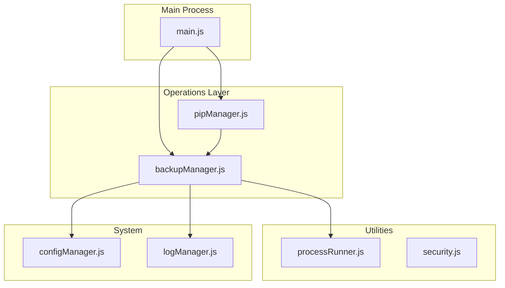
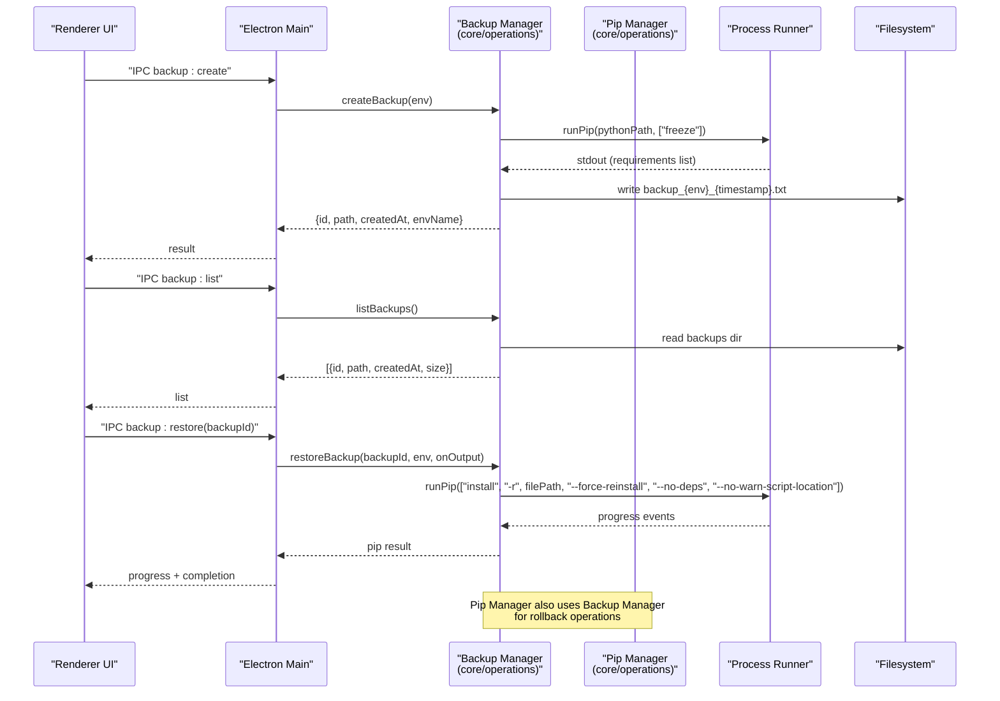
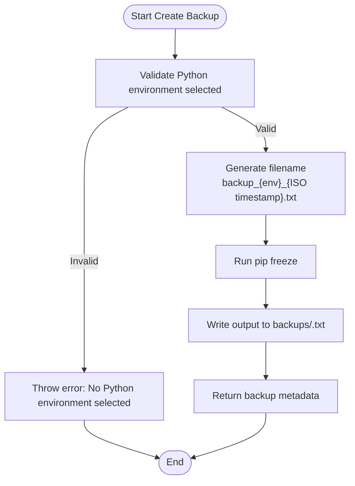
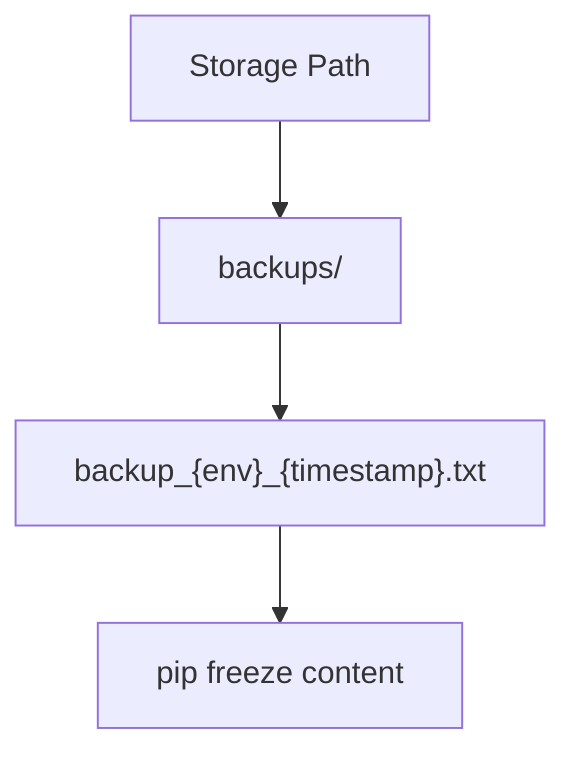
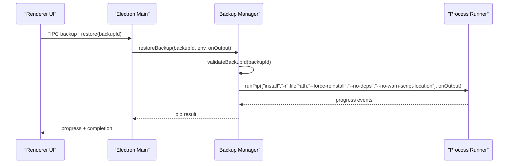
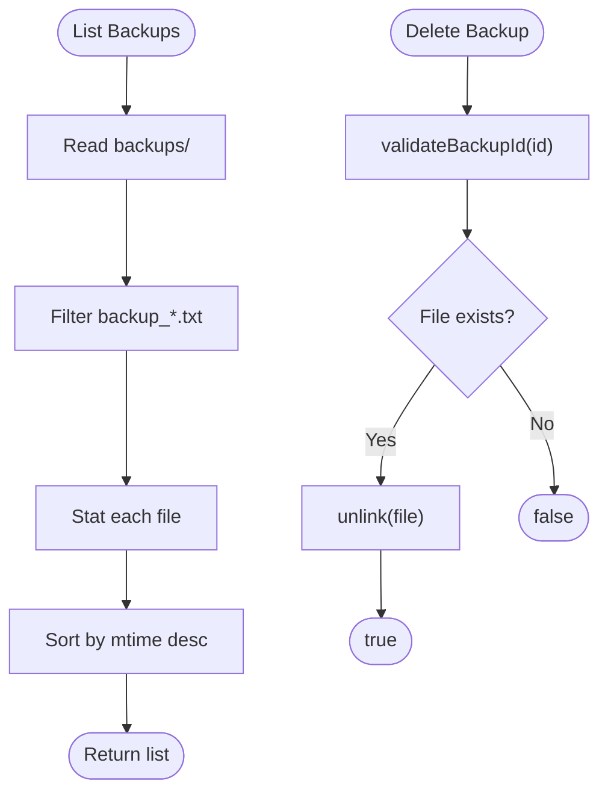
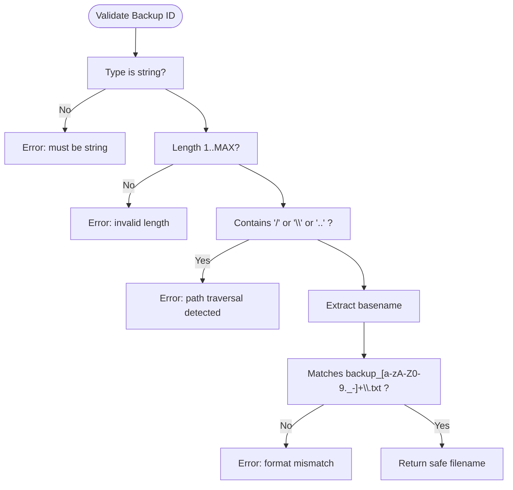
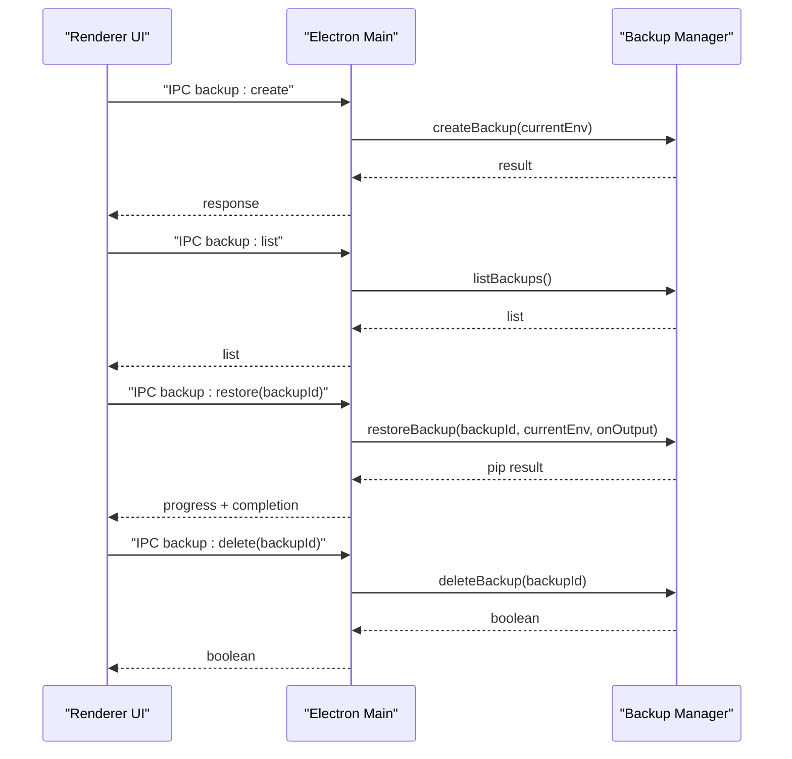
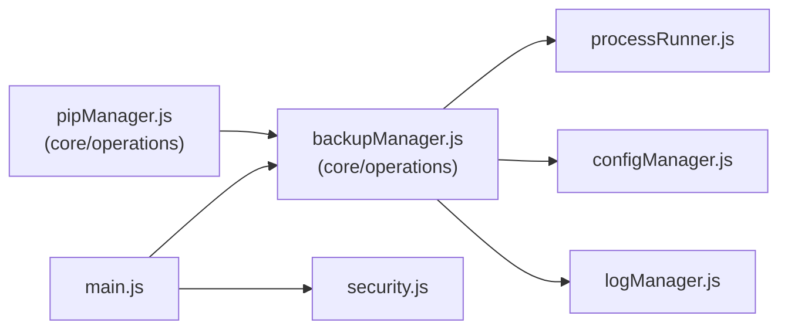

# Backup & Recovery System

<cite>
**Referenced Files in This Document**
- [backupManager.js](file://core/operations/backupManager.js)
- [processRunner.js](file://utils/processRunner.js)
- [security.js](file://utils/security.js)
- [configManager.js](file://core/config/configManager.js)
- [logManager.js](file://core/system/logManager.js)
- [main.js](file://main.js)
- [pipManager.js](file://core/operations/pipManager.js)
</cite>

## Update Summary
**Changes Made**
- Updated file paths to reflect backup manager relocation from `core/backupManager.js` to `core/operations/backupManager.js`
- Updated import statements and module organization references
- Enhanced architecture diagrams to show new operations layer structure
- Updated dependency analysis to reflect new module organization

## Table of Contents
1. [Introduction](#introduction)
2. [Project Structure](#project-structure)
3. [Core Components](#core-components)
4. [Architecture Overview](#architecture-overview)
5. [Detailed Component Analysis](#detailed-component-analysis)
6. [Dependency Analysis](#dependency-analysis)
7. [Performance Considerations](#performance-considerations)
8. [Troubleshooting Guide](#troubleshooting-guide)
9. [Conclusion](#conclusion)
10. [Appendices](#appendices)

## Introduction
This document explains PyLibMaster's backup and recovery system for Python environments. It covers automated backup creation using pip freeze, the backup file format and storage structure, restore operations with force-reinstall capabilities, backup management (list/delete), and security validation against path traversal attacks. Practical workflows and best practices are included to help maintain consistent Python environments across development and production.

**Updated** The backup manager has been reorganized into the operations layer at `core/operations/backupManager.js` as part of the application's modular architecture improvement.

## Project Structure
The backup and recovery functionality is implemented primarily in a dedicated manager module within the operations layer, supported by utilities for process execution, configuration, logging, and security. IPC handlers in the main process expose these capabilities to the UI.

**Diagram sources**
- [backupManager.js:1-196](file://core/operations/backupManager.js#L1-L196)
- [pipManager.js:20-27](file://core/operations/pipManager.js#L20-L27)
- [processRunner.js:1-366](file://utils/processRunner.js#L1-L366)
- [security.js:1-43](file://utils/security.js#L1-L43)
- [configManager.js:1-194](file://core/config/configManager.js#L1-L194)
- [logManager.js:1-176](file://core/system/logManager.js#L1-L176)
- [main.js:17-31](file://main.js#L17-L31)

**Section sources**
- [backupManager.js:1-196](file://core/operations/backupManager.js#L1-L196)
- [main.js:17-31](file://main.js#L17-L31)
- [pipManager.js:20-27](file://core/operations/pipManager.js#L20-L27)

## Core Components
- **Backup Manager**: Located in `core/operations/backupManager.js`, creates backups via pip freeze, lists backups, restores from backups with force-reinstall, deletes backups, and validates backup IDs securely.
- **Process Runner**: Executes pip commands with timeouts, progress callbacks, and cancellation support.
- **Configuration Manager**: Provides storage paths where backups and logs are persisted.
- **Log Manager**: Records backup-related actions and errors.
- **Security Utilities**: Provide path safety checks used elsewhere in the application; backup ID validation is handled within the backup manager.

Key responsibilities:
- Automated backup creation using pip freeze output.
- Deterministic restore using requirements-style files with force-reinstall flags.
- Safe backup ID validation to prevent path traversal.
- Centralized storage under a configured storage directory.
- Integration with pip manager for rollback operations.

**Section sources**
- [backupManager.js:25-113](file://core/operations/backupManager.js#L25-L113)
- [backupManager.js:122-142](file://core/operations/backupManager.js#L122-L142)
- [backupManager.js:156-170](file://core/operations/backupManager.js#L156-L170)
- [backupManager.js:179-193](file://core/operations/backupManager.js#L179-L193)
- [processRunner.js:340-342](file://utils/processRunner.js#L340-L342)
- [configManager.js:185-191](file://core/config/configManager.js#L185-L191)
- [logManager.js:115-134](file://core/system/logManager.js#L115-L134)

## Architecture Overview
The backup and recovery flow integrates the UI (via IPC), the main process, and core modules within the operations layer. The main process exposes IPC handlers that delegate to the backup manager, which uses the process runner to execute pip commands and writes results to the configured storage path.

**Diagram sources**
- [main.js:355-368](file://main.js#L355-L368)
- [backupManager.js:89-113](file://core/operations/backupManager.js#L89-L113)
- [backupManager.js:122-142](file://core/operations/backupManager.js#L122-L142)
- [backupManager.js:156-170](file://core/operations/backupManager.js#L156-L170)
- [pipManager.js:534-572](file://core/operations/pipManager.js#L534-L572)
- [processRunner.js:340-342](file://utils/processRunner.js#L340-L342)

## Detailed Component Analysis

### Backup Creation (pip freeze)
- Generates a deterministic snapshot of installed packages and versions by executing pip freeze.
- Writes the output to a file named backup_{environment}_{timestamp}.txt under the configured storage/backups directory.
- Returns metadata including id, path, creation time, environment name, and environment path.

**Diagram sources**
- [backupManager.js:89-113](file://core/operations/backupManager.js#L89-L113)
- [backupManager.js:46-51](file://core/operations/backupManager.js#L46-L51)
- [processRunner.js:340-342](file://utils/processRunner.js#L340-L342)

**Section sources**
- [backupManager.js:89-113](file://core/operations/backupManager.js#L89-L113)
- [backupManager.js:46-51](file://core/operations/backupManager.js#L46-L51)

### Backup File Format and Storage Structure
- File naming convention: backup_{environment}_{timestamp}.txt
- Timestamp format: ISO-like string with colons and dots replaced by dashes, truncated to seconds precision.
- Environment name derived from the Python environment path basename.
- Storage location: {storagePath}/backups/, created automatically if missing.
- Content: pip freeze output listing package==version lines.

**Diagram sources**
- [backupManager.js:29-34](file://core/operations/backupManager.js#L29-L34)
- [backupManager.js:46-51](file://core/operations/backupManager.js#L46-L51)
- [configManager.js:185-191](file://core/config/configManager.js#L185-L191)

**Section sources**
- [backupManager.js:29-34](file://core/operations/backupManager.js#L29-L34)
- [backupManager.js:46-51](file://core/operations/backupManager.js#L46-L51)
- [configManager.js:185-191](file://core/config/configManager.js#L185-L191)

### Restore Process (Force-Reinstall)
- Validates the backup ID to ensure it refers to a safe, expected filename.
- Reads the backup file and runs pip install -r with flags:
  - --force-reinstall: reinstall specified versions even if already present
  - --no-deps: avoid reinstalling dependencies unless explicitly listed
  - --no-warn-script-location: suppress script location warnings
- Streams progress via callback to the UI.

**Diagram sources**
- [main.js:362-366](file://main.js#L362-L366)
- [backupManager.js:156-170](file://core/operations/backupManager.js#L156-L170)
- [processRunner.js:340-342](file://utils/processRunner.js#L340-L342)

**Section sources**
- [backupManager.js:156-170](file://core/operations/backupManager.js#L156-L170)

### Backup Management (List and Delete)
- List backups:
  - Scans the backups directory for files matching the naming pattern.
  - Returns id, path, creation time, and size, sorted newest first.
- Delete backup:
  - Validates backup ID.
  - Removes the file if it exists; returns success or failure.

**Diagram sources**
- [backupManager.js:122-142](file://core/operations/backupManager.js#L122-L142)
- [backupManager.js:179-193](file://core/operations/backupManager.js#L179-L193)

**Section sources**
- [backupManager.js:122-142](file://core/operations/backupManager.js#L122-L142)
- [backupManager.js:179-193](file://core/operations/backupManager.js#L179-L193)

### Security Validation Against Path Traversal
- Backup ID validation enforces:
  - Type and length constraints.
  - Disallows path separators and parent directory references.
  - Requires filenames to match the backup_*.txt pattern.
  - Uses basename normalization to prevent directory components.
- Additional path safety utility is available for other features to restrict allowed directories.

**Diagram sources**
- [backupManager.js:62-78](file://core/operations/backupManager.js#L62-L78)
- [security.js:28-40](file://utils/security.js#L28-L40)

**Section sources**
- [backupManager.js:62-78](file://core/operations/backupManager.js#L62-L78)
- [security.js:28-40](file://utils/security.js#L28-L40)

### IPC Integration
- The main process registers IPC handlers for backup operations:
  - backup:create: creates a backup for the current environment.
  - backup:list: lists all backups.
  - backup:restore: restores an environment from a backup with progress streaming.
  - backup:delete: deletes a backup by validated ID.

**Diagram sources**
- [main.js:355-368](file://main.js#L355-L368)
- [backupManager.js:89-113](file://core/operations/backupManager.js#L89-L113)
- [backupManager.js:122-142](file://core/operations/backupManager.js#L122-L142)
- [backupManager.js:156-170](file://core/operations/backupManager.js#L156-L170)
- [backupManager.js:179-193](file://core/operations/backupManager.js#L179-L193)

**Section sources**
- [main.js:355-368](file://main.js#L355-L368)

## Dependency Analysis
The backup system depends on several modules within the operations layer:

- Direct dependencies:
  - backupManager.js imports configManager, logManager, and processRunner.
  - pipManager.js imports backupManager for rollback operations.
  - main.js wires IPC handlers to backupManager.
- Indirect dependencies:
  - processRunner handles child processes, timeouts, and pip availability checks.
  - configManager provides storage path resolution and persistence.
  - logManager records backup operation outcomes.

Potential circular dependencies: None observed between backupManager and its dependencies.

External integration points:
- pip executable via processRunner.
- Filesystem for reading/writing backups and logs.

**Diagram sources**
- [backupManager.js:19-24](file://core/operations/backupManager.js#L19-L24)
- [pipManager.js:20-27](file://core/operations/pipManager.js#L20-L27)
- [main.js:17-31](file://main.js#L17-L31)

**Section sources**
- [backupManager.js:19-24](file://core/operations/backupManager.js#L19-L24)
- [pipManager.js:20-27](file://core/operations/pipManager.js#L20-L27)
- [main.js:17-31](file://main.js#L17-L31)

## Performance Considerations
- pip freeze and restore operations can be I/O and network intensive; timeouts are enforced to prevent hanging.
- Progress callbacks stream output to the UI, enabling responsive interfaces during long-running operations.
- Logging uses debounced writes to reduce disk thrash while ensuring data durability on shutdown.
- Backup listing reads only filenames and stats, minimizing overhead.

## Troubleshooting Guide
Common issues and resolutions:
- No Python environment selected:
  - Ensure a valid Python interpreter is set before creating or restoring backups.
- Backup not found:
  - Verify the backup ID matches an existing file in the backups directory.
- Path traversal blocked:
  - Backup IDs must conform to the allowed pattern; avoid any path separators or parent directory references.
- pip not available:
  - The process runner attempts to ensure pip; if it fails, install pip manually in the target environment.
- Restore failures:
  - Review pip output streamed via progress events; check for network issues or package conflicts.

Operational tips:
- Use listBackups to verify available snapshots before restore.
- After restore, refresh the environment state to confirm package versions.
- Keep backups organized by environment and timestamp for easy identification.

**Section sources**
- [backupManager.js:89-113](file://core/operations/backupManager.js#L89-L113)
- [backupManager.js:156-170](file://core/operations/backupManager.js#L156-L170)
- [backupManager.js:62-78](file://core/operations/backupManager.js#L62-L78)
- [processRunner.js:233-278](file://utils/processRunner.js#L233-278)

## Conclusion
PyLibMaster's backup and recovery system provides a robust, secure, and user-friendly way to snapshot and restore Python environments. By leveraging pip freeze for deterministic snapshots and force-reinstall for reliable restoration, it ensures consistency across development and production. Strong input validation protects against path traversal, while centralized storage and logging simplify maintenance and troubleshooting.

**Updated** The system now benefits from improved module organization with the backup manager relocated to the operations layer, providing better separation of concerns and easier maintenance.

## Appendices

### Practical Workflows
- Create a backup:
  - Select the target Python environment.
  - Trigger backup creation; a file named backup_{environment}_{timestamp}.txt is saved under the configured storage/backups directory.
- Restore an environment:
  - Choose a backup file from the list.
  - Initiate restore; pip will reinstall exact versions with force-reinstall and no dependency reinstall unless specified.
- Manage backups:
  - List backups to view timestamps and sizes.
  - Delete outdated backups to free space.

Best practices:
- Create backups before major changes or updates.
- Maintain one backup per environment per release cycle.
- Store backups in a shared or versioned location for team consistency.
- Validate restored environments by checking package versions post-restore.

### Module Organization Changes
**Updated** The backup manager has been reorganized as part of the operations layer restructuring:

- **Previous Location**: `core/backupManager.js`
- **New Location**: `core/operations/backupManager.js`
- **Import Updates**: 
  - `main.js`: Updated to `require('./core/operations/backupManager')`
  - `pipManager.js`: Uses relative import `require('./backupManager')` (works due to same directory)

This reorganization improves code modularity and makes it easier to manage related operational functions together.

[No sources needed since this section provides general guidance]