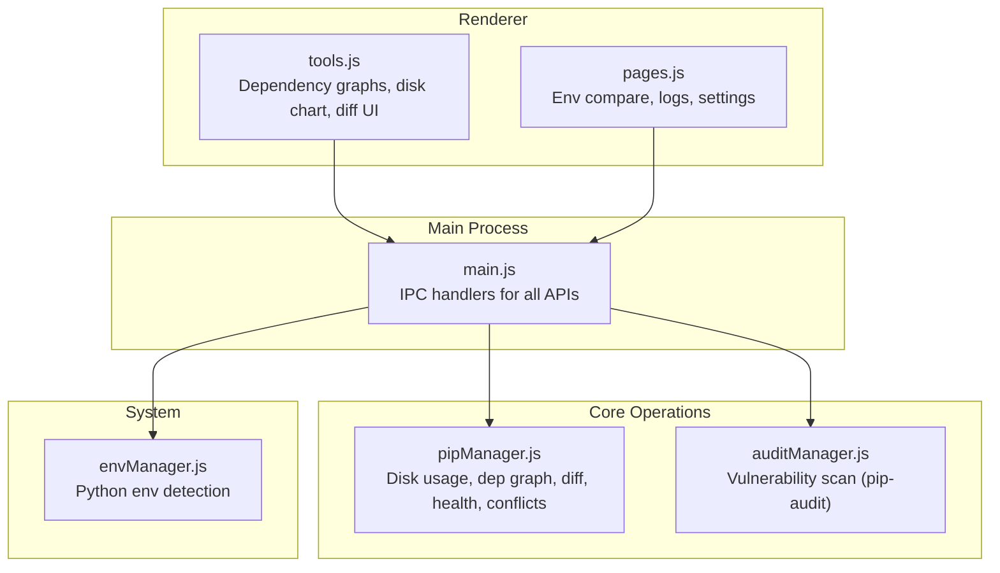
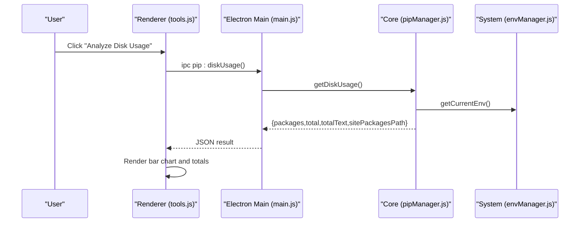
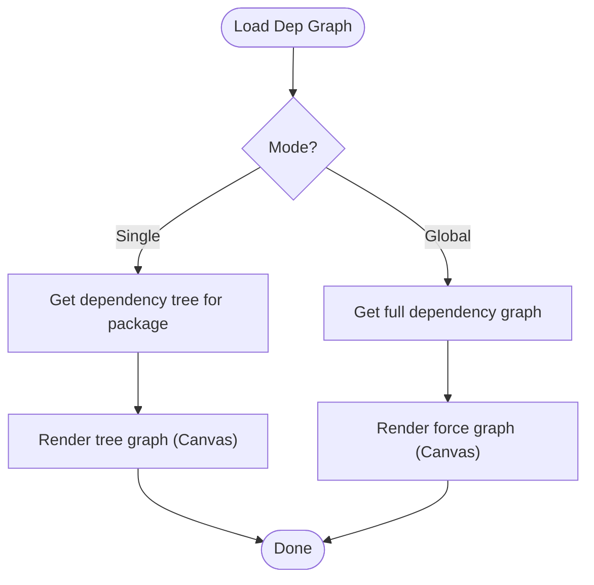
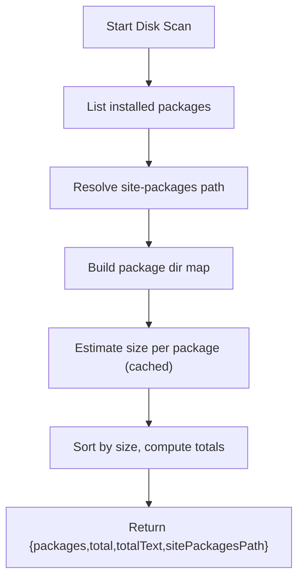
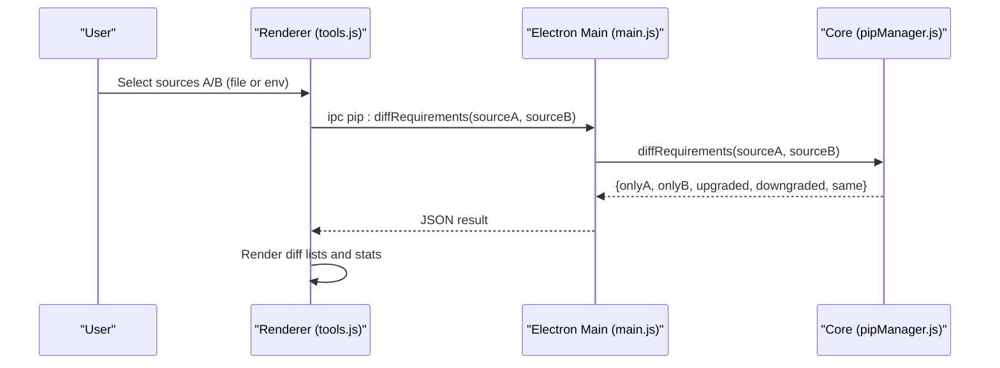
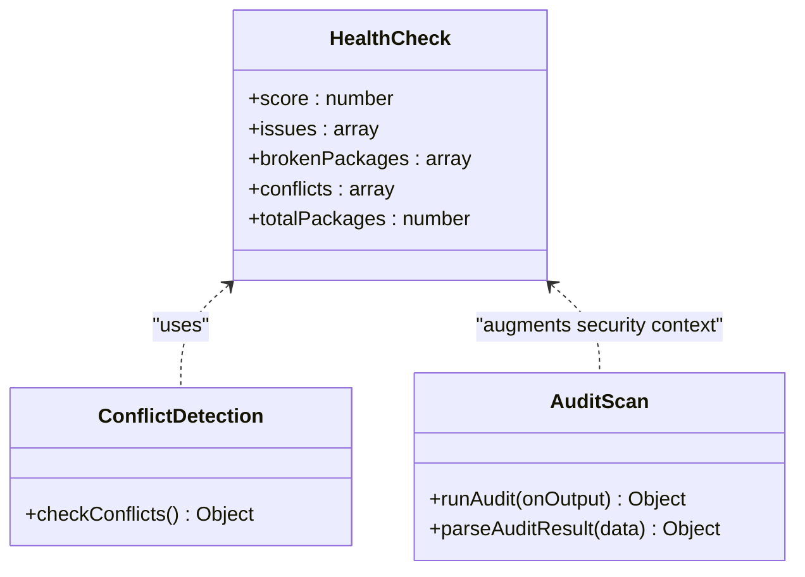
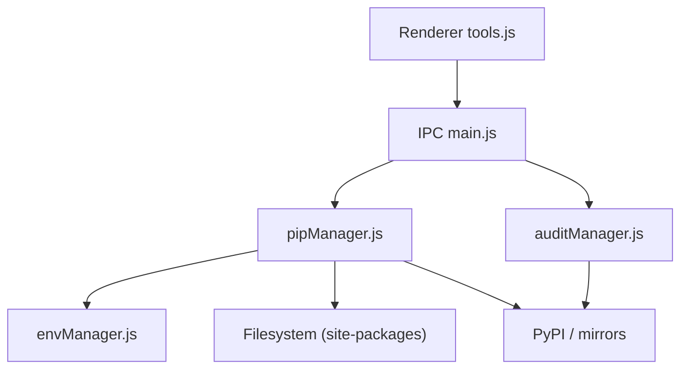

# Data Analysis Tools

<cite>
**Referenced Files in This Document**
- [tools.js](file://renderer/js/tools.js)
- [pipManager.js](file://core/operations/pipManager.js)
- [envManager.js](file://core/system/envManager.js)
- [main.js](file://main.js)
- [auditManager.js](file://core/operations/auditManager.js)
- [pages.js](file://renderer/js/pages.js)
</cite>

## Table of Contents
1. [Introduction](#introduction)
2. [Project Structure](#project-structure)
3. [Core Components](#core-components)
4. [Architecture Overview](#architecture-overview)
5. [Detailed Component Analysis](#detailed-component-analysis)
6. [Dependency Analysis](#dependency-analysis)
7. [Performance Considerations](#performance-considerations)
8. [Troubleshooting Guide](#troubleshooting-guide)
9. [Conclusion](#conclusion)
10. [Appendices](#appendices)

## Introduction
This document explains PyLibMaster’s data analysis and visualization tools, focusing on:
- Disk usage analysis for Python environments
- Environment comparison features (requirements diff and environment diff)
- Statistical reporting capabilities (health checks, conflict detection, audit results)
- Dependency visualization (single-package tree and global force-directed graph)
It also covers how to analyze package relationships, identify unused dependencies, generate performance reports, perform interactive exploration, export results, and integrate with external tools. Practical workflows and interpretation guidance are included.

## Project Structure
The data analysis and visualization features span the renderer (UI), core operations (pip management, auditing), system modules (environment discovery), and the Electron main process (IPC bridges).

**Diagram sources**
- [tools.js:1-795](file://renderer/js/tools.js#L1-L795)
- [pipManager.js:1200-1599](file://core/operations/pipManager.js#L1200-L1599)
- [auditManager.js:1-230](file://core/operations/auditManager.js#L1-L230)
- [envManager.js:1-220](file://core/system/envManager.js#L1-L220)
- [main.js:588-618](file://main.js#L588-L618)

**Section sources**
- [tools.js:1-795](file://renderer/js/tools.js#L1-L795)
- [pipManager.js:1200-1599](file://core/operations/pipManager.js#L1200-L1599)
- [auditManager.js:1-230](file://core/operations/auditManager.js#L1-L230)
- [envManager.js:1-220](file://core/system/envManager.js#L1-L220)
- [main.js:588-618](file://main.js#L588-L618)

## Core Components
- Dependency Graphs: Single-package tree view and global force-directed graph with interactive pan/zoom/hover.
- Disk Usage Analysis: Top packages by size, total usage, site-packages path.
- Requirements Diff: Compare two sources (files or environments) to find only-in-A, only-in-B, upgraded/downgraded, and same.
- Environment Diff: Compare two environments’ installed packages and versions.
- Health Checks & Conflicts: Score-based health report, dependency conflict detection, broken package detection.
- Security Audit: Vulnerability scanning via pip-audit with severity classification and fix suggestions.
- Export Options: Export requirements.txt, logs (CSV/Markdown), and download packages offline.

**Section sources**
- [tools.js:31-103](file://renderer/js/tools.js#L31-L103)
- [tools.js:462-506](file://renderer/js/tools.js#L462-L506)
- [tools.js:508-564](file://renderer/js/tools.js#L508-L564)
- [pipManager.js:1208-1230](file://core/operations/pipManager.js#L1208-L1230)
- [pipManager.js:1291-1338](file://core/operations/pipManager.js#L1291-L1338)
- [pipManager.js:1161-1200](file://core/operations/pipManager.js#L1161-L1200)
- [pipManager.js:1460-1503](file://core/operations/pipManager.js#L1460-L1503)
- [pipManager.js:1510-1584](file://core/operations/pipManager.js#L1510-L1584)
- [auditManager.js:54-119](file://core/operations/auditManager.js#L54-L119)

## Architecture Overview
The renderer initiates user actions which call IPC handlers in the main process. The main process delegates to core modules that interact with pip, filesystem, and network. Results are returned to the renderer for visualization.

**Diagram sources**
- [tools.js:462-506](file://renderer/js/tools.js#L462-L506)
- [main.js:588-592](file://main.js#L588-L592)
- [pipManager.js:1208-1230](file://core/operations/pipManager.js#L1208-L1230)
- [envManager.js:178-184](file://core/system/envManager.js#L178-L184)

## Detailed Component Analysis

### Dependency Visualization
- Single-package tree: Recursively builds a dependency tree up to a depth limit and renders it as a hierarchical Canvas diagram.
- Global graph: Collects nodes and edges from installed packages and renders a force-directed graph with interaction (drag, pan, zoom, hover highlighting).

**Diagram sources**
- [tools.js:70-103](file://renderer/js/tools.js#L70-L103)
- [tools.js:124-210](file://renderer/js/tools.js#L124-L210)
- [tools.js:213-386](file://renderer/js/tools.js#L213-L386)
- [pipManager.js:1063-1095](file://core/operations/pipManager.js#L1063-L1095)
- [pipManager.js:1409-1453](file://core/operations/pipManager.js#L1409-L1453)

Practical tips:
- Use single-package mode to explore direct and transitive dependencies of a specific package.
- Use global mode to see overall interdependencies; hover highlights connected nodes and edges.

**Section sources**
- [tools.js:70-103](file://renderer/js/tools.js#L70-L103)
- [tools.js:124-210](file://renderer/js/tools.js#L124-L210)
- [tools.js:213-386](file://renderer/js/tools.js#L213-L386)
- [pipManager.js:1063-1095](file://core/operations/pipManager.js#L1063-L1095)
- [pipManager.js:1409-1453](file://core/operations/pipManager.js#L1409-L1453)

### Disk Usage Analysis
- Scans installed packages and estimates each package’s size using site-packages directory traversal with caching.
- Displays top packages by size, total usage, and site-packages path.

**Diagram sources**
- [pipManager.js:1208-1230](file://core/operations/pipManager.js#L1208-L1230)
- [pipManager.js:278-389](file://core/operations/pipManager.js#L278-L389)

Interpretation:
- Large packages may indicate heavy dependencies or bundled assets.
- “Others” aggregates smaller packages beyond the top list.

**Section sources**
- [tools.js:462-506](file://renderer/js/tools.js#L462-L506)
- [pipManager.js:1208-1230](file://core/operations/pipManager.js#L1208-L1230)

### Environment Comparison Features
- Requirements diff: Compare two sources (file or environment) to identify differences in versions and presence.
- Environment diff: Compare two environments’ installed packages and versions.

**Diagram sources**
- [tools.js:525-564](file://renderer/js/tools.js#L525-L564)
- [main.js:605-607](file://main.js#L605-L607)
- [pipManager.js:1291-1338](file://core/operations/pipManager.js#L1291-L1338)

Environment diff workflow:
- Renderer calls compareEnvironments with two environment paths.
- Core runs pip list for both, computes only-in-A, only-in-B, different versions, and counts of same.

**Section sources**
- [tools.js:508-564](file://renderer/js/tools.js#L508-L564)
- [pages.js:648-694](file://renderer/js/pages.js#L648-L694)
- [pipManager.js:1161-1200](file://core/operations/pipManager.js#L1161-L1200)

### Statistical Reporting Capabilities
- Conflict detection: Uses pip check to parse and report version conflicts.
- Health check: Aggregates issues (conflicts, broken metadata, site-packages accessibility) into a score and detailed issue list.
- Security audit: Runs pip-audit to detect known vulnerabilities, classifies severity, and suggests fixes.

**Diagram sources**
- [pipManager.js:1460-1503](file://core/operations/pipManager.js#L1460-L1503)
- [pipManager.js:1510-1584](file://core/operations/pipManager.js#L1510-L1584)
- [auditManager.js:54-119](file://core/operations/auditManager.js#L54-L119)

Interpretation:
- Health score near 100 indicates a healthy environment; lower scores highlight areas needing attention.
- Conflicts list shows missing or mismatched dependencies.
- Audit results provide actionable vulnerability details and recommended fix versions.

**Section sources**
- [tools.js:695-733](file://renderer/js/tools.js#L695-L733)
- [tools.js:735-787](file://renderer/js/tools.js#L735-L787)
- [pipManager.js:1460-1503](file://core/operations/pipManager.js#L1460-L1503)
- [pipManager.js:1510-1584](file://core/operations/pipManager.js#L1510-L1584)
- [auditManager.js:54-119](file://core/operations/auditManager.js#L54-L119)

### Analyzing Package Relationships and Identifying Unused Dependencies
- Relationship analysis:
  - Use the dependency tree for a package to understand direct and transitive dependencies.
  - Use the global graph to visualize cross-dependencies across the environment.
- Identifying unused dependencies:
  - Compare your project’s requirements file with the current environment to find packages present in the environment but not declared in requirements (only-in-environment).
  - Cross-check with the dependency graph to see if a package is referenced by any other installed package.

Practical workflow:
- Export current environment to requirements.txt.
- Compare with your project’s requirements file to find discrepancies.
- Inspect the dependency graph to confirm whether “unused” packages are actually required by others.

**Section sources**
- [pipManager.js:1098-1118](file://core/operations/pipManager.js#L1098-L1118)
- [pipManager.js:1291-1338](file://core/operations/pipManager.js#L1291-L1338)
- [tools.js:525-564](file://renderer/js/tools.js#L525-L564)
- [tools.js:70-103](file://renderer/js/tools.js#L70-L103)

### Generating Performance Reports
- Health check provides a comprehensive diagnostic report including package count, conflicts, broken packages, and an overall score.
- Disk usage report helps identify large packages contributing to environment size.
- Audit results add security performance insights (vulnerability counts and severities).

How to use:
- Run health check to get a score and issue list.
- Review disk usage to optimize environment size.
- Run audit to address critical/high vulnerabilities.

**Section sources**
- [tools.js:735-787](file://renderer/js/tools.js#L735-L787)
- [pipManager.js:1510-1584](file://core/operations/pipManager.js#L1510-L1584)
- [tools.js:462-506](file://renderer/js/tools.js#L462-L506)
- [auditManager.js:54-119](file://core/operations/auditManager.js#L54-L119)

### Interactive Dependency Exploration
- Canvas interactions:
  - Zoom via mouse wheel.
  - Pan by dragging empty space.
  - Drag nodes to rearrange.
  - Hover to highlight connections and show tooltips.
  - Double-click to reset view.

These interactions are implemented in the renderer’s event handlers and update the graph state accordingly.

**Section sources**
- [tools.js:389-460](file://renderer/js/tools.js#L389-L460)
- [tools.js:213-386](file://renderer/js/tools.js#L213-L386)

### Export Options for Analysis Results
- Export requirements.txt from the current environment.
- Export logs as CSV or Markdown files.
- Download packages offline to a specified directory.

Export flows:
- Requirements export writes freeze output to a file or returns content.
- Log export generates CSV/Markdown and prompts for save location.
- Offline download uses pip download with optional flags (no-deps, platform, python-version).

**Section sources**
- [pipManager.js:1098-1118](file://core/operations/pipManager.js#L1098-L1118)
- [main.js:485-514](file://main.js#L485-L514)
- [pipManager.js:1242-1281](file://core/operations/pipManager.js#L1242-L1281)

### Integration with External Analysis Tools
- pip-audit integration: Automatically installs and runs pip-audit to produce structured vulnerability reports.
- pip commands: Leverages pip list, show, check, freeze, and download for consistent data collection.
- File-based inputs: Supports requirements.txt parsing for comparisons and imports.

Integration points:
- Audit manager ensures pip-audit availability and parses JSON outputs.
- Pip manager orchestrates pip commands and caches results where appropriate.

**Section sources**
- [auditManager.js:31-47](file://core/operations/auditManager.js#L31-L47)
- [auditManager.js:54-119](file://core/operations/auditManager.js#L54-L119)
- [pipManager.js:1291-1338](file://core/operations/pipManager.js#L1291-L1338)

## Dependency Analysis
The following diagram maps key dependencies between components involved in data analysis and visualization.

**Diagram sources**
- [tools.js:70-103](file://renderer/js/tools.js#L70-L103)
- [main.js:588-618](file://main.js#L588-L618)
- [pipManager.js:1208-1230](file://core/operations/pipManager.js#L1208-L1230)
- [auditManager.js:54-119](file://core/operations/auditManager.js#L54-L119)
- [envManager.js:178-184](file://core/system/envManager.js#L178-L184)

Coupling and cohesion:
- Renderer focuses on UI interactions and rendering; low coupling to core logic.
- Core modules encapsulate pip operations, filesystem access, and network requests; cohesive responsibilities.
- IPC layer centralizes communication, reducing direct coupling between renderer and core.

Potential circular dependencies:
- None observed; dependencies flow from renderer to main to core.

External dependencies:
- pip (list, show, check, freeze, download)
- pip-audit (optional, auto-installed)
- PyPI JSON API (for release history)

**Section sources**
- [tools.js:70-103](file://renderer/js/tools.js#L70-L103)
- [main.js:588-618](file://main.js#L588-L618)
- [pipManager.js:1208-1230](file://core/operations/pipManager.js#L1208-L1230)
- [auditManager.js:54-119](file://core/operations/auditManager.js#L54-L119)

## Performance Considerations
- Caching:
  - Installed package cache with TTL reduces repeated scans.
  - site-packages path cache avoids repeated resolution.
  - Dependency graph cache limits recomputation frequency.
- Limits:
  - Global graph limits node count to avoid overload.
  - Dependency tree depth limited to prevent deep recursion.
- Parallelism:
  - Parallel task execution for install/update operations improves throughput.
- I/O optimization:
  - Folder size calculation uses caching and skips symbolic links.

Recommendations:
- Prefer cached endpoints when available.
- Limit scope of global graph scans for large environments.
- Use parallel options judiciously based on system resources.

**Section sources**
- [pipManager.js:89-127](file://core/operations/pipManager.js#L89-L127)
- [pipManager.js:244-266](file://core/operations/pipManager.js#L244-L266)
- [pipManager.js:1400-1453](file://core/operations/pipManager.js#L1400-L1453)
- [pipManager.js:930-942](file://core/operations/pipManager.js#L930-L942)
- [pipManager.js:314-332](file://core/operations/pipManager.js#L314-L332)

## Troubleshooting Guide
Common issues and resolutions:
- No Python environment selected:
  - Ensure an environment is detected and active.
- pip not available:
  - Repair pip using built-in repair functionality.
- Dependency conflicts:
  - Review conflict list and resolve missing or mismatched versions.
- Disk usage scan fails:
  - Verify site-packages path accessibility and permissions.
- Audit scan errors:
  - Ensure pip-audit installation succeeds; retry with manual installation if needed.

Where to look:
- Error messages are surfaced via toast notifications and log entries.
- Health check and conflict detection provide structured diagnostics.

**Section sources**
- [tools.js:462-506](file://renderer/js/tools.js#L462-L506)
- [tools.js:695-733](file://renderer/js/tools.js#L695-L733)
- [tools.js:735-787](file://renderer/js/tools.js#L735-L787)
- [pipManager.js:968-1014](file://core/operations/pipManager.js#L968-L1014)
- [auditManager.js:54-119](file://core/operations/auditManager.js#L54-L119)

## Conclusion
PyLibMaster’s data analysis and visualization tools provide a comprehensive suite for understanding Python environments:
- Visualize dependencies interactively to grasp package relationships.
- Analyze disk usage to optimize environment size.
- Compare environments and requirements to identify discrepancies and unused packages.
- Generate statistical reports through health checks, conflict detection, and security audits.
- Export results and integrate with external tools like pip-audit for deeper insights.

These capabilities enable efficient maintenance, troubleshooting, and optimization of Python environments.

## Appendices

### Practical Workflows
- Analyze disk usage:
  - Open Tools > Disk Usage, click scan, review top packages and totals.
- Explore dependencies:
  - Choose single-package mode, enter package name, inspect tree.
  - Switch to global mode to see overall graph; use hover and zoom.
- Compare environments:
  - In Tools > Environment Comparison, select sources (file or env), run diff, interpret only-in-A/B and version changes.
- Generate health report:
  - Run health check, review score and issues, address high-severity items first.
- Audit vulnerabilities:
  - Run audit, review severity distribution, apply suggested fixes.

### Interpretation Guidance
- High disk usage packages: Investigate if they are necessary or can be replaced with lighter alternatives.
- Only-in-environment packages: Likely unused by your project; consider removing if not needed.
- Conflicts: Resolve missing or mismatched dependencies to ensure stability.
- Low health score: Prioritize fixing broken packages and conflicts; re-run health check after remediation.

[No sources needed since this section summarizes without analyzing specific files]