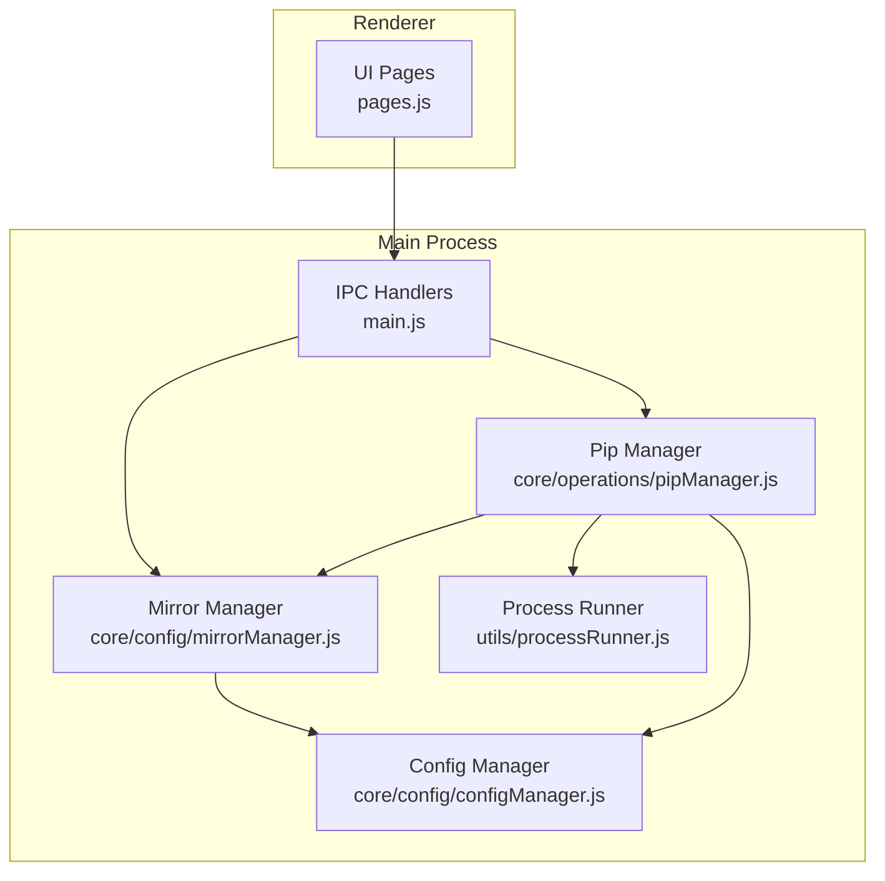
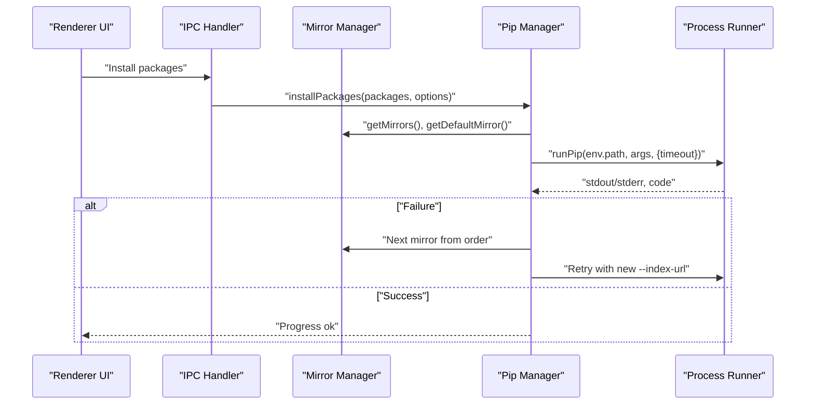
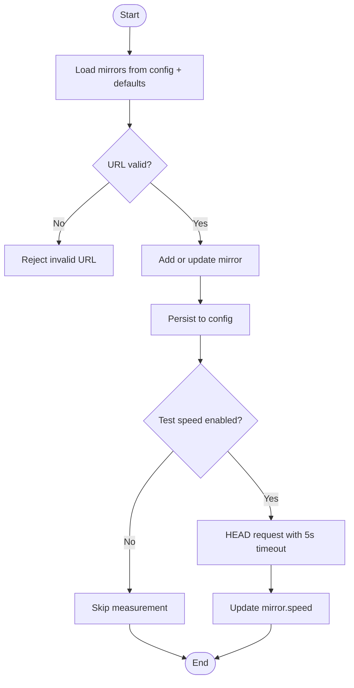
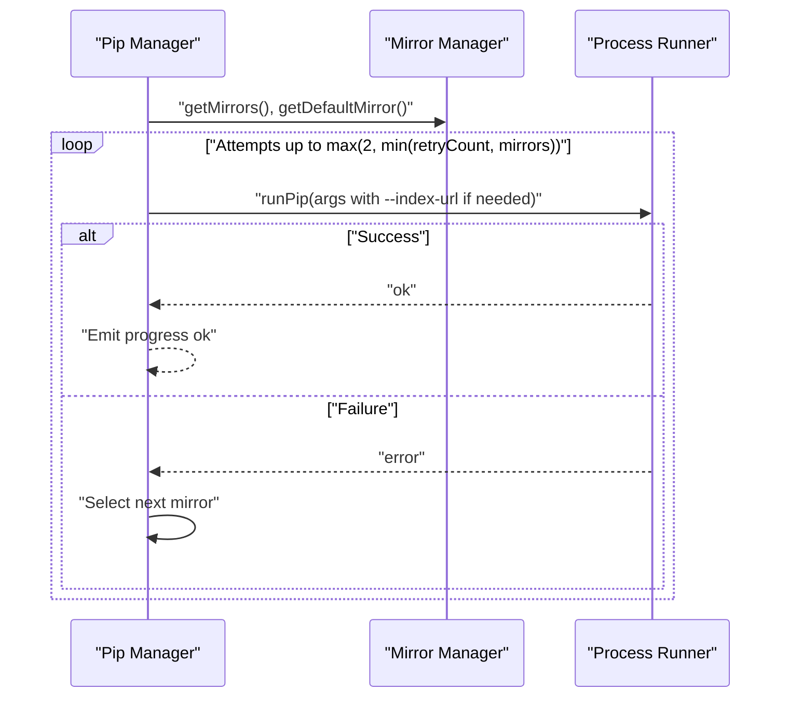
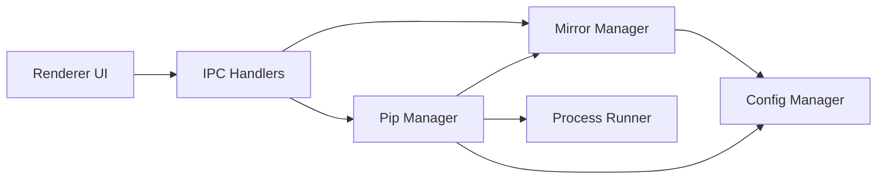

# Mirror Source Management

<cite>
**Referenced Files in This Document**
- [mirrorManager.js](file://core/config/mirrorManager.js)
- [configManager.js](file://core/config/configManager.js)
- [pipManager.js](file://core/operations/pipManager.js)
- [processRunner.js](file://utils/processRunner.js)
- [main.js](file://main.js)
- [preload.js](file://preload.js)
- [pages.js](file://renderer/js/pages.js)
</cite>

## Update Summary
**Changes Made**
- Updated file path references from `core/mirrorManager.js` to `core/config/mirrorManager.js` throughout the document
- Updated import statements and module references to reflect the new configuration layer structure
- Maintained all functional descriptions while correcting file locations

## Table of Contents
1. [Introduction](#introduction)
2. [Project Structure](#project-structure)
3. [Core Components](#core-components)
4. [Architecture Overview](#architecture-overview)
5. [Detailed Component Analysis](#detailed-component-analysis)
6. [Dependency Analysis](#dependency-analysis)
7. [Performance Considerations](#performance-considerations)
8. [Troubleshooting Guide](#troubleshooting-guide)
9. [Conclusion](#conclusion)
10. [Appendices](#appendices)

## Introduction
This document explains PyLibMaster's mirror source optimization system. It covers how the application manages multiple download mirrors, performs automatic speed testing, selects routes intelligently, and handles failover during package installation. It also documents built-in mirror configurations, how to add custom mirrors, procedures for testing mirrors, and strategies to optimize performance. Network timeout handling, retry logic, and guidance for configuring region-specific mirrors are included. While geographic proximity-based selection is not implemented directly, you can achieve similar outcomes by ordering mirrors based on your region or using smart routing with measured speeds.

## Project Structure
The mirror system spans configuration, operations, and process execution layers:
- Configuration layer stores mirror lists, smart routing flags, and persists settings.
- Operations layer integrates mirrors into pip workflows (install/update/uninstall).
- Process runner provides robust subprocess execution with timeouts, cancellation, and pip bootstrapping.
- IPC bridges connect renderer UI to core modules.

**Diagram sources**
- [main.js:370-395](file://main.js#L370-L395)
- [mirrorManager.js:1-30](file://core/config/mirrorManager.js#L1-L30)
- [configManager.js:1-20](file://core/config/configManager.js#L1-L20)
- [pipManager.js:1-28](file://core/operations/pipManager.js#L1-L28)
- [processRunner.js:1-20](file://utils/processRunner.js#L1-L20)

**Section sources**
- [main.js:370-395](file://main.js#L370-L395)
- [mirrorManager.js:1-30](file://core/config/mirrorManager.js#L1-L30)
- [configManager.js:1-20](file://core/config/configManager.js#L1-L20)
- [pipManager.js:1-28](file://core/operations/pipManager.js#L1-L28)
- [processRunner.js:1-20](file://utils/processRunner.js#L1-L20)

## Core Components
- Mirror Manager: Manages built-in and custom mirrors, validates URLs, measures speed, selects best mirror, writes pip config, and builds CLI args.
- Config Manager: Persists application settings including smart routing flag and mirror list; sanitizes numeric values and ensures safe defaults.
- Pip Manager: Integrates mirrors into install/update flows, implements multi-mirror retry, and coordinates backups and rollback.
- Process Runner: Executes pip commands with timeouts, cancellation, and auto-installation of pip when missing.

Key responsibilities and interactions:
- Mirror Manager exposes APIs for listing, adding, updating, removing, reordering, testing, and selecting mirrors.
- Pip Manager uses default and ordered mirrors to attempt installations with retries across mirrors.
- Config Manager centralizes persistent settings like smartRoute and parallelThreads.
- Process Runner ensures reliable command execution and environment readiness.

**Section sources**
- [mirrorManager.js:21-29](file://core/config/mirrorManager.js#L21-L29)
- [mirrorManager.js:60-91](file://core/config/mirrorManager.js#L60-L91)
- [mirrorManager.js:219-247](file://core/config/mirrorManager.js#L219-L247)
- [mirrorManager.js:267-290](file://core/config/mirrorManager.js#L267-L290)
- [mirrorManager.js:299-322](file://core/config/mirrorManager.js#L299-L322)
- [configManager.js:21-29](file://core/config/configManager.js#L21-L29)
- [configManager.js:80-117](file://core/config/configManager.js#L80-L117)
- [pipManager.js:513-596](file://core/operations/pipManager.js#L513-L596)
- [pipManager.js:608-633](file://core/operations/pipManager.js#L608-L633)
- [processRunner.js:85-161](file://utils/processRunner.js#L85-L161)

## Architecture Overview
The mirror system follows a layered architecture:
- Renderer triggers actions via IPC.
- Main process handlers delegate to Mirror Manager and Pip Manager.
- Pip Manager orchestrates installs with multi-mirror retry and backup/rollback.
- Process Runner executes pip with robust timeout and cancellation.

**Diagram sources**
- [main.js:370-395](file://main.js#L370-L395)
- [pipManager.js:513-596](file://core/operations/pipManager.js#L513-L596)
- [pipManager.js:608-633](file://core/operations/pipManager.js#L608-L633)
- [processRunner.js:340-342](file://utils/processRunner.js#L340-L342)

## Detailed Component Analysis

### Mirror Manager
Responsibilities:
- Maintain built-in mirrors and user-defined mirrors.
- Validate mirror URLs (http/https only).
- Measure mirror speed using HEAD requests with a 5-second timeout.
- Provide smart routing to pick the fastest mirror based on cached or live tests.
- Write global pip configuration file with index-url and timeout.
- Build pip arguments for non-official mirrors.

Key behaviors:
- Built-in mirrors include official PyPI and several regional providers.
- Smart routing toggles between user-selected default and fastest mirror.
- Speed test returns 9999ms for failures; batch tests update each mirror's speed.
- Reordering allows prioritizing mirrors by drag-and-drop.

**Diagram sources**
- [mirrorManager.js:43-51](file://core/config/mirrorManager.js#L43-L51)
- [mirrorManager.js:60-91](file://core/config/mirrorManager.js#L60-L91)
- [mirrorManager.js:219-233](file://core/config/mirrorManager.js#L219-L233)
- [mirrorManager.js:240-247](file://core/config/mirrorManager.js#L240-L247)

**Section sources**
- [mirrorManager.js:21-29](file://core/config/mirrorManager.js#L21-L29)
- [mirrorManager.js:43-51](file://core/config/mirrorManager.js#L43-L51)
- [mirrorManager.js:60-91](file://core/config/mirrorManager.js#L60-L91)
- [mirrorManager.js:219-247](file://core/config/mirrorManager.js#L219-L247)
- [mirrorManager.js:267-290](file://core/config/mirrorManager.js#L267-L290)
- [mirrorManager.js:299-322](file://core/config/mirrorManager.js#L299-L322)
- [mirrorManager.js:329-333](file://core/config/mirrorManager.js#L329-L333)
- [mirrorManager.js:340-357](file://core/config/mirrorManager.js#L340-L357)

### Config Manager
Responsibilities:
- Persist application settings (theme, language, storage path, parallel threads, retry count, smart route).
- Sanitize numeric values within defined ranges.
- Ensure atomic writes to avoid corruption.

Relevance to mirror system:
- Stores smartRoute flag and mirror list.
- Provides default retryCount used by Pip Manager for multi-mirror retries.

**Section sources**
- [configManager.js:21-29](file://core/config/configManager.js#L21-L29)
- [configManager.js:80-117](file://core/config/configManager.js#L80-L117)
- [configManager.js:123-138](file://core/config/configManager.js#L123-L138)
- [configManager.js:157-178](file://core/config/configManager.js#L157-L178)

### Pip Manager
Responsibilities:
- Orchestrate package install/update/uninstall with safety checks and progress reporting.
- Integrate mirrors into pip commands via --index-url.
- Implement multi-mirror retry strategy using configured mirror order and retryCount.
- Create backups and perform rollback on failure.

Mirror integration details:
- Builds mirror order starting with default mirror followed by others.
- Limits attempts to max(2, min(retryCount, mirrorOrder.length)).
- Adds --index-url for non-official mirrors.
- Uses runPip with long timeouts suitable for large downloads.

**Diagram sources**
- [pipManager.js:513-596](file://core/operations/pipManager.js#L513-L596)
- [pipManager.js:608-633](file://core/operations/pipManager.js#L608-L633)
- [processRunner.js:340-342](file://utils/processRunner.js#L340-L342)

**Section sources**
- [pipManager.js:513-596](file://core/operations/pipManager.js#L513-L596)
- [pipManager.js:608-633](file://core/operations/pipManager.js#L608-L633)

### Process Runner
Responsibilities:
- Execute commands with UTF-8 encoding, ANSI stripping, and real-time output.
- Manage timeouts with SIGTERM then SIGKILL after delay.
- Track active processes and support cancellation by operationId.
- Auto-detect and install pip if missing.

Relevance to mirror system:
- Ensures pip commands respect timeouts and can be cancelled.
- Provides fallback mechanisms for pip availability.

**Section sources**
- [processRunner.js:85-161](file://utils/processRunner.js#L85-L161)
- [processRunner.js:233-278](file://utils/processRunner.js#L233-L278)
- [processRunner.js:340-342](file://utils/processRunner.js#L340-L342)

### IPC Bridge
Responsibilities:
- Expose mirror management functions to the renderer via IPC.
- Handle mirror:test, mirror:testAll, mirror:setDefault, mirror:addCustom, mirror:update, mirror:removeCustom, mirror:restoreDefaults, mirror:smartRoute, mirror:getSmartRoute, mirror:writePipConfig, mirror:reorder.

**Section sources**
- [main.js:370-395](file://main.js#L370-L395)
- [preload.js:76-85](file://preload.js#L76-L85)

## Dependency Analysis
Component relationships:
- Mirror Manager depends on Config Manager for persistence and on Process Runner indirectly through Pip Manager.
- Pip Manager depends on Mirror Manager for mirror metadata and on Process Runner for executing pip.
- Config Manager is independent but used by both Mirror Manager and Pip Manager.
- IPC handlers in main.js bridge UI calls to Mirror Manager and Pip Manager.

**Diagram sources**
- [main.js:370-395](file://main.js#L370-L395)
- [mirrorManager.js:1-30](file://core/config/mirrorManager.js#L1-L30)
- [pipManager.js:1-28](file://core/operations/pipManager.js#L1-L28)
- [processRunner.js:1-20](file://utils/processRunner.js#L1-L20)
- [configManager.js:1-20](file://core/config/configManager.js#L1-L20)

**Section sources**
- [main.js:370-395](file://main.js#L370-L395)
- [mirrorManager.js:1-30](file://core/config/mirrorManager.js#L1-L30)
- [pipManager.js:1-28](file://core/operations/pipManager.js#L1-L28)
- [processRunner.js:1-20](file://utils/processRunner.js#L1-L20)
- [configManager.js:1-20](file://core/config/configManager.js#L1-L20)

## Performance Considerations
- Parallelism: Configure parallelThreads to control concurrent installs; higher values may improve throughput but increase resource usage.
- Retry strategy: Use retryCount to balance resilience and latency; too high increases total time.
- Speed testing: Batch test mirrors periodically to keep speed metrics fresh; avoid frequent tests during heavy operations.
- Timeout tuning: Global pip config sets a reasonable timeout; ensure network conditions allow successful HEAD requests.
- Caching: Site-packages path and pip readiness are cached to reduce overhead.

[No sources needed since this section provides general guidance]

## Troubleshooting Guide
Common issues and resolutions:
- Slow downloads: Run mirror speed tests and reorder mirrors to prioritize faster ones; enable smart routing to automatically select the fastest mirror.
- Timeouts: Increase pip timeout in global config; verify network connectivity and firewall rules; ensure HEAD requests succeed for speed tests.
- Failures on all mirrors: Check mirror URLs validity; remove broken mirrors; restore defaults to reset to known-good mirrors.
- Pip not available: Use repair pip feature to bootstrap pip via ensurepip or get-pip.py fallback.
- Rollback behavior: If rollback is enabled, failed installs will restore previous state; check logs for rollback details.

Operational tips:
- Use mirror:testAll to measure all mirrors and identify the fastest.
- Toggle smartRoute to let the system choose the best mirror dynamically.
- Write pip config to apply selected mirror globally for other tools.

**Section sources**
- [mirrorManager.js:219-247](file://core/config/mirrorManager.js#L219-L247)
- [mirrorManager.js:267-290](file://core/config/mirrorManager.js#L267-L290)
- [mirrorManager.js:299-322](file://core/config/mirrorManager.js#L299-L322)
- [pipManager.js:513-596](file://core/operations/pipManager.js#L513-L596)
- [processRunner.js:233-278](file://utils/processRunner.js#L233-L278)

## Conclusion
PyLibMaster's mirror source optimization system provides robust management of multiple mirrors, intelligent route selection, and resilient installation workflows. By combining speed testing, configurable retries, and pip configuration writing, it ensures fast and reliable package management across diverse network environments. Users can tailor mirror priorities per region and leverage smart routing for dynamic optimization.

[No sources needed since this section summarizes without analyzing specific files]

## Appendices

### Built-in Mirror Configurations
- Official PyPI and several regional mirrors are provided out-of-the-box.
- You can rename, remark, or set any mirror as default.

**Section sources**
- [mirrorManager.js:21-29](file://core/config/mirrorManager.js#L21-L29)

### Adding Custom Mirrors
- Add a custom mirror with name, URL, and optional remark.
- URLs must be http/https and unique; duplicates are rejected.

**Section sources**
- [mirrorManager.js:139-150](file://core/config/mirrorManager.js#L139-L150)

### Mirror Testing Procedures
- Test individual mirror speed with a HEAD request and 5-second timeout.
- Test all mirrors concurrently to update speed metrics and identify the fastest.

**Section sources**
- [mirrorManager.js:219-247](file://core/config/mirrorManager.js#L219-L247)

### Intelligent Route Selection
- Enable smart routing to automatically select the fastest mirror based on measured speeds.
- When disabled, the user-selected default mirror is used.

**Section sources**
- [mirrorManager.js:250-260](file://core/config/mirrorManager.js#L250-260)
- [mirrorManager.js:284-290](file://core/config/mirrorManager.js#L284-290)

### Failover Mechanisms
- Pip Manager tries multiple mirrors in order, limited by retryCount and mirror list length.
- Each attempt adds --index-url for non-official mirrors.

**Section sources**
- [pipManager.js:608-633](file://core/operations/pipManager.js#L608-L633)

### Network Timeout Handling
- Process Runner enforces timeouts with graceful termination (SIGTERM then SIGKILL).
- Speed tests use a 5-second timeout; pip commands use longer timeouts for downloads.

**Section sources**
- [processRunner.js:85-161](file://utils/processRunner.js#L85-L161)
- [mirrorManager.js:219-233](file://core/config/mirrorManager.js#L219-L233)

### Geographic Proximity-Based Mirror Selection
- Not implemented natively; achieve similar results by ordering mirrors based on your region or enabling smart routing with measured speeds.

[No sources needed since this section provides general guidance]

### Examples of Configuring Mirrors for Different Regions
- Add regional mirrors (e.g., Tsinghua, Aliyun, Tencent, Huawei, Douban) and set them as default or reorder to prioritize local mirrors.
- Use mirror:testAll to validate which mirrors perform best in your region.

**Section sources**
- [mirrorManager.js:21-29](file://core/config/mirrorManager.js#L21-L29)
- [mirrorManager.js:240-247](file://core/config/mirrorManager.js#L240-L247)

### Optimizing Package Installation Performance
- Increase parallelThreads for concurrent installs.
- Enable smart routing to automatically pick the fastest mirror.
- Keep mirror speed metrics updated via periodic speed tests.
- Ensure pip is available and properly configured.

**Section sources**
- [configManager.js:21-29](file://core/config/configManager.js#L21-L29)
- [mirrorManager.js:250-260](file://core/config/mirrorManager.js#L250-260)
- [processRunner.js:233-278](file://utils/processRunner.js#L233-L278)