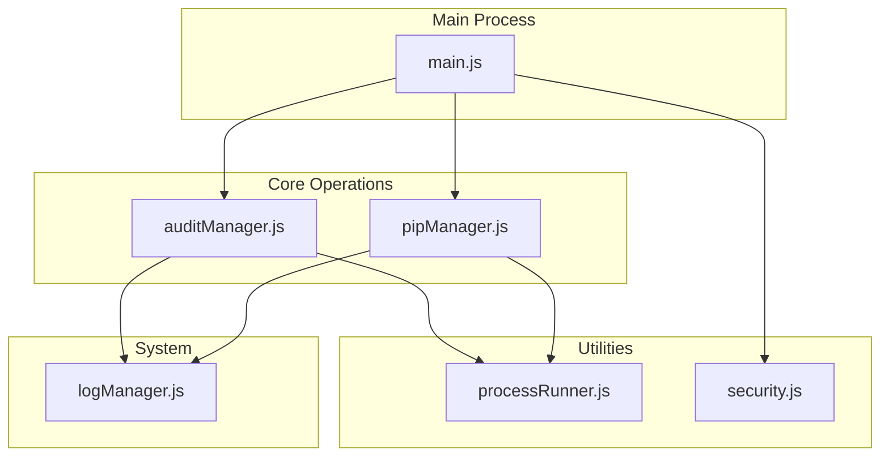
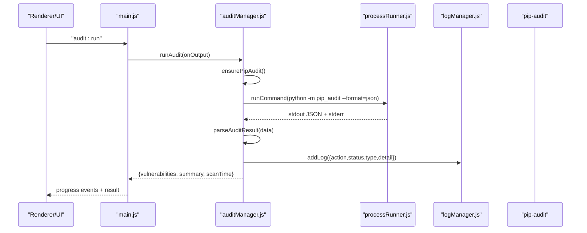
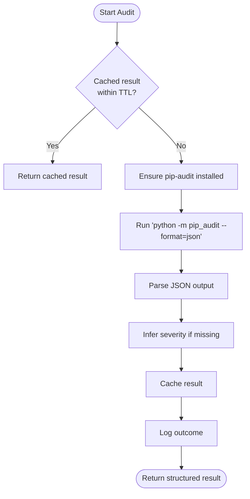
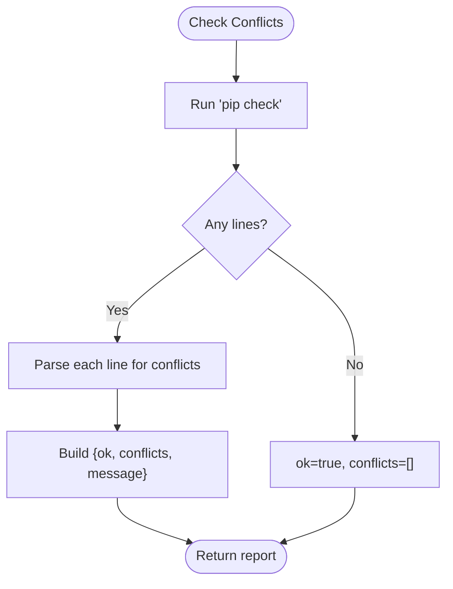
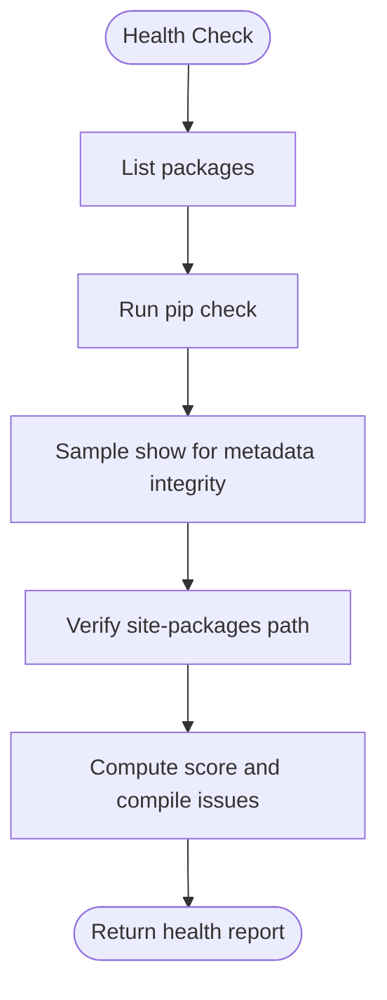
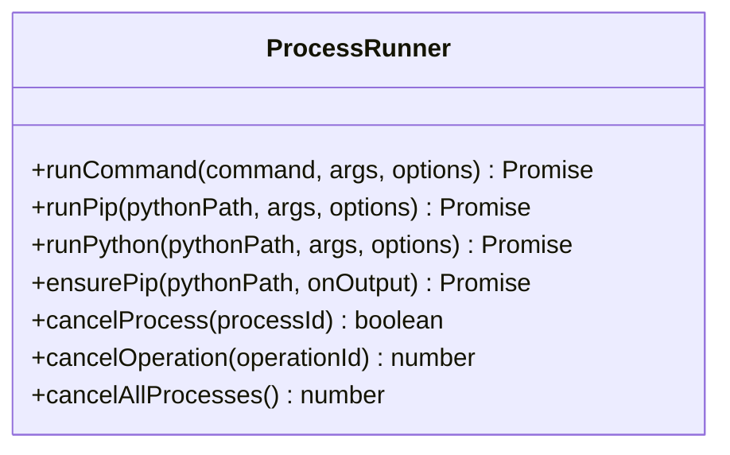
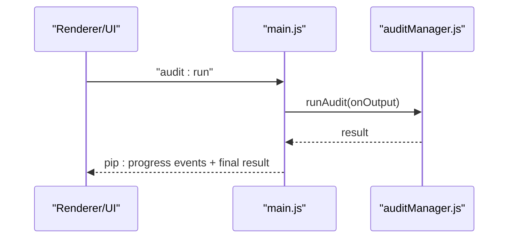
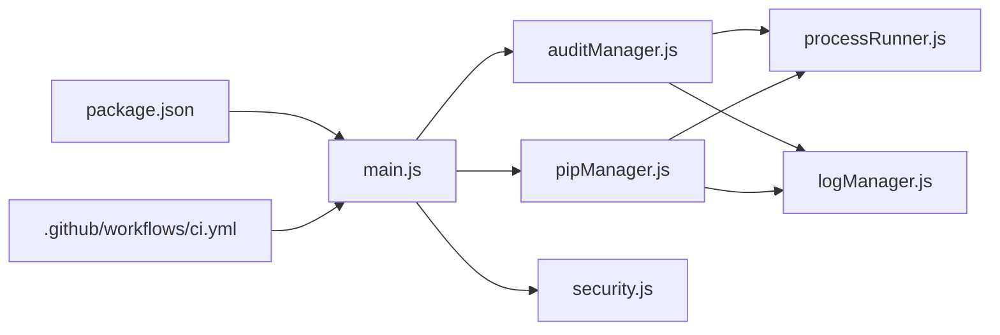

# Security & Auditing

<cite>
**Referenced Files in This Document**
- [auditManager.js](file://core/operations/auditManager.js)
- [pipManager.js](file://core/operations/pipManager.js)
- [processRunner.js](file://utils/processRunner.js)
- [security.js](file://utils/security.js)
- [logManager.js](file://core/system/logManager.js)
- [main.js](file://main.js)
- [package.json](file://package.json)
- [ci.yml](file://.github/workflows/ci.yml)
</cite>

## Table of Contents
1. Introduction
2. Project Structure
3. Core Components
4. Architecture Overview
5. Detailed Component Analysis
6. Dependency Analysis
7. Performance Considerations
8. Troubleshooting Guide
9. Conclusion
10. Appendices

## Introduction
This document explains PyLibMaster’s security auditing and vulnerability scanning capabilities, including CVE detection via pip-audit, dependency conflict analysis, and environment health monitoring. It covers the end-to-end audit workflow, output formats, integration with external security databases, best practices, recommended scanning schedules, remediation guidance, example reports, metrics interpretation, and CI/CD integration patterns for automated security checks.

## Project Structure
Security-related functionality is implemented across core modules and utilities:
- Audit orchestration and parsing live in a dedicated manager module.
- Dependency conflict analysis and health checks are provided by the package manager module.
- Process execution, timeouts, and cancellation are handled by a process runner utility.
- Path safety validation is provided by a security utility.
- Logging persists audit outcomes and operational events.
- The main process exposes IPC handlers to trigger audits from the UI or automation layers.
- Packaging metadata and CI configuration support build-time and pipeline usage.

**Diagram sources**
- [main.js](file://main.js)
- [auditManager.js](file://core/operations/auditManager.js)
- [pipManager.js](file://core/operations/pipManager.js)
- [processRunner.js](file://utils/processRunner.js)
- [security.js](file://utils/security.js)
- [logManager.js](file://core/system/logManager.js)

**Section sources**
- [main.js](file://main.js)
- [auditManager.js](file://core/operations/auditManager.js)
- [pipManager.js](file://core/operations/pipManager.js)
- [processRunner.js](file://utils/processRunner.js)
- [security.js](file://utils/security.js)
- [logManager.js](file://core/system/logManager.js)

## Core Components
- Vulnerability scanner (CVE detection): Uses pip-audit to scan installed packages against the PyPI Advisory Database, parses JSON results, infers severity, and returns structured findings with fix recommendations.
- Dependency conflict analyzer: Runs pip check to detect broken requirements and version conflicts, returning parsed conflict details.
- Environment health monitor: Aggregates multiple diagnostics (package listing, dependency checks, metadata integrity, site-packages accessibility) into a scored report.
- Process execution layer: Provides robust subprocess management with timeouts, cancellation, ANSI stripping, and UTF-8 encoding.
- Path security validator: Ensures file paths are within allowed directories to prevent path traversal attacks.
- Logging subsystem: Persists audit outcomes and operational logs with capacity control and search/filtering.

**Section sources**
- [auditManager.js](file://core/operations/auditManager.js)
- [pipManager.js](file://core/operations/pipManager.js)
- [processRunner.js](file://utils/processRunner.js)
- [security.js](file://utils/security.js)
- [logManager.js](file://core/system/logManager.js)

## Architecture Overview
The security audit flow integrates the UI, main process, audit manager, and external tools:

**Diagram sources**
- [main.js](file://main.js)
- [auditManager.js](file://core/operations/auditManager.js)
- [processRunner.js](file://utils/processRunner.js)
- [logManager.js](file://core/system/logManager.js)

## Detailed Component Analysis

### Vulnerability Scanner (CVE Detection)
- Ensures pip-audit is available; installs it if missing.
- Executes pip-audit in JSON mode with progress spinner disabled.
- Parses both new and legacy JSON formats, normalizes fields, and infers severity when not provided.
- Caches results for a short TTL to avoid repeated scans.
- Logs outcomes and provides structured summaries.

**Diagram sources**
- [auditManager.js](file://core/operations/auditManager.js)
- [processRunner.js](file://utils/processRunner.js)
- [logManager.js](file://core/system/logManager.js)

**Section sources**
- [auditManager.js](file://core/operations/auditManager.js)

### Dependency Conflict Analysis
- Invokes pip check to identify broken requirements and version mismatches.
- Parses standard messages to extract conflicting packages, required versions, and installed versions.
- Returns a structured object indicating overall status and detailed conflicts.

**Diagram sources**
- [pipManager.js](file://core/operations/pipManager.js)
- [processRunner.js](file://utils/processRunner.js)
- [logManager.js](file://core/system/logManager.js)

**Section sources**
- [pipManager.js](file://core/operations/pipManager.js)

### Environment Health Monitoring
- Aggregates diagnostics:
  - Package count via list command.
  - Dependency conflicts via pip check.
  - Metadata integrity sampling via show on a subset of packages.
  - site-packages accessibility check.
- Computes a score (0–100) and lists issues with levels (error/warning).

**Diagram sources**
- [pipManager.js](file://core/operations/pipManager.js)
- [processRunner.js](file://utils/processRunner.js)
- [logManager.js](file://core/system/logManager.js)

**Section sources**
- [pipManager.js](file://core/operations/pipManager.js)

### Process Execution Layer
- Spawns child processes with UTF-8 encoding and ANSI stripping.
- Supports timeouts with graceful SIGTERM followed by SIGKILL.
- Tracks active processes for cancellation by operationId.
- Provides helpers for pip and Python commands.

**Diagram sources**
- [processRunner.js](file://utils/processRunner.js)

**Section sources**
- [processRunner.js](file://utils/processRunner.js)

### Path Security Validator
- Validates that target paths reside within allowed directories.
- Prevents path traversal by resolving absolute paths and enforcing boundary checks.

**Diagram sources**
- [security.js](file://utils/security.js)

**Section sources**
- [security.js](file://utils/security.js)

### IPC Integration and Entry Points
- The main process exposes an IPC handler for running audits and retrieving cached results.
- Progress events are forwarded to the renderer during long-running operations.

**Diagram sources**
- [main.js](file://main.js)
- [auditManager.js](file://core/operations/auditManager.js)

**Section sources**
- [main.js](file://main.js)

## Dependency Analysis
Key dependencies and relationships:
- auditManager depends on processRunner for executing pip-audit and logManager for persistence.
- pipManager depends on processRunner for pip commands and logManager for logging.
- main wires IPC handlers to these modules.
- packaging metadata defines application identity and build targets.
- CI workflow ensures tests and builds pass before artifacts are produced.

**Diagram sources**
- [main.js](file://main.js)
- [auditManager.js](file://core/operations/auditManager.js)
- [pipManager.js](file://core/operations/pipManager.js)
- [processRunner.js](file://utils/processRunner.js)
- [logManager.js](file://core/system/logManager.js)
- [security.js](file://utils/security.js)
- [package.json](file://package.json)
- [ci.yml](file://.github/workflows/ci.yml)

**Section sources**
- [main.js](file://main.js)
- [auditManager.js](file://core/operations/auditManager.js)
- [pipManager.js](file://core/operations/pipManager.js)
- [processRunner.js](file://utils/processRunner.js)
- [logManager.js](file://core/system/logManager.js)
- [security.js](file://utils/security.js)
- [package.json](file://package.json)
- [ci.yml](file://.github/workflows/ci.yml)

## Performance Considerations
- Audit caching: Results are cached for a short TTL to reduce repeated scans.
- Process timeouts: Long-running operations have explicit timeouts to prevent hangs.
- ANSI stripping and UTF-8 encoding: Improves performance and correctness of output processing.
- Limited scanning scope: Dependency graph building limits scanned packages to avoid timeouts.
- Disk usage estimation uses fast heuristics and caches directory mappings.

[No sources needed since this section provides general guidance]

## Troubleshooting Guide
Common issues and resolutions:
- pip-audit installation failure: Ensure network access and permissions; install manually if automatic installation fails.
- No Python environment selected: Select a valid environment before running audits or health checks.
- Timeouts during scans: Increase timeout values or reduce environment size; verify network stability.
- Permission errors on paths: Use allowed directories only; validate paths with the security utility.
- Corrupted metadata: Reinstall affected packages after identifying them via health checks.

**Section sources**
- [auditManager.js](file://core/operations/auditManager.js)
- [pipManager.js](file://core/operations/pipManager.js)
- [processRunner.js](file://utils/processRunner.js)
- [security.js](file://utils/security.js)
- [logManager.js](file://core/system/logManager.js)

## Conclusion
PyLibMaster provides a robust security auditing pipeline that leverages pip-audit for CVE detection, pip check for dependency conflicts, and comprehensive health diagnostics. With secure process execution, path validation, and persistent logging, it supports reliable, repeatable security checks suitable for local development and CI/CD pipelines.

[No sources needed since this section summarizes without analyzing specific files]

## Appendices

### Audit Workflow Summary
- Trigger audit via IPC handler.
- Ensure pip-audit availability.
- Execute pip-audit in JSON mode.
- Parse and normalize results.
- Cache and log outcomes.
- Return structured report to caller.

**Section sources**
- [main.js](file://main.js)
- [auditManager.js](file://core/operations/auditManager.js)
- [processRunner.js](file://utils/processRunner.js)
- [logManager.js](file://core/system/logManager.js)

### Vulnerability Reporting Format
- Structured result includes:
  - vulnerabilities: array of objects with id, package, version, severity, summary, fixVersion, url, aliases.
  - summary: counts for totalVulns, affectedPackages, critical/high/medium/low, fixable.
  - scanTime: ISO timestamp.
- Severity inference falls back to description-based heuristics when not provided.

**Section sources**
- [auditManager.js](file://core/operations/auditManager.js)

### Dependency Conflict Report Format
- Object with:
  - ok: boolean indicating no conflicts.
  - conflicts: array of objects with package, version, requires, installed, message.
  - message: raw output or summary.

**Section sources**
- [pipManager.js](file://core/operations/pipManager.js)

### Health Report Metrics
- Fields include envName, pythonVersion, totalPackages, issues, brokenPackages, missingMetadata, conflicts, score (0–100).
- Issues are tagged with level (error/warning) and descriptive messages.

**Section sources**
- [pipManager.js](file://core/operations/pipManager.js)

### External Security Databases Integration
- Data source: PyPI Advisory Database via pip-audit.
- Links: NVD detail URLs constructed from CVE IDs where applicable.

**Section sources**
- [auditManager.js](file://core/operations/auditManager.js)

### Security Best Practices
- Keep pip-audit updated to benefit from latest advisories.
- Regularly run audits in isolated environments per project.
- Enforce minimum severity thresholds in CI to block vulnerable merges.
- Use path validation utilities for any user-supplied file paths.
- Maintain backups before major updates or rollbacks.

[No sources needed since this section provides general guidance]

### Recommended Scanning Schedules
- Pre-commit: quick dependency check and lightweight audit.
- Nightly: full CVE scan and health check.
- Before releases: comprehensive audit and conflict resolution.
- On-demand: triggered by manual actions or dependency changes.

[No sources needed since this section provides general guidance]

### Remediation Guidance
- Prioritize critical and high severity issues first.
- Upgrade to fixed versions indicated in vulnerability records.
- If upgrades are blocked by conflicts, resolve dependency constraints before upgrading.
- Validate fixes with subsequent health checks and audits.

[No sources needed since this section provides general guidance]

### Example Audit Report Interpretation
- Total vulnerabilities: indicates overall risk exposure.
- Affected packages: highlights scope of impact.
- Severity distribution: guides triage effort.
- Fixable count: shows actionable items with known fixes.
- Scan time: helps assess performance characteristics.

[No sources needed since this section provides general guidance]

### CI/CD Integration Patterns
- Add a job to install Node dependencies, then execute tests and build steps.
- Introduce a security job that runs pip-audit against the environment and fails on non-zero exit codes or threshold breaches.
- Upload artifacts and store logs for traceability.

**Section sources**
- [ci.yml](file://.github/workflows/ci.yml)
- [package.json](file://package.json)