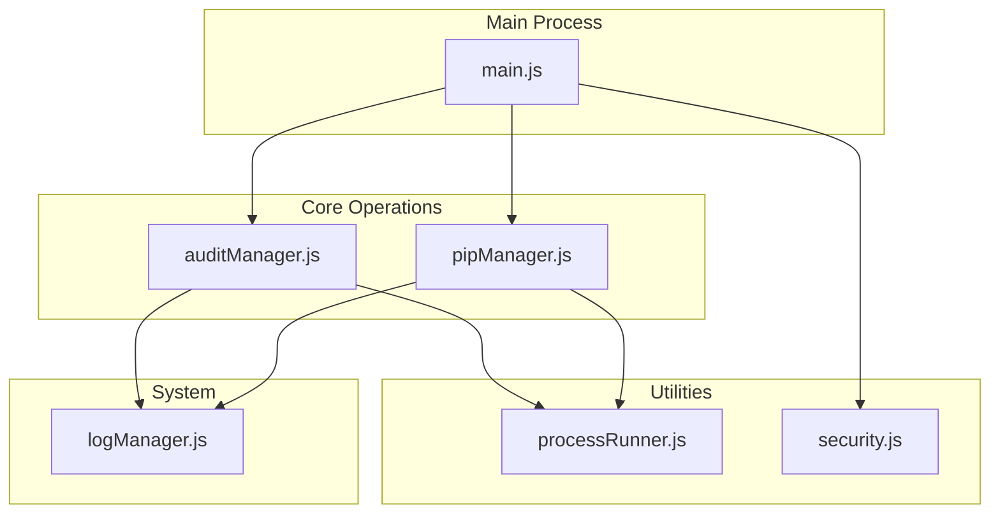
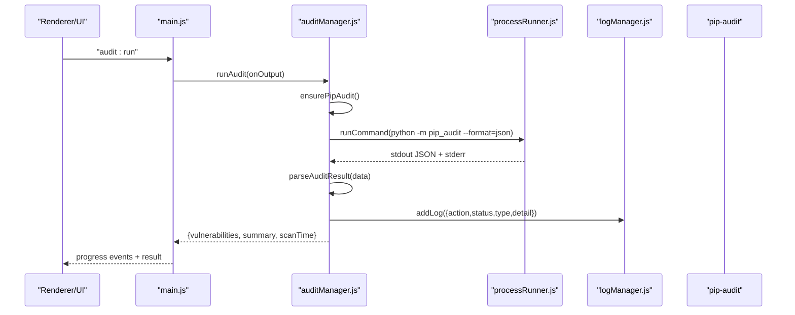
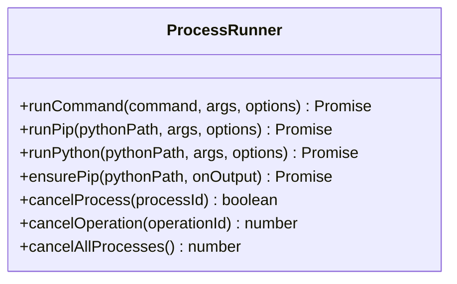
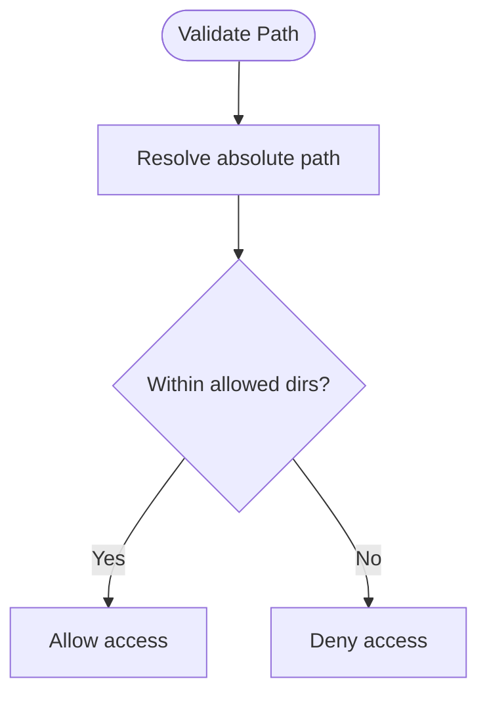
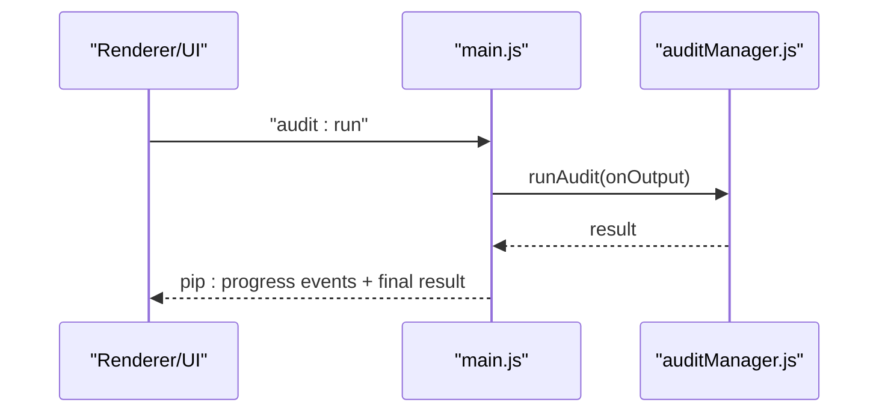
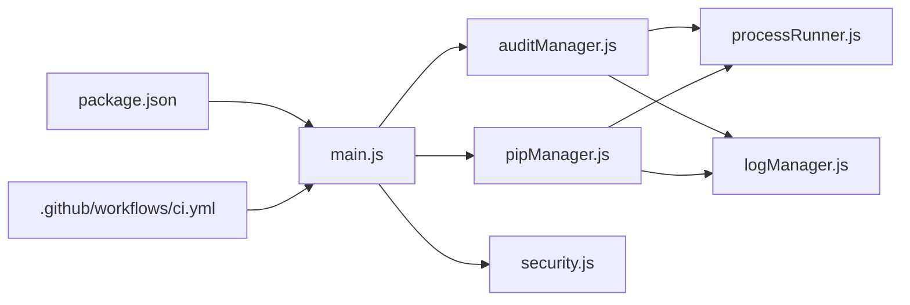

# Security & Auditing

<cite>
**Referenced Files in This Document**
- [auditManager.js](file://core/operations/auditManager.js)
- [pipManager.js](file://core/operations/pipManager.js)
- [processRunner.js](file://utils/processRunner.js)
- [security.js](file://utils/security.js)
- [logManager.js](file://core/system/logManager.js)
- [main.js](file://main.js)
- [package.json](file://package.json)
- [ci.yml](file://.github/workflows/ci.yml)
</cite>

## Update Summary
**Changes Made**
- Added comprehensive documentation for the new audit manager (auditManager.js)
- Updated vulnerability scanning capabilities with pip-audit integration
- Enhanced dependency conflict analysis documentation
- Expanded environment health monitoring features
- Added detailed IPC integration patterns for audit operations
- Updated troubleshooting guide with audit-specific issues

## Table of Contents
1. Introduction
2. Project Structure
3. Core Components
4. Architecture Overview
5. Detailed Component Analysis
6. Dependency Analysis
7. Performance Considerations
8. Troubleshooting Guide
9. Conclusion
10. Appendices

## Introduction
This document explains PyLibMaster's comprehensive security auditing and vulnerability scanning capabilities, including CVE detection via pip-audit integration, dependency conflict analysis, and environment health monitoring. The system provides automated security scanning with intelligent caching, structured reporting, and CI/CD pipeline integration for proactive vulnerability management.

## Project Structure
Security-related functionality is implemented across core modules and utilities:
- Audit orchestration and parsing live in a dedicated audit manager module.
- Dependency conflict analysis and health checks are provided by the package manager module.
- Process execution, timeouts, and cancellation are handled by a robust process runner utility.
- Path safety validation is provided by a security utility.
- Logging persists audit outcomes and operational events.
- The main process exposes IPC handlers to trigger audits from the UI or automation layers.
- Packaging metadata and CI configuration support build-time and pipeline usage.

**Diagram sources**
- [main.js](file://main.js)
- [auditManager.js](file://core/operations/auditManager.js)
- [pipManager.js](file://core/operations/pipManager.js)
- [processRunner.js](file://utils/processRunner.js)
- [security.js](file://utils/security.js)
- [logManager.js](file://core/system/logManager.js)

**Section sources**
- [main.js](file://main.js)
- [auditManager.js](file://core/operations/auditManager.js)
- [pipManager.js](file://core/operations/pipManager.js)
- [processRunner.js](file://utils/processRunner.js)
- [security.js](file://utils/security.js)
- [logManager.js](file://core/system/logManager.js)

## Core Components
- **Vulnerability scanner (CVE detection)**: Uses pip-audit to scan installed packages against the PyPI Advisory Database, parses JSON results, infers severity levels, and returns structured findings with fix recommendations.
- **Dependency conflict analyzer**: Runs pip check to detect broken requirements and version conflicts, returning parsed conflict details.
- **Environment health monitor**: Aggregates multiple diagnostics (package listing, dependency checks, metadata integrity, site-packages accessibility) into a scored report.
- **Process execution layer**: Provides robust subprocess management with timeouts, cancellation, ANSI stripping, and UTF-8 encoding.
- **Path security validator**: Ensures file paths are within allowed directories to prevent path traversal attacks.
- **Logging subsystem**: Persists audit outcomes and operational logs with capacity control and search/filtering.

**Section sources**
- [auditManager.js](file://core/operations/auditManager.js)
- [pipManager.js](file://core/operations/pipManager.js)
- [processRunner.js](file://utils/processRunner.js)
- [security.js](file://utils/security.js)
- [logManager.js](file://core/system/logManager.js)

## Architecture Overview
The security audit flow integrates the UI, main process, audit manager, and external tools:

**Diagram sources**
- [main.js](file://main.js)
- [auditManager.js](file://core/operations/auditManager.js)
- [processRunner.js](file://utils/processRunner.js)
- [logManager.js](file://core/system/logManager.js)

## Detailed Component Analysis

### Vulnerability Scanner (CVE Detection)
The audit manager provides comprehensive vulnerability scanning capabilities:

- **Automatic pip-audit installation**: Ensures pip-audit is available; installs it if missing with progress feedback
- **JSON-based scanning**: Executes pip-audit in JSON mode with progress spinner disabled for optimal performance
- **Intelligent result parsing**: Handles both new and legacy JSON formats, normalizes fields, and infers severity when not provided
- **Caching mechanism**: Caches results for 10 minutes to avoid repeated scans during development sessions
- **Structured reporting**: Returns comprehensive vulnerability data with fix recommendations and NVD links

**Diagram sources**
- [auditManager.js](file://core/operations/auditManager.js)
- [processRunner.js](file://utils/processRunner.js)
- [logManager.js](file://core/system/logManager.js)

**Section sources**
- [auditManager.js](file://core/operations/auditManager.js)

### Dependency Conflict Analysis
Enhanced dependency conflict detection capabilities:

- **Comprehensive checking**: Invokes pip check to identify broken requirements and version mismatches
- **Detailed parsing**: Parses standard messages to extract conflicting packages, required versions, and installed versions
- **Structured reporting**: Returns a structured object indicating overall status and detailed conflicts
- **Integration with health checks**: Works seamlessly with environment health monitoring

**Diagram sources**
- [pipManager.js](file://core/operations/pipManager.js)
- [processRunner.js](file://utils/processRunner.js)
- [logManager.js](file://core/system/logManager.js)

**Section sources**
- [pipManager.js](file://core/operations/pipManager.js)

### Environment Health Monitoring
Comprehensive environment diagnostics:

- **Package inventory**: Lists all installed packages with metadata
- **Dependency validation**: Checks for broken dependencies using pip check
- **Metadata integrity**: Samples package metadata to verify installation integrity
- **Site-packages verification**: Validates site-packages directory accessibility
- **Scoring system**: Computes a health score (0–100) with categorized issues

**Diagram sources**
- [pipManager.js](file://core/operations/pipManager.js)
- [processRunner.js](file://utils/processRunner.js)
- [logManager.js](file://core/system/logManager.js)

**Section sources**
- [pipManager.js](file://core/operations/pipManager.js)

### Process Execution Layer
Robust subprocess management for security operations:

- **UTF-8 encoding**: Forces UTF-8 encoding for Python processes to prevent character encoding issues
- **ANSI stripping**: Automatically removes ANSI color codes from terminal output
- **Timeout handling**: Implements graceful timeout with SIGTERM followed by SIGKILL after delay
- **Process tracking**: Maintains active process registry for cancellation support
- **Operation grouping**: Supports operation IDs for batch process cancellation

**Diagram sources**
- [processRunner.js](file://utils/processRunner.js)

**Section sources**
- [processRunner.js](file://utils/processRunner.js)

### Path Security Validator
Security-focused path validation:

- **Absolute path resolution**: Converts relative paths to absolute paths to prevent traversal attacks
- **Directory boundary enforcement**: Ensures target paths remain within allowed directories
- **Boundary checking**: Prevents path traversal using "../" sequences
- **Multiple directory support**: Validates against multiple allowed directories simultaneously

**Diagram sources**
- [security.js](file://utils/security.js)

**Section sources**
- [security.js](file://utils/security.js)

### IPC Integration and Entry Points
Seamless integration with the main process:

- **Audit execution handler**: `audit:run` IPC handler triggers vulnerability scans
- **Cached result retrieval**: `audit:cached` handler provides access to recent scan results
- **Progress streaming**: Real-time progress updates via pip:progress events
- **Error handling**: Comprehensive error propagation with meaningful messages

**Diagram sources**
- [main.js](file://main.js)
- [auditManager.js](file://core/operations/auditManager.js)

**Section sources**
- [main.js](file://main.js)

## Dependency Analysis
Key dependencies and relationships:
- auditManager depends on processRunner for executing pip-audit and logManager for persistence
- pipManager depends on processRunner for pip commands and logManager for logging
- main wires IPC handlers to these modules
- packaging metadata defines application identity and build targets
- CI workflow ensures tests and builds pass before artifacts are produced

**Diagram sources**
- [main.js](file://main.js)
- [auditManager.js](file://core/operations/auditManager.js)
- [pipManager.js](file://core/operations/pipManager.js)
- [processRunner.js](file://utils/processRunner.js)
- [logManager.js](file://core/system/logManager.js)
- [security.js](file://utils/security.js)
- [package.json](file://package.json)
- [ci.yml](file://.github/workflows/ci.yml)

**Section sources**
- [main.js](file://main.js)
- [auditManager.js](file://core/operations/auditManager.js)
- [pipManager.js](file://core/operations/pipManager.js)
- [processRunner.js](file://utils/processRunner.js)
- [logManager.js](file://core/system/logManager.js)
- [security.js](file://utils/security.js)
- [package.json](file://package.json)
- [ci.yml](file://.github/workflows/ci.yml)

## Performance Considerations
Optimization strategies for security scanning:

- **Audit caching**: Results are cached for 10 minutes to reduce repeated scans during development
- **Process timeouts**: Long-running operations have explicit timeouts to prevent hangs
- **ANSI stripping and UTF-8 encoding**: Improves performance and correctness of output processing
- **Limited scanning scope**: Dependency graph building limits scanned packages to avoid timeouts
- **Disk usage estimation**: Uses fast heuristics and caches directory mappings
- **Memory management**: Efficient data structures for large vulnerability datasets

## Troubleshooting Guide
Common issues and resolutions:

### Audit-Specific Issues
- **pip-audit installation failure**: Ensure network access and permissions; install manually if automatic installation fails
- **No Python environment selected**: Select a valid environment before running audits or health checks
- **Scan timeouts**: Increase timeout values or reduce environment size; verify network stability
- **Permission errors on paths**: Use allowed directories only; validate paths with the security utility
- **Corrupted metadata**: Reinstall affected packages after identifying them via health checks

### General Security Issues
- **Path traversal attempts**: Verify that user-supplied paths are validated through security utilities
- **Process hanging**: Check for unresponsive subprocesses and use cancellation mechanisms
- **Memory leaks**: Monitor memory usage during large scans and implement proper cleanup

**Section sources**
- [auditManager.js](file://core/operations/auditManager.js)
- [pipManager.js](file://core/operations/pipManager.js)
- [processRunner.js](file://utils/processRunner.js)
- [security.js](file://utils/security.js)
- [logManager.js](file://core/system/logManager.js)

## Conclusion
PyLibMaster provides a robust security auditing pipeline that leverages pip-audit for CVE detection, pip check for dependency conflicts, and comprehensive health diagnostics. With secure process execution, path validation, and persistent logging, it supports reliable, repeatable security checks suitable for local development and CI/CD pipelines. The new audit manager enhances the platform's security posture with automated vulnerability scanning and intelligent remediation guidance.

## Appendices

### Audit Workflow Summary
- Trigger audit via IPC handler
- Ensure pip-audit availability with automatic installation
- Execute pip-audit in JSON mode with progress feedback
- Parse and normalize results with severity inference
- Cache and log outcomes for future reference
- Return structured report to caller with actionable insights

**Section sources**
- [main.js](file://main.js)
- [auditManager.js](file://core/operations/auditManager.js)
- [processRunner.js](file://utils/processRunner.js)
- [logManager.js](file://core/system/logManager.js)

### Vulnerability Reporting Format
Structured vulnerability data includes:
- **vulnerabilities**: Array of objects with id, package, version, severity, summary, fixVersion, url, aliases
- **summary**: Counts for totalVulns, affectedPackages, critical/high/medium/low, fixable
- **scanTime**: ISO timestamp for audit execution
- **Severity inference**: Falls back to description-based heuristics when not provided

**Section sources**
- [auditManager.js](file://core/operations/auditManager.js)

### Dependency Conflict Report Format
Conflict detection results include:
- **ok**: Boolean indicating no conflicts detected
- **conflicts**: Array of objects with package, version, requires, installed, message
- **message**: Raw output or summary of conflict details

**Section sources**
- [pipManager.js](file://core/operations/pipManager.js)

### Health Report Metrics
Comprehensive health assessment includes:
- **envName**: Target environment identifier
- **pythonVersion**: Python interpreter version
- **totalPackages**: Count of installed packages
- **issues**: Array of problems with level (error/warning) and descriptive messages
- **brokenPackages**: Packages with dependency issues
- **missingMetadata**: Packages with incomplete metadata
- **conflicts**: Version conflict details
- **score**: Overall health score (0–100)

**Section sources**
- [pipManager.js](file://core/operations/pipManager.js)

### External Security Databases Integration
Data sources and references:
- **Primary source**: PyPI Advisory Database via pip-audit
- **Secondary sources**: NVD detail URLs constructed from CVE IDs where applicable
- **Alias mapping**: Support for multiple vulnerability identifiers (CVE, GHSA, etc.)

**Section sources**
- [auditManager.js](file://core/operations/auditManager.js)

### Security Best Practices
Recommended security measures:
- Keep pip-audit updated to benefit from latest advisories
- Regularly run audits in isolated environments per project
- Enforce minimum severity thresholds in CI to block vulnerable merges
- Use path validation utilities for any user-supplied file paths
- Maintain backups before major updates or rollbacks
- Implement proper error handling for security-sensitive operations

### Recommended Scanning Schedules
Automated security scanning strategy:
- **Pre-commit**: Quick dependency check and lightweight audit
- **Nightly**: Full CVE scan and comprehensive health check
- **Before releases**: Comprehensive audit and conflict resolution
- **On-demand**: Triggered by manual actions or dependency changes
- **Post-deployment**: Validation scans in production-like environments

### Remediation Guidance
Prioritized vulnerability response:
- **Critical issues**: Immediate attention with hotfix deployment
- **High severity**: Address within current sprint cycle
- **Medium severity**: Plan for next release iteration
- **Low severity**: Include in regular maintenance cycles
- **Upgrade strategy**: Prioritize upgrades to fixed versions indicated in vulnerability records
- **Conflict resolution**: Resolve dependency constraints before upgrading vulnerable packages
- **Validation**: Validate fixes with subsequent health checks and audits

### Example Audit Report Interpretation
Understanding audit results:
- **Total vulnerabilities**: Indicates overall risk exposure level
- **Affected packages**: Highlights scope of impact across the dependency tree
- **Severity distribution**: Guides triage effort and resource allocation
- **Fixable count**: Shows actionable items with known fixes available
- **Scan time**: Helps assess performance characteristics and optimization opportunities

### CI/CD Integration Patterns
Automated security pipeline implementation:
- **Test job**: Install Node dependencies, execute tests and build steps
- **Security job**: Run pip-audit against the environment and fail on non-zero exit codes or threshold breaches
- **Artifact upload**: Store audit reports and logs for traceability
- **Notification**: Alert teams of critical vulnerabilities found during scans
- **Blocking rules**: Prevent merges with critical or high severity vulnerabilities

**Section sources**
- [ci.yml](file://.github/workflows/ci.yml)
- [package.json](file://package.json)