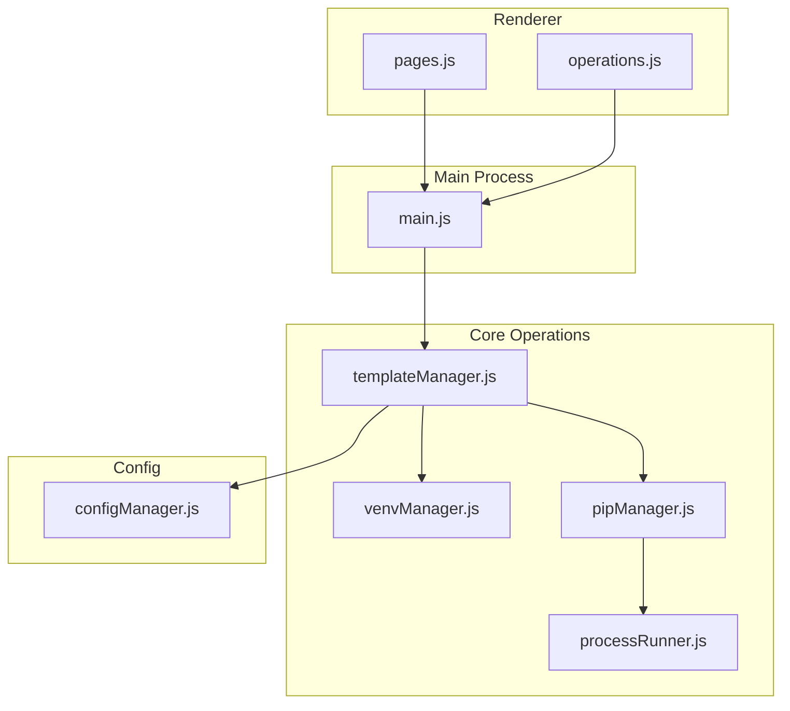
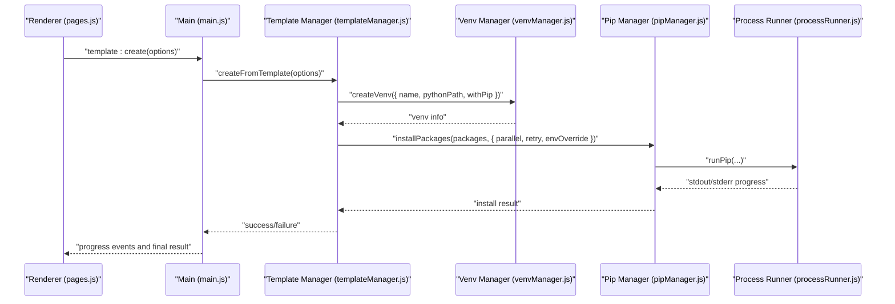
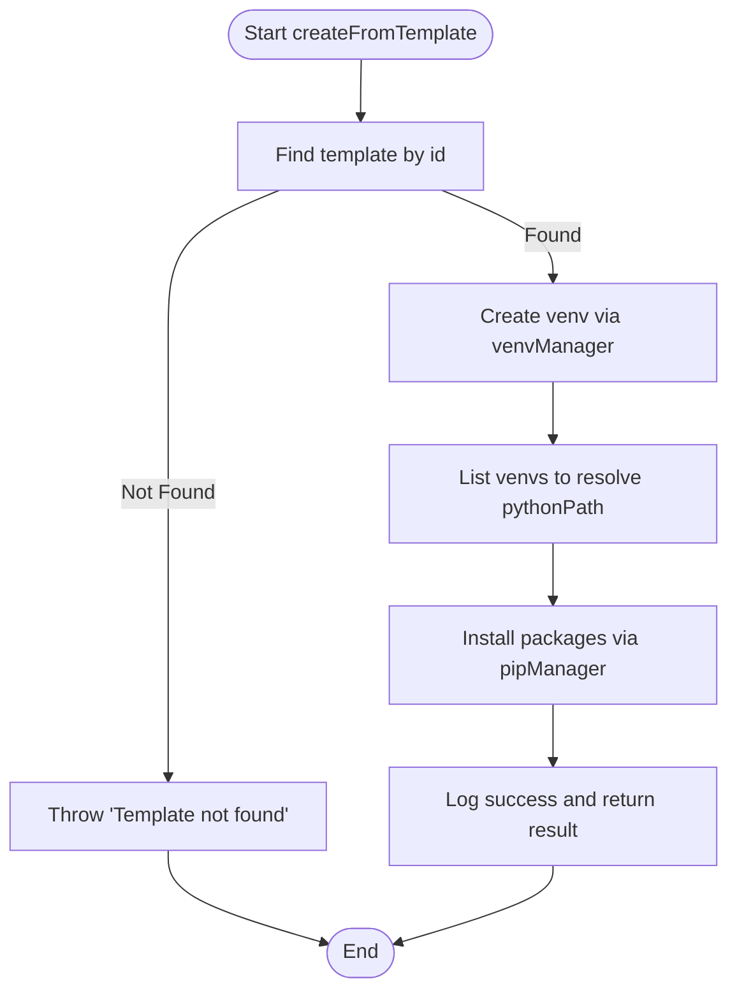
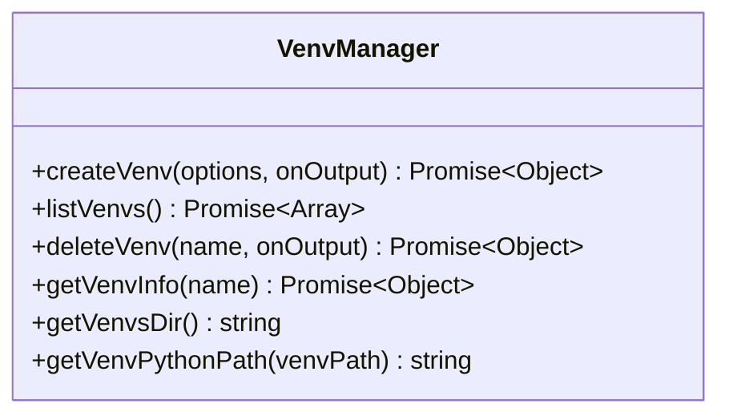
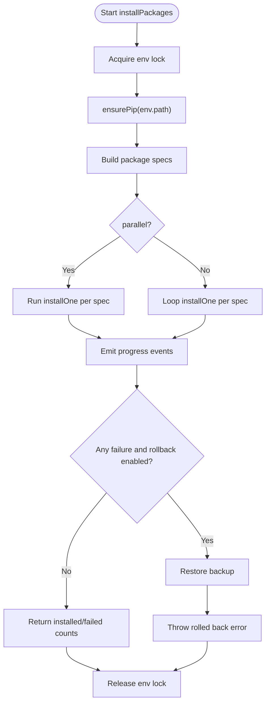
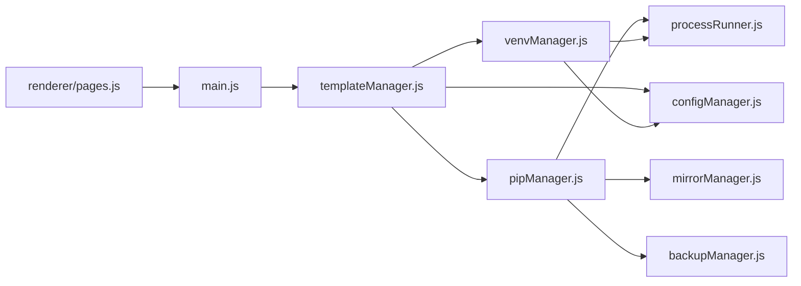

# Template System

<cite>
**Referenced Files in This Document**
- [templateManager.js](file://core/operations/templateManager.js)
- [venvManager.js](file://core/operations/venvManager.js)
- [pipManager.js](file://core/operations/pipManager.js)
- [processRunner.js](file://utils/processRunner.js)
- [configManager.js](file://core/config/configManager.js)
- [main.js](file://main.js)
- [pages.js](file://renderer/js/pages.js)
- [operations.js](file://renderer/js/operations.js)
</cite>

## Update Summary
**Changes Made**
- Updated built-in template types to reflect enhanced project templates for common development scenarios
- Added detailed descriptions of new template categories including Web development, data analysis, machine learning, web scraping, and automation
- Enhanced template examples with specific package lists for each scenario
- Updated documentation to reflect the comprehensive template capabilities now available

## Table of Contents
1. [Introduction](#introduction)
2. [Project Structure](#project-structure)
3. [Core Components](#core-components)
4. [Architecture Overview](#architecture-overview)
5. [Detailed Component Analysis](#detailed-component-analysis)
6. [Dependency Analysis](#dependency-analysis)
7. [Performance Considerations](#performance-considerations)
8. [Troubleshooting Guide](#troubleshooting-guide)
9. [Conclusion](#conclusion)
10. [Appendices](#appendices)

## Introduction
This document explains PyLibMaster's template system, which provides pre-configured project setups with predefined dependencies, configurations, and environment settings. The system includes comprehensive built-in templates for common development scenarios including Web development (Flask, Django), data analysis, machine learning, web scraping, and automation tasks. It covers how templates are defined, created, customized, and deployed into isolated Python virtual environments. It also documents built-in template types, custom template development, snapshot-based versioning and rollback, and integration with virtual environment creation and package installation. Examples for common frameworks and data science environments are provided conceptually to guide users in selecting or creating appropriate templates.

## Project Structure
The template system spans the core operations layer, process execution utilities, configuration storage, IPC wiring, and renderer UI:
- Core logic resides in templateManager.js, venvManager.js, pipManager.js, and processRunner.js.
- Configuration is managed by configManager.js.
- IPC handlers connect the renderer to the main process via main.js.
- The renderer exposes template selection and snapshot management through pages.js and operations.js.

**Diagram sources**
- [main.js:548-575](file://main.js#L548-L575)
- [templateManager.js:1-320](file://core/operations/templateManager.js#L1-L320)
- [venvManager.js:1-278](file://core/operations/venvManager.js#L1-L278)
- [pipManager.js:1-800](file://core/operations/pipManager.js#L1-L800)
- [processRunner.js:1-366](file://utils/processRunner.js#L1-L366)
- [configManager.js:1-194](file://core/config/configManager.js#L1-L194)
- [pages.js:870-1069](file://renderer/js/pages.js#L870-L1069)
- [operations.js:518-536](file://renderer/js/operations.js#L518-L536)

**Section sources**
- [templateManager.js:1-320](file://core/operations/templateManager.js#L1-L320)
- [venvManager.js:1-278](file://core/operations/venvManager.js#L1-L278)
- [pipManager.js:1-800](file://core/operations/pipManager.js#L1-L800)
- [processRunner.js:1-366](file://utils/processRunner.js#L1-L366)
- [configManager.js:1-194](file://core/config/configManager.js#L1-L194)
- [main.js:548-575](file://main.js#L548-L575)
- [pages.js:870-1069](file://renderer/js/pages.js#L870-L1069)
- [operations.js:518-536](file://renderer/js/operations.js#L518-L536)

## Core Components
- Template definitions and lifecycle: Built-in templates for common development scenarios and custom templates are managed, listed, added, removed, and used to create environments.
- Virtual environment creation: Isolated environments are created with configurable options and validated names.
- Package installation: Templates specify packages; installation supports parallelism, retries, and progress reporting.
- Snapshots: Environments can be snapshotted and restored, enabling versioning and rollback.
- IPC integration: Renderer invokes template and snapshot operations via IPC handlers.

Key responsibilities:
- templateManager.js: Template CRUD, snapshot lifecycle, and orchestration of venv + install.
- venvManager.js: Create/list/delete venvs, detect Python paths and versions.
- pipManager.js: Install/update/uninstall packages with robust error handling and retries.
- processRunner.js: Subprocess execution, timeout/cancellation, ensure pip availability.
- configManager.js: Persistent app configuration including custom templates storage.
- main.js: IPC handlers bridging renderer calls to core modules.
- pages.js: Template UI rendering, selection, creation flow, and snapshot management.

**Section sources**
- [templateManager.js:1-320](file://core/operations/templateManager.js#L1-L320)
- [venvManager.js:1-278](file://core/operations/venvManager.js#L1-L278)
- [pipManager.js:1-800](file://core/operations/pipManager.js#L1-L800)
- [processRunner.js:1-366](file://utils/processRunner.js#L1-L366)
- [configManager.js:1-194](file://core/config/configManager.js#L1-L194)
- [main.js:548-575](file://main.js#L548-L575)
- [pages.js:870-1069](file://renderer/js/pages.js#L870-L1069)

## Architecture Overview
The template system follows a layered architecture:
- Renderer UI triggers actions (select template, create env, create/restore snapshots).
- Main process exposes IPC handlers that delegate to core modules.
- Core modules coordinate venv creation, package installation, and snapshot operations.
- Utilities handle subprocess execution and pip bootstrapping.

**Diagram sources**
- [main.js:557-561](file://main.js#L557-L561)
- [templateManager.js:118-154](file://core/operations/templateManager.js#L118-L154)
- [venvManager.js:73-130](file://core/operations/venvManager.js#L73-L130)
- [pipManager.js:513-596](file://core/operations/pipManager.js#L513-L596)
- [processRunner.js:340-342](file://utils/processRunner.js#L340-L342)

**Section sources**
- [main.js:548-575](file://main.js#L548-L575)
- [templateManager.js:118-154](file://core/operations/templateManager.js#L118-L154)
- [venvManager.js:73-130](file://core/operations/venvManager.js#L73-L130)
- [pipManager.js:513-596](file://core/operations/pipManager.js#L513-L596)
- [processRunner.js:340-342](file://utils/processRunner.js#L340-L342)

## Detailed Component Analysis

### Template Manager
Responsibilities:
- Provide built-in templates for common development scenarios including Web development, data analysis, machine learning, web scraping, and automation.
- Manage custom templates persisted in application configuration.
- Orchestrate environment creation and package installation from a selected template.
- Implement snapshot lifecycle: create, list, detail, restore, delete.

Key behaviors:
- getTemplates(): merges built-in and custom templates.
- addCustomTemplate()/removeCustomTemplate(): validates and persists custom templates.
- createFromTemplate(): creates venv, installs all packages, logs operation.
- Snapshot functions: capture pip freeze output, store JSON metadata, restore via requirements-like file.

Validation and safety:
- Custom template validation ensures required fields and array structure.
- Snapshot IDs are sanitized to prevent path traversal.

**Diagram sources**
- [templateManager.js:118-154](file://core/operations/templateManager.js#L118-L154)

**Section sources**
- [templateManager.js:23-66](file://core/operations/templateManager.js#L23-L66)
- [templateManager.js:72-98](file://core/operations/templateManager.js#L72-L98)
- [templateManager.js:105-110](file://core/operations/templateManager.js#L105-L110)
- [templateManager.js:118-154](file://core/operations/templateManager.js#L118-L154)
- [templateManager.js:175-209](file://core/operations/templateManager.js#L175-209)
- [templateManager.js:215-236](file://core/operations/templateManager.js#L215-236)
- [templateManager.js:243-248](file://core/operations/templateManager.js#L243-248)
- [templateManager.js:257-292](file://core/operations/templateManager.js#L257-292)
- [templateManager.js:299-307](file://core/operations/templateManager.js#L299-307)

### Virtual Environment Manager
Responsibilities:
- Create venvs with options (include pip, inherit system site-packages).
- Validate venv names and base Python paths.
- List existing venvs with metadata (Python version, pip version, package count).
- Delete venvs safely with path traversal protection.

Key behaviors:
- createVenv(): builds python -m venv command, handles errors and cleanup.
- listVenvs(): enumerates directories, validates pyvenv.cfg and python executable.
- getVenvInfo(): reads pyvenv.cfg to determine base Python path.

**Diagram sources**
- [venvManager.js:73-130](file://core/operations/venvManager.js#L73-L130)
- [venvManager.js:136-186](file://core/operations/venvManager.js#L136-L186)
- [venvManager.js:195-224](file://core/operations/venvManager.js#L195-L224)
- [venvManager.js:231-268](file://core/operations/venvManager.js#L231-L268)

**Section sources**
- [venvManager.js:23-24](file://core/operations/venvManager.js#L23-L24)
- [venvManager.js:30-45](file://core/operations/venvManager.js#L30-L45)
- [venvManager.js:52-59](file://core/operations/venvManager.js#L52-L59)
- [venvManager.js:73-130](file://core/operations/venvManager.js#L73-L130)
- [venvManager.js:136-186](file://core/operations/venvManager.js#L136-L186)
- [venvManager.js:195-224](file://core/operations/venvManager.js#L195-L224)
- [venvManager.js:231-268](file://core/operations/venvManager.js#L231-L268)

### Pip Manager
Responsibilities:
- Build safe package specs with version constraints.
- Install/update/uninstall packages with parallelism, retries, and automatic rollback.
- Ensure pip availability using ensurepip or get-pip.py fallback.
- Provide progress events and structured results.

Key behaviors:
- buildPackageSpec(): validates names and version specifiers; supports wheel files securely.
- installPackages(): orchestrates parallel or sequential installs with mirror retries and rollback.
- ensurePip(): checks cache, runs ensurepip, downloads get-pip.py if needed.

**Diagram sources**
- [pipManager.js:513-596](file://core/operations/pipManager.js#L513-L596)
- [pipManager.js:608-633](file://core/operations/pipManager.js#L608-L633)
- [pipManager.js:233-278](file://core/operations/pipManager.js#L233-278)

**Section sources**
- [pipManager.js:154-235](file://core/operations/pipManager.js#L154-L235)
- [pipManager.js:513-596](file://core/operations/pipManager.js#L513-L596)
- [pipManager.js:608-633](file://core/operations/pipManager.js#L608-L633)
- [pipManager.js:233-278](file://core/operations/pipManager.js#L233-L278)

### Process Runner
Responsibilities:
- Execute commands with timeouts, cancellation, and real-time output.
- Manage active processes and support cancel by operationId.
- Ensure pip availability with caching and multiple download sources.

Key behaviors:
- runCommand(): spawns child processes, streams stdout/stderr, handles SIGTERM/SIGKILL.
- cancelOperation(): terminates all processes associated with an operationId.
- ensurePip(): caches readiness, tries ensurepip then get-pip.py.

**Section sources**
- [processRunner.js:85-161](file://utils/processRunner.js#L85-L161)
- [processRunner.js:181-206](file://utils/processRunner.js#L181-L206)
- [processRunner.js:233-278](file://utils/processRunner.js#L233-L278)
- [processRunner.js:340-342](file://utils/processRunner.js#L340-L342)

### Configuration Manager
Responsibilities:
- Persist application configuration (including custom templates).
- Sanitize numeric values within ranges.
- Provide storage path and atomic writes.

Key behaviors:
- setConfig()/setBulk(): validate and persist changes.
- getStoragePath(): ensures directory exists.

**Section sources**
- [configManager.js:39-44](file://core/config/configManager.js#L39-L44)
- [configManager.js:80-117](file://core/config/configManager.js#L80-L117)
- [configManager.js:123-138](file://core/config/configManager.js#L123-L138)
- [configManager.js:144-162](file://core/config/configManager.js#L144-L162)
- [configManager.js:171-178](file://core/config/configManager.js#L171-L178)
- [configManager.js:185-191](file://core/config/configManager.js#L185-L191)

### IPC Integration (Main Process)
Responsibilities:
- Expose template and snapshot operations to the renderer via IPC handlers.
- Forward progress events to the renderer during long-running operations.

Key handlers:
- template:list, template:add, template:remove, template:create
- snapshot:create, snapshot:list, snapshot:detail, snapshot:restore, snapshot:delete

**Section sources**
- [main.js:548-575](file://main.js#L548-L575)

### Renderer UI (Template Page)
Responsibilities:
- Render template cards and allow selection.
- Populate base Python dropdown from detected environments.
- Execute template creation and display progress.
- Manage snapshots: create, list, restore, delete.

Key flows:
- loadTemplatesPage(): renders templates and snapshots, fills base Python options.
- selectTemplate(): shows details and auto-fills environment name.
- execTemplateCreate(): calls IPC to create venv and install packages.
- createEnvSnapshot(), restoreEnvSnapshot(), deleteEnvSnapshot(): manage snapshots.

**Section sources**
- [pages.js:875-902](file://renderer/js/pages.js#L875-L902)
- [pages.js:905-929](file://renderer/js/pages.js#L905-L929)
- [pages.js:932-958](file://renderer/js/pages.js#L932-L958)
- [pages.js:961-981](file://renderer/js/pages.js#L961-L981)
- [pages.js:984-1008](file://renderer/js/pages.js#L984-L1008)
- [pages.js:1011-1031](file://renderer/js/pages.js#L1011-L1031)
- [pages.js:1034-1042](file://renderer/js/pages.js#L1034-L1042)
- [operations.js:518-536](file://renderer/js/operations.js#L518-L536)

## Dependency Analysis
Component relationships:
- templateManager depends on venvManager, pipManager, configManager, and logManager.
- pipManager depends on mirrorManager, backupManager, configManager, processRunner, and envManager.
- venvManager depends on configManager, logManager, and processRunner.
- main.js wires renderer IPC calls to these modules.

Potential circular dependencies:
- None observed; modules are layered and imported only where needed.

External integrations:
- Python interpreter and pip via processRunner.
- PyPI mirrors via mirrorManager (used by pipManager).
- Filesystem for snapshots and venv storage.

**Diagram sources**
- [templateManager.js:1-320](file://core/operations/templateManager.js#L1-L320)
- [venvManager.js:1-278](file://core/operations/venvManager.js#L1-L278)
- [pipManager.js:1-800](file://core/operations/pipManager.js#L1-L800)
- [processRunner.js:1-366](file://utils/processRunner.js#L1-L366)
- [configManager.js:1-194](file://core/config/configManager.js#L1-L194)
- [main.js:548-575](file://main.js#L548-L575)
- [pages.js:870-1069](file://renderer/js/pages.js#L870-L1069)

**Section sources**
- [templateManager.js:1-320](file://core/operations/templateManager.js#L1-L320)
- [venvManager.js:1-278](file://core/operations/venvManager.js#L1-L278)
- [pipManager.js:1-800](file://core/operations/pipManager.js#L1-L800)
- [processRunner.js:1-366](file://utils/processRunner.js#L1-L366)
- [configManager.js:1-194](file://core/config/configManager.js#L1-L194)
- [main.js:548-575](file://main.js#L548-L575)
- [pages.js:870-1069](file://renderer/js/pages.js#L870-L1069)

## Performance Considerations
- Parallel installation: template creation uses pipManager.installPackages with parallel option to speed up dependency installation.
- Retry and mirror rotation: pipManager retries across configured mirrors to improve reliability and throughput.
- Cache usage: pipManager caches installed package lists and pip readiness to reduce overhead.
- Snapshot I/O: snapshots write JSON files; listing sorts by time, which is efficient for typical numbers of snapshots.
- Process timeouts: processRunner enforces timeouts and graceful termination to avoid hanging operations.

[No sources needed since this section provides general guidance]

## Troubleshooting Guide
Common issues and resolutions:
- Template not found: ensure templateId matches one of the returned templates from getTemplates().
- Invalid venv name: names must match allowed characters and length limits; use alphanumeric, hyphens, underscores, and dots.
- Base Python not found: verify pythonPath points to a valid Python executable.
- pip not available: ensurePip attempts ensurepip and get-pip.py; check network access and permissions.
- Snapshot restore failures: confirm target environment path is correct and writable; review temporary requirements file generation.
- Progress events not received: ensure onOutput callbacks are wired in IPC handlers and renderer event listeners.

Operational tips:
- Use snapshot before risky operations to enable rollback.
- Monitor logs for detailed error messages and operation status.
- Cancel long-running operations via operationId when necessary.

**Section sources**
- [templateManager.js:118-154](file://core/operations/templateManager.js#L118-L154)
- [venvManager.js:73-130](file://core/operations/venvManager.js#L73-L130)
- [pipManager.js:233-278](file://core/operations/pipManager.js#L233-L278)
- [processRunner.js:85-161](file://utils/processRunner.js#L85-L161)
- [main.js:548-575](file://main.js#L548-L575)

## Conclusion
PyLibMaster's template system streamlines environment setup by combining predefined dependency sets with automated venv creation and package installation. With comprehensive built-in templates for common development scenarios including Web development, data analysis, machine learning, web scraping, and automation, developers can quickly bootstrap projects while maintaining control over environment state and reproducibility. The system supports custom templates, robust error handling, and snapshot-based versioning for reliable rollbacks. Through clear IPC integration and user-friendly UI flows, it provides a complete solution for Python environment management.

[No sources needed since this section summarizes without analyzing specific files]

## Appendices

### Built-in Template Types
The enhanced template system includes comprehensive built-in templates for common development scenarios:

- **Web Development (Flask)**: Flask ecosystem with CORS, SQLAlchemy, migrations, Jinja2, Werkzeug, requests, Gunicorn, and dotenv support.
- **Web Development (Django)**: Full-stack Django development with REST framework, CORS headers, filtering, Celery, Redis, database drivers, and deployment tools.
- **Data Analysis**: Complete data science stack including NumPy, Pandas, Matplotlib, Seaborn, SciPy, Jupyter, Excel support, and statistical modeling.
- **Machine Learning**: Comprehensive ML/DL toolkit with scikit-learn, PyTorch, TensorFlow, Keras, visualization tools, and progress tracking.
- **Web Scraping (Crawler)**: Advanced web scraping with requests, Scrapy, BeautifulSoup, lxml, Selenium, user agent management, and async HTTP.
- **Automation Office**: Office automation with Excel, Word, PowerPoint, PDF processing, image manipulation, GUI automation, and scheduling.

These templates provide curated package lists suitable for common scenarios. Users can extend or customize them via custom templates.

**Section sources**
- [templateManager.js:23-66](file://core/operations/templateManager.js#L23-L66)

### Custom Template Development
To create a custom template:
- Define name, icon, description, and packages array.
- Add via template:add IPC handler; it will be persisted under customTemplates in configuration.
- Remove via template:remove with the template id.

Validation rules:
- name must be a non-empty string.
- packages must be an array.

Example pattern:
- For FastAPI: include fastapi, uvicorn, pydantic, httpx, python-multipart, python-dotenv.

Note: These examples illustrate patterns; actual implementation details are handled by templateManager.addCustomTemplate.

**Section sources**
- [templateManager.js:83-98](file://core/operations/templateManager.js#L83-L98)
- [configManager.js:157-162](file://core/config/configManager.js#L157-L162)

### Template Versioning and Validation
- Versioning is achieved via snapshots: each snapshot records package versions at a point in time.
- Validation:
  - Template fields validated before persistence.
  - Snapshot IDs sanitized to prevent path traversal.
  - Package specs validated for safety and correctness.

Restoration workflow:
- Create snapshot -> store JSON with package list -> restore by writing requirements and installing via pip.

**Section sources**
- [templateManager.js:175-209](file://core/operations/templateManager.js#L175-209)
- [templateManager.js:257-292](file://core/operations/templateManager.js#L257-292)
- [pipManager.js:154-235](file://core/operations/pipManager.js#L154-L235)

### Integration with Virtual Environment Creation
- Template creation triggers venv creation with specified base Python and pip inclusion.
- After venv creation, template packages are installed in parallel with retries.
- Progress events are streamed to the renderer for real-time feedback.

**Section sources**
- [templateManager.js:118-154](file://core/operations/templateManager.js#L118-L154)
- [venvManager.js:73-130](file://core/operations/venvManager.js#L73-L130)
- [pipManager.js:513-596](file://core/operations/pipManager.js#L513-L596)
- [processRunner.js:85-161](file://utils/processRunner.js#L85-L161)

### Common Template Patterns for Frameworks
Enhanced template patterns aligned with built-in templates:

- **Django**: django, djangorestframework, django-cors-headers, django-filter, celery, redis, psycopg2-binary, python-dotenv, requests.
- **Flask**: flask, flask-cors, flask-sqlalchemy, flask-migrate, jinja2, werkzeug, gunicorn, python-dotenv, requests.
- **FastAPI**: fastapi, uvicorn, pydantic, httpx, python-multipart, python-dotenv.
- **Data Science**: numpy, pandas, matplotlib, seaborn, scipy, jupyter, openpyxl, xlrd, statsmodels.
- **Machine Learning**: scikit-learn, torch, torchvision, tensorflow, keras, numpy, pandas, matplotlib, jupyter, tqdm.
- **Web Scraping**: requests, scrapy, beautifulsoup4, lxml, selenium, fake-useragent, pandas, aiohttp.
- **Automation**: openpyxl, python-docx, python-pptx, pdfplumber, pillow, pyautogui, schedule, requests.

These patterns align with built-in templates and can be adapted for custom templates.

**Section sources**
- [templateManager.js:23-66](file://core/operations/templateManager.js#L23-L66)