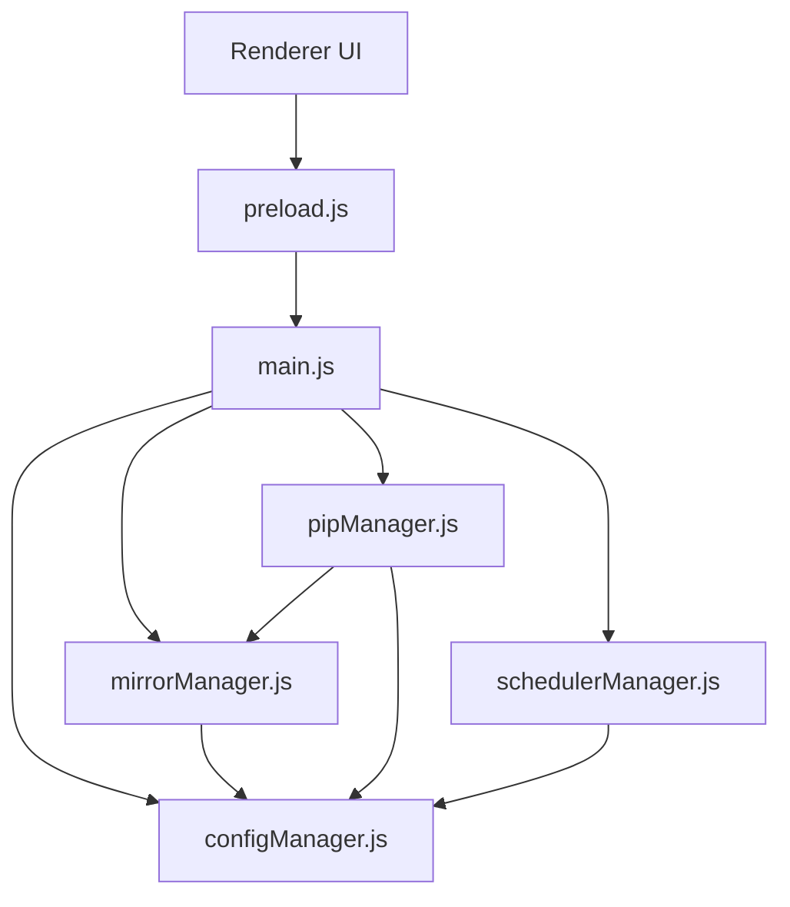
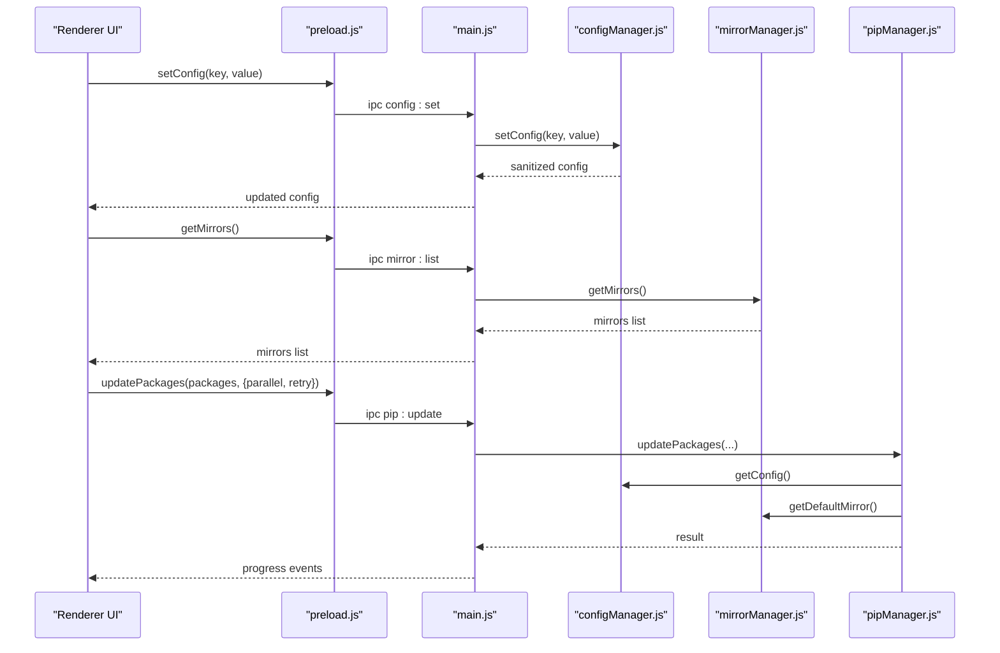
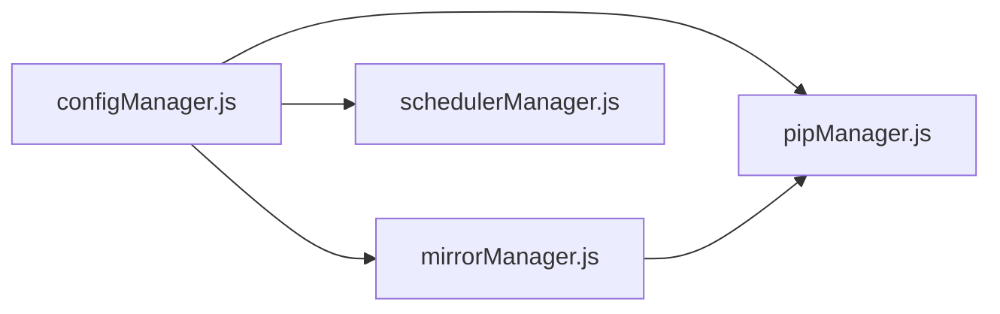

# Advanced Configuration

<cite>
**Referenced Files in This Document**
- [configManager.js](file://core/config/configManager.js)
- [mirrorManager.js](file://core/config/mirrorManager.js)
- [pipManager.js](file://core/operations/pipManager.js)
- [schedulerManager.js](file://core/config/schedulerManager.js)
- [main.js](file://main.js)
- [preload.js](file://preload.js)
</cite>

## Table of Contents
1. [Introduction](#introduction)
2. [Project Structure](#project-structure)
3. [Core Components](#core-components)
4. [Architecture Overview](#architecture-overview)
5. [Detailed Component Analysis](#detailed-component-analysis)
6. [Dependency Analysis](#dependency-analysis)
7. [Performance Considerations](#performance-considerations)
8. [Troubleshooting Guide](#troubleshooting-guide)
9. [Conclusion](#conclusion)

## Introduction
This document explains PyLibMaster’s advanced configuration options with a focus on performance and reliability:
- Parallel processing settings (parallelThreads, range 1–16)
- Retry mechanisms (retryCount, range 0–10)
- Smart routing configuration (smartRoute)
- Performance tuning parameters and their impact
It also covers value validation, automatic correction of invalid values, best practices for different system configurations, and troubleshooting guidance for performance issues and memory usage optimization.

## Project Structure
The configuration subsystem is centered around three modules:
- configManager.js: Centralized configuration persistence, default values, and value sanitization
- mirrorManager.js: Mirror source management and smart routing logic
- pipManager.js: Package operations that consume parallelThreads and retryCount
- schedulerManager.js: Scheduled updates that leverage the same configuration
- main.js and preload.js: IPC layer exposing configuration APIs to the UI

**Diagram sources**
- [main.js](file://main.js)
- [preload.js](file://preload.js)
- [configManager.js](file://core/config/configManager.js)
- [mirrorManager.js](file://core/config/mirrorManager.js)
- [pipManager.js](file://core/operations/pipManager.js)
- [schedulerManager.js](file://core/config/schedulerManager.js)

**Section sources**
- [configManager.js](file://core/config/configManager.js)
- [mirrorManager.js](file://core/config/mirrorManager.js)
- [pipManager.js](file://core/operations/pipManager.js)
- [schedulerManager.js](file://core/config/schedulerManager.js)
- [main.js](file://main.js)
- [preload.js](file://preload.js)

## Core Components
- Configuration manager provides:
  - Default values for parallelThreads and retryCount
  - Range limits and fallback behavior
  - Sanitization function to clamp or replace invalid values
- Mirror manager provides:
  - Smart routing toggle and effective mirror selection
  - Speed testing and ordering of mirrors
- Pip manager consumes configuration:
  - Uses parallelThreads to control concurrency
  - Uses retryCount to limit multi-mirror retries per operation
- Scheduler manager uses configuration for automated updates and persists scheduling state

Key configuration keys:
- parallelThreads: number, range 1–16, default 4
- retryCount: number, range 0–10, default 3
- smartRoute: boolean, default false

**Section sources**
- [configManager.js](file://core/config/configManager.js)
- [mirrorManager.js](file://core/config/mirrorManager.js)
- [pipManager.js](file://core/operations/pipManager.js)
- [schedulerManager.js](file://core/config/schedulerManager.js)

## Architecture Overview
The advanced configuration flows through IPC from the renderer to the main process, then into core modules. The configuration manager ensures all numeric inputs are validated and corrected before use by pip operations and mirror routing.

**Diagram sources**
- [preload.js](file://preload.js)
- [main.js](file://main.js)
- [configManager.js](file://core/config/configManager.js)
- [mirrorManager.js](file://core/config/mirrorManager.js)
- [pipManager.js](file://core/operations/pipManager.js)

## Detailed Component Analysis

### Configuration Manager: Validation and Correction
- Defaults:
  - parallelThreads defaults to 4
  - retryCount defaults to 3
- Range limits:
  - parallelThreads: min 1, max 16
  - retryCount: min 0, max 10
- Sanitization rules:
  - Non-number or non-finite values are replaced with the configured fallback
  - Numbers outside the allowed range are clamped to nearest valid boundary
  - Values are rounded to integers
- Persistence:
  - Atomic writes via temporary file + rename
  - Safe fallback to stderr if logging is unavailable during initialization

Impact:
- Ensures robustness against user input errors and corrupted config files
- Prevents extreme thread counts or retry attempts that could degrade performance or cause instability

**Section sources**
- [configManager.js](file://core/config/configManager.js)

### Mirror Manager: Smart Routing
- Smart route toggle:
  - When enabled, the fastest mirror is selected automatically based on speed tests
  - Speed test uses HEAD requests to a known package endpoint with timeout
- Effective mirror selection:
  - If smartRoute is true, pickBestMirror returns the fastest mirror
  - Otherwise, the user-set default mirror is used
- Writing pip configuration:
  - Writes index-url and timeout to pip.ini (Windows) or pip.conf (macOS/Linux)
- Reordering mirrors:
  - Allows users to prioritize mirrors; default mirror remains first unless overridden

Impact:
- Improves download reliability and speed under poor network conditions
- Reduces failures due to regional restrictions or slow mirrors

**Section sources**
- [mirrorManager.js](file://core/config/mirrorManager.js)

### Pip Manager: Parallel Processing and Retries
- Parallel installation/update:
  - runInParallel controls concurrency using parallelThreads
  - Threads are capped at the number of packages being processed
- Retry mechanism:
  - installOne/updateOne iterate over mirrors up to maxAttempts
  - maxAttempts is bounded by retryCount and available mirrors
  - Always tries multiple mirrors even without explicit retry flag
- Progress and rollback:
  - Emits structured progress events for each package status
  - Supports automatic rollback on failure when enabled

Impact:
- Higher parallelThreads increases throughput but may raise CPU and I/O contention
- Higher retryCount improves resilience but adds latency and network overhead

**Section sources**
- [pipManager.js](file://core/operations/pipManager.js)

### Scheduler Manager: Automated Updates
- Scheduling modes:
  - daily or weekly intervals
- Whitelist support:
  - Skips specified packages during auto-update
- Execution flow:
  - Lists outdated packages, filters whitelist, performs batch update with parallel and retry flags
- Status persistence:
  - lastRun timestamp stored in configuration

Impact:
- Keeps environments updated without manual intervention
- Can be tuned via frequency and whitelist to balance maintenance and stability

**Section sources**
- [schedulerManager.js](file://core/config/schedulerManager.js)

### IPC Layer: Exposing Configuration to UI
- preload.js exposes methods like setConfig, getConfig, setSmartRoute, getSmartRoute
- main.js registers handlers for config:get, config:set, config:setBulk, mirror:smartRoute, mirror:getSmartRoute
- UI can read/write configuration and toggle smart routing seamlessly

**Section sources**
- [preload.js](file://preload.js)
- [main.js](file://main.js)

## Dependency Analysis
Configuration dependencies:
- pipManager depends on configManager for parallelThreads and retryCount
- pipManager depends on mirrorManager for mirror selection and args
- mirrorManager reads smartRoute from configManager
- schedulerManager reads scheduler-related fields from configManager

**Diagram sources**
- [configManager.js](file://core/config/configManager.js)
- [pipManager.js](file://core/operations/pipManager.js)
- [mirrorManager.js](file://core/config/mirrorManager.js)
- [schedulerManager.js](file://core/config/schedulerManager.js)

**Section sources**
- [configManager.js](file://core/config/configManager.js)
- [pipManager.js](file://core/operations/pipManager.js)
- [mirrorManager.js](file://core/config/mirrorManager.js)
- [schedulerManager.js](file://core/config/schedulerManager.js)

## Performance Considerations
- parallelThreads:
  - Recommended starting point: 4
  - Increase on systems with high CPU cores and fast SSD storage
  - Decrease on systems with limited RAM or slower disks to avoid contention
- retryCount:
  - Start with 3 for balanced resilience and speed
  - Increase to 5–7 in unstable networks; keep below 10 to prevent excessive delays
- smartRoute:
  - Enable for regions with unreliable access to official PyPI
  - Disable if you have a curated mirror setup and want deterministic behavior
- Memory usage:
  - High parallelThreads can increase memory pressure due to concurrent processes
  - Use moderate concurrency and enable rollback only when necessary
- Disk I/O:
  - Avoid running heavy disk operations concurrently with large installs
  - Prefer sequential updates for environments with many small packages

[No sources needed since this section provides general guidance]

## Troubleshooting Guide
Common symptoms and remedies:
- Slow downloads or frequent timeouts:
  - Enable smartRoute to automatically select faster mirrors
  - Test mirrors and reorder them to prioritize reliable ones
- Frequent install/update failures:
  - Increase retryCount moderately
  - Ensure correct Python environment and pip availability
- High CPU or memory usage:
  - Reduce parallelThreads to match hardware capabilities
  - Monitor background tasks and avoid overlapping heavy operations
- Corrupted or missing configuration:
  - The system will rebuild defaults and persist safe values
  - Check logs for save failures and ensure write permissions

Diagnostic steps:
- Use healthCheck to detect dependency conflicts and broken metadata
- Export logs and review actions related to config saves and mirror tests
- Validate current configuration via getConfig and inspect ranges

**Section sources**
- [pipManager.js](file://core/operations/pipManager.js)
- [mirrorManager.js](file://core/config/mirrorManager.js)
- [configManager.js](file://core/config/configManager.js)

## Conclusion
PyLibMaster’s advanced configuration centers on robust validation and intelligent runtime behavior:
- parallelThreads and retryCount are safely constrained and applied consistently across operations
- smartRoute enhances reliability by selecting optimal mirrors dynamically
- Proper tuning of these settings yields better performance and stability across diverse environments
Use the provided guidelines and troubleshooting steps to optimize your setup according to system capabilities and network conditions.